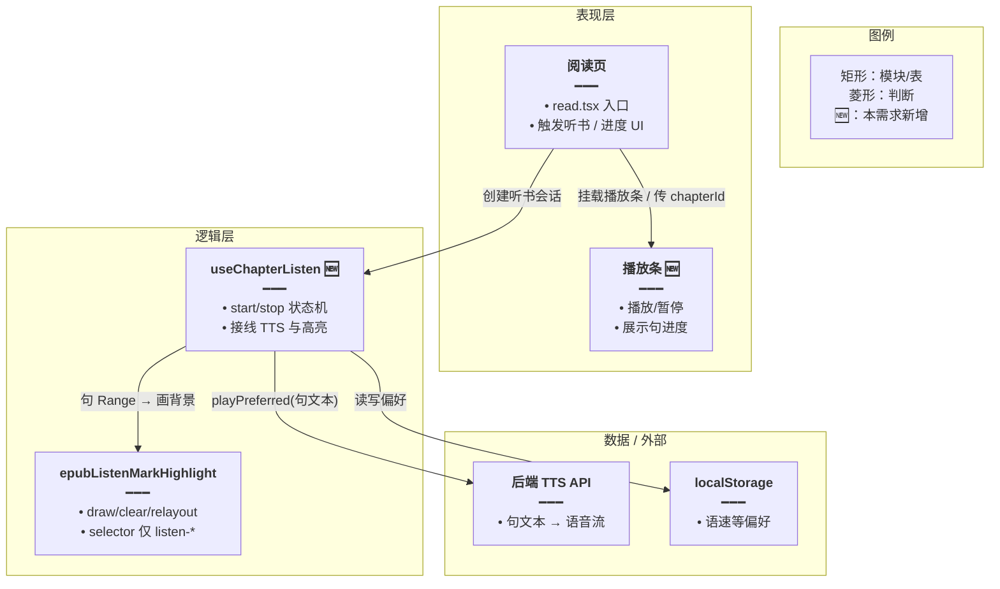
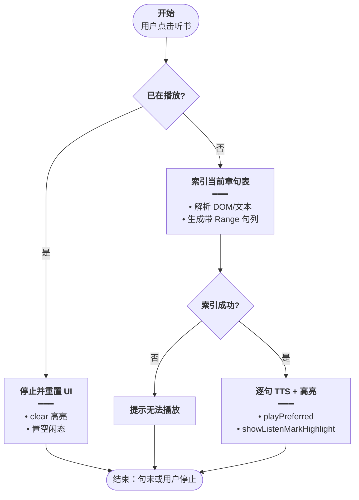
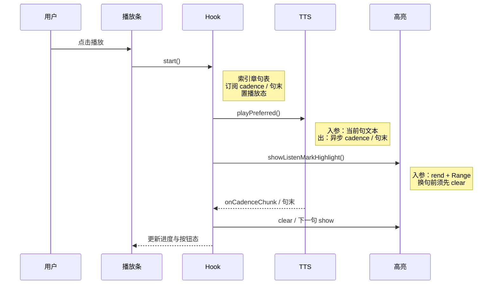
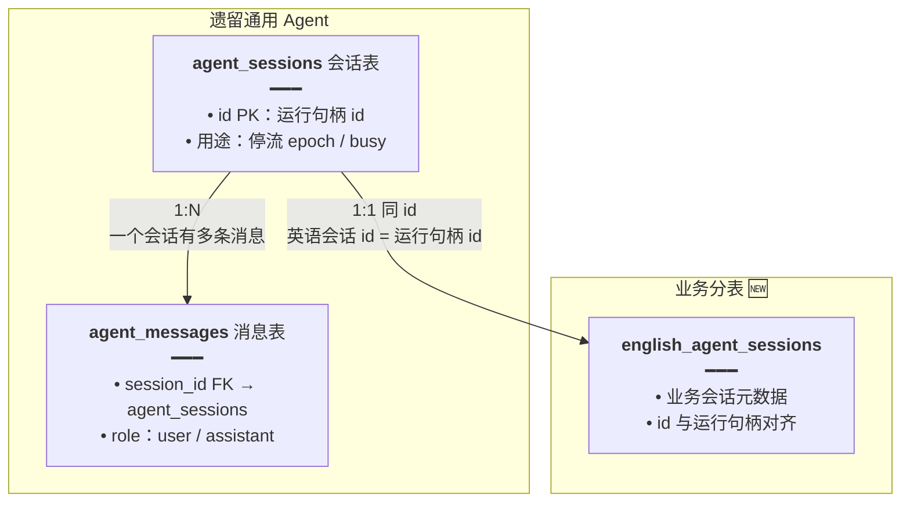
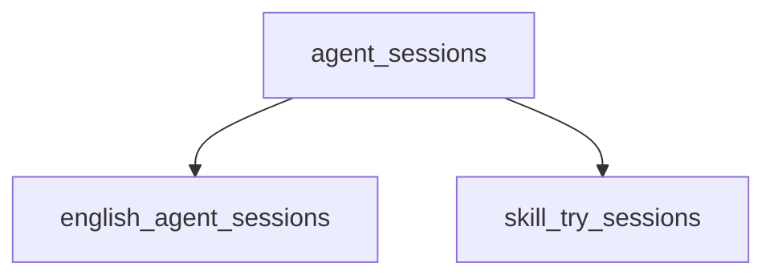

# Mermaid 图规范（feature-implementation-idea）

规划文档须 **图多、字精**；读者应能 **只看 §4～§6 三图** 即理解八成方案。  
**禁止**用 ASCII 字符画；架构图、流程图、时序图、状态图一律用 ` ```mermaid ` 代码块。

本规范要求：**节点内写清职责要点、连线带语义标签、时序详情进 Note**；并保留本 Skill 的 **「图内方法说明」表**（callable 权威释义）。

## 1. 必填三图

| 图 | 类型 | 最低要求 |
|----|------|----------|
| 架构图 | `flowchart TB` / `graph TD` / `graph LR` | ≥4 节点；标出 UI / 逻辑 / 数据 / 外部服务；**新增**节点后缀 `🆕` 或 subgraph 标题含「新增」；节点含要点列表；连线有语义标签 |
| 主流程图 | `flowchart TD` | 有明确 **开始/结束**（圆角）；≥1 个决策菱形 `{}`；分支线标注「是/否」等；失败路径写清；连线有语义标签 |
| 时序图 | `sequenceDiagram` | ≥3 参与者；消息线 **只写短方法名/事件名**；详细参数放 `Note right of`；主路径 ≤15 步，过长则拆「子流程图」 |

可选第四图：**状态图** `stateDiagram-v2`（播放态、编辑态、互斥模式）。

## 2. 通用要求（节点 / 连线 / 分组 / 图例）

### 2.1 节点必须有说明文字（不能只写名称）

推荐节点文案格式：

```text
["<b>节点名称</b><br/>━━━<br/>• 要点一<br/>• 要点二"]
```

- `<b>名称</b>`：加粗的节点标题（模块名 / 表名 / 步骤名）
- `━━━`：分隔线
- `•`：要点列表——该节点的作用、输入输出、关键字段/逻辑（1～3 条即可）
- 节点内换行用 `<br/>`，不要让单行文字过长
- 节点 ID 用英文 camelCase 或短拼音缩写；**显示文字用中文**（可混技术专有词）

**架构图 / 关系图**：表或模块节点须写清用途与关键字段。  
**主流程图**：步骤节点写清「做什么」；判断用菱形 `{}`，分支线上标注判断结果（是/否、命中/未命中）。  
**纯用户动作**（「用户点击听书」）可短写，不必硬塞字段列表。

### 2.2 连线必须带语义标签

每条连线须说明 **传递了什么 / 为何连接**，禁止空箭头或只有无信息量的 `1:N`：

```text
A -- "用户消息 + skillIds<br/>写入业务消息表" --> B
```

关系图可用简短语义，例如：`1:1 同 id：英语会话 id = 运行句柄 id`（仍须一句说清含义）。

### 2.3 subgraph 分组

用 `subgraph` 按 **业务域 / 分层 / 阶段** 分组，标题写清楚这组是什么：

```text
subgraph UI["表现层"]
```

避免单图超过 **25 个节点**；超出则拆「总览架构」+「子模块详图」。

### 2.4 图例（每张图建议有）

在图内增加简短图例节点（或独立 `subgraph Legend`），说明矩形、菱形、圆角、箭头、🆕 等符号含义，避免读者猜图例。

### 2.5 图内方法须有功能说明（必填）

读者应 **只看图 + 方法表** 即知每个 callable **干什么**。  
**节点内要点**负责「模块/步骤一眼懂」；**方法表**负责函数级权威释义——二者互补，不互相替代。

**覆盖范围**（该图出现即须入表，不可遗漏）：

| 图类型 | 须说明的符号 |
|--------|--------------|
| 架构图 | 以 **函数/方法名** 命名的节点；纯模块/文件节点的职责已在节点要点中写清时可只入读图要点，callable 仍须入表 |
| 主流程图 | 映射到真实函数的步骤；纯用户动作步骤不入表 |
| 时序图 | 每条 **带方法名** 的箭头消息；`participant` 若代表 Hook/Util，首现时在表内说明其 **对外入口方法** |
| 状态图 | 迁移边上的 **guard / 触发函数**（若有） |

**图下固定结构**（顺序不可颠倒）：

1. Mermaid 代码块  
2. **`图内方法说明`** 表（必填，一图一表；该图无 callable 时可写「本图无独立 callable，职责见节点要点」）  
3. **`读图要点`**（2～4 句，讲分层/分支/决策，**不重复**表内释义）

**方法表格式**：

```markdown
**图内方法说明**：

| 方法 | 功能 |
|------|------|
| `syncEpubReadingAnnotations(...)` | 编排用户线与想法线：invalidate → apply → patch → restack；换章/数据变更时由 EpubPane 调用 |
| `showListenMarkHighlight(rend, range)` | 在当前句 DOM Range 上绘制淡黄播放背景 SVG rect；换句前须先 clear |
| `start()` | 进入听书会话：索引章句表、绑定 TTS cadence 与 UI 进度 |
```

**功能列写法**（每条 1～2 句，简体中文）：

- **做什么**（主语 + 动词 + 对象）
- **何时/谁调用**（若从图上下文不 obvious）
- **关键副作用**（写 DOM / 调 API / 清哪一层）— 仅在有歧义时写

**图中 callable 标注**：

- 节点标题可含短方法名；职责用 `•` 要点概括（1～2 条）
- 时序消息线只写短方法名；完整参数/返回值进 `Note` + 方法表
- **禁止**把整段说明只塞进超长节点且省略方法表

**反例**：

| 反例 | 问题 |
|------|------|
| 节点只有 `agent_sessions` 无要点 | 信息量为零 |
| 连线无标签或只写 `-->` | 看不出数据流 |
| 图里 10 个函数，表只列 3 个「关键的」 | 读者看不懂其余节点 |
| 功能列写「见上文」「处理逻辑」 | 无信息量 |
| 读图要点逐条复述表中功能 | 重复；要点应讲 **结构与决策** |

## 3. 各图类型细则

### 3.1 flowchart / graph（架构图、流程图、关系图）

- 处理步骤用矩形 `[]`，判断用菱形 `{}`，起止用圆角 `([""])`
- 架构/关系优先 `graph TD` / `flowchart TB`；横向关系可用 `LR`
- 连线标签写清楚数据流或执行关系

### 3.2 sequenceDiagram（时序图）

- 消息线上的文字必须 **简短**（只写方法名/事件名），**禁止**把完整参数列表写在消息线上
- 详细参数、返回值、说明放到 `Note right of 参与者:` 中，用 `<br/>` 分行
- 参与者名称用简短中文或短别名（如 `前端`、`Store`），不要带长角色后缀
- 优先用 `Note right of` 而非 `Note over`，避免 Note 框挡住消息线
- 写法：`participant U as 用户`、`participant FE as 前端`

### 3.3 stateDiagram-v2（可选）

- 状态名用中文；迁移条件写在边上
- 有 guard/触发函数时，边上短写名称，表中展开

## 4. 架构图正面示例



**图内方法说明**：

| 方法 / 模块入口 | 功能 |
|-----------------|------|
| `useChapterListen`（Hook） | 听书会话状态机：start/stop、句序、与 TTS/高亮模块接线 |
| `epubListenMarkHighlight` | 播放句背景 draw/clear/relayout；selector 仅 `moke-epub-listen-*` |

**读图要点**：表现层只负责触发与展示；新增逻辑集中在 Hook；高亮 Util 与 TTS API 解耦。

## 5. 主流程图正面示例



**图内方法说明**：

| 方法 | 功能 |
|------|------|
| `indexChapterSentences()` | 解析当前章 DOM/文本，生成带 Range 的句序列表；失败则无法播放 |
| `playPreferred(text)` | TTS 播放单句；cadence/句末回调驱动高亮切换 |
| `showListenMarkHighlight(rend, range)` | 在 marks-pane 绘制当前句淡黄底；与 TTS 并行触发 |

## 6. 时序图正面示例



**图内方法说明**：

| 方法 | 功能 |
|------|------|
| `start()` | UI 触发后进入听书：索引句表、订阅 TTS 回调、置播放态 |
| `playPreferred(text)` | 向 TTS 层提交句文本；异步返回 cadence/句末事件 |
| `showListenMarkHighlight(range)` | 按词级 Range 在 SVG 画播放背景；换句前先 clear |
| `clearListenMarkHighlight()` | 移除 `g.moke-epub-listen-*`；不影响用户划线/想法层 |

## 7. 关系图正面示例（数据/表边界）



## 8. 反面示例（禁止）

### 8.1 空信息节点 / 空连线



问题：节点无职责说明，连线无语义。

### 8.2 其它禁止项

| 反例 | 问题 |
|------|------|
| 只有 ASCII 框图、无 Mermaid | 难维护、无法渲染 |
| 架构图只有 2 个框「前端→后端」 | 信息量为零 |
| 时序图消息线塞满参数列表 | 难读且易挡线；应放 Note |
| 时序图仅 UI 内部调用、无用户/外部 | 看不出端到端 |
| 图与正文逐字重复 | 浪费；图应 **结构化**，正文讲 **决策** |
| 图中有方法名但无 **图内方法说明** 表 | 读者不知各函数职责 |
| 方法表遗漏图中出现的函数 | 表须与该图 **一一对应** |

## 9. 渲染注意

- 节点文字含特殊字符时用双引号：`A["步骤 A：初始化"]`。
- 节点内用 `<br/>` 换行是 **推荐做法**（要点列表）；若渲染后文字重叠、布局混乱：优先 **缩短节点/连线文字**，把详情移到 `Note` 或 **拆成多张图**，而不是删掉要点改回「只留名称」。
- 若 Mermaid 报错，简化节点名/去掉个别 HTML 标签后再试，**不要删图**。
- GitHub / Cursor Markdown 预览均支持 Mermaid；无需导出图片。
