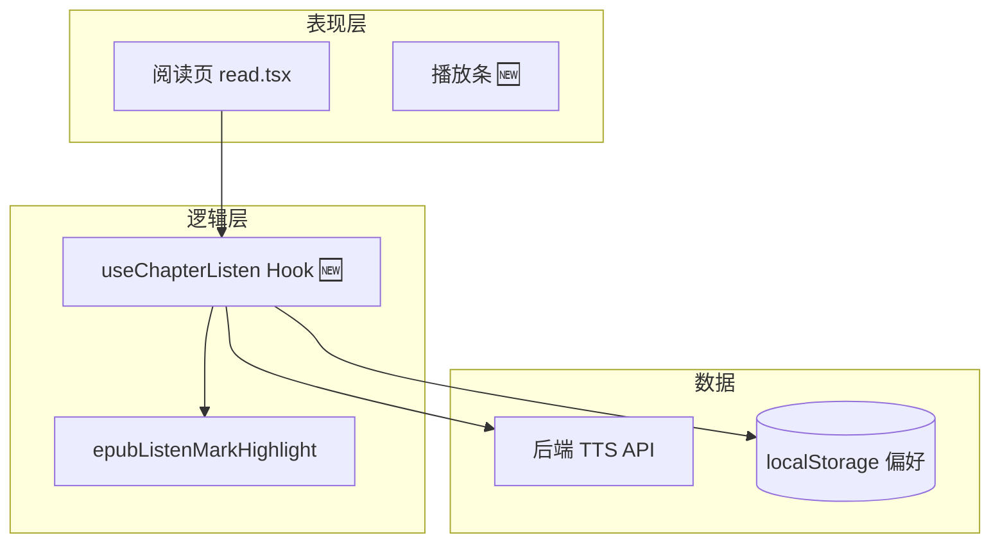
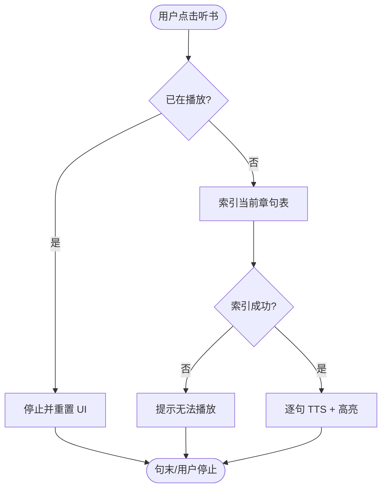
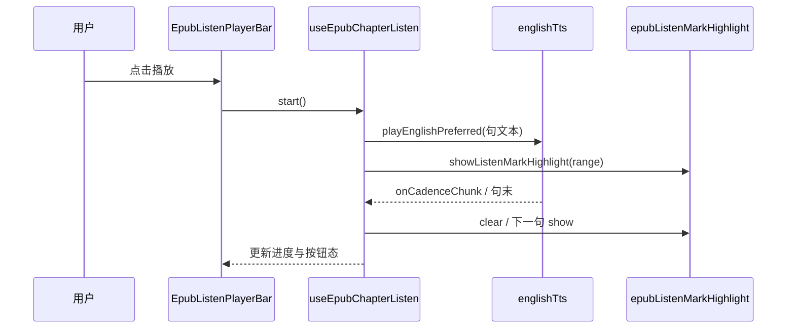

# Mermaid 图规范（feature-implementation-idea）

规划文档须 **图多、字精**；读者应能 **只看 §4～§6 三图** 即理解八成方案。

## 1. 必填三图

| 图 | 类型 | 最低要求 |
|----|------|----------|
| 架构图 | `flowchart TB` / `graph LR` | ≥4 节点；标出 UI / 逻辑 / 数据 / 外部服务；**新增**节点后缀 `🆕` 或 subgraph 标题含「新增」 |
| 主流程图 | `flowchart TD` | 有明确 **开始/结束**；≥1 个决策菱形 `{条件?}`；失败路径用虚线或「否→提示」 |
| 时序图 | `sequenceDiagram` | ≥3 参与者（用户、前端、后端/API…）；主路径 ≤15 步，过长则拆「子流程图」 |

可选第四图：**状态图** `stateDiagram-v2`（播放态、编辑态、互斥模式）。

## 2. 命名与可读性

- 节点 ID 用英文 camelCase 或短拼音缩写；**显示文字用中文**（`A[用户点击听书]`）。
- 参与者：`participant U as 用户`、`participant FE as 前端 EpubPane`。
- 避免单图超过 **25 个节点**；超出则拆「总览架构」+「子模块详图」。
- 子图用 `subgraph 名称 [中文标题]` 分组。

### 2.1 图内方法须有功能说明（必填）

读者应 **只看图 + 方法表** 即知每个 callable **干什么**，不必翻 §8 或源码。

**覆盖范围**（该图出现即须入表，不可遗漏）：

| 图类型 | 须说明的符号 |
|--------|--------------|
| 架构图 | 以 **函数/方法名** 命名的节点（如 `applyEpubUserHighlights`）；纯模块/文件节点可入 **「节点说明」** 子表 |
| 主流程图 | 映射到真实函数的步骤（如 `syncEpubReadingAnnotations`）；纯用户动作步骤（「用户点击」）不入表 |
| 时序图 | 每条 **带方法名** 的箭头消息；`participant` 若代表 Hook/Util 模块，首现时在表内说明其 **对外入口方法** |
| 状态图 | 迁移边上的 **guard / 触发函数**（若有） |

**图下固定结构**（顺序不可颠倒）：

1. Mermaid 代码块  
2. **`图内方法说明`** 表（必填，一图一表）  
3. **`读图要点`**（2～4 句，讲分层/分支/决策，不重复表内释义）

**方法表格式**：

```markdown
**图内方法说明**：

| 方法 | 功能 |
|------|------|
| `syncEpubReadingAnnotations(...)` | 编排用户线与想法线：invalidate → apply → patch → restack；换章/数据变更时由 EpubPane 调用 |
| `showListenMarkHighlight(rend, range)` | 在当前句 DOM Range 上绘制淡黄播放背景 SVG rect；换句前须先 clear |
| `start()` | 进入听书会话：索引章句表、绑定 TTS cadence 与 UI 进度 |
```

**功能列写法**（每条 1～2 句，简体中文）：

- **做什么**（主语 + 动词 + 对象）
- **何时/谁调用**（若从图上下文不 obvious）
- **关键副作用**（写 DOM / 调 API / 清哪一层）— 仅在有歧义时写

**图中标注（与表配合，二选一或并用）**：

- **推荐**：图内保持 **短方法名**，完整释义放表（表是权威来源，避免节点过长导致 Mermaid 报错）。
- **可选**：节点或箭头消息加 **极短后缀**（≤8 字），用 ` · ` 分隔：`UI->>H: start() · 索引句表`；仍须在表中展开，不可只写后缀。

**反例**：

| 反例 | 问题 |
|------|------|
| 图里 10 个函数，表只列 3 个「关键的」 | 读者看不懂其余节点 |
| 功能列写「见上文」「处理逻辑」 | 无信息量 |
| 把方法说明全塞进节点 `A["fn()：很长很长…"]` | 难渲染；应拆到表 |
| 读图要点逐条复述表中功能 | 重复；要点应讲 **结构与决策** |

## 3. 架构图示例（骨架）



**图内方法说明**（架构图示例 — 仅列 callable 节点；纯 UI 模块见读图要点）：

| 方法 / 模块入口 | 功能 |
|-----------------|------|
| `useChapterListen`（Hook） | 听书会话状态机：start/stop、句序、与 TTS/高亮模块接线 |
| `epubListenMarkHighlight` | 播放句背景 draw/clear/relayout；selector 仅 `moke-epub-listen-*` |

## 4. 主流程图示例（骨架）



**图内方法说明**（主流程图 — 映射到函数的步骤）：

| 方法 | 功能 |
|------|------|
| `indexChapterSentences()` | 解析当前章 DOM/文本，生成带 Range 的句序列表；失败则无法播放 |
| `playEnglishPreferred(text)` | TTS 播放单句；cadence/句末回调驱动高亮切换 |
| `showListenMarkHighlight(rend, range)` | 在 marks-pane 绘制当前句淡黄底；与 TTS 并行触发 |

## 5. 时序图示例（骨架）



**图内方法说明**：

| 方法 | 功能 |
|------|------|
| `start()` | UI 触发后进入听书：索引句表、订阅 TTS 回调、置播放态 |
| `playEnglishPreferred(text)` | 向 TTS 层提交句文本；异步返回 cadence/句末事件 |
| `showListenMarkHighlight(range)` | 按词级 Range 在 SVG 画播放背景；换句前先 clear |
| `clearListenMarkHighlight()` | 移除 `g.moke-epub-listen-*`；不影响用户划线/想法层 |

## 6. 反例（禁止）

| 反例 | 问题 |
|------|------|
| 只有 ASCII 框图、无 Mermaid | 难维护、无法渲染 |
| 架构图只有 2 个框「前端→后端」 | 信息量为零 |
| 时序图仅 UI 内部调用、无用户/外部 | 看不出端到端 |
| 图与正文逐字重复 | 浪费；图应 **结构化**，正文讲 **决策** |
| 图中有方法名但无 **图内方法说明** 表 | 读者不知各函数职责 |
| 方法表遗漏图中出现的函数 | 表须与该图 **一一对应** |
| 使用 HTML `<br/>` 撑布局 | 优先缩短节点文案 |

## 7. 渲染注意

- 节点文字含特殊字符时用双引号：`A["步骤 A：初始化"]`。
- 若 Mermaid 报错，简化节点名而非删图。
- GitHub / Cursor Markdown 预览均支持 Mermaid；无需导出图片。
