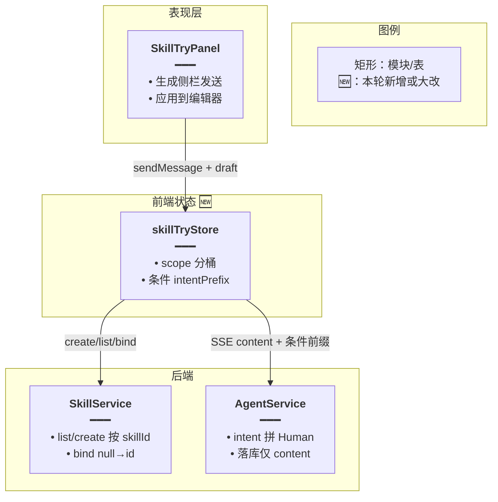
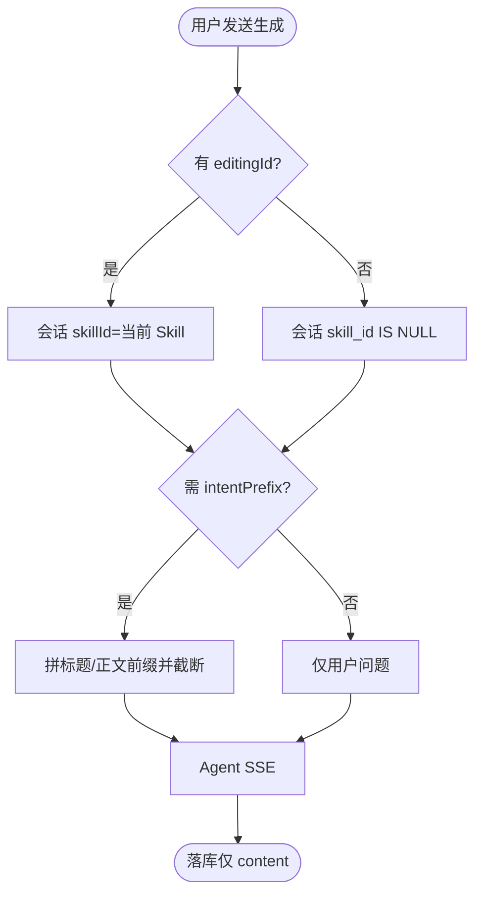
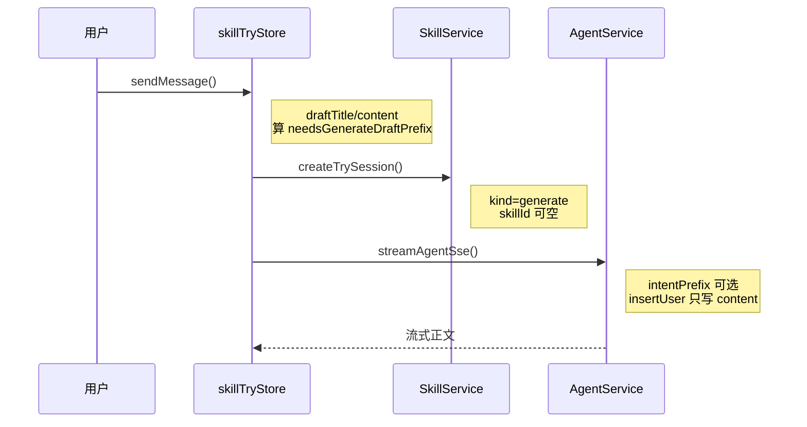
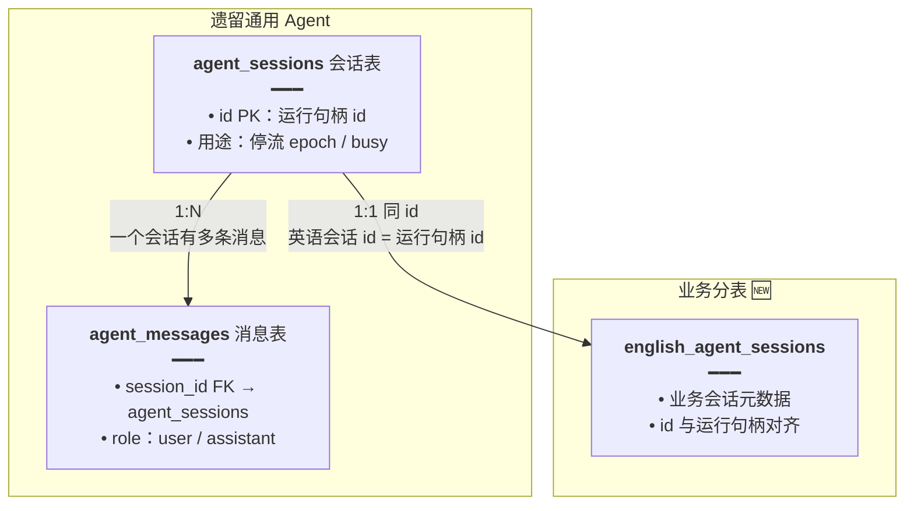
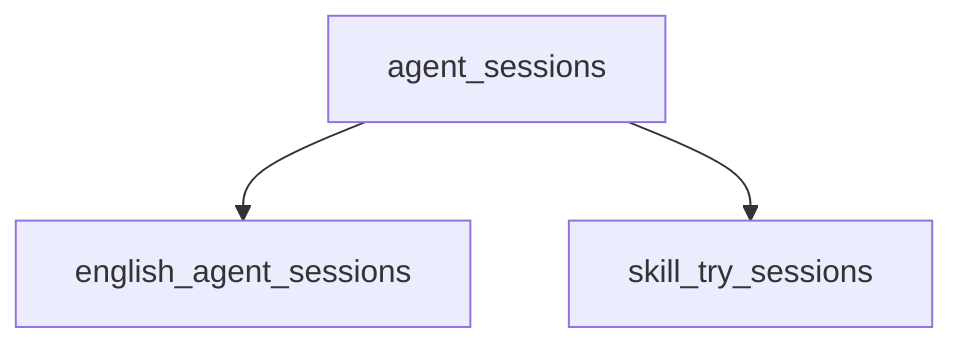

# Mermaid 图规范（implementation-doc-from-diff）

专题实现文须用 **Mermaid** 辅助说明改动后的架构、主流程与跨模块调用；**禁止** ASCII 字符画。  
本规范要求：**节点内写清职责要点、连线带语义标签、时序详情进 Note**。

复杂逻辑（跨 ≥2 模块、有分支、或含数据落库/SSE）时，**至少**提供下列之一；推荐 **架构图 + 主流程或时序** 成对出现，让读者不读大段散文也能看懂改动落点。

## 1. 推荐图类型

| 图 | 类型 | 何时必画 / 最低要求 |
|----|------|---------------------|
| 架构图 / 关系图 | `flowchart TB` / `graph TD` / `graph LR` | 改动跨 UI / Store / API / DB 时；≥4 节点；**本轮新增/大改**节点标 `🆕`；节点含要点；连线有语义标签 |
| 主流程图 | `flowchart TD` | 有分支、失败路径或「改前 vs 改后」行为分叉时；起止圆角；≥1 决策菱形；分支标注是/否 |
| 时序图 | `sequenceDiagram` | 跨模块调用链（前后端、SSE、分表写入）时；≥3 参与者；消息线短；详情进 `Note right of` |
| 实体关系 | `graph TD` | 表结构 / 同 id 双表 / FK 语义变更时；节点写用途与关键字段 |

可选：`stateDiagram-v2`（模式切换、busy/idle、编辑态）。

## 2. 通用要求（节点 / 连线 / 分组 / 图例）

### 2.1 节点必须有说明文字（不能只写名称）

推荐格式：

```text
["<b>节点名称</b><br/>━━━<br/>• 要点一<br/>• 要点二"]
```

- `<b>名称</b>`：加粗标题（模块名 / 表名 / 步骤名）
- `━━━`：分隔线
- `•`：1～3 条要点——作用、输入输出、关键字段/本轮改动点
- 节点内换行用 `<br/>`，避免单行过长
- 节点 ID 用英文 camelCase 或短拼音；**显示文字用中文**（可混技术专有词）

**架构 / 关系图**：表或模块须写清用途与关键字段。  
**流程图**：步骤写清「做什么」；判断用菱形 `{}`，分支线标注命中/未命中、是/否。  
**纯用户动作**可短写，不必硬塞字段列表。

### 2.2 连线必须带语义标签

每条连线说明 **传递了什么 / 为何连接**，禁止空箭头或只有无信息量的 `1:N`：

```text
A -- "用户消息 + skillIds<br/>写入业务消息表" --> B
```

关系语义示例：`1:1 同 id：英语会话 id = 运行句柄 id`（仍须一句说清含义）。

### 2.3 subgraph 分组

按 **业务域 / 分层 / 改动前后阶段** 分组，标题写清楚：

```text
subgraph UI["表现层"]
subgraph Changed["本轮改动 🆕"]
```

单图超过 **25 个节点** 则拆「总览」+「子模块详图」。

### 2.4 图例（每张图建议有）

用独立节点或 `subgraph Legend` 说明矩形、菱形、圆角、箭头、🆕 等含义。

### 2.5 图下读图要点（推荐）

每张 Mermaid 块下方用 **2～4 句**「读图要点」点出：本轮新增边界、与改前差异、关键数据落点。不必强制「图内方法说明」表（与 `feature-implementation-idea` 不同）；若图中出现多个关键函数名，可用简表列出职责，避免读者猜。

## 3. 各图类型细则

### 3.1 flowchart / graph

- 处理用矩形 `[]`，判断用菱形 `{}`，起止用圆角 `([""])`
- 架构/关系优先 `graph TD` / `flowchart TB`；横向用 `LR`
- 连线标签写清数据流或执行关系

### 3.2 sequenceDiagram

- 消息线**只写**短方法名/事件名，**禁止**完整参数列表
- 参数、返回值、本轮改动说明放 `Note right of 参与者:`，用 `<br/>` 分行
- 参与者用短名（`前端`、`Store`、`AgentService`）
- 优先 `Note right of`，避免 `Note over` 挡线

### 3.3 与「改动前/改动后」的关系

- 图描述的是 **改动后** 行为（默认）；若需对比，可用两张小图或在节点要点中写「改前：… / 改后：…」
- 图 **不能** 代替 §4 的成对代码块与逐行注释

## 4. 架构图正面示例



**读图要点**：生成会话按编辑器锚定；正文只经 ephemeral 前缀进模型，不进消息表。

## 5. 主流程图正面示例



## 6. 时序图正面示例



## 7. 关系图正面示例



## 8. 反面示例（禁止）

### 8.1 空信息节点 / 空连线



问题：节点无职责说明，连线无语义。

### 8.2 其它禁止项

| 反例 | 问题 |
|------|------|
| ASCII 框图代替 Mermaid | 难维护、预览不渲染 |
| 架构图只有「前端→后端」两框 | 信息量为零 |
| 时序消息线塞满参数列表 | 难读；应放 Note |
| 用图代替改动前/后代码块 | 违反本 Skill 硬约束 §2 |
| 复杂跨模块改动正文零图 | 读者难定位数据流 |

## 9. 渲染注意

- 特殊字符节点文案用双引号：`A["步骤：初始化"]`
- `<br/>` 换行是**推荐**做法；重叠/混乱时缩短文案、详情移 Note 或拆图，勿退化成「只留名称」
- Mermaid 报错时简化节点名，**不要删图**
- GitHub / Cursor 预览均支持 Mermaid，无需导出图片
