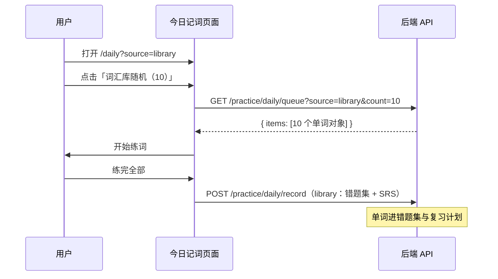

# 今日记词 · 词汇库随机获取逻辑 SPEC（通俗详解版）

> **一句话**：把用户**所有词汇库**里的生词**合并成一个大池子**，在数据库里**随机抽出最多 10 个**，返回给「今日记词」练习。  
> **实现文件**：`apps/backend/src/services/english-learning/english-learning.service.ts`  
> **HTTP**：`GET /english-learning/practice/daily/queue`、`GET /english-learning/practice/daily/summary`  
> **版本**：v2（2026-05-29，SQL 随机版）

---

## 0. 先读这一段就懂 80%

### 0.1 用户眼里发生了什么？

1. 用户在侧栏或页面点 **「词汇库随机」**
2. 浏览器打开 `/english-learning/daily?source=library`
3. 用户再点 **「开始」**
4. 屏幕上出现 10 个（或更少）单词，开始「听 → 认 → 四选一」
5. 练完后，这些词会进入 **复习计划**；下次「词汇库随机」**不会再抽到它们**

### 0.2 系统背后做了什么？

```
你账号下的所有词汇库（TAS 托福、四级、自定义…）
        ↓ 全部合并（不是随机选一个库）
        ↓ 去掉：没释义的、已经练过进复习计划的、重复的词
        ↓ 数据库 ORDER BY RAND() 随机
        ↓ 只取 10 条返回
```

### 0.3 三个最容易搞错的点

| 误解 | 真相 |
|------|------|
| 「先随机选一个单词库，再从那个库里抽」 | ❌ **不是**。所有库的词**混在一起**再随机。 |
| 「词汇库里每个词都能被抽到」 | ❌ **不是**。已经练过、进了复习计划的词会被排除。 |
| 「会把 5000 个词全部下载到服务器内存再洗牌」 | ❌ **不是**（已优化）。数据库里过滤 + 随机，**只返回 10 行**。 |

---

## 1. 这个功能是干什么的？

### 1.1 产品目标

「今日记词」有两种开练方式，由 URL 参数 `source` 区分：

| `source` 值 | 人话 | 词从哪来 |
|-------------|------|----------|
| `review`（默认） | 复习待背词 | 复习计划里**今天到期**的词 |
| `library` | 词汇库随机 | 词汇库里**还没练过**的生词，**随机**抽 |

**本文档只讲 `source=library`（词汇库随机）。**

### 1.2 为什么不和「复习」混在一起？

- **复习**：有日程，按「到期时间」排队，像作业本里今天该做的题。
- **词汇库随机**：从词库里摸盲盒，像从单词书里随机翻一页。

一次请求**只会走其中一条路**，不会「先复习 5 个再随机 5 个」。

### 1.3 明确不做的事

- 拉队列时**不写数据库**（不自动加错题、不改复习计划）
- **不查收藏表、错题表**来组队列（只读词汇库表）
- **不保证**一定返回满 10 个（候选不够就返回实际数量）

---

## 2. 涉及哪些表？（用仓库比喻）

想象你是一个用户，你的数据是这样放的：

### 2.1 `english_vocabulary_library` — 货架标签

每个「单词库包」一条记录，例如：

| id | title | word_count |
|----|-------|------------|
| lib-1 | TAS 托福词汇 | 5200 |
| lib-2 | 四级核心词 | 800 |

这只是**包的说明书**，不是具体单词。

### 2.2 `english_vocabulary_library_item` — 货架上的货

每个单词一行，**真正用来出题的数据**：

| user_id | library_id | word | translation_zh | ipa | example | … |
|---------|------------|------|----------------|-----|---------|---|
| 100 | lib-1 | apple | 苹果 | … | … | … |
| 100 | lib-1 | banana | 香蕉 | … | … | … |
| 100 | lib-2 | apple | 苹果 | … | … | … |

**词汇库随机的原料就是这张表。**

查询条件只有 `user_id = 你`，**没有** `library_id = 某一个库`  
→ 所以 TAS + 四级 + 所有库 **全部合并**。

### 2.3 `english_practice_review_state` — 复习日程本

记录「这个词下次什么时候该复习」：

| user_id | content_kind | item_key | next_review_at |
|---------|--------------|----------|----------------|
| 100 | vocab | apple | 2026-06-01 |

只要这里**有这一行**，系统就认为：**apple 已经进过复习计划了**  
→ **词汇库随机不会再抽 apple**（改走「复习待背」）。

---

## 3. 从点击到返回：完整链路（逐步）

### 3.1 前端（用户操作）



**文件位置**：

| 步骤 | 文件 |
|------|------|
| 读 `source=library` | `apps/frontend/.../daily/index.tsx` |
| 点按钮调 API | `apps/frontend/.../daily/utils/loadDailyCards.ts` |
| 练完上报 | `apps/frontend/.../daily/components/DailyCardSession.tsx` |

**重要**：进入 Intro 页**不会自动拉词**，必须用户**手动点「开始」**。

### 3.2 后端（收到请求后）

```
HTTP GET /practice/daily/queue?source=library&count=10
        ↓
Controller：检查登录 → 解析 count、source、excludeKeys
        ↓
Service.getDailyMemorizeQueue()
        ↓
发现 source === 'library'
        ↓
pickLibraryMemorizeItems(userId, limit=10, exclude, usedKeys)
        ↓
数据库：过滤 + 去重 + ORDER BY RAND() LIMIT 10
        ↓
mapVocabLibraryItemToDailyItem() 转成 JSON
        ↓
返回 { items: [...] }
```

**文件位置**：

| 层级 | 文件 / 函数 |
|------|-------------|
| 路由 | `english-learning.controller.ts` → `getDailyMemorizeQueue` |
| 入口 | `getDailyMemorizeQueue` |
| 随机核心 | `pickLibraryMemorizeItems` |
| 过滤条件 | `createLibraryMemorizeEligibleQueryBuilder` |
| 字段映射 | `mapVocabLibraryItemToDailyItem` |

---

## 4. 核心问题：怎么判断一个词「能不能被随机抽到」？

对每个单词，系统按下面顺序做 **4 道关卡**。任何一关不过，就**淘汰**。

### 关卡 1：必须是你的词

```sql
item.user_id = 当前登录用户
```

别人的库，你看不到，也抽不到。

### 关卡 2：必须有中文释义

```sql
TRIM(item.translation_zh) <> ''
```

没有释义就没法出「四选一」，直接跳过。

**例子**：

| word | translation_zh | 结果 |
|------|------------------|------|
| apple | 苹果 | ✅ 通过 |
| xyz | （空） | ❌ 淘汰 |

### 关卡 3：必须还没进过复习计划

```sql
LEFT JOIN english_practice_review_state rs
  ON rs.user_id = item.user_id
 AND rs.content_kind = 'vocab'
 AND rs.item_key = LOWER(TRIM(item.word))
WHERE rs.id IS NULL   -- 复习表里没有记录
```

**人话**：这个词你**从来没在今日记词/复习里练过并上报过**，才能从词汇库随机里出现。

**例子**：

| word | 复习表里有记录？ | 结果 |
|------|------------------|------|
| apple | 无 | ✅ 通过 |
| banana | 有（昨天练过） | ❌ 淘汰 |

### 关卡 4：多个库里有同一个词 → 只留一个

同一个用户可能在「TAS 托福」和「四级」里都导入了 `apple`。

系统用规范化 key 判重：

```
key = LOWER(TRIM(word))
     例：" Apple " → "apple"
```

```sql
GROUP BY LOWER(TRIM(item.word))
-- 每组只保留 MIN(item.id) 对应的那一行
```

**人话**：合并大池子时，**同一个词只算一张牌**。

---

## 5. 随机到底怎么「随机」？（实现细节）

### 5.1 旧方案 vs 现方案

| | 旧方案（已废弃） | 现方案 |
|--|------------------|--------|
| 做法 | 把 5000 词全部读到 Node 内存 → 洗牌 → 取 10 个 | 在 MySQL 里过滤去重 → `ORDER BY RAND()` → 只取 10 行 |
| 问题 | 库越大越慢、越占内存 | 只传输需要的 10 条 |

### 5.2 现方案分两步 SQL（用人话）

**第一步：子查询 — 做出「可抽的牌堆」**

在 `createLibraryMemorizeEligibleQueryBuilder` 里加上：

1. 关卡 1～3 的过滤（你的词、有释义、未进复习）
2. 可选：排除 `excludeKeys`（本轮已经练过的）
3. `GROUP BY LOWER(TRIM(word))` + `MIN(item.id)` → 每个词只留一行

得到的结果：**去重后的、合格的候选词列表**（可能仍有几千行，但已在数据库内过滤完）。

**第二步：外层查询 — 从牌堆里抓 10 张**

```typescript
// pickLibraryMemorizeItems 核心逻辑
dedupeQb.select('MIN(item.id)', 'pickId').groupBy(wordKey);

const rows = await vocabLibraryItemRepo
  .createQueryBuilder('item')
  .innerJoin(`(${dedupeQb.getQuery()})`, 'dedup', 'dedup.pickId = item.id')
  .orderBy('RAND()')   // MySQL 随机排序
  .take(limit)         // 只取 10 行
  .getMany();
```

**`ORDER BY RAND()` 是什么？**

- 数据库给子查询结果的**每一行**一个随机数
- 按随机数排序
- 取排在前面的 10 行

等价于：**从合格候选里无放回随机抽 10 个**（候选不足 10 就全返回）。

### 5.3 抽出来后还要做什么？

对每一行调用 `mapVocabLibraryItemToDailyItem`，转成 API JSON：

| 返回字段 | 从哪来 | 说明 |
|----------|--------|------|
| `contentKind` | 写死 `'vocab'` | 类型标记 |
| `key` | `LOWER(TRIM(word))` | 唯一标识，小写 |
| `word` | 库里的原始 `word` | 展示用，保留大小写 |
| `ipa` / `pos` / `segmentation` | 库字段 | 空则 `''` |
| `translationZh` | 库字段 | 中文释义 |
| `example` | 库字段 | 例句 |

---

## 6. 完整举例：从 5000 词到 10 词

假设用户小明：

- 库 A「TAS 托福」：5000 词
- 库 B「四级」：800 词
- 其中 200 词已在复习计划里
- 其中 50 词没有中文释义
- 库 A 和库 B 有 100 个重复词

### 6.1 合并与过滤

```
原始行数 ≈ 5000 + 800 = 5800 行
  − 200 行（已在复习计划）
  − 50 行（无释义）
  − 100 行（跨库重复，去重时合并）
  ≈ 5450 个「可抽的独立单词」
```

### 6.2 随机抽取

```
数据库：ORDER BY RAND() LIMIT 10
  → 返回 10 行，例如：dog, fish, …（每次可能不同）
```

### 6.3 返回给前端

```json
{
  "success": true,
  "data": {
    "items": [
      { "key": "dog", "word": "dog", "translationZh": "狗", ... },
      ...共 10 条
    ]
  }
}
```

小明在页面上练完 10 个词 → 上报 → 这 10 个词进入复习计划  
→ 下次「词汇库随机」候选池变成约 **5440** 个。

---

## 7. `summary` 接口：侧栏上的数字怎么来的？

```
GET /english-learning/practice/daily/summary
```

和 `queue` 用**同一套过滤规则**，只是不随机，只**数数**：

```typescript
// countLibraryMemorizeCandidates
SELECT COUNT(DISTINCT LOWER(TRIM(item.word))) AS cnt
FROM ...（同样的 JOIN 和 WHERE）
```

| 字段 | 含义 |
|------|------|
| `libraryCount` | 按上面规则数出来：还能被「词汇库随机」抽到的**独立单词数** |
| `dueCount` | 今天到期的复习词数（另一套逻辑） |
| `todayCount` | `min(10, dueCount + libraryCount)`，兼容字段 |

侧栏「词汇库随机（N）」里的 N = `min(10, libraryCount)`。  
若 `libraryCount = 0`，按钮会禁用（登录用户）。

---

## 8. 练完之后会发生什么？（生命周期）

这是很多人困惑的地方：**词汇库随机不是「抽完就忘」**。

### 8.1 练完上报（`source=library`）

```
POST /english-learning/practice/daily/record
Body: {
  "source": "library",
  "attempts": [
    { "contentKind": "vocab", "itemKey": "dog", "correct": true }
  ],
  "vocabItems": [
    {
      "word": "dog",
      "ipa": "…",
      "translationZh": "狗",
      "example": "…"
    }
  ]
}
```

`source=review` 时只传 `attempts`，不写错题集。

### 8.2 后端 `recordDailyMemorizeAttempts`（两步）

**第一步（仅 library）**：`batchAddVocabularyMistakes(vocabItems)`

- 本轮练过的词写入 **`english_vocabulary_mistake`（错题集）**
- 新词插入；已存在且错拼未变则 `skipped`
- 新插入会触发 `markMistakesDueForReview`（短暂标记为今日相关，随后被 SRS 覆盖）

**第二步**：`recordPracticeReviewAttempts(attempts)`

- 写入/更新 **`english_practice_review_state`**
- 按对错计算 `next_review_at`（首次答对/答错通常 **+1 天**）

### 8.3 练完后词会出现在哪里？

| 去向 | 何时可见 |
|------|----------|
| **词汇库表** | 一直在 |
| **错题集** | 练完**立即**（library 模式） |
| **今日记词 · 复习待背** | `next_review_at` 到期后（如次日） |
| **侧栏 · 今日间隔复习** | 同上（需错题集有记录 + 到期） |
| **词汇库随机** | 练完**不再**出现 |

```
dog 练完（library）
  → 错题集有 dog
  → 复习计划有 dog，next_review_at = 明天
  → 今天：间隔复习/复习待背都还没有
  → 明天起：复习待背 + 间隔复习 都能见到 dog
  → 词汇库随机永远不再抽 dog
```

详细 SRS 算法见：`english-practice-review-srs.md`。

---

## 9. HTTP 接口参数说明

### 9.1 拉词卡 `GET /english-learning/practice/daily/queue`

| 参数 | 类型 | 默认 | 说明 |
|------|------|------|------|
| `source` | `review` \| `library` | `review` | 必须传 `library` 才走本文逻辑 |
| `count` | 1～10 | Controller 默认 `5`；前端传 `10` | 最多返回几个词 |
| `excludeKeys` | 逗号分隔字符串 | 空 | 本轮要跳过的 key，如 `apple,dog` |

**鉴权**：必须登录，否则 `401`。

**响应**：`items` 数组，长度 `0`～`count`，不保证满 `count`。

### 9.2 统计 `GET /english-learning/practice/daily/summary`

返回 `libraryCount` 等，见第 7 节。

---

## 10. 和「复习待背」对比（一张表记牢）

| 对比项 | 词汇库随机 `library` | 复习待背 `review` |
|--------|----------------------|-------------------|
| 词从哪来 | 词汇库表 | 复习计划表 |
| 选词方式 | 随机 | 按到期时间先后 |
| 包含已练过的词吗 | 否（排除已在复习表的） | 是（只取已到期的） |
| 会混用吗 | 一次请求只走一种 | 同左 |
| 库有 5000 词会全加载吗 | 否，SQL 只返回 10 行 | 否，最多取 50 条状态 |

---

## 11. 边界情况（FAQ 式）

### Q1：我一个库都没有，会怎样？

`items: []`，`libraryCount: 0`，前端直接进「完成」页。

### Q2：库里有 5000 词，但全都练过了？

同上，全部在复习计划里 → 候选为 0。

### Q3：库里有词但没写中文释义？

视同不存在，不进候选。

### Q4：`Apple` 和 `apple` 算两个词吗？

不算。规范化后都是 `apple`，只留一条。

### Q5：每次点「开始」抽到的词一样吗？

**不一定**。每次独立 `RAND()`，可能重复（除非传 `excludeKeys`）。

### Q6：会先随机选「TAS 托福」这个库吗？

**不会**。所有库合并后一起随机。

### Q7：未登录能走词汇库随机吗？

后端接口要登录。未登录时前端用**内置演示词表** `pickStarterRandomWords` 代替（逻辑类似，但不是你的词汇库）。

---

## 12. 代码地图（改 bug 时看哪里）

```
english-learning.controller.ts
  getDailyMemorizeQueue()          ← HTTP 入口，解析 query
  getDailyMemorizeSummary()        ← 侧栏数字

english-learning.service.ts
  getDailyMemorizeQueue()          ← 根据 source 分流
  pickLibraryMemorizeItems()       ← ★ 随机抽词核心
  createLibraryMemorizeEligibleQueryBuilder()  ← ★ 过滤条件
  countLibraryMemorizeCandidates() ← summary 计数
  libraryMemorizeWordKeySql()      ← LOWER(TRIM(word))
  mapVocabLibraryItemToDailyItem() ← 行 → JSON
  recordDailyMemorizeAttempts()    ← 练完：library 写错题集 + SRS
  recordPracticeReviewAttempts()   ← SRS 核心（被上者调用）

entity/
  english-vocabulary-library-item.entity.ts
  english-practice-review-state.entity.ts

dto/practice-review.dto.ts
  PracticeDailyQueueQueryDto       ← count / source / excludeKeys 校验
```

---

## 13. 验收清单（测试时逐项打勾）

### 13.1 合并与隔离

- [ ] 用户 A 抽不到用户 B 的词
- [ ] 多个词汇库包的词会合并参与随机
- [ ] **不会**只从某一个库抽词

### 13.2 过滤

- [ ] 无 `translationZh` 的词不会出现
- [ ] 已在 `english_practice_review_state` 的词不会出现
- [ ] 跨库重复词只出现一次

### 13.3 随机与数量

- [ ] 多次请求结果可以不同
- [ ] 返回条数 ≤ `count`，且 ≤ 候选总数
- [ ] 候选为 0 时返回空数组，不报错

### 13.4 练完联动

- [ ] `POST review/record` 后，该词不再出现在 `source=library` 队列
- [ ] `summary.libraryCount` 相应减少

### 13.5 性能

- [ ] 单库 5000+ 词时，接口不应把全部行加载到应用内存（依赖 SQL `RAND() LIMIT`）

---

## 14. 源码对照（与仓库同步）

### 14.1 过滤基座

```typescript
// createLibraryMemorizeEligibleQueryBuilder
qb.where(`${alias}.userId = :userId`, { userId });
qb.andWhere(`TRIM(${alias}.translationZh) <> ''`);
qb.leftJoin(EnglishPracticeReviewState, 'rs', /* itemKey = LOWER(TRIM(word)) */);
qb.andWhere('rs.id IS NULL');
// 可选：excludeKeys NOT IN
```

### 14.2 随机抽取

```typescript
// pickLibraryMemorizeItems
dedupeQb.select('MIN(item.id)', 'pickId').groupBy(wordKey);
// innerJoin 子查询 → orderBy('RAND()').take(limit)
```

### 14.3 library 分支入口

```typescript
// getDailyMemorizeQueue
if (source === 'library') {
  items.push(...await pickLibraryMemorizeItems(userId, limit, exclude, usedKeys));
  return { items };
}
```

### 14.4 计数

```typescript
// countLibraryMemorizeCandidates
qb.select(`COUNT(DISTINCT ${wordKey})`, 'cnt');
```

---

## 15. 相关文档

| 文档 | 内容 |
|------|------|
| `english-practice-review-srs.md` | 练完后复习间隔怎么算 |
| `apps/frontend/.../daily/utils/loadDailyCards.ts` | 前端如何调 API |
| `apps/frontend/.../daily/utils/localSrs.ts` | 未登录内置词表回退 |
