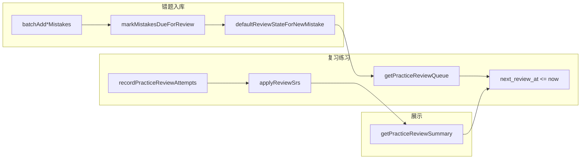

# 英语练习间隔复习（SRS）调度逻辑 SPEC

> **实现文件**：`apps/backend/src/services/english-learning/english-practice-review.srs.ts`  
> **持久化**：表 `english_practice_review_state`（迁移 `1780300000000-english-practice-review-state.ts`）  
> **编排入口**：`EnglishLearningService`（`markMistakesDueForReview`、`getPracticeReviewSummary`、`getPracticeReviewQueue`、`recordPracticeReviewAttempts`）  
> **HTTP**：`GET/POST /english-learning/practice/review/*`  
> **版本**：v1（2026-05-29）

---

## 1. 为什么要单独抽出 `english-practice-review.srs.ts`

### 1.1 业务问题

错题集（`english_vocabulary_mistake` / `english_classic_quote_mistake`）只记录「哪道题错了、上次错拼是什么」，**没有**「下次什么时候该再练」的字段。若把「今日待复习」简单等同于「错题集里所有条目」，会出现：

- 前天入库、早已练对的词仍显示在「今日待复习」；
- 用户完成一轮复习后，首页计数不下降；
- 同一错题在结算页被重复「加入错题集」时，误把已推后的复习计划又拉回今天。

因此需要**与错题快照解耦**的复习调度层，用 `next_review_at` 表达「是否到期」，而不是用 `created_at` 或「是否在错题表里」代替。

### 1.2 为何做成纯函数模块（而非写在 Service 里）

| 考量 | 说明 |
|------|------|
| **可测试** | `applyReviewSrs` / `parseEaseFactor` 无 DB、无 Nest 依赖，可用固定输入断言 `nextReviewAt`、`intervalDays`，避免在 `EnglishLearningService` 巨型类里做集成测试才能覆盖分支。 |
| **单一职责** | Service 负责「谁该复习、拉哪几条错题、写库」；SRS 文件只负责「给定上次状态 + 本次对错 → 下次时间」。 |
| **算法可替换** | 当前是 SM-2 **轻量版**（4 个标量：repetitions、intervalDays、easeFactor、correct）。日后若改 FSRS 或固定阶梯（1/3/7 天），只换本文件，不动队列 JOIN 与 API。 |
| **避免重复** | `defaultReviewStateForNewMistake` 与 `applyReviewSrs` 共用同一套初始值/边界（ease 下限 1.3、上限 2.5），入库与结算不会各写一套魔法数字。 |

**结论**：该文件不是「可有可无的工具类」，而是**间隔复习产品规则的核心域逻辑**；Service 与 Controller 只是它的 IO 适配层。

---

## 2. 与 SM-2 的关系（为何是「轻量版」）

完整 [SuperMemo SM-2](https://www.supermemo.com/en/blog/application-of-a-computer-to-improve-the-results-obtained-in-working-with-the-supermemo-method) 还包含质量分 0～5、遗忘指数等。本仓库练习场景只有**对/错**两档，因此裁剪为：

- 保留：**复习次数** `repetitions`、**间隔天数** `intervalDays`、**难度因子** `easeFactor`（存库为 `decimal(4,2)`）；
- 省略：细粒度打分、同一卡片日内多次复习的复杂队列。

这样既能在答对时把 `next_review_at` **推到未来**（从「今日待复习」消失），又不必引入 Anki 级配置界面。

---

## 3. 各导出函数：职责与存在理由

### 3.1 `parseEaseFactor(raw)`

**做什么**：把库里字符串形式的 `ease_factor` 转成数字；非法或 `< 1.3` 时回落到 `2.5`。

**为什么需要**：

- TypeORM 实体上 `easeFactor` 为 `decimal` 字符串，结算时必须安全解析；
- SM-2 要求 ease 有下限，防止长期答错后间隔乘积趋近 0；
- 集中校验避免 `recordPracticeReviewAttempts` 与将来其它写入口各自 `Number()` 行为不一致。

### 3.2 `defaultReviewStateForNewMistake()`

**做什么**：返回新错题**第一次**进入复习调度时的状态：

- `nextReviewAt = now` → 进入「今日待复习」；
- `intervalDays = 0`、`repetitions = 0`、`easeFactor = 2.5`。

**为什么需要**：

- 与 `applyReviewSrs` 的「答错归零」语义对齐，但用于**入库瞬间**（尚未作答）；
- `markMistakesDueForReview` 在「新插入错题」或「错拼变更」时调用，保证只有**真正新错/新错拼**才变为今日到期，而不是错题集里所有历史行。

**注意**：历史错题若从未写过 `english_practice_review_state`，**不会**自动出现在今日待复习（无行 = 未纳入调度）。这是为了避免「前天加入的错词永远占着今日计数」；若要全量纳入需单独做迁移/初始化（本 SPEC 不默认开启）。

### 3.3 `applyReviewSrs({ repetitions, intervalDays, easeFactor, correct })`

**做什么**：根据本次练习对错，计算下一轮调度（核心）。

#### 答错（`correct === false`）

```
repetitions ← 0
intervalDays ← 0
easeFactor ← max(1.3, easeFactor - 0.2)
nextReviewAt ← now + 1 天
lastResult ← 'wrong'
```

**为什么**：

- 遗忘曲线上应**重置连续正确次数**，否则一次失手仍享受长间隔；
- 仍保留在错题集中，但**明天再到期**，避免刚练完仍占「今日待复习」；
- 略降 ease，后续答对时间隔增长更保守。

#### 答对（`correct === true`）

| 连续正确次数 `repetitions`（含本次） | 新 `intervalDays` | 含义 |
|--------------------------------------|-------------------|------|
| 1 | 1 | 第一次巩固：明天再验 |
| 2 | 3 | 第二次：约三天后再验 |
| ≥3 | `max(1, round(上一间隔 × easeFactor))` | SM-2 乘积步进 |
| 任意 | `easeFactor ← min(2.5, ease + 0.1)` | 越熟练间隔拉得越长（有上限） |

`nextReviewAt = now + intervalDays`（日历天，`addCalendarDays`）。

**为什么这是修复「练完仍显示今日待复习」的关键**：

- 首页与队列条件均为 `next_review_at <= now`；
- 答对后 `next_review_at` 至少为 **明天**，当日 `getPracticeReviewSummary` 计数减少；
- 与「仅错题表存在」的统计方式解耦，练习完成必须通过 `POST .../review/record` 写回（前端复习场次结算触发）。

---

## 4. 与 Service 层的配合（本文件不实现但必须理解）



| 时机 | 调用的 SRS 函数 | 业务规则 |
|------|-----------------|----------|
| 错题**新插入**或**错拼更新** | `defaultReviewStateForNewMistake` / 重置为今日到期 | **不**处理 batch 里 `skipped` 的既有错题，避免误刷新已推后的计划 |
| 复习结算每条作答 | `parseEaseFactor` + `applyReviewSrs` | 按对/错更新 `next_review_at`；答对移出今日 |
| 统计今日待复习 | （不直接调 SRS） | `countDueReviewJoined`：`review_state` INNER JOIN 错题表，且 `next_review_at <= now` |

---

## 5. 验收要点（与 SRS 文件直接相关）

1. **新错题**：加入错题集当天，`summary` 对应 `contentKind` 计数 +1。  
2. **复习答对**：结算上报后，该 `itemKey` 当天不再出现在 `queue` 与 `summary` 中。  
3. **复习答错**：仍可能在次日再次到期，但**当天**不应在答错后立即仍显示为到期（`next_review_at` 为次日）。  
4. **重复加入错题集且错拼未变**：`skipped`，`next_review_at` **不变**。  
5. **错拼变化**：视为新一次错误，`markMistakesDueForReview` 重置为今日到期（与 `defaultReviewStateForNewMistake` 语义一致）。  

---

## 6. 变更边界

修改 `english-practice-review.srs.ts` 时，应同步评估：

- 前端「今日待复习」文案是否仍准确（是否仅指「已到期」而非「错题总数」）；
- 是否需要数据迁移（已有 `review_state` 行的 `next_review_at` 批量重算）；
- `ease_factor` 上下限是否与 DB `decimal(4,2)` 一致。

**不建议**在 Service 内联复制间隔计算公式；所有「下次何时复习」的算术应保留在本模块，以便本 SPEC 与单测作为唯一真相来源。

---

## 7. 参考实现摘录（与源码同步）

以下为逻辑摘要，以仓库内 `english-practice-review.srs.ts` 为准：

```typescript
// 答错：归零 + 明日复习 + ease 下调
if (!correct) {
  return { repetitions: 0, intervalDays: 0,
    easeFactor: max(1.3, ease - 0.2),
    nextReviewAt: now + 1 day, lastResult: 'wrong' };
}

// 答对：1 → 1 天，2 → 3 天，之后 interval × ease
repetitions += 1;
// ... intervalDays 分支 ...
easeFactor = min(2.5, ease + 0.1);
nextReviewAt = now + intervalDays;
```

---

## 8. 相关文档与端点

| 类型 | 路径 |
|------|------|
| Entity | `entity/english-practice-review-state.entity.ts` |
| DTO | `dto/practice-review.dto.ts` |
| 前端练习来源 | `source=review`（`apps/frontend` 练习模块） |
| 结算上报 | `POST /english-learning/practice/review/record` |
