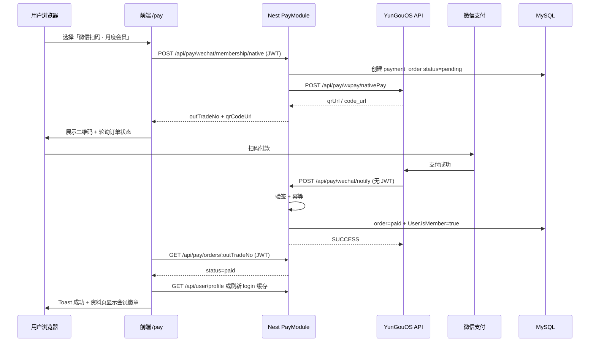

# YunGouOS 微信扫码支付 · 会员购买接入 SPEC

> **目标**：接入 [YunGouOS 微信扫码支付 `nativePay`](https://open.pay.yungouos.com/#/api/api/pay/wxpay/nativePay)，用于「购买会员」；支付成功后更新用户会员状态，前端个人资料页展示为会员。  
> **参考文档**：[YunGouOS 开放平台](https://open.pay.yungouos.com/) · [WxPay.nativePay SDK 说明](https://apidoc.gitee.com/YunGouOS/YunGouOS-PAY-SDK/com/yungouos/pay/wxpay/WxPay.html) · [Node SDK 示例](https://github.com/YunGouOS/YunGouOS-PAY-SDK/tree/master/YunGouOS-Node-SDK)

---

## 1. 背景与范围

### 1.1 现状（仓库基线）

| 模块 | 现状 | 缺口 |
|------|------|------|
| 支付 | `apps/backend/src/services/pay/` 已接 **Stripe**（`POST /pay/createCheckoutSession`、`POST /pay/webhook`） | Webhook 仅打日志，**未开通会员** |
| 前端 `/pay` | Stripe Embedded Checkout（`apps/frontend/src/views/pay/index.tsx`） | 国内用户需 **微信扫码** 通道 |
| 用户模型 | `User` 无 `isMember` / 到期时间等字段 | 无法持久化会员 |
| 个人资料 | `profile/index.tsx` 已预留 `isPaidMemberFromUserInfo()`，兼容 `isMember`、`membershipType`、`memberExpiresAt` 等 | 登录响应需带回这些字段 |

### 1.2 本 SPEC 范围

- **做**：YunGouOS `nativePay` 下单 → 展示二维码 → 异步回调 → 订单落库 → **开通/续期会员** → 前端刷新用户信息。
- **不做**：支付宝、分账、退款 UI（可留扩展点）；替换现有 Stripe（Stripe 与微信可并存，由前端按支付方式分流）。

### 1.3 非目标

- 不实现 YunGouOS 全量 API（仅 nativePay + 订单查询 + 回调验签）。
- 不在本 SPEC 约束收银台 UI 视觉细节（仅定义接口与状态机）。

---

## 2. 端到端流程



---

## 3. YunGouOS `nativePay` 接口要点

官方地址：`POST https://api.pay.yungouos.com/api/pay/wxpay/nativePay`  
文档入口：[open.pay.yungouos.com → wxpay/nativePay](https://open.pay.yungouos.com/#/api/api/pay/wxpay/nativePay)

### 3.1 请求参数（与本项目相关）

| 参数 | 必填 | 说明 |
|------|------|------|
| `out_trade_no` | 是 | 商户订单号，**全局唯一**，建议 `MB{userId}{timestamp}{random}` |
| `total_fee` | 是 | 金额，**单位：元**，字符串，如 `"29.90"`，范围 0.01–99999 |
| `mch_id` | 是 | YunGouOS 微信支付商户号（控制台 → 微信支付 → 商户管理） |
| `body` | 是 | 商品描述，如「月度会员」 |
| `type` | 否 | `1`=返回微信原生 link 需自建二维码；**`2`=直接返回二维码图片 URL（推荐）** |
| `attach` | 否 | 附加数据，**回调原样返回**；建议 JSON：`{"userId":123,"productCode":"membership_monthly"}` |
| `notify_url` | **强烈建议** | 异步回调公网 HTTPS 地址，**不可带 query** |
| `app_id` | 视账号 | 部分商户必填，见控制台 |
| `sign` | 是 | 按 YunGouOS 规则对参与签名字段排序后 HMAC/MD5（以官方为准，推荐用 SDK `PaySignUtil.createSign`） |

### 3.2 响应（典型）

```json
{
  "code": 0,
  "msg": "success",
  "data": "https://....../qrcode.png"
}
```

- `code === 0`：成功；`data` 在 `type=2` 时为**二维码图片 URL**，前端 `` 即可。
- `code !== 0`：失败，读取 `msg` 记录日志并返回 502/400。

### 3.3 异步回调

- YunGouOS 向 `notify_url` **POST** 通知（具体字段以平台文档为准；Node SDK 验签示例字段含 `code、orderNo、outTradeNo、payNo、money、mchId`）。
- **验签**：使用商户 **支付密钥 payKey**（与 `mch_id` 对应），SDK：`PaySignUtil.checkNotifySign(params, sign, payKey)`。
- **应答**：验签且业务处理成功后返回纯文本 **`SUCCESS`**（大小写以文档为准）；否则平台会重试回调。
- **幂等**：同一 `out_trade_no` 已 `paid` 时直接返回 `SUCCESS`，勿重复加会员时长。

---

## 4. 数据模型设计

### 4.1 扩展 `User`（会员字段）

前端 `isPaidMemberFromUserInfo` 已识别下列字段，**建议后端统一输出**：

| 字段 | 类型 | 说明 |
|------|------|------|
| `isMember` | `boolean` | 是否有效会员（`memberExpiresAt > now` 或永久会员） |
| `membershipType` | `varchar(32)` | 如 `free` / `premium` / `pro` |
| `memberExpiresAt` | `timestamp` nullable | 到期时间；`null` 可表示未开通或永久（按产品定） |

**实体增量**（`apps/backend/src/services/user/user.entity.ts`）：

```typescript
@Column({ name: 'is_member', default: false })
isMember!: boolean;

@Column({ name: 'membership_type', type: 'varchar', length: 32, default: 'free' })
membershipType!: string;

@Column({ name: 'member_expires_at', type: 'timestamp', nullable: true })
memberExpiresAt!: Date | null;
```

**迁移**：新增 TypeORM migration，勿依赖生产环境 `synchronize`。

### 4.2 支付订单表 `payment_order`

独立订单表便于对账、幂等与多渠道（Stripe / 微信）共存。

```typescript
/** apps/backend/src/services/pay/entity/payment-order.entity.ts */
import {
	Column,
	CreateDateColumn,
	Entity,
	Index,
	PrimaryGeneratedColumn,
	UpdateDateColumn,
} from 'typeorm';

export type PaymentChannel = 'wechat_native' | 'stripe';
export type PaymentOrderStatus = 'pending' | 'paid' | 'closed' | 'failed';

@Entity('payment_order')
@Index('UQ_payment_order_out_trade_no', ['outTradeNo'], { unique: true })
@Index('IDX_payment_order_user_created', ['userId', 'createdAt'])
export class PaymentOrder {
	@PrimaryGeneratedColumn('uuid')
	id!: string;

	/** 商户订单号，传给 YunGouOS out_trade_no */
	@Column({ name: 'out_trade_no', type: 'varchar', length: 64 })
	outTradeNo!: string;

	@Column({ name: 'user_id', type: 'int' })
	userId!: number;

	@Column({ type: 'varchar', length: 32 })
	channel!: PaymentChannel;

	/** 如 membership_monthly / membership_yearly */
	@Column({ name: 'product_code', type: 'varchar', length: 64 })
	productCode!: string;

	/** 订单金额（元），decimal 存字符串或 numeric */
	@Column({ name: 'total_fee_yuan', type: 'decimal', precision: 10, scale: 2 })
	totalFeeYuan!: string;

	@Column({ type: 'varchar', length: 20, default: 'pending' })
	status!: PaymentOrderStatus;

	@Column({ type: 'varchar', length: 512, default: '' })
	attach!: string;

	@Column({ name: 'provider_order_no', type: 'varchar', length: 128, nullable: true })
	providerOrderNo!: string | null;

	@Column({ name: 'paid_at', type: 'timestamp', nullable: true })
	paidAt!: Date | null;

	@CreateDateColumn({ name: 'created_at', type: 'timestamp' })
	createdAt!: Date;

	@UpdateDateColumn({ name: 'updated_at', type: 'timestamp' })
	updatedAt!: Date;
}
```

### 4.3 会员商品配置（代码常量，非 env）

```typescript
/** apps/backend/src/services/pay/membership-products.ts */
export const MEMBERSHIP_PRODUCTS = {
	membership_monthly: {
		code: 'membership_monthly',
		name: '月度会员',
		totalFeeYuan: '29.90',
		durationDays: 30,
		membershipType: 'premium',
	},
	membership_yearly: {
		code: 'membership_yearly',
		name: '年度会员',
		totalFeeYuan: '199.00',
		durationDays: 365,
		membershipType: 'premium',
	},
} as const;

export type MembershipProductCode = keyof typeof MEMBERSHIP_PRODUCTS;
```

---

## 5. 环境变量与配置

在 `apps/backend/src/enum/config.enum.ts` 新增（**各值如何获取见 §5.1**）：

```typescript
export enum YunGouPayEnum {
	/** YunGouOS 微信支付商户号 → 控制台「微信支付 → 商户管理」商户号，对应 API mch_id */
	YUNGOUOS_WX_MCH_ID = 'YUNGOUOS_WX_MCH_ID',
	/** 商户支付密钥 payKey → 同上页面「支付密钥」，用于 sign 与回调验签 */
	YUNGOUOS_WX_PAY_KEY = 'YUNGOUOS_WX_PAY_KEY',
	/** 平台报备 app_id → 多场景必填；单场景可留空，见 §5.1.2 */
	YUNGOUOS_WX_APP_ID = 'YUNGOUOS_WX_APP_ID',
	/**
	 * 异步回调完整 URL（本系统公网地址，非控制台下载）
	 * 例：https://api.example.com/api/pay/wechat/notify
	 */
	YUNGOUOS_WX_NOTIFY_URL = 'YUNGOUOS_WX_NOTIFY_URL',
	/** API 根，默认 https://api.pay.yungouos.com，一般无需改 */
	YUNGOUOS_API_BASE_URL = 'YUNGOUOS_API_BASE_URL',
}
```

**`.env` 示例**（勿提交真实密钥）：

```env
YUNGOUOS_WX_MCH_ID=16xxxxxxxx
YUNGOUOS_WX_PAY_KEY=xxxxxxxxxxxxxxxx
YUNGOUOS_WX_APP_ID=wx_xxxxxxxx
YUNGOUOS_WX_NOTIFY_URL=https://your-domain.com/api/pay/wechat/notify
# YUNGOUOS_API_BASE_URL=https://api.pay.yungouos.com
```

### 5.1 配置项如何获取（逐项说明）

以下五项中，**前三项来自 YunGouOS 控制台**；**回调地址与 API 根由本系统自行填写**。官方文档与 SDK 对 `mch_id`、`payKey` 的说明一致：登录 [YunGouOS.com](https://www.yungouos.com) → **微信支付** → **商户管理** 查看（见 [nativePay 参数说明](https://open.pay.yungouos.com/#/api/api/pay/wxpay/nativePay)、[WxPay SDK 文档](https://apidoc.gitee.com/YunGouOS/YunGouOS-PAY-SDK/com/yungouos/pay/wxpay/WxPay.html)）。

#### 5.1.1 开通商户（拿到 `mch_id` 与 `payKey` 的前置条件）

| 你的情况 | 控制台路径 | 结果 |
|----------|------------|------|
| **没有**微信/支付宝商户号（个人、个体户、小微常见） | [YunGouOS 官网](https://www.yungouos.com) 注册 → 按指引提交资料、绑定结算银行卡 → 等待微信/支付宝审核 | 审核通过后平台**下发 YunGouOS 微信支付商户号**及对应 **payKey**（[Node SDK README](https://github.com/YunGouOS/YunGouOS-PAY-SDK/tree/master/YunGouOS-Node-SDK)「无微信/支付宝商户」） |
| **已有**微信支付商户号 | 登录控制台 → **微信支付** → **商户接入**（非「商户管理」） | 按页面绑定自有商户；接入完成后在 **商户管理** 中可见 `mch_id` 与 payKey |

> 资金由微信清算至你在 YunGouOS 绑定的结算账户；YunGouOS 提供聚合接口与密钥，**不是**把微信官方商户平台的 `API v3 密钥` 直接填进本项目。

#### 5.1.2 各环境变量对照表

| 环境变量 | 对应 API 字段 | 从哪里拿 | 是否必填 | 填写示例 |
|----------|---------------|----------|----------|----------|
| `YUNGOUOS_WX_MCH_ID` | `mch_id` | 控制台 → **微信支付** → **商户管理** → 商户列表中的 **商户号**（纯数字，常见以 `16` 开头） | **是** | `1600123456` |
| `YUNGOUOS_WX_PAY_KEY` | 签名参数 `sign` 的密钥（SDK 最后一个参数 `payKey`） | 同上页面 → 选中该商户 → **支付密钥** / **payKey**（可查看；若泄露需在控制台**重置**） | **是** | 32 位左右字符串（以控制台显示为准） |
| `YUNGOUOS_WX_APP_ID` | `app_id` | 控制台 **商户管理** 或 **场景/应用报备** 中展示的 **YunGouOS 平台报备 app_id**（**不是**随便填一个自建小程序 AppID，除非已在 YunGouOS 报备该场景） | **视账号**：单场景可留空；**商户登记了多支付场景时 nativePay 必传**（[官方 nativePay 文档](https://open.pay.yungouos.com/#/api/api/pay/wxpay/nativePay)） | 控制台给出的 `wx…` 或平台 app 标识 |
| `YUNGOUOS_WX_NOTIFY_URL` | `notify_url` | **本系统部署地址**，非 YunGouOS 生成。须为 **公网 HTTPS**，路径对应 `POST /api/pay/wechat/notify`，**禁止带 query**（如 `?token=xxx`） | **强烈建议**（不传则平台不回调，无法自动开通会员） | `https://api.example.com/api/pay/wechat/notify` |
| `YUNGOUOS_API_BASE_URL` | 请求 Host | **固定默认值**，一般无需改 | 否 | `https://api.pay.yungouos.com` |

#### 5.1.3 控制台操作步骤（获取 `mch_id` + `payKey`）

1. 打开 [https://www.yungouos.com](https://www.yungouos.com) 注册/登录。
2. 左侧进入 **微信支付**。
3. 若尚未有商户：先完成 **签约/商户接入**（见 5.1.1），直至 **商户管理** 中出现可用商户。
4. 打开 **商户管理**：
   - 复制 **商户号** → 写入 `.env` 的 `YUNGOUOS_WX_MCH_ID`（即调用 `nativePay` 时的 `mch_id`）。
   - 打开 **支付密钥**（payKey）→ 复制 → 写入 `YUNGOUOS_WX_PAY_KEY`（**仅后端 `.env`，禁止进前端或 Git**）。
5. 若 **商户管理** 或场景说明里列出 **app_id**，且你有多场景或接口报错提示缺少 `app_id`，则写入 `YUNGOUOS_WX_APP_ID`；仅 PC 扫码、单场景时多数账号可先不配，联调失败再补。

#### 5.1.4 `YUNGOUOS_WX_NOTIFY_URL` 如何确定

该值**不是**在 YunGouOS 控制台「下载」的，而是你在 Nest 实现回调路由后，把**对外可访问的完整 URL** 配进 `.env`：

```
{你的 API 公网根}/api/pay/wechat/notify
```

| 环境 | 做法 |
|------|------|
| **生产** | 使用正式域名，如 `https://api.yourproduct.com/api/pay/wechat/notify`；确保 443 证书有效、防火墙放行。 |
| **本地联调** | YunGouOS 无法访问 `localhost`，需 **内网穿透**（ngrok、cloudflared、frp 等）得到 HTTPS 地址，例如 `https://abc123.ngrok-free.app/api/pay/wechat/notify`，写入 `.env` 后重启后端。 |
| **校验** | 用浏览器访问该 URL 应得到 **405/404**（仅接受 POST）而非证书错误；支付成功后 YunGouOS 会 POST 表单/JSON，本接口验签后返回纯文本 `SUCCESS`。 |

`notify_url` 也可在**单次下单**时通过 `nativePay` 参数传入（本 SPEC 从环境变量读取，与控制台默认回调二选一即可；**以每次下单传入的为准**）。

#### 5.1.5 `YUNGOUOS_API_BASE_URL`

- 官方生产环境固定为 **`https://api.pay.yungouos.com`**（[nativePay 文档](https://open.pay.yungouos.com/#/api/api/pay/wxpay/nativePay)「接口地址」）。
- `.env` **可不配置**；代码内 default 即上述地址。
- 仅在使用 YunGouOS 提供的特殊网关、代理或文档明确要求其他 Host 时再覆盖。

#### 5.1.6 配置检查清单

- [ ] 已在 YunGouOS 完成微信支付签约，**商户管理** 中商户状态正常。
- [ ] `YUNGOUOS_WX_MCH_ID` 与 `YUNGOUOS_WX_PAY_KEY` **成对**（同一商户号下的密钥）。
- [ ] `YUNGOUOS_WX_NOTIFY_URL` 为 HTTPS、无 query、与已实现的路由一致。
- [ ] 本地开发已穿透，`notify_url` 外网可 POST 到本机 Nest。
- [ ] 联调时用 **0.01 元** 测试单；在 YunGouOS **订单查询** 或本系统 `payment_order` 表核对状态。
- [ ] 若 `nativePay` 返回缺少 `app_id`，补全 `YUNGOUOS_WX_APP_ID` 后重试。

---

## 6. HTTP API 设计

全局前缀：`/api`（见 `main.ts`）。

| 方法 | 路径 | 鉴权 | 说明 |
|------|------|------|------|
| `POST` | `/pay/wechat/membership/native` | JWT | 创建会员订单并返回二维码 |
| `GET` | `/pay/orders/:outTradeNo` | JWT | 查询订单状态（前端轮询） |
| `POST` | `/pay/wechat/notify` | **无** | YunGouOS 异步回调；**禁用 ResponseInterceptor**；返回 `SUCCESS` |

Stripe 既有路由保持不变。

### 6.1 `POST /pay/wechat/membership/native`

**Request Body**

```typescript
export class CreateWechatMembershipNativeDto {
	@IsIn(['membership_monthly', 'membership_yearly'])
	productCode!: MembershipProductCode;
}
```

**Response**（经 `ResponseInterceptor` 包装后前端取 `data`）

```typescript
{
	outTradeNo: string;
	qrCodeUrl: string;      // type=2 时 YunGouOS 返回的 data
	productName: string;
	totalFeeYuan: string;
	expiresInSec: number;   // 建议 900（15 分钟）内完成支付
}
```

### 6.2 `GET /pay/orders/:outTradeNo`

- 校验 `order.userId === req.user.userId`，否则 404。
- 返回 `{ outTradeNo, status, paidAt, productCode }`。
- 当 `status === 'paid'` 时，附带精简会员信息：`{ isMember, membershipType, memberExpiresAt }` 供前端直接 `setUserInfo`。

### 6.3 `POST /pay/wechat/notify`

- **不使用** `JwtGuard`、**不使用** `ResponseInterceptor`。
- Content-Type 可能是 `application/x-www-form-urlencoded` 或 JSON，需按 YunGouOS 实际回调格式解析（实现时用 SDK 或对照一次真实回调抓包）。
- 成功：`@HttpCode(200)` + `res.send('SUCCESS')`。
- 失败：非 SUCCESS，便于平台重试（勿抛 500 未捕获异常）。

---

## 7. 核心实现代码（建议落盘路径）

### 7.1 YunGouOS 客户端封装

**文件**：`apps/backend/src/services/pay/yungouos/yungouos-wxpay.client.ts`

```typescript
import { Injectable, Logger, ServiceUnavailableException } from '@nestjs/common';
import { ConfigService } from '@nestjs/config';
import { YunGouPayEnum } from '../../../enum/config.enum';

type NativePayParams = {
	outTradeNo: string;
	totalFeeYuan: string;
	body: string;
	attach: string;
	/** 2 = 直接返回二维码图片 URL */
	type?: '1' | '2';
};

type NativePayResult = { qrCodeUrl: string };

@Injectable()
export class YungouosWxPayClient {
	private readonly logger = new Logger(YungouosWxPayClient.name);

	constructor(private readonly config: ConfigService) {}

	private getCredentials() {
		const mchId = this.config.get<string>(YunGouPayEnum.YUNGOUOS_WX_MCH_ID)?.trim();
		const payKey = this.config.get<string>(YunGouPayEnum.YUNGOUOS_WX_PAY_KEY)?.trim();
		const notifyUrl = this.config.get<string>(YunGouPayEnum.YUNGOUOS_WX_NOTIFY_URL)?.trim();
		const appId = this.config.get<string>(YunGouPayEnum.YUNGOUOS_WX_APP_ID)?.trim();
		const baseUrl =
			this.config.get<string>(YunGouPayEnum.YUNGOUOS_API_BASE_URL)?.replace(/\/$/, '') ??
			'https://api.pay.yungouos.com';
		if (!mchId || !payKey || !notifyUrl) {
			throw new ServiceUnavailableException(
				'YunGouOS 微信支付未配置：请设置 YUNGOUOS_WX_MCH_ID、YUNGOUOS_WX_PAY_KEY、YUNGOUOS_WX_NOTIFY_URL',
			);
		}
		return { mchId, payKey, notifyUrl, appId, baseUrl };
	}

	/**
	 * 调用 nativePay。sign 算法与 YunGouOS 官方 SDK 一致（PaySignUtil.createSign）。
	 * 推荐：npm 安装官方 Node SDK 后在此委托 WxPay.nativePayAsync(...)。
	 */
	async nativePay(params: NativePayParams): Promise<NativePayResult> {
		const { mchId, payKey, notifyUrl, appId, baseUrl } = this.getCredentials();
		const payload: Record<string, string> = {
			out_trade_no: params.outTradeNo,
			total_fee: params.totalFeeYuan,
			mch_id: mchId,
			body: params.body,
			type: params.type ?? '2',
			attach: params.attach,
			notify_url: notifyUrl,
		};
		if (appId) payload.app_id = appId;

		// TODO: payload.sign = createSign(payload, payKey);
		// 参考：https://github.com/YunGouOS/YunGouOS-PAY-SDK/tree/master/YunGouOS-Node-SDK

		const url = `${baseUrl}/api/pay/wxpay/nativePay`;
		const res = await fetch(url, {
			method: 'POST',
			headers: { 'Content-Type': 'application/x-www-form-urlencoded' },
			body: new URLSearchParams(payload),
		});
		const json = (await res.json()) as { code?: number; msg?: string; data?: string };
		if (json.code !== 0 || !json.data) {
			this.logger.error(`nativePay failed: ${JSON.stringify(json)}`);
			throw new ServiceUnavailableException(json.msg ?? '微信扫码下单失败');
		}
		return { qrCodeUrl: json.data };
	}

	/** 回调验签：params 为回调体字段，sign 为回调携带的签名 */
	verifyNotifySign(params: Record<string, string>, sign: string): boolean {
		const payKey = this.config.get<string>(YunGouPayEnum.YUNGOUOS_WX_PAY_KEY)?.trim();
		if (!payKey) return false;
		// TODO: return PaySignUtil.checkNotifySign(params, sign, payKey);
		return false;
	}
}
```

> **实现建议**：在 `apps/backend/package.json` 增加依赖（以官方仓库当前包名为准，例如 `yungouos-node-sdk` 或 vendored SDK），避免自研签名与官方不一致。

### 7.2 会员开通服务

**文件**：`apps/backend/src/services/pay/membership.service.ts`

```typescript
import { Injectable, Logger } from '@nestjs/common';
import { InjectRepository } from '@nestjs/typeorm';
import { Repository } from 'typeorm';
import { User } from '../user/user.entity';
import { MEMBERSHIP_PRODUCTS, MembershipProductCode } from './membership-products';
import { PaymentOrder } from './entity/payment-order.entity';

@Injectable()
export class MembershipService {
	private readonly logger = new Logger(MembershipService.name);

	constructor(
		@InjectRepository(User) private readonly userRepo: Repository<User>,
		@InjectRepository(PaymentOrder) private readonly orderRepo: Repository<PaymentOrder>,
	) {}

	/** 续期规则：若当前仍有效，则在原到期日上叠加；否则从 now 起算 */
	async activateMembershipForUser(
		userId: number,
		productCode: MembershipProductCode,
		order: PaymentOrder,
	): Promise<User> {
		const product = MEMBERSHIP_PRODUCTS[productCode];
		const user = await this.userRepo.findOne({ where: { id: userId } });
		if (!user) throw new Error(`user ${userId} not found`);

		const now = new Date();
		const base =
			user.memberExpiresAt && user.memberExpiresAt > now
				? user.memberExpiresAt
				: now;
		const expires = new Date(base);
		expires.setDate(expires.getDate() + product.durationDays);

		user.isMember = true;
		user.membershipType = product.membershipType;
		user.memberExpiresAt = expires;

		await this.userRepo.save(user);
		this.logger.log(
			`membership activated userId=${userId} order=${order.outTradeNo} expires=${expires.toISOString()}`,
		);
		return user;
	}

	buildAttach(userId: number, productCode: MembershipProductCode): string {
		return JSON.stringify({ userId, productCode });
	}

	parseAttach(raw: string): { userId: number; productCode: MembershipProductCode } | null {
		try {
			const o = JSON.parse(raw) as { userId?: number; productCode?: string };
			if (!o.userId || !o.productCode) return null;
			if (!(o.productCode in MEMBERSHIP_PRODUCTS)) return null;
			return { userId: o.userId, productCode: o.productCode as MembershipProductCode };
		} catch {
			return null;
		}
	}
}
```

### 7.3 支付编排（下单 + 回调）

**文件**：`apps/backend/src/services/pay/wechat-membership-pay.service.ts`

```typescript
import { BadRequestException, Injectable, NotFoundException } from '@nestjs/common';
import { InjectRepository } from '@nestjs/typeorm';
import { Repository } from 'typeorm';
import { randomBytes } from 'node:crypto';
import { PaymentOrder } from './entity/payment-order.entity';
import { MEMBERSHIP_PRODUCTS, MembershipProductCode } from './membership-products';
import { MembershipService } from './membership.service';
import { YungouosWxPayClient } from './yungouos/yungouos-wxpay.client';

@Injectable()
export class WechatMembershipPayService {
	constructor(
		@InjectRepository(PaymentOrder)
		private readonly orderRepo: Repository<PaymentOrder>,
		private readonly yungouos: YungouosWxPayClient,
		private readonly membership: MembershipService,
	) {}

	private genOutTradeNo(userId: number): string {
		const ts = Date.now();
		const rnd = randomBytes(3).toString('hex');
		return `MB${userId}${ts}${rnd}`.slice(0, 32);
	}

	async createNativeOrder(userId: number, productCode: MembershipProductCode) {
		const product = MEMBERSHIP_PRODUCTS[productCode];
		const outTradeNo = this.genOutTradeNo(userId);
		const attach = this.membership.buildAttach(userId, productCode);

		const order = this.orderRepo.create({
			outTradeNo,
			userId,
			channel: 'wechat_native',
			productCode,
			totalFeeYuan: product.totalFeeYuan,
			status: 'pending',
			attach,
		});
		await this.orderRepo.save(order);

		const { qrCodeUrl } = await this.yungouos.nativePay({
			outTradeNo,
			totalFeeYuan: product.totalFeeYuan,
			body: product.name,
			attach,
			type: '2',
		});

		return {
			outTradeNo,
			qrCodeUrl,
			productName: product.name,
			totalFeeYuan: product.totalFeeYuan,
			expiresInSec: 900,
		};
	}

	async getOrderForUser(outTradeNo: string, userId: number) {
		const order = await this.orderRepo.findOne({ where: { outTradeNo } });
		if (!order || order.userId !== userId) {
			throw new NotFoundException('订单不存在');
		}
		return order;
	}

	/**
	 * YunGouOS 异步回调入口（已验签、code 表示支付成功之后调用）
	 * 必须在数据库事务内完成：更新订单 + 开通会员
	 */
	async handlePaidNotify(payload: {
		outTradeNo: string;
		providerOrderNo?: string;
		paidMoneyYuan?: string;
		attach: string;
	}) {
		const order = await this.orderRepo.findOne({
			where: { outTradeNo: payload.outTradeNo },
		});
		if (!order) return { ok: false, reason: 'order_not_found' };

		// 幂等：已支付直接成功
		if (order.status === 'paid') return { ok: true, duplicate: true };

		if (order.status !== 'pending') {
			return { ok: false, reason: `invalid_status_${order.status}` };
		}

		// 金额校验（回调 money 字段单位以 YunGouOS 文档为准，可能是元或分，实现时务必核对）
		if (payload.paidMoneyYuan && payload.paidMoneyYuan !== order.totalFeeYuan) {
			return { ok: false, reason: 'amount_mismatch' };
		}

		const parsed = this.membership.parseAttach(payload.attach || order.attach);
		if (!parsed || parsed.userId !== order.userId) {
			return { ok: false, reason: 'attach_invalid' };
		}

		order.status = 'paid';
		order.providerOrderNo = payload.providerOrderNo ?? null;
		order.paidAt = new Date();
		await this.orderRepo.save(order);

		await this.membership.activateMembershipForUser(
			order.userId,
			parsed.productCode,
			order,
		);

		return { ok: true };
	}
}
```

### 7.4 Controller 增量

**文件**：`apps/backend/src/services/pay/pay.controller.ts`（节选）

```typescript
@Post('wechat/membership/native')
@UseGuards(JwtGuard)
@UseInterceptors(ResponseInterceptor)
async createWechatMembershipNative(
	@Body() dto: CreateWechatMembershipNativeDto,
	@Req() req: Request & { user?: { userId?: number } },
) {
	const userId = req.user?.userId;
	if (userId == null) throw new UnauthorizedException('无法识别当前用户');
	return this.wechatMembershipPayService.createNativeOrder(userId, dto.productCode);
}

@Get('orders/:outTradeNo')
@UseGuards(JwtGuard)
@UseInterceptors(ResponseInterceptor)
async getOrder(
	@Param('outTradeNo') outTradeNo: string,
	@Req() req: Request & { user?: { userId?: number } },
) {
	const userId = req.user?.userId!;
	const order = await this.wechatMembershipPayService.getOrderForUser(outTradeNo, userId);
	// 可选：join User 返回会员字段
	return {
		outTradeNo: order.outTradeNo,
		status: order.status,
		paidAt: order.paidAt,
		productCode: order.productCode,
	};
}

/** YunGouOS 回调：无 JWT、无统一 JSON 包装 */
@Post('wechat/notify')
@HttpCode(HttpStatus.OK)
async wechatNotify(@Req() req: Request, @Res({ passthrough: false }) res: Response) {
	const body = req.body as Record<string, string>;
	const sign = body.sign ?? body.Sign;
	if (!this.yungouosWxPayClient.verifyNotifySign(body, sign)) {
		return res.send('FAIL');
	}
	// code === '0' 或 0 表示支付成功（以真实回调为准）
	if (String(body.code) !== '0') {
		return res.send('SUCCESS'); // 非成功状态也可应答 SUCCESS 避免无限重试，按运维策略调整
	}
	const result = await this.wechatMembershipPayService.handlePaidNotify({
		outTradeNo: body.outTradeNo ?? body.out_trade_no,
		providerOrderNo: body.orderNo ?? body.payNo,
		paidMoneyYuan: body.money, // 核对单位
		attach: body.attach ?? '',
	});
	return res.send(result.ok ? 'SUCCESS' : 'FAIL');
}
```

### 7.5 Module 注册

```typescript
/** apps/backend/src/services/pay/pay.module.ts */
@Module({
	imports: [
		ConfigModule,
		TypeOrmModule.forFeature([PaymentOrder, User]),
	],
	controllers: [PayController],
	providers: [
		PayService,
		YungouosWxPayClient,
		MembershipService,
		WechatMembershipPayService,
	],
	exports: [PayService, WechatMembershipPayService],
})
export class PayModule {}
```

### 7.6 登录 / 资料接口返回会员字段

`AuthService.login` / `loginByEmail` 已 `return { ...userInfo }`；在 `User` 实体增加字段并确保 **ClassSerializer** 未排除即可。

可选：在 `UserController` `GET /user/profile` 增加显式 DTO，包含：

```typescript
{
	id, username, email,
	isMember, membershipType, memberExpiresAt,
	profile: { ... }
}
```

---

## 8. 前端改造要点

### 8.1 页面 `/pay`

在现有 Stripe 区块旁增加 **「微信支付（扫码）」** Tab 或分段：

1. 用户选择 `membership_monthly` / `membership_yearly`。
2. `POST /api/pay/wechat/membership/native` → 展示 `qrCodeUrl`。
3. 每 2–3 秒 `GET /api/pay/orders/:outTradeNo`，直到 `status === 'paid'` 或超时。
4. 成功后：
   - `userStore.setUserInfo({ ...userInfo, isMember: true, membershipType, memberExpiresAt })`
   - 或调用 `GET /user/profile` 刷新。
5. Toast + 可选跳转 `/profile`。

**API 常量**（`apps/frontend/src/service/api.ts`）：

```typescript
export const PAY_WECHAT_MEMBERSHIP_NATIVE = '/pay/wechat/membership/native';
export const PAY_ORDER_STATUS = (outTradeNo: string) => `/pay/orders/${outTradeNo}`;
```

### 8.2 个人资料页

已有逻辑无需大改：`isPaidMemberFromUserInfo(userInfo)` 读到 `isMember === true` 即显示会员徽章。

---

## 9. 安全与运维

| 项 | 要求 |
|----|------|
| 回调 URL | 公网 HTTPS，**无 query 参数** |
| 验签 | 必须；失败不得开通会员 |
| 幂等 | `payment_order.status === 'paid'` 时跳过业务 |
| 金额 | 回调金额与订单 `totalFeeYuan` 一致（注意元/分） |
| attach | 回调 attach 与订单一致，且 `userId` 与订单归属一致 |
| 密钥 | `YUNGOUOS_WX_PAY_KEY` 仅服务端；禁止写入前端 |
| 日志 | 记录 `outTradeNo、userId、providerOrderNo`；勿打 payKey |
| 订单关闭 | 超时 `pending` 可定时任务置 `closed`（可选） |

---

## 10. 与 Stripe 的关系

| 通道 | 场景 | 会员开通 |
|------|------|----------|
| Stripe | 海外卡 / 已有 Embedded UI | 需在 `PayService.handleWebhookEvent` 的 `checkout.session.completed` 中调用同一套 `MembershipService` |
| YunGouOS 微信 | 国内扫码 | 本 SPEC `handlePaidNotify` |

**统一原则**：无论渠道，**只有订单表标记 paid 后**才调用 `activateMembershipForUser`。

---

## 11. 测试清单

| # | 场景 | 期望 |
|---|------|------|
| 1 | 未登录调用下单 | 401 |
| 2 | 配置缺失 mch_id/payKey | 503 + 明确文案 |
| 3 | nativePay 成功 | 返回 qrCodeUrl + pending 订单 |
| 4 | 模拟回调（正确签名） | 订单 paid + User.isMember=true |
| 5 | 重复回调 | 仍返回 SUCCESS，会员时长不重复叠加（或按产品规则只叠加一次） |
| 6 | 错误签名回调 | FAIL，会员不变 |
| 7 | 前端轮询 paid | 资料页显示会员 |
| 8 | attach 篡改 | 开通失败，订单保持 pending/failed |

**本地回调调试**：内网穿透 + YunGouOS 控制台配置 notify_url；或使用 YunGouOS 沙箱/小额 0.01 元实付。

---

## 12. 建议实施顺序

1. Migration：`User` 会员字段 + `payment_order` 表。  
2. `membership-products.ts` + `MembershipService`。  
3. 接入 YunGouOS SDK：`YungouosWxPayClient.nativePay` / `verifyNotifySign`。  
4. `WechatMembershipPayService` + Controller 三路由。  
5. 前端 `/pay` 微信 Tab + 轮询 + 刷新 `userInfo`。  
6. （可选）Stripe webhook 复用 `MembershipService`。  
7. 定时任务关闭超时订单；管理后台订单列表（后续迭代）。

---

## 13. 相关源码索引

| 说明 | 路径 |
|------|------|
| 现有 Stripe 支付 | `apps/backend/src/services/pay/pay.service.ts` |
| Pay Controller | `apps/backend/src/services/pay/pay.controller.ts` |
| 用户实体 | `apps/backend/src/services/user/user.entity.ts` |
| 登录返回 userInfo | `apps/backend/src/services/auth/auth.service.ts` |
| 前端支付页 | `apps/frontend/src/views/pay/index.tsx` |
| 前端会员判定 | `apps/frontend/src/views/profile/index.tsx` → `isPaidMemberFromUserInfo` |
| 微信登录 SPEC（鉴权参考） | `apps/backend/specs/wechat-quick-login.md` |

---

若与 YunGouOS 最新文档或真实回调字段不一致，**以平台文档与抓包为准**；签名与字段映射应在联调阶段写入 `yungouos-wxpay.client.ts` 单元测试快照。
