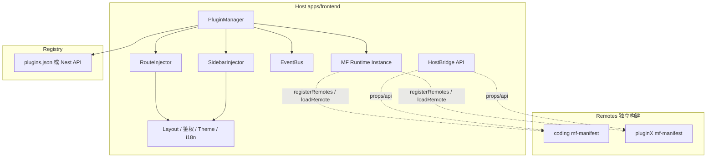
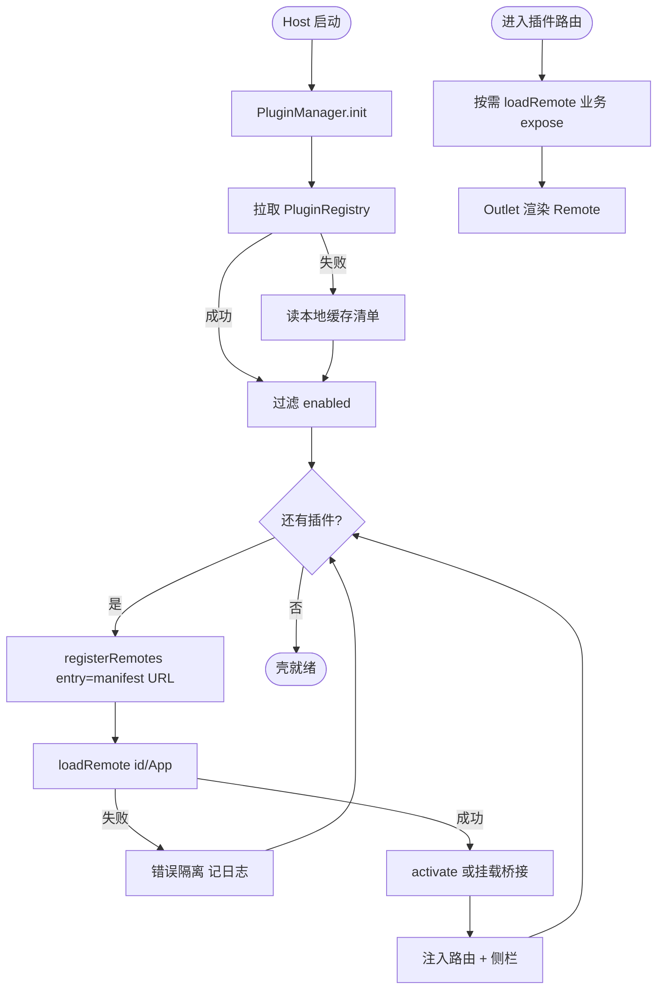
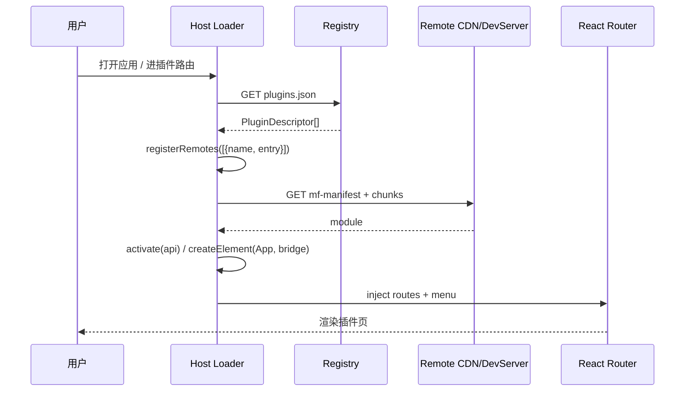
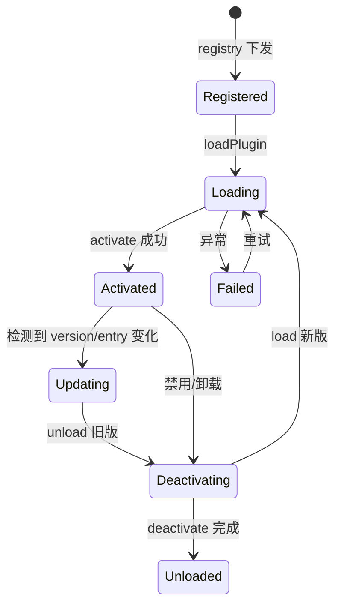
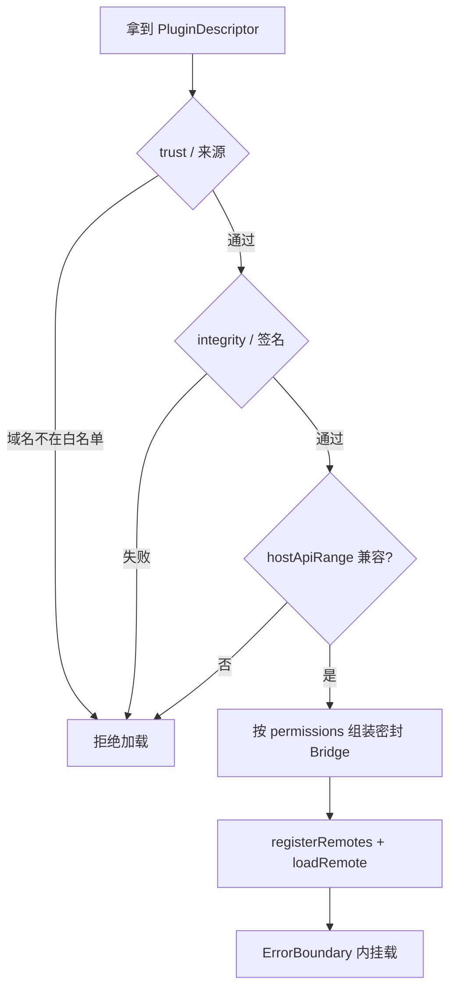

# 动态模块联邦实时可插拔微前端 — 最终方案

> **状态**：**M0/M1 已落地**（Host 插件运行时 + `apps/remote-demo`；M2+ 真业务拆分 / Nest 注册中心 / 签名流水线待续）  
> **日期**：2026-07-19  
> **联调**：`pnpm dev:mf`（Remote + Host）  
> **前身文档**：  
> - [`dynamic-module-federation-microfrontend.md`](./dynamic-module-federation-microfrontend.md)（选型调研 / MF 2.0）  
> - [`dynamic-module-federation-microfrontend-tare.md`](./dynamic-module-federation-microfrontend-tare.md)（运行时编排 / 分阶段落地）  
> **关联代码**：`apps/frontend/vite.config.ts`、`src/router/*`、`src/layout/*`、`src/utils/fetch.ts`、`src/utils/updater.ts`、`src-tauri/tauri.conf.json`  
> **性质**：本仓库微前端改造的**唯一推荐基线**；落地前须完成 **M0 PoC**（含跨联邦 HMR）。

---

## 0. 两份文档差异对照（为何需要合并）

| 维度 | `…-tare.md` | `…-microfrontend.md` | **本方案取舍** |
|------|-------------|----------------------|----------------|
| 构建/运行时 | `@originjs/vite-plugin-federation` + `virtual:__federation__` | **`@module-federation/vite` + `@module-federation/enhanced/runtime`（MF 2.0）** | **采用 MF 2.0**（动态 Remote、manifest 协议、跨联邦 HMR 更成熟） |
| 动态加载能力 | 依赖 originjs 运行时 API | 官方明确：构建期 remotes **不支持**运行时增删；须 Runtime `registerRemotes` | **构建期只配 Host name + shared；业务 Remote 全走 Runtime** |
| 入口协议 | 裸 `remoteEntry.js` | **`mf-manifest.json` + registry 指针** | **采用 manifest + registry**（防缓存旧入口） |
| 运行时编排 | PluginManager / RouteInjector / SidebarInjector / EventBus | PluginRegistry + HostBridge + 动态路由桥 | **保留 tare 的编排分层**，契约面用 HostBridge 收窄 |
| 插件生命周期 | `activate` / `deactivate` + 热更新状态机 | 以 `loadRemote` + 降级页为主 | **两者都要**：activate/deactivate 负责挂载/清理；Runtime 负责加载 |
| 后端 | Nest `plugins` 模块 + MySQL 双表 | CDN `registry/plugins.json` 或 API | **协议统一为 PluginRegistry**；存储可先静态/CDN，再演进到 Nest CRUD |
| Tauri | 主推本地插件包（规避远程脚本） | 主推 HTTPS CDN（与 Web 同协议），本地包为离线备选 | **默认 CDN（策略 A）**；离线/高安全场景再上本地包（策略 C） |
| 开发体验 / HMR | 几乎未覆盖 | 仅「本地联调 registry 指向 localhost」 | **专章设计跨联邦 HMR**（见 §9） |
| 插件安全 / 基座隔离 | 规范 + 命名约束，未做门禁 | CSP / SRI / 窄 Bridge，未成体系 | **§7：校验门禁 + 密封 Bridge + 权限裁剪**；同域非硬沙箱，untrusted 升级 iframe |
| 落地节奏 | M1→M4 | **M0 PoC 先行** | **M0→M4**；M0 验收热插拔与 HMR；**M1 验收安全门禁** |

**一句话结论**：用调研文档的 **MF 2.0 技术栈与发布模型**，承接 tare 文档的 **PluginManager 编排与生命周期**，补齐 **开发态跨联邦 HMR**，并以 **密封 HostBridge + 加载校验** 保证插件不能任意改写基座行为。

---

## 1. 结论摘要（TL;DR）

| 问题 | 结论 |
|------|------|
| 子应用/插件更新后主应用能否不发版？ | **能**。充要条件：Host 内置 Runtime + 契约；启用列表与 entry **不写死在 Host 包内**；Remote 发版只改 CDN + registry。 |
| 推荐技术栈 | Host 继续 **Vite 7 + React 19**；**`@module-federation/vite`（构建）+ `@module-federation/enhanced/runtime`（运行时）**；Remote 可用 Vite 或 Rspack。 |
| 不选 originjs 的原因 | 动态 Remote / manifest / **跨联邦 React HMR** 均弱于 MF 2.0；本仓已是 Vite，不必为 originjs 牺牲 DX。 |
| 实时可插拔最小闭环 | registry → `registerRemotes` → 路由/菜单注入 → `loadRemote` → `activate`；Remote 只更新 `entry`/`version`。 |
| 开发热更新 | Host / Remote **双 Vite 进程**；Remote 开 `dev.remoteHmr`；共享 `/@react-refresh`；dev registry 指向 `http://127.0.0.1:<port>/mf-manifest.json`。 |
| 插件安全 | **加载前校验**（签名 / integrity / 来源白名单 / 权限）；运行期 **只能调用基座密封暴露的 HostBridge**，禁止直改 Host 内部变量、方法与作用域。 |
| 首批拆分 | **不要**一次拆 chat/ebook/english；优先边界清晰模块（如 coding / 实验 Agent / 第三方插件）。 |

**推荐策略（一句话）**

> Host 固定「窄桥接契约 + MF Runtime + PluginManager + 安全门禁」；业务以 Remote 发布到 CDN；插件触达基座能力 **仅经密封 HostBridge**；开发态双进程 + `remoteHmr` 保住 React Fast Refresh。

---

## 2. 需求与边界

### 2.1 用户故事

| 角色 | 场景 | 期望 |
|------|------|------|
| 插件开发者 | 独立包/仓开发 | 发 Remote + 改 registry，Host 不发版即可加载 |
| 平台管理员 | 启用/禁用/回滚/灰度 | 改 registry 指针即生效 |
| 终端用户 | 访问插件页 | 路由、侧栏、UI 与原生模块一致 |
| 前端开发者（dev） | 改 Remote 源码 | Host 页内 **组件级 HMR**（状态尽量保留），而非整页刷新或 `build --watch` |
| 主应用维护者 | 升 React / Router | shared singleton + `hostApiRange` 约束插件兼容 |
| 安全负责人 | 接入第三方/外部插件 | 校验通过才加载；插件无法任意改写基座内部状态与行为 |

### 2.2 范围

| 在范围内 | 不在范围内 |
|----------|------------|
| MF 2.0 Host/Remote + Runtime 动态注册 | qiankun / wujie 作为主路径 |
| PluginManager 生命周期与路由/侧栏注入 | 跨技术栈（Vue/Angular）插件 |
| Registry 协议（CDN 或后端 API） | 插件市场付费、可视化编辑器 |
| Web 与 Tauri 同协议（CDN 优先） | 首期完备多仓治理 / npm 私服 |
| 开发态跨联邦 HMR | Service Worker 离线插件市场 |
| **插件安全门禁 + 密封 HostBridge（唯一触达面）** | 首期对**不可信第三方**上 iframe/ShadowRealm 硬沙箱（见 §7.6 升级路径） |
| 窄 HostBridge + 可选 `packages/plugin-contract` | 向插件暴露 RootStore / 可变全局 / 未密封对象引用 |

### 2.3 约束

- Vite `^7`、React `^19.1`、react-router `^7`、MobX `^6` → **shared singleton 对齐**
- 性能：插件首屏（CDN 命中）≤1s；Host 启动因插件框架增量 ≤200ms
- **安全（硬约束）**：
  - 生产收紧 CSP；Remote CDN **域名白名单**；manifest **integrity / 签名** 校验失败则拒绝加载
  - 插件操作基座模块 **只能** 调用 Host 显式暴露且已密封的方法/只读快照；**禁止**拿到可写 Host 内部引用
  - 同 JS 域下 MF **不是**完美沙箱：不可信插件须走签名白名单，或升级硬隔离（§7）
- 复用：`HttpClient`、Layout、RootStore **仅经桥接暴露受控切片**，永不把整个 store / 模块命名空间交给插件

---

## 3. 「主项目不发版」如何成立

| 误解 | 正确做法 |
|------|----------|
| vite.config 写死 remotes 就算可插拔 | entry/域名/hash 一变仍可能逼 Host 重发 |
| 只发 Remote、不改 registry | 浏览器缓存旧入口；须 **registry 指针 + version 目录 / content-hash** |
| 生产「热更新」= Vite HMR | 生产是 **换 Remote 版本 + 卸载旧实例**；HMR 只服务 **开发态** |

**CDN 布局（推荐）**

```text
CDN /
  host/                      ← 低频：壳、鉴权、Runtime、契约
  remotes/<id>/<version>/    ← content-hash 资源 + mf-manifest.json
  registry/plugins.json      ← 短缓存 / no-cache 的启用清单
```

充要条件：

1. Host 已内置 MF Runtime + PluginManager（一次性改造发版）。  
2. 启用列表与 entry 来自 registry，不写死在 Host 包内。  
3. Remote 每次发版用新 URL，并更新 registry。  
4. 进插件路由时可强制刷新 registry（`?_v=` 或短 TTL）。

---

## 4. 技术选型（最终）

| 能力 | 选用 | 不选 | 理由 |
|------|------|------|------|
| 联邦实现 | `@module-federation/vite` + `enhanced/runtime` | `@originjs/vite-plugin-federation` | 动态 Remote、mf-manifest、跨联邦 React HMR、与 Rspack Remote 互通 |
| 微前端框架 | 自研轻量 PluginManager | qiankun / micro-app | 同树 React + shared 依赖；避免沙箱开销 |
| remotes 注册 | Runtime `registerRemotes` | 构建期静态 remotes | 静态配置违背「Host 不发版」 |
| 入口协议 | `mf-manifest.json` | 裸 remoteEntry（可作 fallback） | 版本与依赖协商更稳 |
| 样式隔离 | CSS Modules / `plugin-{id}` 前缀；Remote 可自带 Tailwind | Shadow DOM 主路径 | 与现有 design/ui 同树兼容 |
| Tauri 业务更新 | HTTPS CDN（策略 A） | 打进 frontendDist（无热插拔收益） | 与 Web 同 registry；壳更新仍走 `updater.ts` |

**构建插件 vs Runtime 边界**

| 能力 | `@module-federation/vite` | Runtime |
|------|---------------------------|---------|
| name / exposes / shared | ✅ Host/Remote 各自声明 | `registerShared` 可补 |
| 静态 remotes | 本方案 **不用** | — |
| 运行时增删插件 | ❌ | ✅ `registerRemotes` |
| 加载模块 | 构建期静态 import | ✅ `loadRemote` |
| 重试 / 降级 / 埋点 | 有限 | ✅ Runtime Plugin |

---

## 5. 目标架构

### 5.1 分层



**读图要点**：壳层不直接碰 Remote；**PluginManager 是唯一编排中枢**；Remote 只经 HostBridge 拿 http/navigate/toast 等窄能力。

### 5.2 启动主流程



### 5.3 进页时序（Happy path）



### 5.4 生产态「插件热更新」状态机（非 Vite HMR）



失败隔离：单插件 try/catch，不影响壳与其他插件。

---

## 6. 插件契约

### 6.1 Registry

```ts
interface PluginRegistry {
  updatedAt: string;
  plugins: PluginDescriptor[];
}

interface PluginDescriptor {
  id: string;                    // 联邦 name，稳定 ID
  titleKey?: string;
  routePath: string;             // 如 /coding
  entry: string;                 // 优先 mf-manifest.json URL
  version: string;               // semver
  hostApiRange: string;          // 如 ^1.0.0；不满足则拒绝加载
  menu?: { order: number; icon?: string };
  permissions?: string[];
  preload?: 'eager' | 'route' | 'idle';
  enabled: boolean;
}
```

### 6.2 Remote exposes

| expose | 说明 |
|--------|------|
| `./App` | **必须**：`React.ComponentType<HostBridgeProps>` |
| `./routes` | 可选：子路由表，由 RouteInjector 合并 |
| `./menu` | 可选：侧栏贡献；也可完全由 registry.menu 驱动 |
| `activate` / `deactivate` | 推荐：在 `./App` 同模块或 `./lifecycle` 导出，供卸载清理 |

### 6.3 HostBridge（唯一合法触达面，尽量窄且密封）

```ts
interface HostBridgeProps {
  api: Readonly<{
    http: /* 窄封装：方法绑定 + 权限校验，不暴露 HttpClient 实例本身 */;
    t: (key: string, params?: Record<string, unknown>) => string;
    navigate: (to: string) => void; // 可限制在插件 routePath 子树内
    theme: 'light' | 'dark';       // 只读快照，非可写 store 引用
    event: { on; off; emit };     // 按 pluginId 命名空间隔离
    ui: { showToast; showDialog };
    /** 按需扩展：仅白名单能力，见 permissions */
    modules?: Readonly<Record<string, (...args: unknown[]) => unknown>>;
  }>;
  plugin: Readonly<Pick<PluginDescriptor, 'id' | 'version' | 'routePath'>>;
}
```

**硬原则（违反即拒载 / CR 打回）**：

1. 插件若需操作基座某模块 → **只能** 调用 `api` / `api.modules.*` 中已暴露的方法；不得 `import` Host 内部路径（`@/store`、`@/utils/fetch`、`@/layout` 等）。  
2. Bridge 在注入前 **`Object.freeze` 深层密封**；暴露的是 **bound 函数** 与 **只读数据快照**，永不把 MobX store、Router 实例、可变配置对象原样传入。  
3. 共享 UI 优先级：① `react`/`react-dom`/`react-router` singleton；② Remote 自带 Tailwind；③ Host exposes 少量 `./ui/*`（慎用）。  
4. 完整安全模型见 **§7**。

### 6.4 shared（Host）

| 包 | singleton | 备注 |
|----|-----------|------|
| `react` / `react-dom` | 必须 | 对齐 `^19.1` |
| `react-router` | 建议 | 避免双 Router 上下文 |
| `mobx` / `mobx-react` | **默认不 shared 给插件** | 插件经 Bridge 调能力，勿共享可写 store |
| `@dnhyxc-ai/markdown-kit` | 可选 | 多 Remote 共用时值得 shared |

### 6.5 Registry 安全字段（扩展）

```ts
interface PluginDescriptor {
  // ...既有字段
  /** 内容摘要，加载前校验 */
  integrity?: string;          // 如 sha384-...
  /** 发布方签名（后端验签后可只下发已验结果） */
  signature?: string;
  /** 信任等级：决定门禁强度 */
  trust: 'first-party' | 'partner' | 'untrusted';
  /** 申请的能力码；运行期 Bridge 按此裁剪 api.modules */
  permissions: string[];       // 如 ['nav:subtree', 'http:plugin-api', 'ui:toast']
}
```

---

## 7. 插件安全与基座隔离（硬约束）

> **目标**：插件代码不能任意改写基座变量、方法、作用域与行为；触达基座 **只能** 走密封 HostBridge。  
> **诚实边界**：MF 与 Host **同 JS 域、同页面**，无法像 iframe 那样阻止恶意脚本理论上探测全局。因此采用 **「门禁 + 契约密封 + 能力裁剪 + 错误隔离」**；对 `untrusted` 插件预留硬沙箱升级路径。

### 7.1 威胁模型（要防什么）

| 威胁 | 示例 | 本方案对策 |
|------|------|------------|
| 供应链篡改 | CDN 上的 remote 被替换 | integrity / 签名 / HTTPS + 域名白名单 |
| 越权调用基座 | 插件直接改 RootStore / 清 token | 不暴露内部引用；Bridge 方法内鉴权 |
| 污染全局 | 改写 `window`、原型链、共享 React | 禁止文档化全局挂载；shared 仅框架单例；CR + 静态扫描 |
| 拖垮壳 | 插件抛错、死循环、阻塞主线程 | ErrorBoundary + 加载 try/catch；卸载清理；监控 |
| 权限扩张 | 申请了 toast 却调支付 API | `permissions` 裁剪 Bridge；缺权方法不存在 |
| 路由劫持 | `navigate` 跳到敏感页 | `navigate` 限制在 `routePath` 前缀（可配置放行表） |

### 7.2 加载前门禁（Verify → Load）



门禁步骤（`PluginManager.loadPlugin` 内强制顺序）：

1. **来源**：`entry` 主机名 ∈ 配置白名单（prod CDN / 本地 dev）。  
2. **完整性**：拉取 manifest/entry 后校验 `integrity`（SRI）；有 `signature` 则验发布方公钥（或信任后端已验签标记）。  
3. **契约**：`hostApiRange` 与当前 Host API semver 相交，否则拒载并提示升级壳。  
4. **能力**：仅把 `permissions` 允许的方法挂到 `api`；未授权键 **不存在**（非 no-op 伪装，避免误用）。  
5. **密封**：`deepFreeze(bridge)` 后再传入插件；插件侧拿到的应是不可扩展对象。  
6. **隔离挂载**：React `ErrorBoundary`（按 pluginId）包裹；`activate`/`render` 异常只卸载该插件。

### 7.3 运行期隔离规则（插件 ↔ 基座）

| 规则 | 要求 |
|------|------|
| 唯一 API | 插件操作基座 = 只调 `props.api.*`；无第二条通道 |
| 无内部 import | 构建/CI 禁止 Remote 出现 `@/`、`apps/frontend` 等 Host 路径 |
| 无可变引用外泄 | Bridge 工厂内 `bind` 方法；返回值避免直接返回 store / 模块对象 |
| 无全局协议 | Host **不**把 API 挂 `window.__HOST__`；插件也不得约定污染全局 |
| 事件隔离 | `event.emit` 强制 `pluginId` 前缀或独立 channel；卸载时 `off` 该插件全部监听 |
| 样式隔离 | `plugin-{id}` 根前缀 / CSS Modules；禁止改 `document.documentElement` 主题（改主题走 `api` 若开放） |
| DOM | 插件只渲染自己 Outlet 子树；禁止查询/改写壳层 DOM（约定 + 抽查） |

**Bridge 工厂示意（密封 + 按权裁剪）**

```ts
function createHostBridge(d: PluginDescriptor): HostBridgeProps {
  const allow = new Set(d.permissions);
  const api: Record<string, unknown> = {
    t: hostI18n.t,
    theme: hostTheme.getSnapshot(), // 原始值，非 store
  };
  if (allow.has('ui:toast')) {
    api.ui = Object.freeze({ showToast: (o) => hostUi.toast({ ...o, source: d.id }) });
  }
  if (allow.has('nav:subtree')) {
    api.navigate = (to: string) => {
      if (!to.startsWith(d.routePath)) throw new Error('NAV_OUT_OF_SCOPE');
      hostRouter.navigate(to);
    };
  }
  if (allow.has('http:plugin-api')) {
    api.http = createPluginHttp(d.id); // 注入插件身份，不暴露底层 client
  }
  // modules：仅注册声明过的基座能力，例如 'chat:openThread'
  if (allow.has('modules:chat')) {
    api.modules = Object.freeze({
      openThread: (id: string) => hostChat.openThread(id), // 内部实现，插件不可替换
    });
  }
  return Object.freeze({
    api: deepFreeze(api),
    plugin: Object.freeze({ id: d.id, version: d.version, routePath: d.routePath }),
  });
}
```

### 7.4 基座模块扩展方式（插件要「操作主应用某模块」时）

**正确路径**：基座在 `HostBridge` / `api.modules` **显式增加**受控方法 → 声明 permission → 文档化 → 插件调用。

**错误路径（禁止）**：

- 把 `rootStore`、`chatStore`、`router` 整对象传给插件  
- 让插件 `Prototype` 污染或替换 Host 已导出函数  
- 插件通过 shared 包拿到 Host 内部实现再 monkey-patch  

新增能力 checklist：

1. 是否必须由插件触发？能否插件自洽？  
2. 最小参数面（原始类型优先）  
3. 权限码 + 审计日志（谁在何时调用）  
4. 失败不影响壳（内部 try/catch + 统一错误类型）  
5. 可在卸载后安全失效（闭包不持有插件状态）

### 7.5 信任分级

| trust | 允许来源 | 门禁 | 说明 |
|-------|----------|------|------|
| `first-party` | 本 monorepo / 签名构建 | integrity + 契约 + Bridge | 默认真插件路径 |
| `partner` | 签约方 CDN + 签名 | 上列 + 更严 permissions | 合作插件 |
| `untrusted` | 默认 **拒绝** | — | 若业务强制需要 → 走 §7.6 硬隔离，不进同域 MF |

### 7.6 硬隔离升级路径（不可信代码）

同域 MF **不能满足**「绝对无法影响基座」时，升级选项（按成本）：

| 方案 | 隔离强度 | 代价 | 何时用 |
|------|----------|------|--------|
| 签名白名单 + 密封 Bridge（本方案默认） | 中（防误用/防篡改） | 低 | first-party / partner |
| `iframe` + `postMessage` 桥 | 高 | 体验与桥接成本高 | untrusted UI |
| `ShadowRealm` / Worker（无 DOM） | 高（逻辑） | 不适合完整 React 页 | 纯计算插件 |

**原则**：需要 React 同树 + shared 依赖 → 同域 MF + 强门禁；需要「不能影响基座」的法律/安全级保证 → **不要用同域 MF**，改 iframe 桥。

### 7.7 工程化护栏

| 层 | 手段 |
|----|------|
| 构建 | Remote eslint：ban `window.` 写全局、ban Host 路径 alias |
| CI | 产物含 `react` 副本则失败；bundle 扫描危险 API（可选） |
| 运行 | Verify 管道；Bridge freeze；ErrorBoundary；权限裁剪 |
| 运维 | 仅签名流水线可写 registry；回滚指针；调用审计 |
| 监控 | 插件错误率、拒载原因、越权 navigate/http 次数 |

---

## 8. 模块职责与落点

| 模块 | 职责 | 预估路径 |
|------|------|----------|
| MF Runtime 单例 | `createInstance`、registerRemotes、loadRemote | `src/plugins/mf.ts` |
| PluginManager | 拉 registry、**Verify 门禁**、load/unload、热切换 | `src/plugins/PluginManager.ts` |
| PluginVerifier | 白名单 / integrity / 签名 / hostApiRange | `src/plugins/PluginVerifier.ts` |
| createHostBridge | 按 permissions 组装并 **deepFreeze** | `src/plugins/createHostBridge.ts` |
| RouteInjector | 动态 RouteObject；监听变化重建或 `patchRoutes` | `src/plugins/RouteInjector.ts` |
| SidebarInjector | MobX observable 菜单项 | `src/plugins/SidebarInjector.ts` |
| EventBus | 跨插件解耦事件；卸载时 off | `src/plugins/EventBus.ts` |
| PluginErrorBoundary | 单插件渲染错误隔离 | `src/plugins/PluginErrorBoundary.tsx` |
| 类型/契约 | Descriptor、Bridge、hostApiVersion、permissions | `src/plugins/types.ts`；可选 `packages/plugin-contract` |
| Vite Host | federation：name + shared；**不写死 remotes**；dev.remoteHmr | `vite.config.ts` |
| main / router / Sidebar | init 时机、合并路由、读动态菜单 | 现有文件改动 |
| Registry | 先 CDN/静态 JSON；再 Nest `plugins` CRUD | `registry/plugins.json` → `apps/backend/src/services/plugins/` |
| Demo Remote | M0 验证加载 + HMR；M1 验证越权拒载 | `apps/remote-demo/` |

**最小 Runtime 草图**

```ts
import { createInstance } from '@module-federation/enhanced/runtime';

export const mf = createInstance({ name: 'host', remotes: [] });

export async function ensurePlugin(d: PluginDescriptor) {
  await verifyPlugin(d); // 白名单 + integrity + 签名 + hostApiRange
  const bridge = createHostBridge(d); // 按权裁剪 + deepFreeze
  mf.registerRemotes([{ name: d.id, entry: d.entry, alias: d.id }]);
  const mod = await mf.loadRemote<{ default: React.ComponentType<HostBridgeProps> }>(
    `${d.id}/App`,
  );
  return { mod, bridge };
}
```

---

## 9. 开发模式与跨联邦 HMR（关键专章）

生产「插件热更新」与开发「代码热更新」是两件事，必须分开设计。

| 模式 | 目标 | 机制 |
|------|------|------|
| **生产热插拔** | 用户侧换插件版本、Host 不发版 | 改 registry → unload 旧 → load 新 |
| **开发 HMR** | 改 Remote 源码，Host 页内局部刷新 | 双 Vite + MF `dev.remoteHmr` + 共享 React Refresh |

### 9.1 推荐本地拓扑

```text
Host   Vite :5173  ← 浏览器只开这一个 origin
Remote Vite :5001  ← registry.entry = http://127.0.0.1:5001/mf-manifest.json
Remote Vite :5002  ← 第二个插件同理
```

- Host **dev registry**（可用 `import.meta.env` 切换）：指向各 Remote 的本地 manifest，而不是 CDN。  
- 无 Remote 进程时：菜单隐藏或挂 Host 内 fallback 组件，Host 本身仍可 HMR。  
- 类型：MF dts 或手写 `remotes.d.ts`；契约可抽 `packages/plugin-contract`。

### 9.2 Host / Remote Vite 配置要点

```ts
// Host vite.config.ts（示意）
federation({
  name: 'host',
  // remotes: 不配 —— 运行时注册
  shared: {
    react: { singleton: true, requiredVersion: '^19.1.0' },
    'react-dom': { singleton: true, requiredVersion: '^19.1.0' },
    'react-router': { singleton: true },
  },
  dev: {
    // 跨联邦 HMR：改 Remote 时通知 Host；React 下走 native Fast Refresh
    remoteHmr: true, // 或 'native' / 'full-reload'
  },
});

// Remote vite.config.ts（示意）
federation({
  name: 'coding',
  filename: 'remoteEntry.js',
  exposes: { './App': './src/App.tsx' },
  shared: { /* 与 Host 对齐 */ },
  dev: {
    remoteHmr: true, // Remote 侧须开启，才能共享 /@react-refresh 代理
  },
});
```

说明（基于 `@module-federation/vite` 近期能力）：

- `dev.remoteHmr: true`：启用跨联邦 HMR；React 场景会共享 Host 的 `/@react-refresh`，避免 Remote 自建一套 Refresh registry 导致「改了不刷新」。  
- 策略：`undefined`/`true` 自动检测 React → **native Fast Refresh**；显式 `'full-reload'` 可强制整页刷新（排查用）。  
- **不要**再走 originjs 常见的「Remote `vite build --watch` + Host 刷裸 remoteEntry」作为主 DX——慢且几乎无组件态保留。

### 9.3 HMR 行为预期与降级

| 变更类型 | 期望 | 失败时 |
|----------|------|--------|
| Remote 组件 / hooks | Fast Refresh，状态尽量保留 | 回退 full-reload |
| Remote 仅 CSS | 样式热替换 | 整页刷新 |
| Remote 改 exposes 边界 / shared 版本 / federation name | 通常需重启双进程 | 文档写明 |
| Host 改 PluginManager / Bridge 契约 | Host 自身 HMR 或重启 | 契约破坏须升 `hostApi` 版本 |
| 运行时 `registerRemotes` 换 entry（模拟生产热插拔） | 走 unload→load，**不是** Vite HMR | 应用内提示「插件已更新」 |

### 9.4 开发脚本（建议）

```json
{
  "dev:host": "pnpm --filter frontend dev",
  "dev:remote-demo": "pnpm --filter remote-demo dev",
  "dev:mf": "pnpm concurrently \"pnpm dev:host\" \"pnpm dev:remote-demo\""
}
```

验收口令（M0 必测）：

1. 只改 Remote 文案 → Host 页 **无整页白屏刷新**（或仅局部 Refresh）。  
2. Remote 挂了 → Host 壳与其它静态路由仍可用。  
3. 切换 registry 到 CDN 构建产物 → 仍能 `loadRemote`（验证协议一致）。

### 9.5 常见坑

| 坑 | 缓解 |
|----|------|
| pnpm 下 React 多份副本 | shared singleton + `dedupe`；CI 检查 Remote 未打包 react |
| Fast Refresh 后仍 full-reload | 确认双端 `remoteHmr`；勿同时开冲突的手动 reload 逻辑 |
| CORS | Remote dev server 允许 Host origin |
| 动态 `registerRemotes` 后 HMR 丢失 | M0 验证「Runtime 注册」路径下的 HMR；必要时 dev 可额外静态声明调试用 remotes（仅本地） |
| MobX observer 跨包 | shared mobx 或避免跨包 observer，改用 props |

---

## 10. 发布 / Tauri 衔接

### 10.1 Web

| 步骤 | 动作 |
|------|------|
| Host 发版 | 现有 build + publish；仅壳/契约/Runtime 变更时执行 |
| Remote 发版 | **签名构建** → 上传 `remotes/<id>/<version>/` → 写入 integrity → 更新 registry |
| 回滚 | registry 指回旧 version；**无需**回滚 Host |
| 灰度 | registry 按用户/百分比返回不同 entry |

### 10.2 Tauri

| 策略 | 壳是否发版 | 何时用 |
|------|------------|--------|
| **A. Remote 走 HTTPS CDN** | 业务否 | **默认**；与 Web 同 registry；CSP 白名单 |
| **B. 打进 frontendDist** | 是 | 无热插拔需求时的兜底 |
| **C. 本地插件目录** | 业务否 | 离线/强隔离；zip → appData → asset 协议；成本高，M3+ |

- 现有 `utils/updater.ts` **只负责壳与 Rust**；业务插件更新走 Manifest，不混进 Tauri updater。  
- 落地前：`csp: null` → 显式策略；manifest integrity / SRI **必做**。

---

## 11. 分阶段落地（M0–M4）

| 阶段 | 目标 | 验收要点 |
|------|------|----------|
| **M0 PoC** | Host + `apps/remote-demo`；Runtime 动态加载 | ① 只发 Remote+registry，Host 刷新见新 UI；② **dev 双进程下 Remote HMR 可用** |
| **M1 契约 / 编排 / 安全门禁** | Descriptor、**密封 HostBridge**、Verifier、PluginManager、ErrorBoundary、缓存清单 | `hostApiRange`/integrity 失败拒载；无 permission 的方法不存在；单插件异常不影响壳 |
| **M2 首个真插件** | 拆一个边界清晰模块（建议 coding / 实验页） | 生产 CDN 热插拔；插件只经 Bridge 调基座；主仓无业务改动即可升插件 |
| **M3 动态路由/菜单 + 后台** | registry 驱动菜单；Nest plugins CRUD；启用/禁用/回滚；权限码管理 | 改 registry 即显隐；后台可配 permissions |
| **M4 生产加固** | CSP、签名流水线、重试、灰度、审计监控、Tauri 策略 C / iframe 升级（可选） | 可观测、可一键回滚；越权调用可审计 |

**明确延后**：大规模拆 chat/ebook/english；完整 design system 联邦暴露；多团队私服治理；对 untrusted 的 iframe 硬沙箱（有需求再开）。

### M0 检查清单（含 HMR）

- [ ] 安装 `@module-federation/vite`、`@module-federation/enhanced`  
- [ ] Host：federation name + shared；**无静态 remotes**  
- [ ] Remote-demo：exposes `./App`；`dev.remoteHmr: true`  
- [ ] `ensurePlugin`：`registerRemotes` → `loadRemote`  
- [ ] dev registry 指向 `127.0.0.1` manifest  
- [ ] 验收：改 Remote 文案 → Fast Refresh；断 Remote → 壳仍可用  
- [ ] 验收：Remote `build` 上传本地静态服 + 改 registry → Host 不重建可见新版本  

### M1 安全检查清单（增量）

- [ ] `PluginVerifier`：域名白名单 + integrity（dev 可开关）  
- [ ] `createHostBridge`：`deepFreeze` + permissions 裁剪  
- [ ] 验收：缺 `nav:subtree` 时调用 navigate → 抛错且壳稳定  
- [ ] 验收：篡改 integrity → 拒载  
- [ ] 验收：插件抛错 → 仅该插件 ErrorBoundary，壳路由仍可用  
- [ ] Remote eslint：禁止 import Host 内部 alias  

---

## 12. 风险与缓解

| 风险 | 等级 | 缓解 |
|------|------|------|
| `@module-federation/vite` × Vite 7 兼容性 | 高 | M0 最小示例验证；跟官方 issue / 版本矩阵 |
| React / Router 多实例 | 高 | shared singleton + CI 禁打 react |
| 跨联邦 HMR 不稳定 | 高 | M0 专测；失败时 `remoteHmr: 'full-reload'` 保底，仍优于 build watch |
| 缓存旧入口 | 中 | version 目录 + registry no-cache |
| Host 契约破坏 | 高 | `hostApiRange` + 壳 semver；破坏性变更才升 Host |
| **同域 MF 非完美沙箱** | 高 | 签名白名单 + 密封 Bridge；untrusted 拒载或 iframe（§7.6） |
| 远程脚本 / 供应链 | 高 | CSP、CDN 鉴权、SRI、签名构建、仅签名流水线写 registry |
| Bridge 误传可写引用 | 高 | CR 清单 + deepFreeze 单测；禁止传 store |
| Tauri 离线 | 中 | 上次成功缓存或策略 C |
| 动态路由重建开销 | 中 | `React.lazy`；优先 `patchRoutes`，避免无谓整树重挂 |
| 过度拆分 | 中 | 坚持首批只拆边界清晰模块 |

**落地前待确认（PoC）**

1. `@module-federation/vite` 对 Vite 7 的支持矩阵。  
2. Runtime `registerRemotes` 路径下 React Fast Refresh 是否完整（必要时 dev 静态 remotes 对照）。  
3. React Router 7 与联邦子路由的 context（是否必须 shared `react-router`）。  
4. Tauri WebView 跨域 remoteEntry / CSP / `dangerousRemoteDomainIpcAccess`。  
5. `dnhyxc-ci publish` 是否支持多 prefix；否则对象存储脚本上传 remotes + registry。  
6. 签名方案选型：仅 SRI，还是 SRI + 非对称签名（后端验签后下发）。

---

## 13. 验收清单（方案级）

| # | 用例 | 期望 |
|---|------|------|
| AC1 | Host 零业务发版，只更 Remote + registry | 硬刷新或进页拉 registry 后见新 UI |
| AC2 | 启用/停用插件 | 菜单与路由同步出现/消失 |
| AC3 | Remote 加载失败 | 降级 UI；壳内静态路由不受影响 |
| AC4 | react 单例 | DevTools / 自检脚本可证 |
| AC5 | 生产热切换版本 | unload→load，用户无整应用崩溃 |
| AC6 | **开发 HMR** | 改 Remote 组件，Host 内 Fast Refresh（或可接受的单次 soft reload），无需重启 Host |
| AC7 | 回滚 | registry 指回旧 version，无需发 Host |
| AC8 | Web / Tauri 同 registry 协议 | 桌面 CSP 白名单含插件 CDN |
| AC9 | 插件间事件 | emit/on 正常；卸载后监听清理 |
| AC10 | 离线/注册中心失败 | 本地缓存清单兜底（能力降级可接受） |
| AC11 | **完整性校验** | 篡改 Remote / 错误 integrity → 拒载并提示 |
| AC12 | **仅 Bridge 触达基座** | 无 permission 的能力不可用；越权 navigate 被拒绝且壳不受影响 |
| AC13 | **插件异常隔离** | 插件 render/activate 抛错 → 仅该插件降级，Host 状态不被插件直接改写 |
| AC14 | **Bridge 密封** | 插件侧对 `api` 赋值/扩展失败（frozen）；无法替换基座已暴露函数实现 |

---

## 14. 预估改动面

| 类型 | 路径 |
|------|------|
| 新增 | `apps/frontend/src/plugins/*`（含 Verifier、createHostBridge、ErrorBoundary）、`apps/remote-demo/` |
| 改动 | `vite.config.ts`、`main.tsx`、`router/*`、Sidebar、可选 `tauri.conf.json` CSP |
| 发布 | CI：签名构建 + remote 上传 + integrity/registry 写入 |
| 后端（M3+） | `apps/backend/src/services/plugins/`（含验签 / 权限元数据） |
| 可选契约包 | `packages/plugin-contract` |
| 实现归档 | 落地后用 `implementation-doc-from-diff` 写入 `docs/` |

---

## 15. 总结

| 来自 tare 文档 | 来自调研文档 | 本方案增量 |
|----------------|--------------|------------|
| PluginManager / 注入器 / 生命周期状态机 | MF 2.0 选型、manifest、发布与 Tauri 策略 A | **开发态跨联邦 HMR** + **§7 安全门禁与密封 Bridge** |
| 分阶段 M1–M4 与验收表 | M0 PoC、HostBridge、首批少拆 | **M0 含 HMR；M1 含校验/权限/隔离验收** |
| 后端注册中心演进路径 | CDN registry 先行 | **协议先行、存储后置；签名流水线写 registry** |

本仓库现状是 **Vite 单体 SPA + Tauri 整包更新**。按本方案：构建期只固定 Host/shared，运行期 Manifest 动态加载，即可在 **主壳不重新发布** 的前提下完成插件热插拔；开发期用 **双 Vite + `remoteHmr`** 保住 React Fast Refresh；接入插件时 **先校验再加载**，运行期 **只允许经密封 HostBridge 操作基座**，避免插件任意改写基座内部行为。

**落地顺序**：M0（加载 + HMR）→ M1（契约 + **安全门禁**）→ M2（一个真插件）→ M3（菜单/后台）→ M4（签名/灰度/审计）。在 Host 契约稳定前，避免大规模拆分重业务模块。

**安全底线**：同域 MF 防的是「误用与供应链 + 能力收敛」，不是内核级沙箱；若出现不可信第三方插件且要求「绝不能影响基座」，升级为 iframe / 硬隔离，而不是放宽 Bridge。
