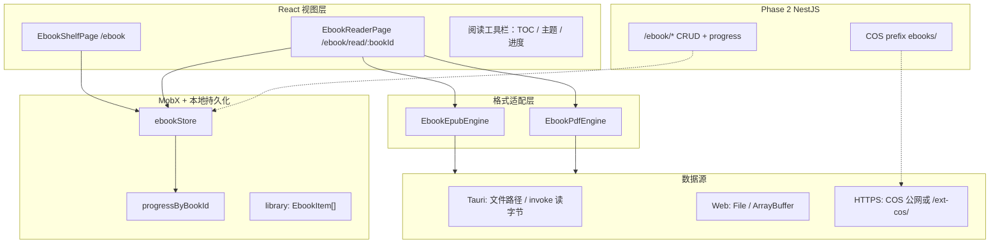

# 电子书阅读能力（Ebook Reader）实现方案 SPEC

> **实现状态（2026-06-13）**：MVP 已落地 — `/ebook` 书架、`/ebook/read/:bookId` 阅读；Tauri `pick_ebook_file` / `read_ebook_file`；Web IndexedDB 导入。代码见 `apps/frontend/src/views/ebook/`。  
> **性质**：产品 + 技术一体化方案，面向 **vibe coding 分阶段落地**；实现时以本仓库现有栈（React + Vite、MobX、Tauri 2、NestJS、腾讯云 COS、`/ext-cos/` 同源代理）为准。  
> **范围**：`apps/frontend` 为主；云端书架与进度同步在 **Phase 2** 扩展 `apps/backend`。  
> **非目标**：一期不做 DRM、书城购书、社交书评、听书全文 TTS 流水线（可与现有 **云 TTS** 设置页后续衔接）。

---

## 1. 目标与成功标准

### 1.1 用户目标

- 在应用内 **打开并阅读** 常见电子书：**EPUB**（优先）、**PDF**（一期并列）。
- **书架**：最近阅读、进度百分比、继续阅读入口。
- **阅读体验**：翻页/滚动、目录（TOC）、字体与主题（对齐应用 `theme`）、全屏/专注模式。
- **桌面端（Tauri）**：从本地目录导入 `.epub` / `.pdf`，大文件走 **路径引用 + 按需读取**，避免整本进内存。
- **Web 端**：通过上传或 COS 链接打开（体积受控，见 §8）。

### 1.2 一期成功标准（MVP，可验收）

| # | 验收项 |
|---|--------|
| 1 | 路由 `/ebook` 可进入书架；空态有「导入/打开」引导 |
| 2 | 打开 EPUB 后可连续阅读 ≥30 分钟无白屏；切章 TOC 可用 |
| 3 | 打开 PDF 后可翻页、缩放；进度条反映页码 |
| 4 | 退出再进入同一本书，**进度恢复**（误差 ≤1 章/1 页） |
| 5 | Tauri：从本地选文件打开；Web：`input[type=file]` 或 COS URL |
| 6 | 不破坏现有 `/knowledge`、`/chat`、`/english-learning` 路由与 bundle 首屏 |

### 1.3 与现有能力的关系

| 现有模块 | 关系 |
|----------|------|
| **知识库 `/knowledge`** | 二期：划线/摘录 **导出为 Markdown** 写入 `knowledgeStore`（不替代电子书引擎） |
| **Markdown 预览** | 仅用于 EPUB 内 **HTML 章节渲染样式参考**；电子书不用 `MarkdownParser` 解析整书 |
| **COS + `/ext-cos/`** | 云端书文件存储与 Web 阅读拉流（对齐头像/聊天附件模式） |
| **Tauri `download_file`** | 已支持保存对话框过滤器 `epub/mobi/azw3/pdf`（`download.rs`），阅读侧需 **独立打开/读取** 命令 |
| **英语学习** | 可选：阅读页「发送到 Agent」将选中段落带入 `/english-learning`（三期） |

---

## 2. 格式与引擎选型

### 2.1 一期支持矩阵

| 格式 | 优先级 | 渲染引擎 | 进度锚点 | 备注 |
|------|--------|----------|----------|------|
| **EPUB 2/3** | P0 | **epub.js 0.3.x** 或 **foliate-js**（二选一，见下） | CFI（Canonical Fragment Identifier） | 含 reflow 排版 |
| **PDF** | P0 | **pdf.js**（`pdfjs-dist`） | `pageIndex` + 可选 scroll offset | 扫描版以页为主 |
| MOBI/AZW3 | P2 | 不原生支持 | — | 建议 UI 提示「请先转换为 EPUB/PDF」或 Calibre 外链说明 |
| TXT/Markdown 全书 | 不做 | 已有知识库编辑器 | — | 避免与 `/knowledge` 重复 |

### 2.2 EPUB 引擎对比（推荐决策）

| 方案 | 包 | 优点 | 缺点 | 建议 |
|------|-----|------|------|------|
| **A. epub.js + react-reader** | `epubjs`、`react-reader` | React 封装成熟、社区示例多、CFI 进度 | 大 EPUB 性能一般、样式隔离需自己写 | **MVP 首选**（vibe coding 快） |
| **B. foliate-js** | `@johnfactotum/foliate` 或自托管 dist | 排版好、与 KOReader 同类体验 | 集成文档少、需更多胶水代码 | 体验不达标时再换 |

**决策**：Phase 0/1 用 **A**；在 `EbookReaderEpub.tsx` 内集中封装，后期可换引擎而不改书架/进度 store。

### 2.3 PDF 引擎

- 使用 **`pdfjs-dist`**（Mozilla PDF.js），版本与 `react-pdf` 可选其一：
  - **轻量**：直接 `pdfjs-dist` + Canvas/`TextLayer`（可控、与现有组件库少冲突）。
  - **快速**：`@react-pdf-viewer/core` + default layout（插件化缩略图/搜索，bundle 更大）。
- **MVP 建议**：`pdfjs-dist` + 自绘上一页/下一页 + `ScrollArea`，worker 走 Vite `?url` 引入。

---

## 3. 总体架构



### 3.1 核心原则

1. **书架元数据与文件分离**：`EbookItem` 存标题、作者、封面、来源、**fileLocator**（路径/key/url），不存全书正文。
2. **进度独立表**：`ReadingProgress` 按 `bookId` 存 CFI 或 `pageIndex`，debounce 写入（本地 IndexedDB / Phase 2 服务端）。
3. **阅读器单例路由**：一本一书一个 `bookId`；大文件离开路由时 **destroy** 引擎实例，释放 worker。
4. **主题继承**：阅读区 CSS 变量消费 `--theme-*` / `useTheme()`，提供「日间/夜间/纸质」三套预设。

---

## 4. 前端信息架构与路由

### 4.1 路由（`apps/frontend/src/router/routes.ts`）

| 路径 | 组件 | 说明 |
|------|------|------|
| `/ebook` | `views/ebook/index.tsx` | 书架：网格/列表、搜索、导入 |
| `/ebook/read/:bookId` | `views/ebook/reader.tsx` | 全屏阅读（可嵌布局或独立） |

注册位置建议：与 `/knowledge` 同级，挂在 `Layout` 下；侧栏入口名 **「书架」/「阅读」**（i18n `nav.ebook`）。

### 4.2 目录结构（建议新建）

```
apps/frontend/src/views/ebook/
  index.tsx                 # 书架页
  reader.tsx                # 阅读壳：按 format 分发
  components/
    EbookShelfGrid.tsx
    EbookImportMenu.tsx     # 本地打开 / 从 URL / 上传(COS)
    EbookReaderToolbar.tsx
    EbookTocDrawer.tsx
    EbookProgressFooter.tsx
  engines/
    types.ts                # EbookFormat, Locator, Engine API
    epub/
      EbookEpubView.tsx
      useEpubEngine.ts
    pdf/
      EbookPdfView.tsx
      usePdfEngine.ts
  utils/
    bookId.ts                # 稳定 id：hash(path|cosKey|serverId)
    persist.ts               # IndexedDB/localStorage 封装
    openBook.ts              # 统一打开：Tauri / File / URL

apps/frontend/src/store/ebook.ts   # ebookStore
apps/frontend/src/service/ebook.ts # Phase 2 HTTP
```

### 4.3 页面交互摘要

**书架页**

- 卡片：封面（缺省占位图）、标题、作者、进度条、最近阅读时间。
- 操作：继续阅读、移出书架、（Phase 2）同步状态。
- 导入：
  - **Tauri**：`invoke('pick_ebook_file')` → 写入 `library`（不复制文件，仅存 path）。
  - **Web**：`<input accept=".epub,.pdf">` → `ArrayBuffer` 缓存到 IndexedDB **或** 上传 COS 后存 url。

**阅读页**

- 顶栏：返回书架、书名、TOC 按钮、设置（字体/行距/主题）。
- 主体：`engines` 渲染区（占满剩余高度）。
- 底栏：进度、页码/百分比、（可选）上一章/下一章。
- 键盘：`←/→` 翻页，`Esc` 退出，`Ctrl/Cmd+F` 二期搜索。

---

## 5. 数据模型（TypeScript）

### 5.1 书架条目 `EbookItem`

```typescript
export type EbookFormat = 'epub' | 'pdf';

export type EbookSource =
  | { kind: 'tauri_path'; path: string }           // 桌面本地绝对路径
  | { kind: 'web_idb'; blobKey: string }           // IndexedDB 键（Web 离线）
  | { kind: 'cos'; key: string; url: string }       // COS 对象键 + 展示 URL
  | { kind: 'server'; serverBookId: string };       // Phase 2 服务端 id

export interface EbookItem {
  id: string;              // uuid 或 hash(source)
  format: EbookFormat;
  title: string;
  author?: string;
  coverDataUrl?: string;   // 小封面，可空
  source: EbookSource;
  addedAt: string;         // ISO
  updatedAt: string;
  fileSize?: number;
}
```

### 5.2 阅读进度 `ReadingProgress`

```typescript
export interface ReadingProgress {
  bookId: string;
  /** EPUB: epub.js rendition.location.start.cfi */
  epubCfi?: string;
  /** PDF: 0-based page index */
  pdfPage?: number;
  pdfScrollOffset?: number;
  percent?: number;        // 0–100 展示用
  updatedAt: string;
}
```

### 5.3 `ebookStore`（MobX）必备 API

```typescript
class EbookStore {
  library: EbookItem[] = [];
  progressByBookId: Record<string, ReadingProgress> = {};
  activeBookId: string | null = null;

  hydrate(): Promise<void>;           // 启动时读 IndexedDB
  addFromTauriPath(path: string): Promise<EbookItem>;
  addFromFile(file: File): Promise<EbookItem>;
  addFromCosUpload(file: File): Promise<EbookItem>; // Phase 1b
  removeBook(bookId: string): void;
  getProgress(bookId: string): ReadingProgress | undefined;
  saveProgress(patch: ReadingProgress): void; // debounce 1s
}
```

持久化键建议：`dnhyxc_ebook_library_v1`、`dnhyxc_ebook_progress_v1`（或统一 IndexedDB `ebook-db`）。

---

## 6. 格式引擎实现要点

### 6.1 EPUB（epub.js）

**流程**

1. `Book.open(arrayBuffer | url)` — Web 用 `ArrayBuffer`；COS 用 **signed/proxy url**（需支持 Range 更佳）。
2. `rendition = book.renderTo(container, { width, height, flow: 'paginated' | 'scrolled' })`。
3. `rendition.display(cfi?)` 恢复进度；监听 `relocated` 事件写回 CFI。
4. `book.loaded.navigation` → TOC 列表。

**样式**

- `rendition.themes` 注入 CSS：字体、行高、`color`/`background` 用 CSS 变量。
- 代码块可复用 `markdown-kit` 部分 code 样式（可选）。

**注意**

- 容器必须有 **明确宽高**（`ResizeObserver` 在布局变化时 `rendition.resize`）。
- 销毁：`rendition.destroy(); book.destroy()`。

### 6.2 PDF（pdf.js）

**流程**

1. `pdfjsLib.getDocument({ data: arrayBuffer, url })`。
2. `page.getViewport({ scale })` → canvas 绘制；或使用 `TextLayer`。
3. 进度：`pdfPage` + `scrollTop` 存 local。

**Worker**

```typescript
// vite 典型配置
import pdfWorker from 'pdfjs-dist/build/pdf.worker.min.mjs?url';
pdfjsLib.GlobalWorkerOptions.workerSrc = pdfWorker;
```

### 6.3 统一引擎接口（便于 vibe 分文件实现）

```typescript
export interface EbookEngine {
  mount(el: HTMLElement): Promise<void>;
  display(locator?: string): Promise<void>;
  next(): Promise<void>;
  prev(): Promise<void>;
  getToc(): Promise<EbookTocItem[]>;
  getProgress(): EbookProgressSnapshot;
  destroy(): void;
}
```

---

## 7. Tauri 扩展（桌面端）

### 7.1 已有能力

- 保存对话框已声明电子书扩展名（`download.rs`）。
- 知识库已有 `read_knowledge_markdown_file`、`pick_file` 模式可参考（`command/knowledge.rs`）。

### 7.2 建议新增命令

| 命令 | 作用 |
|------|------|
| `pick_ebook_file` | `rfd::FileDialog` 过滤 `epub,pdf` |
| `read_ebook_file_bytes` | 分块读取大文件（offset, length）或一次性读入 **&lt; 50MB** |
| `get_ebook_file_meta` | 返回 size、mimetype（可选） |

**大文件策略**：&gt; 50MB 的 EPUB/PDF 在桌面端 **仅传 path 给前端**，由 Rust 侧 `fs::read` 经 invoke 流式传 base64 块，或 Tauri 2 **asset / fs 插件** 映射本地 URL（优先调研 `@tauri-apps/plugin-fs` 生成 `convertFileSrc`）。

```typescript
// 前端典型用法（与 knowledge-save 一致）
import { convertFileSrc } from '@tauri-apps/api/core';
const assetUrl = convertFileSrc(path);
// epub.js / pdf.js 可直接 open(url)
```

**推荐 MVP**：`convertFileSrc` + path，**不读入 JS 堆**，与现有 Tauri 安全作用域需在 `tauri.conf` 配置 `scope` 允许用户书目录。

### 7.3 `tauri.conf` 能力

- `fs` / `dialog` 权限：用户选取的目录加入 allowlist（或每次 pick 文件单路径）。
- 不在一期默认扫描全盘；仅 **用户主动导入**。

---

## 8. Web 端与 COS（Phase 1b / 2）

### 8.1 上传

- 扩展 `COS_OBJECT_KEY_PREFIXES`：`ebooks`（需改 `apps/backend/src/services/upload/cos.config.ts`）。
- 新接口：`POST /upload/uploadCosEbook`（单文件，限制 **100MB**，mimetype `application/epub+zip` / `application/pdf`）。
- 前端复用 `uploadCosFile` 模式或 `DragUpload`（参考 `views/download`）。

### 8.2 阅读 URL

- 与聊天附件一致：`resolveCosUrlForWebDisplay(url)` → 生产走 **`/ext-cos/`** 同源代理，避免 mixed content。
- EPUB：若整包下载，先 `fetch` → `ArrayBuffer`（大书需 **Range** 或分卷，二期优化）。

### 8.3 后端 Phase 2 实体（NestJS 草案）

```
ebook_book: id, userId, title, author, format, cosKey, coverKey, size, createdAt
ebook_progress: userId, bookId, locatorJson, percent, updatedAt
```

接口：

| 方法 | 路径 | 说明 |
|------|------|------|
| GET | `/ebook/list` | 书架 |
| POST | `/ebook` | 注册已上传 COS 书 |
| DELETE | `/ebook/:id` | 移出书架 |
| GET | `/ebook/:id/progress` | 读进度 |
| PUT | `/ebook/:id/progress` | 写进度 |

JWT：与知识库一致 `JwtGuard`。

---

## 9. UI / 设计规范

- 布局：书架用 `ResizablePanelGroup` 或卡片 Grid（对齐 `englishLearning/library` 左右栏模式可选）。
- 组件：优先 `@/components/ui`（`Button`、`ScrollArea`、`Sheet` 作 TOC、`Slider` 字号）。
- 图标：`lucide-react`（`BookOpen`、`List`、`Settings`）。
- i18n：在 `apps/frontend/src/locales` 增加 `ebook.json` 片段或并入现有 zh/en 结构；键前缀 `ebook.*`。
- 无障碍：阅读区 `role="document"`；翻页按钮 `aria-label`；焦点 trap 仅在全屏模式启用。

### 9.1 主题预设

| 预设 | 背景 | 字色 | 场景 |
|------|------|------|------|
| 跟随应用 | `theme-background` | `textcolor` | 默认 |
| 纸质 | `#f4ecd8` | `#433422` | 长文 |
| 夜间 | `#1a1a1a` | `#e8e6e3` | 暗光 |

存储：`localStorage` `ebook_reader_prefs_v1`。

---

## 10. Vibe Coding 落地顺序（按 PR 切分）

以下每步可单独 prompt，**按序合并**即可跑通 MVP。

### Step 0：脚手架（0.5d）

- [ ] `routes.ts` 注册 `/ebook`、`/ebook/read/:bookId`。
- [ ] 空页面 + 侧栏导航入口 + i18n 占位。
- [ ] `store/ebook.ts` 空壳 + `hydrate`/`save` IndexedDB。
- [ ] **验收**：能点进书架空态。

### Step 1：EPUB 本地阅读（1–2d）

- [ ] `pnpm add epubjs`（若用 react-reader：`pnpm add react-reader epubjs`）。
- [ ] `engines/epub/EbookEpubView.tsx`：容器 + `display` + `next/prev`。
- [ ] Web：`input file` → `File.arrayBuffer()` → 加入 `library`。
- [ ] Tauri：`pick_ebook_file` + `convertFileSrc` → `book.open(url)`。
- [ ] 进度：`relocated` → `saveProgress` debounce。
- [ ] **验收**：同一本书刷新后 CFI 恢复。

### Step 2：PDF 本地阅读（1d）

- [ ] `pnpm add pdfjs-dist`。
- [ ] `EbookPdfView.tsx` + worker 配置。
- [ ] 与书架 `format` 分发 `reader.tsx`。
- [ ] **验收**：PDF 页码进度恢复。

### Step 3：书架 UX（1d）

- [ ] 网格卡片、删除、继续阅读、空态导入按钮。
- [ ] `EbookTocDrawer`（EPUB nav；PDF 用 outline 若可用）。
- [ ] 阅读器工具栏：字体大小 `Slider`、主题三态。

### Step 4：Tauri 硬化（0.5d）

- [ ] `tauri.conf` fs scope、`pick_ebook_file` 命令注册 `lib.rs`。
- [ ] 大文件路径阅读验证（≥20MB EPUB）。

### Step 5：COS 上传书架（1–2d，可拆 backend）

- [ ] Backend：`ebooks/` 前缀 + upload 接口。
- [ ] Frontend：`addFromCosUpload` + 书架展示 COS 书。
- [ ] **验收**：Web 生产环境通过 `/ext-cos/` 打开 EPUB。

### Step 6：服务端进度同步（1d）

- [ ] Backend CRUD + `ebookStore.syncProgress`。
- [ ] 登录后 `hydrate` 合并本地与云端（以 `updatedAt` 较新为准）。

### Step 7（可选）：与知识库联动

- [ ] 选中文字 →「保存到知识库」→ `knowledgeStore` 新建草稿并 `navigate('/knowledge')`。

---

## 11. 依赖清单（package.json 参考）

```json
{
  "dependencies": {
    "epubjs": "^0.3.93",
    "pdfjs-dist": "^4.10.38"
  }
}
```

可选：`react-reader`、`idb`（IndexedDB 封装）。  
**不要**一期引入 `mobi`、`kindle` 等原生解析库（Rust 侧成本高）。

---

## 12. 性能、安全与限制

| 项 | 建议 |
|----|------|
| 单书体积 Web | 软限 50MB，硬限 100MB（上传接口） |
| 单书体积 Tauri | 路径模式无硬限；内存模式 &lt; 50MB |
| XSS（EPUB HTML） | `sandbox` iframe 或 epub.js `sanitize`；禁用 script |
| CSP | 阅读页不执行书内 JS；仅允许 blob/data 图 |
| 版权 | 产品文案：仅个人合法收藏；不提供盗版源 |

---

## 13. 测试计划

| 类型 | 内容 |
|------|------|
| 单元 | `bookId` 哈希稳定、`progress` 合并逻辑 |
| 组件 | EPUB mock 小文件（fixtures/sample.epub）显示第一章 |
| E2E（可选） | 书架导入 → 阅读 → 刷新 → 进度保持 |
| 手动 | 中英文 EPUB、扫描版 PDF、Tauri macOS/Windows 各 1 本 |

---

## 14. 风险与对策

| 风险 | 对策 |
|------|------|
| bundle 增大 | 阅读路由 **lazy** `import()`；pdf worker 异步 |
| EPUB 样式炸裂 | 主题 CSS 重置 + 用户可调字号 |
| COS 整包下载慢 | 二期 Range / 本地缓存 IndexedDB |
| MOBI 用户预期 | 导入时格式检测 + 友好错误 |

---

## 15. 开放问题（实现前可默认）

1. **侧栏入口**放主导航还是「更多」？默认：与知识库并列一级。
2. **会员/配额**：电子书是否算 COS 用量？默认：与普通附件同一桶策略。
3. **分享**：是否生成公开阅读链接？默认：一期不做，仅私有书架。

---

## 16. 相关仓库路径索引

| 说明 | 路径 |
|------|------|
| 路由 | `apps/frontend/src/router/routes.ts` |
| 知识库 Tauri 读文件参考 | `apps/frontend/src/utils/knowledge-save.ts`、`apps/frontend/src-tauri/src/command/knowledge.rs` |
| COS 上传参考 | `apps/backend/src/services/upload/upload.service.ts` |
| COS Web 展示 | `apps/frontend/src/utils/index.ts`（`resolveCosUrlForWebDisplay`） |
| 英语资源库 UI 参考 | `apps/frontend/src/views/englishLearning/library/` |
| 下载/上传试验页 | `apps/frontend/src/views/download/index.tsx` |
| 主题 | `apps/frontend/src/hooks/theme.ts` |

---

**文档版本**：v1（2026-06-13）  
**若与仓库最新实现不一致，以代码为准。**
