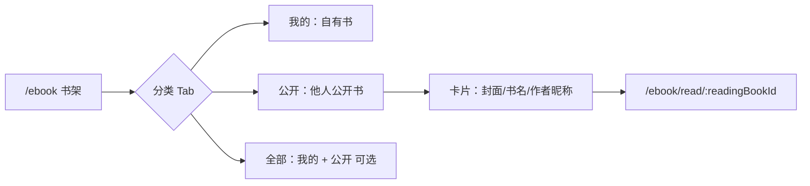

# 电子书公开书籍与协作阅读（Ebook Public Book）SPEC

> **实现状态（2026-07-02）**：**规划中** — 当前仅支持 EPUB **书摘图片分享**（`EpubQuoteShareDialog`）；**书架公开书籍、他人想法可见、分层划线** 尚未落地。  
> **依据代码（现状）**：`apps/backend/src/services/ebook/`（书籍/想法/划线/进度均按 `userId` 隔离）、`GET /ebook/shelf`、`apps/frontend/src/views/ebook/index.tsx`、`read.tsx`、`epubThoughtAnnotations.ts`、`epubUserHighlights.ts`。  
> **关联 SPEC**：[`ebook-reader.md`](./ebook-reader.md)、[`ebook-shelf-category.md`](./ebook-shelf-category.md)、[`epub-thought-nested-cluster-list.md`](./epub-thought-nested-cluster-list.md)。  
> **性质**：产品 + 技术一体化需求规范。**非链接分享**：书主将书设为公开后，**其他登录用户在自己的书架即可看到并阅读**，无需持链、无需受邀、无需复制链接。

---

## 1. 目标与范围

### 1.1 用户目标

- **公开书籍**：书主可将自己书架中的 EPUB 标记为 **公开**；公开后 **全站登录用户** 在 **自己的书架** 能看到该书（带来源作者信息）。
- **书架即入口**：读者从 `/ebook` 书架点卡片进入 `/ebook/read/:bookId`，与读自己的书路径一致；**不需要分享链接**。
- **可见书主批注**：阅读公开书时，能看到书主（原作者）的 **读书想法** 与 **想法虚线下划线**（只读）。
- **区分归属**：非本人想法下划线 **`#797673`**；本人想法 **`#d97706`**（与现网一致）。
- **叠层划线**：读者可在书主想法划线所在正文上 **再划自己的用户划线**；**本人用户划线视觉上覆盖他人想法划线**。
- **按人隔离**：同一本公开书上，各读者的 **阅读进度、用户划线、本人想法、MOKE 助手会话** 均按 `userId` 独立存储；互不影响。

### 1.2 成功标准（一期 MVP，可验收）

| # | 验收项 |
|---|--------|
| 1 | 书主在书架/阅读页可将 EPUB 切换为 **公开 / 私有** |
| 2 | 用户 B 登录后打开书架，能在 **公开区域或「全部」列表** 看到用户 A 公开的书（显示 A 的昵称/头像角标） |
| 3 | B 从书架点进该书 → `/ebook/read/:bookId`，**无需链接、无需接受邀请** |
| 4 | B 阅读时可见 A 的全部想法及 `#797673` 下划线；B 自己写的想法为 `#d97706` |
| 5 | B 可在 A 的想法文字上新建 **用户划线**，且盖住 A 的想法虚线 |
| 6 | B **不能** 编辑/删除 A 的想法；A **不能** 改 B 的进度/划线 |
| 7 | A、B 同读该公开书：进度各自保存、各自恢复（含强制刷新 keepalive，复用现网进度方案） |
| 8 | A **取消公开** 后，B 书架不再展示该书；B 已产生的个人批注/进度保留在 B 的读书记录上 |
| 9 | 嵌套选区想法聚合在「本人 + 书主」混合场景 **无回归** |
| 10 | **无** `shareId`、**无** 公开 URL 阅读页、**无** 复制链接作为主流程 |

### 1.3 范围（包含）

| 层级 | 内容 |
|------|------|
| **后端** | `ebook_book.is_public`、书架查询合并公开书、读书记录（派生书）、书主想法只读暴露、文件访问鉴权 |
| **前端** | 公开开关 UI、书架公开书展示、阅读页合并想法/划线、foreign 色与叠层 |
| **数据** | 书主「源书」+ 读者「读书记录」（派生书，`source_book_id` 指向源书） |

### 1.4 非目标（一期不做）

- **分享链接 / shareId / 扫码 / 复制 URL**（明确不做，与会话分享不同）。
- **未登录浏览公开书架**（书架与阅读均需登录，与现网电子书一致）。
- **PDF 公开**（PDF 暂无想法/用户划线）。
- **受邀制、白名单、审批上架**。
- **想法点赞、评论、回复**。
- **书摘图片分享** 改造（`EpubQuoteShareDialog` 维持独立）。
- **公开书二次编辑元数据**（读者不可改书名/封面；见 §8.1）。

---

## 2. 现状与差距

### 2.1 可复用能力

| 能力 | 现状 | 本功能用法 |
|------|------|------------|
| 书架分页 | `GET /ebook/shelf` | 扩展 `scope=mine\|public\|all` 或独立公开列表 |
| 分类 Rail | `EbookShelfCategoryRail` | 增加 **「公开」** Tab（推荐）或筛选项 |
| 阅读页 | `/ebook/read/:bookId` | 复用；`bookId` 为读者自己的读书记录 id |
| 进度保存 | `saveProg` + keepalive flush | 派生书 `bookId` 上 per-user，逻辑不变 |
| 想法/划线渲染 | `epubThoughtAnnotations` / `epubUserHighlights` | 合并书主 + 本人；foreign 色 |

### 2.2 核心差距

1. **`ebook_book` 无 `is_public` 字段**，书架仅查 `user_id = 当前用户`。
2. **无读书记录（派生书）**：他人阅读时没有独立 `bookId` 存进度/批注。
3. **`listThoughts` / `pipeFileToResponse` 仅书主可访问**。
4. **想法下划线未按作者区分颜色**。

---

## 3. 核心概念与术语

| 术语 | 含义 |
|------|------|
| **书主 / 原作者** | 上传并公开该书的用户；`ebook_book.user_id` 为书主 |
| **源书** | 书主书架上的图书记录；`is_public=true` 时进入全站公开目录 |
| **读者** | 任意其他登录用户，从 **自己书架** 打开公开书 |
| **读书记录** | 读者侧的 `ebook_book` 行：`user_id=读者`，`source_book_id=源书`，共享同一 `file_path`；用于进度/本人想法/划线 |
| **可见想法** | 书主在源书上的想法（全员只读）+ 读者在读书记录上的本人想法 |

### 3.1 关键标识

- **`sourceBookId`**：源书 UUID（书主那本）。
- **`readingBookId`**：当前用户阅读用的 `bookId`（书主读源书；读者读自己的读书记录）。
- **`thought.userId`**：`!== currentUserId` → 下划线 `#797673`。

### 3.2 与「链接分享」的区别（避免再混淆）

| 维度 | 链接分享（不做） | 公开书籍（本 SPEC） |
|------|------------------|---------------------|
| 发现方式 | 复制 URL | **书架列表** |
| 入口路由 | `/ebook/share/:id` | `/ebook` → `/ebook/read/:bookId` |
| 持久化令牌 | `shareId` | `is_public` + `source_book_id` |
| 受众 | 持链任何人 | **登录用户**，书架可见 |

---

## 4. 用户可见功能点

### 4.1 书主：公开 / 取消公开

- **入口**：书架卡片菜单、阅读页更多菜单 —「公开此书」/「取消公开」。
- **前置条件**：已登录；EPUB；`file_path` 已上云（会员 COS）；书主本人。
- **交互**：
  1. 切换开关前二次确认：「公开后，所有用户将在书架看到你的书及你的读书想法」。
  2. `PUT /ebook/book/:id/visibility` body `{ isPublic: true \| false }`。
- **取消公开**：书架对他人立即不可见；已打开的读者下次进书架看不到，个人读书记录仍保留。

### 4.2 读者：在书架发现公开书



- **展示位置（一期推荐）**：分类 Rail 增加 **「公开」** Tab，仅列出 `is_public=true` 且 `user_id ≠ 当前用户` 的书。
- **卡片信息**：书名、封面、**原作者头像+昵称**、可选想法条数、**本人阅读进度**（若曾读过）。
- **首次点击**：
  1. `POST /ebook/public/:sourceBookId/open`（幂等）→ 创建或返回读者的 **读书记录** `readingBookId`；
  2. 跳转 `/ebook/read/:readingBookId`。
- **再次点击**：直接进已有 `readingBookId`（书架公开列表可 join 读者 `progMap`）。

> **不做**：生成链接、二维码、站外分享页。

### 4.3 阅读页：想法与划线

- **数据加载**（`readingBookId` 对应读书记录，`sourceBookId` 指向源书）：
  - 书主想法：`GET /ebook/thoughts/public/:sourceBookId` 或扩展 `listThoughts` 在公开阅读上下文合并返回；
  - 本人想法/划线：`GET /ebook/thoughts/:readingBookId`、`GET /ebook/highlights/:readingBookId`；
  - 文件：`GET /ebook/file/:readingBookId`（服务端解析到源书 `file_path`）。
- **合并**：`visibleThoughts = ownerThoughts ∪ myThoughts`。

| 条件 | 下划线颜色 |
|------|------------|
| `thought.userId === currentUserId` | `#d97706` |
| 书主/他人想法 | `#797673` |
| 被本人用户划线盖住 | transparent |

### 4.4 点击书主想法

- 侧栏列表/详情；书主条目 **只读**（无编辑/删除）。
- 可复制、MK 问书、分享书摘（书摘图片，非整书链接）。

### 4.5 写想法 / 用户划线

- 写入 **读书记录** `readingBookId` + `currentUserId`。
- 一期：**读者想法仅自己可见**，书主读源书时看不到。

### 4.6 阅读进度

- `PUT /ebook/progress` 使用 **`readingBookId`**（读者）或源书 id（书主）。
- 强制刷新/关 Tab：**复用** `flushReadingProgress` + `saveEbookProgressKeepalive`（见 `docs/ideas/ebook-reading-progress-save.md`）。
- 书架公开 Tab 展示 **各读者自己的** `percent`，不是书主进度。

### 4.7 书主取消公开

| 对象 | 行为 |
|------|------|
| 他人书架公开 Tab | **不再列出** |
| 读者读书记录 | **保留**（含进度/本人批注） |
| 读者再次阅读 | 若保留读书记录且文件仍在 → 可读；UI 提示「该书已非公开展示」；若产品要求严格下线可读性，Phase 2 再加策略 |

---

## 5. 视觉与叠层规范

### 5.1 颜色令牌

```text
--epub-thought-line-own:       #d97706
--epub-thought-line-foreign:   #797673
--epub-thought-line-opacity:     0.55
--epub-thought-line-dasharray:  1 6
```

### 5.2 书架卡片

- 公开书角标：**「公开」** 或原作者昵称（与 [`ebook-shelf-category.md`](./ebook-shelf-category.md) 卡片样式一致）。
- 书主自己的书：开关为「已公开」时，在「我的」Tab 仍显示，**不出现在自己的「公开」Tab**（公开 Tab = 他人之书）。

### 5.3 叠层与命中

正文 → 书主/他人想法虚线 → 本人想法虚线 → 本人用户划线（最上）。  
命中：本人用户划线 > 本人想法 > 书主想法。

---

## 6. 数据模型与接口

### 6.1 扩展 `ebook_book`

| 字段 | 类型 | 说明 |
|------|------|------|
| `is_public` | boolean default false | 书主源书：是否全站公开 |
| `source_book_id` | uuid nullable | 非空 = 读者的读书记录，指向源书 |
| `public_at` | timestamp nullable | 首次公开时间（排序用） |

**约束**：

- 仅 **书主源书**（`source_book_id IS NULL`）可设 `is_public=true`。
- 读书记录：`user_id=读者`，`source_book_id=源书`，`is_public=false`，`file_path` 与源书相同（不复制 COS 对象）。
- 同一读者对同一源书：**唯一**读书记录（幂等 open）。

### 6.2 书架查询

**`GET /ebook/shelf?scope=public&pageNo=&pageSize=`**

- 条件：`is_public=true` AND `source_book_id IS NULL` AND `user_id <> :currentUserId`。
- 排序：`public_at DESC`。
- 响应每条附加：`owner: { userId, username, avatar }`；若当前用户有读书记录则带 `readingBookId`、`prog`（本人进度）。

**`GET /ebook/shelf?scope=mine`**（现网行为，仅自己的源书 + 读书记录可选是否展示）

- 一期建议 **「我的」仅源书**；读书记录仅在「公开」Tab 点过后出现进度，或 Phase 2「最近阅读」统一展示。

### 6.3 想法与划线

**公开阅读上下文 `GET /ebook/book/:readingBookId`** 返回：

```typescript
{
  book: Book;           // 读书记录元数据
  prog?: Prog;          // 本人进度
  publicSource: {
    sourceBookId: string;
    ownerUserId: number;
    ownerUsername: string;
    ownerAvatar: string;
    isStillPublic: boolean;  // 源书当前是否仍公开
  };
}
```

**`GET /ebook/thoughts/:readingBookId`**（扩展）：

- 若该书为读书记录：返回 `书主想法(source) ∪ 本人想法(readingBookId)`，按 `createdAt` 排序；每条可带 `isOwn`。
- 若该书为书主源书（私有阅读）：仅本人（现网）。

**`GET /ebook/highlights/:readingBookId`**：仅本人划线（不变）。

### 6.4 API 一览

| 方法 | 路径 | 说明 |
|------|------|------|
| PUT | `/ebook/book/:id/visibility` | 书主设 `isPublic` |
| GET | `/ebook/shelf?scope=public` | 他人公开书列表 |
| POST | `/ebook/public/:sourceBookId/open` | 幂等创建读书记录，返回 `readingBookId` |
| GET | `/ebook/book/:id` | 扩展 `publicSource` |
| GET | `/ebook/thoughts/:id` | 公开阅读时合并书主想法 |
| GET | `/ebook/file/:id` | 读书记录可解析源书文件 |
| PUT | `/ebook/progress` 等 | `bookId=readingBookId` |

**删除**原规划：`ebook_share` 表、`shareId`、公开 URL、`/ebook/share/*`。

### 6.5 文件访问鉴权

`pipeFileToResponse(userId, bookId)` 允许：

1. `book.user_id === userId`（自有或读书记录），或  
2. `book` 为读书记录且 `source` 源书 `is_public=true`（或源书曾公开且读书记录已存在 — 一期允许继续读）。

---

## 7. 前端模块改动要点

### 7.1 书架 `views/ebook/index.tsx`

- `EbookShelfCategoryRail`：增加 `{ kind: 'public' }` Tab。
- `ebookStore.fetchPage`：支持 `scope: 'public'`。
- 公开书卡片：展示原作者；点击 → `openPublicBook(sourceBookId)` → navigate read。

### 7.2 阅读页 `read.tsx`

- 根据 `book.publicSource` 或 `sourceBookId` 进入 **公开阅读模式**：
  - 合并加载书主 + 本人想法；
  - `currentUserId` 传入 EPUB 引擎用于上色；
  - 进度 flush 逻辑 **不变**（`readingBookId`）。
- 书主读自己的源书：行为与现网一致（仅本人想法）。

### 7.3 组件

| 模块 | 改动 |
|------|------|
| `EbookBookVisibilitySwitch.tsx` | 公开/私有开关 + 确认文案 |
| `epubThoughtAnnotations.ts` | `resolveThoughtLineColor` → foreign `#797673` |
| `epubUserHighlights.ts` | foreign 想法 suppression |
| `EpubThoughtList.tsx` | 书主想法只读 |
| `ebookStore.ts` | `setBookPublic`、`fetchPublicShelf`、`openPublicBook` |
| `types.ts` | `isPublic`、`sourceBookId`、`publicSource` |

### 7.4 路由

- **仅** `/ebook`、`/ebook/read/:bookId`；**不新增**分享专用路由。

---

## 8. 互斥与安全

### 8.1 权限矩阵

| 操作 | 书主（源书） | 读者（读书记录） |
|------|--------------|------------------|
| 设公开/私有 | ✓ | ✗ |
| 书架看到该书 | 「我的」 | 「公开」Tab |
| 读 EPUB | ✓ | ✓ |
| 看书主想法 | ✓ | ✓（只读） |
| 看读者自己的想法 | — | ✓ |
| 看书主看读者想法 | — | ✗（一期） |
| 编删书主想法 | ✓ | ✗ |
| 写本人想法/划线 | ✓ | ✓ |
| 改进度 | ✓（源书 id） | ✓（readingBookId） |
| 删书 | 删源书+级联书主数据 | 仅删自己的读书记录 |

### 8.2 鉴权

- 公开书架列表：仅登录用户。
- 书主想法：仅当源书 `is_public=true` 或请求方持有该源书的读书记录时返回。
- 禁止通过枚举 `bookId` 读取未公开他人书籍。

### 8.3 隐私文案

- 公开确认：「全书及你的读书想法将对所有用户可见，并出现在他人书架。」

---

## 9. 错误提示（i18n）

| 场景 | 中文 | 键名 |
|------|------|------|
| 非 EPUB | 仅支持公开 EPUB 书籍 | `ebook.public.epubOnly` |
| 无云端文件 | 请先上传至云端后再公开 | `ebook.public.cloudRequired` |
| 已取消公开 | 该书已不再公开 | `ebook.public.noLongerPublic` |
| 源书不存在 | 书籍不存在或已下架 | `ebook.public.sourceGone` |
| 开关失败 | 更新公开状态失败 | `ebook.public.visibilityFailed` |

---

## 10. 性能与工程约束

- 公开书架分页：与现网 `pageNo/pageSize` 一致，禁止一次拉全站公开书。
- 读书记录懒创建：仅 **点击阅读** 时 `open`，不在 shelf 列表批量插入。
- 想法合并：书主 + 本人两次查询或单次 JOIN，条数 <2000 一次加载。
- 登出：`resetOnUserSwitch()` 清空公开列表缓存。

---

## 11. 分阶段落地

### Phase 1（MVP）

- `is_public` + 公开书架 Tab + `open` 读书记录 + 合并想法 + foreign 色 + per-user 进度/批注。

### Phase 2

- 「全部」Tab 合并展示；源书取消公开后的读者策略可配置；书主想法增量同步。

### Phase 3（可选）

- 读者想法对书主可见；公开书搜索/排序；阅读人数统计。

---

## 12. 验收清单

### 12.1 书架公开

- [ ] 书主公开 EPUB 后，其他用户书架「公开」Tab 可见该书。
- [ ] 书主自己的「公开」Tab **不** 显示自己的书。
- [ ] 无分享链接流程；从书架点击进入阅读。
- [ ] 取消公开后，他人书架立即消失（刷新后）。

### 12.2 阅读与批注

- [ ] 可见书主想法，`#797673` 下划线；本人 `#d97706`。
- [ ] 可叠用户划线；书主想法只读。
- [ ] 嵌套 cluster 无回归。

### 12.3 按用户隔离

- [ ] A、B 同读一本公开书，进度互不影响；强刷后续读正确。
- [ ] 读者想法不出现在书主页。
- [ ] 换号登录数据隔离。

### 12.4 边界

- [ ] 仅云端 EPUB 可公开；PDF 无入口。
- [ ] 幂等 `open` 不产生 duplicate 读书记录。

---

## 13. 开放问题

1. **读书记录是否出现在「我的」书架**：一期建议 **仅公开 Tab + 继续阅读** 入口，避免书架重复卡片。
2. **取消公开后读者能否继续读**：一期建议 **可读**（已有读书记录），仅书架不展示；是否改为禁止需产品定。
3. **「全部」Tab 是否混入公开书**：Phase 1 可只做独立「公开」Tab，降低与分类筛选耦合。

---

## 14. 参考实现锚点

| 主题 | 路径 |
|------|------|
| 书架与分类 | `views/ebook/index.tsx`、`ebook-shelf-category.md` |
| 进度 keepalive | `read.tsx`、`ebookStore.flushProgRemoteSync` |
| 想法下划线 | `epubThoughtAnnotations.ts` |
| 用户划线 | `epubUserHighlights.ts` |
| 后端书籍 | `ebook-book.entity.ts`、`ebook.service.ts` |
