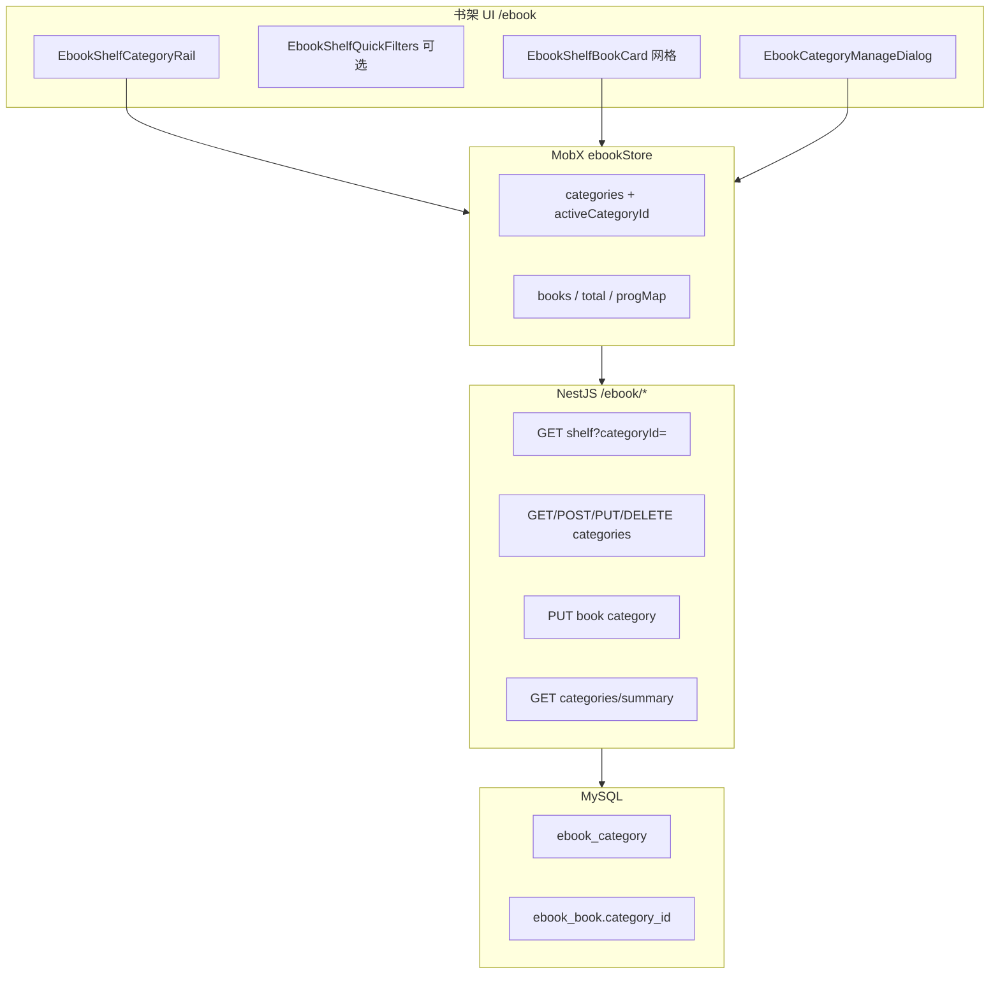

# 电子书书架分类（Ebook Shelf Category）SPEC

> **实现状态（2026-06-17）**：**Phase 1 已落地** — 分类 CRUD、书架筛选、Rail UI、卡片移动、导入默认分类。  
> **依据代码**：`apps/frontend/src/views/ebook/index.tsx`、`apps/frontend/src/store/ebook.ts`、`apps/backend/src/services/ebook/ebook-book.entity.ts`、`GET /ebook/shelf`。  
> **关联 SPEC**：[`ebook-reader.md`](./ebook-reader.md)（阅读引擎与书架 MVP）；本 SPEC 仅覆盖 **「我的书架」组织与筛选**，不改动 EPUB/PDF 阅读内核。  
> **性质**：产品 + 技术一体化方案，面向 **分阶段 vibe coding 落地**；实现时以现有栈（React + MobX、NestJS + TypeORM、JWT 鉴权、i18n zh/en）为准。

---

## 1. 目标与范围

### 1.1 用户目标

- 在 **我的书架**（`/ebook`）中，按 **用途/功能类型**（如技术、学习、文学、工作资料）把书分组浏览，而不是只在单一长列表里滚动查找。
- 导入或阅读过程中，能 **快速归类** 一本书；分类名可自定义、可改名、可排序。
- 切换分类后仍保留 **阅读进度、封面、会员上传策略** 等既有能力，不引入第二套书架。

### 1.2 成功标准（一期，可验收）

| # | 验收项 |
|---|--------|
| 1 | 书架顶栏下方出现 **分类导航**：「全部」+ 用户分类 +「未分类」；点击切换后列表仅展示对应书籍 |
| 2 | 用户可 **新建 / 重命名 / 删除** 分类；删除后原书籍归入「未分类」 |
| 3 | 书籍卡片菜单可 **移动到分类**；移动后立即反映在列表与计数上 |
| 4 | 导入新书（Tauri 选路径 / Web 上传）时，默认归入 **上次选用的分类**（localStorage 记忆，可改） |
| 5 | `GET /ebook/shelf` 支持 `categoryId` 筛选；分类 **计数** 与列表 total 一致 |
| 6 | 切换登录用户后分类与筛选状态清空并重新拉取（对齐 `ebookStore.resetOnUserSwitch()`） |
| 7 | 中英文 i18n 完整；未破坏现有分页滚动加载与删除/改封面/改书名 |

### 1.3 范围（包含）

- **后端**：分类实体、书籍 `categoryId` 外键、分类 CRUD、书架按分类查询、分类统计。
- **前端**：`ebookStore` 扩展、书架 UI（分类栏 + 管理弹窗 + 卡片移动入口）、service/api、types、i18n。
- **数据迁移**：存量书籍 `category_id = NULL`（未分类）。

### 1.4 非目标（一期不做）

- **一本书多标签（multi-tag）**：一期每书 **至多一个主分类**；多标签留 Phase 2（见 §12）。
- **AI 自动分类 / 从元数据猜分类**：不做；仅用户显式操作 + 可选导入时默认分类。
- **跨用户共享分类 / 公共书库分类**：分类 strictly per `userId`。
- **分类级权限 / 加密**：不做。
- **阅读页内改分类**：可选 Phase 1.1；一期仅在书架卡片操作即可。

---

## 2. 设计原则（为何这样选）

### 2.1 「主分类 + 快捷筛选」双层模型

| 层级 | 含义 | 持久化 | 典型例子 |
|------|------|--------|----------|
| **主分类（Category）** | 用户定义的「书架文件夹」 | 服务端 DB | 技术、英语学习、小说 |
| **快捷筛选（Filter）** | 派生维度，辅助在当前分类内收窄 | 仅前端 session / localStorage | EPUB / PDF、在读 / 未读 |

**理由**：

1. 用户说的「按功能类型分类」本质是 **语义分组**，必须可命名、可改，不能只靠 `fmt` 或进度字段代替。
2. 一期 **单分类** 足够覆盖 80% 场景，UI 与数据模型简单（外键即可），避免 junction 表 + 标签管理复杂度。
3. `fmt`、阅读进度、本地/云端来源等 **已有字段可筛选**，不必写入分类表。

### 2.2 与现有架构对齐

- 书架数据 **以服务端为准**（已落地 Phase 2 云端书架）；分类必须与 `ebook_book` 同行存储，保证 Web / Tauri / 换设备一致。
- **分页不变**：分类切换 = 换查询条件 + `fetchPage(1, false)`，禁止一次拉全库在前端 filter。
- **会员 / 本地路径 / COS 上传** 流程不改；仅在 `add-path` / `upload` 响应后可选 `PUT` 绑定分类。

---

## 3. 总体架构



---

## 4. 数据模型

### 4.1 实体 `ebook_category`（新建）

| 字段 | 类型 | 说明 |
|------|------|------|
| `id` | UUID PK | |
| `user_id` | int | 与 `ebook_book.user_id` 一致 |
| `name` | varchar(64) | 展示名；同用户下 trim 后 **唯一**（大小写不敏感） |
| `sort_order` | int | 越小越靠前；默认 `0` |
| `created_at` / `updated_at` | timestamp | |

**索引**：`UNIQUE (user_id, name_normalized)` 或通过应用层校验；`INDEX (user_id, sort_order)`。

**不设** `is_system` 锁死字段：推荐分类在 **首次进入书架且 categories 为空** 时由后端 `ensureDefaultCategories(userId)` 插入，用户可改名/删除，避免中英文预设名与 i18n 冲突。

**推荐默认分类（种子，可删改）**：

| sort_order | 中文默认名 | 英文默认名（按 locale 插入其一，或统一存用户输入语言） |
|------------|------------|--------------------------------------------------------|
| 0 | 技术 | Tech |
| 1 | 学习 | Learning |
| 2 | 文学 | Literature |
| 3 | 工作 | Work |
| 4 | 其他 | Other |

> **实现建议**：种子名称写入 **用户创建时的 `Accept-Language` / 前端显式 locale**；后续改名纯用户自定义，不再随语言切换自动翻译。

### 4.2 书籍表扩展 `ebook_book`

新增可空外键：

```typescript
@Column({ type: 'uuid', name: 'category_id', nullable: true })
categoryId: string | null;
```

- `NULL` = **未分类**（Uncategorized）。
- `ON DELETE SET NULL`：删分类不删书。

### 4.3 前端 TypeScript

```typescript
/** 书架分类 */
export type EbookCategory = {
  id: string;
  name: string;
  sortOrder: number;
  /** 该分类下书籍总数（summary 接口填充） */
  bookCount?: number;
};

export type Book = {
  // ...现有字段
  categoryId?: string | null;
};

/** 书架虚拟 Tab：全部 | 某分类 | 未分类 */
export type EbookShelfCategoryKey =
  | { kind: 'all' }
  | { kind: 'category'; categoryId: string }
  | { kind: 'uncategorized' };
```

### 4.4 「未分类」与「全部」

| Tab | 查询条件 |
|-----|----------|
| **全部** | 不过滤 `category_id` |
| **某分类** | `category_id = :id` |
| **未分类** | `category_id IS NULL` |

Tab 计数来自 `GET /ebook/categories/summary`，**不**用当前页 `books.length` 代替 total。

---

## 5. API 契约

### 5.1 分类列表 + 统计

**`GET /ebook/categories/summary`**

响应：

```typescript
{
  categories: Array<{
    id: string;
    name: string;
    sortOrder: number;
    bookCount: number;
  }>;
  uncategorizedCount: number;
  totalBookCount: number;
}
```

- 鉴权：`JwtGuard`，按 `userId` 聚合。
- 若用户无任何分类行，服务端 **lazy seed** 默认 5 类后再返回（幂等）。

### 5.2 分类 CRUD

| 方法 | 路径 | Body | 说明 |
|------|------|------|------|
| POST | `/ebook/categories` | `{ name: string }` | 新建；重名 409 |
| PUT | `/ebook/categories/:id` | `{ name?: string; sortOrder?: number }` | 重命名 / 排序 |
| DELETE | `/ebook/categories/:id` | — | 删分类；关联书 `category_id → NULL` |
| PUT | `/ebook/categories/reorder` | `{ orderedIds: string[] }` | 批量更新 sort_order |

### 5.3 书籍归属

**`PUT /ebook/book/:id/category`**

Body: `{ categoryId: string | null }`

- `null` = 移出到未分类。
- 校验：`categoryId` 必须属于当前用户或为空。
- 响应：更新后的 `Book` DTO（含 `categoryId`）。

### 5.4 书架分页（扩展 query）

**`GET /ebook/shelf`** — 在现有 `QueryEbookShelfDto` 上增加：

```typescript
@IsOptional()
@IsUUID()
categoryId?: string; // 指定分类

@IsOptional()
@IsBoolean()
@Transform(({ value }) => value === 'true' || value === true)
uncategorizedOnly?: boolean; // 与 categoryId 互斥
```

- **互斥**：`categoryId` 与 `uncategorizedOnly` 不可同时传；否则 400。
- 排序保持 `createdAt DESC`（一期）；分类内可按添加时间，符合「最近导入在前」习惯。

**`EbookBookDto`** 增加可选 `categoryId?: string | null`。

### 5.5 导入时带分类（可选增强）

**`POST /ebook/add-path`**、**`POST /ebook/upload`** Body 可选 `categoryId`：

- 若传且合法，创建/更新书籍后直接写入 `category_id`。
- 若不传，`category_id = NULL`（前端仍可用 `PUT book/:id/category` 补设）。

---

## 6. 前端状态与 Store

### 6.1 `ebookStore` 扩展字段

```typescript
class EbookStore {
  // 现有 books, total, pageNo, progMap ...

  categories: EbookCategory[] = [];
  uncategorizedCount = 0;
  /** 当前选中的书架 Tab */
  activeCategoryKey: EbookShelfCategoryKey = { kind: 'all' };
  categoriesLoading = false;

  /** localStorage: dnhyxc_ebook_last_category_v1:{userId} */
  lastImportCategoryId: string | null = null;
}
```

### 6.2 必备方法

| 方法 | 行为 |
|------|------|
| `fetchCategories()` | 拉 summary，写入 `categories` / counts |
| `setActiveCategoryKey(key)` | 更新 key → `fetchPage(1, false)` |
| `createCategory(name)` | POST → refresh summary |
| `renameCategory(id, name)` | PUT → refresh |
| `removeCategory(id)` | DELETE → 若当前 Tab 为该分类则切回「全部」→ refresh |
| `reorderCategories(orderedIds)` | PUT reorder → refresh |
| `assignBookCategory(bookId, categoryId \| null)` | PUT → 更新本地 `books` / `bookCache` 中该书；refresh summary counts |
| `hydrate()` | **并行** `fetchCategories()` + `fetchPage(1, false)` |

### 6.3 `resetOnUserSwitch()` 扩展

在现有清空逻辑上增加：

```typescript
this.categories = [];
this.uncategorizedCount = 0;
this.activeCategoryKey = { kind: 'all' };
this.lastImportCategoryId = null;
// 不读上一用户的 localStorage
```

### 6.4 `fetchPage` 查询参数映射

```typescript
function shelfQueryFromKey(key: EbookShelfCategoryKey) {
  if (key.kind === 'category') return { categoryId: key.categoryId };
  if (key.kind === 'uncategorized') return { uncategorizedOnly: true };
  return {};
}
```

切换 Tab 时必须 **重置 pageNo=1**，清空 append 模式，避免跨分类脏数据。

---

## 7. UI / UX 规格

### 7.1 布局（`index.tsx`）

在 `EbookPanelHeader` 与 `ScrollArea` 之间插入 **分类区**：

```
┌─────────────────────────────────────────────────────┐
│ 我的书架 (12)                    [导入按钮...]       │
├─────────────────────────────────────────────────────┤
│ [全部 12] [技术 3] [学习 5] [未分类 2] [+ 管理]      │  ← EbookShelfCategoryRail
├─────────────────────────────────────────────────────┤
│ （可选）[EPUB] [PDF] [在读] [未读]                   │  ← Phase 1 可省略，见 §7.5
├─────────────────────────────────────────────────────┤
│  书籍网格 ...                                        │
└─────────────────────────────────────────────────────┘
```

- **Rail 交互**：横向 `ScrollArea` + chip/tab 样式；当前项高亮（`ring-theme` / `bg-theme/10`）。
- **计数**：chip 后缀 `(n)`；加载中显示 `-` 或 skeleton，不显示 0 误导。
- **「+ 管理」**：打开 `EbookCategoryManageDialog`。

### 7.2 分类管理弹窗 `EbookCategoryManageDialog`

- 列表：拖拽把手（可选 Phase 1.1）或上下箭头调 `sortOrder`。
- 每行：名称 inline 编辑、删除（Confirm：「删除后书籍将移至未分类」）。
- 底部：输入框 + 「添加分类」。
- 重名：Toast 错误，不关闭弹窗。

### 7.3 书籍卡片 `EbookShelfBookCard`

在现有 hover 操作区增加 **「分类」** 入口（`FolderInput` 或 `Tag` 图标）：

- 点击 → `DropdownMenu` / `Popover` 列出分类 + 「未分类」。
- 选中 → `ebookStore.assignBookCategory`。
- 若当前 Tab 为某分类且书被移出，卡片 **从列表消失**（无需整页刷新，本地 filter 或 refetch 当前页）。

可选：封面角标显示分类名（仅当非「全部」Tab 时可隐藏，避免重复）。

### 7.4 导入默认分类

- Tauri / Web 导入成功前：读取 `lastImportCategoryId`（按 userId 分 key）。
- 若存在且仍属于 `categories`，则 `add-path` / `upload` 带 `categoryId`，或成功后 `assignBookCategory`。
- 用户在 Rail 选中的 Tab 若为 `{ kind: 'category' }`，导入后 **自动归入该 Tab 分类** 并记忆为 lastImport。

### 7.5 快捷筛选（Phase 1 可选 / 1.1 推荐）

纯前端派生，**不写 DB**：

| 筛选 | 规则 |
|------|------|
| EPUB / PDF | `book.fmt` |
| 在读 | `prog.percent > 0` 或存在 `epubCfi` / `pdfPage` |
| 未读 | 无进度 |

在当前 `books` 数组上 `useMemo` 过滤；切换筛选 **不** 改 `activeCategoryKey`。与分页冲突时：**优先服务端分类 + 客户端 fmt 过滤**；若 fmt 过滤导致当前页条数过少，Phase 1.1 再将 `fmt` 升为 shelf query 参数 `?fmt=epub`。

### 7.6 空态

| 场景 | 文案要点 |
|------|----------|
| 全书架无书 | 沿用 `ebook.shelf.empty` |
| 某分类无书 | 「此分类暂无书籍」+ 引导切换或导入 |
| 未分类无书 | 「暂无未分类书籍」 |

---

## 8. 用户动作 → 状态机（关键路径）

### 8.1 进入书架

1. `userId > 0` → `ebookStore.hydrate()`。
2. 并行 `fetchCategories` + `fetchPage(1)`（activeKey 默认 `{ kind: 'all' }`）。
3. Rail 渲染；Grid 渲染 `books`。

### 8.2 切换分类 Tab

1. `setActiveCategoryKey`。
2. `loading=true`，`fetchPage(1, false)` 带 category query。
3. 滚动区域回顶（`scrollTop=0`）。
4. **互斥**：`loadingMore` 期间忽略 Tab 连点或 cancel 前序请求（`silent` + 序号 token 模式，与知识库列表一致即可）。

### 8.3 移动书籍到分类

1. 卡片菜单选分类 → `assignBookCategory`。
2. 乐观更新：patch `books` / `bookCache` 的 `categoryId`。
3. 若与当前 Tab 不匹配，从 `books` 移除并 `total--`；`fetchCategories` 刷新计数。
4. 失败：Toast + `fetchPage` 回滚。

### 8.4 删除分类

1. Confirm → `DELETE /ebook/categories/:id`。
2. 若 `activeCategoryKey` 指向该 id → 切 `{ kind: 'all' }`。
3. `fetchCategories` + `fetchPage(1)`。

### 8.5 切换用户

1. `resetUserState()` → `ebookStore.resetOnUserSwitch()`。
2. 新 `userId` effect → 重新 `hydrate()`。

---

## 9. i18n 键（建议）

| Key | 中文 | English |
|-----|------|---------|
| `ebook.shelf.category.all` | 全部 | All |
| `ebook.shelf.category.uncategorized` | 未分类 | Uncategorized |
| `ebook.shelf.category.manage` | 管理分类 | Manage categories |
| `ebook.shelf.category.add` | 添加分类 | Add category |
| `ebook.shelf.category.rename` | 重命名 | Rename |
| `ebook.shelf.category.delete` | 删除分类 | Delete category |
| `ebook.shelf.category.deleteConfirm` | 删除后，该分类中的书籍将移至「未分类」。 | Books in this category will move to Uncategorized. |
| `ebook.shelf.category.move` | 移动到分类 | Move to category |
| `ebook.shelf.category.empty` | 此分类暂无书籍。 | No books in this category. |
| `ebook.shelf.category.duplicateName` | 分类名称已存在 | Category name already exists |
| `ebook.shelf.filter.epub` | EPUB | EPUB |
| `ebook.shelf.filter.pdf` | PDF | PDF |
| `ebook.shelf.filter.reading` | 在读 | In progress |
| `ebook.shelf.filter.unread` | 未读 | Unread |

---

## 10. 后端实现要点

### 10.1 文件清单（建议）

| 路径 | 职责 |
|------|------|
| `ebook-category.entity.ts` | 实体 |
| `dto/create-ebook-category.dto.ts` | 校验 name 长度 1–64 |
| `dto/update-ebook-category.dto.ts` | |
| `dto/reorder-ebook-categories.dto.ts` | |
| `dto/assign-ebook-category.dto.ts` | |
| `dto/query-ebook-shelf.dto.ts` | 扩展 category 参数 |
| `ebook.service.ts` | summary、CRUD、assign、shelf where 条件 |
| `ebook.controller.ts` | 路由注册 |
| `migrations/XXXX-ebook-category.ts` | 建表 + `ebook_book.category_id` |

### 10.2 校验与安全

- 所有写操作校验 **category.book.userId === req.userId**。
- 分类名：`trim`、禁止纯空白、同 user 下 case-insensitive 唯一。
- 单用户分类数量上限建议 **50**（防滥用，超出 400）。

### 10.3 删除书籍

现有 `DELETE /ebook/delete/:id` **无需**动分类表；`category_id` 随书删除。

---

## 11. 前端实现清单

| 路径 | 职责 |
|------|------|
| `views/ebook/types.ts` | `EbookCategory`、`EbookShelfCategoryKey`、扩展 `Book` |
| `views/ebook/components/EbookShelfCategoryRail.tsx` | Tab 导航 |
| `views/ebook/components/EbookCategoryManageDialog.tsx` | 管理弹窗 |
| `views/ebook/index.tsx` | 挂载 Rail、导入默认分类 |
| `views/ebook/components/EbookShelfBookCard.tsx` | 移动到分类菜单 |
| `store/ebook.ts` | 状态与方法 |
| `service/index.ts` + `service/api.ts` | HTTP 封装 |
| `i18n/locales/zh-CN.ts` / `en-US.ts` | 文案 |

组件优先使用仓库 `@ui` / `@design`（`Button`、`ScrollArea`、`Dialog`、`Confirm`、`DropdownMenu`、`Input`）；新增组件前可查组件目录 MCP。

---

## 12. 分阶段路线图

### Phase 1（本 SPEC 核心，建议 1 PR）

- DB + API + Store + Rail + 管理弹窗 + 卡片移动 + shelf 筛选 + i18n + 用户切换重置。

### Phase 1.1（体验抛光）

- 分类拖拽排序 UI；导入时 Popover 选分类；`fmt` 服务端 query；阅读页工具栏「书架分类」快捷项。

### Phase 2（多标签）

- `ebook_book_tag` + 多对多；Rail 仍用 **主分类**；筛选区增加 tag chips；搜索 `GET /ebook/shelf?q=`。

### Phase 3（智能辅助）

- 导入后根据文件名/EPUB metadata  **建议分类**（一键采纳）；与 Agent 联动「把选中段落归档到知识库某分类」——独立 SPEC。

---

## 13. 边界条件与风险

| 场景 | 预期行为 |
|------|----------|
| 分类被删，书在旧 Tab | 书变为未分类；若正在该 Tab，切全部并刷新 |
| 并发改分类名 | 后写覆盖；409 重名提示 |
| 分页加载中切换 Tab | 丢弃过期响应或 abort |
| 非会员 Tauri 仅 localPath | 分类仍走服务端元数据，与 COS 无关 |
| `findBookByLocalPath` 命中已存在 | 不自动改分类；Toast 已导入 |
| 种子分类被删光 | 允许；Rail 仅「全部 / 未分类」 |
| 长分类名 | 超长 ellipsis；完整名 Tooltip |

---

## 14. 测试计划

### 14.1 后端

- 同 user 重名分类 → 409。
- 删分类 → 书 `category_id` 全 NULL。
- shelf `categoryId` / `uncategorizedOnly` 计数与 SQL 一致。
- 跨 user 访问他人 categoryId → 403/404。

### 14.2 前端

- 切换 Tab 后 Grid 与 total 一致；滚动加载不串 Tab。
- 移动书后计数 chip 更新。
- 登出 / 换号 → Rail 清空且无上一用户分类名闪现。
- 导入书在「学习」Tab 下 → 出现在学习列表。

### 14.3 手工回归

- 改封面、改书名、删书、继续阅读、会员上传 Banner 与分类并存无回归。

---

## 15. 验收清单（Checklist）

- [ ] `ebook_category` 表与 `ebook_book.category_id` 迁移已执行
- [ ] `GET /ebook/categories/summary` 返回计数正确
- [ ] 分类 CRUD + reorder API 可用
- [ ] `GET /ebook/shelf?categoryId=` / `uncategorizedOnly=true` 筛选正确
- [ ] `PUT /ebook/book/:id/category` 可移动书籍
- [ ] 书架 Rail UI 切换分类列表正确
- [ ] 管理弹窗可增删改名
- [ ] 卡片可移动到分类
- [ ] 导入默认归入当前/上次分类
- [ ] `resetOnUserSwitch` 清空分类状态
- [ ] zh-CN / en-US 文案齐全
- [ ] 与 [`ebook-reader.md`](./ebook-reader.md) 阅读链路无冲突

---

## 16. 与现有代码对照（落地前）

| 能力 | 当前实现 | 本 SPEC 变更 |
|------|----------|--------------|
| 书架列表 | `GET /ebook/shelf` 仅分页 | + category 筛选 + DTO `categoryId` |
| `Book` 类型 | 无分类字段 | + `categoryId?` |
| `ebookStore` | `books/total/progMap` | + `categories/activeCategoryKey` |
| 书架 UI | 平铺 Grid | + CategoryRail + 管理弹窗 |
| DB `ebook_book` | 无 category | + FK `category_id` |

---

*文档版本：2026-06-17 · 作者：SPEC（待开发）*
