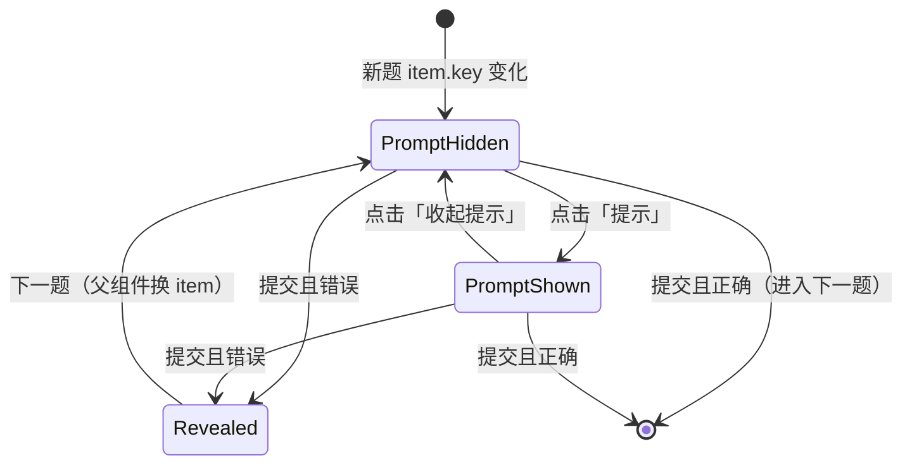

# 单词练习单题「提示」交互 SPEC

> **范围**：`/english-learning/practice` 运行中（`phase === 'running'`）的单题卡片 `Session`。  
> **依据实现**：`apps/frontend/src/views/englishLearning/practice/Session.tsx`、`DictationPromptBody`、`SpellingPromptBody`、`SessionStageHeader`。  
> **版本**：v1（2026-05-25）  
> **性质**：产品行为 + 前端实现约定；本文档为验收与开发蓝图，落地时以本文与源码一致为准。

---

## 1. 目标与范围

### 1.1 目标

用户在**作答前**（`phase === 'prompt'`）可主动请求**辅助线索**，在不直接泄露正确答案英文拼写的前提下，降低听写/拼写难度：

- **听写**：仍通过播放钮听音；提示区补充音标、分词、释义等（见 §3.2）。
- **看中写**：仍显示中文释义；提示区补充音标、分词、例句等（见 §3.3）。

入口位于单题卡顶栏 `SessionStageHeader` **右侧**（与「拼写错误」标签共用 `trailing` 槽位，按阶段互斥显示）。

### 1.2 包含

| 包含                             | 说明                                         |
| -------------------------------- | -------------------------------------------- |
| 顶栏「提示」操作                 | 仅 `prompt` 阶段可见、可点                   |
| `DictationPromptBody` 提示内容区 | 展开/替换底部说明文案                        |
| `SpellingPromptBody` 提示内容区  | 主释义下方追加线索块                         |
| 状态与重置                       | 换题、提交判题后重置                         |
| i18n / 无障碍                    | 按钮文案、`aria-pressed`、提示区 `aria-live` |

### 1.3 不包含（后续迭代）

- 每轮练习提示次数上限、积分惩罚（如需可加 `practiceConfig.hintLimit`）。
- 提示内容分级（弱/中/强）；v1 一次性展示全部可用字段。
- 错题揭示态（`phase === 'revealed'`）内的提示——揭示态已由 `WordAnswerDetail` 展示完整答案。
- 后端新字段；提示数据全部来自现有 `PracticeItem`（`EnglishVocabularyItem` 快照）。

---

## 2. 术语与数据

| 术语           | 含义                                                                                 |
| -------------- | ------------------------------------------------------------------------------------ |
| `PracticeItem` | 单题词条，含 `word`、`ipa`、`pos`、`segmentation`、`translationZh`、`example`、`key` |
| `phase`        | `'prompt'` 作答中；`'revealed'` 答错后展示正确答案                                   |
| `hintOpen`     | 本题是否已展开提示（布尔，Session 本地 state）                                       |
| **硬约束**     | `prompt` 阶段**禁止**展示 `item.word`（英文词面），避免等同于泄题                    |

提示可用字段（与 `WordAnswerDetail` 揭示态对齐，但**不含 word**）：

| 字段            | 听写提示                     | 拼写提示                   |
| --------------- | ---------------------------- | -------------------------- |
| `ipa`           | 展示                         | 展示                       |
| `segmentation`  | 有则展示                     | 有则展示                   |
| `translationZh` | 展示（听写时用户未看到中文） | **不重复**（已是主文案）   |
| `example`       | 可选展示                     | 展示                       |
| `pos`           | 可选展示                     | **不重复**（拼写主区已有） |

---

## 3. 交互规格

### 3.1 顶栏 `SessionStageHeader.trailing`

**布局**（`prompt` 阶段）：

```
[ 模式图标 | 模式标题                    ] [ 提示按钮 ]
```

**布局**（`revealed` 阶段）：

```
[ 模式图标 | 模式标题                    ] [ 拼写错误 ]
```

#### 3.1.1 提示按钮

| 属性           | 约定                                                                                                                               |
| -------------- | ---------------------------------------------------------------------------------------------------------------------------------- |
| 组件           | `Button` `variant="ghost"` `size="sm"` 或 `variant="link"`，与练习页其它次要操作一致                                               |
| 文案           | 未展开：`t('englishLearning.practice.hintShow')` → 建议中文 **「提示」**；已展开：`hintHide` → **「收起提示」**（v1 允许切换收起） |
| 图标（可选）   | `Lightbulb` / `CircleHelp`，`size-3.5`，与文字间距 `gap-1`                                                                         |
| 可见           | `phase === 'prompt'`                                                                                                               |
| 禁用           | `!hasHintContent(item)`（§3.4）                                                                                                    |
| 点击           | `setHintOpen((v) => !v)`；不触发提交、不停止 TTS                                                                                   |
| `aria-pressed` | `hintOpen`                                                                                                                         |
| `aria-label`   | 与可见文案一致                                                                                                                     |

#### 3.1.2 「拼写错误」标签

- 保持现有逻辑：仅 `phase === 'revealed'` 时显示，`text-destructive`。
- 与提示按钮**不同时出现**。

### 3.2 听写 — `DictationPromptBody`

**默认**（`hintOpen === false`）：保持现状——步骤条、播放钮、均衡器、`hint` 静态说明（`dictationHint`）。

**展开提示**（`hintOpen === true`）：

- **底部区域**（原 `hint` 段落位置，约 L161–L165）改为 **提示内容块** `PracticeHintContent`（新建，见 §5）：
  - 若有 `translationZh`：显示标签「中文释义」+ 文案（听写模式下用户平时看不到中文）。
  - 若有 `ipa`：标签「音标」+ `displayIpaWrapped(ipa)`。
  - 若有 `segmentation`：标签「分词」+ `SegmentationLine`。
  - 若有 `example`：标签「例句」+ 斜体例句（样式对齐 `WordAnswerDetail`）。
- 顶部步骤条、播放区**不变**；用户仍可听音。
- 可选：底部增加一行弱提示 `hintDictationReminder`：「仍未显示英文拼写，请根据读音与线索输入」。

**动画**：提示块使用 `transition-[opacity,max-height]` 或条件渲染 + `animate-in fade-in`，时长 ≤ 200ms；尊重 `prefers-reduced-motion`。

### 3.3 拼写 — `SpellingPromptBody`

**默认**（`hintOpen === false`）：保持 `promptLabel` + `translationZh` + `pos`。

**展开提示**（`hintOpen === true`）：

- 在 `pos` 下方（或 `translationZh` 下方）插入 `PracticeHintContent`：
  - `ipa`、`segmentation`、`example`（有则显示）。
  - **不**再次展示 `translationZh` / `pos`。
- 主释义字号与层级不变；提示块用 `border-theme/10 mt-4 border-t pt-4` 与主内容分隔，字号 `text-sm`。

### 3.4 无可用提示内容

定义：

```typescript
function hasPracticeHintContent(
	item: PracticeItem,
	mode: PracticeMode,
): boolean {
	const hasIpa = Boolean(item.ipa?.trim());
	const hasSeg = Boolean(item.segmentation?.trim());
	const hasEx = Boolean(item.example?.trim());
	if (mode === "dictation") {
		return hasIpa || hasSeg || hasEx || Boolean(item.translationZh?.trim());
	}
	// spelling：主区已有 translationZh、pos
	return hasIpa || hasSeg || hasEx;
}
```

- `hasPracticeHintContent === false` 时：顶栏提示按钮 `disabled`，`title`/Tooltip 使用 `hintUnavailable`（「本题暂无额外提示」）。

### 3.5 状态机



**重置 `hintOpen = false` 的时机**（与现有 `useEffect([item.key])` 合并）：

- `item.key` 变化（新题）。
- 不在 `revealed` 阶段保留展开态（换题时已重置）。

**不重置**：

- 听写自动播放、输入框 focus/blur、`playing` 变化。

### 3.6 与判题的关系

- 展开提示**不**影响 `gradeSpelling` 与是否进入 `revealed`。
- 答错进入 `revealed` 后，提示按钮隐藏；完整答案由 `RevealedPanelInner` / `WordAnswerDetail` 展示（含 `word`）。

---

## 4. 组件与类型变更

### 4.1 新增 `PracticeHintContent`

**路径**：`apps/frontend/src/views/englishLearning/practice/components/session/PracticeHintContent.tsx`

**Props**：

```typescript
export type PracticeHintContentProps = {
	mode: "dictation" | "spelling";
	ipa?: string | null;
	segmentation?: string | null;
	translationZh?: string | null;
	example?: string | null;
	/** 拼写模式为 false，避免重复主区释义 */
	showTranslation?: boolean;
	className?: string;
};
```

**职责**：按 §3.2/3.3 字段表渲染带标签的多行线索；复用 `SegmentationLine`、`displayIpaWrapped`；无字段时返回 `null`（由父级保证 `hasPracticeHintContent` 才展开）。

### 4.2 扩展 `DictationPromptBodyProps`

```typescript
export type DictationPromptBodyProps = {
	// 现有字段 ...
	hint: string; // 未展开时底部说明
	hintOpen: boolean;
	hintContent: Pick<
		PracticeHintContentProps,
		"ipa" | "segmentation" | "translationZh" | "example"
	>;
};
```

底部渲染逻辑：

```tsx
{
	hintOpen ? (
		<PracticeHintContent mode="dictation" showTranslation {...hintContent} />
	) : (
		<p className="...">{hint}</p>
	);
}
```

### 4.3 扩展 `SpellingPromptBodyProps`

```typescript
export type SpellingPromptBodyProps = {
	promptLabel: string;
	translationZh: string;
	pos?: string;
	hintOpen: boolean;
	hintContent: Pick<
		PracticeHintContentProps,
		"ipa" | "segmentation" | "example"
	>;
};
```

### 4.4 `Session.tsx` 组装

```tsx
const [hintOpen, setHintOpen] = useState(false);

useEffect(() => {
  // 现有 reset...
  setHintOpen(false);
}, [item.key]);

const hintContent = useMemo(
  () => ({
    ipa: item.ipa,
    segmentation: item.segmentation,
    translationZh: item.translationZh,
    example: item.example,
  }),
  [item],
);

const canHint = hasPracticeHintContent(item, mode);

// trailing
trailing={
  phase === 'prompt' ? (
    <Button
      type="button"
      variant="ghost"
      size="sm"
      disabled={!canHint}
      aria-pressed={hintOpen}
      onClick={() => setHintOpen((v) => !v)}
    >
      {hintOpen ? t('...hintHide') : t('...hintShow')}
    </Button>
  ) : (
    <span className="...">{t('...incorrect')}</span>
  )
}
```

`DictationPromptBody` / `SpellingPromptBody` 传入 `hintOpen` 与 `hintContent`。

### 4.5 工具函数（可选）

**路径**：`practice/utils/hint.ts`

- `hasPracticeHintContent(item, mode)`
- 单元测试可覆盖「仅 ipa」「全空」等分支。

---

## 5. 文案（i18n）

在 `zh-CN.ts` / `en-US.ts` 增加：

| Key                                              | 中文建议         | English                      |
| ------------------------------------------------ | ---------------- | ---------------------------- |
| `englishLearning.practice.hintShow`              | 提示             | Hint                         |
| `englishLearning.practice.hintHide`              | 收起提示         | Hide hint                    |
| `englishLearning.practice.hintUnavailable`       | 本题暂无额外提示 | No extra hints for this word |
| `englishLearning.practice.hintLabelIpa`          | 音标             | IPA                          |
| `englishLearning.practice.hintLabelSegmentation` | 分词             | Syllables                    |
| `englishLearning.practice.hintLabelTranslation`  | 中文释义         | Meaning (ZH)                 |
| `englishLearning.practice.hintLabelExample`      | 例句             | Example                      |

---

## 6. 无障碍与键盘

| 项         | 要求                                                                 |
| ---------- | -------------------------------------------------------------------- |
| 提示按钮   | 可 Tab 聚焦；`Enter`/`Space` 切换（`Button` 默认）                   |
| 提示内容区 | `aria-live="polite"`，展开时读屏可感知新增内容                       |
| 对比度     | 提示标签 `text-textcolor/55`，内容 `text-textcolor/80`，满足现有主题 |
| 减少动效   | 展开动画在 `motion-reduce:transition-none` 下关闭                    |

---

## 7. 视觉规范（摘要）

| 元素         | 类名参考                                                            |
| ------------ | ------------------------------------------------------------------- |
| 顶栏提示按钮 | `text-teal-600 hover:text-teal-500 dark:text-teal-400`，`h-8 px-2`  |
| 提示块容器   | `rounded-md bg-theme/5 px-3 py-2.5 text-left`                       |
| 提示项标签   | `text-[11px] font-medium uppercase tracking-wide text-textcolor/50` |
| 听写底部     | 保持 `text-[11px] leading-relaxed` 密度，避免挤压播放区             |

卡片总高 `SESSION_CARD_H` **不变**；听写展开提示时，底部说明区可 `max-h-[38%] overflow-y-auto`，播放区 `min-h-0` 收缩。

---

## 8. 验收清单

### 8.1 顶栏

- [ ] `prompt` 阶段右侧显示「提示」；`revealed` 阶段显示「拼写错误」，无「提示」。
- [ ] 无任何线索字段时按钮禁用，Tooltip/title 为「暂无额外提示」。
- [ ] 点击切换展开/收起，`aria-pressed` 正确。
- [ ] 换题后提示恢复为收起。

### 8.2 听写

- [ ] 未展开：与原 UI 一致（步骤、播放、底部 `dictationHint`）。
- [ ] 展开：底部显示音标/分词/释义/例句（有则显示），**不**显示英文 `word`。
- [ ] 展开后仍可播放/停止读音。

### 8.3 拼写

- [ ] 未展开：仅中文释义 + 词性。
- [ ] 展开：追加音标、分词、例句，不重复中文释义。
- [ ] **不**显示英文 `word`。

### 8.4 判题

- [ ] 展开提示后答对/答错行为与未展开一致。
- [ ] 答错揭示态展示完整 `WordAnswerDetail`（含 word）。

### 8.5 国际化

- [ ] 中英文切换后按钮与提示标签文案正确。

---

## 9. 实现任务拆分（建议 PR 顺序）

1. **utils + types**：`hint.ts`、`DictationPromptBodyProps` / `SpellingPromptBodyProps` 扩展。
2. **`PracticeHintContent`**：纯展示组件 + Storybook（若有）。
3. **`DictationPromptBody` / `SpellingPromptBody`**：条件渲染提示区。
4. **`Session.tsx`**：`hintOpen` 状态、顶栏按钮、传参。
5. **i18n**：中英 key。
6. **自测**：听写/拼写各一词（字段齐全 / 仅 ipa / 全空）。

---

## 10. 相关文件索引

| 角色                 | 路径                                                                  |
| -------------------- | --------------------------------------------------------------------- |
| 单题容器             | `apps/frontend/src/views/englishLearning/practice/Session.tsx`        |
| 顶栏                 | `practice/components/session/SessionStageHeader.tsx`                  |
| 听写题干             | `practice/components/dictation/DictationPrompt.tsx`                   |
| 拼写题干             | `practice/components/spelling/SpellingPromptBody.tsx`                 |
| 揭示答案（对照字段） | `practice/components/reveal/WordAnswerDetail.tsx`                     |
| 分词展示             | `apps/frontend/src/views/englishLearning/shared/SegmentationLine.tsx` |
| 类型                 | `practice/types.ts`                                                   |

---

## 11. 修订记录

| 版本 | 日期       | 说明                                         |
| ---- | ---------- | -------------------------------------------- |
| v1   | 2026-05-25 | 初稿：顶栏提示按钮 + 听写/拼写题干区提示内容 |
