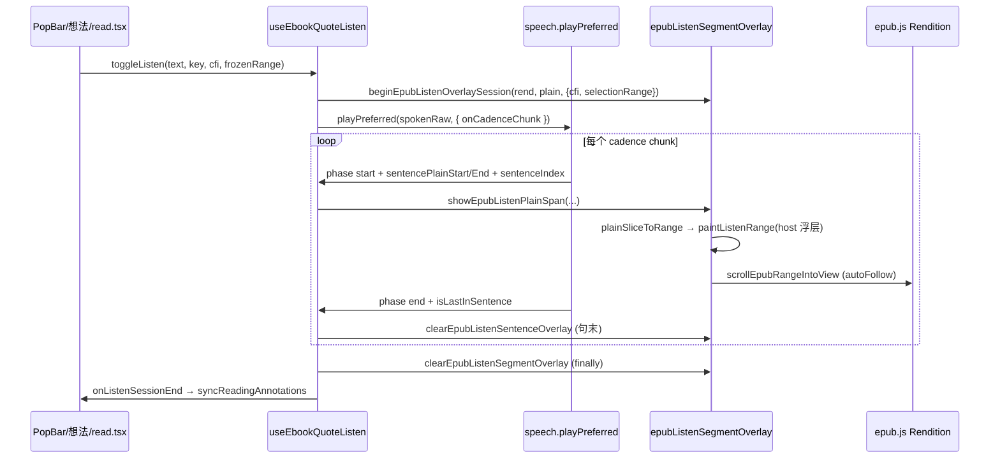
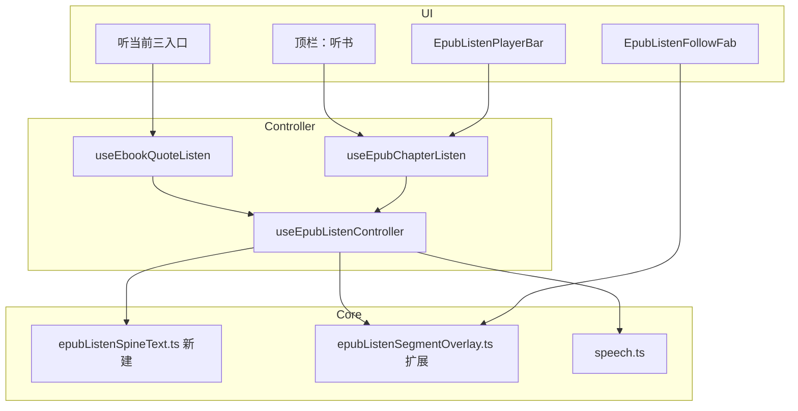
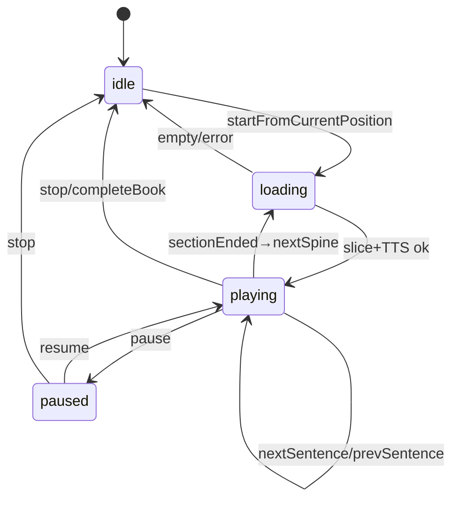

# EPUB 边听边读（Listen While Reading）实现方案 SPEC

> **实现状态（2026-06-25）**：**部分已落地** — 选区/引用 **「听当前」**、逐句淡黄底、host 浮层绘制、句间清除、自动滚入视口与 **回到播放位置 FAB**；**未落地** — 全书/整章连续朗读、底部播放条、倍速/定时、章节自动衔接、听读进度独立锚点。  
> **依据代码**：`useEbookQuoteListen.ts`、`epubListenSegmentOverlay.ts`、`speech.ts`、`EpubListenFollowFab.tsx`、`read.tsx`、`EpubPane.tsx`、`epubScrolledNav.ts`。  
> **关联文档**：[`docs/ebook/epub-quote-listen.md`](../docs/ebook/epub-quote-listen.md)、[`docs/ebook/epub-listen-host-overlay.md`](../docs/ebook/epub-listen-host-overlay.md)、[`docs/ebook/epub-listen-auto-follow-fab.md`](../docs/ebook/epub-listen-auto-follow-fab.md)、[`ebook-reader.md`](./ebook-reader.md)。  
> **参考产品**：微信读书、Kindle（Read Aloud / Whispersync）、Apple Books、多看阅读、Google Play 图书、得到（课程听读，预录为主，仅借鉴交互）。

---

## 1. 目标与范围

### 1.1 产品定义

| 概念 | 含义 | 当前仓库 |
|------|------|----------|
| **听当前** | 对用户 **已选中/已引用** 的一段文字做 TTS，播完即停 | ✅ 已落地（PopBar / 想法三入口） |
| **边听边读** | 从 **当前阅读位置** 起，按正文顺序 **连续朗读**，同步 **句级高亮 + 视口跟随**，可暂停/跳转/调速，必要时 **自动进入下一 spine 节** | ❌ 本 SPEC 主体 |

**边听边读** 不是另造 TTS 引擎，而是在现有 **英语学习 TTS 栈 + EPUB 播放浮层** 上，把「单次选区会话」升级为 **可续播的 spine 级会话**。

### 1.2 用户目标（边听边读 V1）

1. 阅读 EPUB 时一键 **从当前屏/当前 CFI 开始听**，无需先选中段落。
2. 播放中 **当前句淡黄底**（复用现有浮层），**自动滚入视口**；手动滚动后 FAB **回到播放位置**（已有）。
3. 底部 **迷你播放条**：暂停/继续、上一句/下一句、停止、倍速（与设置页 TTS 参数对齐或覆盖会话级倍速）。
4. 当前章节（spine section）播完后 **询问或自动** 进入下一节（可配置，默认自动）。
5. 停止或离开阅读页时 **不破坏** 用户划线、想法虚线、MK 问书侧栏；播完仍 `syncReadingAnnotations`（已有回调链）。

### 1.3 成功标准（V1 可验收）

| # | 验收项 |
|---|--------|
| 1 | 连续滚动模式下，从当前 CFI 开始听，至少连续播完 **当前 spine 节** 全文，句间高亮无残留（跨 `<p>` 换行正确） |
| 2 | 播放条可见；暂停后高亮保留在暂停句；继续后从暂停句续播 |
| 3 | 「上一句 / 下一句」可跳转，跳转后 **立即** 重播目标句并更新高亮 |
| 4 | 手动 scroll/wheel 后 autoFollow 暂停，点 FAB 回位并恢复跟随 |
| 5 | 分页模式下可从当前页开始听；跨页时 `scrollEpubRangeIntoView` / `rend.display(cfi)` 能跟上 |
| 6 | 播放中 PopBar「听当前」、想法「听当前」与全书听 **互斥**：新开一种则 stop 另一种 |
| 7 | 离开 `/ebook/read/:bookId` 或切书时 stop 并清 overlay |
| 8 | 会员云端 TTS 长章 **分段预取** 不阻塞 UI；首句出声 ≤ 现有「听当前」长选区体验 |

### 1.4 非目标（V1 不做）

- **真人讲书 / 版权音频**（喜马拉雅模式）：仅 TTS，不接 MP3 章节音轨。
- **PDF 边听边读**（与 `epub-quote-listen` 一致，PDF 无入口）。
- **后台锁屏播放 / 系统媒体会话**（Media Session API）：可列 V2；V1 仅前台 Tab 内播放。
- **听读与 Whispersync 级双向进度**（听一句改 CFI 并写服务端进度）：V1 仅 **可选** 在停止时把 **最后播放 CFI** 写入本地 `ebookStore` 进度（debounce），不做听读专用服务端表。
- **词级卡拉 OK 逐字高亮**：V1 句级即可（与微信读书默认一致）。

---

## 2. 市面产品对标（交互与能力矩阵）

> 下列为 **产品行为** 摘要，用于定 V1 交互默认值；不意味着实现相同后端。

| 能力 | 微信读书 | Kindle Read Aloud | Apple Books | 多看阅读 | **本仓库 V1 建议** |
|------|----------|-------------------|-------------|----------|-------------------|
| 入口 | 阅读页工具栏「听书」 | 工具栏耳机 | 长按 / 菜单 Read Aloud | 底部听书 | **顶栏或浮动工具栏「听书」** + 保留「听当前」 |
| 朗读范围 | 全书 / 从本章 | 从当前页起 | 从当前起 | 从当前章起 | **从当前 spine 节起**，节末自动下一节 |
| 句级高亮 | ✅ 淡色底 | ✅ | ✅ 词/句 | ✅ | ✅ 复用 `EPUB_LISTEN_SEGMENT_FILL` |
| 视口跟随 | ✅ 自动翻页/滚动 | ✅ | ✅ | ✅ | ✅ `autoFollow` + FAB（已有） |
| 手动浏览打断 | ✅ 停止自动滚 | ✅ | ✅ | ✅ | ✅ scroll guard（已有） |
| 播放条 | 底部固定条 | 顶部/底部 | 迷你条 | 底部 | **底部固定条**（阅读列内 `sticky`） |
| 倍速 | 0.5–3x | 多档 | 0.5–2x | 多档 | **0.75 / 1 / 1.25 / 1.5**（会话级，写 `speech` rate） |
| 定时关闭 | ✅ | — | ✅ | ✅ | **V2** |
| 音色 | 多 TTS 音色 | 系统 | 系统 | 商用 TTS | **复用设置页** 云端/本机偏好 |
| 与划线共存 | ✅ | ✅ | ✅ | ✅ | ✅ 禁止 `annotations.remove(cfi)`（已有约束） |
| 进度 | 听书进度独立 | Whispersync | 书签 | 听书进度 | V1：**停止时** 可选更新 CFI；不做独立听书百分比 |

**借鉴要点（落地到设计）**

1. **微信读书**：边听边读 = **连续队列 + 句 highlight + 底部条**；用户拖进度条 = 我们 V1 用 **上一句/下一句** 代替（lazy：不做 spine 内 scrub 滑块，避免 CFI↔offset 双向映射成本）。
2. **Kindle / Apple**：**从当前位置起播** 是默认路径；无选区时不弹选区框。
3. **共性状态机**：`idle → playing → paused → playing → stopped`；任何 **新开朗读** 先 `stopAllPlayback()`（现有 `useEbookQuoteListen` 已如此）。

---

## 3. 现状基线（以代码为准）

### 3.1 数据流（听当前）



### 3.2 已有模块职责

| 模块 | 职责 | 边听边读复用方式 |
|------|------|------------------|
| `speech.ts` | `splitTextForTtsCadence`、`buildSentenceOffsetSpans`、`TtsCadenceChunkEvent`、`playPreferred`、云端分段预取 | **直接复用**；整章 plain 作为一次 `spokenRaw` 传入 |
| `epubListenSegmentOverlay.ts` | Session、`plain` 映射、`paintListenRange`（host 浮层）、`autoFollow`、scroll guard、FAB 状态 | **扩展 session**：`mode: 'quote' \| 'chapter'`、`sentenceCursor` |
| `epubScrolledNav.ts` | `scrollEpubRangeIntoView`、`getEpubScrollContainer` | **直接复用** |
| `epubRangeGeometry.ts` | CFI ↔ Range、`getAccurateRangeLineClientRects` | **直接复用**；新增 **spine 文本抽取** 时用于校验 |
| `useEbookQuoteListen.ts` | `playingKey`、toggle、overlay 生命周期 | **拆层**：底层 `useEpubListenController`，上层 quote/chapter 两种 API |
| `EpubListenFollowFab.tsx` | `active && !autoFollow` 显示 | **不改**；chapter 模式共用同一 subscribe |
| `read.tsx` | 接线 PopBar/想法 | **新增** 顶栏听书按钮 + 底部 `EpubListenPlayerBar` |

### 3.3 现状局限（gap 根因）

| 局限 | 代码表现 | 边听边读需补 |
|------|----------|--------------|
| 文本来源 = 选区 | `resolveEpubListenPlain` 依赖 `selectionRange` / PopBar 缓存 | **从 spine 节 DOM 或 section.load 抽 plain** |
| 播完即停 | `playPreferred` 一次调用结束 | **章节队列**：节末触发下一节 `loadSectionPlain` |
| 无播放条 UI | 仅 PopBar 按钮变「停止」 | **`EpubListenPlayerBar`** |
| plain 偏移仅相对选区 | `buildPlainCompactMap(outer, session.plain)` | chapter 模式 `outer` = **整节 Range 或 body**，`startCfi` 定位句 cursor |
| 无句级 seek API | 仅 cadence 顺序播放 | **停止当前 utterance → 从 `sentences[i]` 重新 `playPreferred` 子串** |

---

## 4. 总体方案（架构）

### 4.1 分层



### 4.2 核心原则

1. **单一 TTS 会话**：全局仍用 `playbackGeneration` + `stopAllPlayback()`；quote 与 chapter **互斥**。
2. **单一 overlay session**：仍只有一个 `session` in `epubListenSegmentOverlay.ts`；chapter 模式延长生命周期，不按句重建 session。
3. **plain 是唯一音频真相**：TTS 与 highlight 共用同一段 `plain`；DOM 映射失败时 **跳过该句并打 log**，不 fallback 到 annotation 写 iframe。
4. **lazy 不做进度条 scrub**：V1 仅句级 prev/next；节内百分比映射留 V2。

---

## 5. 用户可见功能点

### 5.1 从当前位置开始听（章节模式）

- **触发入口**：阅读页顶栏新增 **「听书」**（i18n `ebook.read.listenBook`）；图标建议 `Headphones`（Lucide），与「听当前」区分。
- **前置条件**：
  - 格式为 EPUB；`epubNavRef.getRendition()` 非空；
  - `isPlaybackAvailable()` 为 true；
  - 与 **听当前** 互斥：若 `playingKey != null` 或 chapter `status !== idle'`，先 stop。
- **状态变化**：
  - `chapterListen.status`: `idle → loading → playing`；
  - `beginEpubListenOverlaySession(rend, sectionPlain, { cfi: startCfi, selectionRange: sectionRange })`；
  - `session.mode = 'chapter'`（新增字段）；
  - `sentenceCursor` = 从 startCfi 对应句 index 起。
- **网络**：`playPreferred(sectionPlainSlice, { onCadenceChunk, speak: { rate } })`；云端长节走现有 `playCloudTtsCadenceSegments`。
- **UI**：显示 `EpubListenPlayerBar`；顶栏按钮变为 **「停止听书」** 或高亮态。
- **错误与回滚**：抽文本失败 Toast `ebook.read.listenBook.emptySection`；`finally` 清 overlay + `status = idle`。
- **边界**：
  - 当前节无正文（纯图）：Toast 并 idle；
  - 当前 CFI 在节末 10%：仍从该 CFI 起播到节末，再下一节。

### 5.2 底部播放条（`EpubListenPlayerBar`）

| 控件 | 行为 |
|------|------|
| 暂停 / 继续 | `stopAllPlayback` 仅停音频 vs `pause` flag；继续从 `sentenceCursor` 重播当前句起 |
| 停止 | stop + `clearEpubListenSegmentOverlay` + idle |
| 上一句 | `sentenceCursor -= 1`（下限 0）；stop 音频；从该句 plain 偏移重播 |
| 下一句 | `sentenceCursor += 1`（上限 `sentences.length-1`）；同上 |
| 倍速 | 下拉 0.75/1/1.25/1.5；写入 session `rate`；**下一句起**生效（当前句播完再应用，避免 utterance 中途改 rate 兼容问题） |
| 标题行 | 显示 `第 n 章 · 第 i / N 句`（spine 标题来自 TOC 或 `section.index+1`） |

**布局**：`read.tsx` 阅读列底部 `sticky bottom-0`；`z-index` 高于正文、低于全局 Modal；窄屏可折叠为仅图标行。

**参考**：微信读书底部条高度 ~56px，左右 safe area；本仓库用 `@/components/design` 或 `ui` Button，样式对齐 `EbookPanelHeader`。

### 5.3 句级高亮与视口（复用 + 小改）

- **触发**：仍由 `onCadenceChunk` `phase === 'start'` → `showEpubListenPlainSpan(sentencePlainStart, sentencePlainEnd, sentenceIndex)`。
- **chapter 模式差异**：`session.plain` = **整节 plain**；`sentencePlainStart/End` 已是节内偏移 — **无需改 speech**。
- **startCfi 之前的句**：加载节文本后，用 `buildSentenceOffsetSpans(plain)` 找到 **第一个 offset ≥ startCfi 映射 plain 位置** 的句作为初始 `sentenceCursor`；播放时 TTS 仍从整段 plain 的对应 offset 切片（见 §6.2）。
- **autoFollow / FAB**：逻辑不变；chapter 长节手动滚动更常见，FAB 保留。

### 5.4 节末衔接下一 spine

- **触发**：当前 `playPreferred` 完成且 `session.mode === 'chapter'`。
- **逻辑**：
  1. `nextSpineIndex = current + 1`；若越界 → `status = stopped`，Toast「全书读完」可选。
  2. `await rend.display(nextSectionCfi)` 或 continuous manager 滚到下一 iframe。
  3. `loadSectionPlain(rend, nextSpineIndex)` → 新 plain；
  4. `sentenceCursor = 0`；更新 session.plain / selectionRange；
  5. 继续 `playPreferred`。
- **ponytail:** V1 用 **顺序 await** 衔接，不做并行预加载下一节全文；升级路径：节末倒数 30s 预 `section.load`。

### 5.5 与「听当前」共存

| 场景 | 规则 |
|------|------|
| 听书中点 PopBar「听当前」 | stop chapter → 走 quote toggle |
| 听当前中点「听书」 | stop quote → 走 chapter |
| 听书中打开 MK 问书 / 想法侧栏 | **允许**；不 stop |
| 听书中改字号/主题 | overlay `relocated`/`rendered` 重绘（已有）；若 reflow 导致 plain 映射大面积失败 → stop + Toast |

---

## 6. 技术设计（可落地）

### 6.1 新建 `epubListenSpineText.ts`

**职责**：从 Rendition 当前或指定 spine 节抽取 TTS 用 plain 文本，并给出 **节级 outer Range**（用于 `buildPlainCompactMap`）。

```typescript
// 建议导出（实现时放在 apps/frontend/src/views/ebook/utils/epubListenSpineText.ts）

export type EpubSectionTextSlice = {
  spineIndex: number;
  plain: string;
  /** 用于 DOM 映射的 Range：通常为 section document body 或从首段到末段 */
  outerRange: Range | null;
  /** 节起始 CFI，供 display / 进度 */
  startCfi: string;
};

/** 从当前 rendition 位置解析 spine index */
export function resolveCurrentSpineIndex(rend: Rendition): number | null;

/** 加载 spineIndex 对应 section 的 plain（stripMarkdownForTts + 去空白折叠策略与选区一致） */
export async function loadSectionTextSlice(
  rend: Rendition,
  spineIndex: number,
): Promise<EpubSectionTextSlice | null>;

/** 给定节 plain 与起始 CFI，计算从该 CFI 起的 plain 偏移与初始 sentenceIndex */
export function resolveStartSentenceAtCfi(
  rend: Rendition,
  slice: EpubSectionTextSlice,
  startCfi: string,
): { plainStart: number; sentenceIndex: number } | null;
```

**实现路径（推荐顺序）**

1. **DOM 路径（优先）**：若目标节已在 DOM（连续滚动常已挂载），对 `contents.document.body` 做 `cloneContents` + `stripMarkdownForTts(innerText)`，并用 `resolveCfiDomRange` 构造 `outerRange`。
2. **section.load 路径（回退）**：`book.spine.get(spineIndex).load(book.load)` 得 XHTML 字符串 → 临时 `DOMParser` → 同 strip 逻辑（注意 **不用** 写入 iframe，避免污染）。
3. **plain 对齐**：与 `resolveEpubListenPlain` 相同走 `stripMarkdownForTts`；否则 TTS 与 highlight 偏移不一致。

**自检（ponytail）**：`loadSectionTextSlice` 对当前书第 0 节返回 `plain.length > 0` 的 assert demo（开发时跑一次即可）。

### 6.2 新建 `useEpubChapterListen.ts`

```typescript
export type ChapterListenStatus = 'idle' | 'loading' | 'playing' | 'paused';

export function useEpubChapterListen(
  t: (key: string) => string,
  getRendition: () => Rendition | null,
  getCurrentCfi: () => string | undefined,
  onSessionEnd?: () => void,
) {
  // status, spineIndex, sentenceCursor, sentences[], rate
  // startFromCurrentPosition()
  // pause() / resume() / stop()
  // prevSentence() / nextSentence()
  // setRate(r)
}
```

**播放循环（伪代码）**

```typescript
async function playFromCursor() {
  const slice = await loadSectionTextSlice(rend, spineIndex);
  const subPlain = slice.plain.slice(plainStartAtCursor);
  beginEpubListenOverlaySession(rend, slice.plain, {
    cfi: startCfi,
    selectionRange: slice.outerRange,
  });
  session.mode = 'chapter';
  await playPreferred(subPlain, {
    onCadenceChunk: (ev) => { /* 同 useEbookQuoteListen + 更新 sentenceCursor */ },
    speak: { rate: sessionRate },
  });
  if (stillChapterMode) await advanceToNextSpineSection();
}
```

**句级 seek**：`stopAllPlayback()` → 根据 `sentenceCursor` 算 `plainStart` → 调 `playFromCursor()`（不重建 rendition）。

### 6.3 重构 `useEbookQuoteListen`（可选但建议）

- 抽出 **`useEpubListenController`**：
  - 统一 `stopAll()`、`playingKey` / `chapterStatus` 互斥；
  - 统一 `onCadenceChunk` 转发 overlay。
- `useEbookQuoteListen` 仅保留 quote 三入口参数形态；`read.tsx` 同时挂 `useEpubChapterListen`。

**lazy 替代**：若不重构，在 `useEpubChapterListen.start` 内先 `stopAllPlayback(); clearEpubListenSegmentOverlay()` 并清 `playingKey`（需 ref 回调或事件总线）— 能工作但易漏，**SPEC 推荐 controller 一层**。

### 6.4 扩展 `epubListenSegmentOverlay` Session

```typescript
type ListenSession = {
  // ...现有字段
  mode: 'quote' | 'chapter';
  /** chapter：当前句在 buildSentenceOffsetSpans(session.plain) 中的 index */
  sentenceCursor: number;
  /** chapter：当前 spine index */
  spineIndex: number;
  /** 会话倍速，透传 speech speak.rate */
  rate: number;
};
```

- `showEpubListenPlainSpan`：chapter 模式下 **不必** 在句末 `clearEpubListenSentenceOverlay`（可选保留闪灭效果；**建议保留** 与微信读书一致：句间先清再亮，已由 `paintListenRange` 整层替换保证）。
- 导出 `getListenSessionSnapshot()` 供 PlayerBar 读 `sentenceCursor / sentences.length / spineIndex`（只读）。

### 6.5 TTS 层（`speech.ts`）

**无需改协议**；需注意：

| 项 | 说明 |
|----|------|
| 整节 plain 很长 | 已支持 `splitTextForTtsCadence` + 云端分段；chapter 一次传入整节 `spokenRaw` 即可 |
| 句级 seek | 对 `subPlain = plain.slice(startOffset)` 重新 `playPreferred` |
| 倍速 | `SpeakOptions.rate` 已有；chapter session 保存 |
| pause | Web Speech / cloud audio 均用 `stopAllPlayback`；**paused** 态不释放 overlay session |

### 6.6 进度（可选 V1.1）

- 停止听书时：`onCfi(lastPlayedCfi)` debounce 写入 `ebookStore`（与阅读进度同一字段）。
- **不在** 每句播放时写进度（避免 server 压力）。

---

## 7. 状态机与互斥

### 7.1 章节听书状态机



### 7.2 互斥矩阵

|  | quote listen | chapter listen | MK 问书 | 改字号 |
|--|--------------|----------------|---------|--------|
| quote listen | — | stop chapter | 允许 | 允许（重绘） |
| chapter listen | stop quote | — | 允许 | 允许（重绘） |

---

## 8. UI / 组件清单

| 组件 | 路径 | 说明 |
|------|------|------|
| `EpubListenPlayerBar` | `components/EpubListenPlayerBar.tsx` | 底部播放条 |
| `EpubListenFollowFab` | 已有 | 不改 |
| 顶栏听书按钮 | `read.tsx` + `EbookPanelHeader` props 或内联 | 与 TOC/设置并列 |

**i18n 键（新增）**

| 键 | 中文 |
|----|------|
| `ebook.read.listenBook` | 听书 |
| `ebook.read.listenBook.stop` | 停止听书 |
| `ebook.read.listenBook.pause` | 暂停 |
| `ebook.read.listenBook.resume` | 继续 |
| `ebook.read.listenBook.prevSentence` | 上一句 |
| `ebook.read.listenBook.nextSentence` | 下一句 |
| `ebook.read.listenBook.speed` | 倍速 |
| `ebook.read.listenBook.emptySection` | 本章暂无文字可读 |
| `ebook.read.listenBook.finished` | 已读完本书 |

---

## 9. 分页 vs 连续滚动

| 模式 | 行为 |
|------|------|
| **scrolled** | host 浮层 + `getEpubScrollContainer` scroll；节末 `manager.check()` 或 scroll 到底触发下一节（可复用 `epubScrolledNav` 边缘逻辑） |
| **paginated** | 句不在视口时 `scrollEpubRangeIntoView` → `rend.display(cfi)`；host 浮层坐标仍相对 manager.container |
| **节切换** | 必须 `rend.display(sectionStartCfi)` 后再 `loadSectionTextSlice`，等待 `rendered` 事件（`EpubPane` 已有 relocated/rendered） |

---

## 10. 性能与工程约束

1. **节文本缓存**：`Map<spineIndex, EpubSectionTextSlice>` session 级缓存，切节失效。
2. **plain 上限**：单节 plain > 50k 字时 Toast 提示过长并仅读前 50k（ponytail 上限，可配置常量）。
3. **overlay 重绘**：仍用 `relayoutRaf` 合并 relocated/rendered（已有）。
4. **云端 TTS**：整节仍走 cadence 流水线；**禁止** 为 chapter 另写一套 HTTP API。

---

## 11. 分阶段落地计划

### Phase 0 — 基线（已完成）

- [x] 听当前三入口 + TTS
- [x] host 浮层 + 句间清除
- [x] autoFollow + FAB

### Phase 1 — 章节连续听（MVP）

| 步骤 | 工作项 | 预估 |
|------|--------|------|
| 1 | `epubListenSpineText.ts` + 单元自检 | 1–2d |
| 2 | `useEpubChapterListen` + controller 互斥 | 1–2d |
| 3 | `EpubListenPlayerBar` + read 顶栏入口 | 1d |
| 4 | 节末自动下一节 + 分页/滚动回归 | 1–2d |
| 5 | i18n + 文档 | 0.5d |

### Phase 2 — 体验增强

- 定时关闭（15/30/60 min）
- 停止听书写 CFI 进度
- Media Session（锁屏控制，Tauri/Web 分端）
- 节内进度条（plain offset ↔ scrub）

### Phase 3 — 可选后端

- 听书进度云端同步（独立字段 `listen_cfi`）
- 会员专属音色预缓存

---

## 12. 验收清单（Phase 1）

**功能**

- [ ] 连续滚动：当前章从 CFI 听到节末并自动下一章
- [ ] 播放条暂停/继续/停止/上一句/下一句/倍速
- [ ] 跨 `<p>` 仅当前句高亮
- [ ] 听书 ↔ 听当前互斥
- [ ] 离开阅读页 stop

**边界**

- [ ] 空节、纯图片节
- [ ] 第一章第一节 / 最后一节最后一章
- [ ] 快速连续点「听书」/「停止」
- [ ] 听书中 sync 用户划线不重复 mark

**回归**

- [ ] PopBar 听当前、想法听当前
- [ ] `syncReadingAnnotations` 播后仍正常
- [ ] MK 问书 + 想法侧栏 + 听书并存

---

## 13. 建议文件改动表

| 操作 | 路径 |
|------|------|
| 新建 | `apps/frontend/src/views/ebook/utils/epubListenSpineText.ts` |
| 新建 | `apps/frontend/src/views/ebook/hooks/useEpubChapterListen.ts` |
| 新建 | `apps/frontend/src/views/ebook/components/EpubListenPlayerBar.tsx` |
| 修改 | `apps/frontend/src/views/ebook/hooks/useEbookQuoteListen.ts`（或抽 controller） |
| 修改 | `apps/frontend/src/views/ebook/utils/epubListenSegmentOverlay.ts`（session.mode 等） |
| 修改 | `apps/frontend/src/views/ebook/read.tsx`（顶栏 + PlayerBar） |
| 修改 | `apps/frontend/src/i18n/locales/zh-CN.ts`、`en-US.ts` |
| 可选 | `apps/frontend/src/views/ebook/hooks/index.ts` 导出 |

---

## 14. 风险与开放问题

| 风险 | 缓解 |
|------|------|
| section.load 与 DOM plain 不一致 | 优先 DOM；load 路径做 strip 后 **与 DOM 采样前 200 字比对**，偏差大则 warn 并仍用 DOM |
| 整节过长云端 TTS 成本高 | 保持 cadence 分段；可选 V2 仅听当前章剩余 |
| 分页 `display(cfi)` 闪屏 | 句级 seek 时若 CFI 已在当前页则只 scroll 不 display |
| 与 `englishLearning` 共用 TTS 互相打断 | 全局 `stopAllPlayback` 已存在；听书时离开英语页应 stop（已有 unmount cleanup） |

**待产品确认**

1. 节末 **自动下一节** vs 弹窗确认 — SPEC 默认 **自动**（对标微信读书）。
2. V1 是否在 **停止听书** 时更新书架阅读进度 — 建议 **是**（写 last CFI）。
3. 顶栏「听书」 vs 底栏浮动 — 建议 **顶栏入口 + 底栏控制** 分离。

---

（若与仓库最新源码不一致，以源码为准。）
