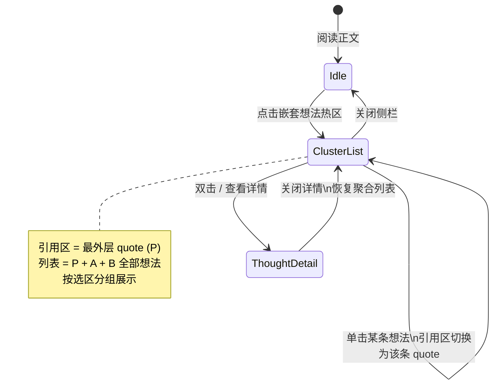
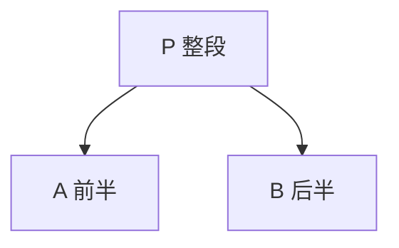

# EPUB 嵌套选区想法聚合列表（Nested Thought Cluster List）SPEC

> **实现状态（2026-06-22）**：**已落地** — 嵌套选区点击聚合列表、引用区默认最外层 quote、列表内点选切换引用；**兄弟子句一并展示**（`expandHitCfisUnderPrimary`）；**同段相邻短语链**（`collectAdjacentChainAroundCfis`，点击「里的稻草」等可展示同句全部相邻想法）。  
> **依据代码**：`apps/frontend/src/views/ebook/utils/epubThoughtCluster.ts`、`epubUserHighlights.ts`（`resolveThoughtClickCluster`）、`read.tsx`（`openThoughtCluster` / `EpubThoughtList`）、`epubThoughtAnnotations.ts`（`isThoughtCfiRangeStrictlyContained`）。  
> **关联 SPEC / 文档**：[`ebook-reader.md`](./ebook-reader.md)、[`docs/ebook/epub-reading-thoughts.md`](../docs/ebook/epub-reading-thoughts.md)、[`docs/ebook/epub-thought-partial-overlap.md`](../docs/ebook/epub-thought-partial-overlap.md)。  
> **参考产品**：微信读书 — 同一段落存在多条不同粒度摘录时，侧栏**先展示最大上下文的引用**，列表**聚合展示该点击范围内全部想法**；点选某条想法后**引用区切换为该条的摘录**。

---

## 1. 问题陈述

### 1.1 用户场景（复现用例）

对同一段正文依次写三条想法，选区关系为**严格嵌套**：

| 选区 | 摘录（quote） |
|------|----------------|
| **P（整段）** | `众人听完，恍然大悟，原来他不是去做贼，而是做鸭。而且这主顾不是别人，正是当今第一夫人贾南风。` |
| **A（前半）** | `众人听完，恍然大悟，原来他不是去做贼，而是做鸭。` |
| **B（后半）** | `而且这主顾不是别人，正是当今第一夫人贾南风。` |

**期望**：点击该段**任意位置**（整段、前半、后半均可）→ 侧栏引用区优先展示 **P（整段）**；列表**同时**出现 P、A、B 三个选区下的**全部想法**；点击列表中某条想法后，引用区切换为该想法对应的 quote。

**初版实现遗漏（已修复）**：首版 cluster 仅纳入「点击坐标落在其 CFI 内」的分组。A、B 为 P 下**互不为包含关系的兄弟子句**——点前半只命中 P+A，点后半只命中 P+B，**无法同时看到 A+B 全部想法**。修复后以最外层 primary 为锚，纳入 primary 下**全部**严格嵌套子选区（含未直接命中点击点的兄弟子句）。

**原现网问题（已修复）**：点击后只能看到 **A 或 B** 中**较短**选区的想法列表；**P 整段的想法无法通过点击正文进入**，除非点到未被 A/B 热区覆盖的极小区域（实际几乎不可用）。

### 1.2 根因（以代码为准）

当前点击解析在 `epubUserHighlights.ts` 中**刻意取最内层（span 最短）分组**：

```typescript
// resolveThoughtGroupAtClick — 同一点命中多组时，取 span 最短（最内层）
hitGroups.sort((a, b) => thoughtGroupSpanLength(a) - thoughtGroupSpanLength(b));
return hitGroups[0] ?? [];
```

触发链路有两条，均只向上层传递**单一 CFI 分组**：

| 入口 | 路径 | 问题 |
|------|------|------|
| iframe 正文 `click` | `findThoughtsAtClickPoint` → `resolveThoughtGroupAtClick` → `onThoughtGroupClick(group)` | 候选含 P/A/B，但被裁成最短一组 |
| epub.js `markClicked` | 按 `thoughtIds` / `cfiRange` 筛 `matchedThoughts` → 同上 | 短选区 mark 在 DOM 上层，事件只带 A 或 B 的 id，**父级 P 不在 matchedThoughts 中** |

侧栏 `EpubThoughtList` 引用区固定取 `thoughts[0]?.quote`（即传入分组的 quote），因此永远展示内层摘录。

主文档 [`epub-reading-thoughts.md`](../docs/ebook/epub-reading-thoughts.md) §3.7 原设计为「点击重叠处优先命中更精确的短选区」——该策略适合**仅打开该短选区自己的列表**，与「嵌套选区应看到整段上下文 + 全部相关想法」的产品目标冲突，需**仅调整列表聚合策略**，**不改动**下划线绘制与热区叠层。

---

## 2. 目标与成功标准

### 2.1 用户目标

- 嵌套选区（整段 + 子句）点击后，**引用区默认展示最外层（最大 span）摘录**。
- **列表聚合**本次点击范围内所有相关选区下的想法（P + A + B），按选区分组、组内按时间倒序。
- 在列表中**点选某条想法**，引用区**切换为该想法的 quote**（仍停留在列表，不强制进详情）。
- 进入详情、写想法、返回列表等既有流程保持可用，且返回时恢复聚合列表状态。

### 2.2 验收标准（MVP）

| # | 验收项 |
|---|--------|
| 1 | 用 §1.1 三选区用例：点击段内**任意字**（整段 / 前半 / 后半）→ 引用区均为 **P 整段**；列表含 **P + A + B** 全部想法（条数 = 三选区想法之和） |
| 2 | 同上：点击**仅**前半区域 → 列表仍含 **P + A + B**（不因未点到后半而漏 B）；点击**仅**后半区域 → 列表仍含 **P + A + B**（不因未点到前半而漏 A） |
| 3 | 列表中单击某条想法 → 引用区变为该条 `thought.quote`；该卡片有选中态 |
| 4 | 列表中双击某条想法，或点击卡片内「查看详情」→ 打开现有 `EpubThought` 详情侧栏（与现网一致） |
| 5 | 从详情关闭返回 → 回到**同一聚合列表**（引用区恢复为上次选中想法的 quote，若无选中则恢复 P） |
| 6 | **部分相交**（非嵌套）的两选区：点击重叠处 → 列表含两组想法；引用区取 **span 更长** 的 quote（见 §5.3） |
| 7 | 仅一条 CFI、一条想法 → 行为与现网一致（无多余分组 UI） |
| 8 | 下划线可见性、嵌套去重、用户划线 suppression、PopBar 写想法 **无回归** |
| 9 | **同段相邻短语**（无嵌套、无交集，间隙仅标点/空白）：点击任一片段 → 列表含该链上 **全部** 想法；引用区为 **并集摘录**（见 §5.7） |

### 2.3 非目标（本期不做）

- 不合并 / 不迁移数据库中的 `cfi_range` 或 `quote` 字段。
- 不改变「同 CFI 多条想法」的数据模型与 API。
- 不在列表里做想法内容的合并编辑。
- 不实现微信读书的「公开想法 / 点赞」等社交能力。

---

## 3. 目标交互（对齐微信读书思路）



与微信读书一致的**核心原则**：

1. **上下文优先**：引用区先给读者「这段在说什么」，用最大选区 quote，而不是最窄子串。
2. **笔记聚合**：同一点击范围内的不同粒度笔记在一个列表里看完，减少反复点正文。
3. **按需聚焦**：用户点某条笔记后，引用区再收窄到该笔记的摘录，建立「笔记 ↔ 原文」对应关系。

---

## 4. 数据模型

### 4.1 新增类型（建议 `apps/frontend/src/views/ebook/types.ts`）

```typescript
/** 同一 cfiRange 下的想法分组（数据库粒度不变） */
export type EbookThoughtQuoteGroup = {
	cfiRange: string;
	quote: string;
	thoughts: EbookThought[];
	/** quote 字符数；无 quote 时回退 cfiRange.length */
	spanLength: number;
};

/**
 * 一次正文点击解析出的「想法簇」
 * —— 可包含多个严格嵌套（或部分相交）的 quote 分组
 */
export type EbookThoughtClickCluster = {
	/** 引用区默认展示的最外层 cfi / quote */
	primaryCfiRange: string;
	primaryQuote: string;
	/** 按 span 从长到短排序的选区分组 */
	quoteGroups: EbookThoughtQuoteGroup[];
	/** 扁平列表：UI 渲染用，顺序见 §5.4 */
	allThoughts: EbookThought[];
	/** 列表内当前聚焦的想法 id（引用区跟随）；undefined = 使用 primary */
	selectedThoughtId?: string;
};
```

### 4.2 侧栏状态（`read.tsx`）

| 状态 | 现网 | 变更 |
|------|------|------|
| `thoughtListGroup: EbookThought[]` | 单 CFI 分组 | 改为 `thoughtListCluster: EbookThoughtClickCluster \| null`，或保留 group 并增加 `thoughtListCluster` |
| `returnToListCfiRef` | 单个 cfiRange | 改为 `returnToListClusterRef: EbookThoughtClickCluster \| null` 快照 |

**引用区 quote 计算**：

```typescript
const displayQuote =
	cluster.selectedThoughtId != null
		? cluster.allThoughts.find((t) => t.id === cluster.selectedThoughtId)?.quote
		: cluster.primaryQuote;
```

---

## 5. 核心算法

### 5.1 模块划分

新建 `apps/frontend/src/views/ebook/utils/epubThoughtCluster.ts`（纯函数，便于单测），导出：

| 函数 | 职责 |
|------|------|
| `groupThoughtsByCfi(thoughts)` | `Map<cfiRange, EbookThought[]>` |
| `pickPrimaryCfi(rend, cfis, byCfi)` | 在命中 CFI 中选 span 最大者为 primary（并列时 CFI 更长 / DOM 起点更靠前） |
| `expandHitCfisUnderPrimary(rend, allThoughts, hitAtClickCfis)` | **核心**：以 primary 为锚，纳入其下全部严格嵌套子选区（含兄弟子句） |
| `collectNestedClosureAroundCfi(rend, byCfi, centerCfi)` | 从 seed CFI 做 strict-nested **连通闭包**（markClicked：子句 → 整段 → 兄弟子句） |
| `isNestedEitherWay(...)` | 封装双向 `isThoughtCfiRangeStrictlyContained` |
| `buildThoughtClickCluster(rend, allThoughts, hitCfis)` | 由最终 CFI 集合构建 cluster |
| `buildThoughtClickClusterFromCandidates(...)` | iframe click：`findThoughtsAtClickPoint` 候选 → `expandHitCfisUnderPrimary` |
| `expandClusterFromMarkSeed(...)` | markClicked：seed → `collectNestedClosureAroundCfi` → `expandHitCfisUnderPrimary` |
| `collectAdjacentChainAroundCfis(...)` | 同一段落内沿文档序扩展 **桥接相连** 的相邻 CFI（间隙仅空白/标点） |
| `resolveClusterPrimaryDisplay(...)` | 相邻链无嵌套时，引用区用 DOM 并集 quote |

嵌套判定复用 `epubThoughtAnnotations.ts` 导出的 **`isThoughtCfiRangeStrictlyContained`**（与下划线 apply 语义一致）。

**禁止**在旧 `resolveThoughtGroupAtClick` 上打补丁；统一走 `resolveThoughtClickCluster`（`epubUserHighlights.ts`）。

### 5.2 严格嵌套 + 兄弟子句（§1.1 用例）

选区关系示意（P 包 A、B 两个**兄弟**子句，A 与 B 互不严格包含）：



**错误做法（初版）**：纳入列表的分组 = `{ g | 点击坐标落在 g 的 CFI 内 }`。点 A 区域 → 仅 P+A；点 B 区域 → 仅 P+B。**兄弟子句无法同屏展示**。

**正确做法（当前实现）**：两步扩展。

#### 5.2.1 `expandHitCfisUnderPrimary`

1. 从「点击直接命中的 CFI 集合」`hitAtClickCfis` 中，用 `pickPrimaryCfi` 选出 **primary**（span 最大 = 整段 P）。
2. 遍历全书按 CFI 分组的想法，凡 **被 primary 严格包含** 的 CFI（含 A、B 及更深层子句），**一律纳入**，**不要求**点击点落在该 CFI 内。
3. 若某命中 CFI 与 primary **互不嵌套**（部分相交场景，见 §5.3），且点击点在其内 → 额外纳入该 CFI。

```typescript
// epubThoughtCluster.ts — expandHitCfisUnderPrimary（摘录）
const primaryCfi = pickPrimaryCfi(rend, hitAtClickCfis, byCfi);
const primaryGroup = byCfi.get(primaryCfi) ?? [];
const expanded = new Set<string>([primaryCfi]);

// primary 下全部严格嵌套子选区（含未直接命中点击点的兄弟子句 A、B）
for (const [cfi, group] of byCfi) {
	if (cfi === primaryCfi) continue;
	if (isThoughtCfiRangeStrictlyContained(cfi, primaryCfi, group, primaryGroup, rend)) {
		expanded.add(cfi);
	}
}
```

**iframe 正文 click 路径**：`findThoughtsAtClickPoint` → 去重得 `hitAtClickCfis` → `expandHitCfisUnderPrimary` → `buildThoughtClickCluster`。

**结果**：点 P / A / B 任意一处 → 引用 **P**；列表 **P + A + B** 全部想法。

#### 5.2.2 `collectNestedClosureAroundCfi`（markClicked 路径）

epub.js `markClicked` 往往只携带被点 mark 的 `thoughtIds`（例如仅 B 的 id），且短选区 mark 在 DOM 上层。需先从 **seed CFI** 做 nested 连通闭包，再交给 `expandHitCfisUnderPrimary`：

1. 从 `seedCfi`（被点 mark）出发，反复合并与之 **strict-nested 任一方向** 连通的 CFI（B ↔ P ↔ A）。
2. 闭包结果作为 `hitAtClickCfis` 传入 `expandHitCfisUnderPrimary`，保证 primary=P 并展开全部子句。

```typescript
// epubThoughtCluster.ts — expandClusterFromMarkSeed（摘录）
const closureCfis = collectNestedClosureAroundCfi(rend, byCfi, seedCfi);
const hitCfis = expandHitCfisUnderPrimary(rend, allThoughts, [...closureCfis]);
return buildThoughtClickCluster(rend, allThoughts, hitCfis);
```

**不再**按「点击坐标是否落在某 CFI 内」过滤兄弟子句（初版 `isClickInCfi` 过滤已移除）。

### 5.3 部分相交（非嵌套）

两选区 S1、S2 仅部分重叠、互不严格包含时（见 [`epub-thought-partial-overlap.md`](../docs/ebook/epub-thought-partial-overlap.md)）：

- **纳入列表**：点击点同时落在其 CFI 内的所有分组（与现网 `findThoughtsAtClickPoint` 一致）。
- **primaryQuote**：命中分组中 **span 最长** 者；若 span 相同，取 **DOM 起点更靠前** 的 CFI（`compareBoundaryPoints` START_TO_START）。
- **不**把互不包含的远端选区强行并入（避免一次点击拉出全书想法）。

### 5.7 想法簇连通

点击某想法时，列表展示与之 **连通闭包** 内的全部分组。

**连通条件**（满足任一即连通，可传递）：

1. **Range 相交或端点相接**
2. **严格嵌套**
3. **间隙被已标注想法完全覆盖**：如 A、B 之间单独标注了「，」，则 A—逗号—B 成链，点击任一处引用为「A，B」
4. **跨行/跨段选区搭接两侧**：存在选区同时与换行前后两部分相交（如一次选中 C+换行+D）

**不连通**：间隙中的标点/空白/换行 **未** 单独标注，且两侧选区无交集（如独立标注的 A 与 B 中间无标注的「，」；独立 ABC 与 DEF 跨行无交集）。

**引用区**：多分组时用 DOM 并集；单分组用该组 quote。

### 5.4 列表排序

1. **选区分组**按 `spanLength` **降序**（整段在上，子句在下）。
2. **组内**按 `createdAt` **降序**（与 API / 现网一致）。
3. UI 在组间展示 **可选分隔标题**（见 §6.2）：如 `摘录 · 128 字` 或截断 quote 前 24 字 + `…`。

### 5.5 `markClicked` 扩展（与 §5.2.2 一致）

`markClicked` 仅携带被点 mark 的 `thoughtIds` / `cfiRange` 时，**不得**仅打开 seed 单组：

| 步骤 | 函数 | 说明 |
|------|------|------|
| 1 | 筛 `matchedThoughts` | 按 `thoughtIds` 或 `cfiRange` |
| 2 | `collectNestedClosureAroundCfi` | seed ↔ 整段 P ↔ 兄弟 A/B 连通 |
| 3 | `expandHitCfisUnderPrimary` | 以 P 为锚展开全部 nested 子选区 |
| 4 | `buildThoughtClickCluster` | 构建侧栏 cluster |

这样点击 **上层 mark 或任一侧兄弟子句 mark**，均得到同一 **P+A+B** 簇。

### 5.6 与用户划线的关系

- `handleUserHighlightHit` 内若 `findThoughtsAtClickPoint` 命中想法，同样走 `resolveThoughtClickCluster`，**不要**回退到单组。
- 用户划线 PopBar 与想法列表互斥逻辑不变。

---

## 6. UI / 组件变更

### 6.1 回调签名（Breaking，仅限 ebook 模块内）

```typescript
// EpubPane / epubThoughtAnnotations / epubUserHighlights
onThoughtClusterClick?: (cluster: EbookThoughtClickCluster) => void;
// 原 onThoughtGroupClick 移除或 alias 一层适配
```

`read.tsx`：

```typescript
const openThoughtCluster = useCallback((cluster: EbookThoughtClickCluster) => {
	if (cluster.allThoughts.length === 0) return;
	setAssistantOpen(false);
	setThoughtListCluster({ ...cluster, selectedThoughtId: undefined });
	setThoughtListOpen(true);
}, []);
```

### 6.2 `EpubThoughtList` 改造

| 项 | 变更 |
|----|------|
| Props | `cluster: EbookThoughtClickCluster` 替代 `thoughts: EbookThought[]` |
| 引用区 | `quote={displayQuote}`（§4.2） |
| 列表 | 多 `quoteGroups` 时渲染分组标题 + 卡片；单组时与现网相同 |
| 单击卡片 | `onSelectThought(thought)` → 更新 `selectedThoughtId`，**不**关闭列表 |
| 打开详情 | 新增 `onOpenThoughtDetail(thought)` → 现有 `openViewThought(thought, true)` |
| 选中态 | 卡片 `data-selected={thought.id === cluster.selectedThoughtId}` |

**交互细节**：

- **单击** vs **双击**：单击只更新引用；双击进详情（与桌面端习惯一致）。移动端若无双击，卡片右侧保留 chevron / 「查看」图标触发详情。
- 引用区 `EpubThoughtQuoteCard` 的 `count` = `cluster.allThoughts.length`（全部想法数，非仅 primary 组）。

### 6.3 详情返回列表

现网 `returnToListCfiRef` + `useEffect` 按单 CFI filter：

```typescript
// 现网（需替换）
const next = thoughts.filter((t) => t.cfiRange === cfiRange);
```

改为恢复 `returnToListClusterRef` 快照；若期间 thoughts 数据有 CRUD，对快照内 id **reconcile**（删除已不存在的 id，新增同 cfi 的 thought 按 §5.4 插入）。

### 6.4 写想法 / 保存后

`saveThought` 创建成功后：

- 若 `returnToListClusterRef` 存在且新 thought 的 cfi 属于簇内某分组 → 插入 cluster 并 reopen list。
- 否则维持现网：按单 cfi 打开列表。

`thoughtListQuoteActions`（复制 / 划线 / 问书）应基于 **当前 displayQuote + 对应 cfi**（选中想法的 cfi，非始终 primary）。

---

## 7. 实现步骤（推荐顺序）

| 阶段 | 任务 | 文件 |
|------|------|------|
| **P0** | 导出或抽取 `isCfiRangeStrictlyContained` / `isQuoteStrictlyNested` | `epubThoughtAnnotations.ts` 或 `epubThoughtCluster.ts` |
| **P0** | 实现 `buildThoughtClickCluster` + `expandHitCfisUnderPrimary`（兄弟子句） | `epubThoughtCluster.ts` |
| **P0** | 实现 `collectNestedClosureAroundCfi`（markClicked 连通闭包） | 同上 |
| **P1** | `resolveThoughtClickCluster` 替换 `resolveThoughtGroupAtClick` 两处调用 | `epubUserHighlights.ts` |
| **P1** | `markClicked` / `attachUserHighlightReaderClickListener` 改用 cluster 扩展 | 同上 |
| **P2** | 类型 + `openThoughtCluster` + 状态 ref 改造 | `types.ts`、`read.tsx` |
| **P2** | `EpubThoughtList` 分组 UI + 选中态 + 双通道点击 | `EpubThoughtList.tsx`、`EpubThoughtParts.tsx`（可选小改） |
| **P3** | i18n：`ebook.read.thought.clusterExcerpt`、`viewDetail` 等 | `zh-CN.ts`、`en-US.ts` |
| **P3** | 更新 [`epub-reading-thoughts.md`](../docs/ebook/epub-reading-thoughts.md) §3.7 点击策略描述 | docs |

---

## 8. 不变性与回归防护

### 8.1 明确不改的行为

| 能力 | 说明 |
|------|------|
| 下划线绘制 | `computeLineVisibleCfis` 仍仅最外层画可见线；内层透明热区 |
| DOM 叠层 | 短选区 mark 仍在上层，保证子句区域可命中 |
| 部分重叠 patch | `thoughtLineBlockerSources` 去重逻辑不变 |
| 选区 PopBar | 拖选文字写想法 / 划线不受 cluster 影响 |
| 数据/API | 仍按 CFI 存取；cluster 仅只读聚合 |

### 8.2 边界条件

| 场景 | 期望 |
|------|------|
| P 含兄弟子句 A、B | 点 A 或 B 区域 → 列表 **P+A+B**（`expandHitCfisUnderPrimary`） |
| 仅子句有想法、整段无 P | primary = 闭包内 span 最长者；若 A、B 均 nested 于同一更外层则一并展示 |
| 整段 P 有想法，子句无 | 点任意子区域 → 列表仅 P（无 A/B 分组可展开） |
| 不同章节 CFI 误判相邻 | `extractCfiSpineHint` 不一致时不判 nested |
| CFI 解析失败 | 回退 quote 严格子串 + 同 spine；失败则不并入簇 |
| 空 quote | span 回退 `cfiRange.length`（与 `thoughtGroupSpanLength` 一致） |
| 快速连点 | 保留现网 400ms 去抖（用户划线）；想法列表可选 300ms 内忽略重复 open |

### 8.3 性能

- 单次点击对 thoughts 分组 O(n)；嵌套判定 O(k²)，k = 当前书想法去重 CFI 数（通常 &lt; 100）。
- 在 `syncEpubReadingAnnotations` 的 CFI 缓存作用域内调用时可复用 `resolveCfiDomRange` 缓存（见 [`epub-annotation-sync-perf.md`](../docs/ebook/epub-annotation-sync-perf.md)），**不要**在 scroll handler 里构建 cluster。

---

## 9. i18n 草案

| key | zh-CN | en-US |
|-----|-------|-------|
| `ebook.read.thought.clusterExcerpt` | 摘录 ({length} 字) | Excerpt ({length} chars) |
| `ebook.read.thought.viewDetail` | 查看详情 | View note |
| `ebook.read.thought.selectedQuoteHint` | 当前显示该想法对应的原文 | Showing quote for selected note |

---

## 10. 测试计划

### 10.1 单元测试（`epubThoughtCluster.test.ts`）

- 严格嵌套 P + 兄弟 A/B：点命中 `{A}` → `expandHitCfisUnderPrimary` 输出 `{P,A,B}`；primary 为 P。
- 点命中 `{B}` → 同上，**必须含 A**（兄弟子句 regression）。
- `markClicked` seed 仅为 B：`collectNestedClosureAroundCfi` + expand → 含 P、A、B。
- 部分相交 S1/S2：两组均在 list，primary 为较长 quote；互不嵌套的远端 CFI 不并入。

### 10.2 手工回归（阅读页）

1. §1.1 用例全流程。
2. 写想法保存 → 回到聚合列表且新想法可见。
3. 详情编辑 / 删除 → 返回列表数据正确。
4. 引用区复制 / 问书 / 划线针对**当前 displayQuote** 生效。
5. 与用户划线重叠：suppression、PopBar 命中无回归。
6. 深色主题下列表选中态、分组标题可读性。

---

## 11. 文档同步（落地后）

| 文档 | 更新 |
|------|------|
| `docs/ebook/epub-reading-thoughts.md` | §3.7「点击」改为 cluster 聚合策略 |
| `docs/project-guide.md` / `update-info` | 用户可感知行为变更时追加条目 |
| 本 SPEC 文首 | 实现状态改为「已落地」并注明 PR / 日期 |

---

## 12. 方案自洽性说明（为何不会引入新 bug）

1. **只改「打开列表时如何聚合」**，不改 SVG apply/patch、不改 DB，回滚面小。
2. **嵌套判定复用现网同一套** `isCfiRangeStrictlyContained`，与下划线 apply 语义一致，避免「列表认为嵌套、下划线认为不嵌套」的分裂。
3. **markClicked 扩展**以 seed 的 nested **连通闭包** + primary 下全部子选区为界，不会把无关段落吸入列表；**兄弟子句**通过 `expandHitCfisUnderPrimary` 同屏展示。
4. **引用区双态**（primary / selected）仅影响侧栏展示与 quoteActions 目标，不改变正文 mark 布局。
5. **与用户划线 click 优先级**保持：想法 cluster 命中优先于划线 PopBar（与现网一致）。

---

## 13. 相关源码索引

| 说明 | 路径 |
|------|------|
| cluster 聚合算法 | `utils/epubThoughtCluster.ts` — `expandHitCfisUnderPrimary`、`collectNestedClosureAroundCfi` |
| 点击统一出口 | `utils/epubUserHighlights.ts` — `resolveThoughtClickCluster` |
| 正文 click 分发 | 同上 — `attachUserHighlightReaderClickListener` |
| markClicked | 同上 — `installEpubReadingMarkClickListeners` |
| 嵌套 CFI 判定 | `utils/epubThoughtAnnotations.ts` — `isThoughtCfiRangeStrictlyContained` |
| 侧栏入口 | `read.tsx` — `openThoughtCluster`、`thoughtListQuoteActions` |
| 列表 UI | `components/EpubThoughtList.tsx` |
| 引用卡片 | `components/EpubThoughtParts.tsx` — `EpubThoughtQuoteCard` |

若与仓库最新源码不一致，以源码为准；落地时优先实现 §7 P0–P2，P3 与文档可跟随 PR 合并。
