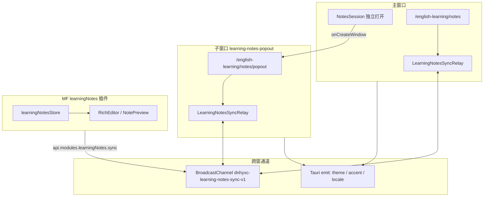

# 学习笔记独立窗口（Popout）与跨窗实时同步 SPEC

> **实现状态（2026-08-25）**：Host 侧 MVP 落地 — 侧栏「独立打开」按钮、`/english-learning/notes/popout` 子窗口路由、主题/强调色/语言跟随、`learningNotes` Host 模块跨窗同步总线。  
> **范围**：`apps/frontend`（路由、Tauri 多窗、Federation Host API）；`apps/remote-plugins` 插件侧须按 §6 接入 `api.modules.learningNotes.sync` 后，编辑/预览草稿才双向实时一致。  
> **非目标**：跨账号同步、离线冲突合并（OT/CRDT）、子窗口内嵌主应用侧栏。

---

## 1. 目标与成功标准

### 1.1 用户目标

- 在英语学习侧栏「学习笔记」卡片上，除「打开学习笔记」外，右侧增加 **「独立打开」**，点击后在 **新窗口** 打开完整学习笔记页（列表 + 编辑/预览），便于与主窗口并排对照。
- 子窗口 **UI 与主窗口一致**（同一套主题 token、MF 插件、富文本编辑器），无宿主主侧栏。
- 主窗口修改 **主题色 / 强调色 / 语言** 时，已打开的子窗口 **实时跟随**。
- 主、子窗口同时打开 **同一篇笔记** 时，编辑区与预览区内容 **实时同步**（含未保存草稿）；保存、删除、列表变更亦广播。

### 1.2 验收清单

| #   | 验收项                                                                                                |
| --- | ----------------------------------------------------------------------------------------------------- |
| 1   | 侧栏「打开学习笔记」右侧可见「独立打开」；插件未上架时整块卡片隐藏（与现有一致）                      |
| 2   | Tauri：点击后新建或聚焦 `learning-notes-popout` 窗；Web：`window.open` 同源 popout URL                |
| 3   | Popout 路由 `/english-learning/notes/popout` 需登录；未登录跳转 `/login`                              |
| 4   | Popout 内渲染 `<PluginHostPage pluginId="learningNotes" />`，视觉与 `/english-learning/notes` 一致    |
| 5   | 主窗口设置 → 切换主题色/强调色后，子窗口 **≤300ms** 内同步（Tauri `onEmit` + Web `BroadcastChannel`） |
| 6   | 主窗口切换中/英后，子窗口插件 locale 同步（现有 `locale` 事件 + Host `onLocaleChange`）               |
| 7   | 插件接入 sync API 后：A 窗编辑笔记 X，B 窗同篇编辑/预览在 **≤200ms**（debounce 后）看到相同 HTML/标题 |
| 8   | A 窗保存笔记 X 后，B 窗列表项与预览内容更新；A 窗删除后 B 窗退出该篇编辑态                            |
| 9   | 关闭任一窗口不影响另一窗口；重复点击「独立打开」聚焦已有 popout，不叠多个窗                           |
| 10  | 回声抑制：本窗发出的 sync 消息不会导致编辑器无限循环                                                  |

---

## 2. 总体架构



### 2.1 核心原则

1. **Host 负责多窗与同步传输**；插件负责在编辑/预览/保存路径上调用 `sync.publish*` / `subscribe`。
2. **同源 BroadcastChannel** 为 Web 与 Tauri 多 WebView 的主通道；Tauri 全局 `emit` 补充主题/语言（与 [登出统一主题同步](../docs/auth/登出统一主题同步.md) 一致）。
3. **LWW + revision**：每窗 `windowId`（`sessionStorage`）+ 单调 `revision`；远端 `revision` 更大则覆盖本地草稿（插件侧应用时走 `applyRemoteDraft`，不触发二次 publish）。
4. **Popout 复用插件实例契约**：仍走 `PluginHostPage`，不 fork 插件 UI。

---

## 3. 路由与窗口

### 3.1 路由

| 路径                             | 组件                             | Layout                                          |
| -------------------------------- | -------------------------------- | ----------------------------------------------- |
| `/english-learning/notes`        | `EnglishLearningNotesPage`       | `EnglishLearning` + 宿主 `Layout`（有侧栏）     |
| `/english-learning/notes/popout` | `EnglishLearningNotesPopoutPage` | **无**宿主 `Layout`（与 `/share` 同级顶层路由） |

### 3.2 Tauri 窗口

| 字段     | 值                                                                      |
| -------- | ----------------------------------------------------------------------- |
| `label`  | `learning-notes-popout`                                                 |
| 默认 URL | `/english-learning/notes/popout`                                        |
| 默认尺寸 | 1200 × 800                                                              |
| `theme`  | `readWindowChromeThemeSync()` 创建时写入                                |
| 已存在   | `onCreateWindow` 内 `setTheme` → `show` → `setFocus`（与 about 窗一致） |

`capabilities/default.json` 与 `desktop.json` 的 `windows` 数组须包含 `learning-notes-popout`。

### 3.3 Web 回退

`onCreateWindow` 在非 Tauri 环境 `window.open` 同源 URL；`noopener` 仍保持同源以使用 `BroadcastChannel`。

---

## 4. UI 入口

**文件**：`apps/frontend/src/views/englishLearning/sidebar/components/NotesSession.tsx`

- `actions` 数组第二项：`variant: 'secondary'`，文案 `englishLearning.notes.popout`，`onClick` → `openLearningNotesPopoutWindow()`。
- 可选：从主窗口 notes 页通过 `sessionStorage` 写入 `dnhyxc_ln_popout_note_id`，popout 启动时由 Host API `consumeInitialNoteId()` 交给插件（插件 `openNoteById`）。

---

## 5. 主题 / 语言实时同步

### 5.1 主窗口发出

| 事件     | 触发点                           | 载荷               |
| -------- | -------------------------------- | ------------------ |
| `theme`  | `useTheme().changeTheme`（已有） | `ThemeName`        |
| `accent` | `changeAccent`（新增 `onEmit`）  | `AccentId`         |
| `locale` | `useI18n` 切换（已有）           | `zh-CN` \| `en-US` |

另：`changeTheme` 已调用 `setThemeToAllWindows` 同步 Tauri 标题栏 chrome。

### 5.2 子窗口接收

**Hook**：`useHostAppearanceSync()`（popout 页挂载）

- Tauri：`onListen('theme'|'accent'|'locale')`
- Web：`BroadcastChannel('dnhyxc-host-appearance-v1')` 镜像上述事件
- 首帧：`readThemeBootstrapSync` / `readAccentBootstrapSync` + `getActiveLocale`

---

## 6. 笔记内容跨窗同步协议

### 6.1 Channel

- 名称：`dnhyxc-learning-notes-sync-v1`
- 序列化：JSON，`type` 判别联合类型

### 6.2 消息类型

| type             | 方向 | 载荷                                                    | 说明                             |
| ---------------- | ---- | ------------------------------------------------------- | -------------------------------- |
| `selection`      | 双向 | `{ noteId, mode: 'edit'\|'preview'\|null, windowId }`   | 当前选中笔记与模式               |
| `draft`          | 双向 | `{ noteId, html, text, title, revision, windowId, ts }` | 编辑草稿（插件 debounce ≥150ms） |
| `saved`          | 双向 | `{ noteId, html, title, updatedAt? }`                   | 保存成功后                       |
| `deleted`        | 双向 | `{ noteId }`                                            | 删除后                           |
| `list-changed`   | 双向 | `{ reason?: string }`                                   | 列表需刷新                       |
| `request-state`  | 入站 | `{ noteId, windowId }`                                  | 新窗请求当前草稿                 |
| `state-snapshot` | 出站 | `{ noteId, draft?, preview?, windowId }`                | 响应 request-state               |

### 6.3 Host API（`api.modules.learningNotes`）

权限：`modules:learningNotes`（registry `permissions` 须包含；Host `buildModules` 在 `allow.has('modules:learningNotes')` 时挂载）。

```typescript
type LearningNotesHostModule = {
	isPopoutWindow(): boolean;
	getWindowId(): string;
	consumeInitialNoteId(): string | null;
	sync: {
		publishSelection(payload): void;
		publishDraft(payload): void;
		publishSaved(payload): void;
		publishDeleted(noteId): void;
		publishListChanged(reason?): void;
		subscribe(handler): () => void;
	};
};
```

### 6.4 插件接入点（`apps/remote-plugins`）

| 时机                           | 调用                                              |
| ------------------------------ | ------------------------------------------------- |
| `useEffect` 挂载               | `sync.subscribe(onRemote)` + `publishSelection`   |
| 编辑器 `onChange`（debounced） | `publishDraft`                                    |
| `store.saveNote` 成功          | `publishSaved` + `list-changed`                   |
| `store.removeNote` 成功        | `publishDeleted`                                  |
| `openEditById` / `openPreview` | `publishSelection`                                |
| 收到 `draft` 且 `noteId` 匹配  | `applyRemoteDraft` → 写编辑器 / `editorSeed` 刷新 |
| 收到 `saved`                   | 更新 `preview` / 清 dirty                         |
| Popout 首屏                    | `consumeInitialNoteId()` → `openEditById`         |

**回声抑制**：`if (msg.windowId === getWindowId()) return;`

---

## 7. 冲突与边界

| 场景                         | 行为                                                                   |
| ---------------------------- | ---------------------------------------------------------------------- |
| 两窗同时编辑同篇             | `revision` 大者覆盖；相等则 `ts` 大者                                  |
| 一窗编辑、一窗预览           | `draft` 同步后预览 HTML 更新                                           |
| 一窗保存、另一窗有未保存草稿 | `saved` 到达后插件应以服务端为准并 `markClean`（或提示合并，一期 LWW） |
| 不同 `noteId`                | 忽略 `draft`/`saved`                                                   |
| 插件未接入 sync              | 仅主题同步可用；内容同步无保证                                         |
| 登出                         | 各窗 `performLogout` 跳转登录；popout 随 token 失效                    |
| 插件下架                     | 两窗均显示 `plugins.host.delisted`                                     |

---

## 8. 文件清单（Host）

| 路径                                                        | 职责                            |
| ----------------------------------------------------------- | ------------------------------- |
| `specs/learning-notes-popout-window.md`                     | 本文档                          |
| `federation/capabilities/learningNotesSyncBus.ts`           | BroadcastChannel + 类型         |
| `federation/capabilities/learningNotesHostApi.ts`           | `createLearningNotesModulesApi` |
| `views/englishLearning/notes/popout.tsx`                    | Popout 页壳                     |
| `views/englishLearning/notes/openPopoutWindow.ts`           | 打开/聚焦窗口                   |
| `views/englishLearning/notes/LearningNotesSyncRelay.tsx`    | 安装总线 + EventBus 桥接        |
| `hooks/useHostAppearanceSync.ts`                            | 子窗主题/强调色/语言            |
| `views/englishLearning/sidebar/components/NotesSession.tsx` | 入口按钮                        |
| `router/routes.ts`                                          | popout 路由                     |
| `federation/runtime/index.ts`                               | `buildModules` 注册             |
| `hooks/theme.ts`                                            | `accent` 事件                   |
| `src-tauri/capabilities/*.json`                             | 窗口白名单                      |

---

## 9. 测试计划

1. Tauri：主窗打开笔记 → 独立打开 → 两窗并排；改主题/强调色/语言，子窗跟随。
2. 插件接入后：主窗编辑段落，子窗同篇 200ms 内出现相同文字；子窗改标题，主窗同步。
3. 主窗保存，子窗预览更新；子窗删除，主窗退出编辑。
4. 连点「独立打开」仅一个 popout；关闭 popout 后主窗正常。
5. Web 双标签同源：BroadcastChannel 草稿同步（插件接入后）。

---

## 10. 分期

| 阶段           | 内容                                                              |
| -------------- | ----------------------------------------------------------------- |
| **M1（本次）** | Host 多窗 + 外观同步 + sync 总线与 API                            |
| **M2**         | `remote-plugins` 接入 sync；registry 增加 `modules:learningNotes` |
| **M3（可选）** | URL `?noteId=`、主窗「在独立窗口打开当前笔记」                    |
