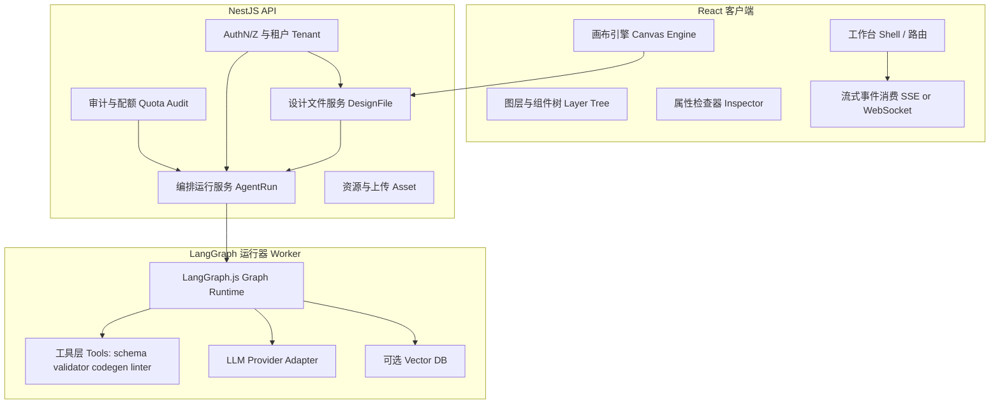

# 自然语言 → 设计图 → 代码：企业级类 Figma AI 设计与生成引擎（实现方案 SPEC）

> **技术栈**：**React（React，前端 UI 库）** + **NestJS（NestJS，Node 企业级后端框架）** + **LangGraph.js（LangGraph.js，多步 Agent 编排库）**。  
> **定位**：类 **Figma（Figma，界面设计工具）** 的 **AI 设计工作台（Design Workbench）**：自然语言驱动画布与组件树，再经受控流水线生成可维护前端代码（非一次性黑盒字符串）。  
> **文档性质**：**实现方案 SPEC**（架构、模块边界、数据契约、编排图、风险与验收）；不绑定本仓库现有目录结构，可按 monorepo 落地。

---

### 1. 目标与范围

#### 1.1 目标

- **自然语言 → 设计图（Design Artifact）**：将用户描述解析为 **可渲染、可编辑、可版本化** 的设计中间态（结构化文档 + 画布布局），而非仅生成静态截图。
- **设计图 → 代码（Code Generation）**：在 **设计 token（Design Token，设计变量）** 与 **组件契约（Component Contract）** 约束下，输出 **可编译** 的 React/TSX（或项目约定栈），并保留 **溯源映射（Traceability）**（节点 id → 代码 AST 片段）。
- **企业级能力**：鉴权、审计、配额、可观测性、幂等与重试、长任务流式、人在回路（Human-in-the-loop）、多环境密钥治理。

#### 1.2 范围（包含）

- **前端**：画布编辑、图层树、属性检查器、设计文件版本、与后端的实时/流式协同接口。
- **后端（NestJS）**：API 网关、会话与文件存储、任务编排入口、与 **LangGraph.js** 运行器的桥接、Webhook/队列。
- **智能编排（LangGraph.js）**：意图理解 → 信息架构 → 布局求解 → 视觉样式 → 校验 → 代码合成 的有状态图（Graph）。
- **集成**：LLM（Large Language Model，大语言模型）供应商抽象；可选 **向量检索（Vector Retrieval）** 用于组件/设计规范 RAG（Retrieval-Augmented Generation，检索增强生成）。

#### 1.3 非目标（第一期不做或降级）

- 完整 **Figma 插件生态** 兼容、多人实时 OT/CRDT 冲突合并（可作为二期）。
- 任意 **无沙箱** 的远端代码执行；不在浏览器内直接 `eval` 模型输出代码。
- 像素级还原任意截图为矢量（可做三期「逆向」能力）。

---

### 2. 总体架构（逻辑分层）

#### 2.1 组件图（逻辑）



#### 2.2 请求主路径（两段式流水线）

1. **NL → Design**：用户输入自然语言 → `AgentRun` 启动 `design_graph` → 产出 **DesignDocument（设计文档）** 增量事件（流式）→ React 画布消费并渲染。
2. **Design → Code**：用户对画布确认「生成代码」→ `codegen_graph` → 产出 **CodeBundle（代码包）**（多文件 + manifest + 诊断）→ 前端预览（iframe 沙箱构建）或下载 zip。

两段 **必须可独立重跑**：同一 DesignDocument 版本可多次生成代码（参数不同：组件库版本、目标框架、严格模式）。

---

### 3. 核心概念与数据契约

#### 3.1 DesignDocument（画布真源）

- **建议格式**：JSON 文档（便于 diff/CRDT 预留），顶层包含：
  - `schemaVersion`：文档格式版本。
  - `meta`：`title`、`createdAt`、`updatedAt`、`authorId`、`tenantId`。
  - `tokens`：颜色/间距/字体/圆角等 token 表（引用式，不内联魔法数）。
  - `pages[]`：页面级；每页含 `frames[]`。
  - `nodes`：**扁平节点表**（`Record<nodeId, Node>`）+ `rootId` / `children` 关系（类 Figma 的「节点图」便于增量更新与索引）。
- **Node 最小字段**：`id`、`type`（`frame`/`text`/`vector`/`componentInstance`…）、`name`、`parentId`、`bbox`（x,y,w,h）、`styleRef`、`props`、`constraints`（布局约束）。
- **componentInstance**：必须绑定 `libraryKey` + `componentKey` + `propsSchema` 版本（代码生成依赖）。

#### 3.2 AgentRun（编排会话）

- `runId`、`graphName`（`design_graph` | `codegen_graph`）、`inputVersion`（NL 或 Design 版本指针）、`status`（`queued|running|succeeded|failed|canceled`）。
- `events[]` 或 **仅追加日志流**（企业审计）：`ts`、`level`、`nodeId`（LangGraph 节点名）、`payload`（脱敏后）。

#### 3.3 CodeBundle（代码产物）

- `files: { path: string; content: string; sha256: string }[]`
- `manifest`：`entry`、`deps`、`designNodeToFileSpan` 映射（用于点击画布跳代码）。
- `diagnostics`：TypeScript/ESLint 结构化结果（阻塞发布或仅警告）。

---

### 4. LangGraph.js：图编排设计（企业级关键）

#### 4.1 为什么用 LangGraph.js

- **状态机显式化**：比「单条 prompt」更可观测、可单测、可回放。
- **人在回路**：对布局/品牌合规设置 **interrupt（中断）** 检查点。
- **工具边界清晰**：图节点只通过 **Tool** 访问外部系统（检索、校验器、渲染快照服务）。

#### 4.2 `design_graph`（自然语言 → DesignDocument）建议节点

| 节点（示意） | 输入 | 输出 | 工具/副作用 |
| --- | --- | --- | --- |
| `ingest_intent` | 用户文本 + 租户偏好 | 结构化 **Brief（需求摘要）** | 无或轻量分类模型 |
| `clarify_optional` | Brief | 追问列表 / 直接通过 | 可选 interrupt |
| `ia_outline` | Brief | 页面/模块树 IA | LLM |
| `layout_plan` | IA | 低精度 **LayoutPlan**（栅格、区域占比） | LLM + 规则后处理 |
| `component_retrieve` | LayoutPlan | 候选组件列表 | 向量库/组件 catalog MCP |
| `resolve_instances` | 候选 | `componentInstance` 绑定与 props | LLM + schema 校验 |
| `style_tokens` | Brief + 品牌包 | `tokens` 与 `styleRef` | Token linter |
| `geometry_solve` | 约束 | `bbox` 数值化 | **约束求解器**（规则引擎/ILP 简化版，不全靠 LLM 算坐标） |
| `validate_design` | DesignDocument | errors/warnings | JSON Schema + 业务规则 |
| `emit_patch` | diff | **Patch 事件流** | 写回事件总线 |

**企业级约束**：`geometry_solve` 与 `validate_design` 应尽量 **确定性**；LLM 负责「意图与结构」，算法负责「可落地几何」。

#### 4.3 `codegen_graph`（DesignDocument → CodeBundle）建议节点

| 节点（示意） | 输入 | 输出 | 工具 |
| --- | --- | --- |
| `select_target_stack` | 租户配置 | `react+ts` 等 | 配置服务 |
| `map_nodes_to_ast` | DesignDocument | IR（中间表示） | 内部 DSL |
| `apply_component_library` | IR | imports + JSX 片段 | 组件 catalog |
| `compose_files` | 片段 | 多文件 TSX | 模板引擎 |
| `typecheck` | files | diagnostics | `tsc --pretty false` 子进程 |
| `lint` | files | diagnostics | eslint |
| `bundle_preview` | files | 预览 URL 或 hash | 构建沙箱队列 |

#### 4.4 状态与检查点（Checkpointing）

- **持久化**：每节点完成后写入 checkpoint（DB 或对象存储），支持 **断点续跑** 与 **审计重放**。
- **幂等**：`runId + nodeId + inputHash` 作为幂等键，避免重复写画布。

---

### 5. NestJS 模块划分与职责

#### 5.1 建议模块

- **`AuthModule`**：JWT / Session + **RBAC（Role-Based Access Control，基于角色的访问控制）** + 租户隔离中间件。
- **`DesignFileModule`**：DesignDocument CRUD、版本、分支（可选）、乐观锁（`version`）。
- **`AgentRunModule`**：创建 run、订阅流、取消、查询状态；对内调用 **Graph Worker**（同进程或独立 worker 服务）。
- **`AssetModule`**：图片/字体上传、病毒扫描（企业常见）、CDN 签名 URL。
- **`PolicyModule`**：配额、内容安全策略、模型路由（按租户）。
- **`ObservabilityModule`**：OpenTelemetry trace（`runId` 贯穿）、结构化日志。

#### 5.2 流式 API 形态（与 React 对齐）

- **SSE（Server-Sent Events，服务端推送事件）** 或 **WebSocket（WebSocket，全双工通道）** 推送 `AgentEvent`：
  - `design.patch`：JSON Patch 或自定义 mini-patch（高频时需批处理）。
  - `design.snapshot`：关键帧全量（低频，用于纠偏）。
  - `codegen.file` / `codegen.diagnostics` / `codegen.done`。
- **背压（Backpressure）**：Nest 侧队列合并 patch（例如 50ms 窗口）；客户端 rAF 合并渲染。

#### 5.3 Worker 部署模式（二选一或混合）

- **模式 A（简单）**：Nest 内嵌 worker（同一进程）——开发快，隔离弱。
- **模式 B（企业推荐）**：独立 `worker` 服务消费 **BullMQ（BullMQ，Redis 队列）** / Kafka——与 API 进程隔离，便于扩缩容与重试。

---

### 6. React 前端：类 Figma 工作台要点

#### 6.1 画布引擎选型（决策点）

| 方案 | 优点 | 风险 |
| --- | --- | --- |
| **自研 + Canvas/WebGL** | 上限高、更像 Figma | 成本高 |
| **Konva（Konva，2D Canvas 抽象）+ react-konva** | 成熟、可做图层 | 超大文档性能需分层 |
| **Excalidraw 系** | 交互现成 | 偏白板，组件实例语义弱 |
| **DOM + absolute 布局** | SEO/可访问性友好 | 缩放/矢量弱 |

**SPEC 建议**：MVP 用 **Konva + 图层树**；长期保留 **DesignDocument** 与渲染器解耦，便于替换引擎。

#### 6.2 前端状态模型

- **单一真源**：服务端权威 `DesignDocument` + 本地 **Operational 缓冲**（未确认 patch 队列）。
- **撤销/重做**：基于 patch 栈；与版本 `version` 对齐，冲突时以服务端为准并提示。

#### 6.3 与 LangGraph 对齐的 UX

- **流式可视化**：左侧对话/需求，右侧画布实时变更；每个 patch 显示来源节点（`nodeId` tooltip）。
- **人在回路**：`clarify_optional` 触发时，表单收集答案后继续 run（resume）。

---

### 7. 安全、合规与沙箱

#### 7.1 提示词与数据

- **租户隔离**：所有检索与文件 key 必须带 `tenantId`。
- **PII（Personally Identifiable Information，个人身份信息）** 脱敏后再写入审计日志。

#### 7.2 代码生成沙箱

- **类型检查与 Lint** 在隔离 worker 执行；CPU/时间配额；禁止网络出站或仅允许 allowlist registry。
- **预览**：iframe + **CSP（Content Security Policy，内容安全策略）**；构建产物哈希校验。

#### 7.3 供应链

- 依赖锁定、私有 registry、组件库版本与 codegen 模板版本 **冻结在 manifest**。

---

### 8. 可观测性与 SLO（服务等级目标）

- **指标**：`run_latency_p95`、`patch_rate`、`validation_fail_rate`、`codegen_success_rate`、`token_cost_per_run`。
- **Tracing**：`traceId = runId`；LangGraph 节点为 span attributes。
- **日志**：结构化 JSON；敏感字段哈希存储。

---

### 9. 分阶段交付（建议）

#### 9.1 Phase 0（2–4 周）：骨架

- Nest：`DesignFile` + `AgentRun` + SSE。
- Worker：`design_graph` 最小闭环（输出静态 frame + text）。
- React：画布渲染 + patch 消费。

#### 9.2 Phase 1（4–8 周）：可用工作台

- 图层树、inspector、组件实例绑定、token 面板。
- `codegen_graph`：单页 React TSX + `tsc` 诊断。

#### 9.3 Phase 2（8–12 周）：企业化

- 队列 worker、checkpoint、RBAC、配额、审计、预览沙箱集群。
- RAG 组件库与品牌包。

#### 9.4 Phase 3：协作与生态

- 实时多人、评论、Figma 导入/导出子集、设计系统 CI（token diff 门禁）。

---

### 10. 验收清单（节选）

#### 10.1 NL → Design

- [ ] 输入自然语言后 **10s 内**可见首帧画布更新（可空文档 + 骨架）。
- [ ] 流中断网后可 **resume** 同一 `runId` 或明确失败并可重试。
- [ ] `validate_design` 失败时：用户可见错误列表，且文档不进入「已发布」状态。

#### 10.2 Design → Code

- [ ] 同 DesignDocument 版本重复生成：产物 **manifest 可复现**（相同锁版本下 hash 一致）。
- [ ] `typecheck` 失败：默认 **阻塞下载**；开关允许「仅警告下载」需审计留痕。

#### 10.3 多租户与安全

- [ ] 租户 A 无法通过 `runId` 读取租户 B 的 `DesignFile`。
- [ ] 代码生成 worker **无任意出站网络**（或仅 allowlist）。

#### 10.4 可观测

- [ ] 任意失败 run 可在后台用 `runId` 查询完整节点轨迹与输入快照（脱敏）。

---

### 11. 与 Figma / Code Connect 的衔接（可选增强）

- **设计 token**：对齐 **W3C Design Tokens Community Group** 格式或内部 JSON，便于导出给代码。
- **Code Connect（Code Connect，Figma 代码关联）**：若使用 Figma 企业能力，可将 `componentInstance` 映射到仓库组件；本 SPEC 的 **componentKey** 可直接对应 Code Connect 的注册名（需单独集成 SPEC）。

---

### 12. 仓库落地建议（monorepo）

```
apps/
  web/                 # React 工作台
  api/                 # NestJS
  worker-design/       # LangGraph.js：design_graph（可选与 api 合并）
  worker-codegen/      # LangGraph.js：codegen_graph
packages/
  design-schema/       # DesignDocument JSON Schema + types
  codegen-ir/          # IR + 映射规则单测
```

---

### 13. 风险登记（简表）

| 风险 | 影响 | 缓解 |
| --- | --- | --- |
| LLM 直接算像素坐标 | 布局漂移、难维护 | `geometry_solve` 规则化 + 校验器 |
| 流式 patch 风暴 | 客户端卡顿 | 服务端合并 + 客户端 rAF |
| 代码生成注入 | RCE（Remote Code Execution，远程代码执行） | 沙箱构建 + 静态扫描 + 无 eval |
| 长任务超时 | 体验差 | 队列 + 断点续跑 + 分阶段产物 |

---

**文档路径**：`apps/frontend/specs/nl-design-to-code-ai-engine.md`  
**维护建议**：与真实实现同步更新 `schemaVersion`、公开 API 与 LangGraph 节点名；节点名变更必须保留迁移说明以便审计重放。
