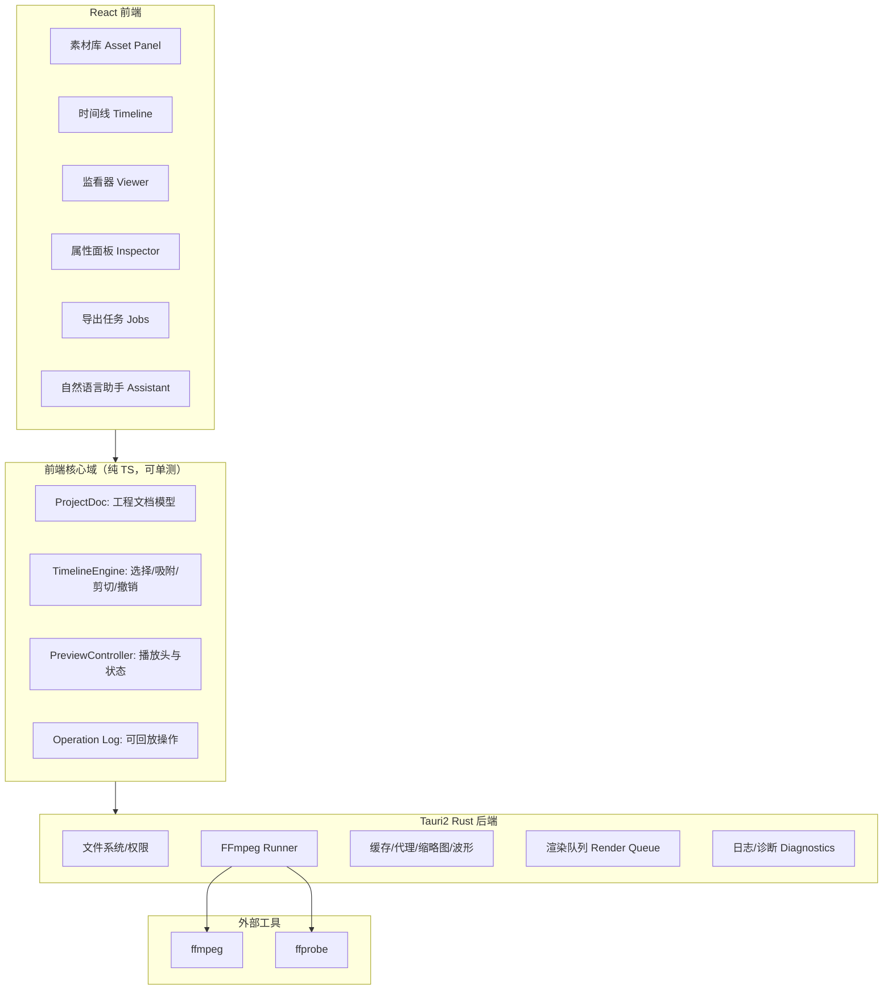

### Tauri2 + FFmpeg + LangChain + React 企业级类剪映视频剪辑工具 SPEC

本 SPEC 描述一个**可落地**的桌面端视频剪辑产品实现方案：以 **Tauri 2（Tauri2，Rust 桌面壳）** 为基础，使用 **FFmpeg（FFmpeg，音视频处理工具链）** 完成解码/代理/预览/导出，前端以 **React（React，前端 UI 库）** 实现时间线与监看器，并用 **LangChain（LangChain，LLM 编排框架）** 提供“自然语言剪辑助手”（指令 → 可回放的编辑操作）。

目标是做到：
- 核心剪辑能力（切割、拼接、变速、转场、字幕、音频、导出）可用
- 数据结构可版本化、可回放、可撤销重做
- 导出稳定、可诊断（任务日志/进度/失败原因）
- 企业级约束：工程可观测、资源/权限/沙箱安全、崩溃恢复

---

### 1. 目标与范围

#### 1.1 目标

- **多媒体导入与管理**：本地文件、目录拖拽导入；生成可复用素材条目（含缩略图、代理、波形、元数据）。
- **时间线剪辑（Timeline Editing）**：多轨道（视频/音频/字幕/贴纸），支持吸附、对齐、缩放、拆分、删除、复制、锁定、静音。
- **实时预览（Preview）**：监看器播放头（playhead）与时间线同步；低延迟 scrubbing（拖动预览）。
- **导出（Export/Render）**：多分辨率/码率/帧率预设；水印；可取消；失败可重试；导出结果可定位到文件。
- **自然语言剪辑助手**：用户说“把 00:10–00:20 删掉并加淡入淡出”，系统生成结构化操作序列并执行，可撤销。

#### 1.2 范围（包含）

- **桌面端**：Tauri2（WebView + Rust backend）为一等公民；浏览器端仅作为未来可选。
- **本地计算**：FFmpeg/ffprobe 本地执行；不依赖云端转码即可完成核心功能。
- **可选云端**：仅用于团队资产同步/协作（本期可不做）。

#### 1.3 非目标（一期不做）

- 多人实时协作（CRDT/OT）。
- 专业级特效合成（AE 级关键帧曲线编辑器、粒子系统）。
- 复杂色彩管理（HDR、Log LUT 管线）可二期。

---

### 2. 总体架构

#### 2.1 模块分层



#### 2.2 核心原则

- **工程文档（ProjectDoc）是单一真源**：UI 状态可派生，导出/预览都以该文档为依据。
- **预览与导出分离**：预览可用低分辨率代理/低码率，导出使用原始素材或高质量代理。
- **所有编辑都以“操作（Operation）”表示**：可撤销/重做、可回放、可导出审计日志。
- **长任务都走队列**：代理生成、波形、缩略图、最终导出都为可取消任务，带进度事件。

---

### 3. 数据模型与文件格式

#### 3.1 工程目录结构（建议）

```
MyProject/
  project.json                 # ProjectDoc（可版本化）
  assets/                      # 可选：复制进工程的素材（用户可选择“引用”或“拷贝”）
  cache/
    proxies/                   # 代理视频/音频（按 assetId + profile）
    thumbs/                    # 缩略图
    waveforms/                 # 波形数据（json 或二进制）
    preview/                   # 预览片段缓存（可清理）
  exports/                     # 导出结果（默认目录，可配置）
  logs/
    jobs.ndjson                # 任务日志（追加写）
```

#### 3.2 `project.json`（ProjectDoc）字段（核心）

- `schemaVersion: "1.0"`
- `meta`: `projectId`、`title`、`createdAt`、`updatedAt`、`appVersion`
- `settings`：
  - `timelineFps`（默认 30）
  - `resolution`（如 1920x1080）
  - `audioSampleRate`（默认 48000）
  - `defaultExportPresetId`
- `assets: Record<assetId, Asset>`（素材表）
- `tracks: Track[]`（轨道）
- `clips: Record<clipId, Clip>`（剪辑片段表，扁平）
- `oplog: Operation[]`（可选：内嵌操作日志；大工程可拆文件）

#### 3.3 Asset（素材）模型

最小字段：
- `assetId`
- `sourcePath`（绝对路径；需记录 `fileSignature` 便于检测移动/替换）
- `importMode`: `reference | copy`
- `type`: `video | audio | image`
- `durationMs`、`width`、`height`、`fps`、`audioChannels`、`sampleRate`
- `proxyProfiles`: 已生成代理的 profile 列表（如 `preview_540p_h264_aac`）
- `thumbs`: 关键帧缩略图索引（时间点 → 文件）

`fileSignature` 建议包含：
- `sizeBytes`
- `mtimeMs`
- 可选 `sha256`（大文件可延迟算）

#### 3.4 Track / Clip（轨道与片段）

- `Track`：
  - `trackId`
  - `kind`: `video | audio | subtitle | sticker`
  - `name`
  - `muted`、`locked`、`hidden`
  - `order`（显示顺序）
- `Clip`（统一接口，按 `kind` 决定字段）：
  - `clipId`, `trackId`
  - `assetId`（字幕/贴纸可为空，走 `generator`）
  - `startMs`（在时间线上的起点）
  - `durationMs`
  - `trimInMs`、`trimOutMs`（素材内裁剪区间）
  - `speed`（默认 1.0）
  - `transform`（x/y/scale/rotate/anchor）
  - `opacity`
  - `volume`（audio）
  - `effects: Effect[]`
  - `transitions`: `in?`、`out?`（淡入淡出等）

#### 3.5 Operation（操作日志）

所有 UI 编辑动作必须转为 `Operation`，并由引擎应用到文档：

- `opId`, `ts`, `actor`（用户/助手）
- `type`：如 `clip.split`、`clip.trim`、`clip.move`、`track.add`、`transition.set`
- `payload`：必须可验证（JSON Schema）
- `inverse`：可选（用于 O(1) undo）；或由 reducer 生成逆操作
- `reason`：可选（助手生成时写自然语言解释）

约束：
- **纯函数 reducer**：`applyOperation(ProjectDoc, op) => ProjectDoc`
- **版本门禁**：`schemaVersion` 不兼容时必须迁移或拒绝打开

---

### 4. 核心剪辑功能（按用户动作拆分）

#### 4.1 导入素材（拖拽/选择文件）

- **触发入口**：拖拽到素材库；“导入”按钮选择文件/目录。
- **状态变化**：
  - 新增 `Asset` 条目（先写入基本信息）。
  - 触发后台任务：`ffprobe` 元数据、缩略图、波形、代理生成（按策略）。
- **后端调用（Tauri command）**：
  - `probe_media(path)`：返回元数据
  - `generate_thumbs(assetId, times[])`
  - `generate_waveform(assetId)`
  - `generate_proxy(assetId, profileId)`
- **边界条件**：
  - 文件不可读/权限不足：给出可读错误（含路径）并允许重试
  - 重复导入：按 `fileSignature` 去重或提示“已存在”

#### 4.2 在时间线上放置素材（创建 Clip）

- **触发入口**：从素材库拖到轨道；或双击素材插入到当前 playhead。
- **状态变化**：生成 `clip.add` operation。
- **约束**：
  - 自动避让/覆盖策略：默认“后移对齐”，可在设置中切换
  - 视频轨与音频轨的联动：默认拆分为 A/V 两个 clip（可链接/解绑）

#### 4.3 选择、移动、吸附（Snapping）

- **触发入口**：拖拽 clip；拖拽多选。
- **吸附来源**：
  - playhead
  - 相邻 clip 边界
  - 标记点（marker）
  - 节拍点（可选）
- **性能约束**：
  - 吸附计算使用空间索引（按时间窗口维护排序数组/interval tree）
  - UI 拖拽期间仅更新“临时位置”，mouseup 才提交 operation（减少 oplog 噪音）

#### 4.4 分割（Split）

- **触发入口**：快捷键 `S` 或工具栏“分割”；在 playhead 处切开当前选中 clip。
- **状态变化**：
  - 生成 `clip.split`：原 clip → 两个新 clip（保持 effect/transition 继承规则）
- **边界条件**：
  - playhead 在 clip 边界：不产生新片段
  - locked track：禁止操作并提示

#### 4.5 裁剪（Trim In/Out）

- **触发入口**：拖拽左右边缘；数值输入（属性面板）。
- **约束**：
  - `trimInMs + trimOutMs <= asset.durationMs`
  - 裁剪后 `durationMs` 变化，后续 clip 是否自动 ripple（波纹编辑）由开关决定

#### 4.6 变速（Speed）

- **触发入口**：属性面板选择 0.5x/1x/2x 或自定义。
- **实现策略**：
  - 预览：优先对代理进行 `setpts/atempo`；必要时生成预览缓存段
  - 导出：在 FFmpeg filtergraph 中应用
- **边界条件**：
  - `atempo` 仅支持一定范围：超范围需串联或改用 `rubberband`（若集成）

#### 4.7 音量、静音、淡入淡出

- **触发入口**：音频 clip 属性；轨道静音开关。
- **实现**：
  - Clip 级：`volume`、`fadeInMs`、`fadeOutMs`
  - Track 级：乘法叠加或在 mix 阶段统一处理

#### 4.8 字幕（Subtitle）

一期落地建议两种模式二选一（可同时支持）：
- **SRT/ASS 导入**：导入生成 `subtitle clips`（每条一个 clip，含 text、styleRef）。
- **手动字幕轨**：在字幕轨上创建文本 clip，支持字体/大小/描边/阴影/底色。

渲染策略：
- 预览：前端 Canvas 直接渲染（与视频画面叠加）
- 导出：FFmpeg `subtitles`（ASS）或 `drawtext`（注意字体路径）

#### 4.9 转场（Transition）

一期仅做：
- `fade`（淡入淡出）
- `crossfade`（交叉溶解）

约束：
- 转场只能发生在两个相邻视频 clip 的交叠区域；若无交叠则自动创建或提示

#### 4.10 导出（Render）

- **触发入口**：“导出”按钮 → 选择 preset → 开始渲染
- **渲染模式**：
  - `single-pass`：直接从源素材渲染（质量高、速度慢）
  - `proxy-pass`：先生成高质量中间代理，再合成（稳定、可复用）
- **必备能力**：
  - 进度（百分比 + 当前阶段）
  - 取消（发送 kill/中断信号）
  - 失败诊断（保存完整 ffmpeg 命令、stderr 截断、错误码）

---

### 5. 预览管线（低延迟可落地）

#### 5.1 目标

- playhead 拖动时，预览帧延迟可接受（例如 100–200ms 级别，视机器而定）
- 播放时稳定 24/30fps（取决于 preview 代理 profile）

#### 5.2 预览策略（分层）

1) **缩略图预览**：时间线缩放较小时，用 thumbs 作为背景（极快）。  
2) **代理视频预览**：监看器播放使用 `preview_proxy`（例如 540p H.264 + AAC）。  
3) **局部预览缓存**：对频繁区域（playhead 周边）生成短段缓存（可选，二期）。  

#### 5.3 音频波形

- 生成 `waveforms/<assetId>.json`：例如固定分桶（每 10ms 一个 peak），用于时间线绘制。
- 绘制使用 Canvas，按缩放等级抽样，避免 1:1 点数过多。

---

### 6. FFmpeg / ffprobe 集成（Tauri 后端）

#### 6.1 命令封装原则

- 所有外部命令都由 Rust 统一执行：控制环境变量、工作目录、超时、输出截断。
- 每个任务记录：
  - `commandLine`（脱敏后）
  - `startTs/endTs`
  - `exitCode`
  - `stderrTail`（例如末 8KB）

#### 6.2 代理 profile（建议）

- `preview_540p_h264_aac`：用于实时预览
- `edit_1080p_h264_aac`：用于导出前的中间代理（可选）

代理生成基本命令示意（仅示意，最终以实现为准）：
- 视频：缩放到目标短边，设置 GOP，限制码率
- 音频：统一采样率与声道，便于混音

#### 6.3 filtergraph 组装（导出）

导出必须以 ProjectDoc 生成一条**确定性** filtergraph：
- 视频：`trim` → `setpts`（变速）→ `scale/rotate`（transform）→ `fade/crossfade` → `overlay`（贴纸/字幕）→ `format`
- 音频：`atrim` → `atempo` → `afade` → `amix` → `loudnorm`（可选）

约束：
- 必须按 `track.order` 决定叠加顺序
- 必须处理不同素材 fps/timebase，统一到 `timelineFps`

---

### 7. LangChain 自然语言剪辑助手（可落地的最小闭环）

#### 7.1 助手的职责边界

- 助手**不直接改 ProjectDoc**；只输出结构化 `Operation[]`（或高层计划 → tool 执行）。
- 助手必须在执行前通过：
  - JSON Schema 校验
  - 规则校验（时间范围、clip 存在、轨道锁定、不会产生负时长）

#### 7.2 关键 Tools（工具）

LangChain 工具层必须提供（最小集）：
- `list_clips()`：返回当前时间线摘要（clipId、trackId、start/duration、assetTitle）
- `get_clip(clipId)`
- `apply_operations(ops[])`：执行并返回结果摘要（成功/失败、影响范围）
- `preview_at(timeMs)`：返回该时刻帧/缩略图路径（用于解释）
- `search_transcript(text)`：若有语音转写（可选）用于定位片段

#### 7.3 交互模式（产品落地）

- **指令模式**：用户一句话 → 输出 ops → 展示“将执行的变更列表” → 用户确认 → 应用 ops。
- **对话模式**：当缺少 clip 或时间信息时，助手发起澄清问题（最多 1–2 次），避免无尽追问。

#### 7.4 审计与可回放

- 每次助手生成的 ops 记录到 `oplog`，`actor=assistant`，并保存原始指令与模型输出摘要（脱敏）。

---

### 8. 性能、稳定性与工程约束

#### 8.1 大工程性能

- 时间线渲染必须虚拟化：
  - 横向：按可视区间渲染 clip（窗口外不渲染或简化）
  - 纵向：轨道列表虚拟化（多轨时）
- 所有波形/缩略图加载需要缓存与并发限制（例如同屏最多 4 个并行任务）。

#### 8.2 崩溃恢复

- 每次应用 operation 后：
  - 更新 `updatedAt`
  - 以节流方式写盘（例如 500ms 合并）保证工程文件不频繁 IO
- 打开工程时：
  - 校验 `schemaVersion`
  - 校验素材路径可用性（缺失则标红并提供“重新定位”）

#### 8.3 安全

- 禁止任意路径写入：导出目录必须在允许范围内（用户授权的目录）。
- 处理字体文件路径时避免路径注入；FFmpeg 参数必须严禁拼接未转义的用户输入。

---

### 9. 分阶段交付（建议）

#### 9.1 Phase 0（骨架）

- 工程打开/保存、素材导入（ffprobe）、单轨视频剪辑（拖拽/分割/裁剪）、导出单文件、任务进度。

#### 9.2 Phase 1（可用剪辑）

- 多轨、音频波形、淡入淡出、字幕轨（基础样式）、预览代理、撤销重做。

#### 9.3 Phase 2（企业级）

- Render Queue（并发/取消/重试）、诊断面板、崩溃恢复、权限/目录授权、助手（LangChain）上线。

---

### 10. 验收清单（可直接用于测试）

#### 10.1 导入与素材

- [ ] 导入包含音轨的视频：能解析 duration、fps、分辨率，生成至少 1 张缩略图
- [ ] 权限不足/文件不存在：提示可读错误并可重试

#### 10.2 时间线编辑

- [ ] 拖拽素材到时间线生成 clip，playhead 可播放预览
- [ ] `split` 在 clip 中间切割为两段，撤销/重做正确
- [ ] trim 不会产生负时长，locked track 无法编辑

#### 10.3 预览

- [ ] 生成 preview 代理后播放流畅；无代理时能回退到缩略图模式
- [ ] 波形生成后时间线缩放下绘制不卡顿

#### 10.4 导出

- [ ] 选择 preset 导出，进度从 0→100，完成后可打开文件所在目录
- [ ] 取消导出：ffmpeg 进程被终止，任务状态为 canceled，临时文件可清理
- [ ] 导出失败：错误详情包含 exitCode 与 stderrTail

#### 10.5 助手（LangChain）

- [ ] 输入“删除 00:10-00:20 并对前后做淡入淡出”：生成 ops 预览并可确认执行
- [ ] ops 校验失败会提示原因，不会破坏工程文档

