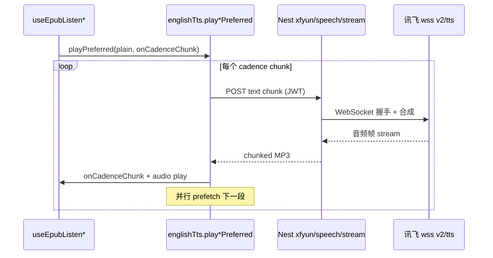

# 讯飞 TTS 选型调研：听书能力接入

> **调研日期**：2026-06-27  
> **实现状态（2026-06-27）**：**已接入讯飞在线合成（后端 WS 代理 + 前端中文选路）** — 见 `xfyun-tts.service.ts`、`POST /speech-transcription/xfyun/speech/stream`、`englishTts.startCloudTts`（CJK → 讯飞，否则 MiniMax）。  
> **信息来源**：[讯飞控制台 · 语音合成](https://console.xfyun.cn/services/tts)、[在线语音合成 API（流式 WebSocket）](https://www.xfyun.cn/doc/tts/online_tts/API.html)、[长文本语音合成 API（HTTP 异步）](https://www.xfyun.cn/doc/tts/long_text_tts/API.html)  
> **关联 SPEC**：[`epub-listen-while-read.md`](./epub-listen-while-read.md)（边听边读产品定义）、[`ebook-reader.md`](./ebook-reader.md)  
> **性质**：供应商选型与接入约束说明；**非实现承诺**，落地前需 PoC 与计费核对。

---

## 1. 结论摘要（TL;DR）

| 问题 | 结论 |
|------|------|
| **听书（边听边读 / 听当前）应优先接哪种？** | **在线语音合成（流式 WebSocket 版）** |
| **长文本语音合成是否适合主路径？** | **不适合** 作为交互式听书主引擎；可作为 **V2 可选**：整章/全书离线生成、导出 MP3 |
| **与现有仓库关系** | 前端已有 `englishTts.ts` 句读分段 + 云端 **段级预取**（`playCloudTtsCadenceSegments`）；后端已有 `speech-transcription` 模块（MiniMax 流式 + 硅基 `/speech`）。讯飞 **在线流式** 最贴近该架构，改动面小于长文本异步任务链 |
| **中文 EPUB 听书** | 讯飞长文本/在线均支持中文及「阅读听书」发音人（如 `x4_qianxue`、`x4_mingge`）；相对当前偏英文的 MiniMax 默认音色，讯飞更适合 **中文书籍** 云端朗读补充 |

**推荐策略**

1. **V1 听书主路径**：讯飞 **在线语音合成 WebSocket** → NestJS 代理/转流 → 复用 `splitTextForTtsCadence` + 句间预取 + `onCadenceChunk` 高亮。  
2. **V2 增强（可选）**：讯飞 **长文本** 用于「预生成整章 MP3 缓存到 COS」或「导出音频」，不参与暂停/上一句/下一句的实时控制。  
3. **保留现有**：MiniMax / 硅基 / 本机 Web Speech 作为英文与回退链路，通过 **TTS Provider 抽象** 按语种或用户设置选路。

---

## 2. 项目内「听书」需求边界（对照基线）

以 [`epub-listen-while-read.md`](./epub-listen-while-read.md) 与现有代码为准：

| 能力 | 要求 | 对 TTS 的含义 |
|------|------|----------------|
| **听当前** | 选区/引用一段，播完即停 | 单次请求文本通常 ≤ 数千字；需 **低首包延迟** |
| **边听边读（规划）** | 从 spine 当前位置连续朗读；句级高亮；暂停/续播；上一句/下一句 | 需 **按句/按段多次合成** + **播 N 预取 N+1**；非「一次生成整章 MP3」 |
| **句级回调** | `TtsCadenceChunkEvent`（`phase` / `sentenceIndex` / `sentencePlainStart`） | 合成粒度须与 **cadence 分段** 对齐；整章单文件难以映射到句级 UI |
| **会员云端 / 非会员本机** | `shouldUseCloudEnglishTts` + 设置页 `playbackSource` | 新供应商走 **同一会员网关 + 后端鉴权**，密钥不进浏览器 |
| **中文书** | EPUB 正文以中文为主 | 云端需 **中文发音人**；本机已有 `isPredominantlyCjk` → `zh-CN`（`englishTts.ts`） |

当前云端实现要点（已实现，与选型强相关）：

- 单次请求上限：`MAX_SINGLE_CLOUD_TTS_CHARS`、硅基后端 `TTS_INPUT_MAX_CHARS = 4096`（见 `siliconflow-transcription.service.ts`）。
- 超长文本：**句读切分** `splitTextForTtsCadence` + **`playCloudTtsCadenceSegments` 流水线预取下一段**（见 `docs/english/cloud-tts-cadence-prefetch.md`）。
- 接口形态：MiniMax **chunked 流式**（`POST .../minimax/speech/stream`），前端 `startCloudTts` → MP3 Blob → `<audio>`。

**听书的成功标准（摘录 SPEC）**：会员云端长章 **分段预取不阻塞 UI**；**首句出声** ≤ 现有「听当前」长选区体验。该标准直接 favor **流式、可分段** 的在线合成，而非异步整章任务。

---

## 3. 讯飞两种产品对比

### 3.1 能力对照表

| 维度 | **在线语音合成（流式版）** | **长文本语音合成** |
|------|---------------------------|-------------------|
| **官方定位** | 实时交互、播报、智能硬件；WebSocket 流式 | 万字级、配音/有声读物等 **超大单次文本** |
| **协议** | `wss://tts-api.xfyun.cn/v2/tts`（WebSocket） | `POST .../dts_create` + `POST .../dts_query` 或 **callback_url**（HTTP） |
| **单次文本上限** | **&lt; 8000 字节**（约 **2000 汉字**）；超长须 **自然段切分、多次请求** | **约 10 万字符** / 文本 0–1MB |
| **首包延迟** | **低**（流式推送音频帧，`status:2` 结束） | **高**（任务状态 1→3→5；异步合成，需轮询或回调） |
| **浏览器直连** | WebSocket **可跨域**（文档明确相对 HTTP API 的优势）；生产仍建议 **后端代理** 以保护密钥 | 文档写明 **不适用于浏览器**（跨域）；必须 **服务端** 调用 |
| **音频交付** | 连接内 **流式 JSON + base64 音频片**；合成完断开 WS | 成功后 `payload.audio.audio` 为 **音频 URL（base64）**；**云端仅保留 7 天** |
| **发音人** | **100+**；中英粤及多方言、小语种（控制台需开通） | 列表较窄；含 **「阅读听书」** 风格（千雪、明哥、聆伯松等） |
| **输出格式** | pcm、mp3、speex、opus；16k/8k | pcm、mp3、speex、opus 等 |
| **拼音/音素** | 在线文档侧重流式播放 | 可选 `rhy=1` 返回拼音（部分引擎）；**不替代** 前端已有 plain↔DOM 句界 |
| **与听书交互** | ✅ 分段请求 + 流式播放 + 预取下一段 | ❌ 整章一单；暂停/seek 句级须自建 MP3 切分或重新任务 |
| **计费/额度** | 控制台「语音合成」流式版套餐；创建应用默认 **每日 500 次** 试用量级（以控制台为准） | 独立「长文本」产品页与额度；适合 **按章批量**，不适合高频句级 scrub |

### 3.2 官方文档中的关键约束（摘录）

**在线语音合成**（[API 文档](https://www.xfyun.cn/doc/tts/online_tts/API.html)）：

- 文本需 base64；**base64 前 &lt; 8000 字节**。
- `status` 固定为 2：「流式合成的文本 **只能一次性传输，不支持多次分段传输**」——指 **单次 WS 会话** 内不可再拆包；**多句听书** = **多次 WS 会话**（与现有 `playCloudTtsCadenceSegments` 一致）。
- 超长文本：**按自然段切分，分多次合成请求**（官方 FAQ 与项目现有策略一致）。

**长文本语音合成**（[API 文档](https://www.xfyun.cn/doc/tts/long_text_tts/API.html)）：

- 创建任务 → 返回 `task_id`；查询时 `task_status`：`1` 创建成功 → `3` 处理中 → `5` 成功 / `4` 失败。
- 结果音频 **云端保存 7 天**，须及时下载；适合落 **COS/本地** 后长期播放。
- **适用范围**：任意 OS，**因不支持跨域不适用于浏览器**。
- 可选 `callback_url` + `request_id` 做异步通知。

---

## 4. 场景匹配分析

### 4.1 交互式听书（主场景）→ **在线语音合成**

| 听书行为 | 在线合成 | 长文本合成 |
|----------|----------|------------|
| 从当前 CFI 起播，**2–5 秒内** 听到第一句 | ✅ 流式首包 | ❌ 需等整任务（整章越大等越久） |
| **暂停 / 继续** 同一句 | ✅ 控制 `<audio>` 或缓存 Blob | ⚠️ 仅整文件 pause；句级需自建索引 |
| **上一句 / 下一句** | ✅ 改 cadence 索引 → 新 WS 请求 | ❌ 需重新切分文本或切 MP3 |
| **句级淡黄底**（`onCadenceChunk`） | ✅ 与分段请求同节奏 | ❌ 无天然句边界回调 |
| **播当前段预取下一段** | ✅ 对齐 `prefetchCloudEnglishTts` / `playCloudTtsCadenceSegments` | ❌ 任务级粒度 |
| 单 spine 1–3 万字 | ⚠️ 需 **~5–15+ 次** 在线请求（每段 ≤2000 字） | ✅ 一次任务可覆盖 |
| 密钥与会员 | ✅ 后端 WS 代理，与现 JWT 一致 | ✅ 仅后端；但多 **任务表 + 轮询/回调 + 对象存储** |

**结论**：交互式听书的产品形态是 **「多段短请求 + 流式播放 + 预取」**，与 **在线合成** 一致；长文本的「一次 10 万字」优势无法转化为 **句级 UI**，反而增加 **任务状态机** 与 **7 日 URL 过期** 运维成本。

### 4.2 长文本更合适的子场景（非 V1 主路径）

| 子场景 | 说明 |
|--------|------|
| **整章预缓存** | 用户打开章节后，后台异步生整章 MP3 写入 COS；前台仍用 **在线** 实时听，缓存用于弱网/重复听 |
| **导出「本章音频」** | 下载 MP3，类似有声书 MP3 章节 |
| **离线包** | 桌面 Tauri 预下载；需自建存储，不能依赖讯飞 7 日链接 |

若采用长文本，建议 **独立产品能力**（「生成章节音频」），**不要** 替换 `playEnglishPreferred` 主链路。

---

## 5. 与现有仓库架构的对齐

### 5.1 前端（`apps/frontend`）

| 现有模块 | 讯飞在线接入方式 |
|----------|------------------|
| `englishTts.ts` | 新增 provider 分支：`fetchCloudTtsBlob` / `startCloudTts` 在 MiniMax 失败或 **中文书** 时走 `SPEECH_XFYUN_TTS_STREAM`（命名待定） |
| `splitTextForTtsCadence` | **复用**；单段仍须 &lt; 8000 **字节**（UTF-8 中文约 2000 字），与讯飞上限同量级 |
| `playCloudTtsCadenceSegments` | **复用** 预取循环；仅替换 `startCloudTts` 实现 |
| `useEbookQuoteListen` / 规划 `useEpubChapterListen` | **不改** 会话状态机；仍调 `playEnglishPreferred`（或重命名为 `playTtsPreferred`） |
| 设置页 / `minimaxTtsPrefs` | 扩展为 **多供应商 TTS 偏好**（音色 `vcn`、speed/volume/pitch 0–100 映射） |

### 5.2 后端（`apps/backend`）

| 现有模块 | 建议 |
|----------|------|
| `speech-transcription.module.ts` | 新增 `XfyunOnlineTtsService`（WS 客户端或 HTTP 转 chunked MP3） |
| `speech-transcription.controller.ts` | 新增 `POST /speech-transcription/xfyun/speech/stream`（JWT + 会员校验，对齐 MiniMax） |
| `config.enum.ts` | `XFYUN_APP_ID`、`XFYUN_API_KEY`、`XFYUN_API_SECRET`（或流式版 `APIPassword`） |
| `siliconflow-transcription.service.ts` | 硅基 TTS **保留** 作回退；与讯飞 **并列**，非互斥 |

**鉴权**：在线 WS 握手需 HMAC 签名或 `x-api-key`（[在线文档 · 鉴权方式一/二](https://www.xfyun.cn/doc/tts/online_tts/API.html)）；**必须在 Nest 侧完成**，不可下发 `apiSecret` 到前端。

**长文本（若 V2）**：独立 `XfyunLongTextTtsService` + 任务表（`task_id`、`task_status`、COS key）+ 定时清理；**不要** 与流式 endpoint 混在同一 handler。

### 5.3 语种与供应商分工（建议）

| 语种 / 场景 | 优先云端 | 回退 |
|-------------|----------|------|
| **英文**（英语学习、英文 EPUB） | 现有 MiniMax → 硅基 | 本机 Web Speech |
| **中文**（中文 EPUB 听书） | **讯飞在线**（听书发音人） | 本机 `zh-CN` |
| **混合** | 按 `isPredominantlyCjk(plain)` 或 spine 元数据选 provider | 本机 |

---

## 6. 接入在线语音合成（推荐路径）草案

### 6.1 数据流（目标态）

### 6.2 分段策略（与讯飞上限对齐）

1. 正文：`stripMarkdownForTts` → `splitTextForTtsCadence`（已有）。
2. **硬上限**：发送前 `new TextEncoder().encode(chunk).length < 8000`（字节），超出则二次切分（按句号/逗号，与硅基 4096 **字符** 逻辑类似）。
3. **预取**：保持「播 chunk[i] 时 `startCloudTts(chunk[i+1])`」；WS 连接 **每 chunk 新建**（符合讯飞「单次会话一次文本」）。

### 6.3 发音人建议（中文听书 PoC）

长文本文档附录含 **「阅读听书」** 分类发音人，在线版需在控制台核对同名 `vcn` 是否可用：

| 名称 | vcn（长文本文档） | 用途 |
|------|-------------------|------|
| 千雪 | `x4_qianxue` | 女声听书 |
| 明哥 | `x4_mingge` | 男声听书 |
| 聆伯松 | `x4_lingbosong` | 老年男声听书 |

PoC 时以控制台 **在线语音合成** 发音人列表为准。

### 6.4 非目标（V1 不做）

- 浏览器直连讯飞 WS（密钥暴露 + 额度盗用）。
- 用长文本任务驱动 **实时** 句级高亮。
- 替换现有 MiniMax 英文链路（仅 **扩展** 中文听书）。

---

## 7. 风险与成本

| 风险 | 等级 | 说明 | 缓解 |
|------|------|------|------|
| 单章请求次数多 | 中 | 1 万字 ≈ 5+ 次 WS（2000 字/次） | 段级 MP3 LRU 缓存（已有模式）；同章重复听命中缓存 |
| 在线并发连接 | 中 | 预取 + 播放可能短时 2 连接 | 限制预取深度为 1；abort 时关 WS |
| 额度/计费 | 中 | 流式按次/字符计费以控制台为准 | 会员 gating；非会员本机 |
| 长文本误用为主路径 | 高 | 任务延迟破坏「边听边读」体验 | SPEC 与代码 review 禁止 chapter listen 走 dts_create |
| 7 日音频过期 | 低（仅长文本） | 链接失效 | V2 必须落 COS；V1 不用长文本则无此问题 |
| 发音人跨产品不一致 | 低 | 在线 vs 长文本 vcn 列表可能不同 | PoC 在 **在线** 控制台试听后再定默认值 |

---

## 8. PoC 与验收清单

### 8.1 PoC（在线合成，建议 2–3 人日）

- [ ] 控制台开通 **在线语音合成（流式版）**，获取 AppID / APIKey / APISecret（或 APIPassword）
- [ ] Nest：最小 WS 代理，输入 1 段中文 500 字，输出 MP3 流
- [ ] 前端：`startCloudTts` 增加 xfyun 分支，播放 1 段 + `onCadenceChunk` 回调
- [ ] 连续 3 段 cadence + **预取第 4 段**，测量 **首句出声时间** 与 **句间间隙**
- [ ] 中文 EPUB 选区「听当前」回归 + 与 MiniMax 英文句对比延迟

### 8.2 选型验收（回答「哪个更适合听书」）

- [ ] **交互式听书**（暂停/上一句/下一句/句级高亮）仅在线合成满足
- [ ] 长文本仅在有「整章 MP3 导出/预生成」需求时再评估
- [ ] 文档与 [`epub-listen-while-read.md`](./epub-listen-while-read.md) §3 数据流一致：TTS 层仍为 **cadence 分段 + 预取**

---

## 9. 决策记录

| 决策 | 选择 | 理由 |
|------|------|------|
| 听书主 TTS 产品 | **讯飞在线语音合成（WebSocket 流式）** | 低延迟、可分段、可对接现有 `englishTts` 预取流水线；官方亦要求超长文本 **多次请求** |
| 长文本语音合成 | **V2 可选**，非主路径 | 异步任务 + 7 日 URL + 无句级回调，与边听边读状态机不匹配 |
| 接入层 | **后端 `speech-transcription` 扩展** | 与 MiniMax/硅基一致；JWT + 会员；密钥不下发 |
| 英文内容 | **保留 MiniMax 优先** | 现有投资与音色；讯飞补 **中文 EPUB** |

---

## 10. 参考链接

- [讯飞控制台 · 语音合成服务](https://console.xfyun.cn/services/tts)
- [在线语音合成 API 文档（WebSocket 流式）](https://www.xfyun.cn/doc/tts/online_tts/API.html)
- [长文本语音合成 API 文档（HTTP 异步）](https://www.xfyun.cn/doc/tts/long_text_tts/API.html)
- 仓库内：[`apps/frontend/src/utils/englishTts.ts`](../src/utils/englishTts.ts)、[`apps/backend/src/services/speech-transcription/`](../backend/src/services/speech-transcription/)、[`docs/english/cloud-tts-cadence-prefetch.md`](../../docs/english/cloud-tts-cadence-prefetch.md)

---

（若与讯飞开放平台最新文档或仓库源码不一致，以控制台文档与源码为准。）
