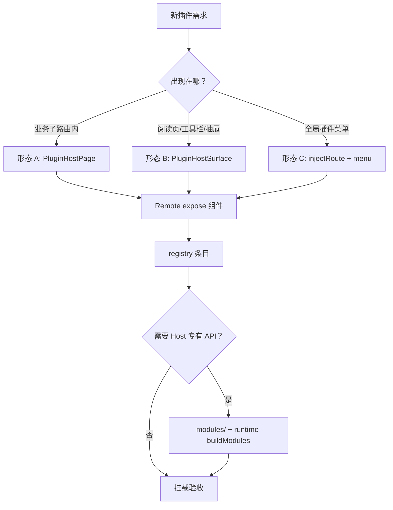

# 新插件接入指南（Host 侧）

> 面向：要在主项目（`apps/frontend`）里挂载一个 **Module Federation Remote 插件** 的开发者。  
> 约定：业务代码只从 `@/federation` 导入；Remote 工程独立构建部署（如 `:9008`）。

---

## 0. 先选接入形态

接入前先确定插件出现在 Host 的哪种「槽位」：

| 形态 | 适用场景 | Host 要做的事 | 参考 |
|------|----------|---------------|------|
| **A. 业务页内嵌** | 固定业务路由下的功能区（如学习笔记） | 静态路由 + 宿主页 + `<PluginHostPage />` | `learningNotes` |
| **B. Surface 槽位** | 嵌在某个业务面（阅读页 drawer/toolbar） | registry 写 `host.surface` + 业务页 `<PluginHostSurface />` | `ebookIdeas` |
| **C. 顶层独立路由** | 插件自带完整页面、进全局侧栏 | registry `injectRoute: true` + `menu` | 部分 demo 插件 |



---

## 1. `federation/` 目录：什么情况下改什么

业务侧**只从 `@/federation` 导入**；下面表格说明接入新插件时，各目录**是否必须改**、**改什么**。

| 目录 / 文件 | 职责 | 新插件通常要不要改 | 改什么 |
|-------------|------|-------------------|--------|
| [`index.ts`](./index.ts) | 统一 re-export | **可选** | 若业务页需直接 import 你的 `hostApi` / `syncBus` 符号，在此追加 export |
| [`runtime/index.ts`](./runtime/index.ts) | **唯一装配点**：toast、http、全屏、选文件、`buildModules`、iframe RPC | **按需** | 新增 `modules:<id>` 时在 `buildModules` 注册；iframe 插件加 `iframeRpcHandlers` |
| [`registry/`](./registry/README.md) | 拉取 `plugins-registry.json`、缓存 | **一般不改代码** | 在 registry JSON（管理端 / COS）加插件条目 |
| [`enabled/`](./enabled/README.md) | 账号维度上架偏好 | **不改** | 已有通用逻辑；宿主页用 `usePluginEnabled` + `ensurePluginEnabledPrefsLoaded` |
| [`host/`](./host/README.md) | `PluginHostPage` / `PluginHostSurface` 挂载模版 | **不改** | 业务页直接 `<PluginHostPage pluginId="…" />` |
| [`capabilities/`](./capabilities/README.md) | 通用 UI（全屏、选文件） | **一般不改** | 已在 runtime 装配；registry 声明 `ui:toast` 即可用 |
| [`modules/<pluginId>/`](./modules/README.md) | 插件专属 `api.modules.*` | **按需** | 新建 `hostApi.ts`（+ 可选 `syncBus.ts`） |
| [`sync/`](./sync/README.md) | 跨窗 sync 工厂 | **一般不改** | 插件 bus 写在 `modules/<pluginId>/syncBus.ts`，复用 `createHostPluginSyncBus` |

**最小接入（只调 toast、不走 Host 专有 API）**：Remote + registry + 业务宿主页 + 静态路由 —— **`federation/` 内零代码改动**。

---

## 2. 总览：逐步 checklist

按顺序勾选；带 `*` 为必做，其余按需求。

| 步骤 | 位置 | 动作 | 必做 |
|------|------|------|------|
| 1 | Remote 工程 | expose 组件 + 样式 + 本地 MF dev | * |
| 2 | `plugins-registry.json` | 增加插件 descriptor | * |
| 3 | `views/.../XxxPage.tsx` | 宿主页：prefs 门闩 + `PluginHostPage` / `PluginHostSurface` | * |
| 4 | `router/routes.ts` | 形态 A/C 注册静态路由 | 形态 A/C |
| 5 | 业务 layout / 侧栏 | 导航入口（可选） | 可选 |
| 6 | `federation/modules/<id>/hostApi.ts` | 实现 `createXxxModulesApi` | 需 Host API 时 |
| 7 | `federation/runtime/index.ts` | `buildModules` 注册 + permission 门闩 | 需 Host API 时 |
| 8 | `federation/index.ts` | re-export 模块符号（供业务页 bind） | 按需 |
| 9 | 业务宿主页 `useEffect` | `setXxxHostHandlers(...)` 绑定页内状态 | handler 穿透模式 |
| 10 | `modules/<id>/syncBus.ts` + Relay 组件 | 跨窗 sync | Popout / 多窗时 |
| 11 | `runtime/index.ts` → `iframeRpcHandlers` | iframe 插件 RPC | iframe 形态 |
| 12 | 插件管理 / 账号上架 | 用户勾选可用 | 验收 |

形态 B（Surface）可跳过步骤 4（无独立路由），步骤 3 改为在宿主业务面渲染 `PluginHostSurface`。

---

## 3. Remote 插件工程（Remote 仓）

> 若 Remote 已在独立仓库 / `apps/remote-plugins`，在本机确保 MF dev 服务可访问（默认 `http://127.0.0.1:9008/mf-manifest.json`）。

### 3.1 暴露入口

Remote 的 `exposes` 须有一个 React 组件作为 **default export**，签名：

```ts
import type { HostBridgeProps } from '@dnhyxc-ai/federation-kit';

export default function MyPluginApp(props: HostBridgeProps) {
  const { api, plugin } = props;
  // ...
}

// 可选生命周期（单独文件 export，勿与组件同文件空 export 触发 HMR 问题）
export async function activate(api: HostBridgeProps['api']) { /* ... */ }
export async function deactivate() { /* ... */ }
```

### 3.2 样式

每个 expose 入口文件顶部：

```ts
import '@/styles.css'; // Remote 自己的样式；Host 不会跑 Remote 的 main.ts
```

### 3.3 本地调试

Remote dev 服务启动后，浏览器能直接打开 `mf-manifest.json`。

---

## 4. Registry 条目（必做）

在管理端保存，或写入 COS / 静态路径的 `plugins-registry.json`（开发时也可放 `apps/backend/uploads/remotes/plugins-registry.json`）。

### 4.1 最小字段（形态 A · 内嵌页）

```json
{
  "id": "myPlugin",
  "remoteName": "remotePlugins-myPlugin",
  "expose": "./MyPlugin",
  "title": { "zh-CN": "我的插件", "en-US": "My plugin" },
  "description": { "zh-CN": "……", "en-US": "……" },
  "routePath": "/my-area/my-plugin",
  "entry": "http://127.0.0.1:9008/mf-manifest.json",
  "version": "1.0.0",
  "hostApiRange": "^1.0.0",
  "injectRoute": false,
  "permissions": ["ui:toast"],
  "preload": "route",
  "enabled": true,
  "trust": "first-party"
}
```

### 4.2 字段说明

| 字段 | 说明 |
|------|------|
| `id` | Host 侧 `pluginId`，与 `<PluginHostPage pluginId="…" />` **完全一致** |
| `remoteName` / `expose` | MF 加载键：`loadRemote('remoteName/expose')` |
| `routePath` | 逻辑路由前缀；`nav:subtree` 导航不能越界 |
| `entry` | 生产改为 CDN 上的 `mf-manifest.json` |
| `hostApiRange` | 须覆盖 Host 的 `VITE_HOST_API_VERSION`（默认 `1.0.0`） |
| `injectRoute: false` | **业务内嵌时设为 false**，避免重复注入顶层路由 |
| `permissions` | 见 [§8 权限](#8-权限与-bridge-api) |

### 4.3 形态 B · Surface 额外字段

```json
"host": {
  "surface": "ebook.read",
  "slot": "drawer",
  "icon": "https://…/icon.svg",
  "order": 10
}
```

业务页对应渲染：

```tsx
<PluginHostSurface surface="ebook.read" part="drawer-triggers" />
<PluginHostSurface surface="ebook.read" part="drawer" />
<PluginHostSurface surface="ebook.read" part="toolbar" />
```

`surface` 字符串由 Host 业务面约定；registry 里 `host.surface` 与 `PluginHostSurface` 的 `surface` prop 一致即可。

### 4.4 形态 C · 顶层独立路由

```json
"injectRoute": true,
"menu": { "order": 50, "icon": "https://…/icon.svg" }
```

此时**不必**在 `routes.ts` 手写该插件路由；`mf.start()` 后 `routeInjector` 会注入，`router/index.tsx` 已订阅 `mf.onRoutesChange` 重建路由。

### 4.5 刷新 registry

开发时清 localStorage 缓存或管理端保存后，Host 会 `fetchRegistry({ force: true })`。  
缓存 key 见 [`registry/README.md`](./registry/README.md)（`PLUGIN_REGISTRY_CACHE_KEY`）。

---

## 5. Host 业务页挂载

### 5.1 形态 A：新建宿主页（逐步）

**步骤 5.1.1** — 新建文件，例如 `apps/frontend/src/views/myArea/MyPluginPage.tsx`：

```tsx
import { useEffect, useState } from 'react';
import {
  ensurePluginEnabledPrefsLoaded,
  PluginHostPage,
  usePluginEnabled,
} from '@/federation';
import { useI18n } from '@/hooks';

export default function MyPluginPage() {
  const { t } = useI18n();
  const enabled = usePluginEnabled('myPlugin'); // 与 registry id 一致
  const [prefsReady, setPrefsReady] = useState(false);

  useEffect(() => {
    let cancelled = false;
    void ensurePluginEnabledPrefsLoaded().finally(() => {
      if (!cancelled) setPrefsReady(true);
    });
    return () => { cancelled = true; };
  }, []);

  return (
    <div className="flex h-full min-h-0 flex-col">
      {prefsReady && !enabled ? (
        <p className="text-textcolor/55 p-4.5">{t('plugins.host.delisted')}</p>
      ) : (
        <PluginHostPage pluginId="myPlugin" className="h-full min-h-0" />
      )}
    </div>
  );
}
```

要点：

- **`prefsReady`**：避免偏好未加载时误显示「已下架」（`enabled/` 未就绪前 `get` 为 false）
- **`pluginId`** 与 registry `id` 完全一致
- 壳层 / layout 由业务页负责；插件 UI 由 Remote 渲染
- **`federation/` 无需改代码**，直接用已有 `PluginHostPage`

**步骤 5.1.2** — 注册静态路由 `apps/frontend/src/router/routes.ts`：

```ts
const MyPluginPage = lazy(() => import('@/views/myArea/MyPluginPage'));

// 在合适 layout 的 children 下：
{
  path: 'my-plugin',           // 或绝对 path
  Component: MyPluginPage,
  meta: { titleKey: 'route.myPlugin.title' },
},
```

参考：`learningNotes` → `/english-learning/notes`，[`routes.ts`](../../router/routes.ts) 约 230 行。

**步骤 5.1.3**（可选）— 业务侧栏 / 菜单加跳转链接，指向上述静态路由。

**步骤 5.1.4**（可选）— 若插件有 Popout 子路由，另建 popout 页 + 顶层路由（参考 `/english-learning/notes/popout`）。

### 5.2 形态 B：Surface 宿主页（逐步）

**步骤 5.2.1** — registry 写 `host.surface` / `host.slot`（见 §4.3）。

**步骤 5.2.2** — 在宿主业务面 JSX 中挂载（参考 [`views/ebook/read.tsx`](../../views/ebook/read.tsx)）：

```tsx
import { PluginHostSurface } from '@/federation';

// drawer 开关状态由宿主页维护
const [hostDrawerPluginId, setHostDrawerPluginId] = useState<string | null>(null);

<PluginHostSurface
  surface="ebook.read"
  part="drawer-triggers"
  openPluginId={hostDrawerPluginId}
  onOpenPluginIdChange={setHostDrawerPluginId}
/>
<PluginHostSurface surface="ebook.read" part="toolbar" />
<PluginHostSurface
  surface="ebook.read"
  part="drawer"
  openPluginId={hostDrawerPluginId}
  onOpenPluginIdChange={setHostDrawerPluginId}
/>
```

**步骤 5.2.3** — 若插件需读当前页上下文，在宿主页 `useEffect` 里绑定 handler（见 §7.2 ebook 模式）。

**`federation/host/` 无需改代码**。

### 5.3 形态 C：顶层独立路由

**步骤 5.3.1** — registry `injectRoute: true`（或省略，默认为 true）+ `menu`。

**步骤 5.3.2** — 确认 App 已启动 federation（§6）；无需在 `routes.ts` 手写该路由。

**步骤 5.3.3**（可选）— 自定义外壳：动态路由 factory 会使用已注册的 `PluginHostPage`（`pageShell: true` 时套 [`PluginPageShell`](./host/PluginPageShell.tsx)）。

---

## 6. 启动 Federation（App 级，通常已有）

[`router/index.tsx`](../../router/index.tsx) 已在挂载时执行：

```ts
import { mf } from '@/federation';

// useEffect 内：
const unsub = mf.onRoutesChange(() => setRouteEpoch((n) => n + 1));
void mf.start().finally(() => setPluginsReady(true));

// router 创建后：
mf.setNavigate((to) => void r.navigate(to));
```

新插件接入**一般不必改此文件**；只有首次引入 federation 或改 navigate 行为时才动。

---

## 7. 需要 Host 专有 API 时（`modules/` + `runtime`）

当插件需要 Host 环境能力（当前书籍 ID、跨窗 sync、Popout 窗口等），按下面步骤在 `federation/` 增加模块。

### 7.1 步骤一：新建 `modules/<pluginId>/hostApi.ts`

目录示例：

```text
federation/modules/myPlugin/
  hostApi.ts      # 必做
  syncBus.ts      # 跨窗 sync 时
  README.md       # 建议：写清 API 与 Host 绑定方式
```

**模式 A — 自包含 API**（参考 learningNotes）：模块内自己管窗口、storage、sync。

```ts
// federation/modules/myPlugin/hostApi.ts
export function createMyPluginModulesApi() {
  return Object.freeze({
    getSomething: () => '…',
    doAction: (payload: unknown) => { /* … */ },
  });
}
```

**模式 B — handler 穿透**（参考 ebook）：Host 业务页在运行时注入实现。

```ts
// federation/modules/myPlugin/hostApi.ts
export type MyPluginHostHandlers = {
  getContextId: () => string | null;
  doHostAction: (payload: unknown) => void;
};

let handlers: MyPluginHostHandlers | null = null;

export function setMyPluginHostHandlers(next: MyPluginHostHandlers | null) {
  handlers = next;
}

export function createMyPluginModulesApi() {
  return Object.freeze({
    getContextId: () => handlers?.getContextId() ?? null,
    doHostAction: (payload: unknown) => {
      const fn = handlers?.doHostAction;
      if (!fn) throw new Error('MY_PLUGIN_API_UNBOUND');
      fn(payload);
    },
  });
}
```

Host 业务页绑定（ebook 同款）：

```tsx
import { setMyPluginHostHandlers } from '@/federation';

useEffect(() => {
  if (!ready) {
    setMyPluginHostHandlers(null);
    return;
  }
  setMyPluginHostHandlers({
    getContextId: () => contextId,
    doHostAction: (payload) => { /* … */ },
  });
  return () => setMyPluginHostHandlers(null);
}, [ready, contextId]);
```

### 7.2 步骤二：在 `runtime/index.ts` → `buildModules` 注册

打开 [`runtime/index.ts`](./runtime/index.ts)，在文件顶部 import，并在 `capabilities.buildModules` 内按 permission 门闩装配：

```ts
import { createMyPluginModulesApi } from '../modules/myPlugin/hostApi';

// buildModules 内（与 learningNotes / ebook 并列）：
if (allow.has('modules:myPlugin')) {
  modules.myPlugin = createMyPluginModulesApi();
}
```

Remote 侧调用：`api.modules?.myPlugin?.getSomething()`。

> **learningNotes**：须同时声明 `http:plugin-api`（调后端）与 `modules:learningNotes`（Host 模块）；二者职责分离。

### 7.3 步骤三：registry 增加 permission

```json
"permissions": ["ui:toast", "modules:myPlugin"]
```

`permissions` 与 `buildModules` 门闩必须一致，否则 `api.modules.myPlugin` 为 `undefined`。

### 7.4 步骤四（可选）：在 `federation/index.ts` re-export

若业务页需要 `setMyPluginHostHandlers` 等符号，追加 export（参考 ebook / learningNotes）：

```ts
export {
  createMyPluginModulesApi,
  setMyPluginHostHandlers,
  type MyPluginHostHandlers,
} from './modules/myPlugin/hostApi';
```

### 7.5 步骤五（可选）：更新 `modules/README.md`

在子目录表格中登记新插件，方便后续维护。

---

## 8. 权限与 bridge API

插件在 registry 声明的 `permissions` 决定 `props.api` 里有哪些字段（见 kit [`宿主桥接API.md`](../../../../packages/federation-kit/docs/plugin-guide/宿主桥接API.md)）。

| permission | 插件可用 API |
|------------|----------------|
| （无） | `api.theme` / `api.locale` / `api.event` |
| `ui:toast` | + `api.ui.showToast` / `setAppFullscreen` / `pickLocalFiles` / `downloadBlob` |
| `nav:subtree` | + `api.navigate`（限定 `routePath` 前缀） |
| `http:plugin-api` | + `api.http.*`（走 Host `@/utils/fetch`） |
| `modules:ebook` | + `api.modules.ebook.*` |
| `modules:learningNotes` | + `api.modules.learningNotes.*` |
| `modules:<你的插件>` | + `api.modules.<你的插件>.*`（须 Host 注册） |

Remote 侧使用示例：

```ts
api.ui?.showToast?.({ message: 'OK', type: 'success' });
const data = await api.http?.get('/api/…');
const id = api.modules?.myPlugin?.getContextId?.();
```

通用 UI 能力已在 [`runtime/index.ts`](./runtime/index.ts) 的 `capabilities` 装配，**不必**在 `capabilities/` 下为新插件加文件。

---

## 9. 跨窗 sync（可选）

多窗口 / Popout 需要状态同步时，按顺序：

### 9.1 步骤一：建 `modules/<pluginId>/syncBus.ts`

基于 [`sync/hostSyncBus.ts`](./sync/hostSyncBus.ts) 工厂（**不要**改 `sync/` 基础设施本身）：

```ts
import { createHostPluginSyncBus } from '../../sync/hostSyncBus';

export const MY_PLUGIN_SYNC_CHANNEL = 'dnhyxc-my-plugin-sync-v1';

export type MyPluginSyncMessage =
  | { type: 'draft'; payload: string; windowId: string }
  | { type: 'saved'; id: string; windowId: string };

const bus = createHostPluginSyncBus<MyPluginSyncMessage>({
  channel: MY_PLUGIN_SYNC_CHANNEL,
  windowIdKey: 'dnhyxc_my_plugin_window_id',
  tauriEvent: MY_PLUGIN_SYNC_CHANNEL, // Tauri 多 WebView 时用
});

export const publishMyPluginSync = bus.publish;
export const subscribeMyPluginSync = bus.subscribe;
export const getMyPluginWindowId = bus.getWindowId;
```

### 9.2 步骤二：在 `hostApi.ts` 暴露 `sync.*`

```ts
import { publishMyPluginSync, subscribeMyPluginSync, getMyPluginWindowId } from './syncBus';

export function createMyPluginModulesApi() {
  return Object.freeze({
    getWindowId: () => getMyPluginWindowId(),
    sync: Object.freeze({
      publishDraft: (payload: string) =>
        publishMyPluginSync({ type: 'draft', payload, windowId: getMyPluginWindowId() }),
      subscribe: subscribeMyPluginSync,
    }),
  });
}
```

### 9.3 步骤三（可选）：Host 侧 Sync Relay

若要把 sync 消息转发到 kit `eventBus`（供其它 Host 模块监听），在宿主页挂小组件（参考 [`LearningNotesSyncRelay.tsx`](../../views/englishLearning/notes/LearningNotesSyncRelay.tsx)）：

```tsx
import { eventBus } from '@dnhyxc-ai/federation-kit';
import { subscribeMyPluginSync } from '@/federation';

export function MyPluginSyncRelay() {
  useEffect(() => {
    return subscribeMyPluginSync((msg) => {
      eventBus.emit('myPlugin', `sync:${msg.type}`, msg);
    });
  }, []);
  return null;
}
```

### 9.4 步骤四：Popout 关窗钩子（按需）

参考 learningNotes：`registerBeforeClose` + Host 侧 `runXxxBeforeCloseHandlers`，在 Tauri 关窗前 await 保存。

详见 [`modules/learningNotes/README.md`](./modules/learningNotes/README.md)。

---

## 10. iframe RPC（可选）

Untrusted iframe 嵌入插件时，在 [`runtime/index.ts`](./runtime/index.ts) 的 `iframeRpcHandlers` 增加方法名映射（参考 ebook）：

```ts
iframeRpcHandlers: {
  'myPlugin.getContextId': (bridge) => {
    const mod = bridge.api.modules?.myPlugin as { getContextId?: () => string | null } | undefined;
    return mod?.getContextId?.() ?? null;
  },
},
```

---

## 11. 上架与验收清单

### 11.1 开发自检

- [ ] Remote `mf-manifest.json` 可访问，CORS 含 Host 源（Web + `tauri://localhost`）
- [ ] registry `id` / `remoteName` / `expose` / `pluginId` 一致
- [ ] `hostApiRange` 与 `VITE_HOST_API_VERSION` 兼容
- [ ] 宿主页 `usePluginEnabled` + `prefsReady` 门闩正确
- [ ] 插件 `permissions` 与代码中使用的 `api.*` 一致
- [ ] 新增 `modules:*` 已在 `buildModules` 注册
- [ ] handler 穿透模式：离开页面时 `setXxxHostHandlers(null)`

### 11.2 运行时验证

```text
1. mf.start() 无报错
2. 打开宿主页 → PluginHostPage loading → 插件 UI 出现
3. 控制台无 MF 加载 / 权限 / hostApiRange 错误
4. 下架插件 → 显示 plugins.host.delisted
5. （如有 modules）api.modules.xxx 可调通
6. （Surface）drawer-triggers / toolbar / drawer 三块 part 行为正常
```

### 11.3 生产

- [ ] `entry` 改为生产 manifest URL  
- [ ] registry 上传 COS / 管理端保存  
- [ ] 账号维度上架（[`enabled/`](./enabled/README.md)）

---

## 12. 完整 walkthrough 示例

### 12.1 最小插件：`helloPanel`（零 federation 改动）

目标：在 `/demo/hello` 内嵌一个只调 toast 的演示插件。

| 步骤 | 文件 / 位置 | 动作 |
|------|-------------|------|
| 1 | Remote 工程 | expose `./HelloPanel`，default 组件接收 `HostBridgeProps` |
| 2 | registry | `id: "helloPanel"`，`permissions: ["ui:toast"]`，`injectRoute: false` |
| 3 | `views/demo/HelloPanelPage.tsx` | 内嵌 `<PluginHostPage pluginId="helloPanel" />` + prefs 门闩 |
| 4 | `router/routes.ts` | 注册 `/demo/hello` |
| 5 | — | 启动 Remote :9008 + Host dev，打开路由验收 |

**`federation/` 内无需改任何文件。**

### 12.2 带 Host API：`myPlugin`（handler 穿透，Surface）

目标：阅读页 toolbar 插件，需知道当前 `bookId`。

| 步骤 | 文件 | 动作 |
|------|------|------|
| 1 | Remote | 使用 `api.modules.myPlugin.getContextId()` |
| 2 | registry | `host.surface: "ebook.read"`，`permissions: ["ui:toast","modules:myPlugin"]` |
| 3 | `federation/modules/myPlugin/hostApi.ts` | handler 穿透 + `createMyPluginModulesApi` |
| 4 | `federation/runtime/index.ts` | `buildModules` 注册 `modules:myPlugin` |
| 5 | `federation/index.ts` | export `setMyPluginHostHandlers` |
| 6 | `views/ebook/read.tsx` | `PluginHostSurface` + `setMyPluginHostHandlers` in `useEffect` |

### 12.3 完整模式：`learningNotes`（内嵌 + Popout + sync）

| 步骤 | 文件 | 动作 |
|------|------|------|
| 1 | registry | `id: "learningNotes"`，`injectRoute: false`，`permissions` 含 `ui:toast`、`http:plugin-api`、`modules:learningNotes` |
| 2 | `federation/modules/learningNotes/hostApi.ts` | Popout、关窗钩子、`sync.*` |
| 3 | `federation/modules/learningNotes/syncBus.ts` | 消息类型 + publish/subscribe |
| 4 | `federation/runtime/index.ts` | `buildModules` → `learningNotes` |
| 5 | `federation/index.ts` | export 模块与 sync 符号 |
| 6 | `views/englishLearning/notes/index.tsx` | `PluginHostPage` + `<LearningNotesSyncRelay />` |
| 7 | `views/englishLearning/notes/popout.tsx` | Popout 宿主页 |
| 8 | `router/routes.ts` | `/english-learning/notes` + `/english-learning/notes/popout` |

---

## 13. 常见问题

| 现象 | 排查 |
|------|------|
| 白屏 / Remote 加载失败 | `entry` URL、CORS、remoteName/expose 是否与 manifest 一致 |
| `api.ui` 为 undefined | registry 是否含 `ui:toast` |
| `api.modules.xxx` 为 undefined | permission 是否声明 + `buildModules` 是否注册 |
| `MY_PLUGIN_API_UNBOUND` | handler 穿透：宿主页是否 `setXxxHostHandlers`，离开是否置 null |
| `NAV_OUT_OF_SCOPE` | `navigate` 目标须以 `routePath` 开头 |
| 刷新后 404 | 静态路由是否已注册；`injectRoute: false` 时不能指望 MF 注入路由 |
| hostApiRange 拒绝加载 | 提高插件 `hostApiRange` 或升级 Host `VITE_HOST_API_VERSION` |
| 误显示「已下架」 | 是否等 `ensurePluginEnabledPrefsLoaded` 后再判 `usePluginEnabled` |

---

## 14. 相关文档

| 文档 | 内容 |
|------|------|
| [`README.md`](./README.md) | federation 目录总览 |
| [`host/README.md`](./host/README.md) | Page / Surface 模版 |
| [`modules/README.md`](./modules/README.md) | 插件模块 checklist |
| [`runtime/README.md`](./runtime/README.md) | createFederation 装配说明 |
| [`packages/federation-kit/docs/plugin-guide/`](../../../../packages/federation-kit/docs/plugin-guide/) | Remote 侧开发、权限、样式隔离 |
| [`docs/plugins/宿主插件集成指南.md`](../../../../docs/plugins/宿主插件集成指南.md) | 历史集成指南（细节更丰富） |
