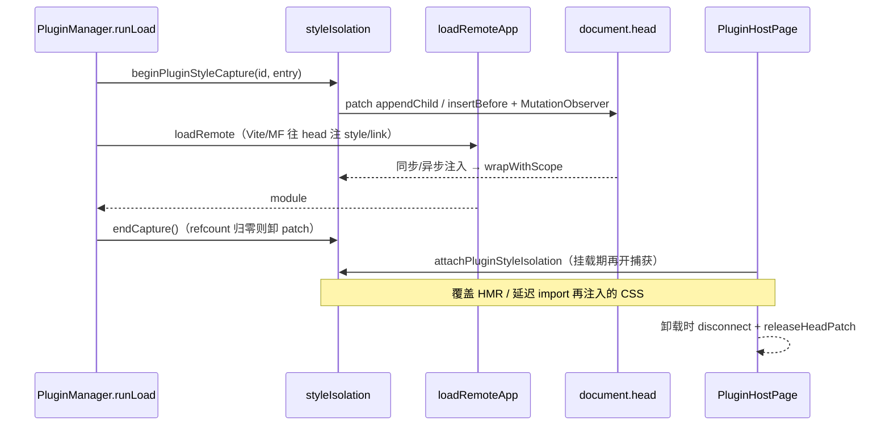
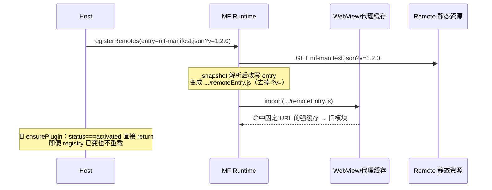
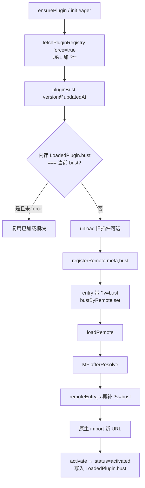
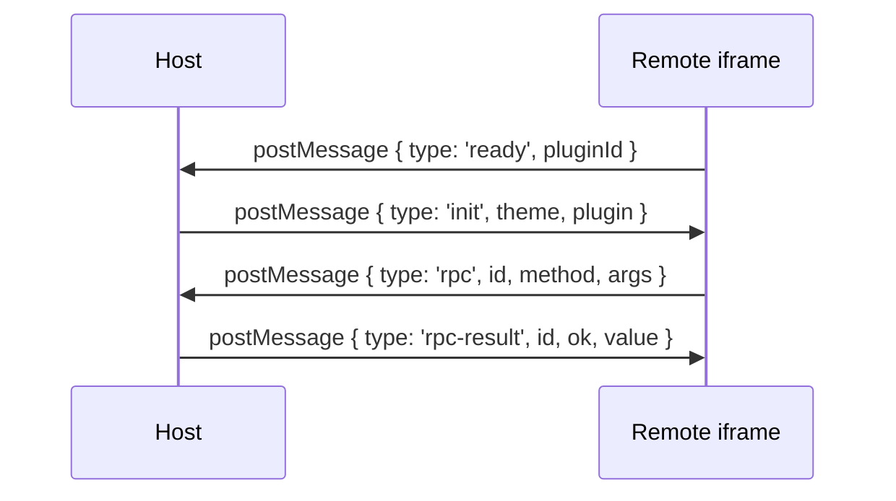
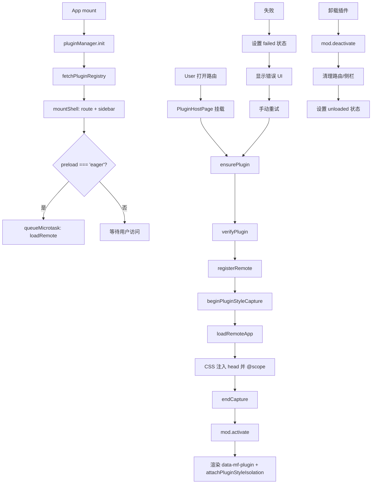

# Module Federation 动态插件实现指南

> **文档角色**：详细的实现过程文档，包含主项目具体实现方式和子项目/插件接入方式，代码含逐行注释。
> **适用读者**：主项目开发者、插件/子项目开发者。
> **同步说明**：已对齐最新 HostBridge（`api.locale`，无 `api.t`）、PluginHostPage locale 热更新、iframe `locale` 消息、**Host `@scope` 样式隔离完整方案（§2.10.2：原理 / 时序 / `styleIsolation.ts` 全文注释 / 接入点）**；Registry `title`/`description` locale map；**Host 勿 shared `react-router`**；entry 用 `version@updatedAt` bust + `afterResolve` 补 `remoteEntry.js?v=`；`ensurePlugin` 按 bust 判断重载；保存 registry 校验 `hostApiRange`；remotes 静态 `no-store`。若与源码不一致，以源码为准。

---

## 目录

1. [概述](#1-概述)
2. [主项目实现](#2-主项目实现)
   - 2.1 Vite 配置
   - 2.2 MF 核心运行时 (`mf.ts`)
   - 2.3 插件类型定义 (`types.ts`)
   - 2.4 插件管理器 (`PluginManager.ts`)
   - 2.5 路由注入器 (`RouteInjector.ts`)
   - 2.6 侧栏注入器 (`SidebarInjector.ts`)
   - 2.7 Host Bridge (`createHostBridge.ts`)
   - 2.8 插件验证器 (`PluginVerifier.ts`)
   - 2.9 Registry 管理 (`registry.ts`)
   - 2.10 插件宿主页面 (`PluginHostPage.tsx`)
   - 2.10.1 错误边界
   - **2.10.2 主子样式隔离（原理与完整实现）**
   - 2.11 路由构建与初始化 (`buildRoutes.ts` / `router/index.tsx`)
   - 2.12 语言（locale）同步
   - **2.13 插件/子应用加载缓存破坏（完整方案）**
3. [子项目/插件接入](#3-子项目插件接入)
   - 3.1 Vite 配置
   - 3.2 组件实现规范
   - **3.3 全局样式处理（Remote 侧约定）**
   - 3.4 多插件共享 Remote
   - 3.5 不安全插件（untrusted）接入
   - 3.6 CORS 配置
   - 3.7 Registry 配置示例
4. [完整数据流](#4-完整数据流)
5. [常见问题与解决方案](#5-常见问题与解决方案)
   - 5.7 样式隔离相关

---

## 1. 概述

本项目采用 **@module-federation/vite** + **@module-federation/enhanced/runtime** 实现动态插件系统，核心特点：

- **运行时动态注册**：通过 `registerRemotes` 在运行时注册远程模块，无需预配置
- **懒加载策略**：插件默认懒加载，首次进入页面时才执行 `loadRemote`
- **共享 React 单例**：Host 和 Remote 共享同一个 React 实例，避免双 React 问题
- **安全验证**：包含信任等级、origin 白名单、hostApi 版本检查、可选 integrity 校验
- **幂等注入**：路由和侧栏注入支持幂等，避免重复注入导致闪烁
- **失败重试**：失败态稳定，仅手动触发重试，避免自动死循环
- **语言同步**：Host 只推送 `locale`（`zh-CN` | `en-US`）；插件自维护文案字典
- **Registry 文案解耦**：插件中心标题/说明与注入路由面包屑读 registry 的 `title`/`description` locale map，改名不必改 Host 语言包
- **样式隔离**：Host 运行时 `@scope([data-mf-plugin])` + head 劫持 + MutationObserver（详解 §2.10.2）；`untrusted` 走 iframe
- **entry 缓存破坏**：`pluginBust = version@registryUpdatedAt`；`registerRemotes` 与 `afterResolve` 均给 entry / `remoteEntry.js` 补 `?v=`（WKWebView 固定名 ESM 强缓存）
- **Host shared**：只 shared `react` / `react-dom`；**不要** shared `react-router`（生产易双 Router，`useLocation` 白屏）

---

## 2. 主项目实现

### 2.1 Vite 配置

**文件路径**：`apps/frontend/vite.config.ts`

```typescript
// 引入 Module Federation Vite 插件
import { federation } from '@module-federation/vite';
import tailwindcss from '@tailwindcss/vite';
import react from '@vitejs/plugin-react';
import { defineConfig, loadEnv } from 'vite';
import {
	clearMfViteDepCachePlugin,
	copyPdfjsAssetsPlugin,
	removeDistMinMapsPlugin,
} from './plugins';

// 定义需要排除优化的依赖（避免 React 被预打包写入 virtual:mf）
const MF_SHARED_EXCLUDE = [
	'react',           // React 核心库
	'react/jsx-runtime',      // JSX 运行时
	'react/jsx-dev-runtime',  // 开发环境 JSX 运行时
	'react-dom',              // React DOM
	'react-dom/client',       // React DOM 客户端入口
];

export default defineConfig(({ mode }) => {
	const env = loadEnv(mode, process.cwd(), '');

	return {
		plugins: [
			// 关键：启动时清空 .vite/deps 缓存，避免 mf_owner 漂移导致解析失败
			clearMfViteDepCachePlugin(),
			react(),
			tailwindcss(),
			copyPdfjsAssetsPlugin(),
			removeDistMinMapsPlugin(),
			// Module Federation 核心配置
			federation({
				name: 'host',                    // Host 名称，必须唯一
				filename: 'remoteEntry.js',      // Remote Entry 文件名
				remotes: {},                     // 动态注册，初始为空
				shared: {                        // 共享依赖配置
					react: {                     // React 共享
						singleton: true,              // 单例模式，确保只有一个 React 实例
						requiredVersion: '^19.1.0',   // 要求版本范围
					},
					'react-dom': {               // React DOM 共享
						singleton: true,
						requiredVersion: '^19.1.0',
					},
					// 勿 shared react-router：生产 loadShare 易与 react-router/dom 拆成双实例，
					// 导致 useLocation 找不到 Router context（线上 /plugins 白屏）。Remote 也未共享它。
					// 仍用 resolve.dedupe 收敛 react-router 单实例。
				},
				// 关键：避免默认 html 注入把任意 ts 打成无 export bootstrap
				hostInitInjectLocation: 'entry',
				dts: false,                     // 关闭类型生成（Ctrl+C 后 IPC 易残留）
				dev: {
					remoteHmr: true,             // 开发环境支持 Remote HMR
				},
			}),
		],
		resolve: {
			alias: {
				'@': '/src',
				'@ui': '/src/components/ui',
				'@design': '/src/components/design',
			},
			dedupe: ['react', 'react-dom', 'react-router'],  // 去重（含 router，但不进 MF shared）
		},
		optimizeDeps: {
			// 禁止把 shared 依赖打进 .vite/deps（否则会 import virtual:mf 且解析失败）
			exclude: MF_SHARED_EXCLUDE,
			include: [
				// 其他需要预优化的依赖...
			],
		},
		server: {
			port: 9002,
			strictPort: true,
			host: '0.0.0.0',
			cors: true,                        // 允许跨域
			proxy: {
				'/api': { /* ... */ },
				'/remotes': {                  // 代理插件 registry 和 entry
					target: devApiProxyTarget,
					changeOrigin: true,
				},
				// ...
			},
		},
	};
});
```

**关键点说明**：

| 配置项 | 作用 | 为什么重要 |
|--------|------|-----------|
| `shared.singleton: true` | 强制共享单例（仅 react / react-dom） | 避免 Host 和 Remote 各加载一份 React |
| **勿** `shared['react-router']` | 不进 MF shared | 避免生产双 Router / `useLocation` 白屏；用 `dedupe` 即可 |
| `hostInitInjectLocation: 'entry'` | 注入位置改为 entry | 避免默认 html 注入导致 bootstrap 无 export |
| `optimizeDeps.exclude` | 排除 React 相关 | 避免预打包写入 virtual:mf 后重启解析失败 |
| `clearMfViteDepCachePlugin` | 启动清缓存 | 解决 mf_owner 递增后 .vite/deps 失效问题 |

---

### 2.2 MF 核心运行时 (`mf.ts`)

**文件路径**：`apps/frontend/src/plugins/core/mf.ts`

```typescript
// 引入 MF Runtime API
import {
	createInstance,
	getInstance,
	type ModuleFederation,
	type ModuleFederationRuntimePlugin,
} from '@module-federation/enhanced/runtime';

// 引入 React 和 ReactDOM，用于 registerShared
import React from 'react';
import ReactDOM from 'react-dom';

// 引入插件类型定义
import type { PluginDescriptor, PluginModule } from './types';

// 进程内 MF 实例单例缓存
let mf: ModuleFederation | null = null;

// shared 是否已注册的标志位
let sharedReady = false;

// afterResolve 插件是否已注册
let bustPluginReady = false;

/** remoteName → bust token；afterResolve 给改写后的 remoteEntry.js 补上 */
const bustByRemote = new Map<string, string>();

/**
 * 获取或创建 Host MF 实例
 * - 优先复用 @module-federation/vite 创建的默认实例
 * - 无默认实例时手动创建空 remotes 的 Host 实例
 */
function getMf(): ModuleFederation {
	// 如果已存在实例，直接返回
	if (mf) return mf;
	
	// 尝试获取 @module-federation/vite 创建的默认实例
	try {
		const existing = getInstance();
		if (existing) {
			mf = existing;
			return mf;
		}
	} catch {
		// 没有默认实例时静默忽略
	}
	
	// 创建新的 Host 实例，名称为 'host'，初始 remotes 为空数组
	mf = createInstance({ name: 'host', remotes: [] });
	return mf;
}

/**
 * 向 Runtime 注册共享依赖（React / ReactDOM）
 * - 确保 sharedReady 为 true 后不再重复注册
 * - 使用 singleton 模式保证全局只有一个实例
 */
function ensureShared() {
	// 如果已注册，直接返回
	if (sharedReady) return;
	
	// 获取 MF 实例
	const instance = getMf();
	
	// 注册共享依赖
	instance.registerShared({
		// React 共享配置
		react: {
			version: React.version,                      // 当前 React 版本
			scope: 'default',                            // 作用域
			get: async () => () => React,                // 模块获取函数（双重包装）
			shareConfig: {
				singleton: true,                         // 单例模式
				requiredVersion: `^${React.version}`,    // 版本要求
			},
		},
		// React DOM 共享配置
		'react-dom': {
			version: ReactDOM.version || React.version,
			scope: 'default',
			get: async () => () => ReactDOM,
			shareConfig: {
				singleton: true,
				requiredVersion: `^${ReactDOM.version || React.version}`,
			},
		},
	});
	
	// 标记已注册
	sharedReady = true;
}

/**
 * 从 PluginDescriptor 提取 remoteName
 * - 优先使用 descriptor 中的 remoteName
 * - 若无则使用 id
 */
function remoteNameOf(d: PluginDescriptor) {
	return d.remoteName?.trim() || d.id;
}

/**
 * 从 PluginDescriptor 提取 expose 基础名称
 * - 去掉开头的 './'
 * - 默认值为 'App'
 * - 例如 './IdeasList' → 'IdeasList'
 */
function exposeBaseOf(d: PluginDescriptor) {
	const raw = (d.expose?.trim() || './App').replace(/^\.\//, '');
	return raw || 'App';
}

/**
 * 给任意 URL 写入/覆盖 `v=`（manifest 与 remoteEntry 共用）
 * - 空 bust 不改动 URL
 * - 绝对 URL 用 URLSearchParams；相对路径手工拼 query
 */
export function withBust(url: string, bust: string): string {
	const token = bust.trim();
	if (!token) return url;
	try {
		const u = new URL(url);
		u.searchParams.set('v', token);
		return u.href;
	} catch {
		const hashIdx = url.indexOf('#');
		const hash = hashIdx >= 0 ? url.slice(hashIdx) : '';
		const noHash = hashIdx >= 0 ? url.slice(0, hashIdx) : url;
		const qIdx = noHash.indexOf('?');
		const base = qIdx >= 0 ? noHash.slice(0, qIdx) : noHash;
		const params = new URLSearchParams(qIdx >= 0 ? noHash.slice(qIdx + 1) : '');
		params.set('v', token);
		return `${base}?${params.toString()}${hash}`;
	}
}

/** bust token：`version` 或 `version@registryUpdatedAt` */
export function pluginBust(
	meta: Pick<PluginDescriptor, 'version'>,
	registryUpdatedAt?: string,
): string {
	return [meta.version.trim(), registryUpdatedAt?.trim()]
		.filter(Boolean)
		.join('@');
}

/**
 * MF snapshot 会把 entry 改写成无 query 的 `.../remoteEntry.js`，
 * WKWebView 对固定名 ESM 强缓存。本钩子在 afterResolve 再补 `?v=`。
 */
const bustRemoteEntryPlugin: ModuleFederationRuntimePlugin = {
	name: 'bust-remote-entry',
	async afterResolve(args) {
		const name = args.remoteInfo?.name;
		const bust = name ? bustByRemote.get(name) : undefined;
		if (bust && args.remoteInfo?.entry) {
			args.remoteInfo.entry = withBust(args.remoteInfo.entry, bust);
		}
		return args;
	},
};

/**
 * 注册远程模块
 * @param d - 插件描述符
 * @param bust - 可选；默认用 version。通常传入 pluginBust(meta, registry.updatedAt)
 * - entry 先 withBust；同时写入 bustByRemote 供 afterResolve 使用
 * - force: true 允许覆盖已注册的 remote
 */
export function registerRemote(d: PluginDescriptor, bust?: string) {
	ensureShared();
	ensureBustPlugin();
	const token = (bust ?? d.version).trim();
	const name = remoteNameOf(d);
	if (token) bustByRemote.set(name, token);
	getMf().registerRemotes(
		[
			{
				name,
				entry: withBust(d.entry, token),
				type: 'module',
			},
		],
		{ force: true },
	);
}

/**
 * 加载远程应用
 * @param d - 插件描述符
 * @returns 加载的插件模块
 */
export async function loadRemoteApp(
	d: PluginDescriptor,
): Promise<PluginModule> {
	ensureShared();
	ensureBustPlugin();
	const name = remoteNameOf(d);
	const expose = exposeBaseOf(d);
	const mod = await getMf().loadRemote<PluginModule>(`${name}/${expose}`);
	if (!mod?.default) {
		throw new Error(
			`plugin ${d.id}: expose ./${expose} missing default export`,
		);
	}
	return mod;
}
```

> **说明**：文件顶部维护 `bustByRemote: Map<string, string>` 与 `ensureBustPlugin()`（只 `registerPlugins` 一次）。完整源码见 `apps/frontend/src/plugins/core/mf.ts`。

---

### 2.3 插件类型定义 (`types.ts`)

**文件路径**：`apps/frontend/src/plugins/core/types.ts`

```typescript
import type React from 'react';

/**
 * Host 插件契约 semver；破坏性变更才升 major。
 * 优先读 `VITE_HOST_API_VERSION`，缺省 `1.0.0`。
 */
export const HOST_API_VERSION =
	import.meta.env.VITE_HOST_API_VERSION?.trim() || '1.0.0';

/** 插件信任等级 */
export type PluginTrust = 'first-party' | 'partner' | 'untrusted';

/** 插件权限声明 */
export type PluginPermission =
	| 'ui:toast'           // 允许使用 Toast
	| 'nav:subtree'        // 允许在子路由内导航
	| 'http:plugin-api'    // 允许使用插件 API
	| 'modules:chat'       // 允许使用聊天模块
	| 'modules:ebook'      // 允许使用电子书模块
	| (string & {});       // 扩展权限

/**
 * 插件描述符 - 定义插件在 registry 中的元数据
 * Host 通过此描述符加载和管理插件
 */
/** registry 内嵌多语言文案（与 Host `locale` 对齐）；见 `localeText.ts` */
export type PluginLocaleMap = Partial<Record<'zh-CN' | 'en-US', string>>;

export interface PluginDescriptor {
	/** 插件唯一标识，与 MF remote name / loadRemote(`${id}/App`) 对齐 */
	id: string;

	/**
	 * 多语言插件名（插件中心 / 注入路由标题）。
	 * 新增或改名只改 registry，不必改 Host i18n。
	 */
	title?: PluginLocaleMap;

	/** 多语言说明，或旧版单语字符串 */
	description?: string | PluginLocaleMap;
	
	/** 路由 path（顶层注入或业务内路径） */
	routePath: string;
	
	/** MF entry：通常为 .../mf-manifest.json 绝对 URL */
	entry: string;
	
	/** 插件自身 semver 版本 */
	version: string;
	
	/** Host API 兼容范围，如 ^1.0.0 */
	hostApiRange: string;
	
	/** 可选侧栏菜单配置（仅 icon + order；文案不走 Host i18n） */
	menu?: { order: number; icon?: string };
	
	/**
	 * 是否由 PluginManager 注入顶层路由
	 * false：宿主已在业务路由树挂好 PluginHostPage，只负责 loadRemote
	 */
	injectRoute?: boolean;
	
	/**
	 * MF registerRemotes.name；默认使用 id
	 * 多插件共享同一 Remote 时填写 federation name
	 */
	remoteName?: string;
	
	/**
	 * MF expose 路径；默认 ./App
	 * 例如 ./IdeasList
	 */
	expose?: string;
	
	/** 权限声明（Bridge 按权限裁剪能力） */
	permissions: PluginPermission[];
	
	/**
	 * 加载时机（默认 route = 懒加载）：
	 * - route/idle/省略：仅首次进入插件页时 loadRemote
	 * - eager：init 后微任务后台预拉（不阻塞启动）
	 */
	preload?: 'eager' | 'route' | 'idle';
	
	/** 插件总开关 */
	enabled: boolean;
	
	/** 可选 SRI 完整性校验 */
	integrity?: string;
	
	/** 可选签名钩子 */
	signature?: string;
	
	/** 信任等级；untrusted 走 iframe（不 loadRemote），须配 iframeUrl */
	trust: PluginTrust;
	
	/**
	 * trust: untrusted 必填：独立 HTTPS 页，Host 用 iframe 打开
	 * 生产须 https；开发可 localhost http
	 */
	iframeUrl?: string;
}

/** 插件注册表 */
export interface PluginRegistry {
	updatedAt: string;           // 更新时间
	plugins: PluginDescriptor[]; // 插件列表
}

/**
 * HostBridge 属性 - Host 传递给 Remote 的 API 和插件信息
 * Remote 组件接收此属性作为 props
 */
export type HostLocale = 'zh-CN' | 'en-US';

export interface HostBridgeProps {
	/** Host 暴露给插件的 API（按 permissions 裁剪；未授权字段不存在） */
	api: Readonly<{
		/** 主题快照（创建时读取；MF/iframe 均无 theme 热推送） */
		theme: 'light' | 'dark';
		/**
		 * 与 Host 顶栏语言一致；插件自维护文案字典，仅跟随此 locale。
		 * 切换后由 PluginHostPage / iframe / eventBus 推送更新。
		 */
		locale: HostLocale;
		/** 导航函数（需 nav:subtree；须在 plugin.routePath 子树内） */
		navigate?: (to: string) => void;
		/** 插件域事件总线（始终可用） */
		event: {
			on: (event: string, handler: (data?: unknown) => void) => void;
			off: (event: string, handler: (data?: unknown) => void) => void;
			emit: (event: string, data?: unknown) => void;
		};
		/** HTTP（需 http:plugin-api） */
		http?: {
			get: <T = unknown>(url: string) => Promise<T>;
			post: <T = unknown>(url: string, body?: unknown) => Promise<T>;
			put: <T = unknown>(url: string, body?: unknown) => Promise<T>;
			delete: <T = unknown>(url: string) => Promise<T>;
		};
		/** UI（需 ui:toast） */
		ui?: {
			showToast: (options: {
				message: string;
				type?: 'success' | 'error' | 'info';
			}) => void;
		};
		/** 模块 API（需 modules:chat / modules:ebook） */
		modules?: Readonly<Record<string, (...args: unknown[]) => unknown>>;
	}>;
	plugin: Readonly<Pick<PluginDescriptor, 'id' | 'version' | 'routePath'>>;
}

/**
 * 插件模块接口
 * Remote 必须导出 default 组件，可选导出 activate/deactivate 生命周期函数
 */
export interface PluginModule {
	/** 默认导出的 React 组件 */
	default: React.ComponentType<HostBridgeProps>;
	
	/** 激活钩子（可选）- 在模块加载后调用 */
	activate?: (api: HostBridgeProps['api']) => Promise<void> | void;
	
	/** 停用钩子（可选）- 在模块卸载前调用 */
	deactivate?: () => Promise<void> | void;
}

/** 插件状态 */
export type PluginStatus =
	| 'registered'  // 已注册但未加载
	| 'loading'     // 正在加载
	| 'activated'   // 已激活
	| 'failed'      // 加载失败
	| 'unloaded';   // 已卸载

/** 已加载的插件 */
export interface LoadedPlugin {
	meta: PluginDescriptor;    // 插件描述符
	bridge: HostBridgeProps;   // HostBridge 属性
	mod: PluginModule;         // 插件模块
	status: PluginStatus;      // 当前状态
	error?: string;            // 错误信息（失败时）
	/** version@registryUpdatedAt；与 MF entry bust 一致，用于判断是否需重载 */
	bust?: string;
}

/** 插件侧栏菜单项（侧栏只渲染 icon；nameKey 为稳定 id，默认等于 pluginId） */
export interface PluginSidebarItem {
	pluginId: string;          // 插件 ID
	path: string;              // 路由路径
	nameKey: string;           // 稳定标识（非 Host i18n key）
	icon: string;              // 图标名称
	order: number;             // 排序序号
	requiresAuth?: boolean;    // 是否需要认证
}
```

**文案解析辅助**（`apps/frontend/src/plugins/core/localeText.ts`）：

```typescript
/** 优先当前 locale → zh-CN → en-US → 空串；纯字符串则原样返回 */
export function pickPluginLocaleText(
	value: PluginLocaleMap | string | undefined | null,
	locale: string,
): string;
```

---

### 2.4 插件管理器 (`PluginManager.ts`)

**文件路径**：`apps/frontend/src/plugins/core/PluginManager.ts`

```typescript
import { type ComponentType, createElement } from 'react';
import type { RouteConfig } from '@/router/routes';
import { PluginHostPage } from '../host/PluginHostPage';
import { beginPluginStyleCapture } from '../host/styleIsolation';
import { eventBus } from '../host-api/EventBus';
import { routeInjector } from '../inject/RouteInjector';
import { sidebarInjector } from '../inject/SidebarInjector';
import { createHostBridge } from './createHostBridge';
import { loadRemoteApp, pluginBust, registerRemote } from './mf';
import { verifyPlugin } from './PluginVerifier';
import { fetchPluginRegistry, persistPluginEnabled } from './registry';
import type { LoadedPlugin, PluginDescriptor } from './types';

/**
 * 创建插件路由配置
 * @param meta - 插件描述符
 * @returns 路由配置对象
 * - 使用 PluginHostPage 作为组件
 * - 传递 pluginId 给宿主页面
 */
function createPluginRoute(meta: PluginDescriptor): RouteConfig {
	const Page: ComponentType = () =>
		createElement(PluginHostPage, { pluginId: meta.id });
	return {
		path: meta.routePath,
		Component: Page,
		meta: {
			/** Header / 面包屑按 Host locale 从 title 解析，不绑 Host i18n key */
			titleI18n: meta.title,
			title: meta.id,
		},
	};
}

/**
 * 插件管理器核心类
 * 负责插件的生命周期管理：注册、加载、激活、停用、卸载
 */
class PluginManagerImpl {
	/** 插件 ID → 已加载插件状态映射 */
	private plugins = new Map<string, LoadedPlugin>();
	
	/** 同一插件并发 load 共用一个 Promise，避免失败重入闪烁 */
	private inflight = new Map<string, Promise<void>>();
	
	/** 默认导航实现：整页跳转；App 会注入 router.navigate */
	private navigateImpl: (to: string) => void = (to) => {
		window.location.assign(to);
	};

	/**
	 * 设置导航实现
	 * @param fn - 导航函数（由 App 注入 React Router navigate）
	 */
	setNavigate(fn: (to: string) => void) {
		this.navigateImpl = fn;
	}

	/**
	 * 获取插件状态
	 * @param id - 插件 ID
	 * @returns 已加载插件或 undefined
	 */
	get(id: string) {
		return this.plugins.get(id);
	}

	/**
	 * 获取所有已加载插件列表
	 * @returns 插件数组
	 */
	list() {
		return [...this.plugins.values()];
	}

	/**
	 * 初始化插件系统
	 * - 只拉 registry + 挂路由/侧栏壳，不下载 MF Remote
	 * - 实际 loadRemote 在首次 ensurePlugin / PluginHostPage 挂载时进行
	 * - preload: 'eager' 的插件在微任务中后台预拉（不阻塞启动）
	 */
	async init() {
		// 拉取插件注册表（强制刷新）
		const registry = await fetchPluginRegistry({ force: true });
		
		// 过滤出启用的插件
		const enabled = registry.plugins.filter((p) => p.enabled);
		
		// 为每个启用的插件挂载壳（路由 + 侧栏）
		for (const meta of enabled) {
			this.mountShell(meta);
		}
		
		// 处理 eager 预加载的插件
		const eager = enabled.filter((p) => p.preload === 'eager');
		if (eager.length === 0) return;
		
		// 在微任务中后台预拉，不阻塞主应用启动
		queueMicrotask(() => {
			void Promise.all(
				eager.map((p) => this.loadPlugin(p, undefined, registry.updatedAt)),
			);
		});
	}

	/**
	 * 挂载插件壳（路由 + 侧栏菜单）
	 * @param meta - 插件描述符
	 */
	private mountShell(meta: PluginDescriptor) {
		// 注入顶层路由（除非 injectRoute 显式设置为 false）
		if (meta.injectRoute !== false) {
			routeInjector.inject(meta.id, [createPluginRoute(meta)]);
		}
		
		// 如果有菜单配置，添加到侧栏
		if (meta.menu) {
			sidebarInjector.add({
				pluginId: meta.id,
				path: meta.routePath,
				// 侧栏仅用 icon；nameKey 仅作稳定 id，不再指向 Host i18n
				nameKey: meta.id,
				icon: meta.menu.icon ?? 'Puzzle',
				order: meta.menu.order,
			});
		}
	}

	/**
	 * 确保插件可用（按需加载）
	 * @param id - 插件 ID
	 * @param opts - 选项（force: 强制重新加载）
	 * @returns 已激活的插件
	 * - 先 force 拉 registry，算 bust = version@updatedAt
	 * - 已激活且 bust 未变且未 force：直接返回
	 * - bust 已变：继续重载（即使 status 仍是 activated）
	 */
	async ensurePlugin(id: string, opts?: { force?: boolean }) {
		const registry = await fetchPluginRegistry({ force: true });
		const meta = registry.plugins.find((p) => p.id === id && p.enabled);
		if (!meta) {
			throw new Error(`registry 中无启用插件 ${id}`);
		}
		const bust = pluginBust(meta, registry.updatedAt);
		const cur = this.plugins.get(id);

		if (cur?.status === 'activated' && cur.bust === bust && !opts?.force) {
			return cur;
		}
		if (cur?.status === 'failed' && !opts?.force && cur.bust === bust) {
			throw new Error(cur.error || `加载 ${id} 失败`);
		}

		const pending = this.inflight.get(id);
		if (pending && !opts?.force) {
			await pending;
			const after = this.plugins.get(id);
			if (after?.status === 'activated' && after.bust === bust) return after;
			if (after?.status !== 'activated') {
				throw new Error(after?.error || `加载 ${id} 失败`);
			}
			/* bust 已变，继续往下重载 */
		}

		this.mountShell(meta);
		await this.loadPlugin(meta, opts, registry.updatedAt);
		const next = this.plugins.get(id);
		if (next?.status !== 'activated') {
			throw new Error(next?.error || `加载 ${id} 失败`);
		}
		return next;
	}

	/**
	 * 加载插件
	 * @param meta - 插件描述符
	 * @param opts - 选项（force: 强制重新加载）
	 * @param registryUpdatedAt - registry.updatedAt，参与 bust
	 */
	async loadPlugin(
		meta: PluginDescriptor,
		opts?: { force?: boolean },
		registryUpdatedAt?: string,
	) {
		const bust = pluginBust(meta, registryUpdatedAt);
		const prev = this.plugins.get(meta.id);

		if (prev?.status === 'activated' && prev.bust === bust && !opts?.force) {
			return;
		}

		if (prev?.status === 'activated') {
			await this.unloadPlugin(meta.id);
			this.mountShell(meta);
		}

		const existing = this.inflight.get(meta.id);
		if (existing) {
			if (!opts?.force) return existing;
			await existing.catch(() => {});
		}

		const run = this.runLoad(meta, bust);
		this.inflight.set(meta.id, run);

		try {
			await run;
		} finally {
			if (this.inflight.get(meta.id) === run) {
				this.inflight.delete(meta.id);
			}
		}
	}

	/**
	 * 执行实际加载逻辑
	 * @param meta - 插件描述符
	 * @param bust - version@updatedAt，写入 LoadedPlugin 并传给 registerRemote
	 */
	private async runLoad(meta: PluginDescriptor, bust: string) {
		const nav = (to: string) => this.navigateImpl(to);
		const loading: LoadedPlugin = {
			meta,
			bridge: createHostBridge(meta, nav),
			mod: { default: () => null },
			status: 'loading',
			bust,
		};
		this.plugins.set(meta.id, loading);

		try {
			await verifyPlugin(meta);

			if (meta.trust === 'untrusted') {
				this.plugins.set(meta.id, {
					meta,
					bridge: createHostBridge(meta, nav),
					mod: { default: () => null },
					status: 'activated',
					bust,
				});
				return;
			}

			registerRemote(meta, bust);
			const endCapture = beginPluginStyleCapture(meta.id, meta.entry);
			let mod: Awaited<ReturnType<typeof loadRemoteApp>>;
			try {
				mod = await loadRemoteApp(meta);
			} finally {
				endCapture();
			}
			const bridge = createHostBridge(meta, nav);
			await mod.activate?.(bridge.api);

			this.plugins.set(meta.id, {
				meta,
				bridge,
				mod,
				status: 'activated',
				bust,
			});
		} catch (e) {
			const message = e instanceof Error ? e.message : String(e);
			console.error(`[PluginManager] load ${meta.id} failed`, e);
			this.plugins.set(meta.id, {
				...loading,
				status: 'failed',
				error: message,
			});
		}
	}

	/**
	 * 卸载插件
	 * @param id - 插件 ID
	 * - 调用 deactivate 钩子
	 * - 清理事件总线
	 * - 移除路由和侧栏
	 * - 更新状态为 unloaded
	 */
	async unloadPlugin(id: string) {
		const loaded = this.plugins.get(id);
		
		// 未加载：直接清理路由和侧栏
		if (!loaded) {
			routeInjector.remove(id);
			sidebarInjector.remove(id);
			return;
		}
		
		try {
			// 调用 deactivate 钩子（如果存在）
			await loaded.mod.deactivate?.();
		} catch (e) {
			console.error(`[PluginManager] deactivate ${id}`, e);
		}
		
		// 清理事件总线
		eventBus.clearPlugin(id);
		
		// 移除路由和侧栏
		routeInjector.remove(id);
		sidebarInjector.remove(id);
		
		// 更新状态为 unloaded
		this.plugins.set(id, {
			...loaded,
			status: 'unloaded',
		});
	}

	/**
	 * 上架/下架插件
	 * @param id - 插件 ID
	 * @param enabled - 是否启用
	 * - 写入本地覆盖
	 * - 即时挂壳或卸载
	 * - 下架后 init/ensure 不再加载
	 */
	async setEnabled(id: string, enabled: boolean) {
		// 设置启用覆盖
		setEnabledOverride(id, enabled);
		
		// 下架：卸载插件
		if (!enabled) {
			await this.unloadPlugin(id);
			return;
		}
		
		// 上架：从 registry 获取元数据并挂载壳
		const registry = await fetchPluginRegistry({ force: true });
		const meta = registry.plugins.find((p) => p.id === id && p.enabled);
		if (!meta) return;
		this.mountShell(meta);
	}
}

/** 插件管理器单例实例 */
export const pluginManager = new PluginManagerImpl();
```

---

### 2.5 路由注入器 (`RouteInjector.ts`)

**文件路径**：`apps/frontend/src/plugins/inject/RouteInjector.ts`

```typescript
import type { RouteConfig } from '@/router/routes';

/** 监听函数类型 */
type Listener = () => void;

/**
 * 路由注入器
 * 管理插件路由的注入和移除，支持订阅变更通知
 * 相同 path 集合不触发 notify，避免重建 router 导致闪烁
 */
class RouteInjectorImpl {
	/** 插件 ID → 路由配置数组映射 */
	private byPlugin = new Map<string, RouteConfig[]>();
	
	/** 变更监听器集合 */
	private listeners = new Set<Listener>();

	/**
	 * 注入插件路由
	 * @param pluginId - 插件 ID
	 * @param routes - 路由配置数组
	 * - 相同 path 集合不 notify，避免闪烁
	 */
	inject(pluginId: string, routes: RouteConfig[]) {
		// 获取之前的路由配置
		const prev = this.byPlugin.get(pluginId);
		
		// 相同 path 集合：不触发通知（幂等）
		if (
			prev &&
			prev.length === routes.length &&
			prev.every((r, i) => r.path === routes[i]?.path)
		) {
			return;
		}
		
		// 更新路由配置
		this.byPlugin.set(pluginId, routes);
		
		// 通知所有监听器
		this.notify();
	}

	/**
	 * 移除插件路由
	 * @param pluginId - 插件 ID
	 * - 只有实际删除了才触发通知
	 */
	remove(pluginId: string) {
		if (!this.byPlugin.delete(pluginId)) return;
		this.notify();
	}

	/**
	 * 获取所有已注入的动态路由
	 * @returns 路由配置数组
	 */
	getRoutes(): RouteConfig[] {
		return [...this.byPlugin.values()].flat();
	}

	/**
	 * 订阅路由变更
	 * @param fn - 监听函数
	 * @returns 取消订阅函数
	 */
	subscribe(fn: Listener) {
		this.listeners.add(fn);
		return () => {
			this.listeners.delete(fn);
		};
	}

	/**
	 * 通知所有监听器路由已变更
	 */
	private notify() {
		for (const fn of this.listeners) fn();
	}
}

/** 路由注入器单例实例 */
export const routeInjector = new RouteInjectorImpl();
```

---

### 2.6 侧栏注入器 (`SidebarInjector.ts`)

**文件路径**：`apps/frontend/src/plugins/inject/SidebarInjector.ts`

```typescript
import type { PluginSidebarItem } from '../core/types';

/** 监听函数类型 */
type Listener = () => void;

/**
 * 侧栏注入器
 * 管理插件侧栏菜单的添加和移除，支持订阅变更通知
 * 字段全相同则跳过，避免不必要的重渲染
 */
class SidebarInjectorImpl {
	/** 侧栏菜单项数组 */
	private _items: PluginSidebarItem[] = [];
	
	/** 变更监听器集合 */
	private listeners = new Set<Listener>();

	/** 获取侧栏菜单项（只读） */
	get items() {
		return this._items;
	}

	/**
	 * 添加/更新侧栏菜单项
	 * @param item - 侧栏菜单项
	 * - 字段全相同则跳过（幂等）
	 * - 按 order 排序
	 */
	add(item: PluginSidebarItem) {
		// 查找之前的配置
		const prev = this._items.find((x) => x.pluginId === item.pluginId);
		
		// 字段全相同：跳过（幂等）
		if (
			prev &&
			prev.path === item.path &&
			prev.nameKey === item.nameKey &&
			prev.icon === item.icon &&
			prev.order === item.order
		) {
			return;
		}
		
		// 更新配置：移除旧项，添加新项，按 order 排序
		this._items = [
			...this._items.filter((x) => x.pluginId !== item.pluginId),
			item,
		].sort((a, b) => a.order - b.order);
		
		// 通知所有监听器
		this.notify();
	}

	/**
	 * 移除侧栏菜单项
	 * @param pluginId - 插件 ID
	 * - 只有实际删除了才触发通知
	 */
	remove(pluginId: string) {
		const next = this._items.filter((x) => x.pluginId !== pluginId);
		if (next.length === this._items.length) return;
		this._items = next;
		this.notify();
	}

	/**
	 * 订阅侧栏变更
	 * @param fn - 监听函数
	 * @returns 取消订阅函数
	 */
	subscribe(fn: Listener) {
		this.listeners.add(fn);
		return () => {
			this.listeners.delete(fn);
		};
	}

	/**
	 * 通知所有监听器侧栏已变更
	 */
	private notify() {
		for (const fn of this.listeners) fn();
	}
}

/** 侧栏注入器单例实例 */
export const sidebarInjector = new SidebarInjectorImpl();
```

---

### 2.7 Host Bridge (`createHostBridge.ts`)

**文件路径**：`apps/frontend/src/plugins/core/createHostBridge.ts`

```typescript
import { Toast } from '@ui/sonner';
import { http } from '@/utils/fetch';
import { deepFreeze } from '../host-api/deepFreeze';
import { createEbookModulesApi } from '../host-api/ebookHostApi';
import { eventBus } from '../host-api/EventBus';
import type { HostBridgeProps, PluginDescriptor } from './types';

/**
 * 读取当前主题
 * - 优先从 html data-theme 属性读取
 * - 其次检查 html.dark class
 * - 最后检查 body.dark / body.theme-black
 * - 默认返回 light
 */
function readTheme(): 'light' | 'dark' {
	try {
		const t = document.documentElement.getAttribute('data-theme');
		if (t === 'dark' || t === 'light') return t;
		if (document.documentElement.classList.contains('dark')) return 'dark';
		// Host 黑色主题挂在 body.theme-black（不是 html.dark）
		if (
			document.body.classList.contains('dark') ||
			document.body.classList.contains('theme-black')
		) {
			return 'dark';
		}
	} catch {
		// 忽略错误
	}
	return 'light';
}

/**
 * 创建 HostBridge（按权限组装 API 并密封）
 * @param d - 插件描述符
 * @param navigate - 导航函数
 * @returns HostBridgeProps
 * - 根据插件权限声明组装 API
 * - 未授权的能力不存在（undefined）
 * - 返回的对象被深度冻结，不可修改
 */
export function createHostBridge(
	d: PluginDescriptor,
	navigate: (to: string) => void,
): HostBridgeProps {
	// 创建权限集合
	const allow = new Set(d.permissions);
	
	// API 对象（逐步构建）—— 无 api.t；插件自维护字典
	const api: Record<string, unknown> = {
		theme: readTheme(),
		locale: readLocale(), // getActiveLocale() → zh-CN | en-US
		event: {
			on: (event: string, handler: (data?: unknown) => void) =>
				eventBus.on(d.id, event, handler),
			off: (event: string, handler: (data?: unknown) => void) =>
				eventBus.off(d.id, event, handler),
			emit: (event: string, data?: unknown) => eventBus.emit(d.id, event, data),
		},
	};

	// 如果有 ui:toast 权限，添加 UI API
	if (allow.has('ui:toast')) {
		api.ui = Object.freeze({
			showToast: (options: {
				message: string;
				type?: 'success' | 'error' | 'info';
			}) => {
				Toast({
					type: options.type ?? 'info',
					title: options.message,
				});
			},
		});
	}

	// 如果有 nav:subtree 权限，添加导航 API（限制在子路由内）
	if (allow.has('nav:subtree')) {
		api.navigate = (to: string) => {
			// 限制导航范围：只能在插件自身的 routePath 下导航
			if (!to.startsWith(d.routePath)) {
				throw new Error(`NAV_OUT_OF_SCOPE: ${to}`);
			}
			navigate(to);
		};
	}

	// 如果有 http:plugin-api 权限，添加 HTTP API
	if (allow.has('http:plugin-api')) {
		api.http = Object.freeze({
			get: <T = unknown>(url: string) => http.get<T>(url),
			post: <T = unknown>(url: string, body?: unknown) =>
				http.post<T>(url, body),
			put: <T = unknown>(url: string, body?: unknown) => http.put<T>(url, body),
			delete: <T = unknown>(url: string) => http.delete<T>(url),
		});
	}

	const modules: Record<string, unknown> = {};
	if (allow.has('modules:chat')) {
		modules.openThread = (id: unknown) => {
			if (typeof id !== 'string') throw new Error('INVALID_THREAD_ID');
			navigate(`/chat/c/${id}`);
		};
	}
	if (allow.has('modules:ebook')) {
		modules.ebook = createEbookModulesApi();
	}
	if (Object.keys(modules).length > 0) {
		api.modules = Object.freeze(modules);
	}

	return deepFreeze({
		api,
		plugin: {
			id: d.id,
			version: d.version,
			routePath: d.routePath,
		},
	}) as HostBridgeProps;
}

/** 归一化 Host 当前语言 */
function readLocale(): HostLocale {
	const locale = getActiveLocale();
	return locale === 'en-US' ? 'en-US' : 'zh-CN';
}
```

---

### 2.8 插件验证器 (`PluginVerifier.ts`)

**文件路径**：`apps/frontend/src/plugins/core/PluginVerifier.ts`

```typescript
import { HOST_API_VERSION, type PluginDescriptor } from './types';

/**
 * 解析 SemVer 版本号
 * @param v - 版本字符串
 * @returns [major, minor, patch] 数组或 null
 * - 支持 v 前缀（如 v1.0.0）
 * - 只匹配主版本.次版本.补丁版本
 */
function parseSemver(v: string): [number, number, number] | null {
	const m = v
		.trim()
		.replace(/^v/, '')
		.match(/^(\d+)\.(\d+)\.(\d+)/);
	if (!m) return null;
	return [Number(m[1]), Number(m[2]), Number(m[3])];
}

/**
 * 检查版本是否满足范围要求
 * @param version - 当前版本
 * @param range - 版本范围（支持 ^x.y.z / >=x.y.z / 精确版本）
 * @returns 是否满足
 */
export function satisfiesRange(version: string, range: string): boolean {
	const ver = parseSemver(version);
	if (!ver) return false;
	
	const r = range.trim();
	
	// 处理 ^x.y.z 范围
	if (r.startsWith('^')) {
		const base = parseSemver(r.slice(1));
		if (!base) return false;
		
		// major 必须相同
		if (ver[0] !== base[0]) return false;
		
		// 0.x.x：minor 必须相同，patch >= base
		if (ver[0] === 0) {
			return ver[1] === base[1] && ver[2] >= base[2];
		}
		
		// x.x.x (x > 0)：minor > base 或 minor == base && patch >= base
		return ver[1] > base[1] || (ver[1] === base[1] && ver[2] >= base[2]);
	}
	
	// 处理 >=x.y.z 范围
	if (r.startsWith('>=')) {
		const base = parseSemver(r.slice(2));
		if (!base) return false;
		
		return (
			ver[0] > base[0] ||
			(ver[0] === base[0] && ver[1] > base[1]) ||
			(ver[0] === base[0] && ver[1] === base[1] && ver[2] >= base[2])
		);
	}
	
	// 精确版本匹配
	const exact = parseSemver(r);
	return (
		!!exact && exact[0] === ver[0] && exact[1] === ver[1] && exact[2] === ver[2]
	);
}

/**
 * 检查 entry URL 是否允许
 * @param entry - entry URL
 * @param opts - 选项（prod: 是否生产环境）
 * @returns 是否允许
 * - 生产环境：只允许 https
 * - 开发环境：允许 https 或 localhost/127.0.0.1 的 http
 */
export function entryUrlAllowed(
	entry: string,
	opts?: { prod?: boolean },
): boolean {
	let url: URL;
	try {
		url = new URL(entry);
	} catch {
		return false;
	}
	
	// https 始终允许
	if (url.protocol === 'https:') return true;
	
	// 判断是否生产环境
	const prod = opts?.prod ?? import.meta.env.PROD;
	
	// 生产环境：只允许 https
	if (prod) return false;
	
	// 开发环境：允许 localhost/127.0.0.1 的 http
	return (
		url.protocol === 'http:' &&
		(url.hostname === 'localhost' || url.hostname === '127.0.0.1')
	);
}

/**
 * 是否跳过 integrity 校验
 * @returns 是否跳过
 * - 默认跳过（VITE_PLUGIN_SKIP_INTEGRITY !== 'false' 即跳过）
 */
function skipIntegrity(): boolean {
	return import.meta.env.VITE_PLUGIN_SKIP_INTEGRITY !== 'false';
}

/**
 * 计算 SHA-384 哈希并转为 base64
 * @param buf - ArrayBuffer
 * @returns sha384-xxx 格式的字符串
 */
async function sha384Base64(buf: ArrayBuffer): Promise<string> {
	const digest = await crypto.subtle.digest('SHA-384', buf);
	const bytes = new Uint8Array(digest);
	let bin = '';
	for (const b of bytes) bin += String.fromCharCode(b);
	return `sha384-${btoa(bin)}`;
}

/**
 * 插件验证错误类
 */
export class PluginVerifyError extends Error {
	constructor(
		message: string,
		readonly code:
			| 'TRUST'
			| 'ORIGIN'
			| 'HOST_API'
			| 'INTEGRITY'
			| 'SIGNATURE'
			| 'IFRAME',
	) {
		super(message);
		this.name = 'PluginVerifyError';
	}
}

/**
 * 验证插件（加载前校验）
 * @param d - 插件描述符
 * @throws PluginVerifyError - 验证失败时抛出
 * - 信任等级验证
 * - entry URL 验证
 * - hostApi 版本验证
 * - integrity 校验（可选）
 * - signature 校验（预留）
 */
export async function verifyPlugin(d: PluginDescriptor): Promise<void> {
	// 不可信插件：只校验 iframeUrl，禁止 loadRemote 进主文档
	if (d.trust === 'untrusted') {
		const src = d.iframeUrl?.trim();
		
		// 必须提供 iframeUrl
		if (!src) {
			throw new PluginVerifyError(
				`plugin ${d.id}: untrusted requires iframeUrl`,
				'IFRAME',
			);
		}
		
		// 验证 iframeUrl 是否合法
		if (!entryUrlAllowed(src)) {
			throw new PluginVerifyError(
				`plugin ${d.id}: iframeUrl must be https (or localhost http in dev)`,
				'ORIGIN',
			);
		}
		
		return;
	}

	// 验证 entry URL 是否合法
	if (!entryUrlAllowed(d.entry)) {
		throw new PluginVerifyError(
			`plugin ${d.id}: entry must be https (or localhost http in dev)`,
			'ORIGIN',
		);
	}

	// 验证 hostApi 版本是否兼容
	if (!satisfiesRange(HOST_API_VERSION, d.hostApiRange)) {
		throw new PluginVerifyError(
			`plugin ${d.id}: hostApi ${HOST_API_VERSION} not in ${d.hostApiRange}`,
			'HOST_API',
		);
	}

	// 验证 integrity（如果提供了且未跳过）
	if (d.integrity && !skipIntegrity()) {
		const res = await fetch(d.entry, { cache: 'no-store' });
		
		if (!res.ok) {
			throw new PluginVerifyError(
				`plugin ${d.id}: fetch entry failed ${res.status}`,
				'INTEGRITY',
			);
		}
		
		// 计算 SHA-384 哈希并对比
		const hash = await sha384Base64(await res.arrayBuffer());
		if (hash !== d.integrity) {
			throw new PluginVerifyError(
				`plugin ${d.id}: integrity mismatch`,
				'INTEGRITY',
			);
		}
	}

	// signature 校验（预留钩子）
	// 实际验签由发布流水线完成，此处只检查标记
	if (d.signature === 'invalid') {
		throw new PluginVerifyError(`plugin ${d.id}: bad signature`, 'SIGNATURE');
	}
}
```

---

### 2.9 Registry 管理 (`registry.ts`)

**文件路径**：`apps/frontend/src/plugins/core/registry.ts`

```typescript
import { getPlatformFetch } from '@/utils/fetch';
import { resolveUploadedFileUrl } from '@/utils/upload-file-url';
import { applyEnabledOverrides } from './enabledOverrides';
import type { PluginRegistry } from './types';

/** 缓存键（区分生产和开发环境） */
const CACHE_KEY = `dnhyxc.plugin.registry.${import.meta.env.PROD ? 'prod' : 'dev'}.v1`;

/** 导出缓存键（供外部使用） */
export const PLUGIN_REGISTRY_CACHE_KEY = CACHE_KEY;

/** Registry 文件名 */
export const PLUGIN_REGISTRY_FILENAME = 'plugins-registry.json';

/** 落盘相对路径；展示/拉取用 resolveUploadedFileUrl（与图片一致） */
export const PLUGIN_REGISTRY_STATIC_PATH = `/remotes/${PLUGIN_REGISTRY_FILENAME}`;

/**
 * 获取 Registry URL
 * - 优先使用环境变量覆盖
 * - 否则使用 resolveUploadedFileUrl 解析
 * - 对齐 Web/Tauri 开发/生产环境路径
 */
function registryUrl(): string {
	// 优先使用环境变量覆盖
	const override = (
		import.meta.env.PROD
			? import.meta.env.VITE_PROD_PLUGIN_REGISTRY_URL
			: import.meta.env.VITE_DEV_PLUGIN_REGISTRY_URL
	)?.trim();
	if (override) return override;
	
	// 使用默认路径解析
	return resolveUploadedFileUrl(PLUGIN_REGISTRY_STATIC_PATH);
}

/**
 * 读取本地缓存
 * @returns 缓存的 Registry 或 null
 * - 从 localStorage 读取
 * - 验证格式是否正确
 */
function readCache(): PluginRegistry | null {
	try {
		const cached = localStorage.getItem(CACHE_KEY);
		if (!cached) return null;
		
		const data = JSON.parse(cached) as PluginRegistry;
		
		// 验证格式
		if (!Array.isArray(data.plugins) || data.plugins.length === 0) return null;
		
		return data;
	} catch {
		return null;
	}
}

/**
 * 应用启用覆盖（本地上架/下架）
 * @param data - 原始 Registry
 * @returns 应用覆盖后的 Registry
 */
function withOverrides(data: PluginRegistry): PluginRegistry {
	return applyEnabledOverrides(data);
}

/**
 * 获取适合当前平台的 fetch 函数
 * @param url - 请求 URL
 * @param force - 是否强制刷新
 * @returns 响应文本
 * - https URL：使用平台特定的 fetch
 * - 其他：使用全局 fetch
 */
async function fetchRegistryText(url: string, force?: boolean): Promise<string> {
	const doFetch = /^https?:\/\//i.test(url)
		? await getPlatformFetch()
		: globalThis.fetch.bind(globalThis);

	// force 时 URL 加 ?t= 时间戳，避免桌面/代理仍返回旧 registry
	const fetchUrl = force ? withCacheBust(url) : url;
	const res = await doFetch(fetchUrl, {
		cache: 'no-store',
		...(force ? { headers: { 'Cache-Control': 'no-cache' } } : {}),
	});
	
	if (!res.ok) throw new Error(`registry ${res.status}`);
	
	return res.text();
}

/**
 * 拉取插件 Registry
 * @param opts - 选项（force: 强制刷新）
 * @returns Registry 对象
 * - 优先从网络拉取
 * - 网络失败时使用本地缓存
 * - 缓存也没有时返回空列表
 */
export async function fetchPluginRegistry(opts?: {
	force?: boolean;
}): Promise<PluginRegistry> {
	let url: string;
	
	try {
		url = registryUrl();
	} catch (e) {
		// URL 解析失败：使用缓存
		console.warn('[plugins] registry url missing', e);
		const fallback = readCache();
		return withOverrides(
			fallback ?? { updatedAt: new Date(0).toISOString(), plugins: [] },
		);
	}

	try {
		// 从网络拉取
		const text = await fetchRegistryText(url, opts?.force);
		
		let data: PluginRegistry;
		
		try {
			data = JSON.parse(text) as PluginRegistry;
		} catch {
			throw new Error(
				`registry not JSON (${url}): ${text.slice(0, 80).replace(/\s+/g, ' ')}`,
			);
		}
		
		// 验证格式
		if (!Array.isArray(data.plugins)) {
			throw new Error('registry.plugins missing');
		}
		
		try {
			// 缓存远端原文（覆盖在返回前合并，不写回污染源）
			localStorage.setItem(CACHE_KEY, JSON.stringify(data));
		} catch {
			// 忽略缓存失败
		}
		
		// 应用覆盖并返回
		return withOverrides(data);
	} catch (e) {
		// 网络拉取失败：使用缓存
		console.warn('[plugins] registry fetch failed, using cache', e);
		const fallback = readCache();
		return withOverrides(
			fallback ?? { updatedAt: new Date(0).toISOString(), plugins: [] },
		);
	}
}

/**
 * 拉取远端原文（不合并本地上架覆盖；用于配置编辑页）
 * @returns Registry JSON 文本
 */
export async function fetchPluginRegistryRawText(): Promise<string> {
	const url = registryUrl();
	// 编辑页始终 force，避免读到缓存旧文
	const text = await fetchRegistryText(url, true);
	
	try {
		// 格式化输出
		return `${JSON.stringify(JSON.parse(text), null, 2)}\n`;
	} catch {
		return text;
	}
}

/**
 * 保存前校验：每个插件的 hostApiRange 必须覆盖当前 HOST_API_VERSION
 * （避免把插件 version bump 误写成 hostApiRange）
 */
export function assertRegistryHostApiCompatible(data: PluginRegistry): void {
	for (const p of data.plugins) {
		const range = p.hostApiRange?.trim();
		if (!range) {
			throw new Error(
				translateSync('plugins.registry.missingHostApiRange', { id: p.id }),
			);
		}
		if (!satisfiesRange(HOST_API_VERSION, range)) {
			throw new Error(
				translateSync('plugins.registry.hostApiIncompatible', {
					id: p.id,
					range,
					hostApi: HOST_API_VERSION,
				}),
			);
		}
	}
}

/** 将整份 registry 写回服务端 remotes，并刷新本地缓存 */
export async function savePluginRegistry(
	data: PluginRegistry,
): Promise<PluginRegistry> {
	assertRegistryHostApiCompatible(data);
	const next: PluginRegistry = {
		...data,
		updatedAt: formatRegistryUpdatedAt(),
		plugins: data.plugins,
	};
	const payload = `${JSON.stringify(next, null, 2)}\n`;
	await putUploadRemoteJson(PLUGIN_REGISTRY_FILENAME, payload);
	writeCache(next);
	return next;
}

/**
 * 清除插件 Registry 缓存
 */
export function clearPluginRegistryCache() {
	try {
		localStorage.removeItem(CACHE_KEY);
	} catch {
		// 忽略错误
	}
}
```

---

### 2.10 插件宿主页面 (`PluginHostPage.tsx`)

**文件路径**：`apps/frontend/src/plugins/host/PluginHostPage.tsx`

职责：

1. `ensurePlugin` 加载；失败仅手动重试（`retryKey`）
2. **MF**：`withLiveLocale` 覆盖 `api.locale` + `eventBus.emit(pluginId, 'locale')`；包装 `data-mf-plugin`；挂载期 `attachPluginStyleIsolation`
3. **untrusted**：`<iframe sandbox=...>` + `attachIframeBridge`（用 `loaded.bridge`，**不用** liveBridge）
4. Loading / 失败文案走 Host i18n keys：`plugins.host.*`

```typescript
// 摘录：locale 热更新 + 双路径渲染
function withLiveLocale(bridge: HostBridgeProps, locale: HostLocale): HostBridgeProps {
	return { ...bridge, api: { ...bridge.api, locale } };
}

export function PluginHostPage({ pluginId }: Props) {
	const { locale, t } = useI18n();
	// ... ensurePlugin(pluginId, { force: retryKey > 0 }) ...

	useEffect(() => {
		if (status !== 'activated' || trust === 'untrusted' || !entry) return;
		return attachPluginStyleIsolation(pluginId, entry);
	}, [pluginId, status, entry, trust]);

	useEffect(() => {
		if (status !== 'activated') return;
		eventBus.emit(pluginId, 'locale', locale);
	}, [pluginId, status, locale]);

	const liveBridge = useMemo(
		() => (loaded?.bridge ? withLiveLocale(loaded.bridge, locale) : null),
		[loaded?.bridge, locale],
	);

	if (loaded?.status === 'activated') {
		if (loaded.meta.trust === 'untrusted') {
			return (
				<PluginErrorBoundary pluginId={pluginId}>
					<UntrustedIframe
						pluginId={pluginId}
						src={loaded.meta.iframeUrl!}
						bridge={loaded.bridge}
					/>
				</PluginErrorBoundary>
			);
		}
		const Comp = loaded.mod.default;
		return (
			<PluginErrorBoundary pluginId={pluginId}>
				<div
					className={`plugin-${pluginId} h-full w-full`}
					data-mf-plugin={pluginId}
					data-plugin-root
				>
					<Comp {...liveBridge!} />
				</div>
			</PluginErrorBoundary>
		);
	}
	// Loading / failed + 手动重试按钮（i18n）
}
```

#### 2.10.1 错误边界

| 文件 | 作用 |
|------|------|
| `host/PluginErrorBoundary.tsx` | Class 边界；fallback 用 `plugins.host.loadFailed` |

#### 2.10.2 主子样式隔离（原理与完整实现）

> **源码**：`apps/frontend/src/plugins/host/styleIsolation.ts`  
> **姊妹稿**（技术速览 / 落地手册）：`docs/app/style-isolation-tech-overview.md`、`docs/app/style-isolation-implementation.md`、`docs/ideas/mf-css-isolation.md`  
> **目标**：隔离责任在 **Host**；Remote 可按普通 Vite + Tailwind 工程开发（含 Preflight），主↔子样式互不破坏。

##### 172.16.0.5 问题与目标

Host 与 Remote **同页共享一个 `document`**：

| 风险 | 表现 |
|------|------|
| Preflight / `body`/`html` 全局规则 | Remote Tailwind 改坏 Host 字体、边距、表单 |
| 同名 utility / 组件库类 | 后加载的 Remote 覆盖 Host，或反过来 |
| 多插件同仓 | 学习笔记 / 全书想法等共用 `remotePlugins` 时样式互相串 |

**目标**：

1. Remote **零侵入**：正常 `@import "tailwindcss"`，不必禁用 Preflight、不必手写 `[data-plugin-root]` 套 utilities。
2. Host 运行时把 Remote 注入的 CSS **限制在** `[data-mf-plugin="id"]` 容器内。
3. 仍能**继承** Host 主题 CSS 变量（视觉统一）。
4. `untrusted` 继续走 **iframe**（独立 document，不走本方案）。

##### 192.168.1.2 方案选型（为何用 `@scope`）

| 方案 | Remote 改造 | 隔离 | 主题变量继承 | 本项目 |
|------|-------------|------|--------------|--------|
| **CSS `@scope` + head 劫持 + MutationObserver** | 零 | 选择器级 | ✅ | ✅ 采用 |
| Shadow DOM | 中（挂载/事件） | 强 | ❌ 差 | ❌ |
| 强制 Remote 关 Preflight / 嵌套 utilities | 高 | 弱～中 | ✅ | ❌ 已弃 |
| qiankun experimentalStyleIsolation（改写选择器） | 低 | 中 | ✅ | ❌（改用原生 `@scope`） |
| iframe | 低 | 完全 | ❌ | ✅ 仅 `untrusted` |

一句话：**类 qiankun experimentalStyleIsolation 的意图，用浏览器原生 `@scope` 落地。**

##### 192.168.1.2 `@scope` 原理

```css
/* 只有落在 [data-mf-plugin="learningNotes"] 子树内的元素才会匹配括号里的规则 */
@scope ([data-mf-plugin="learningNotes"]) {
  .btn { background: blue; }
  body { margin: 0; }   /* 不会改 Host 的 body；只在容器内找匹配 */
  :root { --x: 1; }     /* 不会污染 Host 的 :root */
}
```

要点：

- 支持 Chrome 118+ / Firefox 125+ / Safari 17.4+（本项目目标环境已覆盖）。
- 不改写选择器字符串，性能好；Tailwind / `@keyframes` / CSS 变量均可包进块内。
- CSS 变量仍可从容器祖先（Host）**继承进来**，主题统一。

宿主必须提供 scope 根（`PluginHostPage`）：

```html
<div data-mf-plugin="learningNotes" data-plugin-root class="plugin-learningNotes h-full w-full">
  <!-- Remote default 组件 -->
</div>
```

##### 192.168.0.2 两阶段捕获（时序）



| 阶段 | API | 时机 | 捕获什么 |
|------|-----|------|----------|
| **初始加载** | `beginPluginStyleCapture` | `registerRemote` 之后、`loadRemoteApp` 前后（`try/finally`） | 入口及依赖首次注入的 CSS |
| **挂载期** | `attachPluginStyleIsolation`（内部同 `beginPluginStyleCapture`） | `status === 'activated'` 且非 untrusted | HMR、动态 `import()`、晚到的 link |

嵌套安全：`patchDepth` 引用计数；多次 begin 只 patch 一次 head，全部 end 后才恢复原生方法。`active` 栈用 `prev` 恢复外层上下文。

##### 192.168.1.4 如何认出「这是 Remote 的样式」

`looksLikeRemoteStyle` 优先级：

1. `data-mf-style-owner === pluginId`（已认领）
2. `<link rel="stylesheet">`：`href` 的 **origin === entryOrigin**
3. `<style data-vite-dev-id>`：匹配 `/remote-plugins|remote-demo|remote-host/i`（dev）
4. 生产无 vite id：**仅在当前 capture 窗口**（`active.pluginId === ctx.pluginId`）认领

处理策略：

- **style**：把 `textContent` 包进 `@scope (...) { ... }`；Vite 常先插空 style 再写内容 → 对该节点再挂一次 MutationObserver。
- **link**：`fetch(href, { mode: 'cors' })` → 新建 scoped `<style>` 插在 link 后 → `link.disabled = true`。CORS 失败则**优雅降级**（原样生效，不阻断加载）。

##### 192.168.1.3 Host 接入点（调用方）

**① `PluginManager.runLoad`（初始窗口）** — `apps/frontend/src/plugins/core/PluginManager.ts`

```typescript
// untrusted 已提前 return，不进 MF，也就不捕获 CSS
registerRemote(meta, bust);
// 开启捕获：劫持 head，active = 当前插件
const endCapture = beginPluginStyleCapture(meta.id, meta.entry);
let mod: Awaited<ReturnType<typeof loadRemoteApp>>;
try {
	// MF 拉模块时，Remote CSS 会被注入 head → 被 @scope
	mod = await loadRemoteApp(meta);
} finally {
	// 无论成功失败都结束本轮捕获（refcount -1）
	endCapture();
}
```

**② `PluginHostPage`（挂载期 + 容器属性）** — `apps/frontend/src/plugins/host/PluginHostPage.tsx`

```typescript
// 已激活且非 iframe：整个页面生命周期持续隔离（HMR）
useEffect(() => {
	if (status !== 'activated' || trust === 'untrusted' || !entry) return;
	return attachPluginStyleIsolation(pluginId, entry);
}, [pluginId, status, entry, trust]);

// 渲染时必须带 data-mf-plugin，否则 @scope 根不存在，规则匹配不到
return (
	<PluginErrorBoundary pluginId={pluginId}>
		<div
			className={cn(`plugin-${pluginId} h-full w-full`, className)}
			data-mf-plugin={pluginId}
			data-plugin-root
		>
			<Comp {...liveBridge} />
		</div>
	</PluginErrorBoundary>
);
```

##### 10.0.2.5 核心实现（全文 + 逐行说明）

**文件路径**：`apps/frontend/src/plugins/host/styleIsolation.ts`

```typescript
/**
 * Host 侧 CSS 隔离（类 qiankun experimentalStyleIsolation）：
 * 在 Remote 注入 style/link 时用 @scope 包到 [data-mf-plugin="id"]，
 * 使子应用可用正常 `@import "tailwindcss"`，无需在 Remote 做 scoped 特殊配置。
 */

/** 当前捕获窗口绑定的插件上下文 */
type CaptureCtx = {
	/** 插件 id，同时写入 data-mf-style-owner / 生成 scope 选择器 */
	pluginId: string;
	/** entry URL 的 origin，用于识别同域 link 样式表 */
	entryOrigin: string;
};

/** 当前活跃捕获；null 表示未在捕获 */
let active: CaptureCtx | null = null;
/** head 方法劫持引用计数；归零才恢复原生 appendChild/insertBefore */
let patchDepth = 0;
/** 保存的原生 head.appendChild */
let origAppend: <T extends Node>(node: T) => T;
/** 保存的原生 head.insertBefore */
let origInsert: <T extends Node>(node: T, ref: Node | null) => T;

/** 转义插件 id，避免特殊字符破坏属性选择器 */
function cssEscapeIdent(id: string): string {
	if (typeof CSS !== 'undefined' && typeof CSS.escape === 'function') {
		return CSS.escape(id);
	}
	return id.replace(/[^a-zA-Z0-9_-]/g, '\\$&');
}

/** 生成 @scope 根：与 PluginHostPage 上 data-mf-plugin 对齐 */
function scopeSelector(pluginId: string): string {
	return `[data-mf-plugin="${cssEscapeIdent(pluginId)}"]`;
}

/** 幂等：已包过同一 sel 则不再包 */
function alreadyScoped(text: string, sel: string): boolean {
	return text.includes(`@scope (${sel})`) || text.includes(`@scope(${sel})`);
}

/** 把整段 CSS 包进 @scope (sel) { ... } */
function wrapWithScope(cssText: string, sel: string): string {
	const trimmed = cssText.trim();
	if (!trimmed || alreadyScoped(trimmed, sel)) return cssText;
	return `@scope (${sel}) {\n${trimmed}\n}\n`;
}

/** 从 entry 解析 origin；非法 URL 返回 '' */
function entryOriginOf(entry: string): string {
	try {
		return new URL(entry).origin;
	} catch {
		return '';
	}
}

/**
 * 判断节点是否属于当前插件的 Remote 样式。
 * 顺序：已标记 → link origin → vite-dev-id → 捕获窗口认领。
 */
function looksLikeRemoteStyle(
	el: HTMLStyleElement | HTMLLinkElement,
	ctx: CaptureCtx,
): boolean {
	if (el.dataset.mfStyleOwner) {
		return el.dataset.mfStyleOwner === ctx.pluginId;
	}
	if (el instanceof HTMLLinkElement) {
		if (el.rel !== 'stylesheet' || !el.href) return false;
		try {
			return new URL(el.href).origin === ctx.entryOrigin;
		} catch {
			return false;
		}
	}
	const viteId = el.getAttribute('data-vite-dev-id') || '';
	if (viteId) {
		return /remote-plugins|remote-demo|remote-host/i.test(viteId);
	}
	// 生产 MF 注入的 style 常无 vite id：仅在主动 capture 窗口内认领
	return active?.pluginId === ctx.pluginId;
}

/** 改写 <style> 文本；空节点等 Vite 填完再处理 */
function scopeStyleElement(el: HTMLStyleElement, pluginId: string) {
	if (el.dataset.mfScoped === '1') return;
	const sel = scopeSelector(pluginId);
	const text = el.textContent ?? '';
	if (!text.trim()) {
		// Vite 常先 append 空 style 再写 textContent
		const mo = new MutationObserver(() => {
			if ((el.textContent ?? '').trim()) {
				mo.disconnect();
				scopeStyleElement(el, pluginId);
			}
		});
		mo.observe(el, {
			childList: true,
			characterData: true,
			subtree: true,
		});
		return;
	}
	el.textContent = wrapWithScope(text, sel);
	el.dataset.mfScoped = '1';
	el.dataset.mfStyleOwner = pluginId;
}

/**
 * 外链 stylesheet：CORS fetch → 旁路插入 scoped style → 禁用原 link。
 * fetch 失败则保持原样（不抛错）。
 */
async function scopeLinkElement(el: HTMLLinkElement, pluginId: string) {
	if (el.dataset.mfScoped === '1') return;
	const href = el.href;
	if (!href) return;
	try {
		const res = await fetch(href, { credentials: 'omit', mode: 'cors' });
		if (!res.ok) return;
		const css = await res.text();
		const style = document.createElement('style');
		style.textContent = wrapWithScope(css, scopeSelector(pluginId));
		style.dataset.mfScoped = '1';
		style.dataset.mfStyleOwner = pluginId;
		style.dataset.mfFromLink = href;
		el.insertAdjacentElement('afterend', style);
		el.dataset.mfScoped = '1';
		el.disabled = true;
		el.dataset.mfStyleOwner = pluginId;
	} catch {
		/* CORS / 离线：无法改写则保持原样（partner 仍建议可 CORS） */
	}
}

/** 分发：只处理 style / stylesheet link */
function processNode(node: Node, ctx: CaptureCtx) {
	if (!(node instanceof HTMLElement)) return;
	if (node instanceof HTMLStyleElement) {
		if (!looksLikeRemoteStyle(node, ctx)) return;
		scopeStyleElement(node, ctx.pluginId);
		return;
	}
	if (node instanceof HTMLLinkElement && node.rel === 'stylesheet') {
		if (!looksLikeRemoteStyle(node, ctx)) return;
		void scopeLinkElement(node, ctx.pluginId);
	}
}

/** 首次调用时劫持 head.appendChild / insertBefore；其后只加 refcount */
function ensureHeadPatch() {
	if (patchDepth > 0) {
		patchDepth += 1;
		return;
	}
	const head = document.head;
	origAppend = head.appendChild.bind(head) as typeof origAppend;
	origInsert = head.insertBefore.bind(head) as typeof origInsert;

	head.appendChild = function appendScoped<T extends Node>(node: T): T {
		const ret = origAppend(node);
		if (active) processNode(node, active);
		return ret;
	};

	head.insertBefore = function insertScoped<T extends Node>(
		node: T,
		ref: Node | null,
	): T {
		const ret = origInsert(node, ref);
		if (active) processNode(node, active);
		return ret;
	};

	patchDepth = 1;
}

/** refcount -1；归零恢复原生方法 */
function releaseHeadPatch() {
	if (patchDepth <= 0) return;
	patchDepth -= 1;
	if (patchDepth > 0) return;
	document.head.appendChild = origAppend as typeof document.head.appendChild;
	document.head.insertBefore = origInsert as typeof document.head.insertBefore;
}

/**
 * 在 loadRemote 前后包一层：捕获本次注入的 CSS 并 @scope。
 * 可嵌套调用（refcount patch）。
 * @returns 结束函数：disconnect Observer + 恢复 active + releaseHeadPatch
 */
export function beginPluginStyleCapture(
	pluginId: string,
	entry: string,
): () => void {
	const ctx: CaptureCtx = {
		pluginId,
		entryOrigin: entryOriginOf(entry),
	};
	const prev = active;
	active = ctx;
	ensureHeadPatch();

	const obs = new MutationObserver((mutations) => {
		if (!active || active.pluginId !== pluginId) return;
		for (const m of mutations) {
			for (const n of m.addedNodes) processNode(n, ctx);
			// style 先插入再填 textContent
			if (
				m.type === 'childList' &&
				m.target instanceof HTMLStyleElement &&
				looksLikeRemoteStyle(m.target, ctx)
			) {
				scopeStyleElement(m.target, pluginId);
			}
		}
	});
	obs.observe(document.head, {
		childList: true,
		subtree: true,
		characterData: true,
	});

	return () => {
		obs.disconnect();
		if (active?.pluginId === pluginId) active = prev;
		releaseHeadPatch();
	};
}

/**
 * 插件页挂载期间继续隔离（HMR / 延迟注入的 CSS）。
 * 实现上与 beginPluginStyleCapture 相同，语义区分调用场景。
 */
export function attachPluginStyleIsolation(
	pluginId: string,
	entry: string,
): () => void {
	return beginPluginStyleCapture(pluginId, entry);
}
```

##### 10.20.0.5 边界与验收

| 场景 | 行为 |
|------|------|
| 浏览器不支持 `@scope` | 规则被忽略 → 样式变全局（功能可用，隔离失效）；目标浏览器均已支持 |
| link CORS 失败 | 原 link 仍生效，可能泄漏全局；partner 应开 CORS 或把 CSS 打进 JS |
| 忘记 `data-mf-plugin` | scoped 规则匹配不到插件 UI → **子应用看起来没样式** |
| `untrusted` | 不调用本模块；sandbox iframe |
| 打开笔记后再进设置 | Host 字体/标签不应被 Remote Preflight 改坏 |

验收（手工）：

1. 英语学习 → 学习笔记：按钮有主题样式。
2. 再进设置页：主站样式正常。
3. `apps/remote-plugins` 独立预览（:9008）仍用标准 Tailwind。

##### 10.10.0.5 明确不做

- 不要求 Remote 构建期去掉 Preflight / 嵌套 `@tailwind utilities`。
- 不恢复「半套 Shadow + 只搬 head」。
- 不把全体第一方改成 iframe。

---

### 2.11 路由构建与初始化

**文件路径**：`apps/frontend/src/router/buildRoutes.ts`

```typescript
import { routeInjector } from "@/plugins";
import routes, { type RouteConfig } from "./routes";

/**
 * 构建完整路由表
 * - 静态壳路由 + PluginManager 注入的动态插件路由
 * - 无动态项时直接返回静态表（避免无谓复制）
 * @returns 路由配置数组
 */
export function buildRoutes(): RouteConfig[] {
	// 获取当前已注入的动态路由
	const dynamic = routeInjector.getRoutes();
	
	// 无动态项时直接返回静态表
	if (dynamic.length === 0) return routes;

	// 将动态路由挂到 Layout 壳的 children 末尾
	return routes.map((route, index) => {
		// Layout 壳：首条带 children 的路由
		if (index === 0 && route.children) {
			return {
				...route,
				children: [...route.children, ...dynamic],
			};
		}
		return route;
	});
}
```

**文件路径**：`apps/frontend/src/router/index.tsx`

```typescript
import { useState, useEffect, useMemo } from 'react';
import { createBrowserRouter, RouterProvider, type RouteObject } from 'react-router-dom';
import { pluginManager, routeInjector } from '@/plugins';
import { buildRoutes } from './buildRoutes';
// ... 其他导入

const App = () => {
	useInputsOnlyTab();
	
	// 路由世代：注入变化或 init 完成时 +1，触发重建 router
	const [routeEpoch, setRouteEpoch] = useState(0);

	useEffect(() => {
		// 订阅路由注入变化：变化时递增 epoch，触发 router 重建
		const unsub = routeInjector.subscribe(() => {
			setRouteEpoch((n) => n + 1);
		});
		
		// 启动插件系统
		void pluginManager
			.init()
			.then(() => setRouteEpoch((n) => n + 1))  // init 完成后重建 router
			.catch((e) => console.error('[plugins] init failed', e));
		
		// 清理：取消订阅
		return unsub;
	}, []);

	// 根据 epoch 创建 router（useMemo 避免不必要的重建）
	const router = useMemo(() => {
		const r = createBrowserRouter(buildRoutes() as RouteObject[]);
		
		// 把 SPA navigate 注入 Manager，供 Bridge 使用
		pluginManager.setNavigate((to) => {
			void r.navigate(to);
		});
		
		return r;
	}, [routeEpoch]);

	// ... 其他 useEffect

	return (
		<div className="h-full w-full bg-theme-background">
			<Toaster />
			<RouterProvider router={router} />
		</div>
	);
};
```

---

### 2.12 语言（locale）同步

| 路径 | 实现 |
|------|------|
| Host 切换语言 | `hooks/i18n.ts` `setLocale` → `onEmit('locale')` |
| MF props | `PluginHostPage` `withLiveLocale` |
| MF event | `eventBus.emit(pluginId, 'locale', locale)`；Remote `useHostLocale` 订阅 |
| iframe | `attachIframeBridge`：`init.locale` + `onListen('locale')` → `type:'locale'`；Remote `applyHostLocale` |

**不做**：Host 不向插件注入翻译函数 `api.t`；theme 无热同步。

---

### 2.13 插件/子应用加载缓存破坏（完整方案）

> **专题角色**：发版后桌面 / WebView 仍加载旧插件、或 registry 已更新但 `remoteEntry.js` 仍是旧包——根因与端到端修复。  
> 仓库归档副本：[`docs/app/plugin-entry-cache-bust.md`](../../../../docs/app/plugin-entry-cache-bust.md)（与本节同步维护）。

#### 2.13.1 问题现象

| 场景 | 表现 |
|------|------|
| 桌面端发了新版插件 | 打开仍是旧 UI / 旧逻辑 |
| 只改了 `mf-manifest.json` 的 query | 无效：真正 `import()` 的仍是无 query 的 `remoteEntry.js` |
| 只 bump 了插件 `version`，Host 壳是旧逻辑 | 旧 Host「已 activated 就 return」，内存里不重载 |
| registry 文件被代理 / WebView 缓存 | Host 读到旧 `updatedAt` / 旧 `entry` |

#### 2.13.2 根因（两层缓存 + 一层短路）



1. **HTTP / WebView 层**：固定路径的 ESM（`remoteEntry.js`）在 WKWebView 等环境会被强缓存；仅给 manifest 加 `?v=` 不够。
2. **MF 运行时层**：解析 manifest 后常把 `remoteInfo.entry` **改写成无 query 的 `remoteEntry.js`**。
3. **Host 业务层**：旧逻辑「已 `activated` 就短路」，不比对 `version` / `updatedAt`，进程内永不重载。

#### 2.13.3 解决思路（四层协同）

| 层 | 手段 | 作用 |
|----|------|------|
| A. bust token | `pluginBust = version@registryUpdatedAt` | 资源版本或清单保存任一变化，token 就变 |
| B. register 时 | `registerRemote(meta, bust)` → `entry = withBust(entry, bust)` + 写入 `bustByRemote` | manifest URL 带 `?v=` |
| C. resolve 后 | Runtime 插件 `afterResolve` 再对改写后的 `remoteEntry.js` `withBust` | **真正 import 的 URL 也带 `?v=`** |
| D. 是否重载 | `LoadedPlugin.bust`；`ensurePlugin` / `loadPlugin` 仅 `bust` 相同才跳过 | 内存态与 registry 对齐 |
| E. registry 拉取 | force 时 URL `?t=Date.now()` + `cache: 'no-store'` | 少读到旧清单 |
| F. 服务端 | `/remotes` 响应 `Cache-Control: no-store` | 代理 / 浏览器少缓存清单 |

**发版 checklist**：

1. 部署新 Remote 静态资源（新 `remoteEntry.js` 等）。
2. 更新 registry：`version` 和/或保存一次（自动写 `updatedAt`）；`hostApiRange` 须覆盖 Host API。
3. **桌面生产必须发含本方案的 Host 壳**（逻辑打在壳里；只发插件不发壳无效）。

#### 2.13.4 端到端数据流



#### 2.13.5 完整源码：`mf.ts`（缓存相关 + 全文件）

**路径**：`apps/frontend/src/plugins/core/mf.ts`

```typescript
import {
	createInstance,
	getInstance,
	type ModuleFederation,
	type ModuleFederationRuntimePlugin,
} from '@module-federation/enhanced/runtime';
import React from 'react';
import ReactDOM from 'react-dom';
import type { PluginDescriptor, PluginModule } from './types';

let mf: ModuleFederation | null = null;
let sharedReady = false;
// afterResolve 插件是否已 registerPlugins
let bustPluginReady = false;

/** remoteName → bust；供 afterResolve 在 MF 改写 entry 后补 ?v= */
const bustByRemote = new Map<string, string>();

/**
 * MF 一律走 WebView 原生 fetch/import（不走 plugin-http）。
 * 第三方插件域名不必写进 capabilities；对方对 Host Origin + tauri://localhost 开 CORS 即可。
 */
function getMf(): ModuleFederation {
	if (mf) return mf;
	try {
		const existing = getInstance();
		if (existing) {
			mf = existing;
			return mf;
		}
	} catch {
		/* no default instance yet */
	}
	mf = createInstance({ name: 'host', remotes: [] });
	return mf;
}

/** 给任意 URL 写入/覆盖查询参数 v=（manifest 与 remoteEntry 共用） */
export function withBust(url: string, bust: string): string {
	const token = bust.trim();
	if (!token) return url;
	try {
		const u = new URL(url);
		u.searchParams.set('v', token);
		return u.href;
	} catch {
		// 相对路径或非法绝对 URL：手工拼 query，保留 hash
		const hashIdx = url.indexOf('#');
		const hash = hashIdx >= 0 ? url.slice(hashIdx) : '';
		const noHash = hashIdx >= 0 ? url.slice(0, hashIdx) : url;
		const qIdx = noHash.indexOf('?');
		const base = qIdx >= 0 ? noHash.slice(0, qIdx) : noHash;
		const params = new URLSearchParams(qIdx >= 0 ? noHash.slice(qIdx + 1) : '');
		params.set('v', token);
		return `${base}?${params.toString()}${hash}`;
	}
}

/**
 * bust token：插件 version + 可选 registry.updatedAt
 * 例：1.2.0@2026/07/29 08:00:00
 */
export function pluginBust(
	meta: Pick<PluginDescriptor, 'version'>,
	registryUpdatedAt?: string,
): string {
	return [meta.version.trim(), registryUpdatedAt?.trim()]
		.filter(Boolean)
		.join('@');
}

/**
 * MF snapshot 常把 entry 改写成无 query 的 .../remoteEntry.js。
 * WKWebView 对固定名 ESM 强缓存 → 必须在改写之后再补 ?v=。
 */
const bustRemoteEntryPlugin: ModuleFederationRuntimePlugin = {
	name: 'bust-remote-entry',
	async afterResolve(args) {
		const name = args.remoteInfo?.name;
		const bust = name ? bustByRemote.get(name) : undefined;
		if (bust && args.remoteInfo?.entry) {
			args.remoteInfo.entry = withBust(args.remoteInfo.entry, bust);
		}
		return args;
	},
};

function ensureBustPlugin() {
	if (bustPluginReady) return;
	getMf().registerPlugins([bustRemoteEntryPlugin]);
	bustPluginReady = true;
}

function ensureShared() {
	if (sharedReady) return;
	const instance = getMf();
	instance.registerShared({
		react: {
			version: React.version,
			scope: 'default',
			get: async () => () => React,
			shareConfig: {
				singleton: true,
				requiredVersion: `^${React.version}`,
			},
		},
		'react-dom': {
			version: ReactDOM.version || React.version,
			scope: 'default',
			get: async () => () => ReactDOM,
			shareConfig: {
				singleton: true,
				requiredVersion: `^${ReactDOM.version || React.version}`,
			},
		},
	});
	sharedReady = true;
}

function remoteNameOf(d: PluginDescriptor) {
	return d.remoteName?.trim() || d.id;
}

/** `./IdeasList` → `IdeasList` */
function exposeBaseOf(d: PluginDescriptor) {
	const raw = (d.expose?.trim() || './App').replace(/^\.\//, '');
	return raw || 'App';
}

/**
 * 注册远程：entry 带 ?v=；写入 bustByRemote；force 覆盖同名 remote
 * @param bust 通常为 pluginBust(meta, registry.updatedAt)
 */
export function registerRemote(d: PluginDescriptor, bust?: string) {
	ensureShared();
	ensureBustPlugin();
	const token = (bust ?? d.version).trim();
	const name = remoteNameOf(d);
	if (token) bustByRemote.set(name, token);
	getMf().registerRemotes(
		[
			{
				name,
				entry: withBust(d.entry, token),
				type: 'module',
			},
		],
		{ force: true },
	);
}

export async function loadRemoteApp(
	d: PluginDescriptor,
): Promise<PluginModule> {
	ensureShared();
	ensureBustPlugin();
	const name = remoteNameOf(d);
	const expose = exposeBaseOf(d);
	const mod = await getMf().loadRemote<PluginModule>(`${name}/${expose}`);
	if (!mod?.default) {
		throw new Error(
			`plugin ${d.id}: expose ./${expose} missing default export`,
		);
	}
	return mod;
}
```

#### 2.13.6 完整源码：`LoadedPlugin.bust`（`types.ts` 摘录）

**路径**：`apps/frontend/src/plugins/core/types.ts`

```typescript
export interface LoadedPlugin {
	meta: PluginDescriptor;
	bridge: HostBridgeProps;
	mod: PluginModule;
	status: PluginStatus;
	error?: string;
	/** version@registryUpdatedAt；与 MF entry bust 一致，用于判断是否需重载 */
	bust?: string;
}
```

#### 2.13.7 完整源码：`PluginManager`（重载判定）

**路径**：`apps/frontend/src/plugins/core/PluginManager.ts`（与缓存相关的方法；文件其余见源码）

```typescript
import { loadRemoteApp, pluginBust, registerRemote } from './mf';
import { fetchPluginRegistry, persistPluginEnabled } from './registry';
import type { LoadedPlugin, PluginDescriptor } from './types';
// ... createPluginRoute / beginPluginStyleCapture / injectors 等同现源码

class PluginManagerImpl {
	private plugins = new Map<string, LoadedPlugin>();
	private inflight = new Map<string, Promise<void>>();
	// ...

	async init() {
		const registry = await fetchPluginRegistry({ force: true });
		const enabled = registry.plugins.filter((p) => p.enabled);
		for (const meta of enabled) {
			this.mountShell(meta);
		}
		const eager = enabled.filter((p) => p.preload === 'eager');
		if (eager.length === 0) return;
		queueMicrotask(() => {
			void Promise.all(
				// eager 预拉也带 updatedAt，保证 bust 一致
				eager.map((p) => this.loadPlugin(p, undefined, registry.updatedAt)),
			);
		});
	}

	async ensurePlugin(id: string, opts?: { force?: boolean }) {
		// 每次 ensure 强制拉最新 registry（配合 ?t=）
		const registry = await fetchPluginRegistry({ force: true });
		const meta = registry.plugins.find((p) => p.id === id && p.enabled);
		if (!meta) {
			throw new Error(`registry 中无启用插件 ${id}`);
		}
		const bust = pluginBust(meta, registry.updatedAt);
		const cur = this.plugins.get(id);

		// 仅 status+bust 都匹配才短路（旧逻辑只看 activated）
		if (cur?.status === 'activated' && cur.bust === bust && !opts?.force) {
			return cur;
		}
		if (cur?.status === 'failed' && !opts?.force && cur.bust === bust) {
			throw new Error(cur.error || `加载 ${id} 失败`);
		}

		const pending = this.inflight.get(id);
		if (pending && !opts?.force) {
			await pending;
			const after = this.plugins.get(id);
			if (after?.status === 'activated' && after.bust === bust) return after;
			if (after?.status !== 'activated') {
				throw new Error(after?.error || `加载 ${id} 失败`);
			}
			/* bust 已变：不 return，继续重载 */
		}

		this.mountShell(meta);
		await this.loadPlugin(meta, opts, registry.updatedAt);
		const next = this.plugins.get(id);
		if (next?.status !== 'activated') {
			throw new Error(next?.error || `加载 ${id} 失败`);
		}
		return next;
	}

	async loadPlugin(
		meta: PluginDescriptor,
		opts?: { force?: boolean },
		registryUpdatedAt?: string,
	) {
		const bust = pluginBust(meta, registryUpdatedAt);
		const prev = this.plugins.get(meta.id);
		if (prev?.status === 'activated' && prev.bust === bust && !opts?.force) {
			return;
		}
		// bust 变了：先卸再挂，避免旧 mod 残留
		if (prev?.status === 'activated') {
			await this.unloadPlugin(meta.id);
			this.mountShell(meta);
		}

		const existing = this.inflight.get(meta.id);
		if (existing) {
			if (!opts?.force) return existing;
			await existing.catch(() => {});
		}

		const run = this.runLoad(meta, bust);
		this.inflight.set(meta.id, run);
		try {
			await run;
		} finally {
			if (this.inflight.get(meta.id) === run) {
				this.inflight.delete(meta.id);
			}
		}
	}

	private async runLoad(meta: PluginDescriptor, bust: string) {
		const nav = (to: string) => this.navigateImpl(to);
		const loading: LoadedPlugin = {
			meta,
			bridge: createHostBridge(meta, nav),
			mod: { default: () => null },
			status: 'loading',
			bust,
		};
		this.plugins.set(meta.id, loading);

		try {
			await verifyPlugin(meta);

			if (meta.trust === 'untrusted') {
				this.plugins.set(meta.id, {
					meta,
					bridge: createHostBridge(meta, nav),
					mod: { default: () => null },
					status: 'activated',
					bust,
				});
				return;
			}

			// 关键：把 bust 传进 registerRemote
			registerRemote(meta, bust);
			const endCapture = beginPluginStyleCapture(meta.id, meta.entry);
			let mod: Awaited<ReturnType<typeof loadRemoteApp>>;
			try {
				mod = await loadRemoteApp(meta);
			} finally {
				endCapture();
			}
			const bridge = createHostBridge(meta, nav);
			await mod.activate?.(bridge.api);

			this.plugins.set(meta.id, {
				meta,
				bridge,
				mod,
				status: 'activated',
				bust,
			});
		} catch (e) {
			const message = e instanceof Error ? e.message : String(e);
			console.error(`[PluginManager] load ${meta.id} failed`, e);
			this.plugins.set(meta.id, {
				...loading,
				status: 'failed',
				error: message,
			});
		}
	}

	// unloadPlugin / setEnabled 见源码全文
}

export const pluginManager = new PluginManagerImpl();
```

#### 2.13.8 完整源码：registry 拉取防缓存（摘录）

**路径**：`apps/frontend/src/plugins/core/registry.ts`

```typescript
/** force 拉取时给 URL 加时间戳，避开中间缓存 */
function withCacheBust(url: string): string {
	const sep = url.includes('?') ? '&' : '?';
	return `${url}${sep}t=${Date.now()}`;
}

async function fetchRegistryText(
	url: string,
	force?: boolean,
): Promise<string> {
	const doFetch = /^https?:\/\//i.test(url)
		? await getPlatformFetch()
		: globalThis.fetch.bind(globalThis);
	const fetchUrl = force ? withCacheBust(url) : url;
	const res = await doFetch(fetchUrl, {
		cache: 'no-store',
		...(force ? { headers: { 'Cache-Control': 'no-cache' } } : {}),
	});
	if (!res.ok) throw new Error(`registry ${res.status}`);
	return res.text();
}

/** 编辑页始终 force */
export async function fetchPluginRegistryRawText(): Promise<string> {
	const url = registryUrl();
	const text = await fetchRegistryText(url, true);
	try {
		return `${JSON.stringify(JSON.parse(text), null, 2)}\n`;
	} catch {
		return text;
	}
}

/**
 * 保存 registry：自动写 updatedAt → bust 会变 → 下次 ensure 必重载
 * （另有 assertRegistryHostApiCompatible，见 hostApi 专题）
 */
export async function savePluginRegistry(
	data: PluginRegistry,
): Promise<PluginRegistry> {
	assertRegistryHostApiCompatible(data);
	const next: PluginRegistry = {
		...data,
		updatedAt: formatRegistryUpdatedAt(),
		plugins: data.plugins,
	};
	const payload = `${JSON.stringify(next, null, 2)}\n`;
	await putUploadRemoteJson(PLUGIN_REGISTRY_FILENAME, payload);
	writeCache(next);
	return next;
}
```

#### 2.13.9 完整源码：后端 remotes `no-store`

**路径**：`apps/backend/src/middleware/serve-upload-static.middleware.ts`（缓存头）

```typescript
res.setHeader('Cross-Origin-Resource-Policy', 'cross-origin');
// remotes（registry）禁止缓存，避免桌面/代理继续吃旧版
res.setHeader(
	'Cache-Control',
	folder === 'remotes'
		? 'no-store, max-age=0, must-revalidate'
		: 'public, max-age=604800',
);
```

**路径**：`apps/backend/src/services/upload/upload-public.controller.ts`

```typescript
// 公开流式读：/remotes/ 同样 no-store
res.setHeader(
	'Cache-Control',
	decoded.startsWith('/remotes/')
		? 'no-store, max-age=0, must-revalidate'
		: 'public, max-age=604800',
);

// GET /api/upload/remotes/:filename
res.setHeader('Cache-Control', 'no-store, max-age=0, must-revalidate');
```

生产 Nginx 若 `location ^~ /remotes/` 另设了 `expires`，须改为不缓存或与后端一致，否则仍可能吃旧清单。

#### 2.13.10 验收与排障

| 步骤 | 期望 |
|------|------|
| DevTools 看 `mf-manifest.json` 与 `remoteEntry.js` | URL 均含 `?v=version@updatedAt`（或等价 token） |
| 只改 registry `updatedAt` 再进插件 | Host 卸载旧模并重新 `loadRemote` |
| `curl -i .../remotes/plugins-registry.json` | `Cache-Control` 含 `no-store` |
| 桌面仍旧 | 确认已安装**含本方案的 Host 壳**，且 Remote 静态资源已部署 |

| 误区 | 正确做法 |
|------|----------|
| 只给 manifest 加 query | 必须 `afterResolve` 补 `remoteEntry.js` |
| 只发插件不发桌面壳 | 生产 Host 逻辑在壳内，必须发壳 |
| 只改资源不 bump version/不保存 registry | bust 不变 → 仍短路 |
| 把 `version` 写成 `hostApiRange` | 保存失败或加载报 HOST_API 不兼容 |

---

## 3. 子项目/插件接入

### 3.1 Vite 配置

**文件路径**：`apps/remote-demo/vite.config.ts`（单 expose 示例）

```typescript
import fs from 'node:fs';
import path from 'node:path';
import { federation } from '@module-federation/vite';
import react from '@vitejs/plugin-react';
import { defineConfig, loadEnv, type Plugin } from 'vite';

/**
 * MF mf_owner id 递增后 .vite/deps 会失效，serve 时清缓存
 * 与 Host 端的 clearMfViteDepCachePlugin 功能相同
 */
function clearMfViteDepCache(): Plugin {
	return {
		name: 'clear-mf-vite-dep-cache',
		enforce: 'pre',
		config: (viteConfig, { command }) => {
			if (command !== 'serve') return;
			const root = viteConfig.root
				? path.resolve(viteConfig.root)
				: process.cwd();
			fs.rmSync(path.join(root, 'node_modules/.vite'), {
				recursive: true,
				force: true,
			});
		},
	};
}

// 开发环境配置
const host = '127.0.0.1';
// 参考端口：remote-demo=9007，remote-plugins=9008（下文示例沿用变量）
const port = Number(process.env.PORT) || 9008;
const devOrigin = `http://${host}:${port}`;

export default defineConfig(({ mode }) => {
	const env = loadEnv(mode, process.cwd(), '');
	
	/**
	 * 生产环境：.env.production 里配置 VITE_REMOTE_PUBLIC_ORIGIN
	 * 例如：VITE_REMOTE_PUBLIC_ORIGIN=https://dnhyxc.cn:9005
	 */
	const origin = env.VITE_REMOTE_PUBLIC_ORIGIN || devOrigin;
	
	/**
	 * React Refresh Host：指向 Host 开发服务器
	 * 确保 HMR 能正确连接到 Host
	 */
	const reactRefreshHost =
		env.VITE_REACT_REFRESH_HOST || 'http://127.0.0.1:9002';

	return {
		// 关键：与 Host registry entry 一致，避免只绑 ::1 导致 127.0.0.1 连不上
		base: `${origin}/`,
		
		plugins: [
			// 清理 MF 缓存
			clearMfViteDepCache(),
			
			// React 插件（配置 reactRefreshHost）
			react({
				reactRefreshHost,
			}),
			
			// Module Federation 配置
			federation({
				name: 'remoteDemo',           // Remote 名称，必须唯一
				filename: 'remoteEntry.js',   // Remote Entry 文件名
				manifest: true,               // 生成 manifest（支持多 expose）
				exposes: {                    // 暴露的模块
					'./App': './src/App.tsx', // 暴露 App 组件
				},
				shared: {                     // 共享依赖
					react: {                  // React 共享
						singleton: true,           // 单例模式
						requiredVersion: '^19.1.0', // 版本要求（与 Host 一致）
					},
					'react-dom': {            // React DOM 共享
						singleton: true,
						requiredVersion: '^19.1.0',
					},
				},
				// 关键：避免默认 html 注入问题
				hostInitInjectLocation: 'entry',
				dts: false,                  // 关闭类型生成
				dev: {
					remoteHmr: true,         // 开发环境支持 HMR
				},
			}),
		],
		
		optimizeDeps: {
			// 排除 React，避免双实例；含 TipTap 等时建议 include 预打包，避免 HMR 二次 reload
			include: [
				// 按实际 import 补齐 '@tiptap/core'、'@tiptap/pm/model' 等
			],
			exclude: [
				'react',
				'react/jsx-runtime',
				'react/jsx-dev-runtime',
				'react-dom',
				'react-dom/client',
			],
		},
		
		server: {
			host,
			port,
			strictPort: true,
			origin: devOrigin,
			cors: true,                    // 关键：允许跨域
			headers: {
				'Access-Control-Allow-Origin': '*',  // 允许所有来源
			},
		},
		
		preview: {
			host,
			port,
			strictPort: true,
			cors: true,
		},
		
		build: {
			target: 'esnext',             // 目标 ES 版本
			modulePreload: false,         // 禁用 module preload
			minify: false,                // 开发环境不压缩
		},
	};
});
```

**关键点说明**（Remote 端）：

| 配置项 | 作用 | 为什么重要 |
|--------|------|-----------|
| `base: ${origin}/` | 设置基础路径 | 必须与 Host registry entry 一致 |
| `reactRefreshHost` | React HMR 连接地址 | 确保开发时 HMR 能连到 Host |
| `cors: true` | 允许跨域 | Host 需要跨域加载 Remote |
| `headers['Access-Control-Allow-Origin']` | CORS 响应头 | 允许所有来源访问 |
| `optimizeDeps.exclude` | 排除 React | 与 Host 保持一致，避免重复打包 |
| `optimizeDeps.include` | 预打包重依赖 | 避免 HMR 中途发现 `@tiptap/pm/model` 等再整页 reload |

---

### 3.2 组件实现规范

**文件路径**：`apps/remote-demo/src/App.tsx`

```typescript
/**
 * HostBridge 属性类型定义
 * Remote 组件接收此属性作为 props
 * 与 Host 端的 HostBridgeProps 类型对齐
 */
type HostBridgeProps = {
	api: {
		theme: 'light' | 'dark';
		locale?: 'zh-CN' | 'en-US'; // Host 注入；插件自维护 t()
		navigate: (to: string) => void;
		event: {
			on: (event: string, handler: (data?: unknown) => void) => void;
			off: (event: string, handler: (data?: unknown) => void) => void;
			emit: (event: string, data?: unknown) => void;
		};
		ui?: { showToast: (options: { message: string }) => void };
	};
	plugin: { id: string; version: string; routePath: string };
};

/**
 * 默认导出的 React 组件
 * - 必须是 default 导出
 * - 接收 HostBridgeProps 作为 props
 * - 渲染插件内容
 */
export default function App({ api, plugin }: HostBridgeProps) {
	return (
		<div
			className={`plugin-${plugin.id}`}
			style={{
				padding: 24,
				minHeight: '100%',
				fontFamily: 'ui-sans-serif, system-ui, sans-serif',
			}}
		>
			<h1 style={{ fontSize: 28, marginBottom: 8 }}>Remote Demo</h1>
			<p style={{ opacity: 0.75, marginBottom: 16 }}>
				MF 插件页 · {plugin.id}@{plugin.version} · theme={api.theme}
			</p>
			<button
				type="button"
				onClick={() =>
					api.ui?.showToast({ message: `hello from ${plugin.id}` })
				}
				style={{
					padding: '8px 14px',
					borderRadius: 8,
					border: '1px solid #ccc',
					cursor: 'pointer',
				}}
			>
				通过 HostBridge 弹 Toast
			</button>
		</div>
	);
}

/**
 * 激活钩子（可选）
 * - 在模块加载后调用
 * - **不要**与 React 组件写在同一频繁改动的文件：否则 Fast Refresh 失败 → 整页 reload
 * - 无副作用时可省略；有副作用时放到 lifecycle.ts 再由入口 re-export
 */
export async function activate() {
	console.log('Remote Demo activated');
}

/**
 * 停用钩子（可选）
 * - 在模块卸载前调用
 * - 同样建议与组件分文件
 */
export async function deactivate() {
	console.log('Remote Demo deactivated');
}
```

**组件实现要点**：

| 要求 | 说明 |
|------|------|
| `default` 导出 | **必须**有 default 导出，且是 React 组件 |
| `HostBridgeProps` | 组件接收 `{ api, plugin }` 作为 props |
| `activate` / `deactivate` | **可选**；勿与组件同文件空导出；有副作用则拆文件 |
| 样式隔离 | Host `@scope`；可用正常 Tailwind |
| API 使用 | 通过 `api` 对象调用 Host 提供的能力 |

---

### 3.3 全局样式处理（Remote 侧约定）

#### 3.3.1 隔离责任在 Host（Remote 零改造）

详细原理与 Host 源码见 **§2.10.2**。Remote 开发者只需记住：

| 信任等级 | 隔离方式 | Remote 侧要求 |
|----------|----------|---------------|
| `first-party` / `partner` | Host 运行时 `@scope ([data-mf-plugin="id"])` | **可用**正常 `@import "tailwindcss"`（含 Preflight） |
| `untrusted` | sandbox iframe | 天然隔离；`iframeUrl` 指向无壳 embed 页 |

**不要做**：

- 不要为了「防污染 Host」去关 Preflight、手写 `[data-plugin-root] { @import "tailwindcss/utilities" }` 等特殊构建。
- 不要假设能写「影响整个 Host 的全局 CSS」——嵌入后一律被 scope 住。

**可以做**：

- 正常 Tailwind / CSS Modules / CSS-in-JS / 第三方组件库。
- 使用 Host 主题 CSS 变量（自动继承）。
- 独立预览（:9008）继续用本包 `styles.css` 的 `:root` / `.dark`。

#### 3.3.2 Remote 样式文件（当前 `remote-plugins`）

**文件路径**：`apps/remote-plugins/src/styles.css`

```css
/*
 * 常规 Tailwind v4 + shadcn token。
 * 嵌入 Host 时主题变量由主站继承；独立预览 / iframe 用本文件 :root / .dark。
 * Host 会在注入时用 @scope 包住整段 CSS，不必在此文件手写 data-mf-plugin。
 */
@import "tailwindcss";
@import "tw-animate-css";

@custom-variant dark (&:where(.dark, .dark *));
/* ... token / #root 等 ... */
```

#### 3.3.3 接入步骤与注意点

1. Remote 按普通 Vite + Tailwind 工程写样式即可。
2. Host 已在 `PluginManager.runLoad` / `PluginHostPage` 接入捕获；插件开发者**无需**调用 `beginPluginStyleCapture`。
3. 组件根仍可带 `data-plugin-root`（兼容旧选择器）；**宿主容器**上的 `data-mf-plugin` 由 Host 设置。
4. 外链 `<link rel="stylesheet">`：须对 Host 源开 **CORS**，否则无法改写成 scoped style（见 §5.7）。优先把 CSS 打进 JS（Vite 默认注入 `<style>`）。
5. `untrusted` 勿依赖 Host CSS；走 embed + iframe。

#### 3.3.4 嵌入后样式「看起来丢了」怎么查

1. DevTools 看插件根是否有 `data-mf-plugin="你的id"`。
2. 看 `document.head` 里 Remote 的 `<style>` 是否已含 `@scope ([data-mf-plugin=...])`。
3. 若只有未禁用的跨域 `<link>`：检查 CORS / 改打进 bundle。
4. Host 是否走过 `beginPluginStyleCapture` / `attachPluginStyleIsolation`（untrusted 不会走）。

---

### 3.4 多插件共享 Remote

**文件路径**：`apps/remote-plugins/vite.config.ts`（多 expose 示例）

```typescript
federation({
	name: 'remotePlugins',          // Remote 名称
	filename: 'remoteEntry.js',
	manifest: true,
	exposes: {                      // 暴露多个模块
		'./IdeasList': './src/views/ebook/ideas/index.tsx',
		'./LearningNotes': './src/views/learning-notes/index.tsx',
	},
	shared: {
		react: { singleton: true, requiredVersion: '^19.1.0' },
		'react-dom': { singleton: true, requiredVersion: '^19.1.0' },
	},
	hostInitInjectLocation: 'entry',
	dts: false,
	dev: {
		remoteHmr: true,
	},
}),
```

**Registry 配置示例**（多插件共享同一 Remote）：

```json
{
	"plugins": [
		{
			"id": "ideasList",
			"routePath": "/ideas",
			"entry": "https://dnhyxc.cn:9008/mf-manifest.json",
			"version": "1.0.0",
			"hostApiRange": "^1.0.0",
			"remoteName": "remotePlugins",  // 指定 federation name
			"expose": "./IdeasList",        // 指定 expose 路径
			"permissions": ["ui:toast"],
			"enabled": true,
			"trust": "first-party"
		},
		{
			"id": "learningNotes",
			"routePath": "/english/notes",
			"entry": "https://dnhyxc.cn:9008/mf-manifest.json",  // 同一 entry
			"version": "1.0.0",
			"hostApiRange": "^1.0.0",
			"remoteName": "remotePlugins",  // 同一 federation name
			"expose": "./LearningNotes",    // 不同 expose
			"injectRoute": false,           // 业务内挂载
			"permissions": ["ui:toast"],
			"enabled": true,
			"trust": "first-party"
		}
	]
}
```

**多插件共享 Remote 的优势**：

| 优势 | 说明 |
|------|------|
| 减少 HTTP 请求 | 多个插件只需要加载一次 remoteEntry.js |
| 共享依赖 | 同一 Remote 内的共享依赖只需加载一次 |
| 简化部署 | 一个构建产物对应多个插件 |

---

### 3.5 不安全插件（untrusted）接入

#### 3.5.1 适用场景

当插件不可信（`trust: untrusted`）时，Host 不会通过 `loadRemote` 加载插件代码，而是通过 iframe 隔离运行。适用场景：

| 场景 | 说明 |
|------|------|
| 第三方插件 | 由外部开发者提供，无法完全信任其代码安全性 |
| 不可信 / 需强隔离的插件 | 不共享主文档 JS/CSS；走 iframe（样式已可由 Host @scope 覆盖多数第一方场景） |
| 需要独立 DOM 环境的插件 | 插件需要操作 `document`、`window` 等全局对象 |
| 需要独立网络环境的插件 | 插件需要独立的网络请求环境 |

#### 3.5.2 Host 端处理流程

**文件路径**：`apps/frontend/src/plugins/core/PluginManager.ts`（`runLoad` 方法中 untrusted 处理）

```typescript
private async runLoad(meta: PluginDescriptor) {
	const nav = (to: string) => this.navigateImpl(to);
	const loading: LoadedPlugin = {
		meta,
		bridge: createHostBridge(meta, nav),
		mod: { default: () => null },
		status: 'loading',
	};
	this.plugins.set(meta.id, loading);

	try {
		await verifyPlugin(meta);

		// untrusted：仅激活壳，由 PluginHostPage 渲染 iframe，不进 MF
		if (meta.trust === 'untrusted') {
			this.plugins.set(meta.id, {
				meta,
				bridge: createHostBridge(meta, nav),
				mod: { default: () => null },
				status: 'activated',
			});
			return;
		}

		// 正常 MF 加载流程（省略）
		registerRemote(meta);
		// ...
	} catch (e) {
		// 错误处理（省略）
	}
}
```

**文件路径**：`apps/frontend/src/plugins/core/PluginVerifier.ts`（untrusted 验证）

```typescript
export async function verifyPlugin(d: PluginDescriptor): Promise<void> {
	// 不可信插件：只校验 iframeUrl，禁止 loadRemote 进主文档
	if (d.trust === 'untrusted') {
		const src = d.iframeUrl?.trim();
		
		// 必须提供 iframeUrl
		if (!src) {
			throw new PluginVerifyError(
				`plugin ${d.id}: untrusted requires iframeUrl`,
				'IFRAME',
			);
		}
		
		// 验证 iframeUrl 是否合法（生产环境必须 https）
		if (!entryUrlAllowed(src)) {
			throw new PluginVerifyError(
				`plugin ${d.id}: iframeUrl must be https (or localhost http in dev)`,
				'ORIGIN',
			);
		}
		
		return;
	}

	// 正常插件验证流程（省略）
}
```

#### 3.5.3 Host iframe Bridge 通信

**文件路径**：`apps/frontend/src/plugins/core/attachIframeBridge.ts`

```typescript
import type { HostBridgeProps } from './types';

export const MF_IFRAME_CHANNEL = 'dnhyxc-mf-iframe';

/**
 * Host ↔ untrusted iframe：把 bridge 能力经 postMessage 暴露给 embed 页
 * @param iframe - iframe 元素
 * @param bridge - HostBridgeProps 对象
 * @param targetOrigin - iframe 目标 origin
 * @returns 清理函数
 */
export function attachIframeBridge(
	iframe: HTMLIFrameElement,
	bridge: HostBridgeProps,
	targetOrigin: string,
): () => void {
	const win = () => iframe.contentWindow;

	// 发送 init：theme 快照 + 当前 locale + plugin 元信息
	const sendInit = () => {
		const w = win();
		if (!w) return;
		w.postMessage(
			{
				channel: MF_IFRAME_CHANNEL,
				type: 'init',
				theme: bridge.api.theme,
				locale: getActiveLocale(),
				plugin: bridge.plugin,
			},
			targetOrigin,
		);
	};

	// Host 顶栏语言变化 → 推送给 iframe（不重挂 iframe）
	const pushLocale = (locale: Locale) => {
		win()?.postMessage(
			{ channel: MF_IFRAME_CHANNEL, type: 'locale', locale },
			targetOrigin,
		);
	};
	void onListen<Locale>('locale', (next) => {
		if (next === 'zh-CN' || next === 'en-US') pushLocale(next);
	});

	// 处理 iframe 发来的消息
	const onMessage = (ev: MessageEvent) => {
		// 验证消息来源
		if (ev.source !== win()) return;
		if (targetOrigin !== '*' && ev.origin !== targetOrigin) return;
		
		const data = ev.data;
		if (!isRecord(data) || data.channel !== MF_IFRAME_CHANNEL) return;

		// 处理 ready 消息：iframe 已准备好，发送 init
		if (data.type === 'ready') {
			const ready = data as ReadyMsg;
			if (ready.pluginId && ready.pluginId !== bridge.plugin.id) return;
			sendInit();
			return;
		}

		// 处理 RPC 请求
		if (data.type !== 'rpc') return;
		const rpc = data as RpcMsg;
		if (typeof rpc.id !== 'string' || typeof rpc.method !== 'string') return;
		const args = Array.isArray(rpc.args) ? rpc.args : [];

		// 异步处理 RPC 请求
		void (async () => {
			try {
				const value = await dispatchRpc(bridge, rpc.method, args);
				// 返回 RPC 结果
				win()?.postMessage(
					{
						channel: MF_IFRAME_CHANNEL,
						type: 'rpc-result',
						id: rpc.id,
						ok: true,
						value,
					},
					targetOrigin,
				);
			} catch (e) {
				// 返回 RPC 错误
				win()?.postMessage(
					{
						channel: MF_IFRAME_CHANNEL,
						type: 'rpc-result',
						id: rpc.id,
						ok: false,
						error: e instanceof Error ? e.message : String(e),
					},
					targetOrigin,
				);
			}
		})();
	};

	// 注册事件监听
	window.addEventListener('message', onMessage);
	iframe.addEventListener('load', onLoad);
	
	// 如果 iframe 已加载，立即发送 init
	if (iframe.contentDocument?.readyState === 'complete') {
		sendInit();
	}

	// 返回清理函数
	return () => {
		window.removeEventListener('message', onMessage);
		iframe.removeEventListener('load', onLoad);
		unlistenLocale?.();
	};
}

/**
 * 分发 RPC 请求到对应的 bridge API
 */
async function dispatchRpc(
	bridge: HostBridgeProps,
	method: string,
	args: unknown[],
): Promise<unknown> {
	const { api } = bridge;
	
	switch (method) {
		case 'http.get':
			if (!api.http) throw new Error('HTTP_DENIED');
			return api.http.get(String(args[0] ?? ''));
		case 'http.post':
			if (!api.http) throw new Error('HTTP_DENIED');
			return api.http.post(String(args[0] ?? ''), args[1]);
		case 'http.put':
			if (!api.http) throw new Error('HTTP_DENIED');
			return api.http.put(String(args[0] ?? ''), args[1]);
		case 'http.delete':
			if (!api.http) throw new Error('HTTP_DENIED');
			return api.http.delete(String(args[0] ?? ''));
		case 'ui.showToast':
			if (!api.ui) throw new Error('UI_DENIED');
			api.ui.showToast(args[0] as { message: string; type?: 'success' | 'error' | 'info' });
			return null;
		case 'ebook.getBookId':
			return api.modules?.ebook?.getBookId?.() ?? null;
		case 'ebook.getBookTitle':
			return api.modules?.ebook?.getBookTitle?.() ?? null;
		case 'ebook.navigateToCfi':
			await api.modules?.ebook?.navigateToCfi?.(String(args[0] ?? ''));
			return null;
		case 'ebook.openThought':
			api.modules?.ebook?.openThought?.(args[0]);
			return null;
		case 'ebook.closeIdeasList':
			api.modules?.ebook?.closeIdeasList?.();
			return null;
		default:
			throw new Error(`UNKNOWN_RPC: ${method}`);
	}
}
```

#### 3.5.4 Remote 端 iframe 客户端

**文件路径**：`apps/remote-plugins/src/utils/iframeHostClient.ts`

```typescript
export const MF_IFRAME_CHANNEL = 'dnhyxc-mf-iframe';

/**
 * 与 Host 建立 postMessage 通信连接
 * @param pluginId - 插件 ID
 * @returns HostBridgeProps Promise
 */
export function connectIframeHost(
	pluginId: string,
): Promise<HostBridgeProps> {
	// 检查是否在 iframe 内运行
	if (window.parent === window) {
		return Promise.reject(new Error('embed 页须在 Host iframe 内打开'));
	}

	// 存储待处理的 RPC 请求
	const pending = new Map<string, Pending>();
	let seq = 0;

	// RPC 调用函数
	const rpc = (method: string, args: unknown[] = []) =>
		new Promise<unknown>((resolve, reject) => {
			const id = `r${++seq}`;
			pending.set(id, { resolve, reject });
			window.parent.postMessage(
				{ channel: MF_IFRAME_CHANNEL, type: 'rpc', id, method, args },
				'*',
			);
		});

	return new Promise((resolve, reject) => {
		let settled = false;
		
		// 超时处理：15秒未收到 init 则拒绝
		const timeout = window.setTimeout(() => {
			teardown();
			if (!settled) {
				settled = true;
				reject(new Error('等待 Host init 超时'));
			}
		}, 15_000);

		// 清理函数
		const teardown = () => {
			window.clearTimeout(timeout);
			window.clearInterval(retry);
			window.removeEventListener('message', onMessage);
		};

		// 消息处理函数
		const onMessage = (ev: MessageEvent) => {
			const data = ev.data;
			if (!isRecord(data) || data.channel !== MF_IFRAME_CHANNEL) return;

			// 语言热更新（Host onListen → postMessage）
			if (data.type === 'locale' && isLocale(data.locale)) {
				applyHostLocale(data.locale);
				return;
			}

			// 处理 init 消息
			if (data.type === 'init') {
				window.clearInterval(retry);
				window.clearTimeout(timeout);
				
				const theme =
					data.theme === 'dark' || data.theme === 'light'
						? data.theme
						: 'light';
				const locale: Locale = isLocale(data.locale) ? data.locale : 'zh-CN';
				
				const plugin =
					isRecord(data.plugin) && typeof data.plugin.id === 'string'
						? {
								id: String(data.plugin.id),
								version: String(data.plugin.version ?? '0'),
								routePath: String(data.plugin.routePath ?? ''),
							}
						: { id: pluginId, version: '0', routePath: '' };

				document.documentElement.dataset.theme = theme;
				applyHostLocale(locale);

				// iframe：event 为 no-op；locale 靠 init + locale 消息
				const bridge: HostBridgeProps = {
					api: {
						theme,
						locale,
						event: {
							on: () => undefined,
							off: () => undefined,
							emit: () => undefined,
						},
						http: {
							get: (url) => rpc('http.get', [url]) as Promise<never>,
							post: (url, body) => rpc('http.post', [url, body]) as Promise<never>,
							put: (url, body) => rpc('http.put', [url, body]) as Promise<never>,
							delete: (url) => rpc('http.delete', [url]) as Promise<never>,
						},
						ui: {
							showToast: (options) => {
								void rpc('ui.showToast', [options]);
							},
						},
						modules: {
							ebook: {
								getBookId: () => null,
								getBookTitle: () => null,
								navigateToCfi: (cfi: string) => rpc('ebook.navigateToCfi', [cfi]),
								openThought: (thought: unknown) => rpc('ebook.openThought', [thought]),
								closeIdeasList: () => rpc('ebook.closeIdeasList'),
							},
						},
					},
					plugin,
				};

				// 预取 ebook 数据（同步读需要）
				void (async () => {
					try {
						const [bookId, bookTitle] = await Promise.all([
							rpc('ebook.getBookId'),
							rpc('ebook.getBookTitle'),
						]);
						const ebook = bridge.api.modules!.ebook as {
							getBookId: () => string | null;
							getBookTitle: () => string | null;
						};
						ebook.getBookId = () =>
							typeof bookId === 'string' || bookId === null ? bookId : null;
						ebook.getBookTitle = () =>
							typeof bookTitle === 'string' || bookTitle === null ? bookTitle : null;
						if (!settled) {
							settled = true;
							resolve(bridge);
						}
					} catch (e) {
						teardown();
						if (!settled) {
							settled = true;
							reject(e instanceof Error ? e : new Error(String(e)));
						}
					}
				})();
				return;
			}

			// 处理 RPC 结果
			if (data.type === 'rpc-result' && typeof data.id === 'string') {
				const p = pending.get(data.id);
				if (!p) return;
				pending.delete(data.id);
				if (data.ok) p.resolve(data.value);
				else p.reject(new Error(String(data.error ?? 'rpc failed')));
			}
		};

		// Ping 函数：向 Host 发送 ready 消息
		const ping = () =>
			window.parent.postMessage(
				{ channel: MF_IFRAME_CHANNEL, type: 'ready', pluginId },
				'*',
			);

		// 注册事件监听并开始 ping
		window.addEventListener('message', onMessage);
		ping();
		const retry = window.setInterval(ping, 400);  // 每 400ms 发送一次 ready
	});
}
```

#### 3.5.5 Remote 端 embed 页面实现

**文件路径**：`apps/remote-plugins/src/views/embed/index.tsx`

```typescript
import { useEffect, useState, type ComponentProps, type ComponentType } from 'react';
import IdeasListApp from '@/views/ebook/ideas';
import LearningNotesApp from '@/views/learning-notes';
import { connectIframeHost } from '@/utils/iframeHostClient';

type Bridge = {
	api: ComponentProps<typeof IdeasListApp>['api'];
	plugin: ComponentProps<typeof IdeasListApp>['plugin'];
};

/**
 * embed 壳组件：处理与 Host 的连接和错误状态
 * @param pluginId - 插件 ID
 * @param App - 实际插件组件
 */
function EmbedShell({ pluginId, App }: { pluginId: string; App: ComponentType<Bridge> }) {
	const [bridge, setBridge] = useState<Bridge | null>(null);
	const [error, setError] = useState<string | null>(null);

	useEffect(() => {
		let cancelled = false;
		
		// 连接 Host
		void connectIframeHost(pluginId)
			.then((b) => {
				if (!cancelled) setBridge(b as Bridge);
			})
			.catch((e) => {
				if (!cancelled) {
					setError(e instanceof Error ? e.message : String(e));
				}
			});
		
		return () => {
			cancelled = true;
		};
	}, [pluginId]);

	// 显示错误状态
	if (error) {
		return (
			<div
				className="plugin-standalone text-destructive h-full p-3 text-sm"
				data-plugin-root
			>
				{error}
			</div>
		);
	}
	
	// 显示加载状态
	if (!bridge) {
		return (
			<div
				className="plugin-standalone text-textcolor/55 h-full p-3 text-sm"
				data-plugin-root
			>
				连接 Host…
			</div>
		);
	}

	// 渲染实际插件组件
	return (
		<div
			className="plugin-standalone h-full min-h-0"
			data-plugin-root
			data-theme={bridge.api.theme}
		>
			<App {...bridge} />
		</div>
	);
}

/** IdeasList embed 页面 */
export function EmbedIdeasList() {
	return <EmbedShell pluginId="ebookIdeasList" App={IdeasListApp} />;
}

/** LearningNotes embed 页面 */
export function EmbedLearningNotes() {
	return <EmbedShell pluginId="learningNotes" App={LearningNotesApp} />;
}
```

#### 3.5.6 Remote 端路由配置

**文件路径**：`apps/remote-plugins/src/router/routes.tsx`

```typescript
import { EmbedIdeasList, EmbedLearningNotes } from '@/views/embed';

/** 独立预览路由；path 与主站 registry / 业务树对齐 */
export const routes: RouteObject[] = [
	{
		path: '/',
		element: <Layout />,
		children: [
			// 独立预览路由（带导航壳）
			{ index: true, element: <Home /> },
			{
				path: 'english-learning/notes',
				element: (
					<LearningNotesApp
						api={mockApi()}
						plugin={mockPlugin('learningNotes', '/english-learning/notes')}
					/>
				),
			},
			{
				path: 'ebook/plugins/ideas-list',
				element: (
					<IdeasListApp
						api={mockApi({ modules: { ebook: { /* ... */ } }})}
						plugin={mockPlugin('ebookIdeasList', '/ebook/plugins/ideas-list')}
					/>
				),
			},
		],
	},
	/** Host untrusted iframe：无预览壳，经 postMessage 接 Host bridge */
	{
		path: '/embed/ebook/plugins/ideas-list',
		element: <EmbedIdeasList />,
	},
	{
		path: '/embed/english-learning/notes',
		element: <EmbedLearningNotes />,
	},
];
```

#### 3.5.7 Registry 配置示例（untrusted）

```json
{
	"plugins": [
		{
			"id": "thirdPartyPlugin",
			"title": {
				"zh-CN": "第三方插件",
				"en-US": "Third-party plugin"
			},
			"description": {
				"zh-CN": "第三方插件（iframe 隔离）",
				"en-US": "Third-party plugin (iframe isolation)"
			},
			"routePath": "/third-party",
			"entry": "https://example.com:9009/mf-manifest.json",
			"version": "1.0.0",
			"hostApiRange": "^1.0.0",
			"menu": {
				"order": 20,
				"icon": "ExternalLink"
			},
			"permissions": ["ui:toast", "http:plugin-api"],
			"enabled": true,
			"trust": "untrusted",
			"iframeUrl": "https://example.com:9009/embed/third-party"
		}
	]
}
```

**untrusted 插件必须配置的字段**：

| 字段 | 说明 | 必填 |
|------|------|------|
| `trust` | 必须设置为 `untrusted` | ✅ |
| `iframeUrl` | iframe 嵌入地址（生产必须 https） | ✅ |
| `entry` | 仍需填写（用于验证） | ✅ |

#### 3.5.8 iframe 通信协议

**通信流程**：



**消息类型**：

| 类型 | 方向 | 说明 |
|------|------|------|
| `ready` | Iframe → Host | iframe 已准备好，请求 init |
| `init` | Host → Iframe | 发送 theme 和 plugin 信息 |
| `rpc` | Iframe → Host | RPC 调用请求 |
| `rpc-result` | Host → Iframe | RPC 调用结果 |

**支持的 RPC 方法**：

| 方法 | 说明 | 参数 | 返回值 |
|------|------|------|--------|
| `http.get` | GET 请求 | `[url]` | 响应数据 |
| `http.post` | POST 请求 | `[url, body]` | 响应数据 |
| `ui.showToast` | 显示 Toast | `[{ message, type }]` | null |
| `ebook.getBookId` | 获取书籍 ID | `[]` | 书籍 ID |
| `ebook.getBookTitle` | 获取书籍标题 | `[]` | 书籍标题 |
| `ebook.navigateToCfi` | 导航到 CFI | `[cfi]` | null |
| `ebook.openThought` | 打开想法 | `[thought]` | null |
| `ebook.closeIdeasList` | 关闭想法列表 | `[]` | null |

---

### 3.6 CORS 配置

**开发环境**：

Remote 端 Vite 配置已包含 CORS 设置：

```typescript
server: {
	cors: true,
	headers: {
		'Access-Control-Allow-Origin': '*',
	},
},
```

**生产环境**（Nginx 示例）：

```nginx
server {
	listen 9005 ssl;
	server_name dnhyxc.cn;
	
	ssl_certificate /path/to/cert.pem;
	ssl_certificate_key /path/to/key.pem;
	
	location / {
		root /path/to/remote-demo/dist;
		try_files $uri $uri/ /index.html;
		
		# CORS 配置
		add_header Access-Control-Allow-Origin "*";
		add_header Access-Control-Allow-Methods "GET, POST, OPTIONS";
		add_header Access-Control-Allow-Headers "Content-Type";
		
		if ($request_method = OPTIONS) {
			return 204;
		}
	}
}
```

**Tauri 环境特殊配置**：

Tauri 桌面端需要额外处理 `tauri://localhost` 的 CORS：

```nginx
add_header Access-Control-Allow-Origin "$http_origin";
add_header Access-Control-Allow-Credentials "true";
```

---

### 3.7 Registry 配置示例

**文件路径**：`apps/backend/uploads/remotes/plugins-registry.json`

```json
{
	"updatedAt": "2026/07/27 15:45:00",
	"plugins": [
		{
			"id": "remoteDemo",
			"title": {
				"zh-CN": "插件演示",
				"en-US": "Plugin demo"
			},
			"description": {
				"zh-CN": "Module Federation 接入演示。",
				"en-US": "Module Federation demo."
			},
			"routePath": "/remote-demo",
			"entry": "http://127.0.0.1:9007/mf-manifest.json",
			"version": "1.0.0",
			"hostApiRange": "^1.0.0",
			"menu": {
				"order": 90,
				"icon": "Puzzle"
			},
			"permissions": ["ui:toast", "nav:subtree"],
			"preload": "route",
			"enabled": true,
			"trust": "first-party"
		},
		{
			"id": "ebookIdeas",
			"title": {
				"zh-CN": "全书想法",
				"en-US": "All ideas"
			},
			"description": {
				"zh-CN": "在 EPUB 阅读页浏览本书全部想法。",
				"en-US": "Browse all ideas for the current EPUB."
			},
			"routePath": "/ebook/plugins/ebook-ideas",
			"entry": "http://127.0.0.1:9008/mf-manifest.json",
			"version": "1.0.0",
			"hostApiRange": "^1.0.0",
			"remoteName": "remotePlugins",
			"expose": "./EbookIdeas",
			"injectRoute": false,
			"permissions": ["ui:toast", "http:plugin-api", "modules:ebook"],
			"enabled": true,
			"trust": "first-party"
		}
	]
}
```

**Registry 字段说明**：

| 字段 | 类型 | 必填 | 说明 |
|------|------|------|------|
| `id` | string | ✅ | 插件唯一标识 |
| `routePath` | string | ✅ | 路由路径 |
| `entry` | string | ✅ | MF entry URL |
| `version` | string | ✅ | 插件版本（semver） |
| `hostApiRange` | string | ✅ | Host API 兼容范围 |
| `enabled` | boolean | ✅ | 是否启用 |
| `trust` | PluginTrust | ✅ | 信任等级 |
| `title` | `PluginLocaleMap` | ❌ | 多语言插件名（插件中心 / 注入路由面包屑） |
| `description` | `string \| PluginLocaleMap` | ❌ | 多语言说明（或旧版单语字符串） |
| `menu` | `{ order, icon? }` | ❌ | 侧栏入口（仅 icon；无 nameKey） |
| `injectRoute` | boolean | ❌ | 是否注入顶层路由 |
| `remoteName` | string | ❌ | MF remote name |
| `expose` | string | ❌ | MF expose 路径 |
| `permissions` | array | ❌ | 权限声明 |
| `preload` | string | ❌ | 加载时机 |
| `integrity` | string | ❌ | SRI 校验 |
| `signature` | string | ❌ | 签名 |

> **注意**：不要再写 `titleKey` / `descriptionKey` / `menu.nameKey`。业务 Host 路由（如英语学习笔记页）仍可用自己的 `route.*.titleKey`，那是业务路由 meta，不是 registry 字段。

---

## 4. 完整数据流


### 数据流详细说明

1. **应用启动**：App 组件挂载后调用 `pluginManager.init()`
2. **拉取 Registry**：从服务器拉取插件清单
3. **挂载壳**：为每个启用的插件注入路由和侧栏（不加载 Remote）
4. **懒加载**：用户首次访问插件路由时才执行 `loadRemote`
5. **验证**：检查信任等级、origin、hostApi 版本等
6. **注册 Remote**：`registerRemote(meta, bust)`，entry 带 `?v=`；`afterResolve` 再给改写后的 `remoteEntry.js` 补 bust
7. **加载模块**：通过 `loadRemote` 加载远程组件
8. **激活**：调用 `activate` 钩子（如果存在）
9. **渲染**：将插件组件渲染到 `PluginHostPage` 中；`LoadedPlugin.bust` 供下次 ensure 比对

---

## 5. 常见问题与解决方案

### 5.1 双 React 问题

**现象**：Remote 组件无法正常渲染，控制台报错 `Invalid hook call`

**原因**：Host 和 Remote 各加载了一份 React

**解决方案**：

1. Host 和 Remote 都配置 `shared.singleton: true`（**仅** react / react-dom）
2. `optimizeDeps.exclude` 排除 React 相关依赖
3. 使用 `clearMfViteDepCachePlugin` 清理缓存

### 5.1.1 线上 `/plugins` `useLocation` 无 Router

**原因**：Host 把 `react-router` 放进 MF `shared`，生产易与 `react-router/dom` 拆成双实例。

**解决方案**：Host `shared` **不要**包含 `react-router`；用 `resolve.dedupe` 收敛。

### 5.2 `virtual:mf` 解析失败

**现象**：控制台报错 `Failed to resolve virtual:mf:...`

**原因**：`mf_owner` 递增后 `.vite/deps` 缓存失效

**解决方案**：

1. 使用 `clearMfViteDepCachePlugin` 插件
2. 手动删除 `node_modules/.vite` 目录

### 5.3 CORS 错误

**现象**：控制台报错 `Access-Control-Allow-Origin`

**原因**：Remote 未配置 CORS

**解决方案**：

1. Remote 端 Vite 配置 `cors: true`
2. 生产环境 Nginx 添加 CORS 响应头
3. Tauri 环境需允许 `tauri://localhost`

### 5.4 插件加载失败

**现象**：页面显示「插件不可用」

**排查步骤**：

1. 检查 Remote 是否启动
2. 检查 Registry entry URL 是否正确
3. 检查 CORS 配置
4. 检查 `hostApiRange` 是否覆盖 Host `VITE_HOST_API_VERSION`（勿把插件 `version` 误写成 range）
5. 检查信任等级配置
6. 桌面仍旧版：确认 Host 壳已更新（含 bust / afterResolve）；registry `version` 或 `updatedAt` 已变；`/remotes` 为 `no-store`

### 5.5 HMR 不生效 / 连刷两次

**现象**：修改 Remote 代码后整页刷两次；Host 报 `Importing a module script failed`

**解决方案**：

1. 确保 Remote 配置 `dev.remoteHmr: true` 与 `reactRefreshHost`
2. **不要**在组件同文件导出空 `activate`/`deactivate`（Fast Refresh 整页 reload）
3. 重依赖（如 `@tiptap/*`）写入 `optimizeDeps.include` 并**重启** remote `pnpm dev`
4. 检查端口是否正确

### 5.6 桌面发新版插件仍是旧模块

**原因**：MF 解析后把 entry 改写成无 query 的 `remoteEntry.js`，WKWebView 强缓存。

**解决方案**：Host 使用 `pluginBust` + `afterResolve`（见 §2.2）；发版更新 registry `version`/`updatedAt` 并**发布含该逻辑的桌面壳**。

### 5.7 样式隔离相关

#### 打开插件后 Host 字体/布局被改坏

**原因**：捕获窗口未生效，或识别失败导致 Remote Preflight 仍全局生效。

**排查**：

1. `runLoad` 是否在 `loadRemoteApp` 外包了 `beginPluginStyleCapture` / `finally endCapture`
2. `PluginHostPage` 是否挂了 `attachPluginStyleIsolation`
3. head 里 Remote `<style>` 是否已有 `@scope ([data-mf-plugin="..."])`
4. 是否存在未 `disabled` 的跨域 stylesheet link（CORS 失败降级）

#### 插件 UI 完全无样式

**原因**：有 `@scope`，但页面上没有对应的 `data-mf-plugin` 根；或挂在错误的 portal/宿主外。

**解决方案**：确认 `PluginHostPage`（或等价宿主）渲染了 `data-mf-plugin={pluginId}`；Drawer/Portal 内容仍须落在该属性子树内，或单独再包一层。

#### 外链 CSS 隔离失败

**原因**：`scopeLinkElement` 需 CORS `fetch`；失败则原 link 全局生效。

**解决方案**：Remote/CDN 开 CORS；或把 CSS 打进 JS（推荐）。

#### HMR 后样式又污染 Host

**原因**：仅初始 capture、挂载期未 `attachPluginStyleIsolation`。

**解决方案**：激活态挂载期必须持续捕获（现源码已接）。

---

## 6. 总结

本项目的 Module Federation 动态插件系统实现了：

- **运行时动态注册**：无需预配置，通过 registry 动态加载插件
- **懒加载策略**：优化启动性能，按需加载
- **entry 缓存破坏**：`version@updatedAt` + `afterResolve` 补 `remoteEntry.js?v=`
- **Host shared 收敛**：仅 shared react / react-dom；勿 shared react-router
- **主子样式隔离**：Host `@scope` + head 劫持 + MutationObserver（§2.10.2）；Remote 零侵入 Tailwind；`untrusted` 走 iframe
- **安全验证**：hostApiRange 运行时校验 + 保存 registry 前置校验
- **幂等注入**：避免重复注入导致的闪烁问题
- **失败重试**：稳定的失败态管理，支持手动重试
- **多插件共享**：支持一仓多 expose，减少资源消耗

主项目开发者可以参考第 2 章了解完整实现（样式隔离见 **§2.10.2**），插件开发者可以参考第 3 章与 `plugin-development-guide.md` 进行接入。