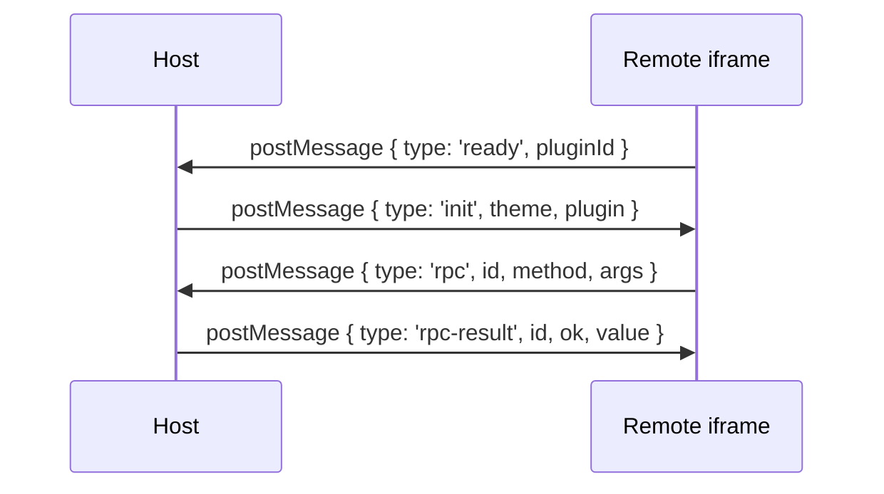
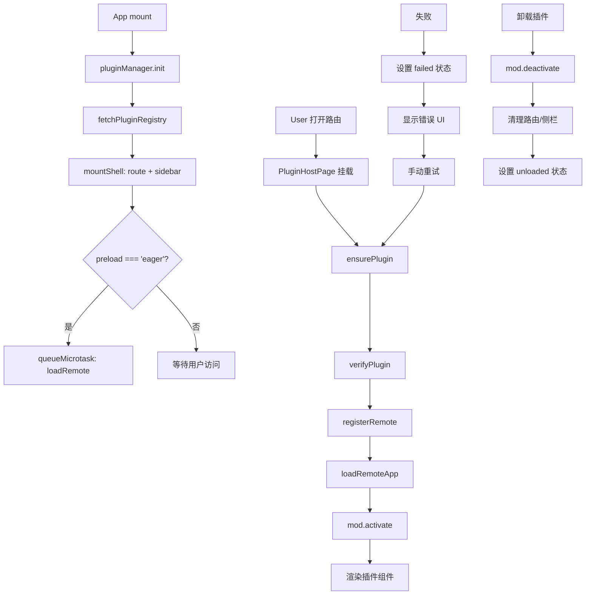

# Module Federation 动态插件实现指南

> **文档角色**：详细的实现过程文档，包含主项目具体实现方式和子项目/插件接入方式，代码含逐行注释。
> **适用读者**：主项目开发者、插件/子项目开发者。

---

## 目录

1. [概述](#1-概述)
2. [主项目实现](#2-主项目实现)
   - 2.1 Vite 配置
   - 2.2 MF 核心运行时 (`mf.ts`)
   - 2.3 插件类型定义 (`types.ts`)
   - 2.4 插件管理器 (`PluginManager.ts`)
   - 2.5 路由注入器 (`RouteInjector.ts`)
   - 2.6 侧栏注入器 (`SidebarInjector.ts`)
   - 2.7 Host Bridge (`createHostBridge.ts`)
   - 2.8 插件验证器 (`PluginVerifier.ts`)
   - 2.9 Registry 管理 (`registry.ts`)
   - 2.10 插件宿主页面 (`PluginHostPage.tsx`)
   - 2.11 路由构建与初始化 (`buildRoutes.ts` / `router/index.tsx`)
3. [子项目/插件接入](#3-子项目插件接入)
   - 3.1 Vite 配置
   - 3.2 组件实现规范
   - 3.3 全局样式处理
   - 3.4 多插件共享 Remote
   - 3.5 不安全插件（untrusted）接入
   - 3.6 CORS 配置
   - 3.7 Registry 配置示例
4. [完整数据流](#4-完整数据流)
5. [常见问题与解决方案](#5-常见问题与解决方案)

---

## 1. 概述

本项目采用 **@module-federation/vite** + **@module-federation/enhanced/runtime** 实现动态插件系统，核心特点：

- **运行时动态注册**：通过 `registerRemotes` 在运行时注册远程模块，无需预配置
- **懒加载策略**：插件默认懒加载，首次进入页面时才执行 `loadRemote`
- **共享 React 单例**：Host 和 Remote 共享同一个 React 实例，避免双 React 问题
- **安全验证**：包含信任等级、origin 白名单、hostApi 版本检查、可选 integrity 校验
- **幂等注入**：路由和侧栏注入支持幂等，避免重复注入导致闪烁
- **失败重试**：失败态稳定，仅手动触发重试，避免自动死循环

---

## 2. 主项目实现

### 2.1 Vite 配置

**文件路径**：`apps/frontend/vite.config.ts`

```typescript
// 引入 Module Federation Vite 插件
import { federation } from '@module-federation/vite';
import tailwindcss from '@tailwindcss/vite';
import react from '@vitejs/plugin-react';
import { defineConfig, loadEnv } from 'vite';
import {
	clearMfViteDepCachePlugin,
	copyPdfjsAssetsPlugin,
	removeDistMinMapsPlugin,
} from './plugins';

// 定义需要排除优化的依赖（避免 React 被预打包写入 virtual:mf）
const MF_SHARED_EXCLUDE = [
	'react',           // React 核心库
	'react/jsx-runtime',      // JSX 运行时
	'react/jsx-dev-runtime',  // 开发环境 JSX 运行时
	'react-dom',              // React DOM
	'react-dom/client',       // React DOM 客户端入口
];

export default defineConfig(({ mode }) => {
	const env = loadEnv(mode, process.cwd(), '');

	return {
		plugins: [
			// 关键：启动时清空 .vite/deps 缓存，避免 mf_owner 漂移导致解析失败
			clearMfViteDepCachePlugin(),
			react(),
			tailwindcss(),
			copyPdfjsAssetsPlugin(),
			removeDistMinMapsPlugin(),
			// Module Federation 核心配置
			federation({
				name: 'host',                    // Host 名称，必须唯一
				filename: 'remoteEntry.js',      // Remote Entry 文件名
				remotes: {},                     // 动态注册，初始为空
				shared: {                        // 共享依赖配置
					react: {                     // React 共享
						singleton: true,              // 单例模式，确保只有一个 React 实例
						requiredVersion: '^19.1.0',   // 要求版本范围
					},
					'react-dom': {               // React DOM 共享
						singleton: true,
						requiredVersion: '^19.1.0',
					},
					'react-router': {            // React Router 共享
						singleton: true,
					},
				},
				// 关键：避免默认 html 注入把任意 ts 打成无 export bootstrap
				hostInitInjectLocation: 'entry',
				dts: false,                     // 关闭类型生成（Ctrl+C 后 IPC 易残留）
				dev: {
					remoteHmr: true,             // 开发环境支持 Remote HMR
				},
			}),
		],
		resolve: {
			alias: {
				'@': '/src',
				'@ui': '/src/components/ui',
				'@design': '/src/components/design',
			},
			dedupe: ['react', 'react-dom', 'react-router'],  // 去重
		},
		optimizeDeps: {
			// 禁止把 shared 依赖打进 .vite/deps（否则会 import virtual:mf 且解析失败）
			exclude: MF_SHARED_EXCLUDE,
			include: [
				// 其他需要预优化的依赖...
			],
		},
		server: {
			port: 9002,
			strictPort: true,
			host: '0.0.0.0',
			cors: true,                        // 允许跨域
			proxy: {
				'/api': { /* ... */ },
				'/remotes': {                  // 代理插件 registry 和 entry
					target: devApiProxyTarget,
					changeOrigin: true,
				},
				// ...
			},
		},
	};
});
```

**关键点说明**：

| 配置项 | 作用 | 为什么重要 |
|--------|------|-----------|
| `shared.singleton: true` | 强制共享单例 | 避免 Host 和 Remote 各加载一份 React |
| `hostInitInjectLocation: 'entry'` | 注入位置改为 entry | 避免默认 html 注入导致 bootstrap 无 export |
| `optimizeDeps.exclude` | 排除 React 相关 | 避免预打包写入 virtual:mf 后重启解析失败 |
| `clearMfViteDepCachePlugin` | 启动清缓存 | 解决 mf_owner 递增后 .vite/deps 失效问题 |

---

### 2.2 MF 核心运行时 (`mf.ts`)

**文件路径**：`apps/frontend/src/plugins/core/mf.ts`

```typescript
// 引入 MF Runtime API
import {
	createInstance,
	getInstance,
	type ModuleFederation,
} from '@module-federation/enhanced/runtime';

// 引入 React 和 ReactDOM，用于 registerShared
import React from 'react';
import ReactDOM from 'react-dom';

// 引入插件类型定义
import type { PluginDescriptor, PluginModule } from './types';

// 进程内 MF 实例单例缓存
let mf: ModuleFederation | null = null;

// shared 是否已注册的标志位
let sharedReady = false;

/**
 * 获取或创建 Host MF 实例
 * - 优先复用 @module-federation/vite 创建的默认实例
 * - 无默认实例时手动创建空 remotes 的 Host 实例
 */
function getMf(): ModuleFederation {
	// 如果已存在实例，直接返回
	if (mf) return mf;
	
	// 尝试获取 @module-federation/vite 创建的默认实例
	try {
		const existing = getInstance();
		if (existing) {
			mf = existing;
			return mf;
		}
	} catch {
		// 没有默认实例时静默忽略
	}
	
	// 创建新的 Host 实例，名称为 'host'，初始 remotes 为空数组
	mf = createInstance({ name: 'host', remotes: [] });
	return mf;
}

/**
 * 向 Runtime 注册共享依赖（React / ReactDOM）
 * - 确保 sharedReady 为 true 后不再重复注册
 * - 使用 singleton 模式保证全局只有一个实例
 */
function ensureShared() {
	// 如果已注册，直接返回
	if (sharedReady) return;
	
	// 获取 MF 实例
	const instance = getMf();
	
	// 注册共享依赖
	instance.registerShared({
		// React 共享配置
		react: {
			version: React.version,                      // 当前 React 版本
			scope: 'default',                            // 作用域
			get: async () => () => React,                // 模块获取函数（双重包装）
			shareConfig: {
				singleton: true,                         // 单例模式
				requiredVersion: `^${React.version}`,    // 版本要求
			},
		},
		// React DOM 共享配置
		'react-dom': {
			version: ReactDOM.version || React.version,
			scope: 'default',
			get: async () => () => ReactDOM,
			shareConfig: {
				singleton: true,
				requiredVersion: `^${ReactDOM.version || React.version}`,
			},
		},
	});
	
	// 标记已注册
	sharedReady = true;
}

/**
 * 从 PluginDescriptor 提取 remoteName
 * - 优先使用 descriptor 中的 remoteName
 * - 若无则使用 id
 */
function remoteNameOf(d: PluginDescriptor) {
	return d.remoteName?.trim() || d.id;
}

/**
 * 从 PluginDescriptor 提取 expose 基础名称
 * - 去掉开头的 './'
 * - 默认值为 'App'
 * - 例如 './IdeasList' → 'IdeasList'
 */
function exposeBaseOf(d: PluginDescriptor) {
	const raw = (d.expose?.trim() || './App').replace(/^\.\//, '');
	return raw || 'App';
}

/**
 * 注册远程模块
 * @param d - 插件描述符
 * - 确保 shared 已注册
 * - 使用 registerRemotes 注册远程模块
 * - force: true 允许覆盖已注册的 remote
 */
export function registerRemote(d: PluginDescriptor) {
	ensureShared();
	getMf().registerRemotes(
		[
			{
				name: remoteNameOf(d),    // remote 名称
				entry: d.entry,           // entry URL（通常为 mf-manifest.json）
				type: 'module',           // 模块类型
			},
		],
		{ force: true },  // 强制覆盖，支持热更新
	);
}

/**
 * 加载远程应用
 * @param d - 插件描述符
 * @returns 加载的插件模块
 * - 确保 shared 已注册
 * - 使用 loadRemote 加载远程模块
 * - 检查 default 导出是否存在
 */
export async function loadRemoteApp(
	d: PluginDescriptor,
): Promise<PluginModule> {
	ensureShared();
	
	// 获取 remoteName 和 expose 名称
	const name = remoteNameOf(d);
	const expose = exposeBaseOf(d);
	
	// 加载远程模块，格式为 `${remoteName}/${expose}`
	const mod = await getMf().loadRemote<PluginModule>(`${name}/${expose}`);
	
	// 检查 default 导出是否存在
	if (!mod?.default) {
		throw new Error(
			`plugin ${d.id}: expose ./${expose} missing default export`,
		);
	}
	
	return mod;
}
```

---

### 2.3 插件类型定义 (`types.ts`)

**文件路径**：`apps/frontend/src/plugins/core/types.ts`

```typescript
import type React from 'react';

/** Host 插件契约 semver 版本号；只有破坏性变更才升级 major */
export const HOST_API_VERSION = '1.0.0';

/** 插件信任等级 */
export type PluginTrust = 'first-party' | 'partner' | 'untrusted';

/** 插件权限声明 */
export type PluginPermission =
	| 'ui:toast'           // 允许使用 Toast
	| 'nav:subtree'        // 允许在子路由内导航
	| 'http:plugin-api'    // 允许使用插件 API
	| 'modules:chat'       // 允许使用聊天模块
	| 'modules:ebook'      // 允许使用电子书模块
	| (string & {});       // 扩展权限

/**
 * 插件描述符 - 定义插件在 registry 中的元数据
 * Host 通过此描述符加载和管理插件
 */
export interface PluginDescriptor {
	/** 插件唯一标识，与 MF remote name / loadRemote(`${id}/App`) 对齐 */
	id: string;
	
	/** 插件标题的 i18n key */
	titleKey?: string;
	
	/** 插件作用说明的 i18n key（插件中心卡片展示） */
	descriptionKey?: string;
	
	/** 明文说明（第三方无 Host i18n 时用） */
	description?: string;
	
	/** 路由 path（顶层注入或业务内路径） */
	routePath: string;
	
	/** MF entry：通常为 .../mf-manifest.json 绝对 URL */
	entry: string;
	
	/** 插件自身 semver 版本 */
	version: string;
	
	/** Host API 兼容范围，如 ^1.0.0 */
	hostApiRange: string;
	
	/** 可选侧栏菜单配置 */
	menu?: { order: number; icon?: string; nameKey?: string };
	
	/**
	 * 是否由 PluginManager 注入顶层路由
	 * false：宿主已在业务路由树挂好 PluginHostPage，只负责 loadRemote
	 */
	injectRoute?: boolean;
	
	/**
	 * MF registerRemotes.name；默认使用 id
	 * 多插件共享同一 Remote 时填写 federation name
	 */
	remoteName?: string;
	
	/**
	 * MF expose 路径；默认 ./App
	 * 例如 ./IdeasList
	 */
	expose?: string;
	
	/** 权限声明（Bridge 按权限裁剪能力） */
	permissions: PluginPermission[];
	
	/**
	 * 加载时机（默认 route = 懒加载）：
	 * - route/idle/省略：仅首次进入插件页时 loadRemote
	 * - eager：init 后微任务后台预拉（不阻塞启动）
	 */
	preload?: 'eager' | 'route' | 'idle';
	
	/** 插件总开关 */
	enabled: boolean;
	
	/** 可选 SRI 完整性校验 */
	integrity?: string;
	
	/** 可选签名钩子 */
	signature?: string;
	
	/** 信任等级；untrusted 当前直接拒绝（预留 iframe 路径） */
	trust: PluginTrust;
	
	/**
	 * trust: untrusted 必填：独立 HTTPS 页，Host 用 iframe 打开
	 * 生产须 https；开发可 localhost http
	 */
	iframeUrl?: string;
}

/** 插件注册表 */
export interface PluginRegistry {
	updatedAt: string;           // 更新时间
	plugins: PluginDescriptor[]; // 插件列表
}

/**
 * HostBridge 属性 - Host 传递给 Remote 的 API 和插件信息
 * Remote 组件接收此属性作为 props
 */
export interface HostBridgeProps {
	/** Host 暴露给插件的 API */
	api: Readonly<{
		/** 国际化翻译函数 */
		t: (key: string, params?: Record<string, unknown>) => string;
		
		/** 当前主题 */
		theme: 'light' | 'dark';
		
		/** 导航函数（受权限限制） */
		navigate?: (to: string) => void;
		
		/** 事件总线 */
		event: {
			on: (event: string, handler: (data?: unknown) => void) => void;
			off: (event: string, handler: (data?: unknown) => void) => void;
			emit: (event: string, data?: unknown) => void;
		};
		
		/** HTTP 请求（受权限限制） */
		http?: {
			get: <T = unknown>(url: string) => Promise<T>;
			post: <T = unknown>(url: string, body?: unknown) => Promise<T>;
		};
		
		/** UI 操作（受权限限制） */
		ui?: {
			showToast: (options: {
				message: string;
				type?: 'success' | 'error' | 'info';
			}) => void;
		};
		
		/** 模块 API（受权限限制） */
		modules?: Readonly<Record<string, (...args: unknown[]) => unknown>>;
	}>;
	
	/** 插件元信息 */
	plugin: Readonly<Pick<PluginDescriptor, 'id' | 'version' | 'routePath'>>;
}

/**
 * 插件模块接口
 * Remote 必须导出 default 组件，可选导出 activate/deactivate 生命周期函数
 */
export interface PluginModule {
	/** 默认导出的 React 组件 */
	default: React.ComponentType<HostBridgeProps>;
	
	/** 激活钩子（可选）- 在模块加载后调用 */
	activate?: (api: HostBridgeProps['api']) => Promise<void> | void;
	
	/** 停用钩子（可选）- 在模块卸载前调用 */
	deactivate?: () => Promise<void> | void;
}

/** 插件状态 */
export type PluginStatus =
	| 'registered'  // 已注册但未加载
	| 'loading'     // 正在加载
	| 'activated'   // 已激活
	| 'failed'      // 加载失败
	| 'unloaded';   // 已卸载

/** 已加载的插件 */
export interface LoadedPlugin {
	meta: PluginDescriptor;    // 插件描述符
	bridge: HostBridgeProps;   // HostBridge 属性
	mod: PluginModule;         // 插件模块
	status: PluginStatus;      // 当前状态
	error?: string;            // 错误信息（失败时）
}

/** 插件侧栏菜单项 */
export interface PluginSidebarItem {
	pluginId: string;          // 插件 ID
	path: string;              // 路由路径
	nameKey: string;           // 名称 i18n key
	icon: string;              // 图标名称
	order: number;             // 排序序号
	requiresAuth?: boolean;    // 是否需要认证
}
```

---

### 2.4 插件管理器 (`PluginManager.ts`)

**文件路径**：`apps/frontend/src/plugins/core/PluginManager.ts`

```typescript
import { type ComponentType, createElement } from 'react';
import type { RouteConfig } from '@/router/routes';
import { eventBus } from '../host-api/EventBus';
import { PluginHostPage } from '../host/PluginHostPage';
import { routeInjector } from '../inject/RouteInjector';
import { sidebarInjector } from '../inject/SidebarInjector';
import { createHostBridge } from './createHostBridge';
import { setEnabledOverride } from './enabledOverrides';
import { loadRemoteApp, registerRemote } from './mf';
import { fetchPluginRegistry } from './registry';
import type { LoadedPlugin, PluginDescriptor } from './types';
import { verifyPlugin } from './PluginVerifier';

/**
 * 创建插件路由配置
 * @param meta - 插件描述符
 * @returns 路由配置对象
 * - 使用 PluginHostPage 作为组件
 * - 传递 pluginId 给宿主页面
 */
function createPluginRoute(meta: PluginDescriptor): RouteConfig {
	const Page: ComponentType = () =>
		createElement(PluginHostPage, { pluginId: meta.id });
	return {
		path: meta.routePath,
		Component: Page,
		meta: {
			titleKey: meta.titleKey ?? meta.menu?.nameKey,
			title: meta.id,
		},
	};
}

/**
 * 插件管理器核心类
 * 负责插件的生命周期管理：注册、加载、激活、停用、卸载
 */
class PluginManagerImpl {
	/** 插件 ID → 已加载插件状态映射 */
	private plugins = new Map<string, LoadedPlugin>();
	
	/** 同一插件并发 load 共用一个 Promise，避免失败重入闪烁 */
	private inflight = new Map<string, Promise<void>>();
	
	/** 默认导航实现：整页跳转；App 会注入 router.navigate */
	private navigateImpl: (to: string) => void = (to) => {
		window.location.assign(to);
	};

	/**
	 * 设置导航实现
	 * @param fn - 导航函数（由 App 注入 React Router navigate）
	 */
	setNavigate(fn: (to: string) => void) {
		this.navigateImpl = fn;
	}

	/**
	 * 获取插件状态
	 * @param id - 插件 ID
	 * @returns 已加载插件或 undefined
	 */
	get(id: string) {
		return this.plugins.get(id);
	}

	/**
	 * 获取所有已加载插件列表
	 * @returns 插件数组
	 */
	list() {
		return [...this.plugins.values()];
	}

	/**
	 * 初始化插件系统
	 * - 只拉 registry + 挂路由/侧栏壳，不下载 MF Remote
	 * - 实际 loadRemote 在首次 ensurePlugin / PluginHostPage 挂载时进行
	 * - preload: 'eager' 的插件在微任务中后台预拉（不阻塞启动）
	 */
	async init() {
		// 拉取插件注册表（强制刷新）
		const registry = await fetchPluginRegistry({ force: true });
		
		// 过滤出启用的插件
		const enabled = registry.plugins.filter((p) => p.enabled);
		
		// 为每个启用的插件挂载壳（路由 + 侧栏）
		for (const meta of enabled) {
			this.mountShell(meta);
		}
		
		// 处理 eager 预加载的插件
		const eager = enabled.filter((p) => p.preload === 'eager');
		if (eager.length === 0) return;
		
		// 在微任务中后台预拉，不阻塞主应用启动
		queueMicrotask(() => {
			void Promise.all(eager.map((p) => this.loadPlugin(p)));
		});
	}

	/**
	 * 挂载插件壳（路由 + 侧栏菜单）
	 * @param meta - 插件描述符
	 */
	private mountShell(meta: PluginDescriptor) {
		// 注入顶层路由（除非 injectRoute 显式设置为 false）
		if (meta.injectRoute !== false) {
			routeInjector.inject(meta.id, [createPluginRoute(meta)]);
		}
		
		// 如果有菜单配置，添加到侧栏
		if (meta.menu) {
			sidebarInjector.add({
				pluginId: meta.id,
				path: meta.routePath,
				nameKey: meta.menu.nameKey ?? meta.titleKey ?? meta.id,
				icon: meta.menu.icon ?? 'Puzzle',
				order: meta.menu.order,
			});
		}
	}

	/**
	 * 确保插件可用（按需加载）
	 * @param id - 插件 ID
	 * @param opts - 选项（force: 强制重新加载）
	 * @returns 已激活的插件
	 * - 已激活：直接返回
	 * - 已失败且未强制：抛出错误
	 * - 正在加载：等待加载完成
	 * - 未加载：从 registry 获取元数据并加载
	 */
	async ensurePlugin(id: string, opts?: { force?: boolean }) {
		// 获取当前插件状态
		const cur = this.plugins.get(id);
		
		// 已激活：直接返回
		if (cur?.status === 'activated') return cur;
		
		// 已失败且未强制：抛出错误
		if (cur?.status === 'failed' && !opts?.force) {
			throw new Error(cur.error || `加载 ${id} 失败`);
		}

		// 正在加载：等待加载完成
		const pending = this.inflight.get(id);
		if (pending && !opts?.force) {
			await pending;
			const after = this.plugins.get(id);
			if (after?.status === 'activated') return after;
			throw new Error(after?.error || `加载 ${id} 失败`);
		}

		// 从 registry 获取插件元数据
		const registry = await fetchPluginRegistry({ force: true });
		const meta = registry.plugins.find((p) => p.id === id && p.enabled);
		
		// 未找到启用的插件：抛出错误
		if (!meta) {
			throw new Error(`registry 中无启用插件 ${id}`);
		}
		
		// 挂载壳并加载插件
		this.mountShell(meta);
		await this.loadPlugin(meta, opts);
		
		// 检查加载结果
		const next = this.plugins.get(id);
		if (next?.status !== 'activated') {
			throw new Error(next?.error || `加载 ${id} 失败`);
		}
		
		return next;
	}

	/**
	 * 加载插件
	 * @param meta - 插件描述符
	 * @param opts - 选项（force: 强制重新加载）
	 * - 版本未变且已激活：直接返回
	 * - 已激活但版本变了：先卸载再重新加载
	 * - 正在加载：等待或强制取消后重新加载
	 */
	async loadPlugin(meta: PluginDescriptor, opts?: { force?: boolean }) {
		// 获取当前插件状态
		const prev = this.plugins.get(meta.id);
		
		// 版本未变且已激活：直接返回（幂等）
		if (
			prev?.status === 'activated' &&
			prev.meta.version === meta.version &&
			!opts?.force
		) {
			return;
		}
		
		// 已激活但版本变了：先卸载再重新挂载壳
		if (prev?.status === 'activated') {
			await this.unloadPlugin(meta.id);
			this.mountShell(meta);
		}

		// 检查是否正在加载
		const existing = this.inflight.get(meta.id);
		if (existing) {
			if (!opts?.force) return existing;
			// 强制：等待现有加载完成（忽略错误）
			await existing.catch(() => {});
		}

		// 创建加载 Promise
		const run = this.runLoad(meta);
		this.inflight.set(meta.id, run);
		
		try {
			await run;
		} finally {
			// 清理 inflight（只清理自己创建的 Promise）
			if (this.inflight.get(meta.id) === run) {
				this.inflight.delete(meta.id);
			}
		}
	}

	/**
	 * 执行实际加载逻辑
	 * @param meta - 插件描述符
	 * - 创建加载状态
	 * - 验证插件
	 * - 注册 remote
	 * - 加载远程模块
	 * - 调用 activate 钩子
	 * - 更新状态
	 */
	private async runLoad(meta: PluginDescriptor) {
		// 创建导航函数
		const nav = (to: string) => this.navigateImpl(to);
		
		// 创建加载状态
		const loading: LoadedPlugin = {
			meta,
			bridge: createHostBridge(meta, nav),
			mod: { default: () => null },
			status: 'loading',
		};
		
		// 更新插件状态为 loading
		this.plugins.set(meta.id, loading);

		try {
			// 验证插件（信任等级、origin、hostApi、integrity 等）
			await verifyPlugin(meta);

			// untrusted：仅激活壳，由 PluginHostPage 渲染 iframe，不进 MF
			if (meta.trust === 'untrusted') {
				this.plugins.set(meta.id, {
					meta,
					bridge: createHostBridge(meta, nav),
					mod: { default: () => null },
					status: 'activated',
				});
				return;
			}

			// 注册 remote
			registerRemote(meta);
			
			// 加载远程模块
			const mod = await loadRemoteApp(meta);
			
			// 创建 HostBridge
			const bridge = createHostBridge(meta, nav);
			
			// 调用 activate 钩子（如果存在）
			await mod.activate?.(bridge.api);

			// 更新状态为 activated
			this.plugins.set(meta.id, {
				meta,
				bridge,
				mod,
				status: 'activated',
			});
		} catch (e) {
			// 捕获错误，更新状态为 failed
			const message = e instanceof Error ? e.message : String(e);
			console.error(`[PluginManager] load ${meta.id} failed`, e);
			this.plugins.set(meta.id, {
				...loading,
				status: 'failed',
				error: message,
			});
		}
	}

	/**
	 * 卸载插件
	 * @param id - 插件 ID
	 * - 调用 deactivate 钩子
	 * - 清理事件总线
	 * - 移除路由和侧栏
	 * - 更新状态为 unloaded
	 */
	async unloadPlugin(id: string) {
		const loaded = this.plugins.get(id);
		
		// 未加载：直接清理路由和侧栏
		if (!loaded) {
			routeInjector.remove(id);
			sidebarInjector.remove(id);
			return;
		}
		
		try {
			// 调用 deactivate 钩子（如果存在）
			await loaded.mod.deactivate?.();
		} catch (e) {
			console.error(`[PluginManager] deactivate ${id}`, e);
		}
		
		// 清理事件总线
		eventBus.clearPlugin(id);
		
		// 移除路由和侧栏
		routeInjector.remove(id);
		sidebarInjector.remove(id);
		
		// 更新状态为 unloaded
		this.plugins.set(id, {
			...loaded,
			status: 'unloaded',
		});
	}

	/**
	 * 上架/下架插件
	 * @param id - 插件 ID
	 * @param enabled - 是否启用
	 * - 写入本地覆盖
	 * - 即时挂壳或卸载
	 * - 下架后 init/ensure 不再加载
	 */
	async setEnabled(id: string, enabled: boolean) {
		// 设置启用覆盖
		setEnabledOverride(id, enabled);
		
		// 下架：卸载插件
		if (!enabled) {
			await this.unloadPlugin(id);
			return;
		}
		
		// 上架：从 registry 获取元数据并挂载壳
		const registry = await fetchPluginRegistry({ force: true });
		const meta = registry.plugins.find((p) => p.id === id && p.enabled);
		if (!meta) return;
		this.mountShell(meta);
	}
}

/** 插件管理器单例实例 */
export const pluginManager = new PluginManagerImpl();
```

---

### 2.5 路由注入器 (`RouteInjector.ts`)

**文件路径**：`apps/frontend/src/plugins/inject/RouteInjector.ts`

```typescript
import type { RouteConfig } from '@/router/routes';

/** 监听函数类型 */
type Listener = () => void;

/**
 * 路由注入器
 * 管理插件路由的注入和移除，支持订阅变更通知
 * 相同 path 集合不触发 notify，避免重建 router 导致闪烁
 */
class RouteInjectorImpl {
	/** 插件 ID → 路由配置数组映射 */
	private byPlugin = new Map<string, RouteConfig[]>();
	
	/** 变更监听器集合 */
	private listeners = new Set<Listener>();

	/**
	 * 注入插件路由
	 * @param pluginId - 插件 ID
	 * @param routes - 路由配置数组
	 * - 相同 path 集合不 notify，避免闪烁
	 */
	inject(pluginId: string, routes: RouteConfig[]) {
		// 获取之前的路由配置
		const prev = this.byPlugin.get(pluginId);
		
		// 相同 path 集合：不触发通知（幂等）
		if (
			prev &&
			prev.length === routes.length &&
			prev.every((r, i) => r.path === routes[i]?.path)
		) {
			return;
		}
		
		// 更新路由配置
		this.byPlugin.set(pluginId, routes);
		
		// 通知所有监听器
		this.notify();
	}

	/**
	 * 移除插件路由
	 * @param pluginId - 插件 ID
	 * - 只有实际删除了才触发通知
	 */
	remove(pluginId: string) {
		if (!this.byPlugin.delete(pluginId)) return;
		this.notify();
	}

	/**
	 * 获取所有已注入的动态路由
	 * @returns 路由配置数组
	 */
	getRoutes(): RouteConfig[] {
		return [...this.byPlugin.values()].flat();
	}

	/**
	 * 订阅路由变更
	 * @param fn - 监听函数
	 * @returns 取消订阅函数
	 */
	subscribe(fn: Listener) {
		this.listeners.add(fn);
		return () => {
			this.listeners.delete(fn);
		};
	}

	/**
	 * 通知所有监听器路由已变更
	 */
	private notify() {
		for (const fn of this.listeners) fn();
	}
}

/** 路由注入器单例实例 */
export const routeInjector = new RouteInjectorImpl();
```

---

### 2.6 侧栏注入器 (`SidebarInjector.ts`)

**文件路径**：`apps/frontend/src/plugins/inject/SidebarInjector.ts`

```typescript
import type { PluginSidebarItem } from '../core/types';

/** 监听函数类型 */
type Listener = () => void;

/**
 * 侧栏注入器
 * 管理插件侧栏菜单的添加和移除，支持订阅变更通知
 * 字段全相同则跳过，避免不必要的重渲染
 */
class SidebarInjectorImpl {
	/** 侧栏菜单项数组 */
	private _items: PluginSidebarItem[] = [];
	
	/** 变更监听器集合 */
	private listeners = new Set<Listener>();

	/** 获取侧栏菜单项（只读） */
	get items() {
		return this._items;
	}

	/**
	 * 添加/更新侧栏菜单项
	 * @param item - 侧栏菜单项
	 * - 字段全相同则跳过（幂等）
	 * - 按 order 排序
	 */
	add(item: PluginSidebarItem) {
		// 查找之前的配置
		const prev = this._items.find((x) => x.pluginId === item.pluginId);
		
		// 字段全相同：跳过（幂等）
		if (
			prev &&
			prev.path === item.path &&
			prev.nameKey === item.nameKey &&
			prev.icon === item.icon &&
			prev.order === item.order
		) {
			return;
		}
		
		// 更新配置：移除旧项，添加新项，按 order 排序
		this._items = [
			...this._items.filter((x) => x.pluginId !== item.pluginId),
			item,
		].sort((a, b) => a.order - b.order);
		
		// 通知所有监听器
		this.notify();
	}

	/**
	 * 移除侧栏菜单项
	 * @param pluginId - 插件 ID
	 * - 只有实际删除了才触发通知
	 */
	remove(pluginId: string) {
		const next = this._items.filter((x) => x.pluginId !== pluginId);
		if (next.length === this._items.length) return;
		this._items = next;
		this.notify();
	}

	/**
	 * 订阅侧栏变更
	 * @param fn - 监听函数
	 * @returns 取消订阅函数
	 */
	subscribe(fn: Listener) {
		this.listeners.add(fn);
		return () => {
			this.listeners.delete(fn);
		};
	}

	/**
	 * 通知所有监听器侧栏已变更
	 */
	private notify() {
		for (const fn of this.listeners) fn();
	}
}

/** 侧栏注入器单例实例 */
export const sidebarInjector = new SidebarInjectorImpl();
```

---

### 2.7 Host Bridge (`createHostBridge.ts`)

**文件路径**：`apps/frontend/src/plugins/core/createHostBridge.ts`

```typescript
import { Toast } from '@ui/sonner';
import { http } from '@/utils/fetch';
import { deepFreeze } from '../host-api/deepFreeze';
import { createEbookModulesApi } from '../host-api/ebookHostApi';
import { eventBus } from '../host-api/EventBus';
import type { HostBridgeProps, PluginDescriptor } from './types';

/**
 * 读取当前主题
 * - 优先从 html data-theme 属性读取
 * - 其次检查 html.dark class
 * - 最后检查 body.dark / body.theme-black
 * - 默认返回 light
 */
function readTheme(): 'light' | 'dark' {
	try {
		const t = document.documentElement.getAttribute('data-theme');
		if (t === 'dark' || t === 'light') return t;
		if (document.documentElement.classList.contains('dark')) return 'dark';
		// Host 黑色主题挂在 body.theme-black（不是 html.dark）
		if (
			document.body.classList.contains('dark') ||
			document.body.classList.contains('theme-black')
		) {
			return 'dark';
		}
	} catch {
		// 忽略错误
	}
	return 'light';
}

/**
 * 创建 HostBridge（按权限组装 API 并密封）
 * @param d - 插件描述符
 * @param navigate - 导航函数
 * @returns HostBridgeProps
 * - 根据插件权限声明组装 API
 * - 未授权的能力不存在（undefined）
 * - 返回的对象被深度冻结，不可修改
 */
export function createHostBridge(
	d: PluginDescriptor,
	navigate: (to: string) => void,
): HostBridgeProps {
	// 创建权限集合
	const allow = new Set(d.permissions);
	
	// API 对象（逐步构建）
	const api: Record<string, unknown> = {
		// 国际化翻译函数（默认返回 key 本身）
		t: (key: string) => key,
		
		// 当前主题
		theme: readTheme(),
		
		// 事件总线（始终可用）
		event: {
			on: (event: string, handler: (data?: unknown) => void) =>
				eventBus.on(d.id, event, handler),
			off: (event: string, handler: (data?: unknown) => void) =>
				eventBus.off(d.id, event, handler),
			emit: (event: string, data?: unknown) => eventBus.emit(d.id, event, data),
		},
	};

	// 如果有 ui:toast 权限，添加 UI API
	if (allow.has('ui:toast')) {
		api.ui = Object.freeze({
			showToast: (options: {
				message: string;
				type?: 'success' | 'error' | 'info';
			}) => {
				Toast({
					type: options.type ?? 'info',
					title: options.message,
				});
			},
		});
	}

	// 如果有 nav:subtree 权限，添加导航 API（限制在子路由内）
	if (allow.has('nav:subtree')) {
		api.navigate = (to: string) => {
			// 限制导航范围：只能在插件自身的 routePath 下导航
			if (!to.startsWith(d.routePath)) {
				throw new Error(`NAV_OUT_OF_SCOPE: ${to}`);
			}
			navigate(to);
		};
	}

	// 如果有 http:plugin-api 权限，添加 HTTP API
	if (allow.has('http:plugin-api')) {
		api.http = Object.freeze({
			get: <T = unknown>(url: string) => http.get<T>(url),
			post: <T = unknown>(url: string, body?: unknown) =>
				http.post<T>(url, body),
		});
	}

	// 模块 API（根据权限组装）
	const modules: Record<string, unknown> = {};
	
	// 如果有 modules:chat 权限，添加聊天模块
	if (allow.has('modules:chat')) {
		modules.openThread = (id: unknown) => {
			if (typeof id !== 'string') throw new Error('INVALID_THREAD_ID');
			navigate(`/chat/c/${id}`);
		};
	}
	
	// 如果有 modules:ebook 权限，添加电子书模块
	if (allow.has('modules:ebook')) {
		modules.ebook = createEbookModulesApi();
	}
	
	// 如果有模块，添加到 API
	if (Object.keys(modules).length > 0) {
		api.modules = Object.freeze(modules);
	}

	// 深度冻结并返回（防止插件修改 API）
	return deepFreeze({
		api,
		plugin: {
			id: d.id,
			version: d.version,
			routePath: d.routePath,
		},
	}) as HostBridgeProps;
}
```

---

### 2.8 插件验证器 (`PluginVerifier.ts`)

**文件路径**：`apps/frontend/src/plugins/core/PluginVerifier.ts`

```typescript
import { HOST_API_VERSION, type PluginDescriptor } from './types';

/**
 * 解析 SemVer 版本号
 * @param v - 版本字符串
 * @returns [major, minor, patch] 数组或 null
 * - 支持 v 前缀（如 v1.0.0）
 * - 只匹配主版本.次版本.补丁版本
 */
function parseSemver(v: string): [number, number, number] | null {
	const m = v
		.trim()
		.replace(/^v/, '')
		.match(/^(\d+)\.(\d+)\.(\d+)/);
	if (!m) return null;
	return [Number(m[1]), Number(m[2]), Number(m[3])];
}

/**
 * 检查版本是否满足范围要求
 * @param version - 当前版本
 * @param range - 版本范围（支持 ^x.y.z / >=x.y.z / 精确版本）
 * @returns 是否满足
 */
export function satisfiesRange(version: string, range: string): boolean {
	const ver = parseSemver(version);
	if (!ver) return false;
	
	const r = range.trim();
	
	// 处理 ^x.y.z 范围
	if (r.startsWith('^')) {
		const base = parseSemver(r.slice(1));
		if (!base) return false;
		
		// major 必须相同
		if (ver[0] !== base[0]) return false;
		
		// 0.x.x：minor 必须相同，patch >= base
		if (ver[0] === 0) {
			return ver[1] === base[1] && ver[2] >= base[2];
		}
		
		// x.x.x (x > 0)：minor > base 或 minor == base && patch >= base
		return ver[1] > base[1] || (ver[1] === base[1] && ver[2] >= base[2]);
	}
	
	// 处理 >=x.y.z 范围
	if (r.startsWith('>=')) {
		const base = parseSemver(r.slice(2));
		if (!base) return false;
		
		return (
			ver[0] > base[0] ||
			(ver[0] === base[0] && ver[1] > base[1]) ||
			(ver[0] === base[0] && ver[1] === base[1] && ver[2] >= base[2])
		);
	}
	
	// 精确版本匹配
	const exact = parseSemver(r);
	return (
		!!exact && exact[0] === ver[0] && exact[1] === ver[1] && exact[2] === ver[2]
	);
}

/**
 * 检查 entry URL 是否允许
 * @param entry - entry URL
 * @param opts - 选项（prod: 是否生产环境）
 * @returns 是否允许
 * - 生产环境：只允许 https
 * - 开发环境：允许 https 或 localhost/127.0.0.1 的 http
 */
export function entryUrlAllowed(
	entry: string,
	opts?: { prod?: boolean },
): boolean {
	let url: URL;
	try {
		url = new URL(entry);
	} catch {
		return false;
	}
	
	// https 始终允许
	if (url.protocol === 'https:') return true;
	
	// 判断是否生产环境
	const prod = opts?.prod ?? import.meta.env.PROD;
	
	// 生产环境：只允许 https
	if (prod) return false;
	
	// 开发环境：允许 localhost/127.0.0.1 的 http
	return (
		url.protocol === 'http:' &&
		(url.hostname === 'localhost' || url.hostname === '127.0.0.1')
	);
}

/**
 * 是否跳过 integrity 校验
 * @returns 是否跳过
 * - 默认跳过（VITE_PLUGIN_SKIP_INTEGRITY !== 'false' 即跳过）
 */
function skipIntegrity(): boolean {
	return import.meta.env.VITE_PLUGIN_SKIP_INTEGRITY !== 'false';
}

/**
 * 计算 SHA-384 哈希并转为 base64
 * @param buf - ArrayBuffer
 * @returns sha384-xxx 格式的字符串
 */
async function sha384Base64(buf: ArrayBuffer): Promise<string> {
	const digest = await crypto.subtle.digest('SHA-384', buf);
	const bytes = new Uint8Array(digest);
	let bin = '';
	for (const b of bytes) bin += String.fromCharCode(b);
	return `sha384-${btoa(bin)}`;
}

/**
 * 插件验证错误类
 */
export class PluginVerifyError extends Error {
	constructor(
		message: string,
		readonly code:
			| 'TRUST'
			| 'ORIGIN'
			| 'HOST_API'
			| 'INTEGRITY'
			| 'SIGNATURE'
			| 'IFRAME',
	) {
		super(message);
		this.name = 'PluginVerifyError';
	}
}

/**
 * 验证插件（加载前校验）
 * @param d - 插件描述符
 * @throws PluginVerifyError - 验证失败时抛出
 * - 信任等级验证
 * - entry URL 验证
 * - hostApi 版本验证
 * - integrity 校验（可选）
 * - signature 校验（预留）
 */
export async function verifyPlugin(d: PluginDescriptor): Promise<void> {
	// 不可信插件：只校验 iframeUrl，禁止 loadRemote 进主文档
	if (d.trust === 'untrusted') {
		const src = d.iframeUrl?.trim();
		
		// 必须提供 iframeUrl
		if (!src) {
			throw new PluginVerifyError(
				`plugin ${d.id}: untrusted requires iframeUrl`,
				'IFRAME',
			);
		}
		
		// 验证 iframeUrl 是否合法
		if (!entryUrlAllowed(src)) {
			throw new PluginVerifyError(
				`plugin ${d.id}: iframeUrl must be https (or localhost http in dev)`,
				'ORIGIN',
			);
		}
		
		return;
	}

	// 验证 entry URL 是否合法
	if (!entryUrlAllowed(d.entry)) {
		throw new PluginVerifyError(
			`plugin ${d.id}: entry must be https (or localhost http in dev)`,
			'ORIGIN',
		);
	}

	// 验证 hostApi 版本是否兼容
	if (!satisfiesRange(HOST_API_VERSION, d.hostApiRange)) {
		throw new PluginVerifyError(
			`plugin ${d.id}: hostApi ${HOST_API_VERSION} not in ${d.hostApiRange}`,
			'HOST_API',
		);
	}

	// 验证 integrity（如果提供了且未跳过）
	if (d.integrity && !skipIntegrity()) {
		const res = await fetch(d.entry, { cache: 'no-store' });
		
		if (!res.ok) {
			throw new PluginVerifyError(
				`plugin ${d.id}: fetch entry failed ${res.status}`,
				'INTEGRITY',
			);
		}
		
		// 计算 SHA-384 哈希并对比
		const hash = await sha384Base64(await res.arrayBuffer());
		if (hash !== d.integrity) {
			throw new PluginVerifyError(
				`plugin ${d.id}: integrity mismatch`,
				'INTEGRITY',
			);
		}
	}

	// signature 校验（预留钩子）
	// 实际验签由发布流水线完成，此处只检查标记
	if (d.signature === 'invalid') {
		throw new PluginVerifyError(`plugin ${d.id}: bad signature`, 'SIGNATURE');
	}
}
```

---

### 2.9 Registry 管理 (`registry.ts`)

**文件路径**：`apps/frontend/src/plugins/core/registry.ts`

```typescript
import { getPlatformFetch } from '@/utils/fetch';
import { resolveUploadedFileUrl } from '@/utils/upload-file-url';
import { applyEnabledOverrides } from './enabledOverrides';
import type { PluginRegistry } from './types';

/** 缓存键（区分生产和开发环境） */
const CACHE_KEY = `dnhyxc.plugin.registry.${import.meta.env.PROD ? 'prod' : 'dev'}.v1`;

/** 导出缓存键（供外部使用） */
export const PLUGIN_REGISTRY_CACHE_KEY = CACHE_KEY;

/** Registry 文件名 */
export const PLUGIN_REGISTRY_FILENAME = 'plugins-registry.json';

/** 落盘相对路径；展示/拉取用 resolveUploadedFileUrl（与图片一致） */
export const PLUGIN_REGISTRY_STATIC_PATH = `/remotes/${PLUGIN_REGISTRY_FILENAME}`;

/**
 * 获取 Registry URL
 * - 优先使用环境变量覆盖
 * - 否则使用 resolveUploadedFileUrl 解析
 * - 对齐 Web/Tauri 开发/生产环境路径
 */
function registryUrl(): string {
	// 优先使用环境变量覆盖
	const override = (
		import.meta.env.PROD
			? import.meta.env.VITE_PROD_PLUGIN_REGISTRY_URL
			: import.meta.env.VITE_DEV_PLUGIN_REGISTRY_URL
	)?.trim();
	if (override) return override;
	
	// 使用默认路径解析
	return resolveUploadedFileUrl(PLUGIN_REGISTRY_STATIC_PATH);
}

/**
 * 读取本地缓存
 * @returns 缓存的 Registry 或 null
 * - 从 localStorage 读取
 * - 验证格式是否正确
 */
function readCache(): PluginRegistry | null {
	try {
		const cached = localStorage.getItem(CACHE_KEY);
		if (!cached) return null;
		
		const data = JSON.parse(cached) as PluginRegistry;
		
		// 验证格式
		if (!Array.isArray(data.plugins) || data.plugins.length === 0) return null;
		
		return data;
	} catch {
		return null;
	}
}

/**
 * 应用启用覆盖（本地上架/下架）
 * @param data - 原始 Registry
 * @returns 应用覆盖后的 Registry
 */
function withOverrides(data: PluginRegistry): PluginRegistry {
	return applyEnabledOverrides(data);
}

/**
 * 获取适合当前平台的 fetch 函数
 * @param url - 请求 URL
 * @param force - 是否强制刷新
 * @returns 响应文本
 * - https URL：使用平台特定的 fetch
 * - 其他：使用全局 fetch
 */
async function fetchRegistryText(url: string, force?: boolean): Promise<string> {
	const doFetch = /^https?:\/\//i.test(url)
		? await getPlatformFetch()
		: globalThis.fetch.bind(globalThis);
	
	const res = await doFetch(url, {
		cache: 'no-store',
		...(force ? { headers: { 'Cache-Control': 'no-cache' } } : {}),
	});
	
	if (!res.ok) throw new Error(`registry ${res.status}`);
	
	return res.text();
}

/**
 * 拉取插件 Registry
 * @param opts - 选项（force: 强制刷新）
 * @returns Registry 对象
 * - 优先从网络拉取
 * - 网络失败时使用本地缓存
 * - 缓存也没有时返回空列表
 */
export async function fetchPluginRegistry(opts?: {
	force?: boolean;
}): Promise<PluginRegistry> {
	let url: string;
	
	try {
		url = registryUrl();
	} catch (e) {
		// URL 解析失败：使用缓存
		console.warn('[plugins] registry url missing', e);
		const fallback = readCache();
		return withOverrides(
			fallback ?? { updatedAt: new Date(0).toISOString(), plugins: [] },
		);
	}

	try {
		// 从网络拉取
		const text = await fetchRegistryText(url, opts?.force);
		
		let data: PluginRegistry;
		
		try {
			data = JSON.parse(text) as PluginRegistry;
		} catch {
			throw new Error(
				`registry not JSON (${url}): ${text.slice(0, 80).replace(/\s+/g, ' ')}`,
			);
		}
		
		// 验证格式
		if (!Array.isArray(data.plugins)) {
			throw new Error('registry.plugins missing');
		}
		
		try {
			// 缓存远端原文（覆盖在返回前合并，不写回污染源）
			localStorage.setItem(CACHE_KEY, JSON.stringify(data));
		} catch {
			// 忽略缓存失败
		}
		
		// 应用覆盖并返回
		return withOverrides(data);
	} catch (e) {
		// 网络拉取失败：使用缓存
		console.warn('[plugins] registry fetch failed, using cache', e);
		const fallback = readCache();
		return withOverrides(
			fallback ?? { updatedAt: new Date(0).toISOString(), plugins: [] },
		);
	}
}

/**
 * 拉取远端原文（不合并本地上架覆盖；用于配置编辑页）
 * @returns Registry JSON 文本
 */
export async function fetchPluginRegistryRawText(): Promise<string> {
	const url = registryUrl();
	const text = await fetchRegistryText(url);
	
	try {
		// 格式化输出
		return `${JSON.stringify(JSON.parse(text), null, 2)}\n`;
	} catch {
		return text;
	}
}

/**
 * 清除插件 Registry 缓存
 */
export function clearPluginRegistryCache() {
	try {
		localStorage.removeItem(CACHE_KEY);
	} catch {
		// 忽略错误
	}
}
```

---

### 2.10 插件宿主页面 (`PluginHostPage.tsx`)

**文件路径**：`apps/frontend/src/plugins/host/PluginHostPage.tsx`

```typescript
import { useState, useEffect } from 'react';
import { pluginManager } from '../core/PluginManager';
import { PluginErrorBoundary } from './PluginErrorBoundary';

interface Props {
	pluginId: string;
}

/**
 * 插件宿主页面
 * - 渲染 Remote default 组件或错误/重试 UI
 * - 失败态稳定，禁止自动重试（避免闪烁）
 * - 支持手动重试
 */
export function PluginHostPage({ pluginId }: Props) {
	// 手动重试计数；>0 时 force ensure
	const [retryKey, setRetryKey] = useState(0);
	
	// 初始 busy：若已在 loading
	const [busy, setBusy] = useState(
		() => pluginManager.get(pluginId)?.status === 'loading',
	);
	
	// 初始错误：若已 failed
	const [error, setError] = useState<string | null>(() => {
		const cur = pluginManager.get(pluginId);
		return cur?.status === 'failed' ? (cur.error ?? null) : null;
	});
	
	// 强制重渲染钩子
	const [, bump] = useState(0);

	useEffect(() => {
		// 取消标志
		let cancelled = false;
		
		(async () => {
			// 获取当前插件状态
			const cur = pluginManager.get(pluginId);
			
			// 已激活：触发重渲染
			if (cur?.status === 'activated') {
				bump((n) => n + 1);
				return;
			}
			
			// 已失败且非手动重试：稳住错误态，禁止自动再拉（避免闪烁）
			if (cur?.status === 'failed' && retryKey === 0) {
				setError(cur.error ?? null);
				setBusy(false);
				return;
			}

			// 开始加载
			setBusy(true);
			setError(null);
			
			try {
				// 确保插件可用（force: 手动重试时强制重新加载）
				await pluginManager.ensurePlugin(pluginId, {
					force: retryKey > 0,
				});
			} catch (e) {
				// 加载失败：设置错误信息
				if (!cancelled) {
					setError(e instanceof Error ? e.message : String(e));
				}
			} finally {
				// 加载完成：更新状态并触发重渲染
				if (!cancelled) {
					setBusy(false);
					bump((n) => n + 1);
				}
			}
		})();
		
		// 清理：标记取消
		return () => {
			cancelled = true;
		};
	}, [pluginId, retryKey]);

	// 获取加载后的插件状态
	const loaded = pluginManager.get(pluginId);
	
	// 已激活：渲染插件组件
	if (loaded?.status === 'activated') {
		const Comp = loaded.mod.default;
		return (
			<PluginErrorBoundary pluginId={pluginId}>
				<div className={`plugin-${pluginId} h-full w-full`}>
					<Comp {...loaded.bridge} />
				</div>
			</PluginErrorBoundary>
		);
	}

	// 构建错误/加载信息
	const detail =
		error ||
		loaded?.error ||
		(busy || loaded?.status === 'loading'
			? '加载中…'
			: '未加载（请确认 Remote 已启动后重试）');

	// 渲染错误/重试 UI
	return (
		<div className="flex flex-col gap-3 p-6 text-sm text-muted-foreground">
			<p>
				插件「{pluginId}」不可用
				{detail ? `：${detail}` : ''}
			</p>
			<button
				type="button"
				className="w-fit rounded-md border border-border px-3 py-1.5 text-foreground hover:bg-muted"
				disabled={busy || loaded?.status === 'loading'}
				onClick={() => setRetryKey((n) => n + 1)}
			>
				{busy || loaded?.status === 'loading' ? '加载中…' : '重新加载'}
			</button>
		</div>
	);
}
```

---

### 2.11 路由构建与初始化

**文件路径**：`apps/frontend/src/router/buildRoutes.ts`

```typescript
import { routeInjector } from "@/plugins";
import routes, { type RouteConfig } from "./routes";

/**
 * 构建完整路由表
 * - 静态壳路由 + PluginManager 注入的动态插件路由
 * - 无动态项时直接返回静态表（避免无谓复制）
 * @returns 路由配置数组
 */
export function buildRoutes(): RouteConfig[] {
	// 获取当前已注入的动态路由
	const dynamic = routeInjector.getRoutes();
	
	// 无动态项时直接返回静态表
	if (dynamic.length === 0) return routes;

	// 将动态路由挂到 Layout 壳的 children 末尾
	return routes.map((route, index) => {
		// Layout 壳：首条带 children 的路由
		if (index === 0 && route.children) {
			return {
				...route,
				children: [...route.children, ...dynamic],
			};
		}
		return route;
	});
}
```

**文件路径**：`apps/frontend/src/router/index.tsx`

```typescript
import { useState, useEffect, useMemo } from 'react';
import { createBrowserRouter, RouterProvider, type RouteObject } from 'react-router-dom';
import { pluginManager, routeInjector } from '@/plugins';
import { buildRoutes } from './buildRoutes';
// ... 其他导入

const App = () => {
	useInputsOnlyTab();
	
	// 路由世代：注入变化或 init 完成时 +1，触发重建 router
	const [routeEpoch, setRouteEpoch] = useState(0);

	useEffect(() => {
		// 订阅路由注入变化：变化时递增 epoch，触发 router 重建
		const unsub = routeInjector.subscribe(() => {
			setRouteEpoch((n) => n + 1);
		});
		
		// 启动插件系统
		void pluginManager
			.init()
			.then(() => setRouteEpoch((n) => n + 1))  // init 完成后重建 router
			.catch((e) => console.error('[plugins] init failed', e));
		
		// 清理：取消订阅
		return unsub;
	}, []);

	// 根据 epoch 创建 router（useMemo 避免不必要的重建）
	const router = useMemo(() => {
		const r = createBrowserRouter(buildRoutes() as RouteObject[]);
		
		// 把 SPA navigate 注入 Manager，供 Bridge 使用
		pluginManager.setNavigate((to) => {
			void r.navigate(to);
		});
		
		return r;
	}, [routeEpoch]);

	// ... 其他 useEffect

	return (
		<div className="h-full w-full bg-theme-background">
			<Toaster />
			<RouterProvider router={router} />
		</div>
	);
};
```

---

## 3. 子项目/插件接入

### 3.1 Vite 配置

**文件路径**：`apps/remote-demo/vite.config.ts`（单 expose 示例）

```typescript
import fs from 'node:fs';
import path from 'node:path';
import { federation } from '@module-federation/vite';
import react from '@vitejs/plugin-react';
import { defineConfig, loadEnv, type Plugin } from 'vite';

/**
 * MF mf_owner id 递增后 .vite/deps 会失效，serve 时清缓存
 * 与 Host 端的 clearMfViteDepCachePlugin 功能相同
 */
function clearMfViteDepCache(): Plugin {
	return {
		name: 'clear-mf-vite-dep-cache',
		enforce: 'pre',
		config(config, { command }) {
			if (command !== 'serve') return;
			const root = config.root ? path.resolve(config.root) : process.cwd();
			fs.rmSync(path.join(root, 'node_modules/.vite'), {
				recursive: true,
				force: true,
			});
		},
	};
}

// 开发环境配置
const host = '127.0.0.1';
const port = 9005;
const devOrigin = `http://${host}:${port}`;

export default defineConfig(({ mode }) => {
	const env = loadEnv(mode, process.cwd(), '');
	
	/**
	 * 生产环境：.env.production 里配置 VITE_REMOTE_PUBLIC_ORIGIN
	 * 例如：VITE_REMOTE_PUBLIC_ORIGIN=https://dnhyxc.cn:9005
	 */
	const origin = env.VITE_REMOTE_PUBLIC_ORIGIN || devOrigin;
	
	/**
	 * React Refresh Host：指向 Host 开发服务器
	 * 确保 HMR 能正确连接到 Host
	 */
	const reactRefreshHost =
		env.VITE_REACT_REFRESH_HOST || 'http://127.0.0.1:9002';

	return {
		// 关键：与 Host registry entry 一致，避免只绑 ::1 导致 127.0.0.1 连不上
		base: `${origin}/`,
		
		plugins: [
			// 清理 MF 缓存
			clearMfViteDepCache(),
			
			// React 插件（配置 reactRefreshHost）
			react({
				reactRefreshHost,
			}),
			
			// Module Federation 配置
			federation({
				name: 'remoteDemo',           // Remote 名称，必须唯一
				filename: 'remoteEntry.js',   // Remote Entry 文件名
				manifest: true,               // 生成 manifest（支持多 expose）
				exposes: {                    // 暴露的模块
					'./App': './src/App.tsx', // 暴露 App 组件
				},
				shared: {                     // 共享依赖
					react: {                  // React 共享
						singleton: true,           // 单例模式
						requiredVersion: '^19.1.0', // 版本要求（与 Host 一致）
					},
					'react-dom': {            // React DOM 共享
						singleton: true,
						requiredVersion: '^19.1.0',
					},
				},
				// 关键：避免默认 html 注入问题
				hostInitInjectLocation: 'entry',
				dts: false,                  // 关闭类型生成
				dev: {
					remoteHmr: true,         // 开发环境支持 HMR
				},
			}),
		],
		
		// 避免 optimizeDeps 把 react 打进 .vite/deps 并写入 virtual:mf
		optimizeDeps: {
			exclude: [
				'react',
				'react/jsx-runtime',
				'react/jsx-dev-runtime',
				'react-dom',
				'react-dom/client',
			],
		},
		
		server: {
			host,
			port,
			strictPort: true,
			origin: devOrigin,
			cors: true,                    // 关键：允许跨域
			headers: {
				'Access-Control-Allow-Origin': '*',  // 允许所有来源
			},
		},
		
		preview: {
			host,
			port,
			strictPort: true,
			cors: true,
		},
		
		build: {
			target: 'esnext',             // 目标 ES 版本
			modulePreload: false,         // 禁用 module preload
			minify: false,                // 开发环境不压缩
		},
	};
});
```

**关键点说明**（Remote 端）：

| 配置项 | 作用 | 为什么重要 |
|--------|------|-----------|
| `base: ${origin}/` | 设置基础路径 | 必须与 Host registry entry 一致 |
| `reactRefreshHost` | React HMR 连接地址 | 确保开发时 HMR 能连到 Host |
| `cors: true` | 允许跨域 | Host 需要跨域加载 Remote |
| `headers['Access-Control-Allow-Origin']` | CORS 响应头 | 允许所有来源访问 |
| `optimizeDeps.exclude` | 排除 React | 与 Host 保持一致，避免重复打包 |

---

### 3.2 组件实现规范

**文件路径**：`apps/remote-demo/src/App.tsx`

```typescript
/**
 * HostBridge 属性类型定义
 * Remote 组件接收此属性作为 props
 * 与 Host 端的 HostBridgeProps 类型对齐
 */
type HostBridgeProps = {
	/** Host 暴露的 API */
	api: {
		/** 国际化翻译函数 */
		t: (key: string, params?: Record<string, unknown>) => string;
		
		/** 当前主题 */
		theme: 'light' | 'dark';
		
		/** 导航函数（需要 nav:subtree 权限） */
		navigate: (to: string) => void;
		
		/** 事件总线 */
		event: {
			on: (event: string, handler: (data?: unknown) => void) => void;
			off: (event: string, handler: (data?: unknown) => void) => void;
			emit: (event: string, data?: unknown) => void;
		};
		
		/** UI 操作（需要 ui:toast 权限） */
		ui?: { showToast: (options: { message: string }) => void };
	};
	
	/** 插件元信息 */
	plugin: { id: string; version: string; routePath: string };
};

/**
 * 默认导出的 React 组件
 * - 必须是 default 导出
 * - 接收 HostBridgeProps 作为 props
 * - 渲染插件内容
 */
export default function App({ api, plugin }: HostBridgeProps) {
	return (
		<div
			className={`plugin-${plugin.id}`}
			style={{
				padding: 24,
				minHeight: '100%',
				fontFamily: 'ui-sans-serif, system-ui, sans-serif',
			}}
		>
			<h1 style={{ fontSize: 28, marginBottom: 8 }}>Remote Demo</h1>
			<p style={{ opacity: 0.75, marginBottom: 16 }}>
				MF 插件页 · {plugin.id}@{plugin.version} · theme={api.theme}
			</p>
			<button
				type="button"
				onClick={() =>
					api.ui?.showToast({ message: `hello from ${plugin.id}` })
				}
				style={{
					padding: '8px 14px',
					borderRadius: 8,
					border: '1px solid #ccc',
					cursor: 'pointer',
				}}
			>
				通过 HostBridge 弹 Toast
			</button>
		</div>
	);
}

/**
 * 激活钩子（可选）
 * - 在模块加载后调用
 * - 可用于初始化资源、订阅事件等
 * - 支持 async/await
 */
export async function activate() {
	// 示例：初始化逻辑
	console.log('Remote Demo activated');
}

/**
 * 停用钩子（可选）
 * - 在模块卸载前调用
 * - 可用于清理资源、取消订阅等
 * - 支持 async/await
 */
export async function deactivate() {
	// 示例：清理逻辑
	console.log('Remote Demo deactivated');
}
```

**组件实现要点**：

| 要求 | 说明 |
|------|------|
| `default` 导出 | **必须**有 default 导出，且是 React 组件 |
| `HostBridgeProps` | 组件接收 `{ api, plugin }` 作为 props |
| `activate` | 可选生命周期钩子，加载后调用 |
| `deactivate` | 可选生命周期钩子，卸载前调用 |
| 样式隔离 | 使用 `plugin-${plugin.id}` 类名前缀 |
| API 使用 | 通过 `api` 对象调用 Host 提供的能力 |

---

### 3.3 全局样式处理

#### 3.3.1 样式隔离原则

**核心原则**：Remote 的样式不应污染 Host，Host 的样式也不应破坏 Remote。

| 场景 | 问题 | 解决方案 |
|------|------|---------|
| Remote 引入 Tailwind Preflight | 污染 Host 的全局样式（字体、边距、盒模型等） | 禁止引入完整 Tailwind，只引入 utilities |
| Remote 无作用域 utilities | `.text-red-500` 等类名在全局生效 | 将 utilities 挂载在 `[data-plugin-root]` 下 |
| Host 样式覆盖 Remote | Host 的全局样式影响 Remote 组件 | Remote 使用特异性更高的选择器 |
| 表单控件默认样式 | 浏览器默认样式导致按钮、输入框样式不一致 | 在 `@layer base` 中只对插件根内的控件做 reset |

#### 3.3.2 样式文件配置

**文件路径**：`apps/remote-plugins/src/styles.css`

```css
/*
 * 生产者侧样式隔离（MF 官方推荐 / 类 qiankun experimentalStyleIsolation）：
 * - 禁止 @import "tailwindcss" 全家桶（含 Preflight），避免污染 Host html/字体。
 * - utilities 挂在 [data-plugin-root] 下：子→主不命中；子内特异性压过 Host 同名 utility。
 */
@layer theme, base, components, utilities;

/* 只引入主题和动画，不引入 Preflight */
@import "tailwindcss/theme.css" layer(theme);
@import "tw-animate-css";

/* Tailwind v4：用 import 替代 @tailwind，避免 Biome unknown at-rule；嵌套实现 scoped */
[data-plugin-root] {
	@import "tailwindcss/utilities.css" layer(utilities);
}

/*
 * 独立预览无全局 Preflight：原生 button 会保留 UA 立体边框/阴影，叠在 bg-theme 上像「粗黑边」。
 * 只在插件根内做表单控件 reset（@layer base，可被 utilities 覆盖）；不碰 html/body，嵌入 Host 也不污染主站。
 */
@layer base {
	[data-plugin-root] :where(button, input, textarea, select) {
		appearance: none;
		background-color: transparent;
		border-style: solid;
		border-width: 0;
		border-color: transparent;
		color: inherit;
		font: inherit;
		letter-spacing: inherit;
		margin: 0;
		padding: 0;
	}
}

/*
 * 嵌入 Host：沿用页面 CSS 变量（含 body.theme-black / theme-white）。
 * 独立预览：对齐主站 .theme-white（白底深字）；勿用青绿 --theme-color，也勿默认 theme-black。
 */
.plugin-standalone {
	--background: oklch(1 0 0);
	--foreground: oklch(0.15 0.02 264.665);
	--muted: oklch(0.98 0.005 264.665);
	--muted-foreground: oklch(0.551 0.027 264.364);
	--accent: oklch(0.967 0.003 264.542);
	--border: oklch(0.95 0.00845 271.331);
	--destructive: oklch(0.577 0.245 27.325);
	--ring: oklch(0.707 0.022 261.325);
	--radius: 0.625rem;
	--theme-color: oklch(0.15 0.02 264.665);
	--theme-background: oklch(1 0 0);
	--theme-border: oklch(0.95 0.00845 271.331);
	--theme-textcolor: oklch(0.15 0.02 264.665);
	--theme-default: oklch(100% 0.00011 271.152);
	--theme-foreground: oklch(0.15 0.02 264.665);
	box-sizing: border-box;
	font-family: ui-sans-serif, system-ui, sans-serif;
	color: var(--theme-textcolor);
	background-color: var(--theme-background);
}

/* Host iframe 深色主题（对齐 theme-black） */
.plugin-standalone[data-theme='dark'] {
	--background: oklch(0.125 0.011 272);
	--foreground: oklch(92.46% 0.012 255.8);
	--muted: color-mix(in oklch, oklch(0.125 0.011 272) 90%, white);
	--muted-foreground: oklch(0.7 0.01 264);
	--accent: color-mix(in oklch, oklch(0.125 0.011 272) 92%, white);
	--border: color-mix(
		in oklch,
		color-mix(in oklch, oklch(0.125 0.011 272) 72%, white) 22%,
		transparent
	);
	--theme-seed: oklch(0.125 0.011 272);
	--theme-background: var(--theme-seed);
	--theme-border: color-mix(
		in oklch,
		color-mix(in oklch, var(--theme-seed) 72%, white) 22%,
		transparent
	);
	--theme-textcolor: oklch(92.46% 0.012 255.8);
	--theme-default: oklch(0.08 0.01 264.665);
	--theme-foreground: color-mix(in oklch, white 72%, var(--theme-seed));
	--theme-color: oklch(92.46% 0.012 255.8);
}

/* 确保 box-sizing 正确 */
.plugin-standalone *,
.plugin-standalone *::before,
.plugin-standalone *::after {
	box-sizing: border-box;
}

/* 滚动区域样式修正 */
[data-plugin-root] [data-radix-scroll-area-viewport] > div {
	box-sizing: border-box;
	width: 100%;
	max-width: 100%;
	min-width: 0 !important;
	table-layout: fixed;
}

/* 自定义主题变量（与 Tailwind CSS 对齐） */
@theme inline {
	--radius-sm: calc(var(--radius) - 4px);
	--radius-md: calc(var(--radius) - 2px);
	--radius-lg: var(--radius);
	--radius-xl: calc(var(--radius) + 4px);
	--color-background: var(--background);
	--color-foreground: var(--foreground);
	--color-muted: var(--muted);
	--color-muted-foreground: var(--muted-foreground);
	--color-accent: var(--accent);
	--color-border: var(--border);
	--color-destructive: var(--destructive);
	--color-ring: var(--ring);
	--color-theme: var(--theme-color);
	--color-theme-background: var(--theme-background);
	--color-theme-border: var(--theme-border);
	--color-textcolor: var(--theme-textcolor);
	--color-default: var(--theme-default);
	--color-theme-foreground: var(--theme-foreground);
}
```

#### 3.3.3 样式隔离关键步骤

**步骤 1：禁止完整 Tailwind 引入**

```css
/* ❌ 错误：会引入 Preflight，污染 Host */
@import "tailwindcss";

/* ✅ 正确：只引入主题和 utilities，不含 Preflight */
@import "tailwindcss/theme.css" layer(theme);
[data-plugin-root] {
	@import "tailwindcss/utilities.css" layer(utilities);
}
```

**步骤 2：根元素添加 `data-plugin-root` 属性**

```tsx
// Remote 组件根元素必须添加 data-plugin-root 属性
export default function App({ api, plugin }: HostBridgeProps) {
	return (
		<div className="plugin-standalone" data-plugin-root>
			{/* 插件内容 */}
		</div>
	);
}
```

**步骤 3：表单控件局部 reset**

```css
/* 只在插件根内做表单控件 reset，不污染全局 */
@layer base {
	[data-plugin-root] :where(button, input, textarea, select) {
		appearance: none;
		background-color: transparent;
		border-style: solid;
		border-width: 0;
		color: inherit;
		font: inherit;
		margin: 0;
		padding: 0;
	}
}
```

**步骤 4：CSS 变量对齐**

```css
/* 嵌入 Host 时沿用页面 CSS 变量 */
/* 独立预览时使用默认变量 */
.plugin-standalone {
	--background: oklch(1 0 0);
	--foreground: oklch(0.15 0.02 264.665);
	/* ... */
}

/* 深色主题变量 */
.plugin-standalone[data-theme='dark'] {
	--background: oklch(0.125 0.011 272);
	--foreground: oklch(92.46% 0.012 255.8);
	/* ... */
}
```

#### 3.3.4 Tailwind v4 配置

**文件路径**：`apps/remote-plugins/vite.config.ts`（样式相关配置）

```typescript
import tailwindcss from '@tailwindcss/vite';

export default defineConfig({
	plugins: [
		tailwindcss(),  // Tailwind v4 插件
		// ...
	],
	// ...
});
```

**关键配置说明**：

| 配置 | 说明 |
|------|------|
| `@layer theme, base, components, utilities` | 声明层顺序，确保 utilities 能覆盖 base |
| `@theme inline` | 内联主题变量，与 CSS 变量映射 |
| `[data-plugin-root]` 嵌套 import | 实现 scoped utilities |

---

### 3.4 多插件共享 Remote

**文件路径**：`apps/remote-plugins/vite.config.ts`（多 expose 示例）

```typescript
federation({
	name: 'remotePlugins',          // Remote 名称
	filename: 'remoteEntry.js',
	manifest: true,
	exposes: {                      // 暴露多个模块
		'./IdeasList': './src/views/ideas-list/index.tsx',
		'./LearningNotes': './src/views/learning-notes/index.tsx',
	},
	shared: {
		react: { singleton: true, requiredVersion: '^19.1.0' },
		'react-dom': { singleton: true, requiredVersion: '^19.1.0' },
	},
	hostInitInjectLocation: 'entry',
	dts: false,
	dev: {
		remoteHmr: true,
	},
}),
```

**Registry 配置示例**（多插件共享同一 Remote）：

```json
{
	"plugins": [
		{
			"id": "ideasList",
			"routePath": "/ideas",
			"entry": "https://dnhyxc.cn:9008/mf-manifest.json",
			"version": "1.0.0",
			"hostApiRange": "^1.0.0",
			"remoteName": "remotePlugins",  // 指定 federation name
			"expose": "./IdeasList",        // 指定 expose 路径
			"permissions": ["ui:toast"],
			"enabled": true,
			"trust": "first-party"
		},
		{
			"id": "learningNotes",
			"routePath": "/english/notes",
			"entry": "https://dnhyxc.cn:9008/mf-manifest.json",  // 同一 entry
			"version": "1.0.0",
			"hostApiRange": "^1.0.0",
			"remoteName": "remotePlugins",  // 同一 federation name
			"expose": "./LearningNotes",    // 不同 expose
			"injectRoute": false,           // 业务内挂载
			"permissions": ["ui:toast"],
			"enabled": true,
			"trust": "first-party"
		}
	]
}
```

**多插件共享 Remote 的优势**：

| 优势 | 说明 |
|------|------|
| 减少 HTTP 请求 | 多个插件只需要加载一次 remoteEntry.js |
| 共享依赖 | 同一 Remote 内的共享依赖只需加载一次 |
| 简化部署 | 一个构建产物对应多个插件 |

---

### 3.5 不安全插件（untrusted）接入

#### 3.5.1 适用场景

当插件不可信（`trust: untrusted`）时，Host 不会通过 `loadRemote` 加载插件代码，而是通过 iframe 隔离运行。适用场景：

| 场景 | 说明 |
|------|------|
| 第三方插件 | 由外部开发者提供，无法完全信任其代码安全性 |
| 带有全局副作用的插件 | 插件需要引入完整 Tailwind Preflight 或其他全局样式 |
| 需要独立 DOM 环境的插件 | 插件需要操作 `document`、`window` 等全局对象 |
| 需要独立网络环境的插件 | 插件需要独立的网络请求环境 |

#### 3.5.2 Host 端处理流程

**文件路径**：`apps/frontend/src/plugins/core/PluginManager.ts`（`runLoad` 方法中 untrusted 处理）

```typescript
private async runLoad(meta: PluginDescriptor) {
	const nav = (to: string) => this.navigateImpl(to);
	const loading: LoadedPlugin = {
		meta,
		bridge: createHostBridge(meta, nav),
		mod: { default: () => null },
		status: 'loading',
	};
	this.plugins.set(meta.id, loading);

	try {
		await verifyPlugin(meta);

		// untrusted：仅激活壳，由 PluginHostPage 渲染 iframe，不进 MF
		if (meta.trust === 'untrusted') {
			this.plugins.set(meta.id, {
				meta,
				bridge: createHostBridge(meta, nav),
				mod: { default: () => null },
				status: 'activated',
			});
			return;
		}

		// 正常 MF 加载流程（省略）
		registerRemote(meta);
		// ...
	} catch (e) {
		// 错误处理（省略）
	}
}
```

**文件路径**：`apps/frontend/src/plugins/core/PluginVerifier.ts`（untrusted 验证）

```typescript
export async function verifyPlugin(d: PluginDescriptor): Promise<void> {
	// 不可信插件：只校验 iframeUrl，禁止 loadRemote 进主文档
	if (d.trust === 'untrusted') {
		const src = d.iframeUrl?.trim();
		
		// 必须提供 iframeUrl
		if (!src) {
			throw new PluginVerifyError(
				`plugin ${d.id}: untrusted requires iframeUrl`,
				'IFRAME',
			);
		}
		
		// 验证 iframeUrl 是否合法（生产环境必须 https）
		if (!entryUrlAllowed(src)) {
			throw new PluginVerifyError(
				`plugin ${d.id}: iframeUrl must be https (or localhost http in dev)`,
				'ORIGIN',
			);
		}
		
		return;
	}

	// 正常插件验证流程（省略）
}
```

#### 3.5.3 Host iframe Bridge 通信

**文件路径**：`apps/frontend/src/plugins/core/attachIframeBridge.ts`

```typescript
import type { HostBridgeProps } from './types';

export const MF_IFRAME_CHANNEL = 'dnhyxc-mf-iframe';

/**
 * Host ↔ untrusted iframe：把 bridge 能力经 postMessage 暴露给 embed 页
 * @param iframe - iframe 元素
 * @param bridge - HostBridgeProps 对象
 * @param targetOrigin - iframe 目标 origin
 * @returns 清理函数
 */
export function attachIframeBridge(
	iframe: HTMLIFrameElement,
	bridge: HostBridgeProps,
	targetOrigin: string,
): () => void {
	const win = () => iframe.contentWindow;

	// 发送 init 消息，传递 theme 和 plugin 信息
	const sendInit = () => {
		const w = win();
		if (!w) return;
		w.postMessage(
			{
				channel: MF_IFRAME_CHANNEL,
				type: 'init',
				theme: bridge.api.theme,
				plugin: bridge.plugin,
			},
			targetOrigin,
		);
	};

	// 处理 iframe 发来的消息
	const onMessage = (ev: MessageEvent) => {
		// 验证消息来源
		if (ev.source !== win()) return;
		if (targetOrigin !== '*' && ev.origin !== targetOrigin) return;
		
		const data = ev.data;
		if (!isRecord(data) || data.channel !== MF_IFRAME_CHANNEL) return;

		// 处理 ready 消息：iframe 已准备好，发送 init
		if (data.type === 'ready') {
			const ready = data as ReadyMsg;
			if (ready.pluginId && ready.pluginId !== bridge.plugin.id) return;
			sendInit();
			return;
		}

		// 处理 RPC 请求
		if (data.type !== 'rpc') return;
		const rpc = data as RpcMsg;
		if (typeof rpc.id !== 'string' || typeof rpc.method !== 'string') return;
		const args = Array.isArray(rpc.args) ? rpc.args : [];

		// 异步处理 RPC 请求
		void (async () => {
			try {
				const value = await dispatchRpc(bridge, rpc.method, args);
				// 返回 RPC 结果
				win()?.postMessage(
					{
						channel: MF_IFRAME_CHANNEL,
						type: 'rpc-result',
						id: rpc.id,
						ok: true,
						value,
					},
					targetOrigin,
				);
			} catch (e) {
				// 返回 RPC 错误
				win()?.postMessage(
					{
						channel: MF_IFRAME_CHANNEL,
						type: 'rpc-result',
						id: rpc.id,
						ok: false,
						error: e instanceof Error ? e.message : String(e),
					},
					targetOrigin,
				);
			}
		})();
	};

	// 注册事件监听
	window.addEventListener('message', onMessage);
	iframe.addEventListener('load', onLoad);
	
	// 如果 iframe 已加载，立即发送 init
	if (iframe.contentDocument?.readyState === 'complete') {
		sendInit();
	}

	// 返回清理函数
	return () => {
		window.removeEventListener('message', onMessage);
		iframe.removeEventListener('load', onLoad);
	};
}

/**
 * 分发 RPC 请求到对应的 bridge API
 */
async function dispatchRpc(
	bridge: HostBridgeProps,
	method: string,
	args: unknown[],
): Promise<unknown> {
	const { api } = bridge;
	
	switch (method) {
		case 'http.get':
			if (!api.http) throw new Error('HTTP_DENIED');
			return api.http.get(String(args[0] ?? ''));
		case 'http.post':
			if (!api.http) throw new Error('HTTP_DENIED');
			return api.http.post(String(args[0] ?? ''), args[1]);
		case 'ui.showToast':
			if (!api.ui) throw new Error('UI_DENIED');
			api.ui.showToast(args[0] as { message: string; type?: 'success' | 'error' | 'info' });
			return null;
		case 'ebook.getBookId':
			return api.modules?.ebook?.getBookId?.() ?? null;
		case 'ebook.getBookTitle':
			return api.modules?.ebook?.getBookTitle?.() ?? null;
		case 'ebook.navigateToCfi':
			await api.modules?.ebook?.navigateToCfi?.(String(args[0] ?? ''));
			return null;
		case 'ebook.openThought':
			api.modules?.ebook?.openThought?.(args[0]);
			return null;
		case 'ebook.closeIdeasList':
			api.modules?.ebook?.closeIdeasList?.();
			return null;
		default:
			throw new Error(`UNKNOWN_RPC: ${method}`);
	}
}
```

#### 3.5.4 Remote 端 iframe 客户端

**文件路径**：`apps/remote-plugins/src/utils/iframeHostClient.ts`

```typescript
export const MF_IFRAME_CHANNEL = 'dnhyxc-mf-iframe';

/**
 * 与 Host 建立 postMessage 通信连接
 * @param pluginId - 插件 ID
 * @returns HostBridgeProps Promise
 */
export function connectIframeHost(
	pluginId: string,
): Promise<HostBridgeProps> {
	// 检查是否在 iframe 内运行
	if (window.parent === window) {
		return Promise.reject(new Error('embed 页须在 Host iframe 内打开'));
	}

	// 存储待处理的 RPC 请求
	const pending = new Map<string, Pending>();
	let seq = 0;

	// RPC 调用函数
	const rpc = (method: string, args: unknown[] = []) =>
		new Promise<unknown>((resolve, reject) => {
			const id = `r${++seq}`;
			pending.set(id, { resolve, reject });
			window.parent.postMessage(
				{ channel: MF_IFRAME_CHANNEL, type: 'rpc', id, method, args },
				'*',
			);
		});

	return new Promise((resolve, reject) => {
		let settled = false;
		
		// 超时处理：15秒未收到 init 则拒绝
		const timeout = window.setTimeout(() => {
			teardown();
			if (!settled) {
				settled = true;
				reject(new Error('等待 Host init 超时'));
			}
		}, 15_000);

		// 清理函数
		const teardown = () => {
			window.clearTimeout(timeout);
			window.clearInterval(retry);
			window.removeEventListener('message', onMessage);
		};

		// 消息处理函数
		const onMessage = (ev: MessageEvent) => {
			const data = ev.data;
			if (!isRecord(data) || data.channel !== MF_IFRAME_CHANNEL) return;

			// 处理 init 消息
			if (data.type === 'init') {
				window.clearInterval(retry);
				window.clearTimeout(timeout);
				
				// 解析 theme
				const theme =
					data.theme === 'dark' || data.theme === 'light'
						? data.theme
						: 'light';
				
				// 解析 plugin 信息
				const plugin =
					isRecord(data.plugin) && typeof data.plugin.id === 'string'
						? {
								id: String(data.plugin.id),
								version: String(data.plugin.version ?? '0'),
								routePath: String(data.plugin.routePath ?? ''),
							}
						: { id: pluginId, version: '0', routePath: '' };

				// 设置 document theme
				document.documentElement.dataset.theme = theme;

				// 构建 bridge 对象
				const bridge: HostBridgeProps = {
					api: {
						t: (k) => k,
						theme,
						event: {
							on: () => undefined,  // iframe 模式下事件总线不可用
							off: () => undefined,
							emit: () => undefined,
						},
						http: {
							get: (url) => rpc('http.get', [url]) as Promise<never>,
							post: (url, body) => rpc('http.post', [url, body]) as Promise<never>,
						},
						ui: {
							showToast: (options) => {
								void rpc('ui.showToast', [options]);
							},
						},
						modules: {
							ebook: {
								getBookId: () => null,       // 预取后改写为同步返回
								getBookTitle: () => null,    // 预取后改写为同步返回
								navigateToCfi: (cfi: string) => rpc('ebook.navigateToCfi', [cfi]),
								openThought: (thought: unknown) => rpc('ebook.openThought', [thought]),
								closeIdeasList: () => rpc('ebook.closeIdeasList'),
							},
						},
					},
					plugin,
				};

				// 预取 ebook 数据（同步读需要）
				void (async () => {
					try {
						const [bookId, bookTitle] = await Promise.all([
							rpc('ebook.getBookId'),
							rpc('ebook.getBookTitle'),
						]);
						const ebook = bridge.api.modules!.ebook as {
							getBookId: () => string | null;
							getBookTitle: () => string | null;
						};
						ebook.getBookId = () =>
							typeof bookId === 'string' || bookId === null ? bookId : null;
						ebook.getBookTitle = () =>
							typeof bookTitle === 'string' || bookTitle === null ? bookTitle : null;
						if (!settled) {
							settled = true;
							resolve(bridge);
						}
					} catch (e) {
						teardown();
						if (!settled) {
							settled = true;
							reject(e instanceof Error ? e : new Error(String(e)));
						}
					}
				})();
				return;
			}

			// 处理 RPC 结果
			if (data.type === 'rpc-result' && typeof data.id === 'string') {
				const p = pending.get(data.id);
				if (!p) return;
				pending.delete(data.id);
				if (data.ok) p.resolve(data.value);
				else p.reject(new Error(String(data.error ?? 'rpc failed')));
			}
		};

		// Ping 函数：向 Host 发送 ready 消息
		const ping = () =>
			window.parent.postMessage(
				{ channel: MF_IFRAME_CHANNEL, type: 'ready', pluginId },
				'*',
			);

		// 注册事件监听并开始 ping
		window.addEventListener('message', onMessage);
		ping();
		const retry = window.setInterval(ping, 400);  // 每 400ms 发送一次 ready
	});
}
```

#### 3.5.5 Remote 端 embed 页面实现

**文件路径**：`apps/remote-plugins/src/views/embed/index.tsx`

```typescript
import { useEffect, useState, type ComponentProps, type ComponentType } from 'react';
import IdeasListApp from '@/views/ideas-list';
import LearningNotesApp from '@/views/learning-notes';
import { connectIframeHost } from '@/utils/iframeHostClient';

type Bridge = {
	api: ComponentProps<typeof IdeasListApp>['api'];
	plugin: ComponentProps<typeof IdeasListApp>['plugin'];
};

/**
 * embed 壳组件：处理与 Host 的连接和错误状态
 * @param pluginId - 插件 ID
 * @param App - 实际插件组件
 */
function EmbedShell({ pluginId, App }: { pluginId: string; App: ComponentType<Bridge> }) {
	const [bridge, setBridge] = useState<Bridge | null>(null);
	const [error, setError] = useState<string | null>(null);

	useEffect(() => {
		let cancelled = false;
		
		// 连接 Host
		void connectIframeHost(pluginId)
			.then((b) => {
				if (!cancelled) setBridge(b as Bridge);
			})
			.catch((e) => {
				if (!cancelled) {
					setError(e instanceof Error ? e.message : String(e));
				}
			});
		
		return () => {
			cancelled = true;
		};
	}, [pluginId]);

	// 显示错误状态
	if (error) {
		return (
			<div
				className="plugin-standalone text-destructive h-full p-3 text-sm"
				data-plugin-root
			>
				{error}
			</div>
		);
	}
	
	// 显示加载状态
	if (!bridge) {
		return (
			<div
				className="plugin-standalone text-textcolor/55 h-full p-3 text-sm"
				data-plugin-root
			>
				连接 Host…
			</div>
		);
	}

	// 渲染实际插件组件
	return (
		<div
			className="plugin-standalone h-full min-h-0"
			data-plugin-root
			data-theme={bridge.api.theme}
		>
			<App {...bridge} />
		</div>
	);
}

/** IdeasList embed 页面 */
export function EmbedIdeasList() {
	return <EmbedShell pluginId="ebookIdeasList" App={IdeasListApp} />;
}

/** LearningNotes embed 页面 */
export function EmbedLearningNotes() {
	return <EmbedShell pluginId="learningNotes" App={LearningNotesApp} />;
}
```

#### 3.5.6 Remote 端路由配置

**文件路径**：`apps/remote-plugins/src/router/routes.tsx`

```typescript
import { EmbedIdeasList, EmbedLearningNotes } from '@/views/embed';

/** 独立预览路由；path 与主站 registry / 业务树对齐 */
export const routes: RouteObject[] = [
	{
		path: '/',
		element: <Layout />,
		children: [
			// 独立预览路由（带导航壳）
			{ index: true, element: <Home /> },
			{
				path: 'english-learning/notes',
				element: (
					<LearningNotesApp
						api={mockApi()}
						plugin={mockPlugin('learningNotes', '/english-learning/notes')}
					/>
				),
			},
			{
				path: 'ebook/plugins/ideas-list',
				element: (
					<IdeasListApp
						api={mockApi({ modules: { ebook: { /* ... */ } }})}
						plugin={mockPlugin('ebookIdeasList', '/ebook/plugins/ideas-list')}
					/>
				),
			},
		],
	},
	/** Host untrusted iframe：无预览壳，经 postMessage 接 Host bridge */
	{
		path: '/embed/ebook/plugins/ideas-list',
		element: <EmbedIdeasList />,
	},
	{
		path: '/embed/english-learning/notes',
		element: <EmbedLearningNotes />,
	},
];
```

#### 3.5.7 Registry 配置示例（untrusted）

```json
{
	"plugins": [
		{
			"id": "thirdPartyPlugin",
			"titleKey": "plugin.thirdparty.title",
			"description": "第三方插件（iframe 隔离）",
			"routePath": "/third-party",
			"entry": "https://example.com:9009/mf-manifest.json",
			"version": "1.0.0",
			"hostApiRange": "^1.0.0",
			"menu": {
				"order": 20,
				"icon": "ExternalLink",
				"nameKey": "plugin.thirdparty.name"
			},
			"permissions": ["ui:toast", "http:plugin-api"],
			"enabled": true,
			"trust": "untrusted",
			"iframeUrl": "https://example.com:9009/embed/third-party"
		}
	]
}
```

**untrusted 插件必须配置的字段**：

| 字段 | 说明 | 必填 |
|------|------|------|
| `trust` | 必须设置为 `untrusted` | ✅ |
| `iframeUrl` | iframe 嵌入地址（生产必须 https） | ✅ |
| `entry` | 仍需填写（用于验证） | ✅ |

#### 3.5.8 iframe 通信协议

**通信流程**：



**消息类型**：

| 类型 | 方向 | 说明 |
|------|------|------|
| `ready` | Iframe → Host | iframe 已准备好，请求 init |
| `init` | Host → Iframe | 发送 theme 和 plugin 信息 |
| `rpc` | Iframe → Host | RPC 调用请求 |
| `rpc-result` | Host → Iframe | RPC 调用结果 |

**支持的 RPC 方法**：

| 方法 | 说明 | 参数 | 返回值 |
|------|------|------|--------|
| `http.get` | GET 请求 | `[url]` | 响应数据 |
| `http.post` | POST 请求 | `[url, body]` | 响应数据 |
| `ui.showToast` | 显示 Toast | `[{ message, type }]` | null |
| `ebook.getBookId` | 获取书籍 ID | `[]` | 书籍 ID |
| `ebook.getBookTitle` | 获取书籍标题 | `[]` | 书籍标题 |
| `ebook.navigateToCfi` | 导航到 CFI | `[cfi]` | null |
| `ebook.openThought` | 打开想法 | `[thought]` | null |
| `ebook.closeIdeasList` | 关闭想法列表 | `[]` | null |

---

### 3.6 CORS 配置

**开发环境**：

Remote 端 Vite 配置已包含 CORS 设置：

```typescript
server: {
	cors: true,
	headers: {
		'Access-Control-Allow-Origin': '*',
	},
},
```

**生产环境**（Nginx 示例）：

```nginx
server {
	listen 9005 ssl;
	server_name dnhyxc.cn;
	
	ssl_certificate /path/to/cert.pem;
	ssl_certificate_key /path/to/key.pem;
	
	location / {
		root /path/to/remote-demo/dist;
		try_files $uri $uri/ /index.html;
		
		# CORS 配置
		add_header Access-Control-Allow-Origin "*";
		add_header Access-Control-Allow-Methods "GET, POST, OPTIONS";
		add_header Access-Control-Allow-Headers "Content-Type";
		
		if ($request_method = OPTIONS) {
			return 204;
		}
	}
}
```

**Tauri 环境特殊配置**：

Tauri 桌面端需要额外处理 `tauri://localhost` 的 CORS：

```nginx
add_header Access-Control-Allow-Origin "$http_origin";
add_header Access-Control-Allow-Credentials "true";
```

---

### 3.7 Registry 配置示例

**文件路径**：`apps/backend/uploads/remotes/plugins-registry.json`

```json
{
	"updatedAt": "2024-01-15T10:00:00Z",
	"plugins": [
		{
			"id": "remoteDemo",
			"titleKey": "plugin.demo.title",
			"description": "演示插件",
			"routePath": "/demo",
			"entry": "http://127.0.0.1:9005/mf-manifest.json",
			"version": "1.0.0",
			"hostApiRange": "^1.0.0",
			"menu": {
				"order": 10,
				"icon": "Sparkles",
				"nameKey": "plugin.demo.name"
			},
			"permissions": ["ui:toast", "nav:subtree"],
			"preload": "route",
			"enabled": true,
			"trust": "first-party"
		},
		{
			"id": "ideasList",
			"titleKey": "plugin.ideas.title",
			"routePath": "/ideas",
			"entry": "http://127.0.0.1:9008/mf-manifest.json",
			"version": "1.0.0",
			"hostApiRange": "^1.0.0",
			"remoteName": "remotePlugins",
			"expose": "./IdeasList",
			"permissions": ["ui:toast", "http:plugin-api"],
			"enabled": true,
			"trust": "first-party"
		}
	]
}
```

**Registry 字段说明**：

| 字段 | 类型 | 必填 | 说明 |
|------|------|------|------|
| `id` | string | ✅ | 插件唯一标识 |
| `routePath` | string | ✅ | 路由路径 |
| `entry` | string | ✅ | MF entry URL |
| `version` | string | ✅ | 插件版本（semver） |
| `hostApiRange` | string | ✅ | Host API 兼容范围 |
| `enabled` | boolean | ✅ | 是否启用 |
| `trust` | PluginTrust | ✅ | 信任等级 |
| `titleKey` | string | ❌ | 标题 i18n key |
| `description` | string | ❌ | 明文描述 |
| `menu` | object | ❌ | 侧栏菜单配置 |
| `injectRoute` | boolean | ❌ | 是否注入顶层路由 |
| `remoteName` | string | ❌ | MF remote name |
| `expose` | string | ❌ | MF expose 路径 |
| `permissions` | array | ❌ | 权限声明 |
| `preload` | string | ❌ | 加载时机 |
| `integrity` | string | ❌ | SRI 校验 |
| `signature` | string | ❌ | 签名 |

---

## 4. 完整数据流



### 数据流详细说明

1. **应用启动**：App 组件挂载后调用 `pluginManager.init()`
2. **拉取 Registry**：从服务器拉取插件清单
3. **挂载壳**：为每个启用的插件注入路由和侧栏（不加载 Remote）
4. **懒加载**：用户首次访问插件路由时才执行 `loadRemote`
5. **验证**：检查信任等级、origin、hostApi 版本等
6. **注册 Remote**：通过 `registerRemotes` 注册远程模块
7. **加载模块**：通过 `loadRemote` 加载远程组件
8. **激活**：调用 `activate` 钩子（如果存在）
9. **渲染**：将插件组件渲染到 `PluginHostPage` 中

---

## 5. 常见问题与解决方案

### 5.1 双 React 问题

**现象**：Remote 组件无法正常渲染，控制台报错 `Invalid hook call`

**原因**：Host 和 Remote 各加载了一份 React

**解决方案**：

1. Host 和 Remote 都配置 `shared.singleton: true`
2. `optimizeDeps.exclude` 排除 React 相关依赖
3. 使用 `clearMfViteDepCachePlugin` 清理缓存

### 5.2 `virtual:mf` 解析失败

**现象**：控制台报错 `Failed to resolve virtual:mf:...`

**原因**：`mf_owner` 递增后 `.vite/deps` 缓存失效

**解决方案**：

1. 使用 `clearMfViteDepCachePlugin` 插件
2. 手动删除 `node_modules/.vite` 目录

### 5.3 CORS 错误

**现象**：控制台报错 `Access-Control-Allow-Origin`

**原因**：Remote 未配置 CORS

**解决方案**：

1. Remote 端 Vite 配置 `cors: true`
2. 生产环境 Nginx 添加 CORS 响应头
3. Tauri 环境需允许 `tauri://localhost`

### 5.4 插件加载失败

**现象**：页面显示「插件不可用」

**排查步骤**：

1. 检查 Remote 是否启动
2. 检查 Registry entry URL 是否正确
3. 检查 CORS 配置
4. 检查 Host API 版本兼容性
5. 检查信任等级配置

### 5.5 HMR 不生效

**现象**：修改 Remote 代码后页面不更新

**解决方案**：

1. 确保 Remote 配置 `dev.remoteHmr: true`
2. 配置 `reactRefreshHost` 指向 Host 开发服务器
3. 检查端口是否正确

---

## 6. 总结

本项目的 Module Federation 动态插件系统实现了：

- **运行时动态注册**：无需预配置，通过 registry 动态加载插件
- **懒加载策略**：优化启动性能，按需加载
- **安全验证**：多层安全闸门，确保插件可信
- **幂等注入**：避免重复注入导致的闪烁问题
- **失败重试**：稳定的失败态管理，支持手动重试
- **多插件共享**：支持一仓多 expose，减少资源消耗

主项目开发者可以参考第 2 章了解完整实现，插件开发者可以参考第 3 章进行接入。
				