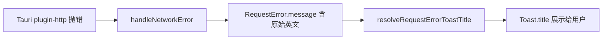

# HttpClient 网络错误 Toast：友好文案与同步 i18n

> 在 [`english-learning-list-network-retry.md`](./english-learning-list-network-retry.md)（Tauri GET 重试、`retryAsync`）之上，本轮解决 **重试仍失败时 Toast 直接展示 Tauri 原始英文报错**、以及 **HttpClient 内硬编码中文兜底** 的问题。

## 1. 背景与目标

### 1.1 用户视角

桌面端（Tauri）访问远程 API 失败时，错误 Toast 曾出现：

```text
error sending request for url (https://...)
```

用户难以理解含义，且与界面语言（中/英）不一致。部分路径兜底为固定中文「请求接口异常」，英文界面下体验割裂。

### 1.2 本轮目标

| 层级 | 目标 |
|------|------|
| 判断 | 识别应「脱敏」的网络错误文案（含 Tauri 完整 URL 句式） |
| HttpClient | `handleNetworkError` / `resolveRequestErrorToastTitle` 统一替换为 i18n 友好句 |
| i18n | 提供 **无 React 上下文** 的 `translateSync`，供 `fetch.ts` 等模块使用 |
| 文案 | 新增 `common.networkErrorTryAgain`、`common.requestFailed` |

**与重试的关系**：重试逻辑不变；仅在 **最终失败** 弹出 Toast 时改写展示文案。`silent: true` 的请求仍不弹 Toast。

若与仓库最新源码不一致，**以源码为准**。

---

## 2. 改动范围

| 说明 | 路径 |
|------|------|
| 是否脱敏网络报错 | `apps/frontend/src/utils/retryAsync.ts` → `shouldMaskAsUserFacingNetworkError` |
| Toast 文案解析 | `apps/frontend/src/utils/fetch.ts` → `resolveRequestErrorToastTitle`、`handleNetworkError` |
| 同步翻译与语言探测 | `apps/frontend/src/i18n/index.ts` → `getActiveLocale`、`translateSync` |
| 文案键 | `apps/frontend/src/i18n/locales/zh-CN.ts`、`en-US.ts` |

**未改动**：重试次数、`isTransientNetworkError` 判定集合、业务 Service / Hook。

---

## 3. 实现思路与过程

### 3.1 问题链路



改前 **B→C** 保留原始 `message`，**D** 直接拼接后端字段或 `'请求接口异常'`，导致 E 不可读或未国际化。

### 3.2 实现步骤

1. **抽取脱敏判断** `shouldMaskAsUserFacingNetworkError`（与 `isTransientNetworkError` 同文件，复用关键词判定，并单独匹配 `error sending request for url (` 整句模式）。
2. **i18n 模块** 增加 `getActiveLocale()`：读取 URL `lang`/`locale` 参数 → `localStorage` 的 `dnhyxc_locale_bootstrap`（与 `hooks/i18n.ts` 一致）→ 默认 `zh-CN`。
3. **`translateSync(key)`**：按当前 locale 查 `DICTS`，无 React Provider 亦可翻译。
4. **`handleNetworkError`**：构造 `RequestError` 前，若 rawMessage 需脱敏，则 `message` 设为 `translateSync('common.networkErrorTryAgain')`。
5. **`resolveRequestErrorToastTitle`**：依次检查后端嵌套 `message` 与顶层 `message`；任一命中脱敏规则则返回网络友好句；否则取第一条非空业务文案；全无则 `common.requestFailed`。

### 3.3 权衡

| 方案 | 说明 | 未采用 |
|------|------|--------|
| Toast 层全局 replace | 耦合 UI 组件 | HttpClient 已集中处理错误，在源头改 `message` 更一致 |
| 仅英文界面翻译 | 中文仍见 Tauri 原文 | 中英文均需友好句 |
| 展示原始错误便于排查 | 开发体验好 | 产品要求对用户隐藏栈式 URL 报错 |

---

## 4. 关键代码与注释

### 4.1 是否脱敏：Tauri 原文识别

**来源**：`apps/frontend/src/utils/retryAsync.ts`（约 L21–L30）

```typescript
/**
 * 是否应将错误文案替换为用户可读提示。
 * 说明：与 isTransientNetworkError 配合；额外匹配带 URL 的 Tauri 完整句式。
 */
export function shouldMaskAsUserFacingNetworkError(
	message: string | null | undefined,
): boolean {
	if (!message) return false;
	const trimmed = message.trim();
	if (!trimmed) return false;
	// 复用瞬时网络错误关键词（error sending request、timeout 等）
	if (isTransientNetworkError(trimmed)) return true;
	// Tauri 常见完整格式：error sending request for url (https://...)
	return /error sending request for url\s*\(/i.test(trimmed);
}
```

### 4.2 非 React 场景同步翻译

**来源**：`apps/frontend/src/i18n/index.ts`（约 L14–L46）

```typescript
const LOCALE_BOOTSTRAP_STORAGE_KEY = 'dnhyxc_locale_bootstrap';

/** 供 HttpClient Toast 等无 React 树模块读取当前语言 */
export function getActiveLocale(): Locale {
	if (typeof window === 'undefined') {
		return DEFAULT_LOCALE;
	}
	try {
		const params = new URLSearchParams(window.location.search);
		const fromUrl = params.get('lang') || params.get('locale');
		if (fromUrl === 'zh-CN' || fromUrl === 'en-US') {
			return fromUrl;
		}
		// 与 useI18n / hooks/i18n.ts 写入的 bootstrap 键一致
		const stored = localStorage.getItem(
			LOCALE_BOOTSTRAP_STORAGE_KEY,
		) as Locale;
		if (SUPPORTED_LOCALES.includes(stored)) {
			return stored;
		}
	} catch {
		// SSR 或隐私模式下忽略
	}
	return DEFAULT_LOCALE;
}

/** 同步查表翻译，不依赖 I18nProvider */
export function translateSync(key: string): string {
	const locale = getActiveLocale();
	const dict = DICTS[locale] ?? DICTS[DEFAULT_LOCALE];
	const fallback = DICTS[DEFAULT_LOCALE];
	return dict[key] ?? fallback[key] ?? key;
}
```

### 4.3 文案键

**来源**：`apps/frontend/src/i18n/locales/zh-CN.ts`、`en-US.ts`（`common.*` 段）

```typescript
// zh-CN
'common.networkErrorTryAgain': '网络异常，请检查网络后重试',
'common.requestFailed': '请求失败，请稍后重试',

// en-US
'common.networkErrorTryAgain':
	'Network error. Please check your connection and try again.',
'common.requestFailed': 'Request failed. Please try again later.',
```

### 4.4 Toast 标题解析

**来源**：`apps/frontend/src/utils/fetch.ts`（`resolveRequestErrorToastTitle` 约 L112–L137）

```typescript
function resolveRequestErrorToastTitle(requestError: RequestError): string {
	// 按优先级收集可能展示的后端/网络 message
	const candidates = [
		normalizeErrorMessage(
			requestError?.data?.data?.error?.message as UnknownErrorMessage,
		),
		normalizeErrorMessage(
			requestError?.data?.data?.message as UnknownErrorMessage,
		),
		normalizeErrorMessage(requestError.message),
	];

	// 任一层级已是 Tauri/网络原文 → 统一友好句（随界面语言）
	for (const msg of candidates) {
		if (shouldMaskAsUserFacingNetworkError(msg)) {
			return translateSync('common.networkErrorTryAgain');
		}
	}

	const display =
		candidates.find((msg) => msg && msg.trim().length > 0) ?? null;
	if (shouldMaskAsUserFacingNetworkError(display)) {
		return translateSync('common.networkErrorTryAgain');
	}

	// 业务错误保留后端文案；全无则通用失败句
	return display ?? translateSync('common.requestFailed');
}
```

### 4.5 网络错误对象构造

**来源**：`apps/frontend/src/utils/fetch.ts`（`handleNetworkError` 约 L380–L412）

```typescript
private handleNetworkError(error: any): RequestError {
	const rawMessage =
		error && typeof error === 'object' && 'message' in error
			? String((error as { message?: unknown }).message ?? '')
			: String(error ?? '');
	const friendlyMessage = shouldMaskAsUserFacingNetworkError(rawMessage)
		? translateSync('common.networkErrorTryAgain')
		: null;

	if (error && typeof error === 'object') {
		if ('code' in error && 'message' in error) {
			const existing = error as RequestError;
			// 已有 RequestError 结构时仅覆盖 message，保留 code/data
			if (friendlyMessage) {
				return { ...existing, message: friendlyMessage };
			}
			return existing;
		}

		return {
			code: error.status || 500,
			message:
				friendlyMessage ||
				error.message ||
				translateSync('common.requestFailed'),
			data: error.data || error,
		};
	}

	return {
		code: 500,
		message:
			friendlyMessage || rawMessage || translateSync('common.requestFailed'),
	};
}
```

**来源**：`apps/frontend/src/utils/fetch.ts`（`request` 的 catch 与 Toast，约 L551–L556）

```typescript
if (!finalConfig.silent) {
	Toast({
		type: 'error',
		title: resolveRequestErrorToastTitle(requestError), // 最终展示入口
	});
}
```

---

## 5. 行为变化

| 场景 | 改前 | 改后 |
|------|------|------|
| Tauri 断网，GET 重试耗尽 | Toast 显示 `error sending request for url (...)` | 中文/英文友好网络提示 |
| 后端返回 4xx/5xx 业务 message | 展示业务文案 | **不变**（非网络脱敏范围） |
| 无任何 message | `请求接口异常`（硬编码） | `translateSync('common.requestFailed')` |
| `silent: true` | 不弹 Toast | **不变** |

---

## 6. 兼容性与风险

- **语言一致性**：`getActiveLocale` 依赖与 `useI18n` 相同的 `dnhyxc_locale_bootstrap`；用户切换语言后需已写入 localStorage（现有语言切换流程已满足）。
- **调试**：控制台仍可打印原始 error；仅 **Toast 展示** 脱敏。
- **误判**：若后端业务 `message` 恰好含 `network` 等子串，可能被替换为网络友好句；当前后端错误文案较少使用该措辞。

---

## 7. 建议回归测试

1. Tauri 桌面端断网或错误 API 地址，触发 GET 失败 Toast：中文界面见「网络异常…」，切英文见 Network error…。
2. 正常业务错误（如 400 校验）：Toast 仍为后端返回的中文/英文业务说明。
3. `silent: true` 的列表请求失败：无 HttpClient 默认 Toast，仅业务层自定义提示。
4. URL 带 `?lang=en-US` 时，网络错误 Toast 为英文。

---

## 8. 相关文档与源码

| 说明 | 路径 |
|------|------|
| 重试与列表韧性 | [`english-learning-list-network-retry.md`](./english-learning-list-network-retry.md) |
| 星标渐进查询 | [`favorite-star-incremental-ui.md`](./favorite-star-incremental-ui.md) |
| HttpClient | `apps/frontend/src/utils/fetch.ts` |
| 重试/脱敏工具 | `apps/frontend/src/utils/retryAsync.ts` |
| 同步 i18n | `apps/frontend/src/i18n/index.ts` |
