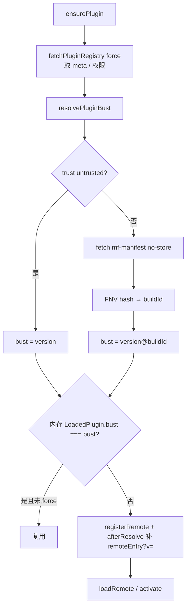

# 插件 MF entry 缓存破坏（version@manifestHash）

> **文档角色（本轮主文档）**：桌面 / WebView 仍吃旧 `remoteEntry.js`、发新版插件不生效的修复；**bust 指纹改为 Remote 自有 manifest 内容哈希，发布者不必改 Host registry**。  
> **延伸阅读**：[mf-plugin-host.md](./mf-plugin-host.md)；[../ops/remotes-no-store-cache.md](../ops/remotes-no-store-cache.md)；[plugin-registry-hostapi.md](./plugin-registry-hostapi.md)；开发手册副本：[../../apps/frontend/src/plugins/docs/mf-implementation-guide.md](../../apps/frontend/src/plugins/docs/mf-implementation-guide.md) §2.13。

## 1. 背景与目标

只给 `mf-manifest.json` 加 `?v=` **不够**：Module Federation 解析 snapshot 后会把真正 `import()` 的地址改写成固定名 `remoteEntry.js`（去掉 query）。WKWebView 对固定 ESM URL 强缓存，导致桌面端继续跑旧插件。

早期方案用 `version@registry.updatedAt` 作 bust：每次发插件都要改 Host 维护的 `plugins-registry.json`，**不安全**（发布者不应具备改你们清单的能力），也增加运维摩擦。

**当前目标**：

1. bust = `version@manifestHash`（hash 来自 Remote **自己域名**上的 `mf-manifest.json` 正文）。
2. `afterResolve` 在 MF 改写后再给 `remoteEntry.js` 补 `?v=`。
3. `PluginManager` 用同一 bust 判断是否重载。
4. **发布者只部署 Remote 静态资源**；registry 仍只由 Host 管理员改（上架、权限、`entry` URL、展示用 `version` 等）。

## 2. 改动范围

| 路径 | 说明 |
|------|------|
| `apps/frontend/src/plugins/core/mf.ts` | `withBust` / `pluginBust` / `fetchEntryBuildId` / `resolvePluginBust` / `afterResolve` / `registerRemote` |
| `apps/frontend/src/plugins/core/PluginManager.ts` | `ensurePlugin` / `loadPlugin` 用 `resolvePluginBust`，不再把 `registry.updatedAt` 拼进 bust |
| `apps/frontend/src/plugins/core/types.ts` | `LoadedPlugin.bust` 语义：`version@manifestHash` |
| `apps/frontend/src/plugins/core/registry.ts` | force 拉 registry 仍加 `?t=`（清单本身防缓存；与 entry bust **解耦**） |

## 3. 实现思路

1. **trusted MF**：`fetchEntryBuildId(entry)` → `cache: 'no-store'` 拉 manifest（URL 再加一次性 `t`）→ FNV-1a 内容指纹 → `pluginBust(meta, buildId)`。
2. **untrusted**：不走 MF entry，bust 仅为 `version`。
3. **registerRemotes**：entry 先 `withBust`；写入 `bustByRemote`。
4. **afterResolve**：MF 改写 entry 后，再对 `remoteInfo.entry` `withBust`。
5. **ensurePlugin**：force 拉 registry 取 meta；`await resolvePluginBust(meta)`；仅 `cur.bust === bust` 才跳过加载。

**安全边界**：能改 Remote 静态源的人本来就能投毒 JS；清单（权限 / enabled / entry URL）仍只经鉴权写入，发布流水线 **不得** SSH/API 改 `plugins-registry.json`。

## 4. 关键代码对比

### 4.1 `pluginBust` / `fetchEntryBuildId` / `resolvePluginBust`

**对比范围**：bust token 生成。

**改动前** · `apps/frontend/src/plugins/core/mf.ts`（基线）

```typescript
export function pluginBust(
	meta: Pick<PluginDescriptor, 'version'>,
	registryUpdatedAt?: string,
): string {
	return [meta.version.trim(), registryUpdatedAt?.trim()]
		.filter(Boolean)
		.join('@');
}
```

**改动后** · `apps/frontend/src/plugins/core/mf.ts`（当前，约 L58–L98）

```typescript
export function pluginBust(
	meta: Pick<PluginDescriptor, 'version'>,
	/** Remote 构建指纹（manifest hash）；勿用 registry.updatedAt */
	buildId?: string,
): string {
	return [meta.version.trim(), buildId?.trim()].filter(Boolean).join('@');
}

/** FNV-1a 32-bit；仅作 cache bust，非安全哈希 */
function hashText(text: string): string {
	let h = 2166136261;
	for (let i = 0; i < text.length; i++) {
		h ^= text.charCodeAt(i);
		h = Math.imul(h, 16777619);
	}
	return (h >>> 0).toString(16);
}

/** 拉取 Remote 自有 mf-manifest，用内容指纹做 bust */
export async function fetchEntryBuildId(entry: string): Promise<string> {
	const url = withBust(entry, `t${Date.now()}`);
	const res = await fetch(url, { cache: 'no-store' });
	if (!res.ok) {
		throw new Error(`entry buildId ${res.status}: ${entry}`);
	}
	return hashText(await res.text());
}

/** trusted MF：version@manifestHash；untrusted：仅 version */
export async function resolvePluginBust(
	meta: Pick<PluginDescriptor, 'version' | 'entry' | 'trust'>,
): Promise<string> {
	if (meta.trust === 'untrusted') {
		return pluginBust(meta);
	}
	const buildId = await fetchEntryBuildId(meta.entry);
	return pluginBust(meta, buildId);
}
```

**变更摘要**：bust 第二段从「Host registry 时间」改为「Remote manifest 指纹」。

### 4.2 `ensurePlugin` 重载判定

**改动前** · `apps/frontend/src/plugins/core/PluginManager.ts`（基线）

```typescript
const bust = pluginBust(meta, registry.updatedAt);
// ...
await this.loadPlugin(meta, opts, registry.updatedAt);
```

**改动后** · `apps/frontend/src/plugins/core/PluginManager.ts`（当前，约 L88–L123）

```typescript
const bust = await resolvePluginBust(meta);
// ...
await this.loadPlugin(meta, opts, bust);

async loadPlugin(
	meta: PluginDescriptor,
	opts?: { force?: boolean },
	bustToken?: string,
) {
	const bust = bustToken ?? (await resolvePluginBust(meta));
	// … 与 bust 比对后 registerRemote(meta, bust)
}
```

**变更摘要**：加载前多一次对 Remote entry 的 fetch；registry 保存/不保存不再决定 entry 是否刷新。

### 4.3 `withBust` / `afterResolve`（未改语义）

仍须在 MF 改写后给 `remoteEntry.js` 补同一 `?v=`；见源码 `bustRemoteEntryPlugin`。根因与此层无关，仅 token 来源变了。

## 5. 端到端数据流



## 6. 发版 checklist（安全）

1. 部署新 Remote 静态资源（新 `mf-manifest.json` / `remoteEntry.js` 等）。**manifest 正文须变化**（Vite 构建一般会变 hashed chunk 引用）。
2. **不要**为刷新缓存去改 `plugins-registry.json`；仅当上架、改权限、改 `entry` URL、改展示文案等时由管理员改清单。
3. 可选：bump registry 里展示用 `version`（会进入 bust 前缀，但 **仅 bump version 而 manifest 未变时仍可能短路**——以 manifest hash 为准）。
4. **桌面生产须含本方案的 Host 壳**（`resolvePluginBust` + `afterResolve`）。
5. Remote 源站须对 Host / Tauri origin 开 CORS（Host 需 `fetch` manifest 算指纹，与原先 MF 拉 entry 相同约束）。

## 7. 兼容性与影响

| 项 | 说明 |
|----|------|
| 旧 Host 壳 | 仍可能按旧 `updatedAt` 逻辑或「已 activated 就短路」；须升级壳 |
| registry `updatedAt` | 仍用于清单编辑审计 / force 拉清单；**不再**驱动 MF entry bust |
| 额外请求 | 每次 `ensurePlugin`（trusted）多一次 manifest GET；体积小、可接受 |
| 误区：发布流水线写 registry | **禁止**；已撤销「bump-registry」类脚本 |

## 8. 验收与排障

| 步骤 | 期望 |
|------|------|
| 只部署新 Remote、不改 registry，再进插件页 | DevTools 中 manifest / `remoteEntry.js` 的 `?v=` 相对发版前变化；UI 为新版 |
| 同一次进入、资源未变 | `bust` 相同 → 复用已激活模块 |
| `curl` Remote `mf-manifest.json` | 200，CORS 允许 Host origin |
| `/remotes/plugins-registry.json` | 仍 `no-store`（清单防缓存，与 entry bust 独立） |

| 误区 | 正确做法 |
|------|----------|
| 只给 manifest 加 query、无 afterResolve | 必须补 `remoteEntry.js?v=` |
| 发布者改 Host registry 刷缓存 | 部署 Remote 即可；清单只给管理员 |
| 只发插件不发桌面壳 | 生产 Host 在壳内，须发壳 |
| Remote 禁 CORS | `fetchEntryBuildId` 失败 → 插件加载失败 |

## 9. 相关源码路径

| 说明 | 路径 |
|------|------|
| bust / buildId / afterResolve | `apps/frontend/src/plugins/core/mf.ts` |
| 重载判定 | `apps/frontend/src/plugins/core/PluginManager.ts` |
| LoadedPlugin.bust | `apps/frontend/src/plugins/core/types.ts` |
| registry 拉取（与 bust 解耦） | `apps/frontend/src/plugins/core/registry.ts` |

---

（若与仓库最新源码不一致，以源码为准）
