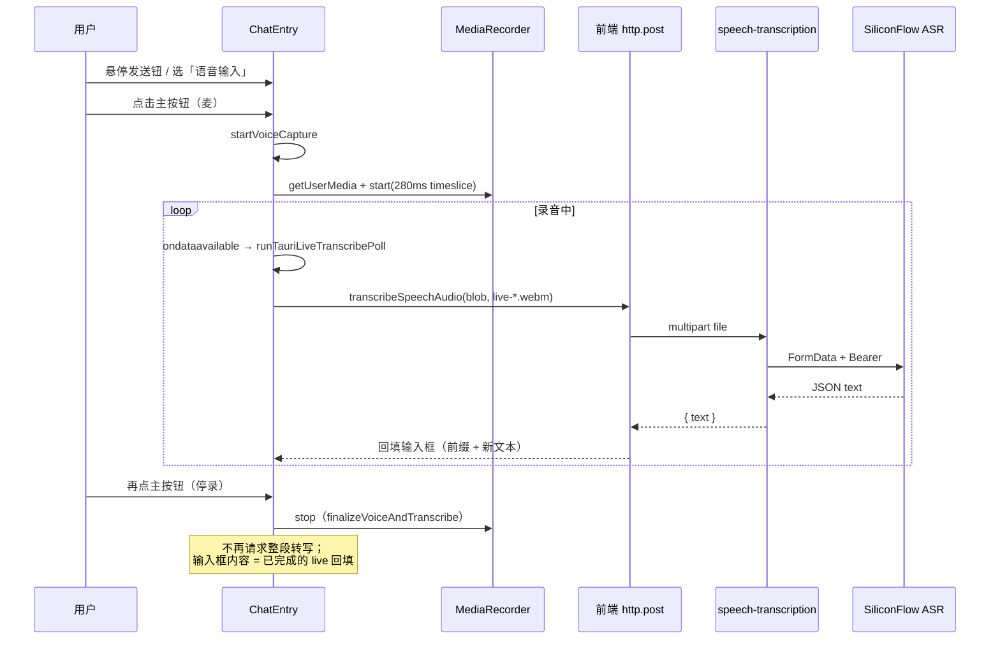

# 语音输入与语音识别（ASR）实现说明

本文档基于当前仓库实现，梳理 **Tauri 桌面端** 聊天/助手输入区「语音输入」的完整思路，并收录相关源码摘录与**逐行说明**（行号与 `apps/frontend`、`apps/backend` 中文件一致）。**§10** 补充 **Live 出字速度与识别准确率** 相关迭代思路与代码摘录；**§10.4** 专门说明 **由定时器改为 `ondataavailable` 驱动** 及 **`clearTauriLiveTimers` 移除** 的实现思路与文档内注释版代码；**§10.5** 专门说明 **停录时不再发起整段语音识别请求** 的实现思路、取舍与文档内注释版代码；**§10.6** 专门说明 **`sendDisabled` / placeholder 可维护性** 与 **Tauri 主按钮 `DropdownMenuTrigger asChild` 直接合并到 `Button`** 的实现思路（与语音 ASR 正交）。**文档仅描述与摘录代码，不修改业务源码。**

---

## 1. 目标与适用范围

| 维度     | 说明                                                                                                                                                                                                                                                                                                        |
| -------- | ----------------------------------------------------------------------------------------------------------------------------------------------------------------------------------------------------------------------------------------------------------------------------------------------------------- |
| 运行环境 | **仅 Tauri 壳内**（`isTauriRuntime() === true`）展示「文本 / 语音」模式切换、麦克风录音与 live 增量转写；纯 Web 仅保留文本发送按钮，强制 `inputMode === 'text'`。                                                                                                                                           |
| 录音技术 | `navigator.mediaDevices.getUserMedia` + `MediaRecorder`，`timeslice` **280ms** 产出 `Blob` 片段；优先 `audioBitsPerSecond: 128_000`，失败则降级创建。                                                                                                                                                       |
| 实时听写 | **`MediaRecorder.ondataavailable`** 驱动：有新分片即尝试将**累积**音频打成 `Blob` 调后端转写（无固定 `setInterval` 空转）；`epoch` 与 `voiceRecordingRef` 丢弃过期响应；**首轮/后续**用不同体积门槛与增量门槛；live 回填直接 `setInput`（不走 `startTransition`）。                                         |
| 停录     | 用户再次点击主按钮：`finalizeVoiceAndTranscribe` 仅 **`MediaRecorder.stop()`**、清空分片、**`stopMediaTracks`**、复位 UI 并聚焦输入框；**不再**对整段 `Blob` 调用 `transcribeSpeechAudio`。输入框中的语音段文字完全来自录音过程中的 **live** 转写（仍保留开录前 `voiceBaseRef` 前缀与 live 内的拼接逻辑）。 |
| 后端     | NestJS `POST /speech-transcription/transcription`，`multipart` 字段 `file`；硅基流动 OpenAI 兼容 `POST /v1/audio/transcriptions`。                                                                                                                                                                          |
| 业务约束 | 知识库 **AI 模式** 下左侧文档无正文时 `disableTextInput=true`：禁用文本输入、禁止悬停打开模式菜单、禁止开始语音/发送（录音中仍允许**停录收尾**，避免麦克风悬挂；停录本身不再触发整段 ASR，与 `disableTextInput` 无冲突）。                                                                                  |

---

## 2. 端到端数据流（概念）



---

## 3. 运行时与麦克风基础设施

### 3.1 `isTauriRuntime`（`apps/frontend/src/utils/runtime.ts`）

**摘录** `apps/frontend/src/utils/runtime.ts` 第 1–10 行：

```typescript
/**
 * 是否在 Tauri WebView（桌面壳）内运行。
 * 纯浏览器 / Vite dev 下为 false，可安全走 Web API 回退逻辑。
 */
export function isTauriRuntime(): boolean {
	if (typeof window === "undefined") {
		return false;
	}
	return "__TAURI_INTERNALS__" in window;
}
```

| 行号 | 说明                                                 |
| ---- | ---------------------------------------------------- |
| 1-4  | 模块注释：区分桌面壳与纯浏览器，语音 UI 仅壳内启用。 |
| 5    | 导出函数，供 `ChatEntry`、麦克风检测等调用。         |
| 6    | SSR 或无 `window` 时视为非 Tauri。                   |
| 7    | 返回 `false`，避免访问 `window`。                    |
| 9    | Tauri 在 `window` 上挂载内部符号，存在即判定为壳内。 |
| 10   | 函数结束。                                           |

### 3.2 `navigatorMediaDevices` 补丁与错误文案（`apps/frontend/src/utils/navigatorMediaDevices.ts`）

**摘录** `apps/frontend/src/utils/navigatorMediaDevices.ts` 第 1–78 行：

```typescript
/**
 * 部分 WebView（macOS WKWebView、旧版 Safari）只暴露前缀版 getUserMedia，
 * 未挂到 navigator.mediaDevices 上，会导致「没有麦克风接口」的假阴性。
 * 在读取能力或调用 getUserMedia 之前执行一次即可（幂等）。
 */
export function patchNavigatorMediaDevices(): void {
	if (typeof navigator === "undefined") return;

	const nav = navigator as Navigator & {
		mediaDevices?: MediaDevices;
	};
	// lib.dom 中 MediaDevices 类型恒含 getUserMedia；运行时旧 WebView 可能仍缺省，用 unknown 判断
	const existingGum = (
		nav.mediaDevices as unknown as { getUserMedia?: unknown } | undefined
	)?.getUserMedia;
	if (typeof existingGum === "function") return;

	type LegacyGum = (
		constraints: MediaStreamConstraints,
		onSuccess: (stream: MediaStream) => void,
		onError: (err: unknown) => void,
	) => void;

	const legacy = ((nav as unknown as { getUserMedia?: LegacyGum })
		.getUserMedia ??
		(nav as unknown as { webkitGetUserMedia?: LegacyGum }).webkitGetUserMedia ??
		(nav as unknown as { mozGetUserMedia?: LegacyGum }).mozGetUserMedia) as
		| LegacyGum
		| undefined;

	if (!legacy) return;

	if (!nav.mediaDevices) {
		(nav as Navigator & { mediaDevices: MediaDevices }).mediaDevices =
			{} as MediaDevices;
	}

	const md = nav.mediaDevices as MediaDevices & {
		getUserMedia?: (
			constraints: MediaStreamConstraints,
		) => Promise<MediaStream>;
	};

	md.getUserMedia = (constraints: MediaStreamConstraints) =>
		new Promise<MediaStream>((resolve, reject) => {
			try {
				legacy.call(navigator, constraints, resolve, reject);
			} catch (e) {
				reject(e);
			}
		});
}

/** 将 getUserMedia 常见异常转成可读说明（中文） */
export function formatGetUserMediaError(err: unknown): string {
	if (err instanceof DOMException) {
		switch (err.name) {
			case "NotAllowedError":
			case "PermissionDeniedError":
				return "系统或浏览器拒绝了麦克风权限，请在系统设置中允许本应用访问麦克风，并留意是否点了「不允许」。";
			case "NotFoundError":
			case "DevicesNotFoundError":
				return "未检测到可用的麦克风，请连接麦克风或在系统设置中选择正确的输入设备。";
			case "NotReadableError":
			case "TrackStartError":
				return "麦克风可能被其他应用占用，请关闭视频会议/录音类软件后重试。";
			case "SecurityError":
				return `安全限制导致无法访问麦克风：${err.message}（请使用 HTTPS 或 localhost 打开页面）`;
			case "NotSupportedError":
				return "当前环境不支持所请求的音频采集方式，请更新系统或换用 Chrome / Edge。";
			default:
				return `无法访问麦克风（${err.name}）：${err.message}`;
		}
	}
	if (err instanceof Error) {
		return `无法访问麦克风：${err.message}`;
	}
	return `无法访问麦克风：${String(err)}`;
}
```

| 行号  | 说明                                                                  |
| ----- | --------------------------------------------------------------------- |
| 1-5   | 说明为何需要补丁：旧 WebView 未暴露标准 `mediaDevices.getUserMedia`。 |
| 6     | 导出幂等补丁函数。                                                    |
| 7     | 无 `navigator`（SSR）直接返回。                                       |
| 9-11  | 将 `navigator` 断言为可带 `mediaDevices` 的类型。                     |
| 12-16 | 若已有标准 `getUserMedia`，无需补丁。                                 |
| 16    | 已有则返回。                                                          |
| 18-22 | 定义旧版回调式 `getUserMedia` 类型别名。                              |
| 24-28 | 依次尝试 `getUserMedia` / `webkitGetUserMedia` / `mozGetUserMedia`。  |
| 30    | 无任何遗留 API 则无法补丁，返回。                                     |
| 32-35 | 若无 `mediaDevices` 对象则创建空壳以便挂载。                          |
| 37-41 | 取得可扩展的 `mediaDevices` 引用。                                    |
| 43-50 | 用 Promise 包装 legacy 回调，对齐现代 API。                           |
| 45-49 | `try/catch` 将同步异常转为 `reject`。                                 |
| 51    | `patchNavigatorMediaDevices` 结束。                                   |
| 53-54 | `formatGetUserMediaError`：把 DOM 异常映射为用户可读中文。            |
| 55-72 | 按 `DOMException.name` 分支返回具体提示。                             |
| 74-76 | 普通 `Error` 回退。                                                   |
| 77    | 未知类型回退为字符串化。                                              |
| 78    | 文件结束。                                                            |

---

## 4. 前端 HTTP 与路由常量

### 4.1 API 路径（`apps/frontend/src/service/api.ts`）

**摘录** `apps/frontend/src/service/api.ts` 第 59 行：

```typescript
export const SPEECH_TRANSCRIPTION = "/speech-transcription/transcription";
```

| 行号 | 说明                                                                                                  |
| ---- | ----------------------------------------------------------------------------------------------------- |
| 59   | 语音转写上传的相对路径，与后端 `Controller('speech-transcription')` + `@Post('transcription')` 一致。 |

### 4.2 `transcribeSpeechAudio`（`apps/frontend/src/service/index.ts`）

**摘录** `apps/frontend/src/service/index.ts` 第 243–256 行：

```typescript
/** 语音转写：上传录音，返回识别文本（后端 speech-transcription 模块） */
export const transcribeSpeechAudio = async (blob: Blob, filename: string) => {
	const file = new File([blob], filename, {
		type: blob.type || "audio/webm",
	});
	return await http.post<{ text: string }>(
		SPEECH_TRANSCRIPTION,
		{ file },
		{
			headers: { "Content-Type": "multipart/form-data" },
			timeout: 120000,
		},
	);
};
```

| 行号    | 说明                                                                                                                                           |
| ------- | ---------------------------------------------------------------------------------------------------------------------------------------------- |
| 243     | JSDoc：标明后端模块职责。                                                                                                                      |
| 244     | 导出异步方法；入参为录音 `Blob` 与文件名（影响 multer 侧后缀/类型推断）。                                                                      |
| 245-247 | 将 `Blob` 包装为 `File`，便于走统一 multipart 序列化。                                                                                         |
| 248     | 泛型响应体形状 `{ text: string }`（与后端返回对齐）。                                                                                          |
| 249     | POST 到 `SPEECH_TRANSCRIPTION`。                                                                                                               |
| 250     | 请求体字段名 `file`，与 `FileInterceptor('file')` 一致。                                                                                       |
| 251-254 | 显式 multipart；120s 超时适配单次上传的较长音频（live 累积 Blob 可能较大；历史上停录整段亦走此接口；**当前**停录不再二次上传，见 **§10.5**）。 |
| 255     | 返回 `http.post` 的 Promise。                                                                                                                  |
| 256     | 声明结束。                                                                                                                                     |

---

## 5. 后端：语音转写模块

### 5.1 模块定义（`apps/backend/src/services/speech-transcription/speech-transcription.module.ts`）

**摘录** `apps/backend/src/services/speech-transcription/speech-transcription.module.ts` 第 1–13 行：

```typescript
import { Module } from "@nestjs/common";
import { SpeechTranscriptionController } from "./speech-transcription.controller";
import { SiliconflowTranscriptionService } from "./siliconflow-transcription.service";

/**
 * 公共语音转写（硅基流动 ASR）：HTTP 路由 + 可导出 {@link SiliconflowTranscriptionService} 供其它模块注入。
 */
@Module({
	controllers: [SpeechTranscriptionController],
	providers: [SiliconflowTranscriptionService],
	exports: [SiliconflowTranscriptionService],
})
export class SpeechTranscriptionModule {}
```

| 行号 | 说明                           |
| ---- | ------------------------------ |
| 1    | 引入 Nest `Module`。           |
| 2-3  | 引入控制器与硅基转写服务。     |
| 5-7  | 模块职责说明。                 |
| 8    | `@Module` 装饰器开始。         |
| 9    | 注册 HTTP 控制器。             |
| 10   | 注册可注入 Provider。          |
| 11   | 导出服务供其他 Nest 模块复用。 |
| 12   | 装饰器结束。                   |
| 13   | 导出模块类。                   |

### 5.2 控制器（`apps/backend/src/services/speech-transcription/speech-transcription.controller.ts`）

**摘录** `apps/backend/src/services/speech-transcription/speech-transcription.controller.ts` 第 1–41 行：

```typescript
import {
	BadRequestException,
	ClassSerializerInterceptor,
	Controller,
	Post,
	UploadedFile,
	UseGuards,
	UseInterceptors,
} from "@nestjs/common";
import { FileInterceptor } from "@nestjs/platform-express";
import { memoryStorage } from "multer";
import { JwtGuard } from "src/guards/jwt.guard";
import { SiliconflowTranscriptionService } from "./siliconflow-transcription.service";

/**
 * 语音转文字 HTTP 接口（与 Chat / Knowledge 等业务解耦，仅做上传与 ASR）。
 */
@Controller("speech-transcription")
@UseInterceptors(ClassSerializerInterceptor)
@UseGuards(JwtGuard)
export class SpeechTranscriptionController {
	constructor(
		private readonly siliconflowTranscriptionService: SiliconflowTranscriptionService,
	) {}

	/**
	 * 上传录音文件，返回识别文本。multipart 字段名：file
	 */
	@Post("transcription")
	@UseInterceptors(
		FileInterceptor("file", {
			storage: memoryStorage(),
			limits: { fileSize: 25 * 1024 * 1024 },
		}),
	)
	async transcribe(@UploadedFile() file: Express.Multer.File) {
		if (!file?.buffer?.length) {
			throw new BadRequestException("请上传有效的音频文件");
		}
		return this.siliconflowTranscriptionService.transcribe(file);
	}
}
```

| 行号  | 说明                                                |
| ----- | --------------------------------------------------- |
| 1-9   | Nest 装饰器与异常、上传类型导入。                   |
| 10-11 | Multer 文件拦截与内存存储（不落盘，适合转发上游）。 |
| 12    | JWT 守卫：需登录才可转写。                          |
| 13    | 硅基转写服务。                                      |
| 15-17 | 控制器职责注释。                                    |
| 18    | 路由前缀 `speech-transcription`。                   |
| 19    | 类序列化拦截器。                                    |
| 20    | 全局路由守卫 JWT。                                  |
| 21    | 控制器类声明。                                      |
| 22-24 | 注入转写服务。                                      |
| 26-28 | 方法注释：字段名 `file`。                           |
| 29    | POST 子路径 `transcription`。                       |
| 30-34 | 单文件上传，内存存储，单文件上限 25MB。             |
| 36    | 处理函数：接收 `Express.Multer.File`。              |
| 37-39 | 空文件校验。                                        |
| 40    | 委托服务执行硅基请求并返回 `{ text }`。             |
| 41    | 类结束。                                            |

### 5.3 硅基流动转写服务（`apps/backend/src/services/speech-transcription/siliconflow-transcription.service.ts`）

下文摘录为服务主体（模型解析、`fetch`、响应解析）；**`language` 与 `TRANSCRIPTION_LANGUAGE_RE`、配置键 `SILICONFLOW_TRANSCRIPTION_LANGUAGE`** 等增量逻辑见 **§10.3**。

**摘录** `apps/backend/src/services/speech-transcription/siliconflow-transcription.service.ts` 第 1–107 行（与仓库主干一致处；行号可能随文件增长略变）：

```typescript
import { HttpException, HttpStatus, Injectable, Logger } from "@nestjs/common";
import { ConfigService } from "@nestjs/config";
import { KnowledgeQaEnum } from "../../enum/config.enum";

const DEFAULT_TRANSCRIPTION_MODEL = "FunAudioLLM/SenseVoiceSmall";
/** 硅基文档列出的转写模型（用于无自定义配置时的说明与校验参考） */
const KNOWN_TRANSCRIPTION_MODELS = new Set<string>([
	DEFAULT_TRANSCRIPTION_MODEL,
	"TeleAI/TeleSpeechASR",
]);
/** 允许硅基后续新增 model id，限制为常见路径字符，避免误配置注入 multipart 字段 */
const TRANSCRIPTION_MODEL_ID_RE = /^[A-Za-z0-9./_-]{3,96}$/;

/**
 * SenseVoice 等常返回 `<|zh|><|NEUTRAL|>` 类富标签，剥离后更利于直接回填输入框。
 */
function normalizeAsrPlainText(raw: string): string {
	let s = raw.trim().replace(/<[^>]+>/g, "");
	s = s
		.replace(/\u00a0/g, " ")
		.replace(/\s+/g, " ")
		.trim();
	return s;
}

/**
 * 硅基流动 OpenAI 兼容「语音转文字」：POST /v1/audio/transcriptions
 * 模型默认 FunAudioLLM/SenseVoiceSmall，可用环境变量 SILICONFLOW_TRANSCRIPTION_MODEL 覆盖。
 * 供 Chat、Knowledge 等业务模块注入复用。
 */
@Injectable()
export class SiliconflowTranscriptionService {
	private readonly logger = new Logger(SiliconflowTranscriptionService.name);

	constructor(private readonly config: ConfigService) {}

	private resolveTranscriptionModel(): string {
		const configured = this.config
			.get<string>(KnowledgeQaEnum.SILICONFLOW_TRANSCRIPTION_MODEL)
			?.trim();
		if (!configured) return DEFAULT_TRANSCRIPTION_MODEL;
		if (!TRANSCRIPTION_MODEL_ID_RE.test(configured)) {
			this.logger.warn(
				`SILICONFLOW_TRANSCRIPTION_MODEL 格式无效，已回退为 ${DEFAULT_TRANSCRIPTION_MODEL}`,
			);
			return DEFAULT_TRANSCRIPTION_MODEL;
		}
		if (!KNOWN_TRANSCRIPTION_MODELS.has(configured)) {
			this.logger.log(`语音转写使用自定义模型: ${configured}`);
		}
		return configured;
	}

	async transcribe(file: Express.Multer.File): Promise<{ text: string }> {
		const apiKey =
			this.config.get<string>(KnowledgeQaEnum.SILICONFLOW_API_KEY) ||
			this.config.get<string>(KnowledgeQaEnum.DASHSCOPE_API_KEY);
		if (!apiKey?.trim()) {
			throw new HttpException(
				"未配置 SILICONFLOW_API_KEY，无法进行语音识别",
				HttpStatus.SERVICE_UNAVAILABLE,
			);
		}

		const baseUrl = (
			this.config.get<string>(KnowledgeQaEnum.SILICONFLOW_BASE_URL) ||
			"https://api.siliconflow.cn/v1"
		).replace(/\/$/, "");
		const url = `${baseUrl}/audio/transcriptions`;

		const formData = new FormData();
		const blob = new Blob([new Uint8Array(file.buffer)], {
			type: file.mimetype || "application/octet-stream",
		});
		formData.append("file", blob, file.originalname || "audio.webm");
		formData.append("model", this.resolveTranscriptionModel());

		const res = await fetch(url, {
			method: "POST",
			headers: {
				Authorization: `Bearer ${apiKey.trim()}`,
			},
			body: formData,
		});

		const raw = await res.text();
		if (!res.ok) {
			throw new HttpException(
				`语音识别失败（${res.status}）：${raw.slice(0, 500)}`,
				res.status >= 400 && res.status < 600
					? res.status
					: HttpStatus.BAD_GATEWAY,
			);
		}

		let json: { text?: string } = {};
		try {
			json = JSON.parse(raw) as { text?: string };
		} catch {
			throw new HttpException("语音识别返回非 JSON", HttpStatus.BAD_GATEWAY);
		}

		const text =
			typeof json.text === "string"
				? json.text
				: ((json as { data?: { text?: string } }).data?.text ?? "");
		return { text: normalizeAsrPlainText(text) };
	}
}
```

| 行号    | 说明                                                              |
| ------- | ----------------------------------------------------------------- |
| 1-3     | Nest 日志/异常、配置枚举导入。                                    |
| 5       | 默认转写模型 ID。                                                 |
| 6-10    | 已知模型集合，用于日志分支（未知则记 log 仍采用）。               |
| 11-12   | 模型字符串白名单正则，防配置注入异常字符。                        |
| 14-16   | `normalizeAsrPlainText` 注释：去掉 SenseVoice 风格标签。          |
| 17      | 函数声明。                                                        |
| 18      | 去标签、压缩空白、trim。                                          |
| 19      | 不间断空格转普通空格。                                            |
| 20      | 返回清洗后字符串。                                                |
| 23-26   | 服务级注释：硅基 OpenAI 兼容接口与可配置模型。                    |
| 28      | `@Injectable` 注册为 Provider。                                   |
| 29      | 服务类导出。                                                      |
| 30      | Nest Logger 实例。                                                |
| 32      | 注入 `ConfigService`。                                            |
| 34      | 私有方法：解析最终 model 字符串。                                 |
| 35-37   | 读配置项 `SILICONFLOW_TRANSCRIPTION_MODEL` 并 trim。              |
| 38      | 未配置则用默认模型。                                              |
| 39-44   | 非法格式打 warn 并回退默认。                                      |
| 45-47   | 非文档列出模型时 info 记录自定义模型。                            |
| 48      | 返回解析后的 model。                                              |
| 51      | 公开方法：接收内存中的上传文件。                                  |
| 52-54   | API Key：优先硅基，否则兼容读 DashScope key（项目内统一配置源）。 |
| 55-60   | 无 key 则 503，提示配置。                                         |
| 62-66   | 拼接 baseUrl，去掉末尾 `/`，得到 `.../audio/transcriptions`。     |
| 66      | `url` 常量。                                                      |
| 68      | 构造 `FormData`（标准 Web API，Node 18+ 可用）。                  |
| 69-71   | 将 `buffer` 转 `Blob` 并带 mime。                                 |
| 72      | 追加文件字段，文件名回退 `audio.webm`。                           |
| 73      | 追加 model 字段。                                                 |
| 75-81   | `fetch` POST，Bearer 鉴权。                                       |
| 83      | 先读文本便于错误分支切片。                                        |
| 84-89   | 非 2xx：抛出 `HttpException`，状态码映射 4xx/5xx 或 502。         |
| 91      | 预声明 JSON 变量。                                                |
| 92-94   | 尝试 `JSON.parse`。                                               |
| 94-98   | 非 JSON 响应 502。                                                |
| 101-104 | 兼容 `text` 顶层或嵌套 `data.text`。                              |
| 105     | 返回归一化后的纯文本。                                            |
| 106     | `transcribe` 结束。                                               |
| 107     | 类结束。                                                          |

---

## 6. `ChatEntry` 中的语音相关实现（`apps/frontend/src/components/design/ChatEntry/index.tsx`）

以下按逻辑分段列出**与语音直接相关**的常量、辅助函数、状态、副作用与 UI；文件顶部 UI 导入（约 1–46 行）为通用聊天组件依赖，此处不逐行展开。

### 6.1 常量与麦克风辅助（约 42–113 行）

**摘录** `apps/frontend/src/components/design/ChatEntry/index.tsx` 第 42–113 行：

```tsx
/**
 * Tauri 增量 ASR：由 ondataavailable 驱动尝试转写；首轮/后续用不同体积门槛折中速度与稳定性。
 */
/** 尚未成功送过一轮转写时（lastSent===0），用较小体积尽快触发首次识别 */
const TAURI_LIVE_MIN_BYTES_FIRST = 4800;
/** 已有转写基线后，用较大体积减轻不完整容器带来的错字 */
const TAURI_LIVE_MIN_BYTES_STEADY = 7800;
/** 相对上次上传体积的最小增量（仅第二轮起生效） */
const TAURI_LIVE_MIN_GROWTH_STEADY = 2800;

/**
 * 无法使用麦克风时的说明（多为「非安全上下文」：HTTP + 局域网 IP）
 * Tauri WebView 可能错误上报 isSecureContext，故壳内不在此拦截，交给 getUserMedia 实测。
 * 返回 null 表示可尝试请求麦克风。
 */
function getMicrophoneUnavailableReason(): string | null {
	if (typeof window === "undefined") return null;

	patchNavigatorMediaDevices();

	// 桌面壳内由系统权限与 WKWebView 决定，避免仅靠 isSecureContext 误判
	if (!isTauriRuntime() && !window.isSecureContext) {
		const { protocol, hostname, port } = window.location;
		const p = port ? `${port}` : "";
		if (
			protocol === "http:" &&
			hostname !== "localhost" &&
			hostname !== "127.0.0.1"
		) {
			return `麦克风仅在「安全页面」可用：你用 ${protocol}//${hostname}${p ? `:${p}` : ""}（局域网 IP）通过 HTTP 打开时，浏览器会禁用麦克风。请在本机用地址栏输入 http://localhost${p ? `:${p}` : ":9002"} 访问（与 vite 端口一致），或部署 HTTPS。`;
		}
		return "当前页面不是安全上下文，请使用 HTTPS，或通过 http://localhost / http://127.0.0.1 访问本地开发服务。";
	}

	if (!navigator.mediaDevices?.getUserMedia) {
		return "浏览器未提供麦克风接口（mediaDevices.getUserMedia）。请使用 Chrome / Edge 最新版；若在桌面壳内仍失败，请更新应用或联系开发者检查 WebView 权限。";
	}

	return null;
}

/** 获取麦克风音频流（先补丁前缀 API，再走标准 mediaDevices） */
async function getAudioMediaStream(): Promise<MediaStream> {
	patchNavigatorMediaDevices();
	if (!navigator.mediaDevices?.getUserMedia) {
		throw new Error("NO_GET_USER_MEDIA");
	}
	try {
		return await navigator.mediaDevices.getUserMedia({
			audio: {
				echoCancellation: true,
				noiseSuppression: true,
				autoGainControl: true,
				channelCount: { ideal: 1 },
			},
		});
	} catch (err) {
		// 部分 WebView 不支持组合约束时降级为默认麦克风
		if (err instanceof DOMException && err.name === "OverconstrainedError") {
			return navigator.mediaDevices.getUserMedia({ audio: true });
		}
		throw err;
	}
}

/** Tauri 壳内麦克风失败时追加系统/构建说明 */
function withTauriMicNote(message: string): string {
	if (!isTauriRuntime()) return message;
	return `${message}（Tauri 桌面：请在系统设置「隐私与安全性」→「麦克风」中允许本应用；macOS 需在 Info.plist 声明 NSMicrophoneUsageDescription 并重新执行 tauri dev 或打包。）`;
}
```

| 行号    | 说明                                                                                                                                                      |
| ------- | --------------------------------------------------------------------------------------------------------------------------------------------------------- |
| 42-43   | 常量区注释：事件驱动 + 首轮/稳态门槛策略。                                                                                                                |
| 45-50   | `TAURI_LIVE_MIN_BYTES_FIRST` / `STEADY` / `GROWTH_STEADY`：首轮与后续上传体积门槛及增量门槛（在 `runTauriLiveTranscribePoll` 内按 `lastSent` 分支选用）。 |
| 54-57   | `getMicrophoneUnavailableReason`：说明壳内不测安全上下文。                                                                                                |
| 59      | 无 `window` 不检测，返回 `null`。                                                                                                                         |
| 61      | 先打补丁再检测。                                                                                                                                          |
| 64-65   | 非 Tauri 且非安全上下文才拦截。                                                                                                                           |
| 66-67   | 解构 URL 拼提示文案。                                                                                                                                     |
| 68-74   | 局域网 HTTP 特判，引导 localhost/HTTPS。                                                                                                                  |
| 75      | 其它非安全上下文通用提示。                                                                                                                                |
| 78-80   | 无 `getUserMedia` 返回说明字符串。                                                                                                                        |
| 82      | 通过检测返回 `null`。                                                                                                                                     |
| 85-86   | `getAudioMediaStream`：注释说明先补丁。                                                                                                                   |
| 87      | 调用补丁。                                                                                                                                                |
| 88-90   | 仍无接口则抛固定错误码供上层 Toast。                                                                                                                      |
| 91-99   | 优先带回声消除、降噪、AGC、单声道理想约束。                                                                                                               |
| 100     | `catch` 开始。                                                                                                                                            |
| 101-104 | `OverconstrainedError` 降级为 `{ audio: true }`。                                                                                                         |
| 105     | 其它错误继续抛出。                                                                                                                                        |
| 106     | `getAudioMediaStream` 结束。                                                                                                                              |
| 109-110 | `withTauriMicNote`：非壳直接返回原消息。                                                                                                                  |
| 111-112 | 壳内追加 macOS/系统权限说明。                                                                                                                             |
| 113     | 函数结束。                                                                                                                                                |

### 6.2 组件 Props 中的 `disableTextInput`（约 150–178 行）

**摘录** `apps/frontend/src/components/design/ChatEntry/index.tsx` 第 150–178 行（片段）：

```tsx
	/** 为 true 时禁用底部输入框（知识库：左侧编辑器无正文时禁止在助手框输入） */
	disableTextInput?: boolean;
	placeholder?: string;
	/** i18n 翻译函数（可选）；不传则沿用组件内默认中文文案 */
	t?: ChatEntryT;
}

const ChatEntry: React.FC<ChatEntryProps> = ({
	// ...
	textareaClassName,
	disableTextInput = false,
	placeholder: placeholderProp,
	t,
}) => {
```

| 行号    | 说明                                            |
| ------- | ----------------------------------------------- |
| 150-151 | 可选布尔：为真时锁定文本区并配合语音/菜单逻辑。 |
| 178     | 解构默认值 `false`，普通聊天页不传即不锁。      |

### 6.3 语音状态、菜单定时器、live 轮询（约 263–386 行）

摘录从 `inputMode` 状态到 `runTauriLiveTranscribePoll` 结束。

| 行号     | 说明                                                                                                                                                                      |
| -------- | ------------------------------------------------------------------------------------------------------------------------------------------------------------------------- |
| 263-264  | `inputMode`：`text` \| `voice`，控制主按钮语义与是否走录音。                                                                                                              |
| 265-266  | `voiceRecording` / `voiceTranscribing`：驱动 UI 与禁用逻辑。                                                                                                              |
| 267-269  | `MediaRecorder`、分片缓存、麦克风流引用。                                                                                                                                 |
| 270-271  | `voiceBaseRef`：开录前输入框前缀；`voiceRecordingRef`：与 React 状态同步的同步标志，供异步轮询读。                                                                        |
| 273-282  | live 定时器、`busy` 锁、`epoch`、上次上传字节、上次识别文本。                                                                                                             |
| 283-285  | 悬停菜单开关与关闭防抖定时器 ref。                                                                                                                                        |
| 287-300  | `clear` / `schedule`：悬停离开 220ms 后关菜单。                                                                                                                           |
| 302-306  | `openInputModeMenu`：`disableTextInput` 时直接返回；否则清定时器并打开菜单。                                                                                              |
| 308-317  | `handleInputModeMenuOpenChange`：锁定时强制关并忽略 Radix 的 open 请求。                                                                                                  |
| （已删） | 原 `clearTauriLiveTimers` 已去除；live 转写无 `setInterval`/`setTimeout`，停录与卸载路径直接递增 `epoch`、`stopMediaTracks` 等。                                          |
| 330-336  | `runTauriLiveTranscribePoll`：非 Tauri、未在录、`busy`、无 recorder 或状态非 `recording` 则返回。                                                                         |
| 334      | 记录本轮 `epoch`，用于丢弃过期异步结果。                                                                                                                                  |
| 338-339  | 无 chunk 不请求。                                                                                                                                                         |
| 341-345  | `requestData` 尽量刷出新数据（忽略异常）。                                                                                                                                |
| 347-349  | 用当前全部 chunk 组 Blob（类型随 recorder）。                                                                                                                             |
| 350-356  | 读 `tauriLiveLastSentBytesRef`：`lastSent === 0` 时用 `TAURI_LIVE_MIN_BYTES_FIRST`，否则用 `TAURI_LIVE_MIN_BYTES_STEADY`；第二轮起再校验 `TAURI_LIVE_MIN_GROWTH_STEADY`。 |
| 355      | 置 `busy`。                                                                                                                                                               |
| 357      | 调用 `transcribeSpeechAudio`（live 文件名带时间戳）。                                                                                                                     |
| 358-359  | `epoch` 或录音状态变化则丢弃结果。                                                                                                                                        |
| 360-361  | 解析 `text` 字符串。                                                                                                                                                      |
| 363-365  | `bumpSent`：无论有无文本都推进已送体积基线。                                                                                                                              |
| 366-369  | 空文本只 bump 返回。                                                                                                                                                      |
| 370-372  | 与上次相同文本 bump 返回，避免 UI 抖动。                                                                                                                                  |
| 374-375  | 记录上次文本并 bump。                                                                                                                                                     |
| 379-381  | 前缀 + 新文本直接 `setInput`（不走 `startTransition`），优先保证语音回填「跟手」。                                                                                        |
| 382-385  | `catch` / `finally`：失败时 bump 体积；`finally` 释放 `busy`。                                                                                                            |
| 388      | `useCallback` 依赖仅 `setInput`。                                                                                                                                         |

### 6.4 `pickRecorderMimeType`、`stopMediaTracks`、`startVoiceCapture`（约 374–493 行）

| 行号    | 说明                                                                                                                               |
| ------- | ---------------------------------------------------------------------------------------------------------------------------------- |
| 374-378 | `pickRecorderMimeType`：按优先级选浏览器支持的录音 MIME。                                                                          |
| 380-385 | `stopMediaTracks`：停止所有音轨并清空流引用。                                                                                      |
| 394-398 | `startVoiceCapture`：无 `navigator`、非 Tauri、或 `disableTextInput` 则直接返回。                                                  |
| 400-408 | 预检麦克风不可用原因，Toast 提示。                                                                                                 |
| 410-411 | `voiceBaseRef` 记录开录前输入为前缀。                                                                                              |
| 413-422 | 无 `MediaRecorder` Toast 返回。                                                                                                    |
| 424-429 | `getUserMedia` 成功则保存流、清空 chunk 数组。                                                                                     |
| 431-458 | 创建 `MediaRecorder`：优先 `audioBitsPerSecond: 128_000` + mime；失败则降级为仅 mime/默认选项；再失败 Toast 并 `stopMediaTracks`。 |
| 460-465 | 开录前置 `voiceRecordingRef` / `setVoiceRecording`；递增 `epoch`、清零 live 体积与上次文本。                                       |
| 467-474 | `ondataavailable`：追加非空 `BlobPart` 后 `void runTauriLiveTranscribePoll()`。                                                    |
| 475-476 | `start(280)`：timeslice 与 live 节奏折中。                                                                                         |
| 477-485 | `getUserMedia`/录音异常：Toast 可读错误。                                                                                          |
| 486-493 | `useCallback` 依赖列表（含 `disableTextInput` 等）。                                                                               |

### 6.5 `finalizeVoiceAndTranscribe`、`discardActiveVoiceCapture`、`sendMessageWithVoiceReset`（约 495–587 行）

| 行号    | 说明                                                                                                                                                                       |
| ------- | -------------------------------------------------------------------------------------------------------------------------------------------------------------------------- |
| 495-500 | `finalizeVoiceAndTranscribe` 注释：停录收尾；**不**再整段 `transcribeSpeechAudio`，结果仅依赖 live。                                                                       |
| 501-502 | 递增 `tauriLiveEpochRef`、置 `voiceRecordingRef = false`，使进行中的 live 异步返回后放弃写入。                                                                             |
| 505-510 | 无 recorder 或已 `inactive`：`setVoiceRecording(false)`、`stopMediaTracks`、return。                                                                                       |
| 512-515 | 监听一次性 `stop` 后调用 `recorder.stop()`，保证编码收尾。                                                                                                                 |
| 517-521 | 清空 `mediaChunksRef`、`mediaRecorderRef`、`stopMediaTracks`、`setVoiceRecording(false)`；**不**再组整段 Blob、不调 `setVoiceTranscribing`、不调 `transcribeSpeechAudio`。 |
| 521     | 聚焦输入框。                                                                                                                                                               |
| 522     | `useCallback` 依赖：`chatInputRef`、`stopMediaTracks`（已不含 `setInput`）。                                                                                               |
| 524-527 | `discardActiveVoiceCapture` 注释：与 finalize 分工。                                                                                                                       |
| 528-535 | 非 Tauri 返回；判断是否存在进行中的录音/转写/recorder。                                                                                                                    |
| 537-540 | 递增 `epoch`、关菜单定时器、关模式菜单、`voiceRecordingRef = false`。                                                                                                      |
| 542-548 | 若 recorder 非 `inactive` 则 `stop` 并等待。                                                                                                                               |
| 549-553 | 清空分片与 recorder 引用、`stopMediaTracks`、复位录音与转写 UI 状态。                                                                                                      |
| 554-559 | `discard` 的 `useCallback` 依赖。                                                                                                                                          |
| 561-587 | `sendMessageWithVoiceReset`：先 `discard` 再 `sendMessage`。                                                                                                               |

### 6.6 生命周期与 `disableTextInput` 副作用（约 589–643 行）

| 行号    | 说明                                                                                    |
| ------- | --------------------------------------------------------------------------------------- |
| 589-598 | 卸载时：递增 `epoch`、`clearCloseInputModeMenuTimer`、停轨、若仍在录则 `stop`。         |
| 600-602 | 非 Tauri 强制文本模式（Web 不展示语音 UI）。                                            |
| 604-623 | `disableTextInput` 为真：关菜单；若语音模式且空闲则切回文本，避免无法通过悬停菜单切回。 |
| 625-643 | Tauri 下输入从非空变空且仍有语音会话则 `discard`（与清空输入协同）。                    |

### 6.7 主按钮逻辑与派生状态（约 645–740 行）

| 行号    | 说明                                                                                          |
| ------- | --------------------------------------------------------------------------------------------- |
| 648-657 | 文本或非语音：`disableTextInput` 则不发；否则 `sendMessageWithVoiceReset` 并 focus。          |
| 660-661 | `voiceTranscribing` 为真时忽略点击（保留与其它路径一致）。                                    |
| 662-665 | 录音中点击走 `finalizeVoiceAndTranscribe`（**不**因 `disableTextInput` 拦截，便于停录收尾）。 |
| 667-679 | 锁与空闲态：禁止开麦；有字发送否则 `startVoiceCapture`。                                      |
| 680-690 | `handleSendOrVoicePrimary` 的 `useCallback` 依赖。                                            |
| 692     | `voiceUiActive`：壳内且语音模式。                                                             |
| 693-698 | `voicePrimaryShowsSend`：语音空闲、非转写、输入 `input.trim() !== ''`；用于主钮展示火箭「发送」（避免 `Boolean()`）。 |
| 700-728 | `sendDisabled`：**`useMemo`**；内层用 `busy = loading ?? false`、`locked = disableTextInput ?? false`、`empty = !input.trim()` 归一化可选布尔，再按「非语音 / 录或转写中 / 语音有字发送 / 语音空闲开麦」四段 `if` 早返回，语义与原嵌套三元一致；依赖数组含上述布尔派生所需状态。 |
| 730-740 | `defaultPlaceholder`、`liveListeningPlaceholder` 与 `chatTextAreaPlaceholder`：录音中占位与默认占位拆分变量，便于阅读与复用文案。 |

### 6.8 `ChatTextArea` 与发送区 UI（约 809–823、921–1039 行）

**摘录** `apps/frontend/src/components/design/ChatEntry/index.tsx` 第 809–823 行：

```tsx
<ChatTextArea
	ref={chatInputRef}
	mode="chat"
	placeholder={chatTextAreaPlaceholder}
	input={input}
	setInput={setInput}
	editMessage={editMessage}
	setEditMessage={setEditMessage}
	loading={loading}
	handleEditChange={handleEditChange}
	sendMessage={sendMessageWithVoiceReset}
	textareaClassName={textareaClassName}
	disableTextInput={disableTextInput}
	t={t}
/>
```

| 行号    | 说明                                                                            |
| ------- | ------------------------------------------------------------------------------- |
| 809-823 | 输入区：`sendMessage` 包装为带语音清理的版本；`disableTextInput` 透传禁用编辑。 |

**摘录** `apps/frontend/src/components/design/ChatEntry/index.tsx` 第 921–1039 行（结构与关键 props；完整图标与菜单项见仓库）：

```tsx
{isTauriRuntime() ? (
	<DropdownMenu
		modal={false}
		open={disableTextInput ? false : inputModeMenuOpen}
		onOpenChange={handleInputModeMenuOpenChange}
	>
		<DropdownMenuTrigger asChild>
			<Button
				variant="ghost"
				type="button"
				className={cn(
					'inline-flex shrink-0 rounded-full lucide-stroke-draw-hover h-8.5 w-8.5 items-center justify-center bg-linear-to-r from-teal-500 to-cyan-600 [&_svg]:overflow-visible',
					voiceUiActive && voiceRecording && 'animate-pulse ring-2 ring-teal-400/60',
					inputMode === 'voice' &&
						!voiceRecording &&
						!voiceTranscribing &&
						!input.trim() &&
						'ring-2 ring-teal-400/35',
				)}
				onPointerEnter={disableTextInput ? undefined : openInputModeMenu}
				onPointerLeave={
					disableTextInput ? undefined : scheduleCloseInputModeMenu
				}
				onClick={(e) => {
					e.stopPropagation();
					setInputModeMenuOpen(false);
					void handleSendOrVoicePrimary();
				}}
				disabled={sendDisabled}
			>
				{/* 子节点：voicePrimaryShowsSend → Rocket；voiceUiActive 分支 → Loader2 / Square / Mic；否则 Rocket */}
			</Button>
		</DropdownMenuTrigger>
		<DropdownMenuContent
			side="top"
			align="end"
			sideOffset={6}
			className="min-w-26"
			onPointerEnter={clearCloseInputModeMenuTimer}
			onPointerLeave={scheduleCloseInputModeMenu}
			onCloseAutoFocus={(e) => e.preventDefault()}
		>
			{/* DropdownMenuLabel、DropdownMenuSeparator、两项 DropdownMenuItem（onSelect 设置 text/voice） */}
		</DropdownMenuContent>
	</DropdownMenu>
) : (
	<Button
		variant="ghost"
		type="button"
		title={
			sendDisabled && !voiceUiActive && (!input.trim() || disableTextInput)
				? (t?.('chat.entry.sendDisabledHintWeb') ??
					t?.('chat.entry.sendDisabledHint') ??
					'请先输入内容')
				: undefined
		}
		aria-label={t?.('chat.entry.send') ?? '发送'}
		onClick={() => void handleSendOrVoicePrimary()}
		disabled={sendDisabled}
		className="lucide-stroke-draw-hover h-8.5 w-8.5 flex items-center justify-center rounded-full bg-linear-to-r from-teal-500 to-cyan-600 [&_svg]:overflow-visible"
	>
		<Rocket className="-rotate-45" />
	</Button>
)}
```

**结构说明（行号 = `ChatEntry/index.tsx` 当前文件）**

| 行号段   | 说明 |
| -------- | ---- |
| 921–926  | Tauri：`DropdownMenu` 受控 `open`、`modal={false}`、`onOpenChange`。 |
| 927–971  | **`DropdownMenuTrigger asChild` 直接包住单个 `Button`**（无外层 `div`）：`className` 合并原「圆形容器 + 渐变主钮 + 录音环」样式；`onPointerEnter` / `onPointerLeave` 仍在主钮上驱动悬停菜单；`onClick` 关菜单并 `handleSendOrVoicePrimary`；`disabled={sendDisabled}`。**`aria-expanded` / `aria-haspopup` 由 Radix 合并到与触发器同一 DOM（`button`）**；受控 `open` 在 `disableTextInput` 时为 `false`，与原先「锁定时不可展开」一致。 |
| 957–969  | 主钮子节点：火箭 / Loader / 方片 / 麦 分支（与 §6.7 派生状态一致）。 |
| 972–1018 | `DropdownMenuContent`（含悬停定时器）、`DropdownMenuLabel` / `Separator`、两项 **`DropdownMenuItem`**（`onSelect` 切换 `inputMode`，选中态与图标色见 **§10.6**、**§8**）。 |
| 1019–1039 | Web：单发送按钮，`title` / `aria-label` / `onClick` / `disabled` / 样式与火箭图标；三元结束。 |

---

## 7. 知识库 AI 助手侧传参（`apps/frontend/src/views/knowledge/KnowledgeAssistant.tsx`）

**摘录** `apps/frontend/src/views/knowledge/KnowledgeAssistant.tsx` 第 677–690 行：

```tsx
							<ChatEntry
								input={isRagMode ? ragInput : input}
								setInput={isRagMode ? setRagInput : setInput}
								className="w-full pl-0.5 pr-0.5 pb-4.5 border-theme/10"
								textareaClassName="min-h-9"
								sendMessage={sendMessage}
								placeholder={
									isRagMode
										? t('knowledge.assistant.placeholder.rag')
										: editorHasBody
											? t('knowledge.assistant.placeholder.ai')
											: t('knowledge.assistant.placeholder.aiNeedsBody')
								}
								disableTextInput={isRagMode ? false : !editorHasBody}
```

| 行号    | 说明                                                                                     |
| ------- | ---------------------------------------------------------------------------------------- |
| 677     | 渲染 `ChatEntry`。                                                                       |
| 678-679 | RAG 与 AI 模式分流不同输入 state。                                                       |
| 683-689 | 占位符随模式与是否有正文变化。                                                           |
| 690     | **核心**：非 RAG 且无左侧正文时 `disableTextInput=true`，触发第 6 节菜单/语音/发送约束。 |

---

## 8. 国际化文案键（节选）

| 键                                                         | 用途                                               |
| ---------------------------------------------------------- | -------------------------------------------------- |
| `chat.entry.inputMode.label`                               | 菜单标题「输入模式」                               |
| `chat.entry.inputMode.text` / `chat.entry.inputMode.voice` | 文本/语音菜单项（`DropdownMenuItem` + `onSelect`） |
| `chat.entry.voice.noRecorder`                              | 无 MediaRecorder                                   |
| `chat.entry.voice.micDenied`                               | 麦克风拒绝                                         |
| `chat.entry.voice.liveListening`                           | 录音中 placeholder                                 |
| `chat.entry.voice.stop` / `transcribing` / `start`         | 文案键：可用于主按钮可读名称等（当前 Web 发送钮使用 `chat.entry.send`；Tauri 主钮以图标为主，见 **§10.6.3** 说明） |
| `chat.entry.sendDisabledHint` / `sendDisabledHintWeb`      | 禁用发送提示                                       |

定义见 `apps/frontend/src/i18n/locales/zh-CN.ts`、`en-US.ts`。

---

## 9. 配置与运维要点

| 项                                   | 说明                                                                                                                                                          |
| ------------------------------------ | ------------------------------------------------------------------------------------------------------------------------------------------------------------- |
| `SILICONFLOW_API_KEY`                | 后端转写必填（或回退读 DashScope key，见服务实现）。                                                                                                          |
| `SILICONFLOW_BASE_URL`               | 可选，默认 `https://api.siliconflow.cn/v1`。                                                                                                                  |
| `SILICONFLOW_TRANSCRIPTION_MODEL`    | 可选覆盖默认 `FunAudioLLM/SenseVoiceSmall`，需通过格式校验；中文场景可尝试 `TeleAI/TeleSpeechASR`（以硅基文档为准）。                                         |
| `SILICONFLOW_TRANSCRIPTION_LANGUAGE` | 转写请求可选 `language`（ISO 639-1，如 `zh`、`en`）；未配置时默认 `zh`。设为 `off` / `none` / `disabled` 时不发送该字段（上游若对 `language` 报错时可关闭）。 |
| Tauri macOS                          | 需在 `Info.plist` 声明 `NSMicrophoneUsageDescription`；用户系统设置中允许麦克风。                                                                             |
| JWT                                  | 转写接口带 `JwtGuard`，前端 `http` 需带登录态。                                                                                                               |

---

## 10. 性能与准确率优化（Live 调度与后端 language）

本节对应近期迭代：**加快输入框内 live 出字速度**，并在不破坏 OpenAI 兼容的前提下 **提升中文等场景识别倾向**；与上文 §1、§2、§6.1、§6.3、§6.4、§9 一致。**§10.5** 另述停录路径**不再**二次调用转写接口（与 live 调度正交，可独立阅读）。**§10.6** 另述 **`sendDisabled` / 占位符拆分** 与 **Tauri 主按钮与 `DropdownMenuTrigger` 同节点合并**（与 ASR 请求无直接关系）。

### 10.1 设计思路

| 目标         | 做法                                                                                                                                                                                                                      |
| ------------ | ------------------------------------------------------------------------------------------------------------------------------------------------------------------------------------------------------------------------- |
| 更快首字     | 缩短 `MediaRecorder.start` 的 **timeslice（280ms）**，更快产生 `ondataavailable`；**每次分片回调**内调用 `runTauriLiveTranscribePoll`（无固定 `setInterval` 空转）。                                                      |
| 首轮 vs 稳态 | `tauriLiveLastSentBytesRef === 0` 时使用 **较小** `TAURI_LIVE_MIN_BYTES_FIRST`，尽快凑够首次上传；之后用 **较大** `TAURI_LIVE_MIN_BYTES_STEADY` 与 `TAURI_LIVE_MIN_GROWTH_STEADY`，减轻不完整 WebM 带来的错字与无效请求。 |
| 回填跟手     | Live 路径对识别结果 **直接 `setInput`**，不再包一层 `startTransition`，减少低优先级更新造成的「慢一拍」。                                                                                                                 |
| 音质 / 码率  | 创建 `MediaRecorder` 时优先传入 **`audioBitsPerSecond: 128_000`**，不支持则降级为无码率选项的构造。                                                                                                                       |
| 后端语言提示 | 在硅基 `multipart` 中附加 OpenAI 兼容字段 **`language`**（默认 `zh`），见 §10.3；可通过环境变量关闭或改为 `en` 等。                                                                                                       |

**权衡**：首轮门槛更低会略微增加「半成品音频」请求失败率（仍由 `catch` bump 体积、下一轮 `ondataavailable` 再试）；若线上错误率升高，可适当回调 `TAURI_LIVE_MIN_BYTES_FIRST` 或略增大 `recorder.start` 的 timeslice。

### 10.2 `runTauriLiveTranscribePoll` 中双门槛逻辑（摘录）

**摘录** `apps/frontend/src/components/design/ChatEntry/index.tsx`（`runTauriLiveTranscribePoll` 内组 Blob 之后至发起请求前）：

```tsx
const blob = new Blob([...chunks], {
	type: rec.mimeType || "audio/webm",
});
const lastSent = tauriLiveLastSentBytesRef.current;
const minBytes =
	lastSent === 0 ? TAURI_LIVE_MIN_BYTES_FIRST : TAURI_LIVE_MIN_BYTES_STEADY;
// 过小的片段许多 ASR 无法解码；未完成 webm 也可能失败（静默忽略）
if (blob.size < minBytes) return;
if (lastSent > 0 && blob.size - lastSent < TAURI_LIVE_MIN_GROWTH_STEADY) return;
```

成功识别并需更新输入框时（省略 `bumpSent` 与空串/重复串分支）：

```tsx
const base = voiceBaseRef.current;
// 不用 startTransition：语音回填走高优先级更新，降低「出字慢一拍」体感
setInput(base ? `${base} ${text}`.trim() : text);
```

### 10.3 后端转写请求附加 `language`（摘录）

**摘录** `apps/backend/src/enum/config.enum.ts`（配置键说明）：

```typescript
	SILICONFLOW_TRANSCRIPTION_MODEL = 'SILICONFLOW_TRANSCRIPTION_MODEL',
	/**
	 * 语音转写语言提示（OpenAI 兼容 `language`，ISO 639-1，如 zh、en）；未配置时默认 zh。
	 * 设为 off / none / disabled 时不发送该字段（上游若对 language 报错时可关闭）。
	 */
	SILICONFLOW_TRANSCRIPTION_LANGUAGE = 'SILICONFLOW_TRANSCRIPTION_LANGUAGE',
```

**摘录** `apps/backend/src/services/speech-transcription/siliconflow-transcription.service.ts`（构建 `FormData` 片段）：

```typescript
/** OpenAI 兼容转写可选字段 language，仅发送合法两字母代码 */
const TRANSCRIPTION_LANGUAGE_RE = /^[a-z]{2}$/;
// ... resolveTranscriptionModel、append file/model 略

const rawLang = this.config
	.get<string>(KnowledgeQaEnum.SILICONFLOW_TRANSCRIPTION_LANGUAGE)
	?.trim();

const skipLang = rawLang && /^(off|none|disabled)$/i.test(rawLang);

if (!skipLang) {
	const lang =
		rawLang && TRANSCRIPTION_LANGUAGE_RE.test(rawLang)
			? rawLang.toLowerCase()
			: "zh";
	if (TRANSCRIPTION_LANGUAGE_RE.test(lang)) {
		formData.append("language", lang);
	}
}
```

硅基官方 OpenAPI 文档中 `AudioRequest` 仅强制列出 `file` 与 `model`；`language` 按 **OpenAI 兼容惯例** 透传。若实际网关返回 4xx，请将 **`SILICONFLOW_TRANSCRIPTION_LANGUAGE`** 设为 **`off`**（或 `none` / `disabled`）以关闭该字段。

### 10.4 Live 触发重构：`ondataavailable` 替代定时器与移除 `clearTauriLiveTimers`

本节总结**另一次迭代**：去掉 **`setInterval` / `setTimeout` 驱动** 的 live 轮询与首轮 kick，改为 **`MediaRecorder.ondataavailable`** 在「有新音频分片」时再尝试转写；并**删除**已无实际逻辑的 **`clearTauriLiveTimers`** 空壳及其调用。以下代码块位于**文档内**，在源码行末或行上增加了**教学用注释**（仓库内源文件以保持简洁为主，未必逐字带这些长注释）。

#### 10.4.1 背景与目标

| 原先方式                                                | 问题                                                                                    |
| ------------------------------------------------------- | --------------------------------------------------------------------------------------- |
| `setInterval` 固定周期调用 `runTauriLiveTranscribePoll` | 到点未必有新数据，仍反复进入 poll 做同步判断后 `return`，属于 **时钟驱动** 的轻微空转。 |
| 首轮 `setTimeout` 再触发一次 poll                       | 与 `MediaRecorder.start(280)` 后首次 `ondataavailable` 时间接近，**冗余**。             |
| 保留空的 `clearTauriLiveTimers`                         | 历史上用于清理 interval/timeout；定时器删光后函数 **无操作**，仅增加噪音与依赖项。      |

| 目标     | 做法                                                                                                                                                                                 |
| -------- | ------------------------------------------------------------------------------------------------------------------------------------------------------------------------------------ |
| 数据驱动 | 在 `ondataavailable` 内 `push` 分片后 **`void runTauriLiveTranscribePoll()`**，有分片才推进尝试；字节门槛、`busy`、`epoch` 仍在 poll 内统一裁决。                                    |
| 竞态安全 | **`recorder.start(280)` 之前** 先置 `voiceRecordingRef`、`epoch`、清空 live 基线，避免极少数环境 **同步触发** 首帧回调时 poll 误判「未在录」。                                       |
| 依赖收敛 | 删除 `clearTauriLiveTimers` 及所有调用；`finalize` / `discard` / 卸载清理只保留 **`epoch` 递增**、**`stopMediaTracks`**、**`clearCloseInputModeMenuTimer`** 等仍有实际副作用的逻辑。 |

#### 10.4.2 常量与 poll 门槛（与仓库一致；注释仅增强可读性）

**对应文件**：`apps/frontend/src/components/design/ChatEntry/index.tsx`（模块顶部常量 + `runTauriLiveTranscribePoll` 核心）

```tsx
/**
 * Tauri 增量 ASR：由 MediaRecorder.ondataavailable 驱动尝试转写（有数据才跑），
 * 首轮/后续用不同体积门槛折中出字速度与 WebM 稳定性。
 */
/** 尚未成功送过一轮转写时（lastSent===0），用较小体积尽快触发首次识别 */
const TAURI_LIVE_MIN_BYTES_FIRST = 4800;
/** 已有转写基线后，用较大体积减轻不完整容器带来的错字 */
const TAURI_LIVE_MIN_BYTES_STEADY = 7800;
/** 相对上次上传体积的最小增量（仅第二轮起生效），避免同一体积反复打 ASR */
const TAURI_LIVE_MIN_GROWTH_STEADY = 2800;

// —— runTauriLiveTranscribePoll 内（节选）：组 Blob → 按「首轮/稳态」选门槛 → 未达标则直接 return ——
const blob = new Blob([...chunks], {
	type: rec.mimeType || "audio/webm", // 与 MediaRecorder 协商的容器类型一致，便于后端解码
});
const lastSent = tauriLiveLastSentBytesRef.current; // 上次「已消费」的累积 Blob 体积；0 表示尚未成功送过一轮
const minBytes =
	lastSent === 0 ? TAURI_LIVE_MIN_BYTES_FIRST : TAURI_LIVE_MIN_BYTES_STEADY; // 首轮略松、后续略严
if (blob.size < minBytes) return; // 体积不足：许多 ASR 对不完整 WebM 会失败，这里直接跳过
if (lastSent > 0 && blob.size - lastSent < TAURI_LIVE_MIN_GROWTH_STEADY) return; // 第二轮起要求「足够新增音频」再请求

// …其后置 busy、await transcribeSpeechAudio、bumpSent、setInput 等逻辑与 §10.2 一致…
```

#### 10.4.3 开录：`ondataavailable` 绑定与 `start(280)`（注释增强版）

```tsx
// 6. 先置会话标记：必须在 recorder.start 之前，防止个别实现同步派发首帧 ondataavailable 时 poll 读到「未在录」
voiceRecordingRef.current = true; // 同步标志：runTauriLiveTranscribePoll 首行校验
setVoiceRecording(true); // React 状态：驱动 UI（录音中按钮等）
tauriLiveEpochRef.current += 1; // 新会话：使进行中的旧异步转写回调在返回后放弃写入
tauriLiveLastSentBytesRef.current = 0; // 新会话：体积基线归零
tauriLiveLastTextRef.current = ""; // 新会话：上次 live 文本清空，避免与上一条会话串台

// 7. 绑定 recorder：分片到达即尝试转写（不再使用 setInterval / 首轮 setTimeout）
mediaRecorderRef.current = recorder;
recorder.ondataavailable = (ev) => {
	if (ev.data.size > 0) {
		mediaChunksRef.current.push(ev.data); // 累积 BlobPart，供 poll 内 new Blob([...chunks])
	}
	void runTauriLiveTranscribePoll(); // 每次分片回调都尝试；真正发 HTTP 仍由门槛与 busy 把关
};
// 8. timeslice=280ms：约每 280ms 触发一次 ondataavailable，在「出字速度」与「分片过碎」之间折中
recorder.start(280);
```

#### 10.4.4 `runTauriLiveTranscribePoll` 入口守卫（注释增强版）

```tsx
const runTauriLiveTranscribePoll = useCallback(async () => {
	if (!isTauriRuntime()) return; // 纯 Web 不跑 Tauri live 逻辑
	if (!voiceRecordingRef.current) return; // 未处于录音会话（含已 finalize / discard 之后）
	if (tauriLivePollBusyRef.current) return; // 上一轮转写尚未结束，避免并发重复请求
	const epochAtStart = tauriLiveEpochRef.current; // 捕获会话代数，异步返回后比对是否仍有效
	const rec = mediaRecorderRef.current;
	if (!rec || rec.state !== "recording") return; // recorder 已停或不可用
	const chunks = mediaChunksRef.current;
	if (chunks.length === 0) return; // 尚无分片
	// …requestData、组 Blob、门槛、bumpSent、transcribeSpeechAudio、setInput…
}, [setInput]);
```

#### 10.4.5 移除 `clearTauriLiveTimers` 后的清理职责

以下路径**不再**调用任何「live 专用定时器清理」函数（因已无 `setInterval`/`setTimeout`）：

| 路径                         | 仍生效的清理 / 失效手段                                                                                                                                                                                                                                       |
| ---------------------------- | ------------------------------------------------------------------------------------------------------------------------------------------------------------------------------------------------------------------------------------------------------------- |
| `finalizeVoiceAndTranscribe` | `tauriLiveEpochRef += 1`；`voiceRecordingRef = false`；`recorder.stop()`；清空分片与 recorder 引用；`stopMediaTracks`；`setVoiceRecording(false)`；**不再**调用 `transcribeSpeechAudio`。进行中的 poll 在异步返回后因 `epoch` 或 `recording` 状态而丢弃写入。 |
| `discardActiveVoiceCapture`  | `tauriLiveEpochRef += 1`；`clearCloseInputModeMenuTimer`；关菜单；停录与 `stopMediaTracks`；同上使 live 回调失效。                                                                                                                                            |
| 组件卸载 `useEffect` cleanup | `tauriLiveEpochRef += 1`；`clearCloseInputModeMenuTimer`；`stopMediaTracks`；若仍在录则 `recorder.stop()`。                                                                                                                                                   |

**影响说明**：删除空 `clearTauriLiveTimers` **不会**漏清任何仍存在的 live 定时器；若未来重新引入「防抖 `setTimeout`」等，应在**引入处**配对 `clearTimeout`，或再抽**有实际逻辑**的清理函数，无需恢复历史上的空实现。

### 10.5 停录不再发起整段转写（`finalizeVoiceAndTranscribe` 瘦身）

本节说明**产品/成本向**的一次迭代：用户点击主按钮结束录音时，**仅做资源与 UI 收尾**，**不再**将「停录后得到的完整 WebM」再送一次 `transcribeSpeechAudio`（历史上常用文件名形如 `chat-input.webm`）。识别结果完全依赖 **`MediaRecorder.ondataavailable` → `runTauriLiveTranscribePoll` → transcribeSpeechAudio(`live-*`)** 在录音过程中已写入输入框的内容（含 `voiceBaseRef` 与 live 文本的拼接，见 §6.3）。

#### 10.5.1 背景与取舍

| 原先行为（已移除）                                 | 说明                                                                                 |
| -------------------------------------------------- | ------------------------------------------------------------------------------------ |
| 停录后组**整段** `Blob`                            | `MediaRecorder.stop()` 后容器完整，ASR 解码成功率通常高于「录制中的 growing blob」。 |
| 再调 `transcribeSpeechAudio(blob, 'chat-input.*')` | 与 live 并行属于**第二次**全量语义覆盖，可修正尾字、兜底 live 失败。                 |

| 当前行为         | 说明                                                                                                                                         |
| ---------------- | -------------------------------------------------------------------------------------------------------------------------------------------- |
| 停录不调 ASR     | 少一次 HTTP、停录响应更快、后端/供应商成本更低。                                                                                             |
| 文案以 live 为准 | 若用户在**最后一轮 live 门槛**未满足前立刻停录，或未完成 WebM 导致某次 live `catch` 静默失败，**不再有**整段请求兜底（见 §10.5.3「风险」）。 |

#### 10.5.2 实现思路（与 `ChatEntry` 内逻辑对应）

1. **入口不变**：Tauri + 语音模式 + `voiceRecording === true` 时，主按钮仍调用 `finalizeVoiceAndTranscribe`（与 `disableTextInput` 关系见 §1 表格）。
2. **先失效 live 回写**：与 `discard`、卸载 cleanup 一致，首行 **`tauriLiveEpochRef.current += 1`**，并 **`voiceRecordingRef.current = false`**，使已在飞行中的 `runTauriLiveTranscribePoll` 在 `await transcribeSpeechAudio` 返回后命中守卫而 **不** `setInput`。
3. **停录与清理**：若 `mediaRecorderRef` 仍存在且非 `inactive`，则监听一次性 **`stop`** 再 **`recorder.stop()`**；随后 **`mediaChunksRef.current = []`**、**`mediaRecorderRef.current = null`**、**`stopMediaTracks()`**、**`setVoiceRecording(false)`**。
4. **明确删除的步骤**：不再根据 `recorder.mimeType` 组整段 `Blob`；不进入 **`setVoiceTranscribing(true/false)`**；不 **`await transcribeSpeechAudio(...)`**；不基于整段结果再次 **`setInput`**。
5. **体验收尾**：**`chatInputRef?.current?.focus()`**，便于用户继续编辑或发送。
6. **`useCallback` 依赖收敛**：`finalize` 仅依赖 **`chatInputRef`**、**`stopMediaTracks`**（不再需要 `setInput`）。

#### 10.5.3 与 `runTauriLiveTranscribePoll` 的协同及风险说明

- **协同**：live 路径在 `catch` 中仍会 `bumpSent`（推进已送体积基线），注释语义为「未完成容器或非完整编码时接口可能失败，**静默等待更多音频后再试**」——停录后**没有**更多音频，因此最后一段若从未被成功转写，输入框可能停留在**上一轮成功 live** 的文本。
- **风险（可接受前提下）**：尾音丢失概率相对「停录 + 整段」略升；若产品需要再次兜底，应在 `finalize` 内恢复整段调用或增加「停录前 `requestData` + 极短延迟再 stop」等折中（本文不展开实现）。

#### 10.5.4 文档内注释版代码（对应 `apps/frontend/src/components/design/ChatEntry/index.tsx` 中 `finalizeVoiceAndTranscribe`）

以下代码块位于**文档内**，在源码基础上展开**教学用注释**（仓库源文件以保持简洁为主，未必逐字包含下列长注释）。逻辑与当前仓库一致。

```typescript
/**
 * finalizeVoiceAndTranscribe
 * 停录收尾（用于「点击完成录音」主按钮路径）：
 * - 停止 MediaRecorder、释放麦克风流与分片缓存；
 * - 不再调用 transcribeSpeechAudio；输入框内容完全来自录音过程中的 live 转写。
 */
const finalizeVoiceAndTranscribe = useCallback(async () => {
	// 【竞态】递增会话代数：凡在 finalize 之前发出的 live 请求，若在 stop 之后才返回，
	// 会在 runTauriLiveTranscribePoll 内发现 epochAtStart !== tauriLiveEpochRef.current 而直接 return，避免停录后仍改 input。
	tauriLiveEpochRef.current += 1;

	// 【同步标志】立即标记「已不在录音会话」，使尚未返回的 live 轮询在检查 voiceRecordingRef 时也会放弃写入。
	voiceRecordingRef.current = false;

	const recorder = mediaRecorderRef.current;

	// 【早退】无 recorder 或已 inactive：仅同步 React 录音态、释放可能残留的媒体轨（与 discard 分支对齐），不再尝试 stop。
	if (!recorder || recorder.state === "inactive") {
		setVoiceRecording(false);
		stopMediaTracks();
		return;
	}

	// 【优雅停录】等待浏览器派发 stop 事件后再继续，确保编码器把尾部分片刷入 mediaChunksRef（尽管本函数随后会丢弃 chunk，仍保持与 discard/卸载一致的生命周期顺序）。
	await new Promise<void>((resolve) => {
		recorder.addEventListener("stop", () => resolve(), { once: true });
		recorder.stop();
	});

	// 【资源回收】清空本轮累积的 BlobPart、解除 recorder 引用、停止麦克风流；不再读取 chunk 组装整段 Blob。
	mediaChunksRef.current = [];
	mediaRecorderRef.current = null;
	stopMediaTracks();
	setVoiceRecording(false);

	// 【UX】聚焦输入框；不在此处 setInput——最终可见文本 = live 已成功回填的结果 + 开录前 voiceBaseRef（在 live 内已拼接）。
	chatInputRef?.current?.focus();
}, [chatInputRef, stopMediaTracks]);
```

### 10.6 `ChatEntry`：`sendDisabled`、占位符与 Tauri 菜单触发器结构

本节记录 **UI 状态派生与无障碍结构** 的迭代，便于与 §6.7、§6.8 对照；**不改变** live / 停录 / 后端转写协议。

#### 10.6.1 `sendDisabled`：从嵌套三元到 `useMemo` + 显式分支

| 动机 | 做法 |
|------|------|
| 深层嵌套三元难读、难改 | 使用 **`useMemo`**，内部按**固定顺序**四段 `if` 早返回，与历史嵌套三元**真值表一致**（勿调换分支顺序）。 |
| `loading?: boolean`、`disableTextInput?: boolean` 与 `||` 组合易产生 **`boolean \| undefined`** | 在 `useMemo` 开头用 **`busy = loading ?? false`**、**`locked = disableTextInput ?? false`**、**`empty = !input.trim()`** 归一化，返回值恒为 **`boolean`**，避免使用 `Boolean()` 构造函数。 |

**依赖数组**（与实现一致）：`disableTextInput`、`input`、`loading`、`voiceRecording`、`voicePrimaryShowsSend`、`voiceTranscribing`、`voiceUiActive`。

#### 10.6.2 `voicePrimaryShowsSend` 与占位符

- **`voicePrimaryShowsSend`**：`voiceUiActive && !voiceRecording && !voiceTranscribing && input.trim() !== ''`，用 **`!== ''`** 表达「有正文」，避免 `Boolean()`。
- **`liveListeningPlaceholder`**：从 `t?.('chat.entry.voice.liveListening')` 与默认中文文案抽成常量，再赋给 **`chatTextAreaPlaceholder`**（`voiceUiActive && voiceRecording` 时选用），减少 JSX 内嵌套。

#### 10.6.3 Tauri：`DropdownMenuTrigger asChild` 直接合并到主 `Button`

| 原先结构 | 问题 |
|----------|------|
| `Trigger asChild` → **外层 `div`**（悬停）→ **内层 `Button`**（点击、图标） | Radix 将触发器 props（如 **`ref`、`aria-expanded`、`data-state`**）合并到 **`div`**，而键盘 **Tab 焦点**常在 **`button`** 上，读屏可能**看不到**与菜单一致的展开态，或出现「触发器与真实可点击元素分离」。 |

| 当前结构 | 说明 |
|----------|------|
| **`DropdownMenuTrigger asChild` 的唯一子节点为 `Button`** | 悬停 **`onPointerEnter` / `onPointerLeave`**、渐变 **`className`**（含原 `div` 的 `inline-flex shrink-0 rounded-full`）、**`onClick`**、**`disabled`** 均在同一 **`button`** 上；**`aria-expanded` / `aria-haspopup`** 由 **Radix** 与受控 **`open={disableTextInput ? false : inputModeMenuOpen}`** 维护，与「锁定时菜单不可展开」一致。 |
| **Web 分支** | 仍为单独 **`Button`**，保留 **`title`**（禁发提示）与 **`aria-label`**（纯火箭图标）。 |

**说明**：Tauri 主钮当前实现以图标为主；若需与 Web 对齐的读屏名称，可在同一 `Button` 上按需补 **`aria-label` / `title`**，属产品文案层迭代，与触发器合并结构独立。

#### 10.6.4 文档内摘录：`sendDisabled` 核心形态（教学注释）

```typescript
// 主发送钮禁用条件（分支顺序与原先嵌套三元一致，勿调换）
const sendDisabled = useMemo(() => {
	const busy = loading ?? false;
	const locked = disableTextInput ?? false;
	const empty = !input.trim();

	if (!voiceUiActive) return busy || empty || locked;
	if (voiceRecording || voiceTranscribing) return busy || voiceTranscribing;
	if (voicePrimaryShowsSend) return busy || empty || locked;
	return locked || busy;
}, [
	disableTextInput,
	input,
	loading,
	voicePrimaryShowsSend,
	voiceRecording,
	voiceTranscribing,
	voiceUiActive,
]);
```

---

## 11. 文档维护说明

- 源码行号随文件变更可能漂移；以仓库当前文件为准。
- 若新增 Web 端语音或其它 ASR 供应商，请同步更新本文「适用范围」、序列图、**§10**（含 **§10.4**、**§10.5**、**§10.6**）。
