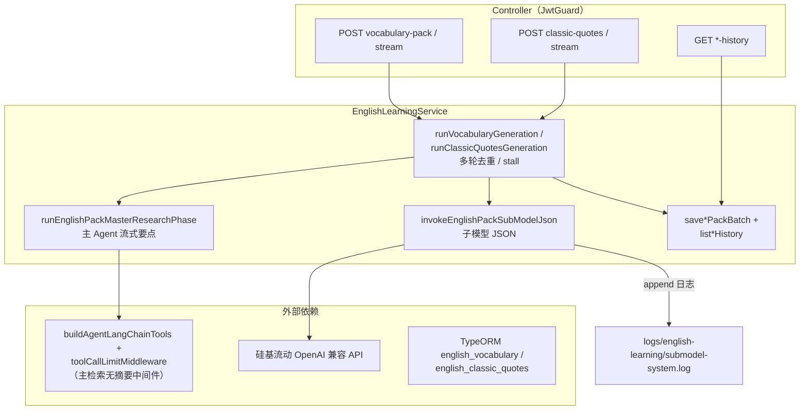

# 英语学习后端（`english-learning`）实现思路

本文整理 `apps/backend/src/services/english-learning` 目录下的**具体实现**：模块边界、HTTP/SSE 接口、主从 Agent、子模型 JSON 生成、多轮去重与持久化，以及关键代码摘录（块内为**讲解用中文注释**，可与仓库注释并存）。**若与仓库最新源码不一致，以源码为准。**

**专题（子模型多轮 prompt、线程、`english-pack` 工具函数、`.type` 等）**：见同目录 [`english-learning-submodel-prompt-thread.md`](./english-learning-submodel-prompt-thread.md)。

**专题（移除用户可选「学习难度」档位、统一语境与 API 面）**：见同目录 [`english-learning-no-level.md`](./english-learning-no-level.md)。

---

## 1. 背景与目标

- **单词包**：按主题生成结构化词条（`word` / `ipa` / `translationZh` / `example`），支持大批量、多轮请求与去重合并。
- **经典句包**：按主题生成名言/台词类条目（`english` / `translationZh` / `source` / `noteZh`），逻辑与单词包共享批大小、stall、多轮线程等模式。
- **已登录增强**：开场跑一次**主 Agent**（硅基流动 + LangChain `createAgent` + 联网 / 知识库 / 日期工具），产出中文检索要点；**子模型**仅用 **JSON 模式**（`response_format: json_object`）批量产出结构化 JSON，不绑定工具。
- **可观测性**：SSE 可推送主 Agent 工具阶段事件；子模型每次请求的 **`[system]` + `[user]`** 可追加写入本地日志文件便于排障。

---

## 2. 改动范围（文件清单）

| 角色                                                | 路径                                                                         |
| --------------------------------------------------- | ---------------------------------------------------------------------------- |
| 服务实现                                            | `apps/backend/src/services/english-learning/english-learning.service.ts`     |
| 英语学习工具函数（流式文本 / 中止 / JSON 引号修复） | `apps/backend/src/utils/english-pack.ts`（经 `src/utils/index.ts` 聚合导出） |
| HTTP / SSE                                          | `apps/backend/src/services/english-learning/english-learning.controller.ts`  |
| Nest 模块                                           | `apps/backend/src/services/english-learning/english-learning.module.ts`      |
| 入参 DTO                                            | `apps/backend/src/services/english-learning/dto/generate-vocabulary.dto.ts`  |
| 单词包批次实体                                      | `apps/backend/src/services/english-learning/english-vocabulary.entity.ts`    |
| 经典句批次实体                                      | `apps/backend/src/services/english-learning/english-classic-quote.entity.ts` |
| 工具与主 Agent 数据路径（延伸阅读）                 | `docs/backend/english-learning-master-agent-web-search-to-llm.md`            |

---

## 3. 架构总览



要点：

1. **主 Agent**：单场生成开始时**最多一次**；输出经 `finalizeMasterResearchAppendix` 截断后得到 `agentResearchAppendix`。
2. **子模型附录**：**不**再拼入每轮 `system`；`system` 仅为固定 JSON 任务指令（各次请求相同，利于上游 **prompt caching** 命中稳定前缀）。附录通过 `buildSubModelUserWithOptionalResearchAppendix`：**仅当** `packAgentThread` 中尚无任何 Human 含 `【检索与知识库要点` 时，将附录前置到本轮 `user`；首轮之后靠线程记忆；若 `trimPackAgentThread` 裁掉含附录的 Human，下一请求会自动再次前置附录（`packAgentThreadHasResearchAppendix` 检测）。
3. **子模型调用**：每轮 / 重试调用 `invokeEnglishPackSubModelJson`；已登录时附带 **`priorThread`**；本地日志写入**完整 `msgs`（system + 历史 + 当前 user）**便于对照。
4. **SSE**：`Observable` 内异步执行生成，进度与 `chunk` 由 `onProgress` 回调驱动；工具事件由 `onAgentTool` 映射为 `vocab.agent_tool` / `classic.agent_tool`。

---

## 4. Nest 模块与依赖

**来源**：`apps/backend/src/services/english-learning/english-learning.module.ts`（约 L1–L23）

```typescript
// 说明：聚合 TypeORM 实体、挂接 Agent 与知识库模块，对外导出 EnglishLearningService 供其他模块复用
@Module({
	imports: [
		KnowledgeQaModule, // 主 Agent 工具链中的知识库 RAG 工厂
		TypeOrmModule.forFeature([
			EnglishVocabularyPackBatch,
			EnglishClassicQuotePackBatch,
		]),
	],
	controllers: [EnglishLearningController],
	providers: [EnglishLearningService],
	exports: [EnglishLearningService],
})
export class EnglishLearningModule {}
```

---

## 5. DTO 与实体

### 5.1 请求体与条数上限

**来源**：`apps/backend/src/services/english-learning/dto/generate-vocabulary.dto.ts`（约 L12–L53）

```typescript
// 说明：与前端约定单次拉取上限，避免超大请求压垮模型与网关
export const ENGLISH_VOCAB_GENERATION_MAX = 12000;
export const ENGLISH_CLASSIC_QUOTES_GENERATION_MAX = 6000;

export class GenerateVocabularyDto {
	@IsString()
	@IsNotEmpty()
	@MaxLength(500) // 说明：主题长度硬上限，与落库 topic 截断对齐思路
	topic!: string;

	@IsOptional()
	@IsInt()
	@Min(1)
	@Max(ENGLISH_VOCAB_GENERATION_MAX)
	count?: number;

	@IsOptional()
	@IsIn(["basic", "intermediate", "advanced"])
	level?: "basic" | "intermediate" | "advanced";
}

// 说明：经典句 DTO 字段与单词包一致，仅 count 上限不同
export class GenerateClassicQuotesDto {
	// ... topic / count / level 同上，max 为 ENGLISH_CLASSIC_QUOTES_GENERATION_MAX
}
```

### 5.2 批次落库表

**来源**：`apps/backend/src/services/english-learning/english-vocabulary.entity.ts`（约 L17–L50）

```typescript
// 说明：流式场景下「每一轮合并后的新词条」写一行；按 userId + streamId + round 建联合索引便于列表与详情查询
@Entity("english_vocabulary")
@Index("idx_ev_pack_batch_user_stream_round", ["userId", "streamId", "round"])
export class EnglishVocabularyPackBatch {
	@PrimaryGeneratedColumn("uuid")
	id!: string;
	@Column({ name: "user_id", type: "int" })
	userId!: number;
	@Column({ name: "stream_id", type: "varchar", length: 36 })
	streamId!: string;
	@Column({ type: "int" })
	round!: number;
	@Column({ type: "varchar", length: 500 })
	topic!: string;
	@Column({ name: "target_count", type: "int" })
	targetCount!: number;
	@Column({ type: "varchar", length: 32, nullable: true })
	level!: string | null;
	@Column({ type: "json" })
	items!: EnglishVocabularyPackItemJson[]; // 说明：仅本轮新增片段，详情接口按 round 顺序拼接
	@CreateDateColumn({ name: "created_at", type: "timestamp" })
	createdAt!: Date;
}
```

经典句实体对称，见 `english-classic-quote.entity.ts`（表名 `english_classic_quotes`）。

---

## 6. Controller：鉴权、SSE 与事件形状

**来源**：`apps/backend/src/services/english-learning/english-learning.controller.ts`（约 L66–L216，摘录 SSE 单词流）

```typescript
// 说明：全局 JwtGuard，从 req.user.userId 取当前用户；未登录直接 401
@Controller("english-learning")
@UseInterceptors(ClassSerializerInterceptor)
@UseGuards(JwtGuard)
export class EnglishLearningController {
	// ...

	@Post("vocabulary-pack/stream")
	@Sse()
	vocabularyPackStream(
		@Req() req: AuthedRequest,
		@Body() dto: GenerateVocabularyDto,
	): Observable<{ data: Record<string, unknown> }> {
		const userId = req.user?.userId;
		if (userId == null) throw new UnauthorizedException("未授权");

		const target = Math.min(
			ENGLISH_VOCAB_GENERATION_MAX,
			Math.max(1, dto.count ?? 10),
		);
		const streamId = randomUUID(); // 说明：本次会话唯一 id，与 DB batch 对齐
		const level = dto.level ?? null;

		return new Observable((subscriber) => {
			// 说明：先发 round=0 进度，便于前端立刻展示进度条
			subscriber.next({
				data: {
					type: "vocab.progress",
					streamId,
					collected: 0,
					target,
					round: 0,
				},
			});

			void (async () => {
				try {
					const items =
						await this.englishLearningService.runVocabularyGeneration(
							dto,
							async (p) => {
								subscriber.next({
									data: {
										type: "vocab.progress",
										streamId,
										collected: p.collected,
										target: p.target,
										round: p.round,
									},
								});
								if (p.newItems?.length) {
									// 说明：边生成边落库，避免进程崩溃丢失已生成部分
									await this.englishLearningService.saveVocabularyPackBatch({
										userId,
										streamId,
										round: p.round,
										topic: dto.topic,
										level,
										targetCount: target,
										items: p.newItems,
									});
									subscriber.next({
										data: {
											type: "vocab.chunk",
											streamId,
											round: p.round,
											collected: p.collected,
											target: p.target,
											items: p.newItems,
										},
									});
								}
							},
							{
								userId,
								// 说明：把主 Agent 工具起止映射为 SSE，供前端展示检索过程
								onAgentTool: async (ev) => {
									subscriber.next({
										data: {
											type: "vocab.agent_tool",
											streamId,
											phase: ev.phase,
											name: typeof ev.name === "string" ? ev.name : "",
											query: englishPackToolInputPreview(ev.input),
										},
									});
								},
							},
						);
					subscriber.next({
						data: {
							type: "vocab.complete",
							success: true,
							streamId,
							items,
							requested: target,
						},
					});
				} catch (e: unknown) {
					// ... vocab.error
				} finally {
					subscriber.complete();
				}
			})();
		});
	}
}
```

经典句流式路径为 `POST classic-quotes/stream`，事件类型为 `classic.progress` / `classic.chunk` / `classic.agent_tool` / `classic.complete` / `classic.error`（实现对称，见同文件约 L305–L411）。

---

## 7. Service：硅基流动配置与双 LLM

**来源**：`apps/backend/src/services/english-learning/english-learning.service.ts`（约 L292–L357，`resolveEnglishPackSiliconFlowConfig` + `buildSiliconFlowPackAgentModels`）

```typescript
// 说明：统一从 Config 读取 API Key（多键名兼容）、baseURL、模型名；缺失时抛 SERVICE_UNAVAILABLE，避免无效重试
private resolveEnglishPackSiliconFlowConfig(): {
	apiKey: string;
	baseURL: string;
	modelName: string;
} {
	const apiKey = (
		this.configService.get<string>(KnowledgeQaEnum.SILICONFLOW_API_KEY) ||
		this.configService.get<string>(KnowledgeQaEnum.DASHSCOPE_API_KEY) ||
		this.configService.get<string>(ModelEnum.QWEN_API_KEY) ||
		''
	).trim();
	// ... baseURL、modelName
	if (!apiKey) {
		throw new HttpException(
			'硅基流动未配置（SILICONFLOW_API_KEY，或兼容 DASHSCOPE_API_KEY / QWEN_API_KEY），无法生成学习内容',
			HttpStatus.SERVICE_UNAVAILABLE,
		);
	}
	return { apiKey, baseURL, modelName };
}

// 说明：主 Agent 检索用流式 main；副模型 summary 仍在本方法返回，供将来其他路径复用；主检索阶段仅解构 main，不再跑 summarizationMiddleware
private buildSiliconFlowPackAgentModels(options: {
	maxTokens?: number;
	temperature?: number;
	signal?: AbortSignal;
}): { main: ChatOpenAI; summary: ChatOpenAI } {
	const { apiKey, baseURL, modelName } = this.resolveEnglishPackSiliconFlowConfig();
	const main = new ChatOpenAI({
		apiKey,
		modelName,
		streaming: true, // 说明：工具型 Agent 需要流式收 chunk
		// ...
	});
	const summary = new ChatOpenAI({
		apiKey,
		modelName: summaryModelName,
		streaming: false,
		// ...
	});
	return { main, summary };
}
```

子模型专用 **`buildSiliconFlowJsonLlm`**：非流式、`modelKwargs.response_format = { type: 'json_object' }`（约 L489–L503），保证输出倾向合法 JSON。

---

## 8. Service：主 Agent 检索阶段

**来源**：`apps/backend/src/services/english-learning/english-learning.service.ts`（约 L131–L144 常量 `ENGLISH_PACK_RESEARCH_SYSTEM_PROMPT`；约 L369–L483 `runEnglishPackMasterResearchPhase`）

```typescript
// 说明：系统提示约束「只整理、输出中文要点、控制字数、勿粘贴原始工具长文」
const ENGLISH_PACK_RESEARCH_SYSTEM_PROMPT = `你是一个只做资料搜集与整理的助手...
5）工具返回（搜索摘要、知识库片段等）可能很长：必须在心中消化后只写入归纳后的要点...
6）最终答复本身必须符合第 3 条字数上限；归纳优先于罗列原材料。`;

private async runEnglishPackMasterResearchPhase(params: {
	userId: number;
	topic: string;
	levelHint: string;
	kind: 'vocabulary' | 'classic_quotes';
	onToolEvent?: (e: EnglishLearningPackAgentToolEvent) => void | Promise<void>;
}): Promise<string> {
	const abortController = new AbortController();
	const timer = setTimeout(() => abortController.abort(), 120_000); // 说明：整段检索超时
	let accumulated = '';
	try {
		const { main: mainLlm } = this.buildSiliconFlowPackAgentModels({
			maxTokens: 8192,
			temperature: 0.35,
			signal: abortController.signal,
		});
		const tools = buildAgentLangChainTools({
			webSearchService: this.webSearchService,
			knowledgeQaService: this.knowledgeQaService,
			userId: params.userId,
		});
		const agent = createAgent({
			model: mainLlm,
			tools,
			systemPrompt: ENGLISH_PACK_RESEARCH_SYSTEM_PROMPT,
			middleware: [
				toolCallLimitMiddleware({
					runLimit: 12,
					threadLimit: 12,
					exitBehavior: 'continue',
				}),
			],
		});
		// ... userHumanText，然后 agent.streamEvents
		for await (const ev of eventStream) {
			if (ev.event === 'on_chat_model_stream') {
				// 说明：仅拼接「模型最终可见文本」；工具返回进入模型上下文由 LangChain 内部完成
				accumulated += extractEnglishPackAgentChunkText(chunk);
			} else if (ev.event === 'on_tool_start' /* ... */) {
				// 说明：透传工具事件给 Controller → SSE
			}
		}
		return this.finalizeMasterResearchAppendix(accumulated);
	} catch (e: unknown) {
		// 说明：AbortError 常见于流收尾；若有已收集正文则返回，否则空串降级
		if (englishPackAgentIsUserAbort(e)) {
			return this.finalizeMasterResearchAppendix(accumulated);
		}
		throw e;
	} finally {
		clearTimeout(timer);
	}
}
```

联网结果如何进入大模型（Tool 消息链路）见：`docs/backend/english-learning-master-agent-web-search-to-llm.md`。

---

## 9. Service：子模型调用、多轮线程与本地日志

**来源**：`apps/backend/src/services/english-learning/english-learning.service.ts`（`appendEnglishPackSubModelMessagesLog`、`invokeEnglishPackSubModelJson` 附近）

```typescript
// 说明：将 llm.invoke 前的完整 BaseMessage[] 按条序列化（序号 + getType() + 正文）后异步追加写盘
private appendEnglishPackSubModelMessagesLog(messages: BaseMessage[]): void {
	// ... 写入 logs/english-learning/submodel-system.log
}

private async invokeEnglishPackSubModelJson(/* ... */): Promise<string> {
	const msgs: BaseMessage[] = [new SystemMessage(params.system)];
	// ... priorThread、HumanMessage(params.user)
	this.appendEnglishPackSubModelMessagesLog(msgs);
	const res = await llm.invoke(msgs);
	// ...
}
```

---

## 10. Service：单词包主循环（附录按需进 user、`system` 固定、去重与 stall）

**来源**：`apps/backend/src/services/english-learning/english-learning.service.ts`（`runVocabularyGeneration`）

```typescript
// 说明：system 仅为固定 JSON 指令，不合并附录；附录由 buildSubModelUserWithOptionalResearchAppendix 按需拼入 user
let agentResearchAppendix = "";
// ... runEnglishPackMasterResearchPhase 填充 ...

while (accumulated.length < count && rounds < maxRounds) {
	for (let dupPass = 0; dupPass < maxDupPasses; dupPass++) {
		const user = `${userBase}${urgency}`;
		const userForModel = this.buildSubModelUserWithOptionalResearchAppendix(
			agentResearchAppendix,
			user,
			packAgentThread,
		);
		const text = await this.invokeEnglishPackSubModelJson({
			system,
			user: userForModel,
			maxTokens: maxTok,
			priorThread: context?.userId != null ? packAgentThread : undefined,
		});
		packAgentThread.push(
			new HumanMessage(userForModel),
			new AIMessage(text.trim().slice(0, 12_000)),
		);
	}
}
```

经典句 `runClassicQuotesGeneration` 与之同构。

---

## 11. Service：JSON 解析鲁棒性（摘录）

**来源**：`apps/backend/src/services/english-learning/english-learning.service.ts`（约 L534–L651，`sliceBalancedJsonObject` + `extractJsonObject` 核心循环）

````typescript
// 说明：从首个 { 开始做括号深度扫描，字符串内括号不计入深度，避免贪婪正则截断错误
private sliceBalancedJsonObject(text: string, start: number): string | null {
	// ... depth / inString / escaped 状态机
}

private extractJsonObject(raw: string): unknown {
	const s = raw.trim().replace(/^\uFEFF/, '');
	const fence = s.match(/```(?:json)?\s*([\s\S]*?)```/i); // 说明：兼容模型包 markdown 围栏
	const candidate = fence?.[1]?.trim() ?? s;

	// 说明：多起点尝试 + 宽松 parse + 字段内未转义引号修复，仍失败则抛 BAD_GATEWAY
	for (let n = 0; n < maxBraceAttempts; n++) {
		const idx = candidate.indexOf('{', searchFrom);
		const slice = this.sliceBalancedJsonObject(candidate, idx);
		try {
			return tryParseWithRepair(slice);
		} catch {
			/* 换下一 { */
		}
	}
	throw new HttpException(/* ... */, HttpStatus.BAD_GATEWAY);
}
````

词条 / 经典句条目抽取见 `extractVocabularyItemsLoose`、`extractClassicQuoteItemsLoose`（宽松字段名、缺省填 `—`）。

---

## 12. Service：批次保存

**来源**：`apps/backend/src/services/english-learning/english-learning.service.ts`（约 L759–L782，`saveVocabularyPackBatch`）

```typescript
async saveVocabularyPackBatch(params: {
	userId: number;
	streamId: string;
	round: number;
	topic: string;
	level: string | null;
	targetCount: number;
	items: VocabularyItemDto[];
}): Promise<void> {
	if (!params.items.length) return;
	const row = this.vocabBatchRepo.create({
		userId: params.userId,
		streamId: params.streamId,
		round: params.round,
		topic: params.topic.trim().slice(0, 500),
		level: params.level,
		targetCount: params.targetCount,
		items: params.items as EnglishVocabularyPackItemJson[],
	});
	await this.vocabBatchRepo.save(row);
}
```

`saveClassicQuotesPackBatch` 对称，使用 `classicBatchRepo`。

---

## 12.1 Token 与「禁止重复」策略（服务端仍为权威）

- **服务端去重不变**：`seen`（`Set`）仍保存**全部**已收录键；`extract*Loose` 后对每条做 `seen.has` 过滤，与裁剪前的行为一致，拉取条数与合并结果不因 prompt 变短而放宽。
- **禁止列表明文裁剪**：`buildSeenKeysExcludePromptForModel` 对传给模型的「禁止重复」逗号列表设 **`TOPIC_PACK_EXCLUDE_PROMPT_MAX_CHARS`**，并从**尾部**优先保留（最近收录优先）；超长时加「已收录节选」说明，提示模型未列出的历史条目亦不可重复。
- **经典句专用**：`TOPIC_PACK_EXCLUDE_CLASSIC_TAIL_ITEMS`、`TOPIC_PACK_EXCLUDE_CLASSIC_ITEM_MAX_CHARS` 控制尾条数与单条节选长度，避免原先「220×240」级 prompt。
- **priorThread 中 AI 条压缩**：入栈不再使用完整 JSON（原 `slice(0, 12_000)`），改为 `buildPackAgentThreadAssistantSnapshot`（单词仅 `words` 数组、经典句为 `english_prefixes`），显著降低多轮 **cached / 非 cached** 输入 token；**当前轮**解析仍用完整 `text`。

---

## 13. 兼容性与运维注意

- **`process.cwd()`**：日志目录相对当前工作目录；在 monorepo 根与 `apps/backend` 下启动时，落盘路径可能不同。
- **子模型日志**：`submodel-system.log` 中记录每次 invoke 的**完整消息列表**（含检索附录所在 Human 与多轮历史），部署时应注意磁盘与隐私（日志文件通常被 `.gitignore` 忽略）。
- **主 Agent `AbortError`**：已在 `runEnglishPackMasterResearchPhase` 中按「可降级」处理，避免误报后整段跳过子模型。

---

## 14. 建议回归用例

| 场景              | 建议                                                                |
| ----------------- | ------------------------------------------------------------------- |
| 未配置硅基 Key    | 应返回 `SERVICE_UNAVAILABLE` 或统一错误文案                         |
| 小 count 单次成功 | `vocabulary-pack` 与 `stream` 结果一致                              |
| 大 count 多轮     | `stall` 触发、`batchCap` 下调、最终条数 ≤ 请求                      |
| 已登录 SSE        | 依次收到 `progress` / `chunk` / `complete`，DB 可按 `streamId` 还原 |
| 主 Agent 失败     | 仍应能仅靠子模型生成（附录为空）                                    |

---

## 15. 相关源码路径速查

| 说明                              | 路径                                                                        |
| --------------------------------- | --------------------------------------------------------------------------- |
| 核心服务                          | `apps/backend/src/services/english-learning/english-learning.service.ts`    |
| 接口层                            | `apps/backend/src/services/english-learning/english-learning.controller.ts` |
| 模块                              | `apps/backend/src/services/english-learning/english-learning.module.ts`     |
| 主 Agent 与 Web Search 注入链说明 | `docs/backend/english-learning-master-agent-web-search-to-llm.md`           |
