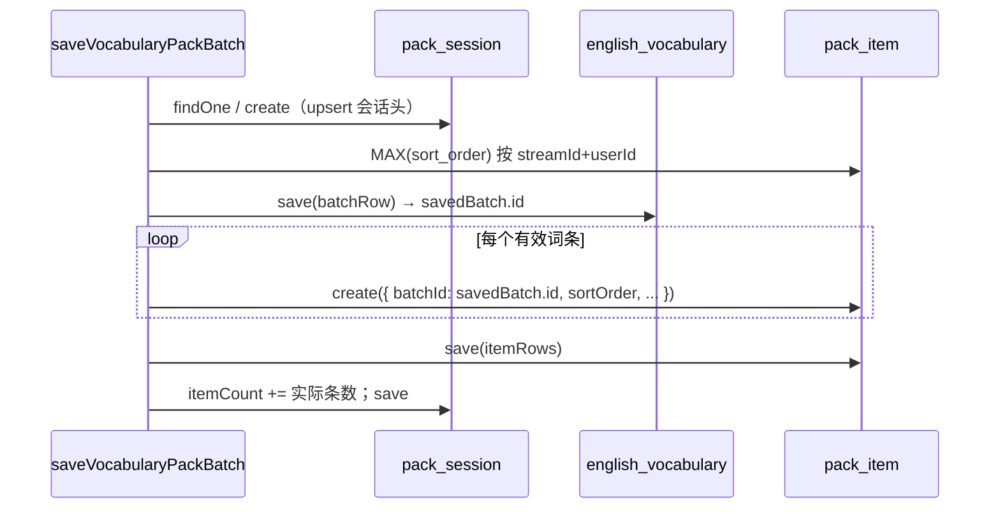

# 英语学习后端：拉取包 Session + 明细分行存储改造报告

本文档针对 `apps/backend/src/services/english-learning` 目录下**本轮存储模型改造**作完整说明：改动背景、分步实现（含带中文注释的代码摘录）、影响面、风险与后续优化建议。前端对接见 [../frontend/english-learning-pack-session-items.md](../frontend/english-learning-pack-session-items.md)。

**若与仓库最新源码不一致，以源码为准。**

---

## 1. 执行摘要

| 维度 | 结论 |
|------|------|
| **核心变更** | 单词包 / 经典句包由「batch 表 `items` JSON _blob」改为 **Session（会话元数据）+ Item（一行一条）+ Batch（轮次审计）** 三层 |
| **对外 API** | 历史详情不再返回全量 `items`；新增 `GET .../history/:streamId/items?limit&offset` 分页明细 |
| **兼容性** | 提供 migration 将旧 JSON 摊平；无 session 时返回空结构（**非 404**） |
| **生成链路** | SSE 落库、主题匹配、去重键加载、库内直出均改为读 **pack_item** / **pack_session** |

---

## 2. 改动背景

### 2.1 旧模型的问题

改造前，`english_vocabulary` / `english_classic_quotes`（batch 表）使用 **`items` JSON 列** 存储每轮 LLM 或库内 chunk 产出的全部词条：

```text
streamId (一次拉取)
  └── batch round=1  →  items: [ {word,...}, ... ]   // 整包 JSON
  └── batch round=2  →  items: [ ... ]
```

带来的问题：

1. **无法稳定分页**：历史详情只能 `find batch ORDER BY round` 后内存拼接 JSON，单次响应体积随条数线性增长（数千条时达 MB 级）。
2. **查询与索引弱**：无法对 `word` / `english` 按行建索引，去重加载需反序列化整包。
3. **迁移与备份成本高**：JSON 列膨胀后表体积大，部分 MySQL 工具难以增量处理。
4. **与「单词库」模型不一致**：`english_vocabulary_library` + `english_vocabulary_library_item` 已是「库 + 行」，拉取结果却用另一套 blob 模型，维护两套心智负担。

### 2.2 目标模型（对齐 library item）

参考 `english_vocabulary_library_item` 的成功模式：

| 表 | 粒度 | 主键 / 排序 | 用途 |
|----|------|-------------|------|
| `*_pack_session` | 1 streamId = 1 行 | `stream_id` PK | `topic`、`targetCount`、`itemCount`、`updated_at`（历史列表排序） |
| `*_pack_item` | 1 词/句 = 1 行 | UUID；`sort_order` 会话内递增 | 分页 `ORDER BY sort_order ASC` |
| `english_vocabulary` / `english_classic_quotes`（batch） | 1 round = 1 行 | UUID | **仅审计**：`round`、`item_count`；**删除 `items` JSON** |

### 2.3 设计原则

- **streamId 不变**：与 SSE、`EnglishPackWebSearchRecord`、中止注册表一致，全链路主键仍为单次拉取会话 ID。
- **sortOrder 会话内全局递增**：跨 round 连续编号，还原顺序 = 落库顺序，分页简单。
- **batchId 可空外键**：item 行关联本轮 batch UUID，便于排查「第几轮写入」。
- **空即空，非错误**：无 session 或 `itemCount=0` 时 API 返回空结构，避免前端误弹「未找到记录」。

---

## 3. 改动文件清单

### 3.1 新增

| 文件 | 说明 |
|------|------|
| `english-vocabulary-pack-session.entity.ts` | 单词会话 |
| `english-vocabulary-pack-item.entity.ts` | 单词明细 |
| `english-classic-quotes-pack-session.entity.ts` | 经典句会话 |
| `english-classic-quotes-pack-item.entity.ts` | 经典句明细 |
| `migrations/1779200000000-english-pack-item-rows.ts` | 建表、摊平、删列 |

### 3.2 修改

| 文件 | 说明 |
|------|------|
| `english-vocabulary.entity.ts` | 删除 `items` 列定义；新增 `itemCount` |
| `english-classic-quote.entity.ts` | 同上 |
| `english-learning.module.ts` | `TypeOrmModule.forFeature` 注册 4 实体 |
| `english-learning.service.ts` | 注入 Repo、落库、历史读、去重/库内加载 |
| `english-learning.controller.ts` | `.../items` 路由 |
| `constant.ts` | `PACK_HISTORY_ITEMS_PAGE_MAX = 200` |

### 3.3 未改（行为保持）

- SSE 事件形态、`save*PackBatch` 的**调用点**（仍在每轮/chunk 完成后调用）。
- 主从 Agent、子模型 JSON、联网检索、收藏/导入库等模块边界。
- `EnglishPackWebSearchRecord` 表结构。

---

## 4. 数据模型详解

### 4.1 Session 实体（单词）

**来源**：`apps/backend/src/services/english-learning/english-vocabulary-pack-session.entity.ts`（全文）

```typescript
/**
 * 单次单词包拉取会话元数据（一行一流），供历史列表与详情头信息。
 */
@Entity('english_vocabulary_pack_session')
@Index('idx_evps_user_updated', ['userId', 'updatedAt'])
export class EnglishVocabularyPackSession {
	/** 与 SSE / 中止 / 联网记录共用的 streamId，全局唯一 */
	@PrimaryColumn({ name: 'stream_id', type: 'varchar', length: 36 })
	streamId!: string;

	@Column({ name: 'user_id', type: 'int' })
	userId!: number;

	@Column({ type: 'varchar', length: 500 })
	topic!: string;

	@Column({ name: 'target_count', type: 'int' })
	targetCount!: number;

	/** 累计写入 pack_item 的有效条数（与分页接口 itemCount 一致） */
	@Column({ name: 'item_count', type: 'int', default: 0 })
	itemCount!: number;

	@CreateDateColumn({ name: 'created_at', type: 'timestamp' })
	createdAt!: Date;

	/** 每次 saveVocabularyPackBatch 成功写 item 后会 touch，供 listVocabularyHistory 倒序 */
	@UpdateDateColumn({ name: 'updated_at', type: 'timestamp' })
	updatedAt!: Date;
}
```

经典句 `EnglishClassicQuotesPackSession` 表名 `english_classic_quotes_pack_session`，字段对称。

### 4.2 Item 实体（单词）

**来源**：`apps/backend/src/services/english-learning/english-vocabulary-pack-item.entity.ts`（全文）

```typescript
@Entity('english_vocabulary_pack_item')
@Index('idx_evpi_user_stream_sort', ['userId', 'streamId', 'sortOrder'])
@Index('idx_evpi_stream_sort', ['streamId', 'sortOrder'])
export class EnglishVocabularyPackItem {
	@PrimaryGeneratedColumn('uuid')
	id!: string;

	@Column({ name: 'user_id', type: 'int' })
	userId!: number;

	@Column({ name: 'stream_id', type: 'varchar', length: 36 })
	streamId!: string;

	/** 来自哪一轮 batch（审计），与 batch.round 一致 */
	@Column({ type: 'int' })
	round!: number;

	/** 会话内从 0 递增；分页与还原顺序的唯一依据 */
	@Column({ name: 'sort_order', type: 'int' })
	sortOrder!: number;

	@Column({ name: 'batch_id', type: 'varchar', length: 36, nullable: true })
	batchId!: string | null;

	@Column({ type: 'varchar', length: 500 })
	word!: string;

	@Column({ type: 'varchar', length: 2000, default: '' })
	ipa!: string;

	@Column({ type: 'varchar', length: 64, default: '' })
	pos!: string;

	@Column({ name: 'translation_zh', type: 'text' })
	translationZh!: string;

	@Column({ type: 'text' })
	example!: string;
}
```

### 4.3 Batch 实体瘦身

**来源**：`apps/backend/src/services/english-learning/english-vocabulary.entity.ts`（约 L19–L52）

```typescript
@Entity('english_vocabulary')
export class EnglishVocabularyPackBatch {
	@PrimaryGeneratedColumn('uuid')
	id!: string;

	@Column({ name: 'user_id', type: 'int' })
	userId!: number;

	@Column({ name: 'stream_id', type: 'varchar', length: 36 })
	streamId!: string;

	@Column({ type: 'int' })
	round!: number;

	@Column({ type: 'varchar', length: 500 })
	topic!: string;

	@Column({ name: 'target_count', type: 'int' })
	targetCount!: number;

	/**
	 * 本轮实际写入 pack_item 的条数（审计）。
	 * 明细已迁至 english_vocabulary_pack_item，本表不再存 items JSON。
	 */
	@Column({ name: 'item_count', type: 'int', default: 0 })
	itemCount!: number;

	@CreateDateColumn({ name: 'created_at', type: 'timestamp' })
	createdAt!: Date;
}
```

**说明**：TypeORM 实体已移除 `items` 字段；数据库列由 migration `DROP COLUMN items` 删除。`EnglishVocabularyPackItemJson` 类型仍保留于同文件，供导入解析等逻辑复用。

### 4.4 `EnglishVocabularyPackBatch` 与 `EnglishVocabularyPackItem` 的关联关系

本节说明表 `english_vocabulary`（实体 `EnglishVocabularyPackBatch`）与 `english_vocabulary_pack_item`（实体 `EnglishVocabularyPackItem`）**如何关联、何时写入、读取时是否依赖该关联**。经典句包对称：`english_classic_quotes` ↔ `english_classic_quotes_pack_item`，字段与流程一致，下文以单词包为例。

#### 4.4.1 三层结构总览

二者**不是** TypeORM `@ManyToOne` / `@OneToMany` 关系，数据库也**未**对 `batch_id` 建 `FOREIGN KEY`；关联由**应用层在落库时赋值** + **冗余维度字段**完成。完整一次 SSE 拉取还依赖 Session 表用同一 `streamId` 串起会话元数据：

```text
一次 SSE 拉取（streamId = 固定 UUID，全链路主键）
│
├── english_vocabulary_pack_session          ← 会话头：topic、累计 item_count
│       PK: stream_id
│
├── english_vocabulary（PackBatch）          ← 每一「轮」一条审计行
│       id (UUID)  ─────────────────────────┐
│       user_id, stream_id, round           │  batch_id（逻辑外键，可空）
│       item_count = 本轮请求条数（审计）    │
│                                           │
└── english_vocabulary_pack_item（PackItem）┘
        user_id, stream_id, round（与当轮 batch 一致，冗余）
        sort_order（会话内全局递增，分页主序）
        word, ipa, …（词条正文，唯一承载处）
```

| 表 | 实体 | 粒度 | 是否存词条正文 |
|----|------|------|----------------|
| `english_vocabulary_pack_session` | `EnglishVocabularyPackSession` | 1 次拉取 = 1 行 | 否 |
| `english_vocabulary` | `EnglishVocabularyPackBatch` | 1 轮 SSE/chunk = 1 行 | **否**（已删除 `items` JSON） |
| `english_vocabulary_pack_item` | `EnglishVocabularyPackItem` | 1 个词 = 1 行 | **是** |

Batch 与 Item 在业务上是 **1 : N**：一轮 batch 对应本轮写入的多行 item；Item 通过 `batch_id` 指向「是哪一轮 batch 写进来的」。

#### 4.4.2 字段级关联

| 关联方式 | Batch 字段 | Item 字段 | 说明 |
|----------|------------|-----------|------|
| **会话维度** | `stream_id`, `user_id` | `stream_id`, `user_id` | 同属一次拉取；查全量词条主要用 Item 的 `(userId, streamId)`，**不必 join Batch** |
| **轮次维度** | `round` | `round` | 与当次 `saveVocabularyPackBatch(params.round)` 一致；用于审计「第几轮写入」，**不是**还原列表的主键 |
| **直接关联** | `id` (UUID PK) | `batch_id` (varchar 36, **nullable**) | 写入时 `batch_id = savedBatch.id`；迁移/异常可为 `null` |
| **顺序（仅 Item）** | — | `sort_order` | 整个 `streamId` 内从 0 连续递增（**跨 round 不断号**）；分页、`ORDER BY sort_order ASC` 的唯一依据 |
| **数量** | `item_count` | 行数 | Batch：本轮 `params.items.length`（审计）；Session：`item_count` 累加**实际落库**条数；无效词（如无 ipa）会 skip，故 Item 行数可能小于 Batch.`item_count` |

Batch 表索引（会话 + 轮次审计）：

**来源**：`apps/backend/src/services/english-learning/english-vocabulary.entity.ts`（约 L22–L23）

```typescript
@Index('idx_ev_pack_batch_user_stream_round', ['userId', 'streamId', 'round'])
export class EnglishVocabularyPackBatch {
```

Item 表索引（分页与按用户查流）：

**来源**：`apps/backend/src/services/english-learning/english-vocabulary-pack-item.entity.ts`（约 L12–L13）

```typescript
@Index('idx_evpi_user_stream_sort', ['userId', 'streamId', 'sortOrder'])
@Index('idx_evpi_stream_sort', ['streamId', 'sortOrder'])
```

**为何不用数据库外键**：与 `english_vocabulary_library_item` 一致，避免 batch 审计行删除/归档时级联约束复杂化；`batch_id` 仅作排查与可选「按轮查词」的软引用。

#### 4.4.3 写入时如何建立关联（唯一绑定时机）

关联在 `saveVocabularyPackBatch` **同一事务**内按固定顺序建立，Session 与 Batch/Item 仅共享 `streamId`，无 `session_id` 外键：



**来源**：`apps/backend/src/services/english-learning/english-learning.service.ts`（`saveVocabularyPackBatch`，约 L1870–L1940）

```typescript
await this.dataSource.transaction(async (manager) => {
	const sessionRepo = manager.getRepository(EnglishVocabularyPackSession);
	const itemRepo = manager.getRepository(EnglishVocabularyPackItem);
	const batchRepo = manager.getRepository(EnglishVocabularyPackBatch);

	// 1) upsert session（与 batch/item 仅通过 streamId 逻辑关联）
	let session = await sessionRepo.findOne({
		where: { streamId: params.streamId, userId: params.userId },
	});
	// ... 不存在则 create，存在则更新 topic / targetCount

	// 2) 会话内全局 sort_order 续号（跨 round 连续）
	const maxRaw = await itemRepo
		.createQueryBuilder('i')
		.select('MAX(i.sortOrder)', 'maxSort')
		.where('i.streamId = :streamId', { streamId: params.streamId })
		.andWhere('i.userId = :userId', { userId: params.userId })
		.getRawOne();
	let sortOrder = maxRaw?.maxSort != null ? Number(maxRaw.maxSort) + 1 : 0;

	// 3) 先落 batch，拿到主键 id
	const batchRow = batchRepo.create({
		userId: params.userId,
		streamId: params.streamId,
		round: params.round,
		topic,
		itemCount: params.items.length, // 本轮请求条数（审计）
	});
	const savedBatch = await batchRepo.save(batchRow);

	// 4) 再 bulk 写 item，batchId 指向本轮 batch
	const itemRows: EnglishVocabularyPackItem[] = [];
	for (const it of params.items) {
		const word = it.word.trim().slice(0, 500);
		const ipa = it.ipa.trim().slice(0, 2000);
		if (!word || !ipa) continue; // 跳过无效行，不写 item
		itemRows.push(
			itemRepo.create({
				userId: params.userId,
				streamId: params.streamId,
				round: params.round,
				sortOrder,
				batchId: savedBatch.id, // ← Batch 与 Item 的直接关联
				word,
				ipa,
				// pos, translationZh, example ...
			}),
		);
		sortOrder += 1;
	}
	if (itemRows.length) {
		await itemRepo.save(itemRows);
		session.itemCount += itemRows.length; // Session 累计的是实际落库条数
	}
	await sessionRepo.save(session);
});
```

要点：

1. **必须先 `save` Batch**，才有 `savedBatch.id` 写入 Item.`batch_id`。
2. 同一 `streamId` 多轮调用时：每轮 **1 条** 新 Batch、**N 条** 新 Item；`sort_order` 在轮次之间**不断号**。
3. Batch.`item_count` 取 `params.items.length`；Session.`item_count` 只加**通过校验并 save 的行数**。

按轮反查词条（运维/排查，非主路径）示例 SQL：

```sql
SELECT * FROM english_vocabulary_pack_item
WHERE batch_id = '<english_vocabulary.id>';
```

#### 4.4.4 读取路径：何时用到 Batch↔Item 关联

| 场景 | 主要表 | 是否 join / 使用 `batch_id` |
|------|--------|------------------------------|
| 历史列表 `listVocabularyHistory` | `pack_session` | 否 |
| 历史详情 meta `getVocabularyHistoryDetail` | `pack_session` | 否 |
| 明细分页 `listVocabularyPackItems` | `pack_item` WHERE `streamId` ORDER BY `sort_order` | 否 |
| 生成前去重、库内直出 | `pack_item` | 否 |
| 按轮审计（若产品需要） | `pack_item` WHERE `batch_id` | **是** |

改造后**业务主路径只认 Item + Session**；Batch 保留轮次审计，与旧架构「每轮一行 + JSON」在表名上兼容，但词条正文已不再出现在 Batch 表。

#### 4.4.5 与改造前对比

| 维度 | 改造前 | 改造后 |
|------|--------|--------|
| 词条存放 | `english_vocabulary.items` JSON 数组 | `english_vocabulary_pack_item` 每行一词 |
| Batch ↔ 词条 | 嵌在同一行 JSON 内 | Item.`batch_id` → Batch.`id`（软关联） |
| 还原完整列表 | 查多行 batch，内存拼 JSON | 查 item，`ORDER BY sort_order` 分页 |
| TypeORM 关系 | 无 item 实体 | 仍无 `@Relation`，靠字段 + 写入赋值 |

表名仍为 `english_vocabulary`、实体文件仍为 `english-vocabulary.entity.ts`，语义已是 **PackBatch（轮次审计）**，勿与「单词库表」混淆。

---

## 5. 模块注册与依赖注入

### 5.1 实现步骤

1. 在 `english-learning.module.ts` 的 `TypeOrmModule.forFeature([...])` 中注册 4 个新实体。
2. 在 `EnglishLearningService` 构造函数中 `@InjectRepository` 注入 `vocabPackSessionRepo`、`vocabPackItemRepo`、`classicPackSessionRepo`、`classicPackItemRepo`。
3. 保留原有 `vocabBatchRepo` / `classicBatchRepo`（审计与兼容查询）。

**来源**：`apps/backend/src/services/english-learning/english-learning.module.ts`（约 L22–L40）

```typescript
TypeOrmModule.forFeature([
	EnglishVocabularyPackBatch,
	EnglishVocabularyPackSession,   // 新增
	EnglishVocabularyPackItem,      // 新增
	EnglishClassicQuotePackBatch,
	EnglishClassicQuotesPackSession,  // 新增
	EnglishClassicQuotesPackItem,     // 新增
	EnglishPackWebSearchRecord,
	// ... favorites / libraries 不变
]),
```

**来源**：`apps/backend/src/services/english-learning/english-learning.service.ts`（构造函数片段，约 L217–L234）

```typescript
constructor(
	private readonly dataSource: DataSource,
	// ...
	@InjectRepository(EnglishVocabularyPackBatch)
	private readonly vocabBatchRepo: Repository<EnglishVocabularyPackBatch>,
	@InjectRepository(EnglishVocabularyPackSession)
	private readonly vocabPackSessionRepo: Repository<EnglishVocabularyPackSession>,
	@InjectRepository(EnglishVocabularyPackItem)
	private readonly vocabPackItemRepo: Repository<EnglishVocabularyPackItem>,
	@InjectRepository(EnglishClassicQuotePackBatch)
	private readonly classicBatchRepo: Repository<EnglishClassicQuotePackBatch>,
	@InjectRepository(EnglishClassicQuotesPackSession)
	private readonly classicPackSessionRepo: Repository<EnglishClassicQuotesPackSession>,
	@InjectRepository(EnglishClassicQuotesPackItem)
	private readonly classicPackItemRepo: Repository<EnglishClassicQuotesPackItem>,
	// ...
) {}
```

---

## 6. 数据库迁移

### 6.1 实现步骤

1. **建表**：四张 session/item 表（`CREATE TABLE IF NOT EXISTS`）。
2. **检测旧列**：`information_schema` 判断 `english_vocabulary.items` 是否存在。
3. **摊平**：`migrateVocabBatches` / `migrateClassicBatches` 读取 batch JSON，按 round 顺序写入 item，并 `INSERT ... ON DUPLICATE KEY UPDATE` session。
4. **删列**：`ALTER TABLE ... DROP COLUMN items`。
5. **补列**：若无 `item_count` 则 `ADD item_count int DEFAULT 0`。
6. **down**：恢复 JSON 列并删新表（生产慎用）。

### 6.2 摊平逻辑要点

- 使用 `Map<streamId, sortBase>` 维护每个会话当前最大 `sort_order`，跨 batch 连续编号。
- 无效词条跳过（单词：`!word || !ipa`；经典句：`!english || !translationZh`）。
- session 的 `item_count` 按迁移插入条数累加（`ON DUPLICATE KEY UPDATE item_count = item_count + VALUES(item_count)`）。

**来源**：`apps/backend/src/migrations/1779200000000-english-pack-item-rows.ts`（`migrateVocabBatches` 核心，约 L154–L237）

```typescript
private async migrateVocabBatches(queryRunner: QueryRunner): Promise<void> {
	const batches = await queryRunner.query(
		`SELECT id, user_id, stream_id, round, topic, target_count, items, created_at
		 FROM english_vocabulary WHERE items IS NOT NULL`,
	);

	const sortByStream = new Map<string, number>(); // streamId → 当前最大 sort_order

	for (const b of batches) {
		const items = this.parseJsonArray(b.items);
		if (!items.length) {
			await queryRunner.query(
				`UPDATE english_vocabulary SET item_count = 0 WHERE id = ?`,
				[b.id],
			);
			continue;
		}

		let sortBase = sortByStream.get(b.stream_id) ?? -1;
		let inserted = 0;

		for (const raw of items) {
			// 校验 word/ipa，sortBase++，INSERT INTO english_vocabulary_pack_item ...
			inserted += 1;
		}
		sortByStream.set(b.stream_id, sortBase);

		// upsert session：累计 item_count，updated_at 取 GREATEST
		await queryRunner.query(
			`INSERT INTO english_vocabulary_pack_session (...) VALUES (...)
			 ON DUPLICATE KEY UPDATE
			 item_count = item_count + VALUES(item_count),
			 updated_at = GREATEST(updated_at, VALUES(updated_at))`,
			[/* stream_id, user_id, topic, target_count, inserted, created_at */],
		);

		await queryRunner.query(
			`UPDATE english_vocabulary SET item_count = ? WHERE id = ?`,
			[inserted, b.id],
		);
	}
}
```

### 6.3 部署检查项

- [ ] 生产执行 `pnpm migration:run`（或项目等价命令），确认 `1779200000000-english-pack-item-rows` 成功。
- [ ] 抽样：`session.item_count` 与 `COUNT(*)` from pack_item 按 stream_id 一致。
- [ ] 确认 `english_vocabulary.items` 列已删除，避免 TypeORM `synchronize` 与 migration 冲突。

---

## 7. 写入路径：saveVocabularyPackBatch / saveClassicQuotesPackBatch

### 7.1 实现步骤（单次调用，通常对应 SSE 一轮或库内一个 chunk）

| 步骤 | 动作 |
|------|------|
| 1 | 空 `items` 直接 return |
| 2 | 开启 `dataSource.transaction` |
| 3 | upsert **Session**（首包 create，后续更新 topic/targetCount） |
| 4 | `MAX(sort_order)` 计算本批起始序号 |
| 5 | insert **Batch**（`itemCount = params.items.length`） |
| 6 | 循环校验并 build **Item** 行，`sortOrder++` |
| 7 | `itemRepo.save` + `session.itemCount += 实际条数` + `sessionRepo.save` |

**来源**：`apps/backend/src/services/english-learning/english-learning.service.ts`（`saveVocabularyPackBatch`，约 L1860–L1941）

```typescript
async saveVocabularyPackBatch(params: {
	userId: number;
	streamId: string;
	round: number;
	topic: string;
	targetCount: number;
	items: VocabularyItemDto[];
}): Promise<void> {
	if (!params.items.length) return;
	const topic = params.topic.trim().slice(0, 500);

	await this.dataSource.transaction(async (manager) => {
		const sessionRepo = manager.getRepository(EnglishVocabularyPackSession);
		const itemRepo = manager.getRepository(EnglishVocabularyPackItem);
		const batchRepo = manager.getRepository(EnglishVocabularyPackBatch);

		// --- Session upsert ---
		let session = await sessionRepo.findOne({
			where: { streamId: params.streamId, userId: params.userId },
		});
		if (!session) {
			session = sessionRepo.create({
				streamId: params.streamId,
				userId: params.userId,
				topic,
				targetCount: params.targetCount,
				itemCount: 0,
			});
		} else {
			session.topic = topic;
			session.targetCount = params.targetCount;
		}

		// --- sortOrder 接续（跨 round 全局递增）---
		const maxRaw = await itemRepo
			.createQueryBuilder('i')
			.select('MAX(i.sortOrder)', 'maxSort')
			.where('i.streamId = :streamId', { streamId: params.streamId })
			.andWhere('i.userId = :userId', { userId: params.userId })
			.getRawOne<{ maxSort: string | number | null }>();
		let sortOrder =
			maxRaw?.maxSort != null ? Number(maxRaw.maxSort) + 1 : 0;

		// --- Batch 审计行（无 JSON）---
		const savedBatch = await batchRepo.save(
			batchRepo.create({
				userId: params.userId,
				streamId: params.streamId,
				round: params.round,
				topic,
				targetCount: params.targetCount,
				itemCount: params.items.length,
			}),
		);

		// --- Item 明细行 ---
		const itemRows: EnglishVocabularyPackItem[] = [];
		for (const it of params.items) {
			const word = it.word.trim().slice(0, 500);
			const ipa = it.ipa.trim().slice(0, 2000);
			if (!word || !ipa) continue; // 与生成校验一致，无效不入库
			itemRows.push(
				itemRepo.create({
					userId: params.userId,
					streamId: params.streamId,
					round: params.round,
					sortOrder,
					batchId: savedBatch.id,
					word,
					ipa,
					pos: typeof it.pos === 'string' ? it.pos.trim().slice(0, 64) : '',
					translationZh: String(it.translationZh ?? '—').trim().slice(0, 8000),
					example: String(it.example ?? '—').trim().slice(0, 8000),
				}),
			);
			sortOrder += 1;
		}

		if (itemRows.length) {
			await itemRepo.save(itemRows);
			session.itemCount += itemRows.length; // 以实际写入为准
		}
		await sessionRepo.save(session);
	});
}
```

`saveClassicQuotesPackBatch`（约 L2468–L2545）结构完全对称，校验 `english` + `translationZh`，写入 `english_classic_quotes_pack_*` 表。

### 7.2 与 SSE 的关系

- Controller 流式回调在每轮合并新词后仍调用 `saveVocabularyPackBatch` / `saveClassicQuotesPackBatch`。
- **对外 SSE payload 不变**；变化仅在持久化层「多写 session/item 表」。
- 同一 `streamId` 多次调用时，`itemCount` 与 `sortOrder` 单调递增，保证历史还原顺序与直播一致。

---

## 8. 读取路径：历史列表 / 详情 / 明细分页

### 8.1 listVocabularyHistory（改造后）

**原逻辑**：`GROUP BY stream_id` 聚合 batch，累加 JSON `items.length`。

**现逻辑**：直接查 `vocabPackSessionRepo`，`order: { updatedAt: 'DESC' }`，`wordCount = session.itemCount`。

**来源**：`apps/backend/src/services/english-learning/english-learning.service.ts`（约 L3378–L3413）

```typescript
async listVocabularyHistory(userId: number, options?: { limit?: number; offset?: number }) {
	const sessions = await this.vocabPackSessionRepo.find({
		where: { userId },
		order: { updatedAt: 'DESC' },
		take: limit,
		skip: offset,
	});
	if (!sessions.length) return [];

	const streamIds = sessions.map((s) => s.streamId);
	// 批量查 packWebSearch 轮数（不变）
	const wsRows = await this.packWebSearchRepo.find({
		where: { userId, streamId: In(streamIds), packKind: 'vocabulary' },
	});

	return sessions.map((s) => ({
		streamId: s.streamId,
		topic: s.topic,
		targetCount: s.targetCount,
		wordCount: s.itemCount, // 直接来自 session，无需扫 JSON
		createdAt: s.createdAt.toISOString(),
		updatedAt: s.updatedAt.toISOString(),
		webSearchRoundCount: wsCountByStream.get(s.streamId) ?? 0,
	}));
}
```

**影响**：仅出现在 **session 表** 中的拉取会出现在列表；若 migration 未跑、仅有旧 batch 无 session，则**不会出现在新列表**（需跑迁移或重新拉取）。

### 8.2 getVocabularyHistoryDetail（瘦身）

**原逻辑**：查全部 batch，拼接 `items` 数组返回。

**现逻辑**：只返回 meta + `itemCount` + `webSearchRounds`；**无 `items` 字段**。

**来源**：`apps/backend/src/services/english-learning/english-learning.service.ts`（约 L3419–L3453）

```typescript
async getVocabularyHistoryDetail(userId: number, streamId: string) {
	const session = await this.vocabPackSessionRepo.findOne({
		where: { userId, streamId },
	});
	if (!session) {
		// 产品语义：空会话，非 404（避免前端 Toast「未找到该单词记录」）
		return {
			streamId,
			topic: '',
			targetCount: 0,
			itemCount: 0,
			createdAt: new Date(0).toISOString(),
			webSearchRounds: [],
		};
	}
	const ws = await this.packWebSearchRepo.findOne({
		where: { userId, streamId, packKind: 'vocabulary' },
	});
	return {
		streamId,
		topic: session.topic,
		targetCount: session.targetCount,
		itemCount: session.itemCount,
		createdAt: session.createdAt.toISOString(),
		webSearchRounds: Array.isArray(ws?.searchRounds) ? ws.searchRounds : [],
	};
}
```

### 8.3 listVocabularyPackItems（新增）

**来源**：`apps/backend/src/services/english-learning/english-learning.service.ts`（约 L3456–L3487）

```typescript
async listVocabularyPackItems(userId: number, streamId: string, options?) {
	const session = await this.vocabPackSessionRepo.findOne({
		where: { userId, streamId },
	});
	if (!session) {
		return { streamId, itemCount: 0, items: [] };
	}

	const limit = Math.min(
		PACK_HISTORY_ITEMS_PAGE_MAX, // constant.ts = 200
		Math.max(1, options?.limit ?? 100),
	);
	const offset = Math.max(0, options?.offset ?? 0);

	const rows = await this.vocabPackItemRepo.find({
		where: { userId, streamId },
		order: { sortOrder: 'ASC' },
		take: limit,
		skip: offset,
	});

	return {
		streamId,
		itemCount: session.itemCount,
		items: rows.map((r) => this.mapVocabPackItemRow(r)),
	};
}
```

**来源**：`apps/backend/src/services/english-learning/constant.ts`（约 L61–L62）

```typescript
/** 历史/结果页按 streamId 分页拉取单词或语句时每页上限 */
export const PACK_HISTORY_ITEMS_PAGE_MAX = 200;
```

经典句三接口（`listClassicQuotesHistory`、`getClassicQuotesHistoryDetail`、`listClassicQuotesPackItems`）逻辑对称。

---

## 9. HTTP 路由

### 9.1 实现步骤

1. 注册 **`GET vocabulary-history/:streamId/items`**（须在或等同于更具体路径，避免被 `:streamId` 详情路由遮蔽）。
2. 经典句：`GET classic-quotes-history/:streamId/items`。
3. Query：`limit`（默认 100）、`offset`（默认 0）；Controller 层 parseInt 后传入 Service。

**来源**：`apps/backend/src/services/english-learning/english-learning.controller.ts`（单词，约 L302–L338）

```typescript
/** 分页明细：按 sortOrder */
@Get('vocabulary-history/:streamId/items')
async listVocabularyPackItems(
	@Req() req: AuthedRequest,
	@Param('streamId') streamId: string,
	@Query('limit') limitStr?: string,
	@Query('offset') offsetStr?: string,
) {
	const userId = req.user?.userId;
	if (userId == null) throw new UnauthorizedException('未授权');
	const limit = Math.max(1, Number.parseInt(limitStr ?? '100', 10) || 100);
	const offset = Math.max(0, Number.parseInt(offsetStr ?? '0', 10) || 0);
	const data = await this.englishLearningService.listVocabularyPackItems(
		userId,
		streamId,
		{ limit, offset },
	);
	return { success: true, data };
}

/** 元数据：无 items 数组 */
@Get('vocabulary-history/:streamId')
async getVocabularyHistoryDetail(/* ... */) { /* ... */ }
```

### 9.2 API 契约小结

| 方法 | 路径 | 响应 `data` 要点 |
|------|------|------------------|
| GET | `/english-learning/vocabulary-history` | `VocabularyHistoryListItem[]`，`wordCount` = session.itemCount |
| GET | `/english-learning/vocabulary-history/:streamId` | meta + `itemCount`，**无 items** |
| GET | `/english-learning/vocabulary-history/:streamId/items` | `{ streamId, itemCount, items[] }` |

---

## 10. 生成链路连带改造（非 HTTP 表面，但属同一改动）

### 10.1 主题匹配索引 createPackTopicMatchIndexForUser

**改动**：历史标签来源由 `vocabBatchRepo.find` 改为 `vocabPackSessionRepo.find`，取 `session.topic`。

**来源**：`apps/backend/src/services/english-learning/english-learning.service.ts`（约 L836–L852）

```typescript
if (kind === 'vocabulary') {
	const [sessions, libraries] = await Promise.all([
		this.vocabPackSessionRepo.find({
			where: { userId },
			order: { updatedAt: 'DESC' },
			take: PACK_GENERATION_TOPIC_HISTORY_BATCH_ROWS,
		}),
		this.vocabLibraryRepo.find({ /* ... */ }),
	]);
	labels = this.collectUniquePackTopicLabels(
		sessions.map((s) => s.topic), // 不再从 batch 多行的 topic 去重
		libraries.map((lib) => lib.title),
	);
}
```

### 10.2 生成前去重 loadExistingPackKeysForGeneration

**改动**：对主题相关的每个 session，从 `vocabPackItemRepo` 按 `streamId` 分页取 `word`/`english`（`select` + `take`），不再解析 batch JSON。

**来源**：`apps/backend/src/services/english-learning/english-learning.service.ts`（约 L923–L943）

```typescript
const sessions = await this.vocabPackSessionRepo.find({
	where: { userId },
	order: { updatedAt: 'DESC' },
	take: PACK_GENERATION_TOPIC_HISTORY_BATCH_ROWS,
});
for (const s of sessions) {
	if (!topicMatch.isRelated(s.topic)) continue;
	if (keys.size >= maxKeys) break;
	const rows = await this.vocabPackItemRepo.find({
		where: { userId, streamId: s.streamId },
		select: ['word'],
		order: { sortOrder: 'DESC' },
		take: maxKeys - keys.size,
	});
	this.addPackExcludeKeys(
		keys,
		rows.map((r) => this.normalizePackVocabKey(r.word)),
		maxKeys,
	);
}
```

### 10.3 库内直出 loadTopicRelatedVocabularyItemsFromDb

**改动**：除 library item 外，对匹配主题的 **pack session** 调用 `loadVocabItemsFromPackSessionPaginated`，内部按 `sortOrder ASC` 分页读 pack_item。

**来源**：`apps/backend/src/services/english-learning/english-learning.service.ts`（`loadVocabItemsFromPackSessionPaginated`，约 L1192–L1219）

```typescript
private async loadVocabItemsFromPackSessionPaginated(
	userId: number,
	streamId: string,
	items: VocabularyItemDto[],
	seen: Set<string>,
	limit: number,
): Promise<void> {
	let skip = 0;
	while (items.length < limit) {
		const rows = await this.vocabPackItemRepo.find({
			where: { userId, streamId },
			order: { sortOrder: 'ASC' },
			take: PACK_TOPIC_LIBRARY_ITEMS_PAGE_SIZE,
			skip,
		});
		if (rows.length === 0) break;
		for (const row of rows) {
			this.tryPushVocabItemDeduped(
				items,
				seen,
				this.mapVocabPackItemRow(row),
				limit,
			);
			if (items.length >= limit) return;
		}
		skip += rows.length;
		if (rows.length < PACK_TOPIC_LIBRARY_ITEMS_PAGE_SIZE) break;
	}
}
```

---

## 11. 影响面分析

### 11.1 破坏性变更

| 项 | 说明 |
|----|------|
| **历史详情响应** | 依赖 `data.items` 全量数组的旧客户端必须改为「meta + items 分页」 |
| **历史列表数据源** | 仅认 session 表；未迁移的旧 batch-only 数据可能「列表消失」 |
| **batch.items 列** | migration 后列已删；回滚 down 会丢 item 表数据除非另做备份 |

### 11.2 非破坏性

| 项 | 说明 |
|----|------|
| SSE 流式协议 | 不变 |
| `save*PackBatch` 调用时机 | 不变 |
| 收藏 / 导入库 | 表结构不变 |
| 联网检索记录 | 仍按 streamId 关联 |

### 11.3 性能影响

| 场景 | 预期 |
|------|------|
| 历史列表 | 单表索引扫描，通常优于多 batch + JSON |
| 历史详情 meta | 常数级查询 |
| 明细分页 | `idx_evpi_user_stream_sort` 支持 range scan |
| SSE 落库 | 每轮多 1 次 transaction + bulk insert item，写入略增 |
| 生成前去重 | 按 session 多次小查询，条数受 `PACK_GENERATION_DB_EXCLUDE_MAX_KEYS` 限制 |

### 11.4 数据一致性

- **权威条数**：以 `session.itemCount` 为准；应与 `COUNT(pack_item WHERE stream_id=?)` 一致。
- **batch.item_count**：仅表示**该 round** 写入数，与会话总条数不同。
- **并发**：同一 streamId 单用户 SSE 一般串行；若未来并行 round，依赖 DB transaction 与 `MAX(sort_order)` 串行化。

---

## 12. 测试与回归建议

1. **新拉取**：SSE 完成后 session/item/batch 均有数据；`item_count` 一致。
2. **历史 API**：列表 → 详情 meta → items 分页 `offset` 递增直至空页。
3. **空会话**：`GET detail` / `GET items` 返回 200 + 空结构，非 404。
4. **migration 后**：随机 streamId 条数与旧 JSON 总条数一致（允许无效词条过滤差异）。
5. **库内直出 / 同主题去重**：仍能读到历史 pack 词条。
6. **经典句**：全链路对称测一遍。

---

## 13. 后续优化建议

### 13.1 短期（低风险）

| 建议 | 说明 |
|------|------|
| **列表仅 batch 无 session 的兜底** | migration 遗漏时，可用 batch 聚合临时补 session（只读修复脚本） |
| **Controller limit 上限** | 与 Service 一致 `Math.min(PACK_HISTORY_ITEMS_PAGE_MAX, ...)`，避免单请求过大 |
| **监控 item_count 漂移** | 定时任务对比 session.item_count 与 item 表 COUNT |

### 13.2 中期

| 建议 | 说明 |
|------|------|
| **批量写入优化** | 极高 round 频率时用 `insert` bulk + 减少 transaction 次数 |
| **去重查询合并** | `loadExistingPackKeysForGeneration` 可对多 streamId 用 `IN` + 单次查询 |
| **归档 batch 表** | 审计行过多时可按月分区或冷存储 |

### 13.3 长期

| 建议 | 说明 |
|------|------|
| **全文检索** | item 表上对 `word`/`english` 建 FULLTEXT，支持历史搜索 |
| **导出接口** | 流式导出 `streamId` 全量 item，避免分页循环 |
| **统一 Pack 抽象** | vocabulary/classic 共用泛型 Repository 减少重复代码 |

---

## 14. 相关文档与源码索引

| 说明 | 路径 |
|------|------|
| 后端模块总览 | [english-learning-backend-implementation.md](./english-learning-backend-implementation.md) |
| 前端对接与 UI | [../frontend/english-learning-pack-session-items.md](../frontend/english-learning-pack-session-items.md) |
| 结果页路由 | [../frontend/english-learning-pack-stream-route.md](../frontend/english-learning-pack-stream-route.md) |
| 迁移脚本 | `apps/backend/src/migrations/1779200000000-english-pack-item-rows.ts` |
| 服务主文件 | `apps/backend/src/services/english-learning/english-learning.service.ts` |
| 控制器 | `apps/backend/src/services/english-learning/english-learning.controller.ts` |

---

## 15. 附录：表关系示意

字段级关联、写入顺序与读取路径详见 **§4.4**。

```text
                    ┌─────────────────────────────┐
                    │ english_vocabulary_pack_session │
                    │  PK: stream_id              │
                    │  item_count (累计)          │
                    └──────────────┬──────────────┘
                                   │ 1 : N
                    ┌──────────────▼──────────────┐
                    │ english_vocabulary_pack_item │
                    │  sort_order, word, ipa, ...  │
                    │  batch_id (nullable) ────────┼──┐
                    └─────────────────────────────┘  │
                                   │                  │
                    ┌──────────────▼──────────────┐  │
                    │ english_vocabulary (batch)   │◄─┘
                    │  round, item_count (本轮)    │
                    └─────────────────────────────┘
```

**若与仓库最新源码不一致，以源码为准。**
