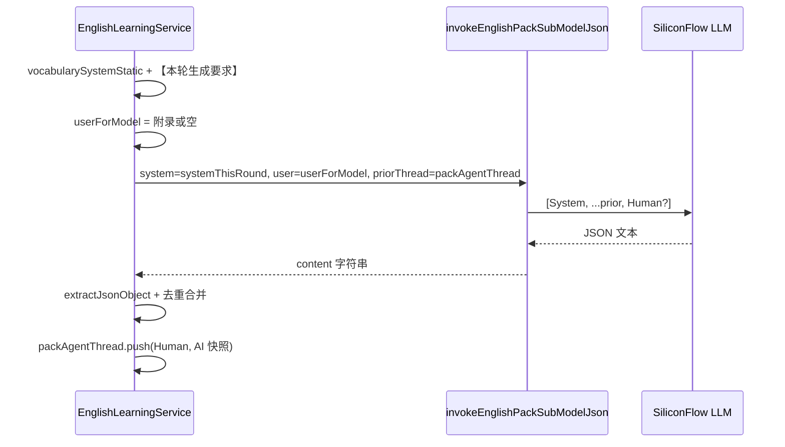

# 英语学习子模型：多轮 Prompt、线程与工具函数实现思路

本文总结 **`english-learning` 子模型路径**（硅基流动 JSON、`packAgentThread`、主 Agent 辅助工具函数等）的**实现思路**与**关键代码**。文中代码块为**讲解版**：在源码行意不变的前提下，为**几乎每一行**补充中文注释，便于单独阅读归档。**若与仓库最新源码不一致，以源码为准。**

---

## 1. 背景与目标

### 1.1 要解决的问题

1. **多轮 Human 重复膨胀**：主题、难度、大段去重说明若每轮都写进 `user`，写入 `packAgentThread` 后会在 `priorThread` 里反复出现，**日志与 token 浪费**，且易与 AI 快照中的 `words` / `english_prefixes` 信息重叠。
2. **子模型日志重复**：JSON 解析失败重试时若每次都记录完整 `msgs`，`submodel-system.log` 会出现多块相同内容。
3. **线程结构异常**：若 `user` 为空且不再写入占位 `Human`，可能出现**连续多条 `AIMessage`**，模型易产出「换序同批」的近重复内容。
4. **`getType()` 弃用**：`@langchain/core` 中 `BaseMessage.getType()` 已标记 deprecated，应改用 **`type` 属性**。
5. **服务文件体积**：主 Agent 流式文本拼接、中止判定、JSON 引号修复等与「Nest 服务编排」无关的逻辑，适合抽到 **`apps/backend/src/utils`** 复用与单测。

### 1.2 目标行为（摘要）

| 维度 | 做法 |
|------|------|
| **system** | `vocabularySystemStatic` / `classicQuotesSystemStatic` 承载整场固定规则 +「【当前学习任务】」主题与难度；每轮再拼 **`【本轮生成要求】`**（条数、节选列表、`diversityHint`、`urgency`）。 |
| **user** | 以空字符串为基底，经 `buildSubModelUserWithOptionalResearchAppendix` 仅在需要时前置检索附录；无附录时可为空，由 `invokeEnglishPackSubModelJson` 按规则补占位 Human。 |
| **线程** | 解析成功后写入 `HumanMessage` + `AIMessage`；`user` 无正文时仍写入 **`HumanMessage(' ')`** + 快照，保持 **human/ai 交替**。 |
| **工具函数** | `apps/backend/src/utils/english-pack.ts` 导出四个函数；`utils/index.ts` 再导出。 |
| **消息类型** | 使用 `m.type === 'human'` 等，替代 `m.getType()`。 |

---

## 2. 涉及文件清单

| 路径 | 说明 |
|------|------|
| `apps/backend/src/services/english-learning/english-learning.service.ts` | 子模型调用、单词/经典句多轮循环、`packAgentThread`、`extractJsonObject` 与主 Agent 流式等。 |
| `apps/backend/src/utils/english-pack.ts` | 流式 chunk 文本、中止判定、JSON 引号修复辅助函数。 |
| `apps/backend/src/utils/index.ts` | `export * from './english-pack'` 聚合导出。 |
| `apps/backend/src/services/english-learning/english-learning.module.ts` | 模块仅依赖 `KnowledgeQaModule` + TypeORM 实体（按需精简）。 |

---

## 3. 数据流概览（子模型多轮）



---

## 4. 工具模块 `english-pack.ts`

以下代码块为 **`apps/backend/src/utils/english-pack.ts` 全文思路的逐行讲解版**（行号以当时仓库为准，略去与源码完全一致的 import 空行压缩）。

**来源**：`apps/backend/src/utils/english-pack.ts`（约 L1–L107）

```typescript
// 说明：引入 LangChain 的「AI 消息分块」类型，仅用于类型标注，运行时无额外开销
import type { AIMessageChunk } from '@langchain/core/messages';

/**
 * 说明：从流式回调里的 chunk 取出「可拼接的正文」。
 * 背景：LangChain 的 content 可能是 string，也可能是 OpenAI 风格的 { text }[]。
 */
export function extractEnglishPackAgentChunkText(
	chunk: AIMessageChunk | undefined, // 说明：可能为 undefined（流结束或未携带 chunk）
): string {
	if (!chunk) return ''; // 说明：无 chunk 时直接返回空串，避免后续解构报错
	const { content } = chunk; // 说明：取出 chunk 上的 content 字段
	if (typeof content === 'string') return content; // 说明：纯字符串路径最快返回
	if (!Array.isArray(content)) return ''; // 说明：既不是 string 也不是数组，视为无可读文本
	return content // 说明：数组路径：逐段拼接
		.map((part: unknown) => {
			if (typeof part === 'string') return part; // 说明：数组元素本身是字符串片段
			if (
				part && // 说明：排除 null/undefined
				typeof part === 'object' && // 说明：对象片段才可能有 .text
				'text' in part && // 说明：duck-typing 判定存在 text 字段
				typeof (part as { text?: string }).text === 'string' // 说明：且 text 为 string
			) {
				return (part as { text: string }).text; // 说明：取出标准文本片段
			}
			return ''; // 说明：未知结构片段忽略
		})
		.join(''); // 说明：拼成完整增量文本供主 Agent 流式累加
}

/** 说明：识别「用户主动中止」类错误，避免误打 error 或误重试 */
export function englishPackAgentIsUserAbort(err: unknown): boolean {
	let cur: unknown = err; // 说明：从当前错误开始沿 cause 链向上遍历
	for (let i = 0; i < 8 && cur != null && typeof cur === 'object'; i++) {
		// 说明：最多 8 层，防止异常环；仅对象节点可读 name/code/cause
		const o = cur as { name?: string; code?: unknown; cause?: unknown }; // 说明：窄化类型便于读字段
		if (o.name === 'AbortError') return true; // 说明：DOM/ fetch 常见中止名
		if (o.code === 'ABORT_ERR' || o.code === 20) return true; // 说明：部分运行时用 code 表示中止
		cur = o.cause; // 说明：进入下一层 cause（若有）
	}
	return false; // 说明：未识别为用户中止
}

/**
 * 说明：判断索引 quoteIdx 处的双引号是否为「JSON 串的合法结束引号」。
 * 用途：区分字段内中文语境下的英文 " 与真正的 JSON 结束。
 */
export function isJsonStringClosingQuoteAt(
	s: string, // 说明：待扫描的 JSON 子串（常为 extract 出的 slice）
	quoteIdx: number, // 说明：当前双引号在 s 中的下标
): boolean {
	let j = quoteIdx + 1; // 说明：从引号后一个字符开始看
	while (j < s.length && /\s/.test(s[j])) j++; // 说明：跳过 JSON 允许出现在结束引号后的空白
	const next = s[j]; // 说明：取「有意义的下一个字符」
	return (
		next === undefined || // 说明：已到串尾，视为合法结束
		next === ',' || // 说明：对象/数组元素分隔
		next === '}' || // 说明：对象结束
		next === ']' || // 说明：数组结束
		next === ':' // 说明：少见但合法：紧接冒号（某些压缩格式边界）
	);
}

/**
 * 说明：把 JSON 字符串值里「误用的裸 "」转义为 \"，便于 JSON.parse。
 * 与 isJsonStringClosingQuoteAt 配合：只有「非合法结束」的引号才转义。
 */
export function repairJsonUnescapedInteriorQuotes(slice: string): string {
	let out = ''; // 说明：输出缓冲区
	let i = 0; // 说明：扫描指针
	let inString = false; // 说明：是否处于 JSON 字符串字面量内部
	let escaped = false; // 说明：是否上一字符为反斜杠转义符
	while (i < slice.length) {
		const ch = slice[i]; // 说明：当前字符
		if (!inString) {
			if (ch === '"') {
				inString = true; // 说明：进入字符串字面量
				out += '"'; // 说明：输出起始引号
			} else {
				out += ch; // 说明：字符串外其它字符原样拷贝（结构符等）
			}
			i++; // 说明：前进指针
			continue; // 说明：进入下一轮循环
		}
		if (escaped) {
			out += ch; // 说明：转义后的字符原样保留（如 \n \"）
			escaped = false; // 说明：退出转义消费态
			i++;
			continue;
		}
		if (ch === '\\') {
			out += ch; // 说明：保留反斜杠本身
			escaped = true; // 说明：标记下一字符为转义序列的一部分
			i++;
			continue;
		}
		if (ch === '"') {
			if (isJsonStringClosingQuoteAt(slice, i)) {
				inString = false; // 说明：合法结束引号：闭合当前串
				out += '"'; // 说明：输出该结束引号
			} else {
				out += '\\"'; // 说明：串内误用引号：转义为 \"
			}
			i++;
			continue;
		}
		out += ch; // 说明：普通字符直接拷贝
		i++; // 说明：前进
	}
	return out; // 说明：返回修复后的子串，供上层 JSON.parse 再试
}
```

---

## 5. 服务侧 import 与主 Agent 流式中的工具函数

**来源**：`apps/backend/src/services/english-learning/english-learning.service.ts`（约 L25–L30、L477、L511）

```typescript
// 说明：从 utils 引入与「主 Agent 流式」和「JSON 宽松解析」相关的纯函数，保持 service 文件聚焦编排逻辑
import {
	englishPackAgentIsUserAbort, // 说明：流式结束或异常时判断是否用户中止
	extractEnglishPackAgentChunkText, // 说明：将 AIMessageChunk 规范为 string 片段
	isJsonStringClosingQuoteAt, // 说明：sliceBalancedJsonObject 内判断引号语义
	repairJsonUnescapedInteriorQuotes, // 说明：extractJsonObject 宽松解析路径中修复引号
} from 'src/utils/english-pack';

// ... 主 Agent 流式循环内（示意）：
const text = extractEnglishPackAgentChunkText(chunk); // 说明：把本轮 chunk 的可读增量取出
accumulated += text; // 说明：拼到主 Agent 最终要点字符串（略，见源码）

// ... catch 内：
if (englishPackAgentIsUserAbort(e)) {
	// 说明：用户中止不记 error，直接 break/return（具体分支见源码）
}
```

---

## 6. `trimPackAgentThread` 与 `m.type`（替代 `getType()`）

**来源**：`apps/backend/src/services/english-learning/english-learning.service.ts`（约 L192–L205、L222–L227）

```typescript
// 说明：裁剪多轮消息，保证传给子模型的 prior 以 human 开头（API 习惯与内部约定）
private trimPackAgentThread(msgs: BaseMessage[], max: number): BaseMessage[] {
	if (msgs.length <= max) {
		let out = msgs; // 说明：未超长则先整体引用
		while (out.length && out[0]!.type !== 'human') {
			// 说明：用 .type 取代已弃用的 .getType()；丢弃开头的 system/ai 直到遇到 human
			out = out.slice(1); // 说明：左裁一条
		}
		return out; // 说明：已保证 human 开头或为空数组
	}
	let out = msgs.slice(-max); // 说明：超长则只保留尾部 max 条
	while (out.length && out[0]!.type !== 'human') {
		out = out.slice(1); // 说明：同样从左去掉非 human 前缀
	}
	return out;
}

// packAgentThreadHasResearchAppendix 内：
if (m.type !== 'human') continue; // 说明：仅 human 可能携带检索附录正文
```

---

## 7. `invokeEnglishPackSubModelJson`：空 `user` 与最后一条消息类型

**来源**：`apps/backend/src/services/english-learning/english-learning.service.ts`（约 L921–L963）

```typescript
// 说明：子模型单次调用：system + 可选 priorThread + 本轮 user（可能为空）
private async invokeEnglishPackSubModelJson(params: {
	system: string; // 说明：本轮完整 system（单词/经典句已含「本轮生成要求」）
	user: string; // 说明：通常为空或仅附录；trim 后可能为空串
	maxTokens: number; // 说明：本调用输出上限
	priorThread?: BaseMessage[]; // 说明：已登录时的多轮记忆
}): Promise<string> {
	const llm = this.buildSiliconFlowJsonLlm(params.maxTokens); // 说明：构建 JSON 模式的 ChatOpenAI
	const msgs: BaseMessage[] = [new SystemMessage(params.system)]; // 说明：消息数组以 system 起头
	if (params.priorThread?.length) {
		msgs.push(
			...this.trimPackAgentThread(
				params.priorThread, // 说明：传入线程副本引用
				PACK_AGENT_THREAD_MAX_MESSAGES, // 说明：最大条数常量，防止上下文爆炸
			),
		); // 说明：展开为连续消息接在 system 后
	}
	const lastMsg = msgs[msgs.length - 1]!; // 说明：拼接 prior 后的最后一条（可能是 system/human/ai）
	const userTrimmed = params.user.trim(); // 说明：用户正文去掉空白
	const lastIsHuman = lastMsg.type === 'human'; // 说明：用 .type 判断是否为 human
	if (userTrimmed.length > 0) {
		msgs.push(new HumanMessage(params.user)); // 说明：有正文则正常推 human
	} else if (lastIsHuman) {
		// 说明：无 user 且末条已是 human：不再叠第二条空 human（避免重复 user 轮）
	} else {
		msgs.push(new HumanMessage(' ')); // 说明：末条为 system/ai 时仍需一条 human 以满足对话轮次；用单空格占位
	}
	this.appendEnglishPackSubModelMessagesLog(msgs); // 说明：异步写 submodel-system.log
	const res = await llm.invoke(msgs); // 说明：真正调用硅基流动
	return typeof res.content === 'string' // 说明：规范化返回为 string
		? res.content
		: Array.isArray(res.content)
			? res.content
					.map((p: unknown) =>
						p &&
						typeof p === 'object' &&
						'text' in p &&
						typeof (p as { text?: string }).text === 'string'
							? (p as { text: string }).text
							: '',
					)
					.join('')
			: '';
}
```

---

## 8. 单词生成：`runVocabularyGeneration` 核心循环

**来源**：`apps/backend/src/services/english-learning/english-learning.service.ts`（约 L989–L1130，摘录结构）

```typescript
// 说明：整场不变的 system 前缀：任务定义、多轮与线程约定、去重 1–4、JSON 约束、当前学习任务（主题+难度）
const vocabularySystemStatic = `你是英语教学助手。...难度说明：${levelText}`;

// while 每一轮：
const roundRequirement =
	accumulated.length === 0
		? `请恰好生成 ${batch} 条 items（数组长度必须等于 ${batch}）。` // 说明：首轮只要求条数
		: `请再生成恰好 ${batch} 条新的 items（数组长度必须等于 ${batch}）。
以下英文词条已出现过...：${excludeSnippet}
本批 items 内部也不得出现彼此重复的 word。...${diversityHint}`; // 说明：后续轮附带节选与多样性

const userForModel = this.buildSubModelUserWithOptionalResearchAppendix(
	agentResearchAppendix, // 说明：主 Agent 要点；若线程已有附录则不再前置
	'', // 说明：user 正文为空，由 system 承载任务
	packAgentThread,
);

for (let dupPass = 0; dupPass < maxDupPasses; dupPass++) {
	const urgency = dupPass === 0 ? '' : `\n【紧急】...`; // 说明：全重复时加急提示
	const systemThisRound = `${vocabularySystemStatic}\n\n【本轮生成要求】\n${roundRequirement}${urgency}`; // 说明：每 dupPass 可能加长 system
	const text = await this.invokeEnglishPackSubModelJson({
		system: systemThisRound,
		user: userForModel,
		maxTokens: maxTok,
		priorThread: context?.userId != null ? packAgentThread : undefined,
	});
	// 解析成功后：
	if (userForModel.trim().length > 0) {
		packAgentThread.push(new HumanMessage(userForModel), new AIMessage(threadAi)); // 说明：有附录等正文
	} else {
		packAgentThread.push(new HumanMessage(' '), new AIMessage(threadAi)); // 说明：无正文仍推空格 human，避免连续 ai
	}
}
```

---

## 9. 经典句生成：`runClassicQuotesGeneration` 对齐

**来源**：`apps/backend/src/services/english-learning/english-learning.service.ts`（约 L1248–L1390）

与单词侧对称：`classicQuotesSystemStatic`、同结构的 `roundRequirement` / `userForModel` / `systemThisRound` / `invoke` / `packAgentThread` 写入；差异在于 **去重键为句子**、`excludeSnippet` 使用 `TOPIC_PACK_EXCLUDE_CLASSIC_*` 参数，以及快照为 **`english_prefixes`**（见下一节）。

---

## 10. `buildPackAgentThreadAssistantSnapshot`

**来源**：`apps/backend/src/services/english-learning/english-learning.service.ts`（约 L312–L324）

```typescript
// 说明：把本轮解析成功的 items 压成短文本放进 AIMessage，减少 prior token
private buildPackAgentThreadAssistantSnapshot(
	kind: 'vocabulary' | 'classic_quotes', // 说明：分支决定快照 JSON 形状
	items: VocabularyItemDto[] | ClassicQuoteItemDto[],
): string {
	if (kind === 'vocabulary') {
		const words = (items as VocabularyItemDto[]).map((x) => x.word); // 说明：只列 word 列表
		return `【上轮已产出...】\n${JSON.stringify({ words })}`; // 说明：单行 JSON 便于模型扫一眼
	}
	const prefixes = (items as ClassicQuoteItemDto[]).map((x) =>
		x.english.trim().replace(/\s+/g, ' ').slice(0, 120), // 说明：经典句只保留 english 前 120 字符做节选
	);
	return `【上轮已产出 english 节选...】\n${JSON.stringify({ english_prefixes: prefixes })}`;
}
```

---

## 11. Nest 模块 `english-learning.module.ts`

**来源**：`apps/backend/src/services/english-learning/english-learning.module.ts`（约 L1–L21）

```typescript
// 说明：模块仅导入 KnowledgeQaModule（主 Agent 工具链依赖）与 TypeORM 实体；providers 仅 EnglishLearningService
@Module({
	imports: [
		KnowledgeQaModule,
		TypeOrmModule.forFeature([EnglishVocabularyPackBatch, EnglishClassicQuotePackBatch]),
	],
	controllers: [EnglishLearningController],
	providers: [EnglishLearningService],
	exports: [EnglishLearningService],
})
export class EnglishLearningModule {}
```

---

## 12. 风险与回归建议

1. **空 `user` + 单空格 Human**：与上游 Chat API「末条须为 human」的假设一致；若更换厂商 SDK，需确认仍接受单字符 human。
2. **`system` 每轮变长**：`【本轮生成要求】` 随 `seen` 增长；节选由 `buildSeenKeysExcludePromptForModel` 控制上限，服务端 `seen` 仍为全集去重。
3. **工具函数与 `extractJsonObject`**：`repairJsonUnescapedInteriorQuotes` 为启发式修复，极端畸形 JSON 仍可能失败并走重试/stall。
4. **回归用例**：已登录用户单词包多轮、带检索附录首轮、经典句多轮、`submodel-system.log` 中 human/ai 交替、主动中止主 Agent 流式无 error 误报。

---

## 13. `utils/index.ts` 聚合导出

**来源**：`apps/backend/src/utils/index.ts`（约 L4–L7）

```typescript
export * from './bcrypt';
export * from './common';
export * from './db.helper';
export * from './english-pack'; // 说明：对外暴露 english-pack 中的四个函数
```
