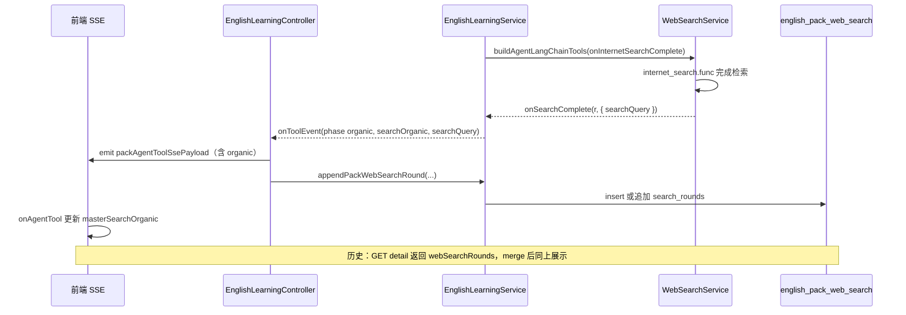

# 英语学习单词包 / 经典句：主检索联网结果落库、历史回传与前端展示

本文梳理**当前仓库**中与「单词拉取 / 语句拉取」主检索阶段 **`internet_search` 结果**相关的实现：数据库表与迁移、SSE 透传、落库时机、历史列表/详情 API、前端消费与列表区 UI。若与最新源码不一致，以源码为准。

---

## 1. 背景与目标

| 诉求 | 做法 |
|------|------|
| **持久化** | 用独立表 `english_pack_web_search` 按 `streamId` + `pack_kind` 关联一次拉取会话，JSON 存多轮检索的 `organic`（网页列表）与可选 `query`。 |
| **实时展示** | 沿用 `*.agent_tool` SSE；在 `internet_search` 完成后增加 **`phase: organic`** 与 **`organic`** 载荷，前端解析后更新状态。 |
| **历史回放** | 列表接口增加 `webSearchRoundCount`；详情接口增加 `webSearchRounds`；前端打开历史详情时合并 `organic` 并驱动 `MasterWebSearchResultsBar`。 |
| **检索关键词** | `WebSearchService` 在 `onSearchComplete` 中传入 `meta.searchQuery`，供落库与 SSE `query` 字段使用。 |

---

## 2. 改动范围（路径清单）

| 路径 | 说明 |
|------|------|
| `apps/backend/src/services/english-learning/english-pack-web-search.entity.ts` | TypeORM 实体与 `EnglishPackWebSearchRoundJson` 类型。 |
| `apps/backend/src/migrations/1778643506254-juzi.ts` | MySQL 建表 `english_pack_web_search`。 |
| `apps/backend/src/services/english-learning/english-learning.module.ts` | 注册 `EnglishPackWebSearchRecord`。 |
| `apps/backend/src/services/english-learning/english-learning.service.ts` | `appendPackWebSearchRound`、历史列表/详情拼接联网字段、主检索 `onInternetSearchComplete` 发 `organic` 事件。 |
| `apps/backend/src/services/english-learning/english-learning.controller.ts` | `packAgentToolSsePayload`、`onAgentTool` 内落库。 |
| `apps/backend/src/services/web-search/web-search.service.ts` | `onSearchComplete(result, meta)`。 |
| `apps/backend/src/services/agent/agent-tools.ts` | `onInternetSearchComplete` 类型与透传。 |
| `apps/frontend/src/utils/englishLearningPackSse.ts` | 解析 `phase: organic` 与 `organic` 数组。 |
| `apps/frontend/src/utils/englishPackWebSearchMerge.ts` | 历史详情多轮 `organic` 按 `link` 去重合并。 |
| `apps/frontend/src/views/englishLearning/MasterWebSearchResultsBar.tsx` | 链接 + `SearchOrganics` 抽屉。 |
| `apps/frontend/src/views/englishLearning/VocabularySection.tsx`、`ClassicQuotesSection.tsx` | SSE 回调、历史详情、`masterSearchOrganic`、列表标题行内嵌入口。 |
| `apps/frontend/src/views/englishLearning/VocabularyHistoryDrawer.tsx`、`ClassicQuotesHistoryDrawer.tsx` | `webSearchRoundCount` 展示。 |
| `apps/frontend/src/service/index.ts` | 历史类型与详情响应类型。 |
| `apps/frontend/src/views/englishLearning/agentToolStatusText.ts` | `phase === 'organic'` 不拼工具状态行。 |
| `apps/frontend/src/i18n/locales/zh-CN.ts`、`en-US.ts` | `englishLearning.packHistory.webSearchRounds` 等。 |

---

## 3. 实现流程（端到端）



1. **建表**：迁移创建 `english_pack_web_search`；实体与 `english_vocabulary` / `english_classic_quotes` 无 FK，仅靠 **`user_id` + `stream_id` + `pack_kind`** 与批次表逻辑对齐。  
2. **主检索**：`runEnglishPackMasterResearchPhase` 里 `buildAgentLangChainTools` 第二参数注册 `onInternetSearchComplete`；回调里把 `r.organic` 与 `meta.searchQuery` 打成 **`EnglishLearningPackAgentToolEvent`**（`phase: 'organic'`）。  
3. **SSE**：Controller 先 `emit(packAgentToolSsePayload(...))`；若 `phase === 'organic'` 且 `searchOrganic` 非空，再 **`appendPackWebSearchRound`**（失败仅服务内 `warn`，不阻断流）。  
4. **前端拉流**：`englishLearningPackSse.ts` 识别 `organic`，`onAgentTool` 收到后由页面 `setMasterSearchOrganic`。  
5. **历史**：列表多查 `packWebSearchRepo` 填 `webSearchRoundCount`；详情多查一行填 `webSearchRounds`；`openHistoryDetail` 里 **`mergeEnglishPackWebSearchOrganics`** 写入 `masterSearchOrganic`。

---

## 4. 关键代码与讲解注释

### 4.1 实体与 JSON 形状

**来源**：`apps/backend/src/services/english-learning/english-pack-web-search.entity.ts`（约 L1–L47）

```typescript
import type { WebSearchOrganicItem } from '../web-search/web-search.types';
// 说明：organic 单条形状与 Chat 的 searchOrganic、Serper/Tavily 解析结果一致（title/link/snippet 等）

/** 单次拉取会话内「一轮」internet_search 落库结构；同一 stream 可多条组成数组 */
export type EnglishPackWebSearchRoundJson = {
	query?: string | null; // 说明：模型传入的检索串摘要，便于审计
	organic: WebSearchOrganicItem[]; // 说明：本轮返回的网页列表
};

@Entity('english_pack_web_search')
@Unique('uq_epws_user_stream_kind', ['userId', 'streamId', 'packKind']) // 说明：同一用户同一次 SSE 会话同一包类型仅一行
@Index('idx_epws_user_stream', ['userId', 'streamId'])
export class EnglishPackWebSearchRecord {
	// ... id, userId, streamId, packKind: 'vocabulary' | 'classic_quotes'
	@Column({ name: 'search_rounds', type: 'json' })
	searchRounds!: EnglishPackWebSearchRoundJson[]; // 说明：多轮检索依次 append
	// ... createdAt, updatedAt
}
```

### 4.2 数据库迁移（MySQL）

**来源**：`apps/backend/src/migrations/1778643506254-juzi.ts`（约 L6–L8，`up` 内 SQL）

```typescript
// 说明：InnoDB + json 列；唯一索引保证 (user_id, stream_id, pack_kind) 单行聚合多轮 search_rounds
await queryRunner.query(
	`CREATE TABLE \`english_pack_web_search\` (
  \`id\` varchar(36) NOT NULL,
  \`user_id\` int NOT NULL,
  \`stream_id\` varchar(36) NOT NULL,
  \`pack_kind\` varchar(32) NOT NULL,
  \`search_rounds\` json NOT NULL,
  ...
  UNIQUE INDEX \`uq_epws_user_stream_kind\` (\`user_id\`, \`stream_id\`, \`pack_kind\`),
  PRIMARY KEY (\`id\`)
) ENGINE=InnoDB`,
);
```

### 4.3 联网工具完成回调携带检索串

**来源**：`apps/backend/src/services/web-search/web-search.service.ts`（约 L78–L112，`createLangChainWebSearchTools`）

```typescript
// 说明：第二参数 meta 供英语学习落库 / SSE query 与「organic」对齐，避免仅从 tool_end 字符串反解析
onSearchComplete?: (
	result: WebSearchContextResult,
	meta: { searchQuery: string },
) => void;

func: async (input: string) => {
	const searchQuery =
		typeof input === 'string' ? input : String(input ?? ''); // 说明：与 formatSearchContextForPrompt 使用同一字符串
	const r = await this.formatSearchContextForPrompt(searchQuery, {
		provider,
		recency,
		tavilyStartDate,
		tavilyEndDate,
	});
	opts?.onSearchComplete?.(r, { searchQuery }); // 说明：在 return 给 LangChain 之前触发，与 Chat Agent 行为一致
	return r.promptText ?? '（无检索结果）';
},
```

**来源**：`apps/backend/src/services/agent/agent-tools.ts`（约 L43–L65）

```typescript
export type BuildAgentLangChainToolsOpts = {
	onInternetSearchComplete?: (
		result: WebSearchContextResult,
		meta: { searchQuery: string },
	) => void;
};

// 说明：将 Agent 侧命名 onInternetSearchComplete 映射为 WebSearch 的 onSearchComplete
...deps.webSearchService.createLangChainWebSearchTools({
	onSearchComplete: opts?.onInternetSearchComplete,
	recency: deps.webSearchRecency,
	tavilyStartDate: deps.webSearchTavilyStartDate,
	tavilyEndDate: deps.webSearchTavilyEndDate,
}),
```

### 4.4 主检索阶段发出 `organic` 工具事件

**来源**：`apps/backend/src/services/english-learning/english-learning.service.ts`（约 L741–L771，`runEnglishPackMasterResearchPhase` 内）

```typescript
const tools = buildAgentLangChainTools(
	{ /* webSearchRecency 等 */ },
	{
		onInternetSearchComplete: async (r, meta) => {
			const list = r.organic;
			if (!onToolEvent || !Array.isArray(list) || list.length === 0) {
				return; // 说明：无回调或无网页结果时不打扰前端
			}
			const q = meta?.searchQuery?.trim();
			await Promise.resolve(
				onToolEvent({
					phase: 'organic', // 说明：与 start/end 区分，专用于携带结构化网页列表
					name: 'internet_search',
					searchOrganic: list,
					searchQuery: q || undefined, // 说明：写入 SSE 与 appendPackWebSearchRound.query
				}),
			);
		},
	},
);
```

**来源**：`apps/backend/src/services/english-learning/english-learning.service.ts`（约 L115–L125，事件类型）

```typescript
export type EnglishLearningPackAgentToolEvent = {
	phase: 'start' | 'end' | 'organic';
	name?: string;
	input?: unknown;
	output?: unknown;
	searchOrganic?: WebSearchOrganicItem[] | null;
	/** organic 阶段：模型传入的检索关键词原文（用于落库与 SSE 摘要） */
	searchQuery?: string | null;
};
```

### 4.5 SSE 载荷与落库调用

**来源**：`apps/backend/src/services/english-learning/english-learning.controller.ts`（约 L81–L105，`packAgentToolSsePayload`）

```typescript
function packAgentToolSsePayload(
	prefix: 'vocab' | 'classic',
	streamId: string,
	ev: EnglishLearningPackAgentToolEvent,
): Record<string, unknown> {
	// 说明：organic 阶段优先用 searchQuery 截断作为 SSE 的 query，避免依赖 LangChain 的 input 形状
	const qFromSearch =
		typeof ev.searchQuery === 'string' && ev.searchQuery.trim()
			? ev.searchQuery.trim().slice(0, 240)
			: undefined;
	const data: Record<string, unknown> = {
		type: `${prefix}.agent_tool`,
		streamId,
		phase: ev.phase,
		name: typeof ev.name === 'string' ? ev.name : '',
		query: qFromSearch ?? englishPackToolInputPreview(ev.input),
	};
	if (
		ev.phase === 'organic' &&
		Array.isArray(ev.searchOrganic) &&
		ev.searchOrganic.length > 0
	) {
		data.organic = ev.searchOrganic; // 说明：与前端 parsePackSearchOrganic 消费字段一致
	}
	return data;
}
```

**来源**：`apps/backend/src/services/english-learning/english-learning.controller.ts`（约 L294–L311，单词流 `onAgentTool` 摘录）

```typescript
onAgentTool: async (ev) => {
	emit(packAgentToolSsePayload('vocab', streamId, ev));
	if (
		ev.phase === 'organic' &&
		Array.isArray(ev.searchOrganic) &&
		ev.searchOrganic.length > 0
	) {
		await this.englishLearningService.appendPackWebSearchRound({
			userId,
			streamId,
			packKind: 'vocabulary',
			query: typeof ev.searchQuery === 'string' ? ev.searchQuery : undefined,
			organic: ev.searchOrganic,
		});
	}
},
// 说明：经典句流同理，packKind 为 'classic_quotes'（见源码 classic 分支）
```

### 4.6 追加写入 `search_rounds`

**来源**：`apps/backend/src/services/english-learning/english-learning.service.ts`（约 L1163–L1207，`appendPackWebSearchRound`）

```typescript
async appendPackWebSearchRound(params: {
	userId: number;
	streamId: string;
	packKind: 'vocabulary' | 'classic_quotes';
	query?: string | null;
	organic: WebSearchOrganicItem[];
}): Promise<void> {
	if (!params.organic.length) return;
	try {
		const existing = await this.packWebSearchRepo.findOne({
			where: {
				userId: params.userId,
				streamId: params.streamId,
				packKind: params.packKind,
			},
		});
		const round: EnglishPackWebSearchRoundJson = {
			query: params.query?.trim()
				? params.query.trim().slice(0, 500) // 说明：控制 DB 字段长度
				: null,
			organic: params.organic,
		};
		if (!existing) {
			await this.packWebSearchRepo.save(
				this.packWebSearchRepo.create({
					userId: params.userId,
					streamId: params.streamId,
					packKind: params.packKind,
					searchRounds: [round],
				}),
			);
			return;
		}
		// 说明：同一 stream 多次联网（少见）则 push 新 round，不覆盖旧数据
		const prev = Array.isArray(existing.searchRounds) ? existing.searchRounds : [];
		existing.searchRounds = [...prev, round];
		await this.packWebSearchRepo.save(existing);
	} catch (e) {
		this.logger.warn('[EnglishLearning] 联网检索结果落库失败', e);
	}
}
```

### 4.7 历史列表：联网轮数

**来源**：`apps/backend/src/services/english-learning/english-learning.service.ts`（约 L1904–L1943，`listVocabularyHistory` 核心摘录）

```typescript
const streamIds = grouped.map((g) => g.streamId);
const wsRows = await this.packWebSearchRepo.find({
	where: { userId, streamId: In(streamIds), packKind: 'vocabulary' },
});
const wsCountByStream = new Map<string, number>();
for (const w of wsRows) {
	wsCountByStream.set(
		w.streamId,
		Array.isArray(w.searchRounds) ? w.searchRounds.length : 0, // 说明：一轮检索 = search_rounds 中一项
	);
}
// ... return 每项带 webSearchRoundCount: wsCountByStream.get(g.streamId) ?? 0
```

### 4.8 历史详情：返回完整 `webSearchRounds`

**来源**：`apps/backend/src/services/english-learning/english-learning.service.ts`（约 L1981–L1992，`getVocabularyHistoryDetail` 尾部摘录）

```typescript
const ws = await this.packWebSearchRepo.findOne({
	where: { userId, streamId, packKind: 'vocabulary' },
});
return {
	// ... streamId, topic, targetCount, items, createdAt
	webSearchRounds: Array.isArray(ws?.searchRounds) ? ws.searchRounds : [],
};
```

### 4.9 前端 SSE：解析 `organic`

**来源**：`apps/frontend/src/utils/englishLearningPackSse.ts`（约 L276–L297，`*.agent_tool` 分支）

```typescript
if (type === `${tp}agent_tool`) {
	const phaseRaw = parsed.phase;
	const phase: EnglishPackAgentToolEvent['phase'] =
		phaseRaw === 'organic'
			? 'organic'
			: phaseRaw === 'end'
				? 'end'
				: 'start';
	const name = typeof parsed.name === 'string' ? parsed.name : '';
	const query = typeof parsed.query === 'string' ? parsed.query : undefined;
	// 说明：仅 organic 阶段解析 organic 数组，避免误解析其它 phase 的残留字段
	const organic =
		phase === 'organic' ? parsePackSearchOrganic(parsed.organic) : undefined;
	onAgentTool?.({
		phase,
		name,
		query,
		...(organic?.length ? { organic } : {}),
	});
	return false;
}
```

### 4.10 历史详情合并与页面状态

**来源**：`apps/frontend/src/utils/englishPackWebSearchMerge.ts`（全文）

```typescript
/** 多轮联网结果按 link 去重合并，供抽屉一条列表展示 */
export function mergeEnglishPackWebSearchOrganics(
	rounds: EnglishPackWebSearchRoundDto[] | null | undefined,
): SearchOrganicItem[] {
	if (!Array.isArray(rounds) || !rounds.length) return [];
	const seen = new Set<string>();
	const out: SearchOrganicItem[] = [];
	for (const r of rounds) {
		if (!r?.organic?.length) continue;
		for (const o of r.organic) {
			const link = typeof o.link === 'string' ? o.link.trim() : '';
			if (!link || seen.has(link)) continue; // 说明：同一 URL 多轮重复只保留一条
			seen.add(link);
			out.push(o);
		}
	}
	return out;
}
```

**来源**：`apps/frontend/src/views/englishLearning/VocabularySection.tsx`（约 L174–L184，`openHistoryDetail`）

```typescript
const d = res.data;
if (d?.items?.length) {
	setItems(d.items);
	setMasterSearchOrganic(
		mergeEnglishPackWebSearchOrganics(d.webSearchRounds), // 说明：与实时 SSE 共用同一套 MasterWebSearchResultsBar
	);
	// ...
}
```

**来源**：`apps/frontend/src/views/englishLearning/VocabularySection.tsx`（约 L257–L263，SSE `onAgentTool`）

```typescript
onAgentTool: (ev) => {
	if (genIdRef.current !== myGen) return;
	if (ev.phase === 'organic' && ev.organic?.length) {
		setMasterSearchOrganic(ev.organic); // 说明：实时流以服务端合并后的一轮结果为准；多轮会多次覆盖
		return;
	}
	setAgentToolLine(formatEnglishLearningAgentToolLine(t, ev));
},
```

### 4.11 列表标题行内嵌「查看网页」与抽屉组件

**来源**：`apps/frontend/src/views/englishLearning/VocabularySection.tsx`（约 L515–L520）

```tsx
<div className="flex items-center gap-2 text-textcolor/45 text-sm font-medium">
	{t('englishLearning.vocab.listHeading')}
	{masterSearchOrganic.length > 0 ? (
		<MasterWebSearchResultsBar items={masterSearchOrganic} t={t} />
	) : null}
</div>
```

**来源**：`apps/frontend/src/views/englishLearning/MasterWebSearchResultsBar.tsx`（约 L9–L34）

```tsx
// 说明：轻量入口 + 复用 Chat 的 SearchOrganics 抽屉，避免重复实现列表与外链打开逻辑
export function MasterWebSearchResultsBar({ items, t }: { ... }) {
	const [drawerOpen, setDrawerOpen] = useState(false);
	if (!items.length) return null;
	return (
		<div className="">
			<Button type="button" variant="link" size="sm" onClick={() => setDrawerOpen(true)}>
				{t('englishLearning.masterSearch.viewPages', { n: items.length })}
			</Button>
			<SearchOrganics open={drawerOpen} onOpenChange={setDrawerOpen} organics={items} t={t} />
		</div>
	);
}
```

**来源**：`apps/frontend/src/views/englishLearning/VocabularyHistoryDrawer.tsx`（约 L91–L97，历史行「联网 n 次」）

```tsx
{(h.webSearchRoundCount ?? 0) > 0 ? (
	<span className="text-teal-600/85 dark:text-teal-400/85">
		{t('englishLearning.packHistory.webSearchRounds', {
			n: h.webSearchRoundCount ?? 0,
		})}
	</span>
) : null}
```

---

## 5. 兼容性与影响

- **旧客户端**：若忽略未知字段 `organic` / `phase: organic`，不影响原有 `start`/`end` 行为；列表若未读 `webSearchRoundCount` 可视为 0（建议 `?? 0`）。  
- **旧数据**：无 `english_pack_web_search` 行时详情 `webSearchRounds` 为空数组，合并后无入口按钮。  
- **部署**：需执行迁移 **`1778643506254-juzi`**（或等价 DDL）；仅依赖 `DB_SYNC=true` 时需保证实体已加载。  
- **聊天 Agent**：`onSearchComplete` 第二参数对仅使用 `(r) =>` 的调用方仍兼容（调用方多传参不影响）。

---

## 6. 回归建议

1. 登录后单词包 SSE：触发联网后是否收到 `vocab.agent_tool` 且 `phase` 为 `organic`、`organic` 非空。  
2. DB：`english_pack_web_search` 是否按 `streamId` 写入且 `search_rounds` 长度与检索次数一致。  
3. `GET .../vocabulary-history/:streamId` 响应含 `webSearchRounds`；列表项 `webSearchRoundCount` 正确。  
4. 前端打开历史详情后标题行是否出现「查看本次联网检索网页」并可打开抽屉。  
5. 经典句流与 `classic_quotes` 分支重复上述检查。

---

## 7. 相关源码路径速查

| 说明 | 路径 |
|------|------|
| 实体 | `apps/backend/src/services/english-learning/english-pack-web-search.entity.ts` |
| 迁移 | `apps/backend/src/migrations/1778643506254-juzi.ts` |
| 模块注册 | `apps/backend/src/services/english-learning/english-learning.module.ts` |
| 服务：落库与历史 | `apps/backend/src/services/english-learning/english-learning.service.ts` |
| Controller：SSE + 落库 | `apps/backend/src/services/english-learning/english-learning.controller.ts` |
| 联网回调 | `apps/backend/src/services/web-search/web-search.service.ts` |
| 工具组装 | `apps/backend/src/services/agent/agent-tools.ts` |
| SSE 客户端 | `apps/frontend/src/utils/englishLearningPackSse.ts` |
| 合并工具 | `apps/frontend/src/utils/englishPackWebSearchMerge.ts` |
| API 类型 | `apps/frontend/src/service/index.ts` |

若与仓库最新源码不一致，以源码为准。
