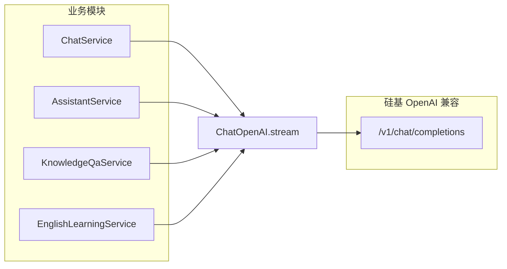

# 后端对话模型统一接入硅基流动（ChatOpenAI）

> **文档角色**：本轮后端 LLM 接入方式重构的**主文档**。  
> **延伸阅读**：[knowledge-assistant-complete.md](../knowledge/knowledge-assistant-complete.md)（助手产品语义与 SSE，文中部分「智谱 fetch」描述需与本文学实现对齐）、[knowledge-qdrant-rag.md](./knowledge-qdrant-rag.md)、[knowledge-siliconflow-embedding-rerank.md](../backend/knowledge-siliconflow-embedding-rerank.md)。

## 1. 背景与目标

### 1.1 问题

主站 **Chat**、知识库 **Assistant**、知识库 **RAG 问答** 曾分别使用 DeepSeek 直连或智谱原生 `fetch` + SSE 解析，接入方式不统一，运维需维护多套 API Key 与解析逻辑。

### 1.2 目标

- 上述 **Chat completion** 类能力统一走 **硅基流动（SiliconFlow）** OpenAI 兼容端点 + LangChain **`ChatOpenAI`** + **`llm.stream()`**。
- 默认模型 **`Pro/zai-org/GLM-4.7`**，与英语学习 Agent 已有实践一致。
- **不改变**对外 API、SSE 事件形态、会话落库、停止生成（Redis epoch）、多轮历史裁剪等业务行为。

若与仓库最新源码不一致，**以源码为准**。

---

## 2. 改动范围

| 路径 | 说明 |
|------|------|
| `apps/backend/src/enum/config.enum.ts` | 新增 `CHAT_SILICONFLOW_MODEL_NAME`；`DEEPSEEK_*` 标 deprecated；补充 `ASSISTANT_GLM_MODEL_NAME` / `KNOWLEDGE_QA_MODEL` 注释 |
| `apps/backend/src/services/chat/chat.service.ts` | `initModel` → `resolveChatSiliconFlowConfig` + 硅基 `ChatOpenAI` |
| `apps/backend/src/services/assistant/assistant.service.ts` | 去掉智谱 `fetch` 读流；`pumpAssistantOpenAiStream` + chunk 映射为 `ZhipuStreamData` |
| `apps/backend/src/services/knowledge-qa/knowledge-qa.service.ts` | `streamGlmChatCompletions` → `streamChatCompletions`（`ChatOpenAI`） |
| `apps/backend/src/services/english-learning/english-learning.service.ts` | 硅基凭证回退链微调（与 Chat 对齐时可读 `DEEPSEEK_API_KEY`） |

**未改动**：向量 embedding / rerank、语音 TTS/ASR、OCR、联网检索（Serper/Tavily）等仍走各自模块。

---

## 3. 实现思路

### 3.1 统一接入模式



各模块保留自己的 **system prompt、历史裁剪、落库、停止** 逻辑，仅替换「如何发 HTTP 流式请求」。

### 3.2 凭证与模型名（环境变量）

| 变量 | 作用 |
|------|------|
| `SILICONFLOW_API_KEY` | 主 Key（与知识库 embedding 同源） |
| `SILICONFLOW_BASE_URL` | 默认 `https://api.siliconflow.cn/v1` |
| `CHAT_SILICONFLOW_MODEL_NAME` | 主站 Chat 模型名 |
| `ASSISTANT_GLM_MODEL_NAME` | 知识库助手模型名（键名保留兼容） |
| `KNOWLEDGE_QA_MODEL` | RAG 问答模型名 |
| `ENGLISH_LEARNING_SILICONFLOW_MODEL_NAME` | 英语学习 Agent |

**回退链（因模块略有差异）**：

- Chat：`SILICONFLOW_API_KEY` → `DEEPSEEK_API_KEY`
- Assistant / QA：`SILICONFLOW_API_KEY` → `DASHSCOPE_API_KEY` → `QWEN_API_KEY` →（Assistant 另含）`DEEPSEEK_API_KEY`
- 英语学习词句包：`SILICONFLOW_API_KEY` → `DASHSCOPE_API_KEY` → `DEEPSEEK_API_KEY`（Base URL 可回退 `DEEPSEEK_BASE_URL`）
- 模型名未配置时默认 **`Pro/zai-org/GLM-4.7`**

### 3.3 与「记忆」的关系

| 模块 | 多轮对话记忆 |
|------|----------------|
| **Chat** | 前端传完整 `messages`，后端 `convertToLangChainMessages` 后流式；**行为不变** |
| **Assistant** | 从 DB 加载历史 → `takeRecentMessagesWithinTokenBudget` → 拼 `requestMessages`；**仍不依赖智谱会话态** |
| **Knowledge QA（RAG）** | 每轮仅 `system + 当前问题 + 检索片段`；**本无多轮历史** |
| **English Learning** | 原有 Agent 多轮；本次仅凭证回退微调 |

换接入方式**不会单独削弱** Assistant 的多轮记忆；记忆仍由 **DB 历史 + token 预算裁剪** 决定。

### 3.4 Assistant 特殊保留

- 对外仍输出 **`ZhipuStreamData`**（`content` / `thinking`），经 `AssistantController` 转为前端既有 SSE 字段（`content` / `raw`）。
- **ephemeral**、`meta.streamId`、Redis **epoch** 停止、`finalizeTurn` / `cleanupTurnOnFailure` 均保留。
- `pumpAssistantOpenAiStream` 在每 chunk 前 `shouldAbort()`，与原先读 SSE 循环内比对 epoch 等价。

---

## 4. 关键代码与注释

### 4.1 主站 Chat：`resolveChatSiliconFlowConfig`

**来源**：`apps/backend/src/services/chat/chat.service.ts`（约 L115–L168）

```typescript
private resolveChatSiliconFlowConfig(): {
  apiKey: string;
  baseURL: string;
  modelName: string;
} {
  const apiKey = (
    this.configService.get<string>(KnowledgeQaEnum.SILICONFLOW_API_KEY) ||
    this.configService.get<string>(ModelEnum.DEEPSEEK_API_KEY) ||
    ''
  ).trim();
  const baseURL = (
    this.configService.get<string>(KnowledgeQaEnum.SILICONFLOW_BASE_URL) ||
    this.configService.get<string>(ModelEnum.DEEPSEEK_BASE_URL) ||
    'https://api.siliconflow.cn/v1'
  ).replace(/\/$/, '');
  const modelName =
    this.configService.get<string>(ModelEnum.CHAT_SILICONFLOW_MODEL_NAME)?.trim() ||
    this.configService.get<string>(ModelEnum.DEEPSEEK_MODEL_NAME)?.trim() ||
    'Pro/zai-org/GLM-4.7';
  // 说明：无 Key 时抛 503，避免静默失败
  if (!apiKey) {
    throw new HttpException(
      '硅基流动未配置（SILICONFLOW_API_KEY，或兼容 DEEPSEEK_API_KEY），无法发起对话',
      HttpStatus.SERVICE_UNAVAILABLE,
    );
  }
  return { apiKey, baseURL, modelName };
}

private initModel(options?: { /* temperature, maxTokens, abortSignal */ }): ChatOpenAI {
  const { apiKey, baseURL, modelName } = this.resolveChatSiliconFlowConfig();
  return new ChatOpenAI({
    apiKey,
    modelName,
    streaming: true,
    configuration: { baseURL },
    temperature: options?.temperature ?? 0.3,
    // ...
  });
}
```

### 4.2 知识库助手：流式泵送

**来源**：`apps/backend/src/services/assistant/assistant.service.ts`（`pumpAssistantOpenAiStream` 约 L248–L298）

```typescript
private async pumpAssistantOpenAiStream(params: {
  subscriber: Subscriber<ZhipuStreamData>;
  requestMessages: Array<{ role: 'system' | 'user' | 'assistant'; content: string }>;
  dto: AssistantChatDto;
  abortController: AbortController;
  shouldAbort: () => Promise<boolean>;
  onContentDelta?: (text: string) => void;
}): Promise<void> {
  const llm = this.buildAssistantStreamLlm({
    temperature: dto.temperature ?? 0.3,
    maxTokens: dto.maxTokens ?? 4096,
    abortSignal: abortController.signal,
  });

  const stream = await llm.stream(
    this.toAssistantLangChainMessages(requestMessages),
  );

  for await (const chunk of stream) {
    // 说明：与 Redis epoch 停止联动，发现世代变化则 abort 本地流
    if (await params.shouldAbort()) {
      abortController.abort();
    }
    for (const evt of this.mapStreamChunkToZhipuEvents(chunk)) {
      subscriber.next(evt);
      if (evt.type === 'content' && typeof evt.data === 'string') {
        onContentDelta?.(evt.data);
      }
    }
  }
}
```

**来源**：`mapStreamChunkToZhipuEvents`（约 L218–L246）

```typescript
// 说明：将 LangChain AIMessageChunk 映射为前端已消费的 ZhipuStreamData 协议
private mapStreamChunkToZhipuEvents(chunk: AIMessageChunk): ZhipuStreamData[] {
  const out: ZhipuStreamData[] = [];
  const ak = chunk.additional_kwargs ?? {};
  const reasoningRaw =
    typeof ak.reasoning_content === 'string' ? ak.reasoning_content : /* ... */;
  if (reasoningRaw) {
    out.push({ type: 'thinking', data: reasoningRaw });
  }
  if (typeof chunk.content === 'string' && chunk.content) {
    out.push({ type: 'content', data: chunk.content });
  }
  return out;
}
```

### 4.3 知识库 RAG 问答

**来源**：`apps/backend/src/services/knowledge-qa/knowledge-qa.service.ts`（约 L44–L135）

```typescript
private async *streamChatCompletions(
  input: { messages: /* system | user | assistant */; temperature?; maxTokens? },
  signal?: AbortSignal,
): AsyncGenerator<string> {
  const llm = this.buildKnowledgeQaStreamLlm({
    temperature: input.temperature,
    maxTokens: input.maxTokens,
    signal,
  });
  const stream = await llm.stream(this.toLangChainMessages(input.messages));

  for await (const chunk of stream) {
    const content = chunk.content;
    if (typeof content === 'string' && content) {
      yield content; // 说明：仍由 askStream 包装为 qa.delta SSE
    }
  }
}
```

### 4.4 英语学习：凭证回退与 Chat 对齐

**来源**：`apps/backend/src/services/english-learning/english-learning.service.ts`（`resolveEnglishPackSiliconFlowConfig`，约 L625–L652）

```typescript
// 说明：英语学习 Agent 本就走硅基；本轮仅统一 Key/BaseURL/模型名的回退链，便于与主 Chat 共用 DEEPSEEK_* 兼容变量
const apiKey = (
  this.configService.get<string>(KnowledgeQaEnum.SILICONFLOW_API_KEY) ||
  this.configService.get<string>(KnowledgeQaEnum.DASHSCOPE_API_KEY) ||
  this.configService.get<string>(ModelEnum.DEEPSEEK_API_KEY) ||
  ''
).trim();
const baseURL = (
  this.configService.get<string>(KnowledgeQaEnum.SILICONFLOW_BASE_URL) ||
  this.configService.get<string>(ModelEnum.DEEPSEEK_BASE_URL) ||
  'https://api.siliconflow.cn/v1'
).replace(/\/$/, '');
const modelName =
  this.configService
    .get<string>(ModelEnum.ENGLISH_LEARNING_SILICONFLOW_MODEL_NAME)?.trim() ||
  this.configService.get<string>(ModelEnum.DEEPSEEK_MODEL_NAME)?.trim() ||
  'Pro/zai-org/GLM-4.7';
```

### 4.5 配置枚举

**来源**：`apps/backend/src/enum/config.enum.ts`（`ModelEnum`，约 L49–L77）

```typescript
/** @deprecated 主聊天已改用硅基流动，见 CHAT_SILICONFLOW_MODEL_NAME */
DEEPSEEK_API_KEY = 'DEEPSEEK_API_KEY',
// ...
CHAT_SILICONFLOW_MODEL_NAME = 'CHAT_SILICONFLOW_MODEL_NAME',
ENGLISH_LEARNING_SILICONFLOW_MODEL_NAME = 'ENGLISH_LEARNING_SILICONFLOW_MODEL_NAME',
/** 知识库助手 Chat 模型名（硅基流动），默认 Pro/zai-org/GLM-4.7 */
ASSISTANT_GLM_MODEL_NAME = 'ASSISTANT_GLM_MODEL_NAME',
```

---

## 5. 兼容性与影响

| 维度 | 说明 |
|------|------|
| **API 契约** | HTTP 路径、DTO、SSE 字段不变 |
| **破坏性** | 部署须配置 `SILICONFLOW_API_KEY`（或各模块声明的兼容 Key）；未配置时 503/错误文案 |
| **回答风格** | 模型由智谱直连 / DeepSeek 换为硅基 `Pro/zai-org/GLM-4.7`，内容可能略有差异 |
| **ZHIPU_API_KEY** | 主 Chat/Assistant/RAG 对话**不再依赖**；其它仍用智谱的模块（若有）不受影响 |

---

## 6. 回归测试建议

1. **主站 Chat**：流式、停止、续写、分支；附件/OCR 与联网检索组合。
2. **知识库助手 AI 模式**：多轮历史、停止生成、ephemeral 草稿、首次保存 `import-transcript`。
3. **知识库 RAG 模式**：检索证据展示、无命中兜底文案、流式 `qa.delta`。
4. **英语学习**：词句包流式与 JSON 结构化生成（确认硅基 Key 有效）。
5. **停止生成**：Assistant 持久化会话与 ephemeral 均能在数秒内停下且无脏数据落库。

---

## 7. 相关源码索引

| 说明 | 路径 |
|------|------|
| 枚举 | `apps/backend/src/enum/config.enum.ts` |
| 主 Chat | `apps/backend/src/services/chat/chat.service.ts` |
| 知识库助手 | `apps/backend/src/services/assistant/assistant.service.ts` |
| RAG 问答 | `apps/backend/src/services/knowledge-qa/knowledge-qa.service.ts` |
| 英语学习 Agent | `apps/backend/src/services/english-learning/english-learning.service.ts` |
| 助手 SSE 控制器 | `apps/backend/src/services/assistant/assistant.controller.ts` |
