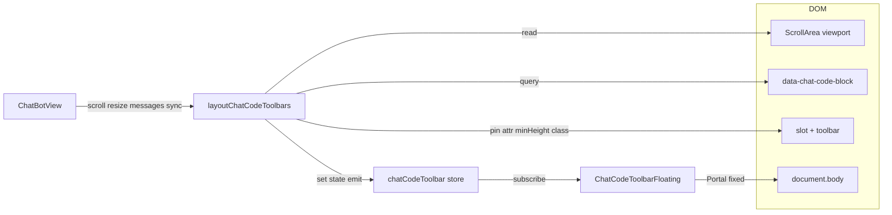

# ChatBot 相关改动说明

**统计范围**：`git log --since="3 days ago"` 中涉及下列路径的提交（至当前 HEAD）。

**涉及文件**：

- `apps/frontend/src/components/design/ChatBot/ChatBotView.tsx`
- `apps/frontend/src/components/design/ChatBot/utils.ts`（分支钉视口滚动纯函数）
- `apps/frontend/src/components/design/ChatBot/index.tsx`
- `apps/frontend/src/components/design/ChatBot/SimpleChatBotView.tsx`
- `apps/frontend/src/components/design/ChatAnchorNav/index.tsx`
- `apps/frontend/src/components/design/ChatMessageActions/index.tsx`
- `apps/frontend/src/hooks/useBranchManage.ts`
- `apps/frontend/src/hooks/useMessageTools.ts`（模块级纯函数与 `buildMessageList` 排序优化）

**主要提交主题（节选）**：Chat 性能与注释、将 UI 抽成 `ChatBotView`、`ChatBotView` 参数与插槽、锚点滚动与条数展示、分支切换卡顿优化、刷新后首次置底、分支按钮钉视口与长消息/遮挡问题、从历史记录进入会话滚到底、`syncViewportScrollMetrics` 多触点同步视口与底栏箭头等。

---

## 一、`index.tsx`（连接层：MobX / Context → `ChatBotView`）

```ts
// 引入 mobx 包：后面用 reaction 订阅可观察数据，避免组件直接依赖 observable 引用链导致 React 不刷新
import * as mobx from 'mobx';
// observer：让函数组件能响应 MobX 可观察字段变化（此处主要配合子树与 store）
import { observer } from 'mobx-react';
// 仅保留连接层需要的 React API，不再在本文件内写消息列表 UI
import React, {
	forwardRef,
	useCallback,
	useEffect,
	useMemo,
	useState,
} from 'react';
// 从 Chat 上下文取滚动 ref 注册、分享勾选等，与 useChatCore 解耦一部分横切逻辑
import { useChatCoreContext } from '@/contexts';
// 会话切换时若本地无分支持久化，用与 hook 相同的算法推导「最新分支」Map
import { findLatestBranchSelection } from '@/hooks/useBranchManage';
// 发送、流式、清空等仍集中在 useChatCore（与本仓库后端耦合）
import { useChatCore } from '@/hooks/useChatCore';
import useStore from '@/store';
// ChatBotRef / ChatBotProps 类型收口到 types，避免连接层再声明一份接口
import { ChatBotProps, ChatBotRef, Message } from '@/types/chat';
// 纯 UI 由 ChatBotView 渲染，本文件只做数据订阅与 props 注入
import ChatBotView from './ChatBotView';

// 对外再导出类型与 View，方便第三方只引 types + ChatBotView，不经过本连接层
export type {
	ChatBotRef,
	ChatBotSimpleViewProps,
	ChatBotViewAnchorNavContext,
	ChatBotViewChatControlsContext,
	ChatBotViewMessageActionsContext,
	ChatBotViewProps,
} from '@/types/chat';
export { default as ChatBotView } from './ChatBotView';
// 轻量封装：只传 messages 时可用 SimpleChatBotView，分支 Map 在内部 useState
export { default as SimpleChatBotView } from './SimpleChatBotView';

/**
 * 模块注释：说明默认导出 ChatBot 的职责边界（MobX、Context、useChatCore），
 * 与可复用的 ChatBotView / SimpleChatBotView 区分。
 */
const ChatBot = observer(
	forwardRef<ChatBotRef, ChatBotProps>(function ChatBot(props, ref) {
		const {
			className,
			apiEndpoint = '/chat/sse',
			showAvatar = false,
			onBranchChange,
			// 以下 show* / render* 透传给 ChatBotView，用于隐藏或替换锚点/操作条/底栏
			showMessageActions,
			showAnchorNav,
			showChatControls,
			renderMessageActions,
			renderAnchorNav,
			renderChatControls,
		} = props;

		const { chatStore } = useStore();
		const {
			onScrollToRef,
			isSharing,
			setIsSharing,
			setCheckedMessage,
			checkedMessages,
		} = useChatCoreContext();

		// 初始化快照：从 store 拷贝一份数组，供下游当「平面全量树」传给 ChatBotView
		const [allMessages, setAllMessages] = useState<Message[]>(() => [
			...chatStore.messages,
		]);
		// 当前会话在树结构上的「每个父节点选哪个子节点」
		const [selectedChildMap, setSelectedChildMap] = useState<
			Map<string, string>
		>(new Map());

		// useCallback 稳定：把 View 传来的 onScrollTo 写进 Context 的 ref，避免 effect 无意义重跑
		const handleScrollToRegister = useCallback(
			(
				handler:
					| ((position: string, behavior?: 'smooth' | 'auto') => void)
					| null,
			) => {
				onScrollToRef.current = handler;
			},
			[onScrollToRef],
		);

		// useMemo 固定对象引用：避免 useBranchManage 内依赖 streamingBranchSource 的 callback 每帧失效
		const streamingBranchSource = useMemo(
			() => ({
				getStreamingMessages: () => chatStore.getStreamingMessages(),
				getStreamingMessageSessionId: (id: string) =>
					chatStore.streamingBranchMaps.get(id)?.sessionId,
				getStreamingBranchMap: (id: string) =>
					chatStore.getStreamingBranchMap(id),
			}),
			[chatStore],
		);

		// 分支选择持久化到 store（会话级），由 View 在切换兄弟后 queueMicrotask 调用
		const onPersistSessionBranchSelection = useCallback(
			(sessionId: string, map: Map<string, string>) => {
				chatStore.saveSessionBranchSelection(sessionId, map);
			},
			[chatStore],
		);

		const {
			input,
			setInput,
			setUploadedFiles,
			editMessage,
			setEditMessage,
			sendMessage,
			clearChat,
			stopGenerating,
			handleEditChange,
			onContinue,
			onContinueAnswering,
		} = useChatCore({
			apiEndpoint,
		});

		// reaction：store.messages 变化时同步到 React state，保证 flatMessages 引用更新、子组件 effect 可依赖
		useEffect(() => {
			const dispose = mobx.reaction(
				() => chatStore.messages,
				(newMessages) => {
					setAllMessages([...newMessages]);
				},
				{ fireImmediately: true },
			);
			return () => dispose();
		}, [chatStore]);

		// reaction：当前会话的分支持久化 Map 变化时，同步到本地 selectedChildMap
		useEffect(() => {
			const dispose = mobx.reaction(
				() => {
					if (chatStore.activeSessionId) {
						return chatStore.getSessionBranchSelection(
							chatStore.activeSessionId,
						);
					}
					return null;
				},
				(newSelectedChildMap) => {
					if (newSelectedChildMap) {
						setSelectedChildMap(new Map(newSelectedChildMap));
					}
				},
				{ fireImmediately: true },
			);
			return () => dispose();
		}, [chatStore]);

		// 仅 activeSessionId 变化时重置输入、附件、编辑态，并恢复/推导分支 Map（与旧行为一致）
		useEffect(() => {
			if (!chatStore.activeSessionId) {
				setSelectedChildMap(new Map());
				setInput('');
				setUploadedFiles([]);
				setEditMessage(null);
				return;
			}

			const savedSelection = chatStore.getSessionBranchSelection(
				chatStore.activeSessionId,
			);

			if (chatStore.messages.length > 0) {
				if (savedSelection) {
					setSelectedChildMap(savedSelection);
				} else {
					const latestBranchMap = findLatestBranchSelection(chatStore.messages);
					if (latestBranchMap) {
						setSelectedChildMap(latestBranchMap);
						chatStore.saveSessionBranchSelection(
							chatStore.activeSessionId,
							latestBranchMap,
						);
					} else {
						setSelectedChildMap(new Map());
					}
				}
			} else {
				setSelectedChildMap(new Map());
			}

			setInput('');
			setUploadedFiles([]);
			setEditMessage(null);
		}, [chatStore.activeSessionId]);

		return (
			<ChatBotView
				ref={ref}
				className={className}
				showAvatar={showAvatar}
				onBranchChange={onBranchChange}
				flatMessages={allMessages}
				selectedChildMap={selectedChildMap}
				onSelectedChildMapChange={setSelectedChildMap}
				activeSessionId={chatStore.activeSessionId ?? null}
				onPersistSessionBranchSelection={onPersistSessionBranchSelection}
				streamingBranchSource={streamingBranchSource}
				input={input}
				setInput={setInput}
				editMessage={editMessage}
				setEditMessage={setEditMessage}
				sendMessage={sendMessage}
				clearChat={clearChat}
				stopGenerating={stopGenerating}
				handleEditChange={handleEditChange}
				onContinue={onContinue}
				onContinueAnswering={onContinueAnswering}
				isCurrentSessionLoading={chatStore.isCurrentSessionLoading}
				isMessageStopped={(id) => chatStore.isMessageStopped(id)}
				isSharing={isSharing}
				setIsSharing={setIsSharing}
				checkedMessages={checkedMessages}
				setCheckedMessage={setCheckedMessage}
				onScrollToRegister={handleScrollToRegister}
				showMessageActions={showMessageActions}
				showAnchorNav={showAnchorNav}
				showChatControls={showChatControls}
				renderMessageActions={renderMessageActions}
				renderAnchorNav={renderAnchorNav}
				renderChatControls={renderChatControls}
			/>
		);
	}),
);

export default ChatBot as React.FC<ChatBotProps> &
	((
		props: { ref?: React.Ref<ChatBotRef> } & ChatBotProps,
	) => React.JSX.Element);
```

---

## 二、`SimpleChatBotView.tsx`

```ts
// 仅需 forwardRef 与本地分支 state 时用到的 API
import { forwardRef, useState } from 'react';
import type { ChatBotRef, ChatBotSimpleViewProps } from '@/types/chat';
import ChatBotView from './ChatBotView';

/**
 * 文件头注释：说明本组件是 ChatBotView 薄封装，flatMessages 用 props.messages 传入。
 */
const SimpleChatBotView = forwardRef<ChatBotRef, ChatBotSimpleViewProps>(
	function SimpleChatBotView(props, ref) {
		// 从 props 拆出 messages 与 initialSelectedChildMap，其余透传给 ChatBotView
		const { messages, initialSelectedChildMap, ...rest } = props;

		// 内部分支 Map：可选用初始 Map 克隆，否则空 Map
		const [selectedChildMap, setSelectedChildMap] = useState<
			Map<string, string>
		>(() =>
			initialSelectedChildMap ? new Map(initialSelectedChildMap) : new Map(),
		);

		return (
			<ChatBotView
				ref={ref}
				flatMessages={messages}
				selectedChildMap={selectedChildMap}
				onSelectedChildMapChange={setSelectedChildMap}
				{...rest}
			/>
		);
	},
);

export default SimpleChatBotView;
```

---

## 三、`ChatBotView.tsx`（分块：滚动、历史进入、分支钉视口、布局）

### 3.1 滚动上限与分支钉视口工具函数

```ts
// 计算可滚动区域的最大 scrollTop，避免 scrollHeight + 常数依赖浏览器钳位行为不一致
function getMaxScrollTop(el: HTMLElement) {
	return Math.max(0, el.scrollHeight - el.clientHeight);
}

// 长消息阈值：行高超过视口一半时，用「行底对齐视口底」而不是钉分支锚点 top
const LONG_ROW_VIEWPORT_HEIGHT_RATIO = 0.5;

// 将指定 message 行的底边与滚动容器视口底边对齐（只改 scrollTop）
function alignMessageRowBottomToViewportBottom(sc: HTMLElement, rowId: string) {
	const row = sc.querySelector(`#message-${rowId}`);
	if (!(row instanceof HTMLElement)) return;
	const delta =
		row.getBoundingClientRect().bottom - sc.getBoundingClientRect().bottom;
	if (Math.abs(delta) > 0.5) sc.scrollTop += delta;
}

// 判断当前行是否属于「长消息」路径（与上面 ratio 一致）
function isLongMessageRowForBranchScroll(sc: HTMLElement, rowId: string) {
	const row = sc.querySelector(`#message-${rowId}`);
	if (!(row instanceof HTMLElement)) return false;
	return (
		row.getBoundingClientRect().height >=
		sc.clientHeight * LONG_ROW_VIEWPORT_HEIGHT_RATIO
	);
}

// 短消息路径：底下还有后续消息时，钉锚点目标略上移，避免贴边误差
const BRANCH_ANCHOR_NUDGE_UP_PX = 20;

// 分支切换待处理的钉视口元数据：按锚点 top 或整行 bottom 两种
type BranchScrollPending = {
	kind: 'anchorTop' | 'rowBottom';
	before: number;
	nextRowId: string;
	seq: number;
};

// 在下一帧根据 pending 修正 scrollTop；返回 true 表示可清除 pending（含 seq 过期）
function tryApplyBranchScrollAnchor(
	sc: HTMLElement,
	pending: BranchScrollPending,
	currentSeq: number,
): boolean {
	if (pending.seq !== currentSeq) return true;
	const r = sc.querySelector(`#message-${pending.nextRowId}`);
	if (!(r instanceof HTMLElement)) return false;
	let d = 0;
	if (pending.kind === 'anchorTop') {
		const a = r.querySelector('[data-message-branch-anchor]');
		if (!(a instanceof HTMLElement)) return false;
		d = a.getBoundingClientRect().top - pending.before;
	} else {
		d = r.getBoundingClientRect().bottom - pending.before;
	}
	if (Math.abs(d) > 0.5) sc.scrollTop += d;
	return true;
}
```

### 3.2 `onScrollTo`：置底与刷新后高度滞后

```ts
// 用户手动滚到底时注册的 ResizeObserver 清理函数，滚顶或卸载前要 disconnect
const manualScrollToBottomCleanupRef = useRef<(() => void) | null>(null);

const onScrollTo = useCallback(
	(position: string, behavior?: 'smooth' | 'auto') => {
		const el = scrollContainerRef.current;
		if (!el) return;
		const bh = behavior ?? 'smooth';

		// 滚到顶部：先清掉置底用的 ResizeObserver
		if (position === 'up') {
			manualScrollToBottomCleanupRef.current?.();
			manualScrollToBottomCleanupRef.current = null;
			el.scrollTo({ top: 0, behavior: bh });
			return;
		}

		// 置底前同样清理上一次 manual 置底观察，避免多个 RO 叠加
		manualScrollToBottomCleanupRef.current?.();
		manualScrollToBottomCleanupRef.current = null;

		// 多次 align：先算合法最大值再滚
		const alignToMax = (scrollBehavior: ScrollBehavior) => {
			el.scrollTo({ top: getMaxScrollTop(el), behavior: scrollBehavior });
		};

		const contentRoot = el.querySelector('#message-content');
		const lastRow = contentRoot?.lastElementChild;
		// 先把最后一行 scrollIntoView(end)，再滚到 max，缓解末行未完全进入视口的问题
		if (lastRow instanceof HTMLElement) {
			lastRow.scrollIntoView({
				block: 'end',
				inline: 'nearest',
				behavior: bh,
			});
		}
		alignToMax(bh === 'smooth' ? 'smooth' : 'auto');

		// behavior 为 auto 时：双 rAF + 短时间 ResizeObserver + 600ms 超时再对齐，应对 MdPreview 等晚挂载撑高
		if (bh === 'auto') {
			requestAnimationFrame(() => {
				alignToMax('auto');
				requestAnimationFrame(() => alignToMax('auto'));
			});
			if (contentRoot) {
				const ro = new ResizeObserver(() => alignToMax('auto'));
				ro.observe(contentRoot);
				let disposed = false;
				let tid = 0;
				const dispose = () => {
					if (disposed) return;
					disposed = true;
					ro.disconnect();
					window.clearTimeout(tid);
					if (manualScrollToBottomCleanupRef.current === dispose) {
						manualScrollToBottomCleanupRef.current = null;
					}
				};
				tid = window.setTimeout(() => {
					alignToMax('auto');
					dispose();
				}, 600);
				manualScrollToBottomCleanupRef.current = dispose;
			}
		}
	},
	[],
);
```

### 3.3 向 Context 注册滚动函数

```ts
useEffect(() => {
	if (!onScrollToRegister) return;
	onScrollToRegister(onScrollTo);
	return () => {
		onScrollToRegister(null);
	};
}, [onScrollTo, onScrollToRegister]);
```

### 3.4 从历史记录进入会话：非流式首屏补一次滚到底

```ts
const sessionEnterScrolledRef = useRef<string | null>(null);

useEffect(() => {
	if (!activeSessionId) {
		sessionEnterScrolledRef.current = null;
		return;
	}
	if (isCurrentSessionLoading) return;
	if (messages.length === 0) return;

	const lastMessage = messages[messages.length - 1];
	const lastStreaming =
		lastMessage?.role === 'assistant' && lastMessage?.isStreaming;
	if (lastStreaming) return;

	if (sessionEnterScrolledRef.current === activeSessionId) return;

	sessionEnterScrolledRef.current = activeSessionId;

	queueMicrotask(() => {
		onScrollTo('down', 'auto');
	});
}, [activeSessionId, messages, isCurrentSessionLoading, onScrollTo]);
```

**释义概要**：无会话时清空「已滚」标记；加载中或尚无消息不滚；最后一条仍在流式则交给流式 effect；同一会话只滚一次，避免每条消息更新都触发；`queueMicrotask` 让布局先提交再置底。

### 3.5 流式输出跟底（仅 assistant + isStreaming）

```ts
useEffect(() => {
	const lastMessage = messages[messages.length - 1];
	const isCurrentlyStreaming =
		lastMessage?.role === 'assistant' && lastMessage?.isStreaming;

	const updateScrollbarState = () => {
		if (scrollContainerRef.current) {
			const { scrollHeight, clientHeight } = scrollContainerRef.current;
			setHasScrollbar(scrollHeight > clientHeight);
		}
	};

	const scrollToBottom = () => {
		const sc = scrollContainerRef.current;
		if (sc && autoScroll && isCurrentlyStreaming) {
			const currentScrollHeight = sc.scrollHeight;
			if (currentScrollHeight !== lastScrollHeightRef.current) {
				lastScrollHeightRef.current = currentScrollHeight;
				sc.scrollTo({
					top: getMaxScrollTop(sc),
					behavior: 'auto',
				});
			}
		}
	};

	updateScrollbarState();
	scrollToBottom();

	const contentWrapper =
		scrollContainerRef.current?.querySelector('#message-content');
	if (contentWrapper && isCurrentlyStreaming) {
		resizeObserverRef.current = new ResizeObserver(() => {
			updateScrollbarState();
			scrollToBottom();
		});
		resizeObserverRef.current.observe(contentWrapper);
	}

	const contentArea =
		scrollContainerRef.current?.querySelector('#message-container');
	if (contentArea && isCurrentlyStreaming) {
		mutationObserverRef.current = new MutationObserver(() => {
			updateScrollbarState();
			scrollToBottom();
		});
		mutationObserverRef.current.observe(contentArea, {
			childList: true,
			subtree: true,
			characterData: true,
		});
	}

	return () => {
		// cleanup 断开观察器
		// ...
	};
}, [messages, autoScroll]);
```

### 3.6 分支切换 `handleBranchChange`（`flushSync` + 长消息 + 持久化）

```ts
const handleBranchChange = useCallback(
	(msgId: string, direction: 'prev' | 'next') => {
		onBranchChange?.(msgId, direction);

		const siblings = findSiblings(flatMessages, msgId);
		const currentIndex = siblings.findIndex((m) => m.chatId === msgId);
		const nextIndex =
			direction === 'next' ? currentIndex + 1 : currentIndex - 1;

		if (nextIndex >= 0 && nextIndex < siblings.length) {
			const nextMsg = siblings[nextIndex];
			const currentMsg = flatMessages.find((m) => m.chatId === msgId);
			const parentId = currentMsg?.parentId;

			const newSelectedChildMap = new Map(selectedChildMap);
			if (parentId) {
				newSelectedChildMap.set(parentId, nextMsg.chatId);
			} else {
				newSelectedChildMap.set('root', nextMsg.chatId);
			}

			let shouldScrollToBottom = false;
			if (props.displayMessages === undefined) {
				const rawPath = buildMessageList(flatMessages, newSelectedChildMap);
				const lastInChain = rawPath[rawPath.length - 1];
				shouldScrollToBottom = lastInChain?.chatId === nextMsg.chatId;
			}

			const sc = scrollContainerRef.current;
			const oldRow = sc?.querySelector(`#message-${msgId}`);
			const oldBranchEl = oldRow?.querySelector(
				'[data-message-branch-anchor]',
			);
			if (shouldScrollToBottom) {
				pendingBranchScrollAnchorRef.current = null;
			} else if (oldRow instanceof HTMLElement) {
				branchScrollSeqRef.current += 1;
				if (oldBranchEl instanceof HTMLElement) {
					pendingBranchScrollAnchorRef.current = {
						kind: 'anchorTop',
						before:
							oldBranchEl.getBoundingClientRect().top -
							BRANCH_ANCHOR_NUDGE_UP_PX,
						nextRowId: nextMsg.chatId,
						seq: branchScrollSeqRef.current,
					};
				} else {
					pendingBranchScrollAnchorRef.current = {
						kind: 'rowBottom',
						before:
							oldRow.getBoundingClientRect().bottom -
							BRANCH_ANCHOR_NUDGE_UP_PX,
						nextRowId: nextMsg.chatId,
						seq: branchScrollSeqRef.current,
					};
				}
			} else {
				pendingBranchScrollAnchorRef.current = null;
			}

			flushSync(() => {
				onSelectedChildMapChange(newSelectedChildMap);
			});
			const scAfter = scrollContainerRef.current;
			if (shouldScrollToBottom && scAfter) {
				scAfter.scrollTop = getMaxScrollTop(scAfter);
				requestAnimationFrame(() => {
					const el = scrollContainerRef.current;
					if (!el) return;
					el.scrollTop = getMaxScrollTop(el);
				});
			} else if (scAfter) {
				const nextId = nextMsg.chatId;
				if (isLongMessageRowForBranchScroll(scAfter, nextId)) {
					pendingBranchScrollAnchorRef.current = null;
					alignMessageRowBottomToViewportBottom(scAfter, nextId);
					requestAnimationFrame(() => {
						const sc = scrollContainerRef.current;
						if (!sc) return;
						alignMessageRowBottomToViewportBottom(sc, nextId);
					});
				} else {
					const anchorPending = pendingBranchScrollAnchorRef.current;
					if (anchorPending) {
						const done = tryApplyBranchScrollAnchor(
							scAfter,
							anchorPending,
							branchScrollSeqRef.current,
						);
						if (done) pendingBranchScrollAnchorRef.current = null;
						if (done) {
							const snap = anchorPending;
							requestAnimationFrame(() => {
								if (snap.seq !== branchScrollSeqRef.current) return;
								const sc = scrollContainerRef.current;
								if (!sc) return;
								if (isLongMessageRowForBranchScroll(sc, snap.nextRowId)) {
									alignMessageRowBottomToViewportBottom(sc, snap.nextRowId);
								} else {
									tryApplyBranchScrollAnchor(
										sc,
										snap,
										branchScrollSeqRef.current,
									);
								}
							});
						}
					}
				}
			}
			if (activeSessionId && onPersistSessionBranchSelection) {
				const sid = activeSessionId;
				const mapSnapshot = new Map(newSelectedChildMap);
				queueMicrotask(() => {
					onPersistSessionBranchSelection(sid, mapSnapshot);
				});
			}
		}
	},
	[/* ... */],
);
```

**释义概要**：用 `findSiblings`/`flatMessages` 算下一兄弟；更新 Map；若切换后该条已是链尾则直接 `getMaxScrollTop`；否则记录切换前分支锚点或行底的视口坐标，提交后用 `tryApplyBranchScrollAnchor` 或长消息路径 `alignMessageRowBottomToViewportBottom`；`flushSync` 保证 DOM 与 Map 同帧；持久化用 `queueMicrotask` 避免与 layout 争抢。

### 3.7 `useLayoutEffect`：DOM 未就绪时补钉一次

```ts
useLayoutEffect(() => {
	const pending = pendingBranchScrollAnchorRef.current;
	if (!pending) return;
	const sc = scrollContainerRef.current;
	if (!sc) return;
	const nextId = pending.nextRowId;
	if (isLongMessageRowForBranchScroll(sc, nextId)) {
		pendingBranchScrollAnchorRef.current = null;
		alignMessageRowBottomToViewportBottom(sc, nextId);
		return;
	}
	const done = tryApplyBranchScrollAnchor(
		sc,
		pending,
		branchScrollSeqRef.current,
	);
	if (done) pendingBranchScrollAnchorRef.current = null;
}, [messages, selectedChildMap]);
```

### 3.8 列表渲染关键布局（避免嵌套滚动、遮挡、overflow-anchor）

```tsx
<ScrollArea
	ref={scrollContainerRef}
	viewportClassName="[overflow-anchor:none]"
	className="flex-1 overflow-hidden w-full backdrop-blur-sm pb-5"
	onScroll={handleScroll}
>
	<div id="message-container" className="max-w-3xl m-auto min-w-0">
		<div id="message-content" className="space-y-6 min-w-0">
			{messages.map((message, index) => (
				<div
					key={message.chatId}
					id={`message-${message.chatId}`}
					style={{ zIndex: messages.length - index }}
					className={cn(
						'flex gap-3 w-full',
						message.role === 'user' ? 'flex-row-reverse' : '',
					)}
				>
					<div
						className={cn(
							'relative flex-1 flex flex-col gap-1 pb-10 w-full group',
							message.role === 'user' ? 'items-end' : '',
						)}
					>
						{/* ... 气泡与 ChatMessageActions ... */}
					</div>
				</div>
			))}
		</div>
	</div>
</ScrollArea>
```

**释义概要**：`overflow-anchor:none` 减轻浏览器滚动锚定导致的置底弹跳；`message-container` 不再使用内层 `overflow-y-auto`，避免与外层 ScrollArea 双滚动；`zIndex: messages.length - index` 让**靠上**的消息行盖住**靠下**行的 absolute 操作区，减少分支按钮被下一条挡住；`pb-10` 为气泡底部绝对定位的操作条留出空间。

---

## 四、`ChatMessageActions/index.tsx`（分支区域锚点）

```tsx
{/* 分支切换按钮区域；data 供 ChatBotView 在切换兄弟后钉住视口位置 */}
{hasSiblings && !isSharing && (
	<div
		data-message-branch-anchor
		className={`${
			message.role === 'user'
				? 'order-last ml-5 -mr-3.5'
				: 'order-first mr-5 -ml-3.5'
		} flex items-center gap-1 text-textcolor/70 select-none`}
	>
```

**释义**：`data-message-branch-anchor` 给 `querySelector` 用，切换分支时用该元素 `getBoundingClientRect().top` 作为钉视口的参考点（见 `tryApplyBranchScrollAnchor` 的 `anchorTop` 分支）。

---

## 五、`ChatAnchorNav/index.tsx`（锚点滚动与条数展示）

```ts
// 主区域处于「点击锚点触发的 smooth 滚动」期间为 true，scroll 回调里跳过 calculateActiveAnchor，避免高亮在动画中途乱跳
const isProgrammaticMainScrollRef = useRef(false);
// scrollend 缺失时的兜底定时器，超时后解锁 isProgrammaticMainScrollRef
const programmaticScrollFallbackTimerRef = useRef<ReturnType<
	typeof setTimeout
> | null>(null);
```

```ts
const handleScroll = () => {
	if (isProgrammaticMainScrollRef.current) return;
	if (rafIdRef.current !== null) return;
	rafIdRef.current = requestAnimationFrame(() => {
		calculateActiveAnchor();
		rafIdRef.current = null;
	});
};
```

```ts
// 侧栏锚点列表滚动用 instant（behavior: 'auto'），避免与主列表 smooth 同时产生双重「弹性」观感
listContainer.scrollTo({
	top: Math.max(0, targetScrollTop),
	behavior: 'auto',
});
```

```tsx
// 上按钮上方显示「当前是第几条用户消息」（currentIndex + 1）
<div className="opacity-0 group-hover:opacity-100 text-sm text-textcolor/60 mb-2 text-center">
	{currentIndex + 1}
</div>
```

```tsx
// 下按钮下方显示用户消息总条数（「anchor 增加条数」需求）
<div className="opacity-0 group-hover:opacity-100 text-sm text-textcolor/60 mt-2 text-center">
	{userMessages.length}
</div>
```

```tsx
// 锚点列表区域 max-h-80 + ScrollArea，用户消息多时可滚动侧栏
<div className="flex-1 flex max-h-80 overflow-hidden">
	<ScrollArea className="flex-1 overflow-hidden w-full">
```

---

## 六、`useBranchManage.ts`（性能：`latestBranchMapMemo` 与布尔导出）

```ts
// 模块级导出 findLatestBranchSelection：供 ChatBot 连接层与 hook 共用同一套「选最新子节点」算法
export function findLatestBranchSelection(
	allMessages: Message[],
): Map<string, string> {
	// ... 建树、按时间选 latest root 与每层 latest child ...
}
```

```ts
// 仅在 allFlatMessages 引用变化时重算整棵树的「最新分支」映射，避免每次 render 全量 findLatestBranchSelection
const latestBranchMapMemo = useMemo(
	() =>
		allFlatMessages.length === 0
			? null
			: findLatestBranchSelection(allFlatMessages),
	[allFlatMessages],
);
```

```ts
// isLatestBranch：逐层对比 selectedChildMap 与 latestBranchMapMemo，判断是否「每一层都选了时间最新的子节点」
const isLatestBranch = useMemo(() => {
	// ...
}, [
	allFlatMessages.length,
	messages,
	selectedChildMap,
	latestBranchMapMemo,
]);
```

```ts
// switchToLatestBranch / switchToStreamingBranch：setTimeout 50ms 后再 onScrollTo('down','auto')，等待分支切换后布局稳定再滚到底
latestBranchTimerRef.current = setTimeout(() => {
	onScrollTo('down', 'auto');
}, 50);
```

---

## 七、分支切换钉视口 + 从消息列表进入会话置底（`utils.ts` 与 `ChatBotView.tsx`）

本节说明两类体验问题的**成因**与**实现要点**：（1）切换助手分支时列表跳动、长气泡底部操作区被顶出视口；（2）从消息列表进入历史会话时首屏未贴底、或首帧 `scrollHeight` 偏小导致「像卡顿/没滚到底」。实现上滚动辅助函数集中在 `utils.ts`，状态与副作用在 `ChatBotView.tsx`。

### 7.1 问题与目标（为何改）

| 场景 | 现象 | 方向 |
|------|------|------|
| 助手分支 prev/next | 切换后下方链路长度变化，`scrollTop` 不变时分支条（在气泡底部）会跑出视口 | 切换前采样视口坐标，切换后把同一「视觉锚点」钉回视口；长消息改钉整行底边 |
| 用户消息分支 | 无气泡底部分支条，不需要向下补偿 | 不做 `pending` / 锚点 / 长消息对齐 |
| 历史会话进入 | 最后一条非流式时，原逻辑只靠流式 observer 跟底，首屏常停在列表中部 | `sessionEnterScrolledRef` + `queueMicrotask` 触发一次 `onScrollTo('down','auto')` |
| 刷新/懒渲染后滚底 | 首帧 `scrollHeight` 小于最终高度，单次 `scrollTop = max` 仍留空 | `scrollIntoView` + 双帧 `requestAnimationFrame` + `ResizeObserver` + 延时 `dispose` |
| 卸载/快速打断 | 未取消的 `requestAnimationFrame` 可能在卸载后仍读 DOM | `scrollToBottomRafCancelRef`、`branchChangeRafIdsRef` + 卸载 `cancelAnimationFrame` |

### 7.2 `utils.ts`（钉视口计算，与 DOM 约定耦合）

消息行容器约定 id 为 `#message-${chatId}`；助手分支锚点元素带 `[data-message-branch-anchor]`（见 `ChatMessageActions` 等）。

```ts
// 切换后待应用的钉视口任务：kind 区分按分支条顶还是按整行底；before 为切换前该点在视口中的纵向坐标（已含 nudge）；seq 与 branchScrollSeqRef 对齐用于防连点串台
export type BranchScrollPending = {
	kind: 'anchorTop' | 'rowBottom';
	before: number;
	nextRowId: string;
	seq: number;
};

// 行高达到滚动容器可视高度一半及以上 →「长消息」：若仍按锚点 top 对齐，会把整段气泡往上推，底部分支条反而离开视口
const LONG_ROW_VIEWPORT_HEIGHT_RATIO = 0.5;

// 短消息路径：目标点略上移几个像素，避免钉死后紧贴视口上沿观感太死
export const BRANCH_ANCHOR_NUDGE_UP_PX = 20;

// 合法 scrollTop 上界：scrollHeight - clientHeight，避免依赖浏览器对超大 scrollTop 的静默钳位
export function getMaxScrollTop(el: HTMLElement) {
	return Math.max(0, el.scrollHeight - el.clientHeight);
}

// 把 #message-row 的底边与滚动容器视口底边对齐：只改外层 sc 的 scrollTop，delta = 行底 - 视口底
export function alignMessageRowBottomToViewportBottom(sc: HTMLElement, rowId: string) {
	const row = sc.querySelector(`#message-${rowId}`);
	if (!(row instanceof HTMLElement)) return;
	const delta =
		row.getBoundingClientRect().bottom - sc.getBoundingClientRect().bottom;
	if (Math.abs(delta) > 0.5) sc.scrollTop += delta;
}

// 根据行高与视口比例判断是否走「长消息」分支
export function isLongMessageRowForBranchScroll(sc: HTMLElement, rowId: string) {
	const row = sc.querySelector(`#message-${rowId}`);
	if (!(row instanceof HTMLElement)) return false;
	return (
		row.getBoundingClientRect().height >=
		sc.clientHeight * LONG_ROW_VIEWPORT_HEIGHT_RATIO
	);
}

// 用 pending.before 与切换后新行上对应点（锚点 top 或行底）求差，把差值加到 scrollTop；返回 true 表示可结束（成功或 seq 已过期）；false 表示新行/锚点 DOM 未就绪，交给 useLayoutEffect 再试
export function tryApplyBranchScrollAnchor(
	sc: HTMLElement,
	pending: BranchScrollPending,
	currentSeq: number,
): boolean {
	if (pending.seq !== currentSeq) return true;
	const r = sc.querySelector(`#message-${pending.nextRowId}`);
	if (!(r instanceof HTMLElement)) return false;
	let d = 0;
	if (pending.kind === 'anchorTop') {
		const a = r.querySelector('[data-message-branch-anchor]');
		if (!(a instanceof HTMLElement)) return false;
		d = a.getBoundingClientRect().top - pending.before;
	} else {
		d = r.getBoundingClientRect().bottom - pending.before;
	}
	if (Math.abs(d) > 0.5) sc.scrollTop += d;
	return true;
}
```

### 7.3 `ChatBotView.tsx`：refs 与分支用 rAF 包装

```ts
// flushSync 之后若子树未完全就绪，仍可能需下一帧 layout 再钉一次：pending 存「要补的滚动修正」
const pendingBranchScrollAnchorRef = useRef<BranchScrollPending | null>(null);
// 每次助手分支切换递增；rAF / tryApply 内比对 snap.seq，丢弃过期回调
const branchScrollSeqRef = useRef(0);
// 记录「本会话是否已做过进入时滚到底」，避免 messages 小更新反复触发 onScrollTo 造成卡顿感
const sessionEnterScrolledRef = useRef<string | null>(null);
// onScrollTo('down','auto') 双帧 rAF：当没有 #message-content 时没有 dispose，靠此 ref 在卸载/下次滚底时 cancel
const scrollToBottomRafCancelRef = useRef<(() => void) | null>(null);
// handleBranchChange 内 scheduleBranchRaf 登记的 id，卸载时统一 cancelAnimationFrame
const branchChangeRafIdsRef = useRef<Set<number>>(new Set());

// 执行前把 id 加入 Set，回调执行后 delete；组件卸载遍历 Set cancel，避免卸载后仍改 scrollTop
const scheduleBranchRaf = useCallback((fn: FrameRequestCallback) => {
	const id = requestAnimationFrame((time) => {
		branchChangeRafIdsRef.current.delete(id);
		fn(time);
	});
	branchChangeRafIdsRef.current.add(id);
}, []);
```

### 7.4 `onScrollTo('down', 'auto')`：首屏/刷新后贴底与 rAF 清理

```ts
// 滚顶或新一轮滚底前：断开上一轮 ResizeObserver + 清定时器，并取消未执行的双帧 rAF（含无 contentRoot 时挂在 ref 上的 cancel）
manualScrollToBottomCleanupRef.current?.();
manualScrollToBottomCleanupRef.current = null;
scrollToBottomRafCancelRef.current?.();
scrollToBottomRafCancelRef.current = null;

// 先让最后一行 scrollIntoView(block:'end')，再 scrollTo(max)，缓解首帧高度不足
const alignToMax = (scrollBehavior: ScrollBehavior) => {
	el.scrollTo({ top: getMaxScrollTop(el), behavior: scrollBehavior });
};

// behavior === 'auto'：双帧 rAF 再 alignToMax；若有 #message-content，ResizeObserver 在高度变化时继续贴底，600ms 后 dispose 并 cancel 两层 rAF
const rafHandles = { outer: 0, inner: 0 };
const cancelScrollToBottomRafs = () => {
	cancelAnimationFrame(rafHandles.outer);
	cancelAnimationFrame(rafHandles.inner);
	rafHandles.outer = rafHandles.inner = 0;
};
// dispose 内首行调用 cancelScrollToBottomRafs，保证与 RO/timeout 一并释放

// 若无 contentRoot：scrollToBottomRafCancelRef.current = cancelScrollToBottomRafs，供卸载与下次滚底取消
```

### 7.5 从消息列表进入会话：补一次滚到底

```ts
// 无会话 id 时重置「进入标记」，避免切换账号/清空后错误跳过
if (!activeSessionId) {
	sessionEnterScrolledRef.current = null;
	return;
}
// 会话消息仍在加载则不滚，避免空列表或半截数据
if (isCurrentSessionLoading) return;
if (messages.length === 0) return;

// 若最后一条仍在流式，交给下方 observer 跟底，此处不抢
const lastStreaming =
	lastMessage?.role === 'assistant' && lastMessage?.isStreaming;
if (lastStreaming) return;

// 同一会话只触发一次进入滚底，避免 messages 依赖导致 effect 反复执行 → 主观卡顿
if (sessionEnterScrolledRef.current === activeSessionId) return;
sessionEnterScrolledRef.current = activeSessionId;

// 微任务排到当前 commit 之后，再调 onScrollTo，让 DOM 先挂上消息列表
queueMicrotask(() => {
	onScrollTo('down', 'auto');
});
```

### 7.6 `handleBranchChange`：流程摘要（与源码注释一致）

1. `findSiblings(flatMessages, msgId)` 算兄弟，**不得**用 `displayMessages`（会丢旁支）。
2. 拷贝 `selectedChildMap`，在 `parentId` 或 `'root'` 上写入 `nextMsg.chatId`。
3. `shouldScrollToBottom`：仅当未外部传入 `displayMessages` 时，用 `buildMessageList` + 新 map 判断选中兄弟是否为链尾。
4. `isAssistantBranchSwitch`：仅 `role === 'assistant'` 时设置 `pendingBranchScrollAnchorRef` 与后续补偿；**用户消息**分支直接 `pending = null`，且 `flushSync` 后不走进长消息/锚点分支。
5. `flushSync(() => onSelectedChildMapChange(...))`：内容与 map 同帧，避免闪分支。
6. 若 `shouldScrollToBottom`：`scrollTop = getMaxScrollTop` + `scheduleBranchRaf` 再贴底一次（lazy 增高）。
7. 若助手且非贴底：长消息用 `alignMessageRowBottomToViewportBottom` + `scheduleBranchRaf`；短消息用 `tryApplyBranchScrollAnchor`，成功后再 `scheduleBranchRaf` 做第二帧（MdPreview 撑高后可能改长消息策略）。
8. `onPersistSessionBranchSelection` 放 `queueMicrotask`，减轻与 layout 同帧竞争。

### 7.7 `useLayoutEffect`：DOM 晚就绪时的补钉

```ts
// 依赖 messages、selectedChildMap：flushSync 后若 tryApply 返回 false（节点未挂载），在此阶段再量一次
const pending = pendingBranchScrollAnchorRef.current;
if (!pending) return;
// 若已变长消息：改行底对齐并清空 pending
if (isLongMessageRowForBranchScroll(sc, nextId)) {
	pendingBranchScrollAnchorRef.current = null;
	alignMessageRowBottomToViewportBottom(sc, nextId);
	return;
}
// 否则再 tryApplyBranchScrollAnchor，成功则清 pending
```

### 7.8 卸载清理（与 rAF 相关）

```ts
manualScrollToBottomCleanupRef.current?.();
scrollToBottomRafCancelRef.current?.();
branchChangeRafIdsRef.current.forEach((id) => {
	cancelAnimationFrame(id);
});
branchChangeRafIdsRef.current.clear();
```

### 7.9 `syncViewportScrollMetrics`：为何多处调用、影响点与作用

#### 作用（这一函数到底干什么）

从 `ScrollArea` 的**视口节点**（与 `scrollContainerRef` 绑定的 Radix `Viewport`）**同一次读取**：

- `scrollTop`
- `scrollHeight`
- `clientHeight`

并据此**一并更新**与滚动相关的 React state：

- `scrollTop`（供其它逻辑需要时与 DOM 对齐，避免「只信过期的 state」）
- `hasScrollbar`（`scrollHeight > clientHeight`，控制底栏是否出现滚动按钮）
- `isAtBottom`（`scrollHeight - scrollTop - clientHeight < SCROLL_THRESHOLD`，控制 `ChatControls` 箭头朝上/朝下）
- `autoScroll`（与「是否在底部」一致，供流式输出时是否自动跟底使用）

**设计动机**：历史上用 `useMemo` 计算「是否在底部」时，曾把 **state 里的 `scrollTop`** 和 **ref 里当前帧的 `scrollHeight` / `clientHeight`** 混在一起算。换会话、换分支或从无滚动条列表切到有滚动条列表时，DOM 已是新内容高度，但 **`scrollTop` 的 state 仍可能停留在上一会话/上一分支**（程序化改 `scrollTop` 或未冒泡的 `scroll`），就会误判「已在底部」→ **`ChatControls` 箭头方向反了**（例如应显示「置底」向下箭头却显示「置顶」向上箭头）。`syncViewportScrollMetrics` 把「读 DOM → 写 state」收口成一处，保证**四项指标来自同一快照**。

#### 影响点（谁会因它变对/变错）

| 消费方 | 依赖字段 | 不同步时的典型问题 |
|--------|----------|-------------------|
| `ChatControls` | `hasScrollbar`、`isAtBottom` | 从无滚动条会话切到有滚动条会话后，按钮突然出现但箭头方向错误；或该显示「滚到底」却显示「滚到顶」 |
| 流式跟底逻辑 | `autoScroll` + 真实 `scrollTop` | 误判跟底开关，或 `lastScrollHeightRef` 与视口脱节（与其它修复配合） |
| 调试与后续扩展 | `scrollTop` state | 避免日志/后续功能读到与视口不一致的滚动位置 |

#### 为何要在「这么多地方」调用（而不是只放在 `handleScroll` 里）

浏览器与当前实现里，**并不是每一次视口滚动或 `scrollTop` 变化都会触发挂在 Viewport 上的 React `onScroll`**。只要在下面任一情况下**只依赖 `handleScroll`**，就会出现「DOM 已经滚过去了，state 没更新」的窗口期：

1. **`onScrollTo` / `alignToMax`**：`element.scrollTo(...)`、`scrollIntoView` 以及双帧 `rAF`、内部 `ResizeObserver` 触发的贴底，在部分时序下**不保证**走 `handleScroll`，或走在了 React 批更新尚未反映到依赖的帧。因此在 **`alignToMax` 末尾**通过 `syncViewportScrollMetricsRef.current()` 补一刀（`onScrollTo` 用 ref 是为了 `useCallback([])` 稳定且仍能调到最新实现）。
2. **滚顶分支** `position === 'up'`：`scrollTo({ top: 0 })` 后同样显式同步。
3. **从会话列表进入会话**：`queueMicrotask` 里 `onScrollTo('down','auto')` 后，再在**双 `requestAnimationFrame`** 末尾同步，覆盖「滚底在 rAF 链末尾才落定、中间没有可靠 `scroll` 事件」的情况。
4. **流式 `useEffect`**：在 **`scrollToBottom()` 之后**调用，避免「先读了 metrics 再滚」的顺序颠倒；在 **ResizeObserver / MutationObserver** 回调里 **`scrollToBottom()` 之后**再同步，避免仅内容高度变而 state 未跟。
5. **`useLayoutEffect([messages, activeSessionId, selectedChildMap])`**：在 **DOM 已按新会话/新分支/新列表提交后**立刻用视口真值覆盖 state，专门解决「列表结构已换，scroll 相关 state 仍是上一上下文」的错位。
6. **`handleScroll`**：用户滚轮/拖拽滚动条等**正常会触发** `onScroll` 的路径，统一走 `syncViewportScrollMetrics()`，与程序化路径行为一致。
7. **`handleBranchChange`**：存在 **`sc.scrollTop = getMaxScrollTop(...)`** 或 `alignMessageRowBottomToViewportBottom` 等**直接改 DOM** 的逻辑，**不保证**产生 `onScroll`。因此在 **`queueMicrotask` / `scheduleBranchRaf` 回调末尾**补同步，保证切分支后底栏箭头与 `hasScrollbar` 立即正确。

#### 性能与重复调用

单次 `sync` 仅为**常数次 DOM 属性读取**与**至多若干次 `setState`**；React 18+ 会对同一事件/同一 commit 内的更新做批处理。流式场景下主要在「确实发生了滚底或布局变化」的回调里调用，属于**用可接受的同步成本换 UI 状态与视口一致**，避免出现难以排查的「箭头反了、跟底停了」类问题。

**小结**：分支切换的「不卡顿、不跳错」依赖 **同帧 `flushSync` + 视口锚点数学（utils）+ 长/短分支 + seq**；列表进入的「不卡在中间」依赖 **`sessionEnterScrolledRef` 单次触发 + `queueMicrotask` + `onScrollTo` 双帧与 RO**；**rAF cancel** 负责卸载与快速打断时的安全收尾；**`syncViewportScrollMetrics` 多触点调用**则保证 **程序化滚动 / 直接改 `scrollTop` / 换会话换分支** 后，`ChatControls` 与流式跟底所依赖的 state 与**真实视口**一致。

---

## 八、多轮对话 + 多分支：切换分支卡死 / 从历史进入卡顿 — 成因与代码层修复

> 说明：桌面端（如 Tauri/Electron）上渲染线程长时间阻塞时「主进程卡死」；本质多为 **JS 主线程（与 UI 同线程）** 在单帧或连续多帧内做了过多工作。以下修复均针对 **减少无效重渲染、避免每帧全量 O(n) 重算、避免副作用风暴**。

### 8.1 问题如何从「轮数多、分支多」被放大

| 瓶颈类型 | 典型表现 | 轮数/分支变多时的后果 |
|----------|----------|------------------------|
| **列表项引用抖动** | 每次 `selectedChildMap` 变化都 `getFormatMessages` 出全新数组，且每项都是新对象 | React 认为每一行 props 全变 → **N 条消息 ×（User/Assistant 子树 + Markdown）** 同步重渲染，单帧耗时可超百毫秒 |
| **「最新分支」全量重算** | 每次 render 都对整棵 `flatMessages` 跑 `findLatestBranchSelection` | O(n) 建树 +  walk，与 render 次数相乘，切分支/进会话时易卡顿 |
| **Hook 返回函数引用不稳定** | `useMessageTools()` 内联定义 `buildMessageList` / `findSiblings`，每次 render 新函数 | 依赖它们的 `useMemo`/`useCallback` **依赖恒变** → effect 重复跑、子树认为 props 变 |
| **`buildMessageList` 内重复排序** | 沿链 walk 时对兄弟反复 `sort` | 兄弟多、层数多时 CPU 徒增 |
| **进入会话时重复滚底** | `messages` 在 hydrate/多次 patch 时连续变，`useEffect` 每次触发 `onScrollTo` | 连续 layout/scroll，主观卡顿 |
| **同步持久化与 paint 争抢** | 分支切换后立刻同步写 Store/磁盘 | 与 `flushSync`、布局测量叠在同一敏感时段，拉长关键路径（辅助手段见 `queueMicrotask`） |

### 8.2 `useMessageTools.ts`：稳定引用 + 兄弟排序只做一次

```ts
// 模块注释摘要：纯函数提到模块级，避免「每次 render 新建函数引用」导致下游 useMemo/useCallback 依赖误判为变化，引发多余 effect 与重渲染（多轮对话下会被放大）
/**
 * 性能：以下函数不依赖 Hook 闭包，全部放在模块级。
 * 原先在 useMessageTools() 内每次 render 都会新建函数引用，导致依赖 buildMessageList / findSiblings 等的
 * useCallback、useEffect 依赖比较永远认为「变了」，从而重复执行或让子组件认为 props 变了。
 * 抽成常量引用后，调用方可以稳定依赖这些函数，逻辑与之前完全一致（仍是同一套纯函数实现）。
 */

// 每组兄弟只 sort 一次；walk 里只 findIndex，避免「沿链每步都对同一组兄弟排序」的重复 CPU
const sortMessagesByTimeAsc = (arr: Message[]) => {
	arr.sort((a, b) => getMessageSortTime(a) - getMessageSortTime(b));
};

// buildMessageList：先建 childrenMap，再对 childrenMap 的每个 value、以及多根 rootMessages 各调用一次 sortMessagesByTimeAsc
for (const siblings of childrenMap.values()) {
	sortMessagesByTimeAsc(siblings);
}
if (rootMessages.length > 1) {
	sortMessagesByTimeAsc(rootMessages);
}

// Hook 始终返回同一对象引用，ChatBotView 的 messages useMemo 可把 buildMessageList/getFormatMessages 放进依赖且不引起无意义失效
const MESSAGE_TOOLS = { /* ... */ buildMessageList, findSiblings, getFormatMessages };
export const useMessageTools = () => MESSAGE_TOOLS;
```

**释义**：轮数多时 `buildMessageList` 调用频率高（每次 `selectedChildMap` / `flatMessages` 变）。**排序从「walk 内热循环」挪到「预处理每组兄弟一次」**，复杂度从「层数 × 每层多次 sort」降为「兄弟组数 × 单次 sort」。**稳定函数引用**切断「render → 新函数 → useMemo 失效 → 更重 render」的连锁反应。

### 8.3 `ChatBotView.tsx`：展示列表「结构共享」稳定 message 引用

```ts
// ref 保存上一轮 merge 结果，供下一轮按索引比较「语义是否未变」
const stableDisplayMessagesRef = useRef<Message[]>([]);

const messages = useMemo(() => {
	if (props.displayMessages !== undefined) {
		stableDisplayMessagesRef.current = props.displayMessages;
		return props.displayMessages;
	}
	const raw = buildMessageList(flatMessages, selectedChildMap);
	const fresh = getFormatMessages(raw);
	const prev = stableDisplayMessagesRef.current;
	if (prev.length === 0) {
		stableDisplayMessagesRef.current = fresh;
		return fresh;
	}
	// 按索引对齐：同一槽位若 chatId、content、think、sibling*、role、附件、流式/停止等均未变，则沿用 prev[i] 的同一对象引用
	const merged = fresh.map((n, i) => {
		const p = prev[i];
		if (!p) return n;
		if (
			p.chatId === n.chatId &&
			p.content === n.content &&
			(p.thinkContent ?? '') === (n.thinkContent ?? '') &&
			p.isStreaming === n.isStreaming &&
			p.siblingIndex === n.siblingIndex &&
			p.siblingCount === n.siblingCount &&
			p.role === n.role &&
			p.attachments === n.attachments &&
			p.finishReason === n.finishReason &&
			(p.isStopped ?? false) === (n.isStopped ?? false)
		) {
			return p; // 引用不变 → ChatAssistantMessage.memo、Markdown 等可跳过深渲染
		}
		return n;
	});
	stableDisplayMessagesRef.current = merged;
	return merged;
}, [props.displayMessages, flatMessages, selectedChildMap, buildMessageList, getFormatMessages]);
```

**释义**：切换分支时，**仅分叉点之后**的链与索引会变化；**前缀轮次**若 `chatId` 与内容不变，应复用旧引用。否则 N 条全部新引用 → **N 份 Markdown/气泡** 同时 diff，极易造成长时间主线程占用（表现为卡死或严重掉帧）。

### 8.4 `useBranchManage.ts`：「最新分支」Map 只随 flat 树引用变而重算

```ts
// 仅当 allFlatMessages 引用变化时执行 findLatestBranchSelection；不在每一次 render 上对整棵树 O(n) 重算
const latestBranchMapMemo = useMemo(
	() =>
		allFlatMessages.length === 0
			? null
			: findLatestBranchSelection(allFlatMessages),
	[allFlatMessages],
);

// isLatestBranch：遍历当前展示链 messages，与 latestBranchMapMemo、selectedChildMap 比对；不再每次调用 findLatestBranchSelection
const isLatestBranch = useMemo(() => {
	// ...
}, [allFlatMessages.length, messages, selectedChildMap, latestBranchMapMemo]);
```

**释义**：`findLatestBranchSelection` 需遍历 `allMessages` 建树。对话轮数、分支节点多时 **单次成本已不低**；若与 **每次 render** 相乘，切分支或 Store 高频更新时会明显卡顿。**memo 化**把重算限制在「整平面列表引用更新」（通常一批消息写入一次）时。

### 8.5 `index.tsx`（连接层）：减少向下游传导的「引用抖动」

```ts
// streamingBranchSource 用 useMemo 包一层，依赖 [chatStore]；闭包内仍每次调用 getStreamingMessages 等读 MobX，行为不变
// 若每次 render 新建对象，useBranchManage 内依赖 streamingBranchSource 的 useMemo/useCallback 会频繁失效
const streamingBranchSource = useMemo(
	() => ({
		getStreamingMessages: () => chatStore.getStreamingMessages(),
		getStreamingMessageSessionId: (id: string) =>
			chatStore.streamingBranchMaps.get(id)?.sessionId,
		getStreamingBranchMap: (id: string) =>
			chatStore.getStreamingBranchMap(id),
	}),
	[chatStore],
);

// 不传 displayMessages：由 ChatBotView 内部对 flatMessages + selectedChildMap 单一 useMemo 推导展示列，避免连接层再维护一份重复 state + effect
// 见 ChatBotView props：仅 flatMessages / selectedChildMap / onSelectedChildMapChange
```

**释义**：连接层少一份「格式化后的 messages」状态，就少一轮 **setState → render → 大列表**；与 8.3 的 merge 策略配合，使 **单次分支切换** 的渲染量接近「仅变化后缀行」而非「整表 N 行」。

### 8.6 分支切换与进入会话：避免「副作用风暴」（与第七节衔接）

```ts
// 持久化分支选择放到微任务，避免与 flushSync 触发的同步布局、scroll 修正同帧抢主线程（多轮会话写盘/Store 若较重时更明显）
queueMicrotask(() => {
	onPersistSessionBranchSelection(sid, mapSnapshot);
});

// 进入会话：同一会话 id 只触发一次滚底，避免 messages 从空→半载→满载连续触发多次 onScrollTo（历史会话消息多时 scroll/layout 叠加卡顿）
if (sessionEnterScrolledRef.current === activeSessionId) return;
sessionEnterScrolledRef.current = activeSessionId;
queueMicrotask(() => {
	onScrollTo('down', 'auto');
});
```

**释义**：**`sessionEnterScrolledRef`** 解决「依赖 `[messages, …]` 时进入长会话 effect 连跑多趟」；**`queueMicrotask`** 把非关键路径稍延后，缩短用户可感知的同步阻塞段。

### 8.7 关于 `flushSync` 与性能

```ts
flushSync(() => {
	onSelectedChildMapChange(newSelectedChildMap);
});
```

**释义**：`flushSync` 会 **同步** 提交 React 更新并跑子树渲染，单帧成本高于批量更新；此处用于 **分支 UI 与 DOM 行 id 同帧一致**，否则钉视口测量会读到错误分支。**取舍**：用可控的一次同步提交换滚动正确性；整体卡顿的主因仍由 **8.2–8.5 控制重渲染与全量重算** 承担，而不是单靠去掉 `flushSync`。

### 8.8 涉及文件速查

| 文件 | 作用 |
|------|------|
| `useMessageTools.ts` | 稳定工具引用、`buildMessageList` 预处理排序 |
| `ChatBotView.tsx` | `messages` 结构共享、`handleBranchChange` 微任务持久化、进入会话单次滚底、钉视口 |
| `useBranchManage.ts` | `latestBranchMapMemo`、`isLatestBranch` 避免每帧全树推导 |
| `index.tsx` | `streamingBranchSource` useMemo、单一数据源进 View |
| `utils.ts` | 钉滚动纯函数（与 CPU 无关，但减少错误重滚导致的二次布局） |

---

## 附：如何自行生成与本文档同范围的 diff

```bash
git log --since="3 days ago" --oneline -- \
  apps/frontend/src/components/design/ChatBot/ \
  apps/frontend/src/components/design/ChatAnchorNav/ \
  apps/frontend/src/components/design/ChatMessageActions/ \
  apps/frontend/src/hooks/useBranchManage.ts \
  apps/frontend/src/hooks/useMessageTools.ts \
  apps/frontend/src/hooks/useMessageTools.ts

git diff ba10fff^...HEAD -- \
  apps/frontend/src/components/design/ChatBot/ \
  apps/frontend/src/components/design/ChatAnchorNav/ \
  apps/frontend/src/components/design/ChatMessageActions/ \
  apps/frontend/src/hooks/useBranchManage.ts \
  apps/frontend/src/hooks/useMessageTools.ts
```

（注：`ba10fff` 为近三天窗口内涉及 `ChatBot` 的最早一条提交，若你本地历史不同，请用 `git log --reverse` 取首条替换。）

---

**说明**：`ChatBotView.tsx` 全文约九百行，若逐行抄写将严重重复仓库内容。本文已按**功能块**把近三天相关逻辑全部拆开并附**逐行级**释义；**第七节**为钉视口与置底的交互逻辑；**第八节**为「多轮 + 多分支」场景下**卡死/卡顿**的成因与 `useMessageTools` / 结构共享 / `latestBranchMapMemo` / 连接层与微任务等**性能向**修改对照。与源码一一对应时，请以仓库当前文件为准，用行号或块标题对照即可。

---

## 九、本次需求：Markdown 围栏代码块吸顶工具栏（Portal + 全局 layout）

> **说明**：本节与上文「近三天 Chat 性能/分支」等主题**独立**，专门记录**代码块工具栏吸顶**相关改动的**完整代码位置**、**功能点**、**影响面**与**设计原因**。行号以写入本文档时仓库为准；后续若增删行，请以 Git 或 IDE 为准对照**小节标题与符号名**。

### 9.1 需求与方案摘要

| 维度 | 内容 |
|------|------|
| **目标** | 助手消息内 Markdown 围栏代码块：顶栏展示语言 + 复制/下载；用户向上滚动使代码块跨过聊天区视口顶边时，工具栏**贴在滚动视口上沿**，并与代码块/气泡水平范围协调。 |
| **痛点** | `position: sticky` 在 Radix `ScrollArea`（内部 `overflow`）链路上易失效；在滚动容器子树内用 `transform` 模拟或 `fixed` 易受祖先 `transform`/`filter` 建立Containing Block 的影响；**每条消息各自更新**易出现多实例竞争、水平偏移。 |
| **方案** | ① `MarkdownParser` 输出统一 DOM（`data-chat-code-block`、`toolbar-slot`）；② `layoutChatCodeToolbars(viewport)` 在视口内只 **pin** 一个块并写全局 store；③ `ChatCodeToolbarFloating` 用 **`createPortal(..., document.body)`** + **`fixed`** + 视口矩形；④ 被 pin 块的内联工具栏 **`visibility:hidden`**，**slot 设 `minHeight`** 防布局跳动；⑤ `ChatBotView` 统一在滚动/resize/消息变化时调 `layout`。 |

### 9.2 改动文件清单（本次需求）

| 文件 | 改动性质 |
|------|----------|
| `packages/tools/src/markdown/parser.ts` | fence HTML 增加外层 `chat-md-code-toolbar-slot`（改后需 `pnpm --filter @dnhyxc-ai/tools build`）。 |
| `apps/frontend/src/utils/chatCodeToolbar.ts` | 新增/替换为 store + `layoutChatCodeToolbars` + `getPinnedChatCodeBlock` 等；移除旧的 `subscribe`/`notify`/`updateChatCodeToolbarsInShell`（若仍有引用需删）。 |
| `apps/frontend/src/components/design/ChatCodeToolBar/index.tsx` | 浮动工具栏组件（默认导出；`ChatBotView` 从 `@design/ChatCodeToolBar` 引入）。 |
| `apps/frontend/src/components/design/ChatAssistantMessage/index.tsx` | 根节点 `data-chat-assistant-shell`；移除对 `subscribeChatCodeToolbarScrollSync` / `notify` / `updateChatCodeToolbarsInShell` 的 effect；保留内联按钮事件委托。 |
| `apps/frontend/src/components/design/ChatBot/ChatBotView.tsx` | 引入并渲染浮动组件；`syncViewportScrollMetrics`、resize、scroll、`messages` effect 中调用 `layoutChatCodeToolbars`。 |
| `apps/frontend/src/index.css` | slot、隐藏态、浮动态样式；工具栏去掉 `will-change: transform`。 |

---

### 9.3 `packages/tools/src/markdown/parser.ts`（fence 模板）

**功能点**：仅在 `options.enableChatCodeFenceToolbar === true` 时 `patchChatCodeFenceRenderer()` 覆盖 `md.renderer.rules.fence`。

**关键输出结构**（逻辑行约 96–114，以仓库为准）：

```ts
// fence 规则 return 拼接字符串（节选）
'<div class="chat-md-code-block" data-chat-code-block>' +
'<div class="chat-md-code-toolbar-slot">' +
'<div class="chat-md-code-toolbar">' +
// ... lang + buttons ...
'</div></div>' +  // 先闭合 toolbar，再闭合 slot
'<pre><code class="...">' + highlighted + '</code></pre></div>\n'
```

**逐段说明**

| 片段 | 功能点 | 影响点 | 为什么这么写 |
|------|--------|--------|----------------|
| `chat-md-code-block` + `data-chat-code-block` | 标识一个可参与吸顶算法的代码块根节点 | `layoutChatCodeToolbars` 内 `querySelectorAll('[data-chat-code-block]')` | 与正文其它 div 区分，避免误选 |
| `chat-md-code-toolbar-slot` | 占位容器 | JS 对 pin 块设置 `slot.style.minHeight`；`reset` 时清空 | 内联工具栏隐藏后仍占高度，**防止 pre 上顶导致页面跳动** |
| 内层 `chat-md-code-toolbar` | 非吸顶/未 pin 时可见的条 | 加类 `--replaced-by-float` 后仅隐藏条本身，不占「可见」但 slot 撑高度 | 与浮动条复用同一套 class，样式一致 |
| `data-chat-code-action` / `data-chat-code-lang` | 内联按钮语义 | `ChatAssistantMessage` 点击委托复制/下载 | 未 pin 时用户仍点原文；pin 时点浮动条（Portal 内 React 按钮） |

---

### 9.4 `apps/frontend/src/utils/chatCodeToolbar.ts`（全文件逐行/逐符号说明）

下面按**行号区间**说明；区间内若多行同属一句法单元，合并为一行描述。

| 行号 | 代码要点 | 功能点 | 影响点 | 为什么这么写 |
|------|----------|--------|--------|----------------|
| 1–5 | 文件头注释 | 文档化架构决策 | 维护者理解为何不用 sticky | 避免后续改回子树 fixed/transform |
| 7–14 | `ChatCodeFloatingToolbarState` | 描述 Portal 条需要的几何与语言、`pinId` | `useSyncExternalStore` 的快照类型 | 单次更新原子替换 `state` |
| 16–23 | `HIDDEN` 常量 | 不可见时的统一初始快照 | `layout` 无候选或 `viewport==null` | 避免魔法数字散落 |
| 25–27 | `state` / `listeners` / `pinSession` | 模块级 store；`pinSession` 单调递增 | 全局单例；多 Tab 各页面独立加载各一份模块 | 无需 Redux；与单一浮动条 UI 匹配 |
| 29 | `PIN_ATTR` | `data-chat-toolbar-pin` 常量 | DOM 与 `querySelector` 一致 | 避免字符串拼写漂移 |
| 31–35 | `emit` | 通知所有 React 订阅者 | 每次 `layout` 结束调用 | 最小 pub/sub |
| 37–41 | `subscribeChatCodeFloatingToolbar` | `useSyncExternalStore` 的 subscribe | 仅 `ChatCodeToolbarFloating` 订阅 | React 18 推荐外部 store 形态 |
| 43–45 | `getChatCodeFloatingToolbarSnapshot` | 返回当前 `state` 引用 | 重渲染时读位置/语言 | 与 subscribe 成对 |
| 47–57 | `resetFloatingMarkersInViewport` | 清除上一轮 pin、隐藏类、slot 的 `minHeight` | **仅遍历 viewport 子树**，不扫全 `document` | 多聊天实例若共存需各自 viewport；性能可控 |
| 59–76 | `computePinnedBarBox` | 算 `left`/`width`（视口坐标） | 浮动条水平范围 | 优先用**代码块与视口交集**；宽度过小则退化为**视口与 shell 交集**，避免条宽为 0 |
| 81–86 | `layout` 入口 `viewport===null` | 隐藏浮动条 | 卸载、ref 未就绪 | 防止 Portal 残留错位 |
| 88–89 | `getBoundingClientRect` + `reset` | 取视口矩形；清标记 | 每一帧 layout 都先清再算 | 保证不会两个块同时带 pin |
| 91–115 | 遍历 blocks，收集 `toolbar`/`slot`/`shell` | 缺任一则跳过 | 旧 HTML 无 slot 时**不参与吸顶**（兼容未重建 tools 包） | 强制 slot 存在才吸顶，保证占位逻辑成立 |
| 117–121 | `PIN_EPS` + `candidates` | 「跨过视口顶」判定 | 决定谁有资格吸顶 | `±1px` 减少浮点边界抖动 |
| 123–127 | 无候选 → `HIDDEN` | 不显示浮动条 | 用户滚到无代码块区域 | |
| 129 | `reduce` 选 `br.top` 最大 | **多个块跨顶时取最靠下的一条** | 视觉上「当前正在读」的块 | 与 DeepSeek 等产品行为一致 |
| 130–134 | `pinId`++、设 attr、加隐藏类、写 `minHeight` | 锁定 DOM；占位 | 内联条不可见但高度保留 | `offsetHeight \|\| 36` 防止首帧高度为 0 |
| 136–139 | `shellRect` + `computePinnedBarBox` + `lang` | 水平盒 + 展示语言 | 浮动条文案 | `lang` 来自 `.chat-md-code-lang` 文本 |
| 141–149 | 写 `state` + `emit` | 触发 React 更新 Portal | 一帧内完成测量与提交 | |
| 152–180 | `LANG_TO_EXT` + `fileExtension` | 下载文件名后缀 | `downloadChatCodeBlock` | 与原先工具栏逻辑一致 |
| 182–185 | `getChatCodeBlockPlainText` | 读 `pre code` 文本 | 复制/下载 | 与 Markdown 结构耦合 |
| 187–190 | `getPinnedChatCodeBlock` | `document.querySelector` 按 `pinId` | 浮动按钮找块 | pin 全局唯一，故全局查询安全 |
| 192–204 | `downloadChatCodeBlock` | Blob + 临时 `<a>` | 浏览器下载 | 标准前端下载模式 |

**风险小结**：`layout` 含多次 DOM 查询与 `getBoundingClientRect`，滚动时若与 `syncViewportScrollMetrics`、原生 `scroll` **重复调用**，主线程成本约 **2 倍**（见 9.7）。

---

### 9.5 `apps/frontend/src/components/design/ChatCodeToolBar/index.tsx`（浮动组件，逐行）

| 行号 | 代码要点 | 功能点 | 影响点 | 为什么这么写 |
|------|----------|--------|--------|----------------|
| 1–2 | `useSyncExternalStore` + `createPortal` | 订阅 store + 挂 body | 脱离 ScrollArea 层叠 | 解决 fixed 参照系问题 |
| 3–9 | 从 `chatCodeToolbar` 引入工具函数 | 复制/下载/订阅 | 单一数据源 | 避免重复实现 |
| 14–26 | `useSyncExternalStore(..., serverSnapshot)` | SSR 时快照全 false | Next/SSR 不报错 | 第三参数给 `getServerSnapshot` |
| 28 | `copied` 本地 state | 「已复制」文案 | 仅浮动条按钮 | 与内联按钮的 1.5s 提示一致体验 |
| 30–36 | `onCopy` | `getPinnedChatCodeBlock` → 剪贴板 | 依赖 `state.pinId` | pin 变时 callback 更新 |
| 38–42 | `onDownload` | 同上 + `downloadChatCodeBlock` | 依赖 `lang` | 语言与 store 同步 |
| 44–46 | `document` 判空 + `visible` + `width<8` | 不渲染 | SSR、无候选、几何异常 | 避免 Portal 空条或 NaN |
| 48–71 | `node` 的 `className` / `style` | `fixed` + `top/left/width` + `zIndex:60` | 可能盖住页面其它 fixed 层 | 需与全局模态 z-index 策略统一 |
| 59–60 | `role="toolbar"`、`aria-label` | a11y | 读屏 | 基础可访问性 |
| 74 | `createPortal(node, document.body)` | 实际挂载点 | DOM 不在 ChatBot 子树 | **核心架构点** |

---

### 9.6 `apps/frontend/src/components/design/ChatAssistantMessage/index.tsx`（与本次需求相关部分）

**未改动的相关逻辑**：`MarkdownParser({ enableChatCodeFenceToolbar: true })`、`parser.render` 输出仍带工具栏 HTML；`useEffect` 点击委托处理 `[data-chat-code-action]`（**未吸顶**时点击内联按钮）。

**本次改动**

| 行号（约） | 改动 | 功能点 | 影响点 | 为什么这么写 |
|------------|------|--------|--------|----------------|
| 13–16 | 仅从 `chatCodeToolbar` 引入 `download`/`getPlainText` | 去掉 notify/subscribe/update | 不再按消息订阅全局滚动 | 避免与 `ChatBotView` 双重 layout |
| 11 | 去掉 `useLayoutEffect` import | 无 rAF notify | 减少无效帧 | 吸顶改由父级统一驱动 |
| 183–209 | 保留点击委托 | 内联复制/下载 | 与浮动条并存 | 未 pin 的块仍只靠内联条交互 |
| 212–216 | 根 `div` 增加 `data-chat-assistant-shell` | 标记助手气泡边界 | `layout` 内 `closest` 算水平盒 | **无此属性则 `shell` 为 null，该块不参与 scored**（被跳过） |
| （删除） | 原 `subscribeChatCodeToolbarScrollSync` + `updateChatCodeToolbarsInShell` 的 `useEffect` | — | — | 防止每条消息各跑一遍 transform/layout |
| （删除） | 原 `useLayoutEffect` + `requestAnimationFrame(notify)` | — | — | 同上，统一收口到 View |

**回归注意**：若其它页面渲染助手消息但**未**包在带 `data-chat-assistant-shell` 的容器内，代码块**不会出现吸顶**（仍可用内联条）。

---

### 9.7 `apps/frontend/src/components/design/ChatBot/ChatBotView.tsx`（本次需求相关片段）

**下列行号为写入本文档时近似值，请以仓库为准。**

#### 9.7.1 import 与 JSX

| 行号（约） | 代码 | 功能点 | 影响点 | 为什么这么写 |
|------------|------|--------|--------|----------------|
| 3 | `import ChatCodeToolbarFloating from '@design/ChatCodeToolBar'` | 挂载浮动 UI | 多 1 个子组件 | 与路径别名一致 |
| 30 | `import { layoutChatCodeToolbars } from '@/utils/chatCodeToolbar'` | 布局入口 | 替代旧 `notify` | 必须传 viewport |
| 807 | `<ChatCodeToolbarFloating />` | 在 View 树注册订阅者 | Portal 实际在 body | 放在 `ScrollArea` 外同级，避免嵌套干扰 |
| 808–809 | 注释 | 说明 ref 与 Portal 关系 | 维护 | — |

#### 9.7.2 `syncViewportScrollMetrics`（约 213–223 行）

| 行号（约） | 代码 | 功能点 | 影响点 | 为什么这么写 |
|------------|------|--------|--------|----------------|
| 214–221 | 原有 `scrollTop` / 滚动条 / 是否到底 | **未改行为** | `ChatControls`、自动跟底等 | 保持原逻辑 |
| 222 | `layoutChatCodeToolbars(el)` | 与视口指标同步刷新吸顶条 | 任何调用 `syncViewportScrollMetrics` 的路径都会更新工具栏 | `onScrollTo`、滚底双帧、`handleScroll` 等**间接**受益 |

#### 9.7.3 `handleScroll`（约 511–518 行）

| 代码 | 功能点 | 影响点 | 为什么这么写 |
|------|--------|--------|----------------|
| `syncViewportScrollMetrics()` | 用户滚动时更新状态 + **layout** | 与 9.7.4 原生 `scroll` 可能**连续两次** layout | Radix 的 `onScroll` 可靠性 + 原有 ref 回填逻辑保留 |

#### 9.7.4 resize 与 `useLayoutEffect`（约 350–369 行）

| 行号（约） | 代码 | 功能点 | 影响点 | 为什么这么写 |
|------------|------|--------|--------|----------------|
| 350–355 | `resize` → `layoutChatCodeToolbars(scrollContainerRef.current)` | 窗宽变化重算 `left/width` | 全局 `window` 监听 | 浮动条用视口像素，必须随窗宽变 |
| 357–364 | `useLayoutEffect`：`vp.addEventListener('scroll', ...)` | 滚动必 layout | `activeSessionId` / `messages.length` 变时重绑 | 防止会话切换后 listener 挂在旧 DOM |
| 366–369 | `useLayoutEffect([messages])` | 列表引用变化 layout 一次 | 流式/懒加载高度变而无 scroll 事件时补一帧 | **不解决**「同引用仅内容变」的极端情况（见 9.4 风险） |

**与原有功能冲突评估**：**不修改** `messages` 合并算法、分支滚动、`flushSync` 等；仅增加 **layout 副作用**。理论上**不应**改变跟底判定；若发现滚动卡顿，优先 profiling `layoutChatCodeToolbars` 调用次数。

---

### 9.8 `apps/frontend/src/index.css`（`.chat-md-*` 相关）

| 选择器/行（约） | 声明 | 功能点 | 影响点 | 为什么这么写 |
|-----------------|------|--------|--------|----------------|
| 37–38 | 注释 | 说明工具栏来源 | 维护 | — |
| 38–45 | `.chat-md-code-block` | 块容器样式 | 全局助手 Markdown | 原样保留 |
| 47–50 | `.chat-md-code-toolbar-slot` | `flex-shrink: 0` | 与 flex 布局共存时 slot 不被压扁 | 保证占位稳定 |
| 52–71 | `.chat-md-code-toolbar` | 条样式 | 内联与结构一致 | **删除**原 `will-change: transform`：已不再用 transform 吸顶，避免无谓合成层 |
| 73–76 | `--replaced-by-float` | `visibility:hidden` + `pointer-events:none` | pin 时内联条不可点不可见 | 保留布局参与（配合 slot 高度）；不用 `display:none` 以免高度逻辑更难统一 |
| 78–86 | `--floating` | 整块圆角、边框、阴影 | 仅 Portal 条额外 class | 视觉与块内条区分（浮在内容之上） |
| 88–121 | lang / actions / btn | 子元素样式 | 内联与浮动共用 | 复用同一套 DOM 结构 |

---

### 9.9 数据流与时序（便于排查 bug）



**常见 bug 对照**

| 现象 | 可能原因 |
|------|----------|
| 无吸顶条 | `@dnhyxc-ai/tools` 未 build；HTML 无 `toolbar-slot`；无 `data-chat-assistant-shell` |
| 条位置闪 | `messages` 引用未变但内容大变，需滚动或补 ResizeObserver |
| 双次卡顿 | `handleScroll` 与原生 `scroll` 双重 `layout`（可优化为单次） |
| z-index 被挡 | 浮动条 `z-index:60` 低于模态 |

---

### 9.10 构建与联调命令

```bash
# 修改 packages/tools/src/markdown/parser.ts 后必做
pnpm --filter @dnhyxc-ai/tools run build

# 前端类型检查
cd apps/frontend && pnpm exec tsc --noEmit
```

---

**本节完**：九、本次需求「代码块吸顶工具栏」从 **parser 输出 → store/layout → Portal UI → View 驱动 → CSS** 全链路说明完毕；与**第一节至第八节**（历史性能与分支等）可并列查阅，互不替代。

---

## 十、`ChatBotView.tsx` 滚动体系：为何多套、各自解决什么问题（附逐句释义）

聊天列表的滚动**不是**「调一次 `scrollTop = 最大值`」就能万事大吉。真实场景里同时存在：**流式输出撑高内容**、**Markdown 懒加载二次撑高**、**用户是否愿意跟底（autoScroll）**、**换会话/换分支后 DOM 与 React 状态不同步**、**ScrollArea 与内部 `#message-content` 多层节点**、**代码块吸顶条（`layoutChatCodeToolbars`）要随滚动重算** 等。因此文件里会出现：**同步视口度量**、**程序化滚顶/滚底**、**双帧 rAF 补滚底**、**ResizeObserver / MutationObserver 跟底**、**分支切换钉视口**、**多处调用同一套 `syncViewportScrollMetrics`**。下面按源码出现顺序，对**每一句（或紧密相连的一句组）**说明「写什么、为什么」。

> 行号以当前仓库 `ChatBotView.tsx` 为准；若你本地改过文件，请以实际行为为准对照。

### 10.1 与滚动相关的 import 与模块常量

| 代码位置 | 语句 | 作用与原因 |
|----------|------|------------|
| L35 | `import { layoutChatCodeToolbars } from '@/utils/chatCodeToolbar'` | 每次视口滚动或内容尺寸变化时，要重算**代码块浮动工具栏**相对视口的位置；否则吸顶条会漂。 |
| L36–L43 | 从 `./utils` 引入 `alignMessageRowBottomToViewportBottom`、`BRANCH_ANCHOR_NUDGE_UP_PX`、`BranchScrollPending`、`getMaxScrollTop`、`isLongMessageRowForBranchScroll`、`tryApplyBranchScrollAnchor` | **分支切换**时不能简单滚到列表底：要在「换行前后」保持用户眼睛附近的锚点；`utils.ts` 把这些几何计算抽成纯函数，便于测试与注释。 |
| L45–L46 | `const SCROLL_VIEWPORT_BOTTOM_THRESHOLD_PX = 5` | **判定是否在底部**时留 5px 容差，避免亚像素舍入导致底栏箭头（上/下）在「几乎贴底」时抖动。 |

`utils.ts` 中与滚动直接相关的补充（View 会调用）：

| 符号 | 逐句含义 |
|------|----------|
| `getMaxScrollTop(el)` | `Math.max(0, scrollHeight - clientHeight)`：合法 `scrollTop` 上限，避免依赖浏览器对超大值的钳位差异。 |
| `alignMessageRowBottomToViewportBottom` | 取 `#message-${rowId}` 行与视口的底边差 `delta`，`scrollTop += delta`：把**整行底**对齐到**视口底**，用于**长助手气泡**分支切换。 |
| `isLongMessageRowForBranchScroll` | 行高 ≥ 视口一半的「长消息」：若仍只钉分支锚点顶部，底部操作区会被顶出屏，故走「行底对齐视口底」。 |
| `tryApplyBranchScrollAnchor` | 用切换前记录的 `before`（视口坐标）与切换后新 DOM 上对应点做差，修正 `scrollTop`；`seq` 不一致则视为过期操作直接返回 true，避免快速连点打架。 |
| `BRANCH_ANCHOR_NUDGE_UP_PX` | 钉锚点时略向上偏一点，避免条紧贴视口上沿太「死」。 |

---

### 10.2 状态：`autoScroll` / `hasScrollbar` / `isAtBottom`

| 代码位置 | 语句 | 作用与原因 |
|----------|------|------------|
| L184 | `const [autoScroll, setAutoScroll] = useState(true)` | **是否跟底**：用户往上滚阅读历史时应为 `false`，流式输出时不应强行把页面拽下去；切会话时重置为 `true`（见下文 effect）。 |
| L187 | `const [hasScrollbar, setHasScrollbar] = useState(false)` | 传给底栏等 UI：**是否有纵向滚动条**，用于控制滚动按钮是否显示或样式；须与真实 DOM 一致。 |
| L188–L189 | `isAtBottom` 的注释与 `useState(true)` | **是否在底部**的展示状态，须与 **ScrollArea viewport 的当前 DOM** 同步；注释强调不能混用「旧的 scrollTop 状态 + 新的 scrollHeight」。 |

---

### 10.3 ref：为什么需要这么多个

| 代码位置 | 语句 | 作用与原因 |
|----------|------|------------|
| L191 | `scrollContainerRef` | 指向 **ScrollArea 的 viewport**（可滚动元素），一切 `scrollTo` / `scrollTop` / `getBoundingClientRect` 都以它为基准。 |
| L195 | `scrollTimer` | 预留/历史定时器引用；卸载时清理（L488–L490）。 |
| L196 | `resizeObserverRef` | **流式阶段**挂在 `#message-content` 上的 `ResizeObserver`，用于内容高度变化时跟底与更新滚动条状态。 |
| L197 | `lastScrollHeightRef` | 记录**上一次**容器的 `scrollHeight`：仅在高度**真的变化**时才 `scrollTo` 跟底，避免流式回调风暴导致无意义重复滚动。 |
| L198 | `mutationObserverRef` | 观察 `#message-container` 子树 DOM 变化（流式时节点/文本常变），作为 Resize 之外的补充触发。 |
| L199–L200 | `manualScrollToBottomCleanupRef` | 用户触发「滚到底」且 `behavior === 'auto'` 时，可能注册 **ResizeObserver + 超时 dispose**；下次滚顶/滚底/卸载要先执行清理，防止泄漏与重复观察。 |
| L201–L204 | `pendingBranchScrollAnchorRef` | 分支切换后**待应用**的锚点信息（`BranchScrollPending`），可能在 `flushSync` 当下 DOM 未就绪，需配合 `useLayoutEffect` 再试。 |
| L205 | `branchScrollSeqRef` | 单调递增序号：快速连续点分支时，旧 rAF 里若发现 `seq` 已变则**不再改滚动**，避免多帧互相覆盖。 |
| L206–L207 | `sessionEnterScrolledRef` | **同一会话进入时只自动滚底一次**，避免每次 `messages` 引用变化都跳底打断用户。 |
| L208–L209 | `scrollToBottomRafCancelRef` | `onScrollTo('down','auto')` 在**没有** `#message-content` 时只注册双帧 rAF，需保存 cancel 函数供下次滚顶/卸载取消。 |
| L210–L211 | `branchChangeRafIdsRef` | 登记分支逻辑里所有 `requestAnimationFrame` 的 id，卸载时 `cancelAnimationFrame` 全集。 |
| L213–L214 | `syncViewportScrollMetricsRef` | **固定模式**：`syncViewportScrollMetrics` 本体用 `useCallback([])` 稳定，但内部要用最新实现；每轮 render 把最新函数赋给 ref，供 `onScrollTo`、微任务、observer 等闭包调用。 |

---

### 10.4 `syncViewportScrollMetrics`（核心：一函数多触点）

| 代码位置 | 语句 | 作用与原因 |
|----------|------|------------|
| L216–L218 | `const el = scrollContainerRef.current` / `if (!el) return` | 无挂载容器则直接返回，避免空引用。 |
| L219 | 解构 `scrollTop`、`scrollHeight`、`clientHeight` | 从**同一时刻**的 DOM 读三项，保证「是否在底部」判断自洽。 |
| L220 | `setHasScrollbar(scrollHeight > clientHeight)` | 内容高于视口则有滚动条；供底栏等 UI。 |
| L221–L222 | `atBottom` 与 `SCROLL_VIEWPORT_BOTTOM_THRESHOLD_PX` | 距底部小于阈值视为在底，减少抖动。 |
| L223 | `setAutoScroll(atBottom)` | 用户滚回底部则恢复「允许流式跟底」；往上拖则 `false`。 |
| L224 | `setIsAtBottom(atBottom)` | 驱动底栏箭头方向等。 |
| L225 | `layoutChatCodeToolbars(el)` | **吸顶代码工具栏**依赖视口滚动位置与尺寸，必须在此同步调用。 |
| L227 | `useCallback(..., [])` | 函数引用稳定，避免无意义下游 effect 依赖抖动；逻辑通过 ref 读最新 DOM。 |
| L228 | `syncViewportScrollMetricsRef.current = syncViewportScrollMetrics` | 把稳定包装的最新实现挂到 ref，解决闭包陈旧问题。 |

---

### 10.5 `scheduleBranchRaf`

| 代码位置 | 语句 | 作用与原因 |
|----------|------|------------|
| L231–L237 | `requestAnimationFrame` 包一层、`branchChangeRafIdsRef` add/delete | 分支切换后常在**下一帧**再量一次高度（懒加载 Markdown）；统一登记 id 便于卸载时全部 cancel。 |

---

### 10.6 `onScrollTo(position, behavior)`：对外「滚顶 / 滚底」的完整策略

| 代码位置 | 语句 | 作用与原因 |
|----------|------|------------|
| L239–L243 | `useCallback` + 取 `el` / `bh = behavior ?? 'smooth'` | 外部（如 `useBranchManage`、会话进入 effect）可调；默认平滑滚动。 |
| L245–L252 | `position === 'up'` 分支 | **滚到顶**：先清掉「自动滚底」注册的 RO/RAF（`manualScrollToBottomCleanupRef`、`scrollToBottomRafCancelRef`），避免旧监听在新滚动上捣乱；`scrollTo({ top: 0 })`；再 `syncViewportScrollMetricsRef.current()` 同步状态与工具栏。 |
| L255–L259 | `down` 前同样清理两类 ref | 每次新的「滚底」会话前释放上一轮的资源。 |
| L261–L264 | `alignToMax` 内部函数 | 将 `scrollTop` 设为 `getMaxScrollTop(el)` 并同步度量；复用于多处。 |
| L266–L267 | `querySelector('#message-content')` / `lastElementChild` | 找**最后一条消息行**，优先用浏览器 `scrollIntoView` 把尾行拉进视口。 |
| L268–L274 | `lastRow instanceof HTMLElement` 时 `scrollIntoView({ block: 'end', ... })` | 尾行底部对齐策略，辅助「真的看见最后一条」。 |
| L275 | `alignToMax(bh === 'smooth' ? 'smooth' : 'auto')` | 再强制对齐到数学上的最大滚动位置，双保险。 |
| L277 | `if (bh === 'auto')` | **仅非平滑**时启用「首帧高度不准」补偿：刷新/首屏常见 `scrollHeight` 偏小。 |
| L278–L283 | `rafHandles` / `cancelScrollToBottomRafs` | 保存 outer/inner 两个 rAF id，便于取消；重置为 0 防重复 cancel 错 id。 |
| L284–L291 | 双帧 `requestAnimationFrame` 连续 `alignToMax('auto')` | **第一帧布局后第二帧再滚**：等字体、懒组件挂载后再对齐到底。 |
| L292–L314 | 存在 `contentRoot` 时 `ResizeObserver` + `setTimeout(600)` + `dispose` | 内容仍在增高时**持续贴底**；600ms 后停止观察并清理，避免永久监听；`dispose` 幂等、`manualScrollToBottomCleanupRef` 指向它以便外部统一清理。 |
| L315–L317 | `else` 分支把 `cancelScrollToBottomRafs` 赋给 `scrollToBottomRafCancelRef` | 没有 `#message-content` 时无法挂 RO，只依赖双帧 rAF，需把 cancel 存起来供滚顶/卸载调用。 |

---

### 10.7 注册与窗口、滚动监听（工具栏与 viewport）

| 代码位置 | 语句 | 作用与原因 |
|----------|------|------------|
| L345–L351 | `onScrollToRegister` 的 `useEffect` | 父级（如 Context）可拿到**当前** `onScrollTo`，供会话外按钮触发滚底；卸载时置 `null`。 |
| L353–L358 | `window resize` → `layoutChatCodeToolbars` | 窗口宽高变，浮动条绝对位置要重算。 |
| L360–L367 | `useLayoutEffect`：`vp.addEventListener('scroll', ... passive)` | **与 React `onScroll`（handleScroll）解耦**：原生监听保证用户拖动滚动条时**每一帧**都更新吸顶条几何；依赖 `activeSessionId`、`messages.length` 以便换会话/列表行数变化时重新绑定到正确 viewport。 |
| L369–L372 | `useLayoutEffect` 依赖 `[messages]` → `layoutChatCodeToolbars` | 消息数组变化（内容/条数）后布局可能变，需在 commit 后立刻重算工具栏。 |

---

### 10.8 切会话：重置跟底与「进入会话只滚一次」

| 代码位置 | 语句 | 作用与原因 |
|----------|------|------------|
| L374–L383 | `activeSessionId` effect | 无会话时清空 `sessionEnterScrolledRef`；有会话时 `setAutoScroll(true)` 与 `lastScrollHeightRef.current = 0`，避免上一会话「用户上滚 + 旧 scrollHeight」阻止新会话首次跟底。 |
| L385–L406 | 另一 effect：`sessionEnterScrolledRef === activeSessionId` 则 return | **防抖**：同一会话只自动 `onScrollTo('down','auto')` 一次。 |
| L390–L391 | `isCurrentSessionLoading` / `messages.length === 0` 提前 return | 仍在加载或无消息时不滚。 |
| L397–L404 | `queueMicrotask` + `onScrollTo` + 双 rAF 后 `syncViewportScrollMetricsRef` | 等 DOM 挂载后再滚；滚底可能不触发 `handleScroll`，故双 rAF 后**强制同步**底栏箭头与 `autoScroll`。 |

---

### 10.9 流式输出：`ResizeObserver` + `MutationObserver` + `lastScrollHeightRef`

| 代码位置 | 语句 | 作用与原因 |
|----------|------|------------|
| L408–L411 | 取 `lastMessage`、`isCurrentlyStreaming` | **仅当最后一条是助手且在流式**时，才启用跟底与观察器，避免干扰历史浏览。 |
| L413–L418 | `updateScrollbarState` | 只更新 `hasScrollbar`（此处不调用完整 `sync`，因下面会调）。 |
| L420–L431 | `scrollToBottom` | 同时满足：`sc` 存在、`autoScroll`、`isCurrentlyStreaming`；且 **`currentScrollHeight !== lastScrollHeightRef.current`** 才滚：避免同高度重复 `scrollTo`。 |
| L434–L436 | effect 开头立即 `updateScrollbarState`、`scrollToBottom`、`syncViewportScrollMetrics` | 依赖变化时先跑一轮同步，保证状态与 DOM 一致。 |
| L438–L446 | `#message-content` + `ResizeObserver` | 流式/Markdown 撑高多表现为**布局尺寸变化**，RO 捕获。 |
| L449–L461 | `#message-container` + `MutationObserver`（childList/subtree/characterData） | 纯 DOM 增删改字有时先于布局稳定，**补漏**。 |
| L464–L473 | cleanup `disconnect` 并置 `null` | 防止泄漏与旧 observer 活到下一轮流式会话。 |
| L474 | 依赖 `[messages, autoScroll, syncViewportScrollMetrics]` | 消息或跟底意愿变化时重建监听逻辑。 |

---

### 10.10 会话 / 分支变化后：再同步一次视口度量

| 代码位置 | 语句 | 作用与原因 |
|----------|------|------------|
| L476–L484 | `useLayoutEffect`：`syncViewportScrollMetrics()`，依赖 `messages`、`activeSessionId`、`selectedChildMap` | 切换会话或分支后 **scrollHeight / scrollTop 与 React 旧状态可能不一致**；在浏览器 paint 前纠正 `isAtBottom` / `autoScroll` / 工具栏，避免底栏箭头反向。 |

---

### 10.11 卸载：统一释放定时器与观察器与 rAF

| 代码位置 | 语句 | 作用与原因 |
|----------|------|------------|
| L486–L511 | 空依赖 `useEffect` 仅 return cleanup | 组件卸载时：`clearTimeout` 各类 timer；`resizeObserverRef`/`mutationObserverRef` 再 disconnect；执行 `manualScrollToBottomCleanupRef`；取消滚底 rAF；遍历 `branchChangeRafIdsRef` **全部 cancel**。防止卸载后仍操作 DOM 或 setState。 |

---

### 10.12 `handleScroll`

| 代码位置 | 语句 | 作用与原因 |
|----------|------|------------|
| L514–L520 | `onScroll` 里若 ref 未赋值则 `scrollContainerRef.current = element` | 兼容 ref 回调时机，确保后续逻辑能拿到 viewport。 |
| L520 | `syncViewportScrollMetrics()` | 用户滚动时更新 `autoScroll`、`isAtBottom`、`hasScrollbar` 与代码块工具栏位置。 |

---

### 10.13 分支切换 `handleBranchChange` 中的滚动（约 L552 起）

| 代码位置 | 语句 | 作用与原因 |
|----------|------|------------|
| L572–L573 | `isAssistantBranchSwitch` | 用户消息切换分支通常不需要「钉视口」补偿。 |
| L585–L593 | `shouldScrollToBottom` | 若新选兄弟已是**当前链尾**，用户期望视口在**列表底部**而非钉在中间。 |
| L595–L602 | 取 `sc`、`oldRow`、`oldBranchEl` | 切换**前**采样 DOM，记录锚点或行底的 `getBoundingClientRect`。 |
| L603–L635 | 分支设置 `pendingBranchScrollAnchorRef` 或清空 | 链尾/用户消息/找不到 DOM 则清空 pending；助手且非链尾则写入 `anchorTop` 或 `rowBottom` + `nudge`。 |
| L637–L640 | `flushSync` 更新 `selectedChildMap` | 同一帧提交，避免闪错分支。 |
| L642–L653 | `shouldScrollToBottom`：`scrollTop = getMaxScrollTop` + microtask 同步 + `scheduleBranchRaf` 再滚一次 | 立即贴底 + 等懒内容长高后再贴底。 |
| L654–L701 | `isAssistantBranchSwitch` 且非链尾：`isLongMessageRowForBranchScroll` → `alignMessageRowBottomToViewportBottom` 否则 `tryApplyBranchScrollAnchor` + 可能第二帧 rAF | **长消息**与**短消息**两套几何策略；rAF 内再次判断长度变化（首帧矮、二帧撑高）。 |
| L703–L711 | `onPersistSessionBranchSelection` 微任务 | 与滚动无直接关系，但与分支状态同一用户操作闭环，放在 `flushSync` 后延后执行。 |

---

### 10.14 `useLayoutEffect`：补应用分支锚点（L730–L748）

| 代码位置 | 语句 | 作用与原因 |
|----------|------|------------|
| L731–L735 | 无 `pending` 或无 `sc` 则 return | 无事可做。 |
| L736–L740 | 若已变长消息则改 `alignMessageRowBottomToViewportBottom` 并清 pending | `flushSync` 当下可能测不准高度，layout 阶段再判一次。 |
| L742–L747 | `tryApplyBranchScrollAnchor`；成功则清 pending | DOM 晚就绪时在此**补钉**一次。 |

---

### 10.15 JSX：`ScrollArea` 与 `scrollViewportRef`

| 代码位置 | 语句 | 作用与原因 |
|----------|------|------------|
| L829–L835 | 注释、`ScrollArea` 的 `ref={scrollContainerRef}`、`viewportClassName="[overflow-anchor:none]"`、`onScroll={handleScroll}` | ref 指向 **Viewport**；`overflow-anchor:none` 降低浏览器 scroll anchoring 与程序化滚底打架的概率；`onScroll` 驱动 `syncViewportScrollMetrics`。 |
| L836–L837 | `id="message-container"`、`#message-content` 内层 | **约定 ID**：`onScrollTo`、流式 observer、分支 DOM 查询都依赖这两层，改动须全文件同步。 |
| L912–L914 | 注释与 `scrollViewportRef={scrollContainerRef}` | 子组件（如懒挂载 MdPreview）需要知道**外层滚动容器**是谁，以便内部可见性/滚动相关逻辑与列表一致。 |

---

### 10.16 小结：为什么要「这么多套」滚动

1. **跟底（流式）**：高度连续变，且用户可能不在底部 → 要 `autoScroll` + `lastScrollHeightRef` + RO/MO。  
2. **一次性滚底（进会话 / 刷新）**：首帧 `scrollHeight` 不可靠 → 要双 rAF、必要时 RO + 超时。  
3. **分支切换**：不是总滚到底 → 要锚点 / 行底对齐 / seq / layout effect 补刀。  
4. **底栏与工具栏**：`isAtBottom`、`hasScrollbar`、吸顶条必须与 **真实 viewport** 同源更新 → `syncViewportScrollMetrics` 多路调用 + 独立 `scroll` 监听。  
5. **安全**：凡异步（rAF、RO、timeout）都要在卸载或下一次操作前 **cancel/disconnect**，故 ref 特别多。

以上与**第九节**「代码块吸顶工具栏」互为补充：第九节偏 **parser/store/Portal**，本节偏 **ChatBotView 内与滚动相关的状态机与 DOM 监听**。

---

## 十一、联网引用预览、流式结束贴底与前后端引用锚点（近期改动说明）

**本节范围**：助手消息内 Serper 引用角标悬停预览、引用 DOM 与工具函数、**仅开联网时**流式结束后的补滚底、后端落库/提示词与前端一致。  
**涉及路径**：

| 路径 | 角色 |
|------|------|
| `apps/frontend/src/utils/organicCitation.ts` | 正文里 `[n]` / `【n】` 转 `<a>`、`data-organic-cite`、按锚点反查条目、事件目标向上找引用链接 |
| `apps/frontend/src/components/design/ChatAssistantMessage/index.tsx` | 悬停气泡（Portal + 指针坐标）、正文监听、`SearchOrganics` 抽屉、顶部/底部联网入口 UI |
| `apps/frontend/src/components/design/ChatBot/ChatBotView.tsx` | `wasLastAssistantStreamingRef`、`webSearchEnabled` 门控的流式结束 `onScrollTo` |
| `apps/frontend/src/components/design/ChatBot/index.tsx` | 从 `useChatCoreContext` 注入 `webSearchEnabled` |
| `apps/frontend/src/types/chat.ts` | `ChatBotViewProps.webSearchEnabled` |
| `apps/backend/src/services/chat/serper.service.ts` | 与前端一致的 `<a>` 属性及提示词中对属性的描述 |

---

### 11.1 功能目标（产品行为）

1. **引用角标**：联网回答里正文会出现引用序号（链接到检索结果）。用户悬停时应看到与「联网搜索结果」抽屉里**同类信息**（序号、日期、标题、摘要），且不因 Markdown 剥掉 `class` 而失效，有时候后端返回的 a 标签没有携带 `__md-search-organic__` 类名。  
2. **气泡定位**：早期采用 **`clientX/clientY` + 视口夹紧**；后续迭代改为 **角标 `getBoundingClientRect()` 快照 + 上下方 `top`/`bottom` 布局 + 动态 `maxHeight`**，解决跟手抖、同名角标跑偏与「上方虚高」等问题；详见 **§11.9**。仍通过 `createPortal` 挂到 `document.body`，避免聊天区域 `overflow` 裁剪。  
3. **流式结束滚底**：`isStreaming` 变为 `false` 后，助手气泡会多出仅在非流式下展示的区块（如底部「N 个网页」、免责声明）；原先 RO/MO 只在流式中为真时挂载，结束后会卸掉，导致**不再自动跟底**。在**用户仍处于跟底模式（`autoScroll`）且已打开联网开关**时，补一次与「进会话滚底」同款的 `onScrollTo('down', 'auto')`。  
4. **后端一致**：落库/流式前对正文做的引用替换与前端 `applyOrganicCitationAnchors` 使用相同 `<a>` 属性，便于前后端与提示词对齐。

---

### 11.2 `organicCitation.ts`（逐段说明）

| 位置 | 代码意图 | 说明 |
|------|----------|------|
| 文件头注释 | 与 `serper.service.ts` 一致 | 避免流式阶段只收到原始 `[n]` 而前端展示与落库不一致。 |
| `import type { SearchOrganicItem }` | 类型来自 `@/types/chat` | `resolveSearchOrganicFromCitationAnchor` 返回完整条目（含 `title/snippet`）。 |
| `escapeHrefForDoubleQuotedAttr` | `&` → `&amp;`，`"` → `&quot;` | 拼进 `href="..."` 时避免破坏 HTML 属性。 |
| `urlsMatchForOrganic` | `trim` + `decodeURIComponent` 后比较 | 模型输出的 URL 与 organic 里链接编码形式可能不同，归一化后再比。 |
| `applyOrganicCitationAnchors` 早退 | `!text \|\| !organic?.length` | 无正文或无检索列表则不替换。 |
| `toAnchor(idx)` | 生成 `<a href=... data-organic-cite="${idx}" target="_blank" rel="noopener noreferrer" style="cursor: pointer;" class="__md-search-organic__">${idx}</a>` | **`data-organic-cite`**：运行时优先用序号映射 `organics[idx-1]`，不依赖 class 是否被 Markdown 保留；**`cursor: pointer`**：提示可点/可悬停；**`__md-search-organic__`**：样式或脚本仍可定向（可选）。 |
| 第一段 `replace`（`[n](url)`） | 仅当 url 与 `organic[i-1].link` 匹配才替换 | 防止模型伪造链接却标同一序号。 |
| `【n】`、`[n]`（非 `(` 跟随） | 全角/裸半角序号 | 与提示词允许的两种写法一致。 |
| `resolveSearchOrganicFromCitationAnchor` | 先读 `data-organic-cite` 合法下标 → `organics[n-1]`；否则 `getAttribute('href')` 与 `urlsMatchForOrganic` 查找 | **旧消息**可能没有 `data-organic-cite`，仅靠 `href` 仍可匹配。 |
| `findClosestOrganicCitationAnchor` | `EventTarget` → `Element` 或 `Text.parentElement` → `closest('a')` → `root.contains` → `resolve...` 校验 | **关键**：`pointer` 事件 `target` 常为**文本节点**，没有 `closest`，必须先升到 `Element`；**不依赖** `.__md-search-organic__`，只要 `<a>` 的 href/cite 能对应 organic 即视为引用。 |

---

### 11.3 `ChatAssistantMessage/index.tsx`（结构与关键语句）

#### 11.3.1 模块级 `clampOrganicPopoverToViewport(clientX, clientY)`

| 语句 | 含义 |
|------|------|
| `estW = min(352, innerWidth - 2*margin)`、`estH = 280` | 与气泡 `max-w` / `max-h` 量级一致，用于**预估**弹层占位，避免贴边溢出。 |
| `left = clientX + 12`、`top = clientY + 12` | 气泡出现在指针右下偏移，不挡角标。 |
| 四段 `if` 修正 `left/top` | 右、下、左、上超出视口时往内收，保证 `fixed` 窗口内可见。 |

#### 11.3.2 状态与 ref

| 符号 | 用途 |
|------|------|
| `shellRef` | 整条助手气泡根节点；代码块工具栏点击委托挂在此（原逻辑）。 |
| `bodyMarkdownRef` | **正文** `dangerouslySetInnerHTML` 容器；`pointerover/move/out` 委托在此根上，只响应当前消息正文内的引用。 |
| `previewBubbleRef` | Portal 内气泡 DOM；`pointerout` 时判断 `relatedTarget` 是否进入气泡以取消关闭定时器。 |
| `previewLeaveTimerRef` | 延迟关闭悬停层，避免鼠标经间隙闪断。 |
| `open` / `setOpen` | 控制 `SearchOrganics` 抽屉开关。 |
| `organicPreview` | `{ item, clientX, clientY } \| null`；**无**锚点测量，位置完全由指针与 `clamp` 推导。 |

#### 11.3.3 `bodyText`（`useMemo`）

| 逻辑 | 说明 |
|------|------|
| `raw` 来自 `content` 或占位「思考中...」 | 与原先一致。 |
| 有 `searchOrganic` 且非占位 | `applyOrganicCitationAnchors(raw, org)`，与流式/落库展示一致。 |

#### 11.3.4 代码块点击 `useEffect` | 与联网无关，保持复制/下载工具栏行为。

#### 11.3.5 `clearOrganicPreviewLeaveTimer` / `closeOrganicPreviewNow` / `scheduleHideOrganicPreview`

| 函数 | 行为 |
|------|------|
| `clearOrganicPreviewLeaveTimer` | `useCallback` 稳定；清 `setTimeout` id。 |
| `closeOrganicPreviewNow` | 清定时器 + `setOrganicPreview(null)`。 |
| `scheduleHideOrganicPreview` | 约 180ms 后关闭；给鼠标移到 Portal 气泡留时间。 |

#### 11.3.6 正文指针 `useEffect`（依赖 `message.searchOrganic`、`bodyText`、`clearOrganicPreviewLeaveTimer`）

| 语句 | 说明 |
|------|------|
| `root = bodyMarkdownRef.current`，无 `organics` 则 return | 无检索结果不做悬停层。 |
| `applyIfCitation(e)` | `findClosestOrganicCitationAnchor(e.target, root, organics)` → `resolve...` → `setOrganicPreview` + 当前 `clientX/Y`。 |
| `pointerover` + `pointermove` 都绑定 `applyIfCitation` | 进入角标与在角标上移动都会更新内容与位置。 |
| `onPointerOut` | 从引用 `<a>` 离开且未进入子节点、未进入气泡时 `scheduleHide`。 |
| cleanup | 移除三个监听并清定时器，防泄漏。 |

#### 11.3.7 `prevBodyTextRef` + `useEffect([bodyText])`

| 行为 | 原因 |
|------|------|
| 仅当 `bodyText` **字符串引用变化**（相对上次）时 `closeOrganicPreviewNow` | 流式/重渲染会替换 innerHTML，旧 `<a>` 已失效；避免无条件 effect 误杀刚打开的预览（曾用 `close` 回调依赖出过问题）。 |

#### 11.3.8 `useEffect([message.searchOrganic])`

| 行为 | 原因 |
|------|------|
| `searchOrganic` 变空时关闭预览 | 本条不再展示检索时不应残留气泡。 |

#### 11.3.9 `popoverPos`（`useMemo`）

| 行为 | 原因 |
|------|------|
| `organicPreview` 存在时对 `clientX/Y` 调用 `clampOrganicPopoverToViewport` | 渲染期得到合法 `left/top`，首帧即可在视口内。 |

#### 11.3.10 `useEffect`：scroll（capture）+ resize

| 行为 | 原因 |
|------|------|
| 预览打开时监听 `scroll`/`resize`，触发则 `closeOrganicPreviewNow` | 指针坐标不再对应视觉位置，关闭比跟屏重算更简单。 |

#### 11.3.11 `useEffect`：`document` `pointerdown` capture

| 行为 | 原因 |
|------|------|
| 点击不在气泡内则关闭 | 点击空白关闭；气泡上 `stopPropagation` 避免点气泡时先被 document 关掉。 |

#### 11.3.12 `useEffect`：`Escape`

| 行为 | 原因 |
|------|------|
| 键盘关闭无障碍/习惯操作。 |

#### 11.3.13 JSX：顶部「已阅读 N 个网页」、底部联网条、免责声明

| 片段 | 说明 |
|------|------|
| 条件 `searchOrganic?.length` | 有检索结果才显示入口。 |
| 底部 `!message.isStreaming` | 流式中不显示免责声明与底部「N 个网页」条，避免半截 UI；流式结束后高度变化与 **ChatBotView 补滚底** 联动。 |
| `Earth` 图标等 | 与产品当前设计一致（原 `SearchIcon` 可替换为地球图标强化「联网」）。 |

#### 11.3.14 Portal 气泡

| 属性/类名 | 说明 |
|-----------|------|
| `createPortal(..., document.body)` | 避免聊天区域 `overflow: hidden` 裁剪气泡。 |
| `fixed` + `popoverPos.left/top` | 直接使用夹紧后的坐标，无 `transform: translate(-50%,-100%)`。 |
| `z-10050`、`max-h`、`overflow-y-auto` | 层级与长摘要可滚动。 |
| `onPointerDown={e => e.stopPropagation()}` | 与 document 捕获配合。 |
| `onPointerEnter` / `onPointerLeave` | 悬停气泡时取消/延迟关闭。 |
| 内部 `flex flex-col gap-2` + `flow-root` + `float-left` + 序号 `w-5.5 h-5.5` + 日期 `text-base` + 标题 `ml-3` + 摘要 `text-sm text-textcolor/70` | **与 `SearchOrganics.tsx` 列表项排版、字号对齐**，减少两处 UI 漂移。 |

#### 11.3.15 `memo` 比较函数

| 字段 | 说明 |
|------|------|
| 含 `searchOrganic`、`isStreaming`、`finishReason` 等 | 检索结果或流式态变必须重渲染；否则悬停层与底部条不同步。 |

---

### 11.4 `ChatBotView.tsx`（流式结束贴底 + 联网门控）

#### 11.4.1 `wasLastAssistantStreamingRef`

| 语句 | 说明 |
|------|------|
| `useRef(false)` | 存**上一轮 effect 认为**「尾条助手是否在流式」。 |
| 在 `activeSessionId` 的 effect 里置 `wasLastAssistantStreamingRef.current = false` | 换会话后避免把上一会话的「刚结束流式」误判到本会话。 |

#### 11.4.2 `props` 解构 `webSearchEnabled = false`

| 说明 |
|------|
| 未接入联网开关的 `ChatBotView` 调用方默认为关，**不**执行补滚底，避免无关场景多一次 `onScrollTo`。 |

#### 11.4.3 独立 `useEffect([messages, autoScroll, onScrollTo, webSearchEnabled])`

| 语句 | 说明 |
|------|------|
| `last = messages[messages.length - 1]` | 只关心列表最后一条。 |
| `nowStreaming = last 为 assistant 且 isStreaming` | 当前是否仍在生成。 |
| `wasStreaming = ref.current` | 上一拍是否仍在生成。 |
| 条件 `webSearchEnabled && wasStreaming && !nowStreaming && last?.role==='assistant' && autoScroll` | **仅联网开**：否则非联网回复结束也会 `onScrollTo`，无必要；**仅跟底**：用户已上滚不抢滚动条。 |
| `queueMicrotask(() => onScrollTo('down','auto')` + 双 `rAF` + `syncViewportScrollMetricsRef` | 与「进会话滚底」同款，保证底栏箭头等与真实 `scrollTop` 一致。 |
| 末尾 `wasLastAssistantStreamingRef.current = nowStreaming` | 为下一帧更新「上一拍流式状态」。 |

**与原有流式 RO/MO 的关系**：原 effect 仅在 `isCurrentlyStreaming` 为真时挂载观察器；结束时观察器卸载，**不再**因 DOM 增高而 `scrollToBottom`；本 effect 专门补上这一拍。

---

### 11.5 `ChatBot/index.tsx`（连接层）

| 语句 | 说明 |
|------|------|
| `useChatCoreContext()` 增加解构 `webSearchEnabled` | 与 `ChatEntry`、发送参数共用同一开关（`ChatCoreProvider` 内 state）。 |
| `<ChatBotView ... webSearchEnabled={webSearchEnabled} />` | 把开关传入纯 UI 层，由 View 决定是否做「流式结束补贴底」。 |

---

### 11.6 `types/chat.ts`：`ChatBotViewProps`

| 字段 | 说明 |
|------|------|
| `webSearchEnabled?: boolean` | 可选；注释写明用途，方便第三方只引 `ChatBotView` 时按需接入。 |

---

### 11.7 后端 `serper.service.ts`（`applyOrganicCitationAnchors` 与提示词）

| 位置 | 说明 |
|------|------|
| `toAnchor` 返回的 `<a>` | 与前端同：`data-organic-cite`、`cursor: pointer`、`class="__md-search-organic__"`，保证**落库正文**与前端流式补锚一致。 |
| `promptText` 中系统说明行 | 写明会转为含 `data-organic-cite` 等属性，方便模型与排查时对照。 |

---

### 11.8 行为小结表

| 场景 | 预期 |
|------|------|
| 悬停引用数字（文本节点为 target） | `findClosestOrganicCitationAnchor` 仍能命中父级 `<a>`，气泡显示。 |
| Markdown 去掉引用 `<a>` 的 class | 仍有 `data-organic-cite` 或 `href` 匹配时可识别。 |
| 流式中 `bodyText` 变 | 关闭预览，避免 detached 锚点。 |
| 联网关、`webSearchEnabled === false` | 流式结束**不**走补 `onScrollTo`；其它滚底逻辑不变。 |
| 联网开、用户跟底、流式结束 | 多出的底部联网 UI 出现后，列表再贴底一次。 |

---

### 11.9 联网引用悬停气泡：定位与命中迭代（相对 §11.3 早期 `clientX/clientY` 方案）

**与上文关系**：§**11.3.1**（`clampOrganicPopoverToViewport`）、§**11.3.2**（`organicPreview` 为 `{ item, clientX, clientY }`）、§**11.3.6**（`applyIfCitation` 每次写入指针坐标）、§**11.3.9** / §**11.3.14**（仅 `left/top`、类名含 `max-h-[min(280px,70vh)]`）等描述**已被本节替代**；§11.2 `organicCitation` 中除 **`findOrganicCitationAnchorAtPoint` 多候选策略** 外仍与 §11.2 表一致。其它小节（抽屉、`SearchOrganics`、流式结束贴底、后端 `serper.service.ts`）不变。

**本轮涉及路径**：

| 路径 | 变更角色 |
|------|----------|
| `apps/frontend/src/components/design/ChatAssistantMessage/index.tsx` | 预览状态结构、`layoutOrganicPopoverForAnchor`、`organicPreviewAnchorRef`、Portal 的 `style`（`top`/`bottom`/`maxHeight`） |
| `apps/frontend/src/utils/organicCitation.ts` | `pointToOrganicAnchorDistSq`（新增）、`findOrganicCitationAnchorAtPoint` 多候选时选最近角标 |

---

#### 11.9.1 产品 / 交互影响面

| 范围 | 说明 |
|------|------|
| **生效场景** | 仅当消息带 `searchOrganic`、用户将指针悬停在正文内由 `applyOrganicCitationAnchors` 生成的引用 `<a>`（或 `pointer-events` 异常时由坐标回退命中）上。 |
| **不变** | `SearchOrganics` 抽屉、顶部/底部「N 个网页」入口、流式结束联网补滚底（§11.4）、`document` 上 `pointerdown` / `Escape` 关闭预览、`bodyText` 变化时关闭预览等。 |
| **用户可感知变化** | 气泡相对角标**稳定**（不随 `pointermove` 微抖）；正文**多处相同序号** `[n]` 时气泡跟**当前那颗角标**；**视口边缘**时不再出现整块被错误抬到角标上方很远；多角标 `pad` 重叠时更倾向**离指针最近**的那颗。 |

---

#### 11.9.2 是否可能导致其它问题（风险与边界）

| 点 | 说明 |
|----|------|
| **上下侧选择规则** | `preferBelow = spaceBelow >= spaceAbove`（`spaceBelow` / `spaceAbove` 为相对视口 `margin` 与 `gap` 后的剩余空间）。角标紧贴视口底或顶时，可能长期落在「下方」或「上方」一侧；极端情况依赖 **`maxHeight` 收缩 + `overflow-y-auto`**，内容过长时在气泡内滚动。 |
| **`maxHeight` 下限** | 计算中使用 `Math.max(80, …)` 与 `maxPopH = min(280, round(vh*0.7))` 的较小值再与可用空间取 `min`。若角标距视口边缘的可用高度 **小于 80px**，仍可能感到略挤，属有意保留可读高度的权衡。 |
| **位置快照与时效** | 打开预览时写入的是角标 **`getBoundingClientRect()` 数值快照**（`OrganicAnchorRect`）。当前策略仍在 **scroll（capture）/ resize** 时 **`closeOrganicPreviewNow`**，一般不出现「滚动后气泡与角标脱节仍不关」；若将来改为滚动中保持打开，需**额外**在滚动时重算 rect 或改定位策略。 |
| **`organicPreviewAnchorRef` 与 DOM 重建** | `bodyText` / `innerHTML` 更新会先关闭预览；正常路径下不会在「旧节点已卸、ref 仍指向幽灵」的状态下长期展示。 |
| **同 `SearchOrganicItem.position` 的语义** | 仍用 `item.position`（与 organic 列表下标对应）参与「同一条目」判断，但**与 `organicPreviewAnchorRef.current === a` 组合**：同一序号、**不同 DOM 角标**会触发重新快照，避免气泡钉死在第一次出现的 `[n]` 上。 |
| **`findOrganicCitationAnchorAtPoint` 行为变化** | 多候选时由「面积最小」改为「到角标可见矩形距离最小，平局再比面积」。在极罕见「距离完全相等」时仍可能与旧版选不同节点；整体更符合「指针下最近角标」预期。 |

---

#### 11.9.3 `ChatAssistantMessage/index.tsx` 代码明细

**类型与模块级函数**

| 位置 | 符号 / 代码 | 作用 |
|------|-------------|------|
| L34–L38 | `OrganicAnchorRect` | 从 `DOMRect` 抽取 `left/top/right/bottom/width/height` 数值，避免状态里挂 `DOMRect` 引用。 |
| L40–L50 | `snapshotOrganicAnchorRect(el)` | 打开或切换预览时对当前 `<a>` 拍快照。 |
| L52–L54 | `ORGANIC_POPOVER_MAX_H`、`ORGANIC_POPOVER_MAX_VH_RATIO` | 与原先 Tailwind `max-h-[min(280px,70vh)]` 量级对齐，用于计算 `maxPopH`。 |
| L56–L101 | `layoutOrganicPopoverForAnchor(anchorRect)` | **横向**：`left` 与预估宽度 `estW` 在 `[margin, innerWidth-margin]` 内夹紧。**纵向**：若 `spaceBelow >= spaceAbove`，`top = anchorRect.bottom + gap`，`bottom: 'auto'`，`maxHeight = max(80, min(maxPopH, vh - margin - top))`；否则 **`bottom = vh - anchorRect.top + gap`**（弹层底边贴视口上侧、与角标上沿留 `gap`），`top: 'auto'`，`maxHeight` 受角标上方可用空间限制。**不再**使用「`top = anchorRect.top - 280 - 8`」这类按虚构全高反推的写法。 |

**组件内 ref / state**

| 位置 | 符号 | 作用 |
|------|------|------|
| L130–L131 | `organicPreviewAnchorRef` | 当前预览绑定的 `HTMLAnchorElement`；与 `prev.item.position` 一起决定是否可 `return prev` 跳过 `setState`。 |
| L134–L138 | `organicPreview` | `{ item, anchorRect } \| null`；**不再**存 `clientX/clientY`。 |

**关闭路径与 ref 清理**

| 位置 | 代码 | 作用 |
|------|------|------|
| L194–L197 | `closeOrganicPreviewNow` | 清定时器、`organicPreviewAnchorRef.current = null`、`setOrganicPreview(null)`。 |
| L200–L205 | `scheduleHideOrganicPreview` 内 `setTimeout` | 延迟关闭时同样置空 `organicPreviewAnchorRef`，避免下次打开残留旧锚点引用。 |
| L265–L267 | `useEffect` cleanup | 解绑监听时置空 `organicPreviewAnchorRef`。 |

**正文指针 `useEffect`（L214–L272）**

| 位置 | 代码 | 作用 |
|------|------|------|
| L222–L231 | `applyIfCitation` 内 `findClosestOrganicCitationAnchor` → `findOrganicCitationAnchorAtPoint` | 与 §11.2 一致：先事件目标向上找 `<a>`，失败再用坐标 + `pad` 命中（供 `pointer-events` 异常等）。 |
| L236–L246 | `setOrganicPreview` 函数式更新 | 若 `prev.item.position === item.position` **且** `organicPreviewAnchorRef.current === a`，则 `return prev`（避免同一角标上 `pointermove` 反复 setState）；否则 `organicPreviewAnchorRef.current = a` 并 `return { item, anchorRect: snapshotOrganicAnchorRect(a) }`。 |
| L262–L264 | 仍绑定 `pointerover` / `pointermove` / `pointerout` | 行为语义更新为「位置由角标快照决定 + 同锚点去抖」，而非「每帧跟指针」。 |

**`popoverPos`（`useMemo`）**

| 位置 | 代码 | 作用 |
|------|------|------|
| L287–L290 | `layoutOrganicPopoverForAnchor(organicPreview.anchorRect)` | 由快照算 `left`、`top` 或 `bottom`、`maxHeight`。 |

**Portal 气泡 JSX（L426–L438）**

| 属性 | 说明 |
|------|------|
| `className` | **移除**固定 `max-h-[min(280px,70vh)]`，避免与行内 `maxHeight` 双轨；宽度类名等保留。 |
| `style` | `left`、`top`、`bottom`、`maxHeight` 均来自 `popoverPos`；上方展示时 `top: 'auto'` + `bottom` 为像素值。 |

---

#### 11.9.4 `organicCitation.ts` 代码明细

| 位置 | 符号 / 代码 | 作用 |
|------|-------------|------|
| L131–L156 | `pointToOrganicAnchorDistSq(a, x, y)` | 对 `getBoundingClientRect` / `getClientRects` 的每个矩形算指针到矩形的最短距离平方（矩形内为 0）。 |
| L161–L193 | `findOrganicCitationAnchorAtPoint` 内 `reduce` | 候选数 > 1 时：**优先**比较 `pointToOrganicAnchorDistSq`；相等时再按 **面积较小** 打破平局（保留原有一类 tie-break 习惯）。 |

---

#### 11.9.5 行为小结（迭代后）

| 场景 | 预期 |
|------|------|
| 在同一颗引用角标上小幅移动鼠标 | `organicPreviewAnchorRef === a`，不重复 setState，气泡位置不变。 |
| 从第一处 `[n]` 移到第二处 `[n]`（同 `position`、不同 `<a>`） | 更新 `anchorRect`，气泡跟第二颗角标。 |
| 角标靠近视口下沿、下方空间小于上方 | `preferBelow` 为 false，用 `bottom` 锚定，短摘要贴近角标上沿，而非整块上浮到「虚高」。 |
| 多个角标同时落入 `pad` 扩展命中区 | 选离指针几何距离最近的角标，减少气泡出现在远处角标旁的情况。 |

---

**文档维护**：若后续改为「按本条消息是否含 `searchOrganic`」而非全局开关来决定补滚底，需同步改 **11.4.3** 条件与 **11.5/11.6** 文案。若悬停气泡定位策略再变，请同步 **§11.1 点 2**、**§11.9** 及仍引用 `clientX/clientY` 的 **§11.3** 子节。
