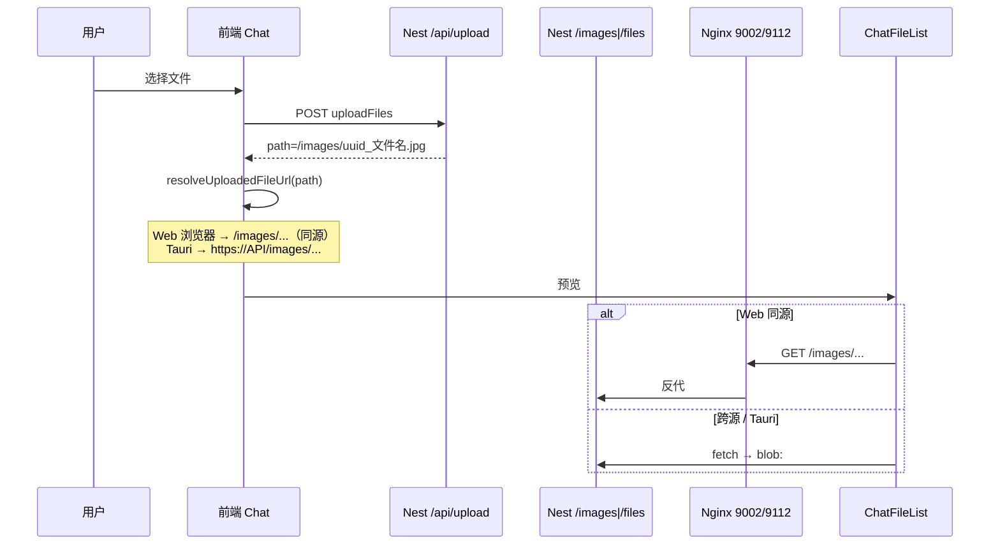

# 对话附件上传与图片预览修复

> **文档角色（开发态主文档）**：Vite 反代、CORP、开发环境 URL 解析。  
> **生产 Web / Nginx 400、SSE 路径、/api/upload/serve**：详见 **[chat-upload-access-prod.md](./chat-upload-access-prod.md)**（主文档）。  
> **延伸阅读**：[chatbot.md](./chatbot.md) §3.3 附件与 OCR；[../ops/upload-storage-paths.md](../ops/upload-storage-paths.md)；[../ops/nginx.md](../ops/nginx.md)；[../cos/cos-dev-http-proxy.md](../cos/cos-dev-http-proxy.md)（COS 展示，与 uploads 无关）。

---

## 1. 背景与目标

**用户可见问题**：对话页上传图片/附件后，输入区或历史消息中点击预览无法显示；浏览器控制台可能出现：

- `500`（Vite 代理连错端口）
- `net::ERR_BLOCKED_BY_RESPONSE.NotSameOrigin 200 (OK)`（跨端口嵌入被 CORP 拦截）
- 含中文文件名的 URL 在组件内加载失败

**目标**：

1. 统一 uploads 相对路径（`/images`、`/files`）到可访问 URL 的解析规则，不再依赖重复或错误的 `VITE_DEV_DOMAIN`。
2. Web 生产走**当前站点同源**相对路径，由 Nginx 反代到 Nest 静态目录。
3. Tauri / 跨源场景优先 blob 拉取，避免把跨源绝对 URL 直接塞进 ``。
4. 后端 `helmet` 允许静态资源跨源嵌入（兜底）。

---

## 2. 改动范围

| 路径 | 说明 |
|------|------|
| `apps/frontend/src/utils/upload-file-url.ts` | **新增**：URL 解析、中文编码、跨源判断 |
| `apps/frontend/src/utils/index.ts` | 导出工具；强化 `fetchImageAsBlobUrl` |
| `apps/frontend/src/views/chat/index.tsx` | 上传成功后写入解析后的 `path` |
| `apps/frontend/src/components/design/ChatFileList/index.tsx` | 预览/下载 URL 与 blob 策略 |
| `apps/frontend/vite.config.ts` | `/api`、`/images`、`/files` 代理目标与 API 同源 |
| `apps/backend/src/main.ts` | `helmet` 的 `crossOriginResourcePolicy: cross-origin` |
| `apps/backend/src/utils/upload-paths.ts` | uploads 落盘目录（与 dist 同级）；见 [upload-storage-paths.md](../ops/upload-storage-paths.md) |
| `apps/backend/src/services/upload/upload.module.ts` | multer 写入 `uploads/images`、`uploads/files` |

---

## 3. 实现思路

### 3.1 数据流（上传 → 展示）



### 3.2 核心决策

| 决策 | 原因 |
|------|------|
| Web 浏览器统一相对路径 `/images`、`/files` | 页面在 9002、静态在 9112 时，绝对 URL 触发 CORP / CORS；同源反代可避免 |
| 从 `VITE_DEV_API_DOMAIN` 推导 Vite 代理目标 | 本地后端可能在 9226 而非 9112，硬编码 9112 导致 `ECONNREFUSED → 500` |
| 路径分段 `encodeURIComponent` | 中文文件名（如 `数学题图片.jpg`）在 fetch / img 中需编码 |
| 跨源 blob 失败时不回退跨源 URL 到 `` | 避免 `NotSameOrigin 200`（响应 200 但 CORP 禁止嵌入） |
| 后端 `helmet` 设为 `cross-origin` | 兜底：Tauri 或仍使用 9112 绝对地址时允许跨端口嵌入 |

### 3.3 生产 Nginx 要点（运维）

- **9002**（Web 前端）：须配置 `location /images/`、`/files/` 反代到与 `/api/` 相同的后端 upstream。
- **9112**（API + 可选前端）：若页面或 Tauri 仍直接请求 `https://域名:9112/images/...`，须在该 server 块增加 `/images/`、`/files/` 反代；**勿**让 `/images/` 落入 `try_files … /index.html`（会返回 HTML 200，预览失败）。
- 可选响应头：`Cross-Origin-Resource-Policy: cross-origin`（与后端 helmet 双保险）。

---

## 4. 关键代码与注释

### 4.1 URL 解析工具

**来源**：`apps/frontend/src/utils/upload-file-url.ts`（约 L1–L72）

```typescript
import { BASE_URL } from '@/constant';
import { isTauriRuntime } from './runtime';

/** 从 API 根地址去掉 /api，得到静态资源源站（与 Nest useStaticAssets 同端口） */
function getUploadStaticOrigin(): string {
	return BASE_URL.replace(/\/api\/?$/, '');
}

/** 历史消息里存的 https://host:9112/images/... → 剥成 /images/... */
function stripUploadOriginToRelative(path: string): string | null {
	const matched = path.match(/^https?:\/\/[^/]+(\/(?:images|files)\/.+)$/i);
	return matched ? matched[1] : null;
}

/** 判断相对当前页面是否跨源（9002 页加载 9112 图即跨源） */
export function isCrossOriginUploadUrl(url: string, baseHref = window.location.href): boolean {
	if (!url || url.startsWith('blob:')) return false;
	try {
		return new URL(url, baseHref).origin !== new URL(baseHref).origin;
	} catch {
		return /^https?:\/\//i.test(url);
	}
}

/** 路径各段 encodeURIComponent，避免中文文件名失败 */
export function encodeUploadFileUrl(url: string): string {
	// ... 对 /images/uuid_数学题.jpg 各段编码 ...
}

/**
 * Web 浏览器：返回同源相对路径（走 Vite / Nginx 反代）
 * Tauri 桌面：返回 API 同源绝对 URL
 */
export function resolveUploadedFileUrl(path: string): string {
	if (!path) return path;

	if (!isTauriRuntime()) {
		const relative = stripUploadOriginToRelative(path);
		if (relative) return encodeUploadFileUrl(relative);
		if (/^https?:\/\//i.test(path)) return path;
		return encodeUploadFileUrl(path.startsWith('/') ? path : `/${path}`);
	}

	// Tauri：拼 BASE_URL 去掉 /api 后的源站
	const normalizedPath = path.startsWith('/') ? path : `/${path}`;
	return encodeUploadFileUrl(
		/^https?:\/\//i.test(path) ? path : `${getUploadStaticOrigin()}${normalizedPath}`,
	);
}
```

### 4.2 上传入口

**来源**：`apps/frontend/src/views/chat/index.tsx`（约 L82–L94）

```typescript
// 上传成功后：不再使用 VITE_DEV_DOMAIN 拼接，统一走 resolveUploadedFileUrl
...res.data.map((item: UploadedFile) => {
	const fileUuid = uuidv4();
	return {
		...item,
		path: resolveUploadedFileUrl(item.path), // 后端返回 /images/xxx
		uuid: fileUuid,
		id: item.id || fileUuid,
	};
}),
```

### 4.3 预览组件 ChatFileList

**来源**：`apps/frontend/src/components/design/ChatFileList/index.tsx`（约 L44–L70）

```typescript
const getUrl = async () => {
	const fileUrl = resolveUploadedFileUrl(data.path);

	if (!CHAT_IMAGE_VALIDTYPES.includes(data.mimetype)) {
		setBase64Url(fileUrl);
		return;
	}

	const crossOrigin =
		typeof window !== 'undefined' && isCrossOriginUploadUrl(fileUrl);

	// 跨源或 Tauri：先 fetch 成 blob:，避免 CORP 拦截 
	if (crossOrigin || isTauriRuntime()) {
		const blobUrl = await fetchImageAsBlobUrl(fileUrl);
		if (blobUrl.startsWith('blob:')) {
			setBase64Url(blobUrl);
			return;
		}
		// blob 失败且仍跨源：不把 9112 URL 塞进 ImagePreview（会 NotSameOrigin）
		if (!crossOrigin) {
			setBase64Url(fileUrl);
		}
		return;
	}

	// Web 同源相对路径：直接用于 ImagePreview
	setBase64Url(fileUrl);
};
```

### 4.4 fetchImageAsBlobUrl 加固

**来源**：`apps/frontend/src/utils/index.ts`（约 L395–L416）

```typescript
export const fetchImageAsBlobUrl = async (url: string): Promise<string> => {
	try {
		const platformFetch = await getPlatformFetch(); // Tauri 用 HTTP 插件，浏览器用 fetch
		const response = await platformFetch(url, { method: 'GET' });
		if (!response.ok) return '';
		const arrayBuffer = await response.arrayBuffer();
		const contentType = response.headers.get('content-type') || '';
		// 代理误返回 index.html 时丢弃，避免 blob 里是 HTML
		if (contentType.includes('text/html')) return '';
		const blob = new Blob([arrayBuffer], {
			type: contentType || 'application/octet-stream',
		});
		return URL.createObjectURL(blob);
	} catch {
		return ''; // 失败不再回退原始 URL，由调用方决定是否展示
	}
};
```

### 4.5 Vite 开发代理

**来源**：`apps/frontend/vite.config.ts`（约 L15–L66）

```typescript
// 与 VITE_DEV_API_DOMAIN 同源（去掉 /api），避免 API 在 9226 时代理仍指向 9112
const devApiProxyTarget = (
	env.VITE_DEV_API_DOMAIN || 'http://localhost:9112/api'
).replace(/\/api\/?$/, '');

proxy: {
	'/api': { target: devApiProxyTarget, changeOrigin: true },
	'/images': { target: devApiProxyTarget, changeOrigin: true },
	'/files': { target: devApiProxyTarget, changeOrigin: true },
	// ...
},
```

### 4.6 后端 helmet

**来源**：`apps/backend/src/main.ts`（约 L45–L50）

```typescript
app.use(
	helmet({
		// 允许 9002 页面 / Tauri WebView 嵌入 9112 上的 /images、/files
		crossOriginResourcePolicy: { policy: 'cross-origin' },
	}),
);
```

---

## 5. 行为变化与兼容性

| 场景 | 变更前 | 变更后 |
|------|--------|--------|
| Web 上传 | `VITE_DEV_DOMAIN + path`，易指错 host | 同源 `/images/...` |
| 历史消息含 9112 绝对 URL | 跨源预览失败 | Web 自动剥成相对路径 |
| 中文文件名 | 可能未编码 | 分段 URL 编码 |
| blob fetch 失败 | 回退跨源 URL → CORP 报错 | 跨源时不塞 `` |
| 后端静态响应 | `CORP: same-origin` | `cross-origin`（需重启后端） |

**未改动**：后端 `uploadFiles` 仍返回相对 `path`；附件 OCR / 落库逻辑不变。

---

## 6. 测试与回归建议

1. **本地 Web**：`VITE_DEV_API_DOMAIN` 与后端端口一致；上传含中文文件名的图片 → 输入区点击预览正常。
2. **生产 Web（9002）**：Network 中预览请求为 `https://域名:9002/images/...`，非 9112。
3. **生产 Tauri**：预览走 blob 或 helmet 放开后的 9112 直链；重启 pm2 后验证。
4. **直接打开** `https://域名:9112/images/xxx.jpg` 仍应 200 且 `Content-Type: image/*`。
5. **非图片附件**：下载按钮仍可用；不走 ImagePreview。

---

## 7. 相关源码与文档索引

| 说明 | 路径 |
|------|------|
| URL 解析 | `apps/frontend/src/utils/upload-file-url.ts` |
| 预览组件 | `apps/frontend/src/components/design/ChatFileList/index.tsx` |
| 上传入口 | `apps/frontend/src/views/chat/index.tsx` |
| Vite 代理 | `apps/frontend/vite.config.ts` |
| 静态目录 | `apps/backend/src/main.ts`（`useStaticAssets`） |
| 落盘与环境变量 | [ops/upload-storage-paths.md](../ops/upload-storage-paths.md) |
| 对话总览 | `docs/chat/chatbot.md` |

若与仓库最新源码不一致，以源码为准。
