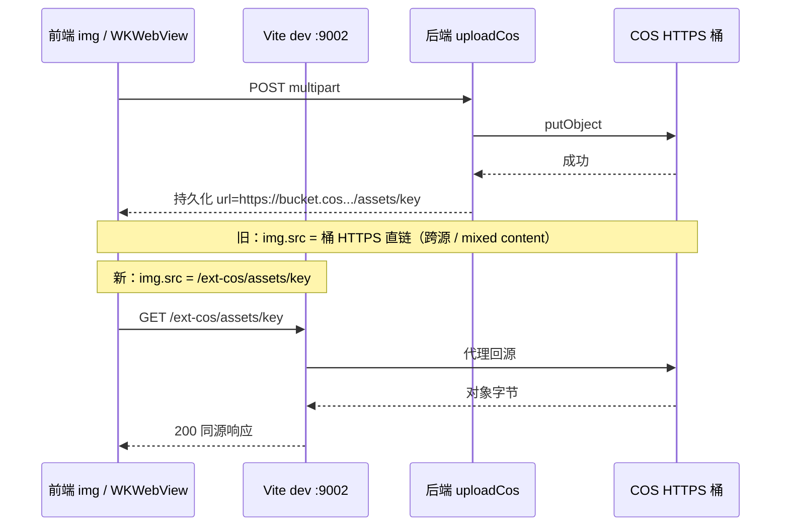

# COS 同源展示代理（开发 / Web 生产 / Tauri）

> **文档角色（主文档）**：腾讯云 COS 对象在浏览器/Tauri 中的**展示 URL** 改写与开发态 Vite 代理；上传走服务端 `uploadCos` / `uploadCosChatFiles`，见 [../cos/cos-object-storage.md](../cos/cos-object-storage.md)。  
> **机制**：持久化存完整 COS HTTPS URL；DEV / Web 生产展示为 `/ext-cos/{key}`；**仅** `/ext-cos/`，不兼容 `/ext-img/`。  
> **延伸阅读**  
> - COS 上传、ACL、聊天附件：[../cos/cos-object-storage.md](../cos/cos-object-storage.md)  
> - macOS ATS 概念：[tauri-macos-ats-http.md](./tauri-macos-ats-http.md)  
> - 路由鉴权 mixed content 摘要：[route-auth.md](./route-auth.md) §12  
> - 生产 Nginx：`location /ext-cos/` → [../ops/nginx.md](../ops/nginx.md)  
> - 文档总索引：[../README.md](../README.md)

若与仓库最新源码不一致，**以源码为准**。

---

## 1. 背景与目标

### 1.1 典型现象

| 阶段 | 表现 |
|------|------|
| 上传 | 经后端 `uploadCos` 成功，库内存完整 `https://*.cos.*.myqcloud.com/...` |
| 开发态展示 | 若 `` 直连桶域名，可能 mixed content（HTTPS 页面 + 跨域）或 Tauri WKWebView 策略问题 |
| 目标 | 开发/Tauri dev 与 Web 生产 HTTPS 均通过**同源** `/ext-cos/` 加载对象 |

### 1.2 目标

- **开发态**（`pnpm dev`、Tauri dev）：展示走 `/ext-cos/`，由 Vite 回源 `VITE_COS_PUBLIC_DOMAIN`。
- **持久化**：数据库 / 用户信息 / 消息附件存**完整 COS HTTPS URL**，不落库 `/ext-cos/`。
- **Tauri 生产包**：无 Vite 代理时使用**原始 COS HTTPS**（桶域名须在 Info.plist / `http.allowlist` 放行）。
- **Web 生产 HTTPS**：`/ext-cos/` + Nginx 回源 COS（与开发模型一致）。

---

## 2. 改动范围

| 路径 | 说明 |
|------|------|
| `apps/frontend/src/utils/index.ts` | `getCosPublicDomainPrefix`、`rewriteCosUrlToSameOriginProxy`、`resolveCosUrlForWebDisplay`、`resolveAttachmentDisplayUrl` |
| `apps/frontend/vite.config.ts` | `server.proxy[cosProxyPathname]` → `VITE_COS_PUBLIC_DOMAIN` |
| `apps/frontend/src/views/account/index.tsx`、`download/index.tsx` 等 | 预览 `` 走 `resolveCosUrlForWebDisplay` |
| `apps/frontend/src/components/design/ChatFileList/index.tsx` | COS 附件走 `resolveAttachmentDisplayUrl` |
| `apps/frontend/src-tauri/Info.plist`、`capabilities/default.json` | COS HTTPS 域 allowlist |

**兼容**：`resolveQiniuUrlForWebDisplay` 为 `resolveCosUrlForWebDisplay` 的 deprecated 别名；`VITE_QINIU_DOMAIN` 仍可作为回源域名回退（迁移期）。

---

## 3. 根因与数据流

### 3.1 为何「能上传、展示要代理」



- **上传**与**读对象**职责分离：上传经后端；读对象在 Web 开发/生产常走同源代理。
- **Tauri dev** 加载 `127.0.0.1:9002` 时，同源 `/ext-cos/` 可避免部分跨源/CORP 问题。

### 3.2 方案对比

| 方案 | 结论 |
|------|------|
| 页面全部直链 COS 域名 | Web HTTPS 易 mixed content；开发跨端口需额外 CORS |
| 桶改自定义 CDN 且全站 HTTPS | 可行，仍建议生产 Web 保留 `/ext-cos/` 统一入口 |
| **Vite + Nginx `/ext-cos/`（采用）** | 开发生产模型一致；键名含 `assets/`、`chat/` 等 |

---

## 4. 实现思路

### 4.1 展示 URL 三分支

| 环境 | `resolveCosUrlForWebDisplay` 行为 |
|------|-----------------------------------|
| `import.meta.env.DEV` | 改写为 `/ext-cos/{key}`（**含 Tauri dev**） |
| Tauri **生产**包 | 返回原始 COS HTTPS URL（allowlist / ATS） |
| Web **生产**（HTTPS） | 改写为 `/ext-cos/{key}`（Nginx 回源） |

### 4.2 Vite 代理与生产 Nginx 对齐

开发态：`/ext-cos/assets/xxx.png` → `https://{bucket}.cos.{region}.myqcloud.com/assets/xxx.png`（路径由 `VITE_COS_PROXY_PREFIX` 与 rewrite 决定）。

### 4.3 Tauri 侧配套

- **Info.plist**：`NSAllowsLocalNetworking` 用于开发态 `http://localhost` API。
- **capabilities**：`http.allowlist` 包含 COS 桶 HTTPS 域（换桶时与 `VITE_COS_PUBLIC_DOMAIN` 同步）。

---

## 5. 关键代码与注释

### 5.1 展示 URL 改写

**来源**：`apps/frontend/src/utils/index.ts`（约 L35–L90）

```typescript
/** COS 对外域名；迁移期可读 VITE_QINIU_DOMAIN */
export function getCosPublicDomainPrefix(): string {
  const raw =
    import.meta.env.VITE_COS_PUBLIC_DOMAIN ||
    import.meta.env.VITE_QINIU_DOMAIN ||
    '';
  return raw.endsWith('/') ? raw : `${raw}/`;
}

function rewriteCosUrlToSameOriginProxy(url: string): string {
  const cosDomainRaw = getCosPublicDomainPrefix();
  const proxyPrefix = getCosProxyPrefix(); // 默认 /ext-cos/
  if (!cosDomainRaw || !url.startsWith(cosDomainRaw)) return url;
  return `${proxyPrefix}${url.slice(cosDomainRaw.length)}`;
}

export const resolveCosUrlForWebDisplay = (url?: string): string => {
  if (!url) return '';
  if (import.meta.env.DEV) return rewriteCosUrlToSameOriginProxy(url);
  if (isTauriRuntime()) return url;
  if (!import.meta.env.PROD) return url;
  return rewriteCosUrlToSameOriginProxy(url);
};
```

**示例**（`VITE_COS_PUBLIC_DOMAIN=https://bucket.cos.ap-shanghai.myqcloud.com/`）：

| 持久化 URL | 开发态 `` |
|------------|-------------------|
| `https://bucket.cos.../assets/avatar.png` | `/ext-cos/assets/avatar.png` |

### 5.2 Vite 开发代理

**来源**：`apps/frontend/vite.config.ts`（约 L11–L27、L79–L85）

```typescript
const cosProxyTarget = (
  env.VITE_COS_PUBLIC_DOMAIN ||
  env.VITE_QINIU_DOMAIN ||
  'https://example.cos.ap-guangzhou.myqcloud.com'
).replace(/\/$/, '');

const cosProxyPathname = /* 来自 VITE_COS_PROXY_PREFIX，默认 /ext-cos */;

server: {
  proxy: {
    [cosProxyPathname]: {
      target: cosProxyTarget,
      changeOrigin: true,
      rewrite: (path) =>
        path.replace(new RegExp(`^${cosProxyPathname}`), '') || '/',
    },
  },
},
```

修改 `vite.config.ts` 后须 **重启** `pnpm dev` / `tauri dev`。

### 5.3 下载页 / 头像预览

**来源**：`apps/frontend/src/views/download/index.tsx`、`account/index.tsx` 等

```tsx

```

上传接口返回的 `url` 为完整 COS HTTPS；仅渲染时改写。

### 5.4 聊天附件展示

**来源**：`apps/frontend/src/utils/index.ts`（`resolveAttachmentDisplayUrl`）

COS 路径用 `resolveCosUrlForWebDisplay`；历史本地上传 `/images`、`/files` 仍走 `resolveUploadedFileUrl`（见 [../cos/cos-object-storage.md](../cos/cos-object-storage.md) §3.8）。

---

## 6. 环境变量

| 变量 | 示例 | 作用 |
|------|------|------|
| `VITE_COS_PUBLIC_DOMAIN` | `https://bucket-APPID.cos.ap-shanghai.myqcloud.com/` | 持久化 URL 域名；Vite/Nginx 回源目标 |
| `VITE_COS_PROXY_PREFIX` | `/ext-cos/` | 展示改写前缀（与代理 location 一致） |
| `VITE_QINIU_DOMAIN` | （可选，弃用） | 迁移期回源回退，勿与新 COS 域混用 |

---

## 7. 兼容性与影响

| 场景 | 影响 |
|------|------|
| 浏览器 `pnpm dev` | COS 图走 `/ext-cos/` |
| Tauri dev | 同上 |
| Tauri 生产包 | COS HTTPS 直链 + allowlist |
| Web 生产 HTTPS | `/ext-cos/` + Nginx |
| 提交后端 avatar / 附件 path | **不变**，仍为完整 COS HTTPS URL |

**破坏性**：无 API 变更。未调用 `resolveCosUrlForWebDisplay` / `resolveAttachmentDisplayUrl` 的 `` 仍可能跨源失败。

---

## 8. 回归测试建议

1. **Tauri dev**：上传头像 → 侧栏显示；Network 为 `.../ext-cos/assets/...`。
2. **浏览器 dev**：同上。
3. **换桶**：同步 `VITE_COS_PUBLIC_DOMAIN`、后端 `COS_PUBLIC_DOMAIN`、Nginx `proxy_pass`、Tauri allowlist。
4. **Web 生产**：头像/附件为 `/ext-cos/...`，无 mixed content。
5. **持久化**：DB / 接口中仍为 `https://...cos.../`，非 `/ext-cos/`。

---

## 9. 相关源码路径

| 说明 | 路径 |
|------|------|
| 展示 URL 工具 | `apps/frontend/src/utils/index.ts` |
| 开发代理 | `apps/frontend/vite.config.ts` |
| COS 上传主文档 | `docs/cos/cos-object-storage.md` |
| 账户 / 下载页 | `apps/frontend/src/views/account/index.tsx`、`download/index.tsx` |
| 聊天附件 UI | `apps/frontend/src/components/design/ChatFileList/index.tsx` |
| Tauri ATS / allowlist | `apps/frontend/src-tauri/Info.plist`、`capabilities/default.json` |

---

## 10. 后续可做

- 换桶 checklist：`.env`（前后端）、Vite、Nginx、Tauri 四处一次改齐。
- 私有桶：评估签名 URL 或后端读代理（当前默认 `public-read`）。
