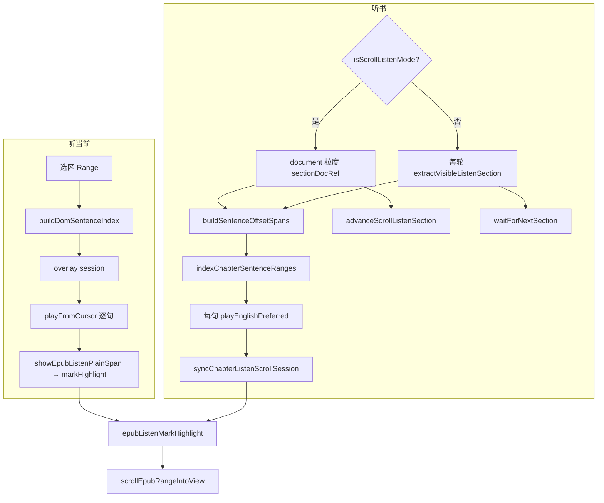

# EPUB 边听边读（听当前 + 听书）— 开发者实现手册

> **手册版本**：2026-06-27 — 同步 **连续滚动多 iframe 听书续播**（`runScrollSectionLoop` / `epubScrollListenAdvance`）；utils 已合并为 3 文件（见 [Influence-point/epub-listen-utils-consolidation.md](../Influence-point/epub-listen-utils-consolidation.md)）。

## 文档角色

**本文档**：EPUB **听当前**（选区/引用/想法朗读）与 **听书**（顶栏全书连续听）的 **唯一完整开发者手册**。目标读者是需要维护、扩展或从零复刻该能力的工程师。

**与产品/增量专题的关系**：

| 类型 | 路径 | 用途 |
|------|------|------|
| 本手册 | `docs/ebook/developer/epub-listen-dev.md` | 原理、模块边界、调用链、可照抄源码 |
| 听当前增量 | `docs/ebook/epub-quote-listen.md` | 三入口、历史 diff |
| 听书增量 | `docs/ebook/epub-chapter-listen.md` | 听书定稿架构、废弃方案 |
| 连续滚动听书 | `docs/ebook/epub-scroll-listen-section-advance.md` | 改动前后代码对比 |
| 多 iframe 解题套路 | `docs/ideas/epub-scroll-multi-iframe-listen.md` | 规划态：根因、逐点清单、复现步骤 |
| 播放背景 | `docs/ebook/epub-listen-sentence-bg.md` | plain 偏移（听当前历史 cadence 专题） |
| 自动跟随 FAB | `docs/ebook/epub-listen-auto-follow-fab.md` | scroll guard 细节 |
| 与用户划线 | `docs/ebook/epub-listen-user-highlight-reconcile.md` | 播放层 DOM 隔离 |

**推荐阅读顺序**：

| 顺序 | 章节 | 内容 |
|------|------|------|
| 1 | **§0** | 维护定位表、M1–M5 从零阶段 |
| 2 | **§1–§2** | 能力边界、架构总览、数据流 |
| 3 | **§3** | **听当前**完整链路 |
| 4 | **§4** | **听书**完整链路（含连续滚动 / 分页分叉） |
| 5 | **§5** | 共享层：TTS、高亮、滚动、互斥 |
| 6 | **§6–§7** | 阅读页接线、验收清单 |
| 7 | **§8** | 带逐行注释的关键源码 |

---

## 0. 开发者从何下手（必读）

### 0.1 先判断：你要哪种工作？

| 你的目标 | 走哪条路 |
|----------|----------|
| 改 bug / 小需求 | [§0.2 维护路径](#02-维护现有功能按现象定位) |
| 理解听当前 vs 听书差异 | [§1.2](#12-听当前与听书对比) |
| 从零做一版 EPUB 听读 | [§0.3 M1–M5](#03-从零实现严格按阶段) |
| 跟一遍运行时 | [§0.4 调用链](#04-运行时调用链) |

### 0.2 维护现有功能：按现象定位

| 现象 | 先打开 | 关键符号 | 怎么验 |
|------|--------|----------|--------|
| 点「听当前」无声 | `useEbookQuoteListen.ts` | `playFromCursor` → `playEnglishPreferred` | 控制台 TTS 报错 |
| 听当前有句背景、听书没有 | `epubListenChapter.ts` | `indexChapterSentenceRanges` 是否全 null | 断点 `sentenceRanges[i]` |
| 听书误报「本章暂无文字」 | `epubListenChapter.ts` | `listIframeDocuments`、`pickDocumentForListen` | `views()` 不可 `for…of` |
| 换句背景残留/叠层 | `epubListenMarkHighlight.ts` | 换句前 `clearListenMarkHighlight` | marks-pane SVG |
| 播放句不在视口、不自动滚 | `epubListenSegmentOverlay.ts` | `activeDomRange`、`requestListenAutoFollowScroll` | session 是否有 Range |
| 手动滚后无 FAB | `EpubListenFollowFab.tsx` | `subscribeEpubListenAutoFollow` | `active && !autoFollow` |
| 听书与听当前同时响 | `epubListenSegmentOverlay.ts` | `invokeStop*` / `register*ListenStop` | 互斥注册 |
| **连续滚动**节末不续播 / 误报读完 | `epubScrollListenAdvance.ts` | `advanceScrollListenSection`、`listEpubViewSlots` | 播完 7/7 后 DOM 下一 `.epub-view` |
| **分页**节末不翻章 | `epubListenChapter.ts` | `waitForNextSection` | `rend.next()` + `relocated` |
| 切句后播放条消失 | `useEpubChapterListen.ts` | `goToSentence` → `runListenLoop`；`!finished` 时 `!isGenActive` | 连点「下一句」不应 `stopInternal` |
| 听书卡在 loading | `useEpubChapterListen.ts` | `applySection` 是否 return null | 勿在 apply 层做 gen 门禁 |
| 目录跳转后听书错位 | `useEpubChapterListen.ts` | `syncToCurrentView`、`sectionDocRef` | TOC `onSelect` 回调 |
| 背景与用户划线互删 | `epubListenMarkHighlight.ts` | class `moke-epub-listen-bg` | 与用户 `moke-epub-user-hl` 分离 |

### 0.3 从零实现：严格按阶段

#### M1：TTS 能播一句

| 步 | 做什么 | 文件 |
|----|--------|------|
| 1 | `playEnglishPreferred(text)` | `apps/frontend/src/utils/englishTts.ts` |
| 2 | `buildSentenceOffsetSpans(plain)` 句界 | 同上 |
| 3 | `isEnglishPlaybackAvailable` + Toast | hook 内 |

**验收**：控制台调用 `playEnglishPreferred('Hello world.')` 能出声。

**不要做**：EPUB DOM、高亮、滚动。

#### M2：听当前（无背景）

| 步 | 做什么 |
|----|--------|
| 1 | `useEbookQuoteListen` + PopBar `onListen` |
| 2 | `resolveEpubListenPlain` 取选区文本 |
| 3 | `playEnglishPreferred(plain)` 一次播完 |

**验收**：拖选 → 听当前 → 能朗读 → 停止。

#### M3：听当前句级背景 + 自动跟随 + 播放条

| 步 | 做什么 |
|----|--------|
| 1 | `beginEpubListenOverlaySession` + `buildDomSentenceIndex` |
| 2 | `playFromCursor` 逐句 `playEnglishPreferred` + `showEpubListenPlainSpan` |
| 3 | `epubListenMarkHighlight.showListenMarkHighlight` |
| 4 | `attachListenScrollGuard` + `EpubListenFollowFab` + `EpubListenPlayerBar` |

**验收**：长选区逐句淡黄底；手动滚动出 FAB；底部播放条可切句/暂停。

#### M4：听书连续播放（分页模式）

| 步 | 做什么 |
|----|--------|
| 1 | `extractVisibleListenSection`（innerText，在 `epubListenChapter.ts`） |
| 2 | `useEpubChapterListen` + `runPaginatedListenLoop` + `waitForNextSection` |
| 3 | `indexChapterSentenceRanges` 节级句 Range |
| 4 | `EpubListenPlayerBar` + 顶栏耳机 |

**验收**：**分页翻页** EPUB 听书节末 `rend.next()` 衔接；播放条正常。

#### M4b：听书连续滚动（多 iframe）

| 步 | 做什么 |
|----|--------|
| 1 | `isScrollListenMode` + `sectionDocRef` |
| 2 | `runScrollSectionLoop`：首节 `prepareSection`，后续 `extractListenSectionForDocument` |
| 3 | `epubScrollListenAdvance.ts`：`advanceScrollListenSection` |
| 4 | `goToSentence` → `runListenLoop(gen)`；`!finished` 先判 `!isGenActive` |

**验收**：连续滚动下播完当前 iframe 自动下一 iframe；切句不退出。

#### M5：互斥与边界

| 步 | 做什么 |
|----|--------|
| 1 | `epubListenSegmentOverlay` 内 `register*ListenStop` / `invokeStop*` |
| 2 | `syncToCurrentView`（目录跳转 + `sectionDocRef`） |
| 3 | `……` / `——` / 省略号句界（`buildSentenceOffsetSpans`） |

### 0.4 运行时调用链

**听当前（选区 PopBar）**：

```text
1. 用户拖选 → EpubSelectionPopBar → onListen
2. read.tsx → toggleListen(text, key, cfiRange, frozenRange)
3. invokeStopChapterListen()  // 互斥
4. resolveEpubListenPlain → plain + selectionRange
5. beginEpubListenOverlaySession(rend, plain, { cfi, selectionRange })
   └─ buildDomSentenceIndex(outerRange) → sentences + plain
   └─ attachListenScrollGuard
6. playFromCursor(gen): 逐句循环
   └─ showEpubListenPlainSpan(i) → showListenMarkHighlight + autoFollow
   └─ playEnglishPreferred(单句, { prefetchedCloud })
   └─ clearActiveListenHighlight
7. stopInternal → clearEpubListenSegmentOverlay
```

**听书（顶栏耳机）**：

```text
1. toggleChapterListen → startFromCurrentPosition
2. invokeStopQuoteListen(); clearEpubListenSegmentOverlay(); beginChapterListenAutoFollow
3. extractVisibleListenSection → preview；sectionDocRef = preview.document
4. runListenLoop(gen):
   ├─ isScrollListenMode?
   │    是 → runScrollSectionLoop:
   │      a. 首节 prepareSection（视口 + CFI）/ 后续 extractListenSectionForDocument(doc)
   │      b. applySection → sectionRef + sectionDocRef + 播放条
   │      c. playSentencesFromCursor（逐句 TTS + 高亮 + 预取）
   │      d. advanceScrollListenSection(rend, sectionDoc)  // 槽位 scroll + manager.check
   │    否 → runPaginatedListenLoop:
   │      a–c 同上（每轮 prepareSection 视口）
   │      d. waitForNextSection → rend.next()
5. goToSentence / pause: ++loopGenRef；旧环 !isGenActive → 静默 return（不 stopInternal）
6. stopInternal → teardownChapterListenHighlight + clearEpubListenSegmentOverlay
```

---

## 1. 背景与能力边界

### 1.1 产品能力（EPUB only）

| 能力 | 入口 | 播放范围 | UI |
|------|------|----------|-----|
| **听当前** | 选区 PopBar、想法卡片、上下文菜单 | 用户选中的一段 | 无独立播放条；工具条可保持 |
| **听书** | 顶栏耳机图标 | 当前 iframe / 可见节起，逐句至全书末 | 底部 `EpubListenPlayerBar` |

二者 **互斥**：启动一方会 `invokeStop*` 停止另一方。

**PDF**：暂无听当前/听书入口。

### 1.2 听当前与听书对比

| 维度 | 听当前 | 听书 |
|------|--------|------|
| Hook | `useEbookQuoteListen` | `useEpubChapterListen` |
| 正文来源 | 选区 DOM → `buildDomSentenceIndex` | `body.innerText` + `stripMarkdownForTts` |
| 句界 | 与 TTS 共用 `buildSentenceOffsetSpans` | 同上 |
| 句 → DOM | `DomListenSentence.anchor`（字符流锚点） | `indexChapterSentenceRanges`（TreeWalker + indexOf） |
| TTS 调用 | **每句** `playEnglishPreferred`（`playFromCursor`） | **每句** `playEnglishPreferred` + 句间预取 |
| 句背景触发 | 每句播放前 `showEpubListenPlainSpan` | 每句播放前 `showChapterListenSentenceHighlight` |
| 滚动 session | `beginEpubListenOverlaySession`（含 plain 句表） | `beginChapterListenAutoFollow` + `showEpubListenDomRange`（`activeDomRange`） |
| 节/章衔接 | 无 | **分页**：`waitForNextSection` → `rend.next()`<br>**连续滚动**：`advanceScrollListenSection`（按 `.epub-view` 槽位，不用 `rend.next`） |
| 节的单位 | 选区一段 plain | **一个 iframe `document`**（滚动）或 **视口节**（分页每轮 prepare） |

**设计原则**：播放文本与句界算法 **必须与 TTS 同源**（`stripMarkdownForTts` + `buildSentenceOffsetSpans`），否则背景句与朗读句错位。

### 1.3 刻意不做（当前版本）

- 词级卡拉 OK、唇形同步
- Whispersync 级精确进度持久化
- 听书预扫描全书 DOM 句表（易卡死）
- 听书走 **`onCadenceChunk`** 驱动背景（听当前已改为逐句 `playFromCursor`，与听书对齐）
- 连续滚动听书用 **`rend.next()` / 合并多 iframe 句流** / 播放中 **`rend.display`** 预加载（历史回归，见 ideas 文档）
- 每句 `window.find` 搜索 DOM（O(n²) 卡死）

---

## 2. 架构总览

### 2.1 模块分层

```text
┌─────────────────────────────────────────────────────────────┐
│ read.tsx — 入口接线、互斥、TOC syncToCurrentView            │
├─────────────────────────────────────────────────────────────┤
│ Hooks                                                       │
│  useEbookQuoteListen    useEpubChapterListen                │
├─────────────────────────────────────────────────────────────┤
│ 播放编排                                                    │
│  epubListenSegmentOverlay（session、autoFollow、互斥 stop）  │
│  epubListenChapter（听书：innerText、句 Range、waitForNext）│
│  epubScrollListenAdvance 🆕（连续滚动：槽位 advance）       │
├─────────────────────────────────────────────────────────────┤
│ 句 ↔ DOM（均在 epubListenChapter / overlay 内）             │
│  buildDomSentenceIndex（听当前）                            │
│  indexChapterSentenceRanges（听书 TreeWalker 顺序匹配）     │
├─────────────────────────────────────────────────────────────┤
│ 视觉 + 滚动                                                 │
│  epubListenMarkHighlight（淡黄 SVG/iframe 单层）            │
│  epubScrolledNav.scrollEpubRangeIntoView                    │
├─────────────────────────────────────────────────────────────┤
│ TTS                                                         │
│  englishTts — playEnglishPreferred / buildSentenceOffsetSpans│
└─────────────────────────────────────────────────────────────┘
```

### 2.2 播放背景（共用）

- 颜色：`rgba(251, 231, 128, 0.28)`（`EPUB_LISTEN_SEGMENT_FILL`）
- 实现：`epubListenMarkHighlight.ts` 单例浮层
- **不用** CSS Highlight API、不用 epub annotation 作主路径（`……` 等易残留）
- **与用户划线分离**：class `moke-epub-listen-bg`，清除时不碰 `moke-epub-user-hl`

### 2.3 自动跟随（共用）

- 模块：`epubListenSegmentOverlay.ts`
- Session 字段：`autoFollow`（默认 true）、`activeDomRange`（听书）或 `lastSentenceIndex`（听当前）
- 用户 `scroll` / `wheel` → `pauseListenAutoFollow` → FAB 显示
- `resumeEpubListenAutoFollow` → 滚回当前句 + 恢复跟随
- 程序滚动用 `programmaticScroll` 计数，避免误判为用户打断

### 2.4 数据流（简图）



---

## 3. 听当前 — 实现原理

### 3.1 入口（三处）

| 入口 | read.tsx 调用 |
|------|----------------|
| 选区 PopBar | `toggleListen(quote, listenKey, cfiRange, frozenRange)` |
| 想法卡片 | `toggleListen(thoughtDraft.quote, listenKey, thoughtDraft.cfiRange)` |
| 上下文菜单 | 包装 `onListen` |

Hook 签名：

```typescript
useEbookQuoteListen(t, getRendition, onListenSessionEnd?)
→ { toggleListen, playingKey, listenLabel }
```

### 3.2 文本与 Session 建立

1. **`resolveEpubListenPlain`**：优先级 `frozenRange` > 记忆的 PopBar Range > 当前 Selection > `fallbackText`。
2. **`stripMarkdownForTts`** 得 TTS 用 `plain`。
3. **`beginEpubListenOverlaySession(rend, plain, { cfi, selectionRange })`**：
   - 用选区 `outerRange` 调 **`buildDomSentenceIndex`**：DOM 正向字符流，每个字符对应 `{node, offset}`，再按 `buildSentenceOffsetSpans` 切句并记录 **anchor**。
   - 注册 **`attachListenScrollGuard`**。
   - Session 保存：`plain`、`sentences[]`、`outerRange`、`cfi`、`autoFollow`。

### 3.3 TTS 与句背景同步

- **`playFromCursor(gen)`** 从 `sentenceCursorRef` 逐句循环（与听书 `playSentencesFromCursor` 同构）。
- 每句：`showEpubListenPlainSpan(0, 0, si)` → **`showListenMarkHighlight`**；`autoFollow` 时滚入视口。
- 句末 **`clearActiveListenHighlight`**；整段播完或 stop → **`clearEpubListenSegmentOverlay`**。
- 云端 TTS：**`prefetchCloudEnglishTts`** 句间预取（与听书相同模式）。

### 3.4 停止与清理

- 再次点同一 key / 播放结束 `finally`：`clearEpubListenSegmentOverlay()`（清 session、卸 scroll guard、清高亮）。
- `onListenSessionEnd` 触发 annotation sync（与用户划线 reconcile）。

---

## 4. 听书 — 实现原理

### 4.1 状态机与关键 ref

`ChapterListenStatus`：`idle` | `loading` | `playing` | `paused`

| 字段 / ref | 含义 |
|------------|------|
| `state.spineIndex` | 播放条章号（来自 `applySection`） |
| `sentenceIndex` / `sentenceCount` | 当前 iframe / 节内句进度 |
| `sectionRef` | 当前节 `SectionCtx`（plain、句表、ranges） |
| `sectionDocRef` 🆕 | 当前 iframe **`contentDocument`**（滚动续播身份） |
| `resolveStartCfiRef` | 首节是否解析 CFI 起始句 |
| `scrollSeekRef` 🆕 | 切句后首句 `scrollCenterOnFirst` |
| `loopGenRef` | 代际取消令牌 |

**代际取消**：`loopGenRef` 递增使 `runScrollSectionLoop` / `runPaginatedListenLoop` / `playSentencesFromCursor` 退出。pause、stop、**goToSentence** 均 bump gen；旧环 **`!finished && !isGenActive(gen)` → return**，不得 `stopInternal`。

### 4.2 正文抽取（两路径）

**视口路径 — `extractVisibleListenSection(rend, spineHint?)`**（`epubListenChapter.ts`）：

1. **`listIframeDocuments`**：`getContents` + **`getRenditionViewsList(rend)`** + 滚动容器 iframe。
2. **`pickDocumentForListen`**：优先 `spineHint`；多 iframe 时视口垂直中心选有正文 document。
3. 用于：**开播 preview**、**首节** `prepareSection`、**分页**每轮 `prepareSection`。

**固定 document 路径 — `extractListenSectionForDocument(rend, doc)`** 🆕：

- 对 **已知** iframe `document` 抽 `plain` + `outerRange`（算法与视口路径相同）。
- `spineIndexForDocument`：view.index → canonical href → fallback。
- 用于：**连续滚动** `runScrollSectionLoop` 第二节起（节间 advance 后 `sectionDocRef` 已更新）。

### 4.3 起始句

首次启动 / 目录跳转后 **`resolveStartCfiRef = true`**：

- **`resolveListenStartSentence`**：用当前阅读 CFI 解析 DOM Range，在 `sentenceRanges` 中找 **最后一个 END ≤ CFI 位置** 的句索引。

### 4.4 播放循环（分页 vs 连续滚动）

**入口 `runListenLoop(gen)`**：

```text
if isScrollListenMode(rend)  → runScrollSectionLoop(gen)
else                          → runPaginatedListenLoop(gen, opts)
```

**连续滚动 — `runScrollSectionLoop`**：

```text
sectionDoc = sectionDocRef; usePrepare = resolveStartCfi || !sectionDoc
loop:
  if usePrepare:
    ctx = prepareSection(rend)           // 视口 + CFI
  else:
    visible = extractListenSectionForDocument(rend, sectionDoc)
    ctx = applySection(rend, visible)
  playSentencesFromCursor(ctx, gen, { scrollCenterOnFirst })
  if !finished: gen失效→return; paused→return; else stopInternal
  syncState(loading)
  nextDoc = advanceScrollListenSection(rend, sectionDoc)
  if !nextDoc → Toast finished → stop
  sectionDocRef = nextDoc; cursor = 0
```

**分页 — `runPaginatedListenLoop`**（与改前单环等价）：

```text
loop:
  ctx = prepareSection(rend)             // 每轮视口
  playSentencesFromCursor(ctx, gen)
  waitForNextSection(rend)               // rend.next + relocated
```

**`prepareSection` / `applySection` 拆分**：

- `prepareSection`：视口抽取 → `applySection`。
- `applySection`：写 `sectionRef`、`sectionDocRef`、播放条；可选 CFI 起始句；**始终 return ctx**（不在此层 `isGenActive` 门禁）。

**`playSentencesFromCursor`**（两模式共用）：

- 从 `sentenceCursorRef` 遍历；`prefetchCloudEnglishTts` 预取下一句。
- 每句 `playEnglishPreferred(spokenRaw, { prefetchedCloud, rate })`。
- 有 `sentenceRanges[i]` 则高亮；无 Range 仍播 TTS。

### 4.5 连续滚动节间 advance（`epubScrollListenAdvance.ts`）

**问题**：continuous manager 在 `.epub-container` 内同时挂多个 `.epub-view`（空槽、hidden iframe、当前章）。`rend.next()` 换 spine 不能表示「当前 iframe → 下一 iframe」。

**`advanceScrollListenSection(rend, currentDoc)`**：

1. **`listEpubViewSlots`**：DOM 顺序枚举 `.epub-view` → `{ viewEl, doc }`；空正文 doc 视为未加载。
2. **快路径**：`nextLoadedDoc` — 当前槽之后第一个已有 doc。
3. **慢路径**：对后续空槽 **`ensureSlotDocument`**：`scrollTo(offsetTop)` + 最多 8 次 **`manager.check()`** + 双 rAF。
4. **nudge**：仍失败则 `scrollTop += ~0.9 视口高`，最多 **5 轮**（`ADVANCE_ROUNDS`）。
5. 返回下一 `Document` 或 null。

**刻意不做**：`rend.next()`、`rend.display(spineIndex)`、合并多 iframe plain 为一条句流。

### 4.6 句 DOM 索引（节级一次）

**`indexChapterSentenceRanges(outerRange, plain)`**：

1. TreeWalker 收集 body 下所有文本字符位置。
2. 空白归一化为单空格流 `norm` + `map`（norm 字符 → TextPos）。
3. 对每句 `needle = normForMatch(plain.slice(start,end))`，在 `norm` 上 **顺序 indexOf**（必要时前缀模糊）。
4. 命中则 `rangeFromPosSpan` 建 DOM Range；未命中返回 `null`。

与听当前 **`buildDomSentenceIndex`** 不同：听书 plain 来自 **innerText**，不能直接用选区字符流，故用顺序匹配而非 anchor 流。

### 4.7 高亮与滚动

- **`showChapterListenSentenceHighlight`** → **`syncChapterListenScrollSession`** → **`showEpubListenDomRange`**
- 写入 session **`activeDomRange`**，供 FAB / `scrollActiveListenIntoView` 使用。
- 启动时 **`beginChapterListenAutoFollow(rend)`** 提前挂 scroll guard。

### 4.8 播放条、切句与目录

- **`EpubListenPlayerBar`**：pause/resume、stop、prev/next、分句菜单、倍速（0.75×–3×）。
- **`goToSentence(index)`**：设游标 + `scrollSeekRef` + `++loopGenRef` → **`runListenLoop(gen)`**（勿孤立调用 `playSentencesFromCursor`，否则旧环误 `stopInternal`）。
- TOC **`onSelect`**：`chapterListen.syncToCurrentView()` — 重置 `sectionDocRef`、CFI 起始句，必要时重入 `runListenLoop`。

---

## 5. 共享层详解

### 5.1 TTS（`englishTts.ts`）

| API | 用途 |
|-----|------|
| `buildSentenceOffsetSpans(plain)` | 句界：`.!?。！？；`、`…`/`......`/`...`、段末 tail |
| `stripMarkdownForTts(text)` | 去 Markdown 噪声，朗读与匹配前统一调用 |
| `playEnglishPreferred(text, opts?)` | 本机 Web Speech / 云端偏好；可选 `onCadenceChunk`、`speak.rate` |
| `stopAllEnglishPlayback()` | 停止全部实例 |
| `primeEnglishPlaybackForUserGesture()` | 听书启动前解锁浏览器音频策略 |

**句界必须与 DOM 匹配逻辑一致**：听书 `normForMatch` 内部也调 `stripMarkdownForTts` + 空白折叠。

### 5.2 播放背景（`epubListenMarkHighlight.ts`）

| 函数 | 行为 |
|------|------|
| `showListenMarkHighlight(rend, range)` | 优先 marks-pane SVG rect；无 SVG 则 iframe 绝对定位层 |
| `clearListenMarkHighlight(rend?)` |  purge 所有 listen annotation + SVG g + iframe layer |
| `listenLineRects` | 修正段首 `……` 误检行（背景垂直偏移） |

单例 `active`：换 document / rendition 时全量清除，避免跨节残留。

### 5.3 滚动（`epubScrolledNav.ts`）

**`scrollEpubRangeIntoView(rend, range, fallbackCfi?)`**：

- 已在视口（带 margin）→ 直接返回。
- 连续滚动模式 → 调容器 `scrollTop`。
- 分页模式 → `cfiFromDomRange` / `fallbackCfi` → `rend.display(cfi)`。

### 5.4 互斥（`epubListenSegmentOverlay.ts`）

模块级 `stopQuoteListen` / `stopChapterListen` 回调（原 `epubListenController` 已合并入 overlay）：

- `useEbookQuoteListen` 注册 quote stop；听当前前 `invokeStopChapterListen()`。
- `useEpubChapterListen` 注册 chapter stop；听书前 `invokeStopQuoteListen()`。

### 5.5 FAB（`EpubListenFollowFab.tsx`）

- 订阅 `subscribeEpubListenAutoFollow`
- `visible = session.active && !session.autoFollow`
- 挂载在 **EPUB 阅读区** `relative` 容器内（`bottom-4 right-4`），避免与底部播放条重叠

---

## 6. 阅读页接线（`read.tsx`）

```typescript
// 听当前
const { toggleListen, listenLabel } = useEbookQuoteListen(
  t,
  () => epubNavRef.current?.getRendition() ?? null,
  () => epubNavRef.current?.syncReadingAnnotations(),
);

// 听书
const chapterListen = useEpubChapterListen(
  t,
  () => epubNavRef.current?.getRendition() ?? null,
  () => currentEpubCfiRef.current || prog?.epubCfi,
  () => epubNavRef.current?.syncReadingAnnotations(),
  () => epubSpineIndexRef.current ?? epubSpineIndex,
);
```

布局（EPUB 列）：

```text
<div relative flex-col>
  <div relative flex-1>   <!-- 阅读区 -->
    <EpubPane />
    <EpubListenFollowFab />
  </div>
  <EpubListenPlayerBar ... />
</div>
```

顶栏：`chapterListen.toggleChapterListen` + `aria-pressed={chapterListen.isActive}`。

---

## 7. 验收清单

### 听当前

- [ ] 拖选英文段 → PopBar 听当前 → 逐句淡黄底
- [ ] 句末清除；停止后全无背景
- [ ] 长选区播放时当前句滚入视口
- [ ] 手动滚动 → FAB 出现 → 点击回位并恢复跟随
- [ ] 与用户粉/紫划线共存，播完不删用户线
- [ ] 播放中点听书 → 听当前停止

### 听书

- [ ] 顶栏耳机 → 底部播放条 → 从当前 CFI 附近句开始播
- [ ] **分页**：节末 `rend.next()`；**连续滚动**：当前 iframe 末句后自动下一 iframe
- [ ] 连续滚动：不应在下方仍有正文时误报「全书读完」
- [ ] 有句 Range 时有背景 + 自动跟随；无 Range 仍出声
- [ ] 暂停/继续、上句/下句、分句菜单、倍速生效；**切句不退出播放条**
- [ ] 目录跳转后续播新位置（`sectionDocRef` 对齐）
- [ ] 播放中点听当前 → 听书停止

---

## 8. 关键源码（逐行注释）

以下摘录与仓库当前实现一致，供对照实现。**每行源码上方一行中文注释**。

### 8.1 `useEbookQuoteListen` — `startPlayback` + `playFromCursor`

**来源**：`apps/frontend/src/views/ebook/hooks/useEbookQuoteListen.ts` · **当前** · 约 L128–L305

```typescript
// 从 sentenceCursorRef 起逐句播放；与听书 playSentencesFromCursor 同构
const playFromCursor = useCallback(async (gen: number): Promise<boolean> => {
	const rend = getRenditionRef.current?.() ?? null;
	const meta = getEpubListenSessionMeta();
	const plain = meta?.plain ?? fallbackPlainRef.current;
	const sentenceCount =
		meta?.sentenceCount ?? buildSentenceOffsetSpans(plain.trim()).length;
	if (!plain.trim() || sentenceCount <= 0) return false;

	for (let si = sentenceCursorRef.current; si < sentenceCount; si += 1) {
		if (!isGenActive(gen) || pausedRef.current) return false;
		const spokenRaw = resolveSpokenAt(si, plain);
		if (!spokenRaw) continue;
		sentenceCursorRef.current = si;
		syncState({ status: 'playing', sentenceIndex: si, sentenceCount });
		if (rend) showEpubListenPlainSpan(0, 0, si);
		await playEnglishPreferred(spokenRaw, {
			speak: { rate: rateRef.current },
			prefetchedCloud: prefetchedByIndex.get(si) ?? null,
		});
		if (!isGenActive(gen) || pausedRef.current) return false;
		if (rend) clearActiveListenHighlight(rend);
	}
	return isGenActive(gen);
}, [syncState]);

// 听当前启动：建 overlay session → syncState → playFromCursor
const startPlayback = useCallback(async (text, key, cfiRange?, frozenRange?) => {
	invokeStopChapterListen();
	// ... resolveEpubListenPlain + beginEpubListenOverlaySession ...
	const gen = ++loopGenRef.current;
	sentenceCursorRef.current = 0;
	syncState({ status: 'loading', sentenceIndex: 0, sentenceCount, ... });
	const finished = await playFromCursor(gen);
	if (finished && isGenActive(gen)) stopInternal();
}, [playFromCursor, stopInternal, syncState]);
```

**读完应掌握**：听当前已 **逐句 await TTS**，句背景由 **`showEpubListenPlainSpan`** 同步驱动，不再依赖 `onCadenceChunk`。

---

### 8.2 `buildSentenceOffsetSpans` — 句界算法

**来源**：`apps/frontend/src/utils/englishTts.ts` · **改动后** · 约 L478–L517

```typescript
// 导出：plain 内每句的 [start,end) 偏移，听当前/听书/TTS 共用
export function buildSentenceOffsetSpans(
	// 原始 plain（可含首尾空白）
	plain: string,
): Array<{ start: number; end: number }> {
	// 句界计算在 trim 后的字符串上进行
	const trimmed = plain.trim();
	// 空串无句
	if (!trimmed) return [];

	// 累积输出的句 span 列表
	const spans: Array<{ start: number; end: number }> = [];
	// 当前句在 trimmed 上的起始下标
	let rawStart = 0;

	// 逐字符扫描边界
	for (let i = 0; i < trimmed.length; i += 1) {
		// 当前位置是否为句末标点/省略号
		const boundary = sentenceBoundaryEnd(trimmed, i);
		// 非边界继续
		if (boundary < 0) continue;

		// rawStart 到 boundary 为候选句切片
		const slice = trimmed.slice(rawStart, boundary);
		// 去掉首尾空白后的有效内容
		const content = slice.trim();
		// 有内容才记一句
		if (content) {
			//  leading 空白长度
			const lead = slice.length - slice.trimStart().length;
			// trailing 空白长度
			const trail = slice.length - slice.trimEnd().length;
			// 记录内容区精确偏移
			spans.push({ start: rawStart + lead, end: boundary - trail });
		}

		// 下一句从 boundary 后开始
		rawStart = boundary;
		// 跳过 boundary 后连续空白
		while (rawStart < trimmed.length && /\s/u.test(trimmed[rawStart]!)) {
			rawStart += 1;
		}
		// for 循环会 i++，这里回退到 boundary-1
		i = boundary - 1;
	}

	// 文件末尾无句号时的尾段
	if (rawStart < trimmed.length) {
		const tail = trimmed.slice(rawStart).trim();
		if (tail) {
			const lead =
				trimmed.slice(rawStart).length -
				trimmed.slice(rawStart).trimStart().length;
			spans.push({ start: rawStart + lead, end: trimmed.length });
		}
	}

	// 至少返回整段一句，避免空 spans
	return spans.length > 0 ? spans : [{ start: 0, end: trimmed.length }];
}
```

---

### 8.3 `paintSentence` — 听当前句背景 + 自动滚

**来源**：`apps/frontend/src/views/ebook/utils/epubListenSegmentOverlay.ts` · **改动后** · 约 L314–L326

```typescript
// 听当前：按句索引绘制背景并可选滚入视口
function paintSentence(sentenceIndex: number): void {
	// 无 session 或非法索引则跳过
	if (!session || sentenceIndex < 0) return;

	// 由 DOM 锚点还原该句 Range
	const range = resolveSentenceRange(session, sentenceIndex);
	// 无法还原（锚点失效）则不画
	if (!range) return;

	// 是否换句（与上一句 index 不同）
	const isNew = session.lastSentenceIndex !== sentenceIndex;
	// 更新 session 当前句索引
	session.lastSentenceIndex = sentenceIndex;
	// 换句先清再画，避免 …… 句与中间句叠层
	if (isNew) clearListenMarkHighlight(session.rend);
	// 在 marks-pane/iframe 画淡黄底
	showListenMarkHighlight(session.rend, range);
	// 新句且用户未打断 autoFollow 时滚入视口
	if (isNew && session.autoFollow) requestListenAutoFollowScroll();
}
```

---

### 8.4 `playSentencesFromCursor` — 听书逐句播放

**来源**：`apps/frontend/src/views/ebook/hooks/useEpubChapterListen.ts` · **改动后** · 约 L187–L235

```typescript
// 从 sentenceCursorRef 起播完本节剩余句；返回是否完整播完（未被 cancel/pause）
const playSentencesFromCursor = useCallback(
	async (ctx: SectionCtx, gen: number): Promise<boolean> => {
		// 解构节上下文：plain、句偏移表、预建 DOM Range 数组
		const { plain, sentences, sentenceRanges } = ctx;
		// 当前 rendition，用于高亮与滚动
		const rend = getRenditionRef.current();

		// 从游标遍历到节末
		for (let si = sentenceCursorRef.current; si < sentences.length; si += 1) {
			// 代际已过期或用户暂停则中断
			if (!isGenActive(gen) || pausedRef.current) return false;

			// 当前句在 plain 内的偏移
			const sent = sentences[si]!;
			// 与 TTS 完全一致的朗读文本
			const spokenRaw = stripMarkdownForTts(
				plain.slice(sent.start, sent.end),
			);
			// 空句跳过不播
			if (!spokenRaw.trim()) continue;

			// 更新游标到当前句
			sentenceCursorRef.current = si;
			// 同步 React 状态供播放条显示
			syncState({
				status: 'playing',
				sentenceIndex: si,
				sentenceCount: sentences.length,
			});

			// 预建的 DOM Range，可能为 null
			const domRange = sentenceRanges[si];
			// 仅当有 rend 且 Range 命中时才画背景+跟随
			const hasHighlight = !!(rend && domRange);
			if (hasHighlight) {
				showChapterListenSentenceHighlight(rend, domRange);
			}

			try {
				// 逐句 await TTS（听书不用 onCadenceChunk）
				await playEnglishPreferred(spokenRaw, {
					speak: { rate: rateRef.current },
				});
			} catch {
				// 播放失败且 session 仍有效则 Toast
				if (isGenActive(gen)) {
					Toast({
						type: 'warning',
						title: tRef.current('englishLearning.tts.unsupported'),
					});
				}
				return false;
			}

			// 播完再次检查 cancel/pause
			if (!isGenActive(gen) || pausedRef.current) return false;
			// 句末清除视觉背景（session.activeDomRange 仍保留供 FAB）
			if (hasHighlight) clearChapterListenSentenceHighlight(rend);
		}

		// 本节所有句播完且 gen 仍有效
		return isGenActive(gen);
	},
	[syncState],
);
```

---

### 8.5 `extractVisibleListenSection` — 听书正文抽取

**来源**：`apps/frontend/src/views/ebook/utils/epubListenChapter.ts` · **当前** · 约 L170–L210

```typescript
// 同步读取当前可见 spine 节：plain + outerRange + spineIndex
export function extractVisibleListenSection(
	// epub.js Rendition
	rend: Rendition,
	// 可选：当前 spine 下标 hint（来自 read.tsx relocated）
	spineHint?: number,
): VisibleListenSection | null {
	// 在多个 iframe 中选取有正文且最贴近视口中心的 document
	const doc = pickDocumentForListen(rend, spineHint);
	// 无 body 无法抽正文
	if (!doc?.body) return null;

	// innerText 路径 + stripMarkdown，与 TTS 同源
	let plain = stripMarkdownForTts(
		doc.body.innerText ?? doc.body.textContent ?? '',
	).trim();
	// 空章直接失败
	if (!plain) return null;
	// ponytail: 单节 plain 上限，防极端长章拖垮内存
	if (plain.length > MAX_PLAIN_CHARS) {
		plain = plain.slice(0, MAX_PLAIN_CHARS);
	}

	// 节级 outerRange：供 indexChapterSentenceRanges TreeWalker 作用域
	const outerRange = doc.createRange();
	try {
		outerRange.selectNodeContents(doc.body);
	} catch {
		return null;
	}

	return {
		plain,
		outerRange,
		spineIndex: spineIndexFromRendition(rend, spineHint),
	};
}
```

---

### 8.6 `showEpubListenDomRange` — 听书句背景 + activeDomRange

**来源**：`apps/frontend/src/views/ebook/utils/epubListenSegmentOverlay.ts` · **改动后** · 约 L438–L469

```typescript
// 听书：高亮指定 Range，并写入 activeDomRange 供自动滚/FAB 回位
export function showEpubListenDomRange(rend: Rendition, range: Range): void {
	// 区段已从 DOM 移除则跳过
	if (!isRangeConnected(range)) return;

	// 规范化选区（跨节点、svg 等 EPUB 特例）
	const snapped =
		normalizeSelectionRangeForEpub(range.cloneRange()) ?? range.cloneRange();

	// 获取或创建「无 plain 句表」的听书 scroll session
	const active = ensureChapterDomListenSession(rend);

	// 上一次高亮的 Range，用于判断是否换句
	const prev = active.activeDomRange;
	// 首次或 Range 变化视为新句
	const isNew = !prev || !rangesEqual(prev, snapped);

	// 听书模式不用 lastSentenceIndex 句表
	active.lastSentenceIndex = -1;
	// 存副本，resolveActiveListenDomRange 用于 scroll
	active.activeDomRange = snapped.cloneRange();

	// 换句清除旧 SVG/iframe 层
	if (isNew) clearListenMarkHighlight(rend);
	// 绘制当前句淡黄底
	showListenMarkHighlight(rend, snapped);
	// 新句且 autoFollow 开启则滚入视口
	if (isNew && active.autoFollow) requestListenAutoFollowScroll();
}
```

---

### 8.7 `attachListenScrollGuard` — 用户滚动打断

**来源**：`apps/frontend/src/views/ebook/utils/epubListenSegmentOverlay.ts` · **改动后** · 约 L256–L289

```typescript
// 绑定 scroll/wheel 监听；返回 teardown 函数
function attachListenScrollGuard(rend: Rendition): () => void {
	// 收集各 target 的 removeListener
	const cleanups: (() => void)[] = [];
	// 用户滚动意图 handler
	const onUserScrollIntent = () => {
		// 程序触发的 scroll 不计为用户打断
		if (programmaticScroll > 0) return;
		// 标记用户正在滚
		userScrolling = true;
		// 关闭 autoFollow 并通知 FAB
		pauseListenAutoFollow();
		// 150ms 稳定后处理 pendingFollowScroll
		scheduleScrollSettle();
	};
	// 给 EventTarget 绑 scroll
	const bind = (target: EventTarget | null | undefined) => {
		if (!target) return;
		target.addEventListener('scroll', onUserScrollIntent, { passive: true });
		cleanups.push(() =>
			target.removeEventListener('scroll', onUserScrollIntent),
		);
	};
	// 连续滚动外层容器
	const container = getEpubScrollContainer(rend);
	if (container) {
		bind(container);
		container.addEventListener('wheel', onUserScrollIntent, { passive: true });
		cleanups.push(() =>
			container.removeEventListener('wheel', onUserScrollIntent),
		);
	}
	// 每个 iframe content document 的 scrollingElement
	const bindContents = (contents: { document: Document }) => {
		bind(
			contents.document.scrollingElement ?? contents.document.documentElement,
		);
	};
	rend.hooks.content.register(bindContents);
	for (const item of getContents(rend)) bindContents(item);
	return () => {
		for (const fn of cleanups) fn();
	};
}
```

---

### 8.8 `EpubListenFollowFab` — 回位按钮

**来源**：`apps/frontend/src/views/ebook/components/EpubListenFollowFab.tsx` · **改动后** · 约 L11–L35

```typescript
/** 听当前/听书共用：用户手动滚动后，恢复播放内容自动滚入视口 */
export function EpubListenFollowFab() {
	// i18n
	const { t } = useI18n();
	// 是否显示 FAB
	const [visible, setVisible] = useState(false);

	// 订阅 overlay 模块 session 状态
	useEffect(
		() =>
			subscribeEpubListenAutoFollow(({ active, autoFollow }) => {
				// 有播放 session 且用户已关闭 autoFollow 时显示
				setVisible(active && !autoFollow);
			}),
		[],
	);

	// 不可见时不渲染
	if (!visible) return null;

	// 右下角圆形按钮
	return (
		<Button
			type="button"
			className="p-0! absolute bottom-4 right-4 z-20 flex h-9 w-9 cursor-pointer items-center justify-center rounded-full border border-theme/5 bg-theme/5 text-textcolor/55 shadow-sm backdrop-blur-[2px] hover:text-textcolor/65 hover:bg-theme/15 focus-visible:outline-none focus-visible:ring-2 focus-visible:ring-theme/40"
			aria-label={t('ebook.read.listen.followResumeAria')}
			title={t('ebook.read.listen.followResume')}
			onClick={() => resumeEpubListenAutoFollow()}
		>
			<LocateFixed className="size-4.5" aria-hidden />
		</Button>
	);
}
```

---

### 8.9 互斥 — `registerChapterListenStop` / `invokeStopQuoteListen`

**来源**：`apps/frontend/src/views/ebook/utils/epubListenSegmentOverlay.ts` · **当前** · 约 L697–L710

```typescript
/** 听当前 vs 听书互斥：一方启动时停止另一方 */
// stop 回调类型
type StopFn = () => void;

// 听当前 registered stop
let stopQuoteListen: StopFn | null = null;
// 听书 registered stop
let stopChapterListen: StopFn | null = null;

// 注册/注销听当前 stop（hook mount/unmount）
export function registerQuoteListenStop(fn: StopFn | null): void {
	stopQuoteListen = fn;
}

// 注册/注销听书 stop
export function registerChapterListenStop(fn: StopFn | null): void {
	stopChapterListen = fn;
}

// 听书启动前调用 → 停止听当前
export function invokeStopQuoteListen(): void {
	stopQuoteListen?.();
}

// 听当前启动前调用 → 停止听书
export function invokeStopChapterListen(): void {
	stopChapterListen?.();
}
```

---

### 8.10 `runListenLoop` — 分页 / 连续滚动分叉

**来源**：`apps/frontend/src/views/ebook/hooks/useEpubChapterListen.ts` · **当前** · 约 L488–L502

```typescript
const runListenLoop = useCallback(
	async (gen: number, opts?: { continueSections?: boolean }) => {
		const rend = getRenditionRef.current();
		if (!rend) {
			stopInternal();
			return;
		}
		if (isScrollListenMode(rend)) {
			await runScrollSectionLoop(gen);
			return;
		}
		await runPaginatedListenLoop(gen, opts);
	},
	[runPaginatedListenLoop, runScrollSectionLoop, stopInternal],
);
```

---

### 8.11 `runScrollSectionLoop` — 连续滚动主环（摘录）

**来源**：`apps/frontend/src/views/ebook/hooks/useEpubChapterListen.ts` · **当前** · 约 L309–L422

见 §4.4 文字流程；完整实现含 `usePrepare` / `extractListenSectionForDocument` / `advanceScrollListenSection` 三分支。

---

### 8.12 `advanceScrollListenSection`

**来源**：`apps/frontend/src/views/ebook/utils/epubScrollListenAdvance.ts` · **当前** · 约 L165–L207

见 §4.5；常量 `SLOT_TRIES=8`、`ADVANCE_ROUNDS=5`。

---

### 8.13 `goToSentence`

**来源**：`apps/frontend/src/views/ebook/hooks/useEpubChapterListen.ts` · **当前** · 约 L656–L678

切句：`scrollSeekRef` + `++loopGenRef` + **`void runListenLoop(gen)`**。

---

## 9. 源码路径速查

| 说明 | 路径 |
|------|------|
| 听当前 Hook | `apps/frontend/src/views/ebook/hooks/useEbookQuoteListen.ts` |
| 听书 Hook | `apps/frontend/src/views/ebook/hooks/useEpubChapterListen.ts` |
| Overlay / autoFollow / 互斥 | `apps/frontend/src/views/ebook/utils/epubListenSegmentOverlay.ts` |
| 听书正文 + 句 Range + waitForNext | `apps/frontend/src/views/ebook/utils/epubListenChapter.ts` |
| 连续滚动槽位 advance 🆕 | `apps/frontend/src/views/ebook/utils/epubScrollListenAdvance.ts` |
| 播放背景绘制 | `apps/frontend/src/views/ebook/utils/epubListenMarkHighlight.ts` |
| 滚入视口 | `apps/frontend/src/views/ebook/utils/epubScrolledNav.ts` |
| TTS | `apps/frontend/src/utils/englishTts.ts` |
| FAB | `apps/frontend/src/views/ebook/components/EpubListenFollowFab.tsx` |
| 播放条 | `apps/frontend/src/views/ebook/components/EpubListenPlayerBar.tsx` |
| 阅读页接线 | `apps/frontend/src/views/ebook/read.tsx` |

---

## 10. 常见问题与排错

| 问题 | 原因 | 处理 |
|------|------|------|
| 听书 emptySection | `views()` 迭代抛错或 iframe 未发现 | `getRenditionViewsList` + `listIframeDocuments` |
| 连续滚动节末误报读完 | 空槽未加载 / nudge 用尽 | 查 `.epub-view`；见 `docs/ideas/epub-scroll-multi-iframe-listen.md` |
| 切句后播放条消失 | 旧环误 `stopInternal` | `goToSentence` → `runListenLoop`；`!isGenActive` 静默 return |
| 听书卡在 loading | apply 层 gen 门禁 return null | `applySection` 始终 return ctx |
| 有声音无背景 | 句 Range 未命中 | innerText 与 DOM 归一化；无 Range 可降级 |
| FAB 不出现 | 无 active session | `beginChapterListenAutoFollow` + `showEpubListenDomRange` |
| 换句叠两层黄 | 未先 clear | `clearListenMarkHighlight` |

---

（若与仓库最新源码不一致，以源码为准）
