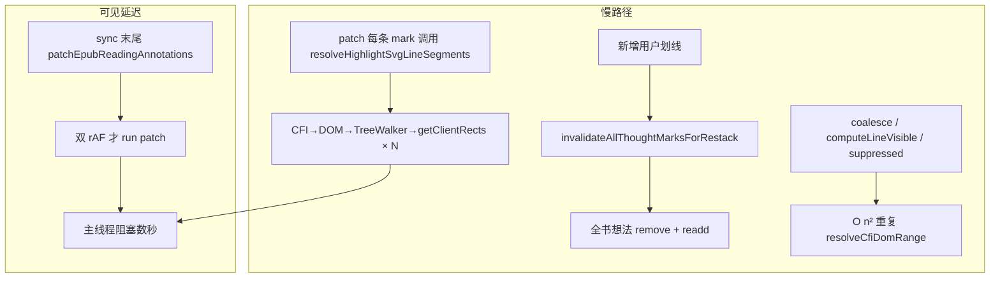

# EPUB 划线/想法同步性能优化

## 文档角色

**增量专题**：解决保存想法或用户划线后，正文标记 **延迟数秒才出现**、同步过程中 **页面卡顿无法滚动** 的问题。

**延伸阅读**：[epub-popbar-perf-ux.md](./epub-popbar-perf-ux.md)（增量 apply、PopBar 防闪烁）、[epub-thought-partial-overlap.md](./epub-thought-partial-overlap.md)（想法 patch 层 blocker 去重）、[epub-user-highlight-impl.md](./epub-user-highlight-impl.md) / [epub-thought-underline-impl.md](./epub-thought-underline-impl.md)（主链路）。

---

## 1. 背景与目标

### 1.1 用户可见问题

| 现象                                               | 触发                  |
| -------------------------------------------------- | --------------------- |
| 新增划线/想法后 **3～8s** 才看到彩色线或琥珀虚线   | 书中已有较多 mark     |
| 同步过程中 **主线程阻塞**，阅读区 **无法流畅滚动** | 保存想法、PopBar 划线 |

### 1.2 目标

- **功能不变**：重叠合并、嵌套去重、PopBar 命中、想法/划线叠放与点击行为保持原样。
- **用户操作后**：标记应 **尽快可见**，且 **不长时间占用主线程**。
- **滚动/翻页**：仍走 rAF 防抖 patch，避免与阅读争抢。

---

## 2. 改动范围

| 路径                                                            | 说明                                                                 |
| --------------------------------------------------------------- | -------------------------------------------------------------------- |
| `apps/frontend/src/views/ebook/utils/epubRangeGeometry.ts`      | patch 快路径线段、`sync` 作用域 CFI/clientRect 缓存                  |
| `apps/frontend/src/views/ebook/utils/epubUserHighlights.ts`     | `syncEpubReadingAnnotations` 流程、增量 suppression 失效、同步 patch |
| `apps/frontend/src/views/ebook/utils/epubThoughtAnnotations.ts` | `restackThoughtMarkGroups`、patch 用 `resolveMarkSvgLineSegments`    |

---

## 3. 问题根源

性能问题出在 **`syncEpubReadingAnnotations` 整条同步链**，而不是单点 bug。用户保存想法或 PopBar 划线后，`EpubPane` 的 `useEffect` 触发该函数，依次执行：构建渲染计划 → apply 用户划线 → 计算想法 suppression → apply 想法虚线 → patch SVG 样式。任一环节在主线程上耗时过长，都会表现为 **标记迟迟不出现** 与 **滚动卡顿**。



### 3.1 Patch 阶段对每条 mark 做 CFI→DOM→TreeWalker→getClientRects

`patchUserHighlightMarks` / `patchThoughtUnderlineMarks` 在每次 patch 时对 **全书每一条** mark 调用 `resolveHighlightSvgLineSegments`：

1. 用 CFI 解析 DOM `Range`；
2. `TreeWalker` 遍历选区内全部文本节点；
3. 对每个片段调用 `getClientRects` 做布局测量。

书中已有 **N** 条用户划线 + 想法虚线时，一次 sync 就是 **N 次** 重布局计算，主线程被长时间占满 → **卡顿、无法滚动**。

### 3.2 新增一条用户划线会触发全部想法 remove + readd

优化前，`invalidateAllThoughtMarksForRestack` 在 **可见用户划线 CFI 集合** 变化时，清空 **所有** 想法的 `appliedRef`。于是每次新增一条划线（即使与大部分想法无关），都要对 **全书所有想法** 执行 `annotations.remove` + `annotations.underline`，epub.js 批注层全量重建，耗时随想法数量线性放大。

### 3.3 sync 内重复解析 CFI 与 clientRect

在 **同一次** `syncEpubReadingAnnotations` 内，下列逻辑各自包含 O(n²) 或 O(n×m) 循环，且 **无缓存**：

| 函数                                     | 重复操作                                             |
| ---------------------------------------- | ---------------------------------------------------- |
| `coalesceOverlappingHighlightsForRender` | 两两 `resolveCfiDomRange` 判相交                     |
| `computeLineVisibleCfis`                 | 两两 CFI 嵌套判定                                    |
| `getThoughtCfisSuppressedByHighlights`   | 想法 × 划线，`resolveCfiDomRange` + `getClientRects` |

同一 CFI 在一次 sync 中被解析数十上百次，进一步拉长主线程占用。

### 3.4 用户操作后 patch 走双 rAF

优化前，`syncEpubReadingAnnotations` 末尾调用 `patchEpubReadingAnnotations`，内部 **连续两次** `requestAnimationFrame` 才真正执行 `runEpubReadingAnnotationPatch`。叠加上述主线程阻塞，用户体感为 **3～8s** 才看到彩色线或琥珀虚线。

---

## 4. 优化方案（功能逻辑不变）

| 优化                               | 作用                                                                                                                                                                                                                                                         |
| ---------------------------------- | ------------------------------------------------------------------------------------------------------------------------------------------------------------------------------------------------------------------------------------------------------------ |
| **`resolveMarkSvgLineSegments`**   | Patch **优先**读 marks-pane 已有 SVG `<rect>`（epub.js 已维护，滚动时同步坐标）；**仅当**无有效 rect 时才回退 CFI 精确几何（`resolveHighlightSvgLineSegments`）。典型路径从 O(N×布局) 降为 O(N×读属性)。                                                     |
| **`beginEpubAnnotationSyncScope`** | 单次 sync 内启用 CFI / clientRect **缓存**（`resolveCfiDomRange`、`getAccurateRangeLineClientRectsCached`），避免 O(n²) 循环重复解析同一 CFI。判定规则不变。                                                                                                 |
| **取消全量想法 reapply**           | 删除 `invalidateAllThoughtMarksForRestack`；改为 **`restackThoughtMarkGroups`** DOM 重排（按 span 长→短 `appendChild`，短选区仍在上层可点）+ **`invalidateThoughtMarksWithChangedSuppression`**（仅 `showLine` 因用户划线盖住而变化的 CFI 才失效 reapply）。 |
| **sync 后立即同步 patch**          | 用户保存/划线后 `syncEpubReadingAnnotations` 直接调用 **`runEpubReadingAnnotationPatch`**，不再等双 rAF；**滚动/翻页**仍走 `patchEpubReadingAnnotations`（rAF 防抖），不与阅读争抢。                                                                         |

以下分节展开各优化的实现细节。

### 4.1 Patch 快路径：`resolveMarkSvgLineSegments`

epub.js 在 `annotations.highlight/underline` 后已在 marks-pane 写入 SVG `<rect>`，滚动时由引擎同步坐标。

- **优先** `readMarkSvgLineSegmentsFromRects(group)` 读现有 rect。
- **仅当** 无有效 rect（如新 mark 首帧）时回退 `resolveHighlightSvgLineSegments`（CFI 精确几何，裁剪行尾空白）。

用户划线 patch、想法 patch 均改用此入口，将典型复杂度从 **O(N × DOM 布局)** 降为 **O(N × 读属性)**。

### 4.2 sync 作用域缓存

`beginEpubAnnotationSyncScope` / `endEpubAnnotationSyncScope` 包裹一次 `syncEpubReadingAnnotations`：

- `resolveCfiDomRange` 按 CFI 字符串缓存 `Range | null`。
- `getAccurateRangeLineClientRectsCached` 缓存精确 client rect（供「想法被用户划线盖住」判定复用）。

合并、嵌套、suppression 等逻辑 **不改判定规则**，仅避免重复解析。

### 4.3 想法叠放：DOM restack 替代全量 reapply

原逻辑：可见用户划线集合变化 → 清空全部想法 `appliedRef` → 每条想法 `remove` + `underline`。

新逻辑：

- `restackThoughtMarkGroups(rend)`：按选区 span **长→短** 排序后 `appendChild` 到 marks-pane 末尾，保证想法在彩色划线 **之上**，短选区仍在 **上层** 可点。
- `invalidateThoughtMarksWithChangedSuppression`：仅当某 CFI 的 **showLine 是否被用户划线 suppress** 状态变化时，才从 `appliedRef` 删除该条。

新增一条与某想法无关的划线时，**不再** reapply 全书想法。

### 4.4 用户 sync 后立即 patch

`syncEpubReadingAnnotations` 末尾直接 `runEpubReadingAnnotationPatch(rend)`，不再经 `patchEpubReadingAnnotations` 的双 rAF。

滚动/翻页/内容渲染仍通过 `installEpubUserHighlightPatchListeners` → `patchEpubReadingAnnotations`（rAF 防抖），避免滚动时同步重活。

---

## 5. 改动前后对比

### 5.1 Patch 线段解析：每条 mark 都走 CFI 精确几何 → 优先读 SVG rect

**改动前**（`patchUserHighlightMarks` / `patchThoughtUnderlineMarks` 内）：

**来源**：优化前 `apps/frontend/src/views/ebook/utils/epubUserHighlights.ts`（`patchUserHighlightMarks` 内）

```typescript
// 从 epub.js 写入 g 节点的 data-epubcfi 读取当前 mark 的 CFI 地址
const cfi = groupEl.dataset.epubcfi?.trim();
// 每次 patch 都走精确几何：CFI→DOM Range→TreeWalker→getClientRects（全书 N 条即 N 次布局）
const segments = resolveHighlightSvgLineSegments(rend, groupEl, cfi);
// 按 segments 同步 SVG rect，供后续绘制彩色 fill / 下划线 / 波浪线
const rects = syncHighlightMarkRects(groupEl, segments);
```

**改动后**：

**来源**：`apps/frontend/src/views/ebook/utils/epubUserHighlights.ts`（`patchUserHighlightMarks` 内，约 L183–L185）

```typescript
// 从 g 节点 dataset 读取 CFI；仅无 rect 需回退精确几何时才用到
const cfi = groupEl.dataset.epubcfi?.trim();
// 优先读 marks-pane 已有 SVG rect（O 读属性）；无 rect 才回退 resolveHighlightSvgLineSegments
const segments = resolveMarkSvgLineSegments(rend, groupEl, cfi);
// 与改动前相同：按 segments 写入/更新 rect 几何
const rects = syncHighlightMarkRects(groupEl, segments);
```

**新增**（`epubRangeGeometry.ts`，优化前不存在）：

**来源**：`apps/frontend/src/views/ebook/utils/epubRangeGeometry.ts`（`resolveMarkSvgLineSegments`，约 L330–L338）

```typescript
// patch 阶段统一入口：快路径 + 精确几何回退
export function resolveMarkSvgLineSegments(
	// Rendition；回退路径解析 CFI 时需要
	rend: Rendition | undefined,
	// 当前 mark 的 SVG <g> 节点
	group: Element,
	// 可选 CFI；仅回退 resolveHighlightSvgLineSegments 时使用
	cfiRange?: string,
): SvgLineSegment[] {
	// 尝试从 g 下已有 rect 读取线段（不触发布局）
	const existing = readMarkSvgLineSegmentsFromRects(group);
	// 有有效 rect 则直接返回——全书 patch 的热路径
	if (existing.length > 0) return existing;
	// 无 rect（新 mark 首帧）时回退旧逻辑：CFI→DOM→getClientRects
	return resolveHighlightSvgLineSegments(rend, group, cfiRange);
}
```

|                           | 改动前                      | 改动后                        |
| ------------------------- | --------------------------- | ----------------------------- |
| 全书 N 条 mark 一次 patch | N 次 CFI→DOM→getClientRects | 绝大多数仅 N 次读 `rect` 属性 |
| 新 mark 首帧              | 精确几何                    | 仍回退精确几何（行为一致）    |

---

### 5.2 sync 主流程：无缓存 + 全书想法 reapply + 双 rAF

**改动前**（`syncEpubReadingAnnotations` 完整摘录）：

**来源**：优化前 `apps/frontend/src/views/ebook/utils/epubUserHighlights.ts`

```typescript
// 用户划线 / 想法变化后的正文批注同步入口（无 sync 作用域缓存）
export function syncEpubReadingAnnotations(
	// epub.js Rendition 实例
	rend: Rendition,
	// 当前书籍全部想法数据
	thoughts: EbookThought[],
	// 当前书籍全部用户划线数据
	highlights: EbookUserHighlight[],
	// cfiRange → 想法 apply 签名（thoughtIds + showLine）
	appliedThoughtsRef: Map<string, string>,
	// cfiRange → 用户划线 apply 签名（style|color|id）
	appliedHighlightsRef: Map<string, string>,
): void {
	// 清空想法 patch 用的用户划线 blocker 源
	setUserHighlightBlockerSourcesForThoughtPatch([]);
	// 构建渲染计划：coalesce、visibleCfis、sorted（CFI 解析无缓存，O(n²) 可重复）
	const highlightPlan = buildHighlightRenderPlan(rend, highlights);
	// 增量 apply 用户划线（此项优化前已有，见 epub-popbar-perf-ux.md）
	applyEpubUserHighlights(
		// rendition
		rend,
		// 用户划线列表
		highlights,
		// apply 签名 Map
		appliedHighlightsRef,
		// 预计算的渲染计划
		highlightPlan,
	);

	// 筛出当前可见的用户划线，供 suppression 与 signature 使用
	const visibleHighlights = highlightPlan.coalesced.filter((item) =>
		// 仅当 CFI 在 visibleCfis 集合内才保留
		highlightPlan.visibleCfis.has(item.cfiRange),
	);
	// 将可见划线 CFI 排序拼接为字符串，用于检测集合是否变化
	const highlightCfiSignature = buildVisibleHighlightCfiSignature(
		// coalesce 后的划线列表
		highlightPlan.coalesced,
		// 当前应可见的 CFI 集合
		highlightPlan.visibleCfis,
	);
	// 可见用户划线集合相对上一轮发生变化
	if (highlightCfiSignature !== previousVisibleHighlightCfiSignature) {
		// 清空全部仍在使用的想法 appliedRef → 迫使全书想法 remove+underline
		invalidateAllThoughtMarksForRestack(thoughts, appliedThoughtsRef);
		// 更新模块级 signature 快照
		previousVisibleHighlightCfiSignature = highlightCfiSignature;
	}

	// 计算哪些想法 CFI 的虚线应被用户划线盖住
	const suppressed = getThoughtCfisSuppressedByHighlights(
		// 全部想法
		thoughts,
		// 当前可见用户划线
		visibleHighlights,
		// rendition（解析 CFI→Range）
		rend,
	);
	// apply 想法虚线（若上一步 invalidate，则全书 reapply）
	applyEpubThoughtUnderlines(rend, thoughts, appliedThoughtsRef, suppressed);
	// 收集 DOM 上用户划线 rect，供想法 patch 扣线
	setUserHighlightBlockerSourcesForThoughtPatch(
		// 从 marks-pane 收集 blocker 源
		collectUserHighlightBlockerSources(rend),
	);
	// 调度 patch：内部双 rAF，叠加主线程阻塞 → 体感延迟数秒
	patchEpubReadingAnnotations(rend);
}

// 优化前：用户划线集合一变，所有活跃想法 CFI 的 apply 签名全部失效
function invalidateAllThoughtMarksForRestack(
	// 当前书籍全部想法
	thoughts: EbookThought[],
	// 想法 apply 签名 Map
	appliedThoughtsRef: Map<string, string>,
): void {
	// 当前仍存在的想法 CFI 集合
	const activeCfis = new Set(
		// 提取每条想法的 cfiRange，trim 后过滤空串
		thoughts.map((t) => t.cfiRange.trim()).filter(Boolean),
	);
	// 遍历已 apply 的想法 CFI
	for (const cfi of [...appliedThoughtsRef.keys()]) {
		// 该 CFI 仍对应有效想法
		if (activeCfis.has(cfi)) {
			// 删除签名 → applyEpubThoughtUnderlines 会对该条 remove+underline
			appliedThoughtsRef.delete(cfi);
		}
	}
}
```

**改动后**：

**来源**：`apps/frontend/src/views/ebook/utils/epubUserHighlights.ts`（约 L2185–L2260）

```typescript
// 优化后 sync 入口：包裹 CFI/clientRect 缓存作用域
export function syncEpubReadingAnnotations(
	// epub.js Rendition 实例
	rend: Rendition,
	// 当前书籍全部想法数据
	thoughts: EbookThought[],
	// 当前书籍全部用户划线数据
	highlights: EbookUserHighlight[],
	// cfiRange → 想法 apply 签名
	appliedThoughtsRef: Map<string, string>,
	// cfiRange → 用户划线 apply 签名
	appliedHighlightsRef: Map<string, string>,
): void {
	// 开启本轮 sync 缓存（resolveCfiDomRange / clientRect 复用）
	beginEpubAnnotationSyncScope();
	// try/finally 保证无论成功失败都释放 sync 缓存
	try {
		// 清空上一轮 blocker，避免 stale rect
		setUserHighlightBlockerSourcesForThoughtPatch([]);
		// 构建渲染计划（coalesce 等同轮只算一次，且走 CFI 缓存）
		const highlightPlan = buildHighlightRenderPlan(rend, highlights);
		// 增量 apply 用户划线
		applyEpubUserHighlights(
			// rendition
			rend,
			// 用户划线列表
			highlights,
			// apply 签名 Map
			appliedHighlightsRef,
			// 预计算的渲染计划
			highlightPlan,
		);
		// 筛可见用户划线
		const visibleHighlights = highlightPlan.coalesced.filter((item) =>
			// 仅保留 visibleCfis 内的 CFI
			highlightPlan.visibleCfis.has(item.cfiRange),
		);
		// 已删除 highlightCfiSignature + invalidateAllThoughtMarksForRestack

		// 计算应 suppress 虚线的想法 CFI
		const suppressed = getThoughtCfisSuppressedByHighlights(
			// 全部想法
			thoughts,
			// 当前可见用户划线
			visibleHighlights,
			// rendition
			rend,
		);
		// 仅 showLine suppress 状态变化的 CFI 才失效签名
		invalidateThoughtMarksWithChangedSuppression(
			// 本轮 suppress 集合
			suppressed,
			// 想法 apply 签名 Map
			appliedThoughtsRef,
		);
		// 增量 apply 想法虚线
		applyEpubThoughtUnderlines(rend, thoughts, appliedThoughtsRef, suppressed);
		// 注入用户划线 blocker 供想法 patch
		setUserHighlightBlockerSourcesForThoughtPatch(
			// 从 marks-pane 收集 blocker 源
			collectUserHighlightBlockerSources(rend),
		);
		// 当前帧立即 patch，不等 patchEpubReadingAnnotations 双 rAF
		runEpubReadingAnnotationPatch(rend);
	} finally {
		// 释放 sync 缓存，避免跨轮脏读
		endEpubAnnotationSyncScope();
	}
}

// 优化后：仅 suppress 状态翻转的 CFI 才 reapply
function invalidateThoughtMarksWithChangedSuppression(
	// 本轮应 suppress 虚线的 CFI 集合
	suppressedLineCfis: Set<string>,
	// 想法 apply 签名 Map
	appliedThoughtsRef: Map<string, string>,
): void {
	// 遍历已 apply 的全部想法 CFI
	for (const cfi of [...appliedThoughtsRef.keys()]) {
		// 上一轮该 CFI 是否被用户划线盖住而隐藏虚线
		const wasSuppressed = previousThoughtSuppressedCfis.has(cfi);
		// 本轮是否应 suppress
		const nowSuppressed = suppressedLineCfis.has(cfi);
		// 状态未变则保留签名，skip remove+underline
		if (wasSuppressed !== nowSuppressed) {
			// 状态翻转：删除签名，触发该条 reapply
			appliedThoughtsRef.delete(cfi);
		}
	}
	// 保存本轮 suppress 快照供下轮 diff
	previousThoughtSuppressedCfis = new Set(suppressedLineCfis);
}
```

|                  | 改动前                   | 改动后                                       |
| ---------------- | ------------------------ | -------------------------------------------- |
| 新增一条无关划线 | 全书想法 remove+readd    | 仅 DOM restack（见 5.3）                     |
| sync 内 CFI 解析 | 每次直接解析，O(n²) 重复 | `begin/endEpubAnnotationSyncScope` 缓存      |
| 用户操作后可见线 | 等双 rAF + 主线程阻塞    | 同函数内立即 `runEpubReadingAnnotationPatch` |

---

### 5.3 想法叠放：全书 reapply → DOM restack

**改动前**：用户划线集合变化时，通过 `invalidateAllThoughtMarksForRestack` 迫使 epub.js 对 **每条想法** 重新 `annotations.remove` + `annotations.underline`，以改变 SVG 叠层顺序。**无** `restackThoughtMarkGroups` 函数。

**改动后**：

**来源**：`apps/frontend/src/views/ebook/utils/epubThoughtAnnotations.ts`（`restackThoughtMarkGroups`，约 L177–L209）

```typescript
// 新增：纯 DOM 重排想法 mark，不触碰 epub.js 批注注册表
export function restackThoughtMarkGroups(
	// 可选 Rendition，用于收集 iframe document
	rend?: Rendition,
): void {
	// 待处理 document：主文档 + 各 iframe
	const docs = new Set<Document>([document]);
	// 从 rendition 收集 iframe document
	for (const contents of getRenditionContentsList(rend)) {
		// 有效 document 加入集合
		if (contents.document) docs.add(contents.document);
	}

	// 逐个 document 处理
	for (const doc of docs) {
		// try/catch：iframe 卸载时 querySelector 可能抛错
		try {
			// 遍历该 document 内所有 marks-pane
			for (const pane of doc.querySelectorAll(".marks-pane")) {
				// 收集 pane 内全部想法 underline 的 g 节点
				const groups = [
					// 展开 querySelectorAll 结果为数组
					...pane.querySelectorAll(
						// 匹配 class 或 ref 属性为想法 underline 的 g 节点
						`g.${EPUB_THOUGHT_UNDERLINE_CLASS}, g[ref="${EPUB_THOUGHT_UNDERLINE_CLASS}"]`,
					),
					// 断言为 SVGElement 数组
				] as SVGElement[];
				// 按 span 长→短排序（与 apply 时 sortCfiGroupsForUnderlineStack 一致）
				groups.sort((left, right) => {
					// 用 rect 宽度估算 span，避免 CFI→DOM
					const spanDiff =
						// 右 span 减左 span：正值表示 right 更长
						thoughtMarkSpanLength(right) - thoughtMarkSpanLength(left);
					// span 不同：长的排前（先 append，DOM 靠下）
					if (spanDiff !== 0) return spanDiff;
					// span 相同：CFI 字符串长度 tie-break，保证顺序稳定
					return (
						// 左 CFI 长度
						(left.dataset.epubcfi?.length ?? 0) -
						// 减右 CFI 长度
						(right.dataset.epubcfi?.length ?? 0)
					);
				});
				// appendChild 已有节点 = 移到 pane 末尾，提升绘制/命中层级
				for (const group of groups) {
					// 将 g 节点 append 到 marks-pane 末尾
					pane.appendChild(group);
				}
			}
		} catch {
			// iframe 卸载或 document 不可访问时忽略
		}
	}
}
```

**`runEpubReadingAnnotationPatch` 末尾对比**：

**来源**：`apps/frontend/src/views/ebook/utils/epubUserHighlights.ts`（约 L2228–L2239）

```typescript
// ---------- 改动前 ----------
// 执行一轮 SVG patch（无 DOM restack）
function runEpubReadingAnnotationPatch(
	// epub.js Rendition
	rend: Rendition,
): void {
	// patch 全书用户划线 SVG 样式
	patchAllUserHighlightMarks(rend);
	// 刷新 blocker 源
	setUserHighlightBlockerSourcesForThoughtPatch(
		// 从 marks-pane 收集用户划线 rect
		collectUserHighlightBlockerSources(rend),
	);
	// patch 全书想法虚线
	patchEpubThoughtUnderlineMarks(rend);
	// 叠层靠 invalidateAllThoughtMarksForRestack 全书 reapply 实现
}

// ---------- 改动后 ----------
// 执行一轮 SVG patch，末尾增加 DOM restack
function runEpubReadingAnnotationPatch(
	// epub.js Rendition
	rend: Rendition,
): void {
	// patch 全书用户划线 SVG 样式（已改用 resolveMarkSvgLineSegments 快路径）
	patchAllUserHighlightMarks(rend);
	// 刷新 blocker 源
	setUserHighlightBlockerSourcesForThoughtPatch(
		// 从 marks-pane 收集用户划线 rect
		collectUserHighlightBlockerSources(rend),
	);
	// patch 全书想法虚线
	patchEpubThoughtUnderlineMarks(rend);
	// 新增：DOM 重排想法 g，叠在用户划线之上，无需全书 reapply
	restackThoughtMarkGroups(rend);
}
```

---

### 5.4 CFI / clientRect 缓存与 suppression 测量

**改动前**：

**来源**：优化前 `apps/frontend/src/views/ebook/utils/epubRangeGeometry.ts` / `epubUserHighlights.ts`

```typescript
// 无模块级缓存；每次调用都遍历 iframe 解析 CFI
export function resolveCfiDomRange(
	// epub.js Rendition
	rend: Rendition,
	// epub CFI 字符串
	cfiRange: string,
): Range | null {
	// 直接 uncached 解析
	return resolveCfiDomRangeUncached(rend, cfiRange);
}

// 想法是否被用户划线 clientRect 完全盖住（无缓存，O(n×m) 重复 getClientRects）
function isDomRangeFullyCoveredByHighlightClientRects(
	// 想法选区 DOM Range
	thoughtRange: Range,
	// 用户划线选区 DOM Range
	highlightRange: Range,
): boolean {
	// 想法选区全部 client rect（含行尾空白，未裁剪）
	const thoughtRects = [...thoughtRange.getClientRects()].filter(
		// 过滤宽度和高度均 > 0.5 的有效 rect
		(rect) => rect.width > 0.5 && rect.height > 0.5,
	);
	// 用户划线选区全部 client rect
	const highlightRects = [...highlightRange.getClientRects()].filter(
		// 过滤宽度和高度均 > 0.5 的有效 rect
		(rect) => rect.width > 0.5 && rect.height > 0.5,
	);
	// 任一方无 rect 则不算完全覆盖
	if (thoughtRects.length === 0 || highlightRects.length === 0) return false;

	// 想法每个 rect 须被某个 highlight rect 完全包含
	return thoughtRects.every((thoughtRect) =>
		highlightRects.some((highlightRect) => {
			// 垂直方向无交集则跳过该 highlight rect
			if (
				// thought 底边在 highlight 顶边之上
				thoughtRect.bottom <= highlightRect.top + 0.5 ||
				// thought 顶边在 highlight 底边之下
				thoughtRect.top >= highlightRect.bottom - 0.5
			) {
				// 垂直不重叠
				return false;
			}
			// 水平方向想法 rect 在 highlight rect 内（±1px 容差）
			return (
				// thought 左边界不早于 highlight 左边界
				thoughtRect.left >= highlightRect.left - 1 &&
				// thought 右边界不晚于 highlight 右边界
				thoughtRect.right <= highlightRect.right + 1
			);
		}),
	);
}
```

**改动后**：

**来源**：`apps/frontend/src/views/ebook/utils/epubRangeGeometry.ts`（约 L340–L410）及 `epubUserHighlights.ts`

```typescript
// 模块级：sync 作用域内 CFI→Range 缓存（null 表示未在 sync 中）
let syncCfiRangeCache: Map<string, Range | null> | null = null;
// 模块级：sync 作用域内 CFI key→精确 clientRect[] 缓存
let syncAccurateClientRectCache: Map<string, DOMRect[]> | null = null;

// sync 开始时启用缓存
export function beginEpubAnnotationSyncScope(): void {
	// 初始化 CFI 缓存 Map
	syncCfiRangeCache = new Map();
	// 初始化 clientRect 缓存 Map
	syncAccurateClientRectCache = new Map();
}

// sync 结束时释放缓存
export function endEpubAnnotationSyncScope(): void {
	// 置 null，下一轮 sync 重新建 Map
	syncCfiRangeCache = null;
	// 同步清空 clientRect 缓存
	syncAccurateClientRectCache = null;
}

// 带缓存的 CFI→Range（同轮 coalesce / suppressed 等复用）
export function resolveCfiDomRange(
	// epub.js Rendition
	rend: Rendition,
	// epub CFI 字符串
	cfiRange: string,
): Range | null {
	// 规范化缓存键
	const key = cfiRange.trim();
	// 在 sync 作用域内
	if (syncCfiRangeCache && key) {
		// 命中缓存
		if (syncCfiRangeCache.has(key)) {
			// 返回已缓存的 Range（可能为 null）
			return syncCfiRangeCache.get(key) ?? null;
		}
		// 未命中：解析并写入
		const resolved = resolveCfiDomRangeUncached(rend, key);
		// 存入 CFI 缓存供同轮后续调用复用
		syncCfiRangeCache.set(key, resolved);
		// 返回本次解析结果
		return resolved;
	}
	// sync 外：行为与改动前相同
	return resolveCfiDomRangeUncached(rend, cfiRange);
}

// 优化后：用 cached 精确 clientRect（裁剪行尾空白 + 同 CFI 只测一次）
function isDomRangeFullyCoveredByHighlightClientRects(
	// 想法 CFI（作缓存键前缀）
	thoughtCfi: string,
	// 想法 DOM Range
	thoughtRange: Range,
	// 用户划线 CFI（作缓存键前缀）
	highlightCfi: string,
	// 用户划线 DOM Range
	highlightRange: Range,
): boolean {
	// 想法 rect（缓存键 thought:${cfi}）
	const thoughtRects = getAccurateRangeLineClientRectsCached(
		// 缓存键：区分想法与用户划线
		`thought:${thoughtCfi}`,
		// 已解析的 DOM Range
		thoughtRange,
	);
	// 用户划线 rect（缓存键 highlight:${cfi}）
	const highlightRects = getAccurateRangeLineClientRectsCached(
		// 缓存键
		`highlight:${highlightCfi}`,
		// 已解析的 DOM Range
		highlightRange,
	);
	// 任一方无 rect 则不算完全覆盖
	if (thoughtRects.length === 0 || highlightRects.length === 0) return false;

	// 判定逻辑与改动前相同，仅 rect 来源改为 cached
	return thoughtRects.every((thoughtRect) =>
		highlightRects.some((highlightRect) => {
			// 垂直方向无交集则该 highlight rect 不可能覆盖 thought rect
			if (
				// thought 底边在 highlight 顶边之上（含 0.5px 容差）
				thoughtRect.bottom <= highlightRect.top + 0.5 ||
				// thought 顶边在 highlight 底边之下
				thoughtRect.top >= highlightRect.bottom - 0.5
			) {
				// 垂直不重叠，尝试下一个 highlight rect
				return false;
			}
			// 水平方向：thought rect 完全落在 highlight rect 内（±1px 容差）
			return (
				// thought 左边界不早于 highlight 左边界
				thoughtRect.left >= highlightRect.left - 1 &&
				// thought 右边界不晚于 highlight 右边界
				thoughtRect.right <= highlightRect.right + 1
			);
		}),
	);
}
```

---

### 5.5 用户操作 vs 滚动：patch 触发路径对比

| 场景                       | 改动前                                                            | 改动后                                                  |
| -------------------------- | ----------------------------------------------------------------- | ------------------------------------------------------- |
| 保存想法 / PopBar 划线     | `sync` → `patchEpubReadingAnnotations(rend)` → **双 rAF** → patch | `sync` → **`runEpubReadingAnnotationPatch(rend)` 同步** |
| 滚动 / 翻页 / content 渲染 | `patchEpubReadingAnnotations(rend, { defer })` → rAF              | **不变**，仍走 rAF 防抖                                 |

**改动前** sync 末尾 + `patchEpubReadingAnnotations` 内部：

**来源**：优化前 `apps/frontend/src/views/ebook/utils/epubUserHighlights.ts`

```typescript
// sync 末尾：调度异步 patch（非立即执行）
patchEpubReadingAnnotations(rend);

// patchEpubReadingAnnotations 内部（摘录）
export function patchEpubReadingAnnotations(
	// epub.js Rendition
	rend: Rendition,
	// 可选：defer 时走双 rAF
	options?: { defer?: boolean },
): void {
	// content 渲染场景标记需要双 rAF
	if (options?.defer) {
		pendingReadingAnnotationFullPatch = true;
	}
	// 取消上一轮未执行的 rAF
	cancelAnimationFrame(readingAnnotationPatchRaf);
	// 注册第一帧 rAF 回调
	readingAnnotationPatchRaf = requestAnimationFrame(() => {
		// defer 时第二帧 rAF 才 patch
		if (pendingReadingAnnotationFullPatch) {
			// 清除 defer 标记，避免后续重复双 rAF
			pendingReadingAnnotationFullPatch = false;
			// 注册第二帧 rAF
			readingAnnotationPatchRaf = requestAnimationFrame(() => {
				// 第二帧执行完整 patch
				runEpubReadingAnnotationPatch(rend);
			});
			// 第一帧回调结束，等待第二帧
			return;
		}
		// 非 defer：第一帧 rAF 后直接 patch
		runEpubReadingAnnotationPatch(rend);
	});
}
```

**改动后** sync 末尾：

**来源**：`apps/frontend/src/views/ebook/utils/epubUserHighlights.ts`（`syncEpubReadingAnnotations` 内）

```typescript
// 收集用户划线 blocker（想法 patch 扣线用）
setUserHighlightBlockerSourcesForThoughtPatch(
	collectUserHighlightBlockerSources(rend),
);
// 直接同步执行 patch，当前调用栈内完成，无 rAF 等待
runEpubReadingAnnotationPatch(rend);
```

---

## 6. 关键代码与注释（改动后完整版）

> 全文代码块均采用「**每行代码上方一行中文注释**」格式（含 §5 改动前后对比与 §6 完整版）。部分块为摘录，省略处用 `// ...` 标明。

### 6.1 从 SVG rect 读取线段（patch 热路径）

**来源**：`apps/frontend/src/views/ebook/utils/epubRangeGeometry.ts`（`readMarkSvgLineSegmentsFromRects`，约 L300–L324）

```typescript
// 从 epub.js 已在 mark 上写好的 SVG <rect> 读取线段，避免 CFI→DOM→getClientRects
export function readMarkSvgLineSegmentsFromRects(
	// 单个 annotation 对应的 SVG <g> 分组节点
	group: Element,
): SvgLineSegment[] {
	// 收集有效 rect 转换后的线段列表
	const segments: SvgLineSegment[] = [];
	// 遍历该 g 下所有 rect（多行选区时 epub.js 会写多个 rect）
	for (const node of group.querySelectorAll("rect")) {
		// 非 SVGRectElement 的节点跳过
		if (!(node instanceof SVGRectElement)) continue;
		// 读取 rect 的 x 坐标（marks-pane 局部坐标系）
		const x = Number.parseFloat(node.getAttribute("x") ?? "NaN");
		// 读取 rect 的 y 坐标
		const y = Number.parseFloat(node.getAttribute("y") ?? "NaN");
		// 读取 rect 宽度
		const width = Number.parseFloat(node.getAttribute("width") ?? "NaN");
		// 读取 rect 高度
		const height = Number.parseFloat(node.getAttribute("height") ?? "NaN");
		// 以下任一条件成立则跳过当前 rect（无效或过小）
		if (
			// x 坐标非有限数
			!Number.isFinite(x) ||
			// y 坐标非有限数
			!Number.isFinite(y) ||
			// 宽度非有限数
			!Number.isFinite(width) ||
			// 高度非有限数
			!Number.isFinite(height) ||
			// 宽度过小（不可见）
			width <= 0.5 ||
			// 高度过小（不可见）
			height <= 0.5
		) {
			// 当前 rect 不可用，尝试下一个
			continue;
		}
		// 将有效 rect 转为统一的 SvgLineSegment 结构
		segments.push({ x, y, width, height });
	}
	// 返回全部有效线段（可能为空，调用方会走 CFI 回退）
	return segments;
}
```

### 6.2 Patch 入口：`resolveMarkSvgLineSegments`

**来源**：`apps/frontend/src/views/ebook/utils/epubRangeGeometry.ts`（约 L330–L338）

```typescript
// patch 阶段解析 mark 线段的统一入口：优先快路径，必要时才做精确几何
export function resolveMarkSvgLineSegments(
	// epub.js Rendition；回退精确几何时需要
	rend: Rendition | undefined,
	// 当前 mark 的 SVG <g> 节点
	group: Element,
	// 可选 CFI 字符串；仅回退 resolveHighlightSvgLineSegments 时使用
	cfiRange?: string,
): SvgLineSegment[] {
	// 先尝试从已有 SVG rect 读取（O(读属性)，不触发布局）
	const existing = readMarkSvgLineSegmentsFromRects(group);
	// 有有效 rect 则直接返回，这是全书 N 条 mark patch 时的热路径
	if (existing.length > 0) return existing;
	// 无 rect（如新 mark 首帧）时回退：CFI→Range→TreeWalker→getClientRects
	return resolveHighlightSvgLineSegments(rend, group, cfiRange);
}
```

### 6.3 sync 作用域缓存

**来源**：`apps/frontend/src/views/ebook/utils/epubRangeGeometry.ts`（约 L340–L410）

```typescript
// 模块级：当前是否在 syncEpubReadingAnnotations 批处理作用域内
let syncCfiRangeCache: Map<string, Range | null> | null = null;
// 模块级：sync 内精确 clientRect 缓存（供 suppression 判定复用）
let syncAccurateClientRectCache: Map<string, DOMRect[]> | null = null;

// sync 开始时调用：启用本轮 CFI / clientRect 缓存
export function beginEpubAnnotationSyncScope(): void {
	// 新建 CFI→Range 缓存 Map
	syncCfiRangeCache = new Map();
	// 新建 CFI key→clientRect[] 缓存 Map
	syncAccurateClientRectCache = new Map();
}

// sync 结束时调用：释放缓存，避免跨轮 sync 脏数据
export function endEpubAnnotationSyncScope(): void {
	// 清空 CFI 缓存引用
	syncCfiRangeCache = null;
	// 清空 clientRect 缓存引用
	syncAccurateClientRectCache = null;
}

// sync 阶段带缓存的精确 clientRect（想法被用户划线盖住判定用）
export function getAccurateRangeLineClientRectsCached(
	// 缓存键，如 thought:${cfi} 或 highlight:${cfi}，避免想法/划线 rect 冲突
	cfiKey: string,
	// 已解析的 DOM Range；null 时直接返回空数组
	range: Range | null,
): DOMRect[] {
	// Range 无效则无需测量
	if (!range) return [];
	// 仅在 sync 作用域内走缓存
	if (syncAccurateClientRectCache) {
		// 命中缓存则直接返回，避免重复 TreeWalker + getClientRects
		const cached = syncAccurateClientRectCache.get(cfiKey);
		if (cached) return cached;
		// 未命中：执行精确几何（裁剪行尾空白等）
		const rects = getAccurateRangeLineClientRects(range);
		// 写入缓存供同轮后续 O(n×m) 循环复用
		syncAccurateClientRectCache.set(cfiKey, rects);
		return rects;
	}
	// sync 作用域外（如滚动 patch）仍走无缓存精确几何
	return getAccurateRangeLineClientRects(range);
}

// 对外统一的 CFI→Range 解析；sync 内自动走缓存
export function resolveCfiDomRange(
	rend: Rendition,
	cfiRange: string,
): Range | null {
	// 规范化 CFI 字符串作为缓存键
	const key = cfiRange.trim();
	// sync 作用域内且 key 非空时尝试缓存
	if (syncCfiRangeCache && key) {
		// 已解析过则直接返回缓存结果（含 null）
		if (syncCfiRangeCache.has(key)) {
			return syncCfiRangeCache.get(key) ?? null;
		}
		// 未命中：真正解析 CFI（遍历 iframe contents / rend.getRange）
		const resolved = resolveCfiDomRangeUncached(rend, key);
		// 写入缓存，同轮 coalesce / computeLineVisible / suppressed 可复用
		syncCfiRangeCache.set(key, resolved);
		return resolved;
	}
	// 非 sync 作用域：每次直接解析，行为与优化前一致
	return resolveCfiDomRangeUncached(rend, cfiRange);
}
```

### 6.4 sync 主流程

**来源**：`apps/frontend/src/views/ebook/utils/epubUserHighlights.ts`（`syncEpubReadingAnnotations`，约 L2185–L2223）

```typescript
// 用户划线 / 想法数据变化后的唯一正文批注同步入口（EpubPane useEffect 调用）
export function syncEpubReadingAnnotations(
	rend: Rendition,
	thoughts: EbookThought[],
	highlights: EbookUserHighlight[],
	// cfiRange → 想法 apply 签名（thoughtIds + showLine）
	appliedThoughtsRef: Map<string, string>,
	// cfiRange → 用户划线 apply 签名（style|color|id）
	appliedHighlightsRef: Map<string, string>,
): void {
	// 开启 sync 作用域：本轮 resolveCfiDomRange / clientRect 走缓存
	beginEpubAnnotationSyncScope();
	try {
		// 清空想法 patch 用的用户划线 blocker，避免上一轮 rect 残留
		setUserHighlightBlockerSourcesForThoughtPatch([]);
		// 构建渲染计划：coalesce + visibleCfis + sorted（只算一次，见 epub-popbar-perf-ux.md）
		const highlightPlan = buildHighlightRenderPlan(rend, highlights);
		// 增量 apply 用户划线：仅 signature 变化的 CFI 才 remove+highlight
		applyEpubUserHighlights(
			rend,
			highlights,
			appliedHighlightsRef,
			highlightPlan,
		);
		// 从 coalesced 中筛出 visibleCfis 内的用户划线
		const visibleHighlights = highlightPlan.coalesced.filter((item) =>
			// 仅保留应绘制可见样式的 CFI
			highlightPlan.visibleCfis.has(item.cfiRange),
		);
		// 计算哪些想法 CFI 的虚线应被用户彩色划线盖住而 suppress
		const suppressed = getThoughtCfisSuppressedByHighlights(
			thoughts,
			visibleHighlights,
			rend,
		);
		// 仅 showLine 状态相对上一轮变化的 CFI 才从 appliedRef 删除（增量 reapply）
		invalidateThoughtMarksWithChangedSuppression(
			suppressed,
			appliedThoughtsRef,
		);
		// 增量 apply 想法虚线：signature 未变则 skip
		applyEpubThoughtUnderlines(rend, thoughts, appliedThoughtsRef, suppressed);
		// 收集当前 DOM 上用户划线的 SVG rect，供想法 patch 扣减重叠线段
		setUserHighlightBlockerSourcesForThoughtPatch(
			collectUserHighlightBlockerSources(rend),
		);
		// 用户主动保存/划线：同步 patch，不等 patchEpubReadingAnnotations 的双 rAF
		runEpubReadingAnnotationPatch(rend);
	} finally {
		// 无论成功失败都结束 sync 作用域，释放 CFI/clientRect 缓存
		endEpubAnnotationSyncScope();
	}
}
```

### 6.5 同步 patch 与 suppression 增量失效

**来源**：`apps/frontend/src/views/ebook/utils/epubUserHighlights.ts`（约 L2228–L2260）

```typescript
// 执行一轮完整 SVG patch：用户划线样式 + 想法虚线 + DOM 叠放
function runEpubReadingAnnotationPatch(rend: Rendition): void {
	try {
		// 遍历全书用户划线 mark，用 resolveMarkSvgLineSegments 快路径改 SVG
		patchAllUserHighlightMarks(rend);
		// patch 用户划线后刷新 blocker 源（想法虚线需扣减彩色块占用的水平区间）
		setUserHighlightBlockerSourcesForThoughtPatch(
			collectUserHighlightBlockerSources(rend),
		);
		// 遍历全书想法 mark，绘制琥珀虚线并处理想法间重叠 blocker
		patchEpubThoughtUnderlineMarks(rend);
		// DOM 重排：想法 g 移到 marks-pane 末尾，叠在用户划线之上，无需全书 reapply
		restackThoughtMarkGroups(rend);
	} catch {
		// rendition 已销毁时忽略（切书/卸载）
	}
}

// 模块级：上一轮 sync 结束时被 suppress 虚线的想法 CFI 集合
let previousThoughtSuppressedCfis = new Set<string>();

// 仅当某 CFI 的「是否被用户划线盖住而隐藏虚线」状态变化时，才迫使 reapply 该条想法
function invalidateThoughtMarksWithChangedSuppression(
	// 本轮计算出的应 suppress 虚线的 CFI 集合
	suppressedLineCfis: Set<string>,
	// 想法 apply 签名 Map；delete 后 applyEpubThoughtUnderlines 会 remove+underline
	appliedThoughtsRef: Map<string, string>,
): void {
	// 遍历当前已 apply 的全部想法 CFI
	for (const cfi of [...appliedThoughtsRef.keys()]) {
		// 上一轮该 CFI 是否处于 suppress 状态
		const wasSuppressed = previousThoughtSuppressedCfis.has(cfi);
		// 本轮该 CFI 是否应 suppress
		const nowSuppressed = suppressedLineCfis.has(cfi);
		// 仅状态翻转时才失效签名，触发该条 remove+underline
		if (wasSuppressed !== nowSuppressed) {
			// 删除 apply 签名，applyEpubThoughtUnderlines 会对该 CFI reapply
			appliedThoughtsRef.delete(cfi);
		}
	}
	// 更新模块级快照，供下一轮 diff
	previousThoughtSuppressedCfis = new Set(suppressedLineCfis);
}
```

### 6.6 想法 DOM 叠放（替代全书 reapply）

**来源**：`apps/frontend/src/views/ebook/utils/epubThoughtAnnotations.ts`（`restackThoughtMarkGroups`，约 L177–L209）

```typescript
// 将想法 mark 移到 marks-pane DOM 末尾，保证叠放在用户划线之上且无需 remove+readd
export function restackThoughtMarkGroups(
	// 可选 Rendition，用于收集 iframe document
	rend?: Rendition,
): void {
	// 待处理的 document 集合：主文档 + 各章节 iframe 文档
	const docs = new Set<Document>([document]);
	// 从 rendition 收集所有 iframe contents 的 document
	for (const contents of getRenditionContentsList(rend)) {
		// iframe 已挂载 document 时加入待处理集合
		if (contents.document) docs.add(contents.document);
	}

	// 逐个 document 处理其 marks-pane
	for (const doc of docs) {
		// try/catch：iframe 卸载时 querySelector 可能抛错
		try {
			// 每个 marks-pane 是 epub.js 批注 SVG 的容器
			for (const pane of doc.querySelectorAll(".marks-pane")) {
				// 收集该 pane 内全部想法 underline 的 g 节点
				const groups = [
					// 展开 querySelectorAll 结果为数组
					...pane.querySelectorAll(
						// 匹配 class 或 ref 为想法 underline 的 g 节点
						`g.${EPUB_THOUGHT_UNDERLINE_CLASS}, g[ref="${EPUB_THOUGHT_UNDERLINE_CLASS}"]`,
					),
					// 断言为 SVGElement 数组
				] as SVGElement[];
				// 按 span 长→短排序，保证短选区在 DOM 上层
				groups.sort((left, right) => {
					// 右减左：span 大的排前面（先 append）
					const spanDiff =
						// 用 rect 宽度估算 span
						thoughtMarkSpanLength(right) - thoughtMarkSpanLength(left);
					// span 不同则按差值排序
					if (spanDiff !== 0) return spanDiff;
					// span 相同：CFI 字符串长度作 tie-break
					return (
						// 左 CFI 长度
						(left.dataset.epubcfi?.length ?? 0) -
						// 减右 CFI 长度
						(right.dataset.epubcfi?.length ?? 0)
					);
				});
				// 按排序结果依次 appendChild，完成叠层
				for (const group of groups) {
					// 移到 marks-pane 末尾
					pane.appendChild(group);
				}
			}
		} catch {
			// iframe 卸载或文档不可用时忽略
		}
	}
}
```

### 6.7 patch 调用点改用快路径（摘录）

**改动前**（`patchUserHighlightMarks` 内）：

**来源**：优化前 `apps/frontend/src/views/ebook/utils/epubUserHighlights.ts`

```typescript
// 读取 mark 的 CFI
const cfi = groupEl.dataset.epubcfi?.trim();
// 每次都走 CFI 精确几何（慢路径）
const segments = resolveHighlightSvgLineSegments(rend, groupEl, cfi);
// 同步 rect
const rects = syncHighlightMarkRects(groupEl, segments);
```

**改动后**（`patchUserHighlightMarks` 内）：

**来源**：`apps/frontend/src/views/ebook/utils/epubUserHighlights.ts`（约 L183–L185）

```typescript
// 从 g 节点 dataset 读取 epub CFI，供回退精确几何时使用
const cfi = groupEl.dataset.epubcfi?.trim();
// 优先读 marks-pane 已有 rect，全书 N 条 mark 时不重复 getClientRects
const segments = resolveMarkSvgLineSegments(rend, groupEl, cfi);
// 按 segments 同步/创建 SVG rect，后续绘制彩色 fill 或下划线/波浪线
const rects = syncHighlightMarkRects(groupEl, segments);
```

**改动后**（`prepareThoughtUnderlineMark` 内）：

**来源**：`apps/frontend/src/views/ebook/utils/epubThoughtAnnotations.ts`（约 L474–L502）

```typescript
// 清理上一轮 patch 生成的额外虚线段 DOM（避免残留 line 叠加）
groupEl.querySelectorAll(`line.${THOUGHT_LINE_SEG_CLASS}`).forEach((node) => {
	// 从 DOM 移除该 line 节点
	node.remove();
});

// 与用户划线相同：优先 SVG rect 快路径
const segments = resolveMarkSvgLineSegments(rend, groupEl, cfi);
// 同步 rect 热区（点击命中）与后续虚线几何
const rects = syncThoughtMarkRects(groupEl, segments);
```

### 6.8 滚动/翻页仍走 rAF 防抖（对比摘录）

**来源**：`apps/frontend/src/views/ebook/utils/epubUserHighlights.ts`（`patchEpubReadingAnnotations`，约 L2324–L2342）

```typescript
// 滚动/翻页/content 渲染后调用：rAF 防抖，避免与阅读争抢主线程
export function patchEpubReadingAnnotations(
	// epub.js Rendition
	rend: Rendition,
	// defer 时双 rAF，等 content DOM 稳定
	options?: { defer?: boolean },
): void {
	// defer 时标记需要双 rAF 全量 patch（content 刚注入，等 DOM 稳定）
	if (options?.defer) {
		pendingReadingAnnotationFullPatch = true;
	}

	// 取消上一轮尚未执行的 rAF，合并为一次 patch
	cancelAnimationFrame(readingAnnotationPatchRaf);
	// 注册下一帧 rAF 回调
	readingAnnotationPatchRaf = requestAnimationFrame(() => {
		// content 渲染场景：再推迟一帧，确保 marks-pane SVG 已挂载
		if (pendingReadingAnnotationFullPatch) {
			// 清除 defer 标记
			pendingReadingAnnotationFullPatch = false;
			// 第二帧 rAF 再执行 patch
			readingAnnotationPatchRaf = requestAnimationFrame(() => {
				// 执行完整 SVG patch
				runEpubReadingAnnotationPatch(rend);
			});
			// 第一帧结束，等待第二帧
			return;
		}
		// relocated 等场景：单 rAF 后 patch
		runEpubReadingAnnotationPatch(rend);
	});
}
```

> **对比**：用户保存想法 / PopBar 划线走 `syncEpubReadingAnnotations` → **直接** `runEpubReadingAnnotationPatch`；滚动翻页走本节 **rAF** 路径。二者最终都调用同一 patch 函数，但触发时机不同。

---

## 7. 兼容性与影响

| 项            | 说明                                                             |
| ------------- | ---------------------------------------------------------------- |
| 划线/想法逻辑 | 合并、嵌套、PopBar、suppression、部分重叠 blocker **未改判定**   |
| 精确几何      | 仍可在无 rect 时回退 CFI 路径；绝大多数 patch 用 epub.js rect    |
| 点击叠放      | restack 按 span 排序，与 `sortCfiGroupsForUnderlineStack` 一致   |
| 滚动 patch    | `relocated` / `content` 仍 rAF，行为与优化前相同                 |
| 极端规模      | 单章上千 mark 时仍 O(N) patch；若仍慢可再做「仅 patch 变更 CFI」 |

---

## 8. 建议回归

1. 书中已有 **20+** 条划线/想法时，再 **新增一条划线** → 应 **亚秒级** 出现，滚动不卡死。
2. **写想法保存** → 虚线尽快出现；与既有 [epub-thought-partial-overlap.md](./epub-thought-partial-overlap.md) 用例一并测。
3. **新增用户划线** 后点击 **较短想法选区** → 仍打开对应列表（restack 顺序）。
4. **彩色高亮盖住虚线** → 删划线后虚线恢复（suppression 增量失效）。
5. **连续滚动 / 翻章** → 线与虚线位置正确，无闪烁恶化。

---

## 9. 相关源码路径

| 说明                 | 路径                                                                                      |
| -------------------- | ----------------------------------------------------------------------------------------- |
| 几何与缓存           | `apps/frontend/src/views/ebook/utils/epubRangeGeometry.ts`                                |
| sync 编排            | `apps/frontend/src/views/ebook/utils/epubUserHighlights.ts`                               |
| 想法 patch / restack | `apps/frontend/src/views/ebook/utils/epubThoughtAnnotations.ts`                           |
| 触发入口             | `apps/frontend/src/views/ebook/components/EpubPane.tsx`（`thoughts`/`highlights` effect） |

若与仓库最新源码不一致，以源码为准。
