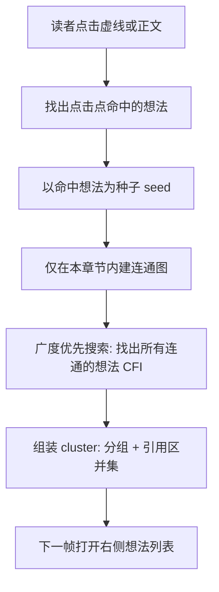

# EPUB 读书想法：点击聚合与「桥接」规则实现说明

> **文档角色**：专门解释「点击阅读页某段划线想法时，侧栏引用区与想法列表应展示哪些内容」——尤其是 **A 与 B 何时合并、何时分开**（俗称「桥接」）。  
> **读者**：产品、测试、非前端开发同学也可阅读；涉及少量浏览器术语（选区、段落）会用人话解释。  
> **规范对照**：[`apps/frontend/specs/epub-thought-nested-cluster-list.md`](../../apps/frontend/specs/epub-thought-nested-cluster-list.md) §5.7。  
> **延伸阅读**：[epub-thought-side-panel.md](./epub-thought-side-panel.md)（侧栏 UI）、[epub-annotation-sync-perf.md](./epub-annotation-sync-perf.md)（性能与点击不卡顿）、[epub-thought-partial-overlap.md](./epub-thought-partial-overlap.md)（部分重叠选区）。

若下文代码块与仓库最新源码不一致，**以源码为准**。

---

## 1. 背景：用户遇到的问题是什么？

在 EPUB 阅读页，你可以对正文划虚线并写「想法」。同一段正文里，可能出现：

- **多个互不重叠的短语**各自有一条想法（例如前半句 A、后半句 B）；
- **中间夹着标点**（如逗号「，」），标点可能单独标注，也可能没有标注；
- **换行或分段**后又有新的短语想法；
- **一次拖选跨越多行**（例如从换行前选到换行后）。

打开右侧「想法列表」时，需要决定：

1. **引用区**（列表顶部摘录）显示哪一段字？
2. **列表里**应列出几条想法分组？

本方案把「一次点击应展示的一组想法」称为 **cluster（簇）**。  
**桥接** = 判断两个（或多个）想法划线在逻辑上是否属于「同一次点击应一起展示」的连通组。

---

## 2. 最终产品规则（用例子说明）

下面五条是 **当前实现（连通图 v5）** 的精确行为。记忆口诀：

> **只有「碰在一起」或「你专门标过中间那段」才合并；空标点、空换行不算桥。**

| 编号 | 场景（通俗描述）                                      | 点击任一处时引用区                | 是否合并列表      |
| ---- | ----------------------------------------------------- | --------------------------------- | ----------------- |
| R1   | A、B 中间 **没有** 给逗号单独标想法                   | 只显示 A 或只显示 B               | 否                |
| R2   | A、**逗号**、B **都** 标了想法                        | 显示「A，B」                      | 是                |
| R3   | 换行前的 ABC 与换行后的 DEF **各自** 标注、**无交集** | 各显示各的                        | 否                |
| R4   | **一次选中** 跨换行的「C↵D」，且与前后片段有重叠      | 显示合并后的整段（如 AB**CD**EF） | 是（靠相交/搭接） |
| R5   | 大段套小段（嵌套划线）或两段文字在 DOM 上重叠         | 显示并集摘录                      | 是                |

**不会合并的典型反例**（回归时重点测）：

- 上一段末尾「针头……」与下一段开头「贾南风……」**无交集** → 点任一处不应出现另一段。
- 「有才」与「心里很不舒服」中间只有 **未标注** 的逗号 → 不合并（除非你还单独给逗号标了想法，则走 R2）。

---

## 3. 整体流程（从点击到侧栏）



**人话解释各步：**

1. **命中**：鼠标点在哪条划线上，先确定「点中了哪些想法」。
2. **种子**：以这些想法为起点，向外扩展。
3. **只在本章算**：不会把全书所有想法两两比对（否则卡顿），只在当前 EPUB 章节（spine）内计算。
4. **连通图**：预先算好「想法 A 与想法 B 算不算一伙」的连线；点击时沿连线扩散。
5. **引用区并集**：若合并了多组，摘录 = 各组在正文里覆盖范围的「最小外包矩形」对应的文字（不是简单拼接 quote 字段）。

点击计算放在 `requestAnimationFrame`（下一帧）里执行，避免手指抬起瞬间卡住滚动；详见 [epub-annotation-sync-perf.md](./epub-annotation-sync-perf.md)。

---

## 4. 核心概念（非开发也可略读）

| 术语              | 人话                                                           |
| ----------------- | -------------------------------------------------------------- |
| **想法**          | 你写的一条笔记，绑在正文某段划线上                             |
| **CFI**           | 电子书行业标准的「正文坐标」，用来记住划线在 EPUB 里的精确位置 |
| **Range（选区）** | 浏览器里表示「从第几个字到第几个字」的对象，由 CFI 还原得到    |
| **间隙 gap**      | 两个 Range 之间、尚未被任一侧包含的那一段 DOM 文本             |
| **连通**          | 两个想法算「一伙」，点击其一会带上另一个                       |
| **传递闭包**      | A 连 B、B 连 C → 点击 A 时 A、B、C 都在列表里                  |

---

## 5. 五种「算一伙」的判定（连通条件）

实现集中在 `apps/frontend/src/views/ebook/utils/epubThoughtCluster.ts`。  
两想法 **满足下列任意一条** 即连通（并可传递）：

### 5.1 相交或紧挨（`doRangesTouchOrOverlap`）

- 两段划线在正文 DOM 上有重叠，或结束点与开始点紧挨且 **中间没有多余字符**。
- 例：部分重叠的「里的稻」与「草……」；换行选区与前后片段在「C」处相交。

### 5.2 严格嵌套（`isNestedEitherWay`）

- 一段划线完全落在另一段 **内部**（大框套小框）。
- 例：整段 P 与句中短语。

### 5.3 间隙被已标注想法盖满（`isGapFullyCoveredByAnnotatedThoughts`）

- 专门解决 **R2（A + 标注过的逗号 + B）**。
- 算法：算出 A 与 B 之间的 gap 文本；若存在落在 gap **内部** 的其他想法选区，且这些选区并起来 **恰好等于** gap 的全部文字 → 连通。
- **未标注** 的逗号、空白、换行 **不会** 满足「盖满」（gap 有字但中间没有对应想法）。

### 5.4 跨行选区搭接两侧（`isBridgedBySpanningThought`）

- 专门解决 **R4**：存在第三个想法，它的选区 **同时碰到** A 与 B，且 **穿过** 二者之间的 gap（例如一次选中跨换行的 C↵D）。
- 人话：「有一座桥想法从 A 侧连到 B 侧」。

### 5.5 明确不连通的情况

- 仅隔着 **未标注** 的标点、空格、换行 → **不** 连通。
- 不同段落、无交集 → **不** 连通（反例「针头…」与「贾南风…」）。

---

## 6. 实现结构（模块分工）

| 模块           | 文件                               | 职责                               |
| -------------- | ---------------------------------- | ---------------------------------- |
| 连通判定与建图 | `epubThoughtCluster.ts`            | 桥接规则、章节连通图、cluster 组装 |
| 点击分发       | `epubUserHighlights.ts`            | 命中想法、延迟一帧聚类、回调侧栏   |
| 侧栏展示       | `read.tsx` + `EpubThoughtList.tsx` | 展示 `primaryQuote` 与分组列表     |
| 坐标还原       | `epubRangeGeometry.ts`             | CFI ↔ DOM Range，批处理缓存        |

---

## 7. 关键代码与逐行注释

以下代码块为 **讲解版**：在仓库源码之上增加了更细的中文注释；**每个代码块上方标注来源路径与行号区间**。

### 7.1 总判定：两想法是否连通

**来源**：`apps/frontend/src/views/ebook/utils/epubThoughtCluster.ts`（`areThoughtCfisConnected` 函数，约 L217–L254）

```typescript
// 判断「想法 left」与「想法 right」在点击聚合时算不算同一伙（连通）
function areThoughtCfisConnected(
	rend: Rendition, // EPUB 渲染引擎，用来解析嵌套关系
	leftCfi: string, // 左侧想法的正文坐标（CFI 字符串）
	rightCfi: string, // 右侧想法的正文坐标
	leftGroup: EbookThought[], // 左侧 CFI 下的所有想法记录（同位置可能多条笔记）
	rightGroup: EbookThought[], // 右侧 CFI 下的所有想法记录
	leftRange: Range, // 左侧想法在浏览器 DOM 中的选区
	rightRange: Range, // 右侧想法在浏览器 DOM 中的选区
	allRanges: Range[], // 本章所有想法的选区列表（用于检查间隙是否被标注）
	allCfis: string[], // 与 allRanges 一一对应的 CFI 列表
): boolean {
	// 同一个 CFI 当然算连通
	if (leftCfi === rightCfi) return true;

	// 不在同一 iframe 文档内（不可能相邻）→ 不连通
	if (
		leftRange.startContainer.ownerDocument !==
		rightRange.startContainer.ownerDocument
	) {
		return false;
	}

	// 条件 1：DOM 选区相交或紧挨（中间无未标注字符）
	if (doRangesTouchOrOverlap(leftRange, rightRange)) return true;

	// 条件 2：严格嵌套（大段包小段）
	if (isNestedEitherWay(rend, leftCfi, rightCfi, leftGroup, rightGroup)) {
		return true;
	}

	// 条件 3：A 与 B 之间严格没有重叠或接触，但它们之间的全部间隙（即 leftRange 结束点到 rightRange 起始点的所有内容），
	// 都已被其它“想法”区间（即 allRanges 中除 A/B 本身以外的区间）完全覆盖，且这些覆盖可能是多个想法拼接起来的结果—— 例如，A、B 分别标注在句首和句尾，而期间每个逗号、分号、标点等都分别被其他想法单独标注，最终 A-B 这段内容不存在任何未被标注的字符，这时视作它们连通。
	// 具体实现参考 isGapFullyCoveredByAnnotatedThoughts：先算出 A-B 间隙 gap，逐步把 gap 被哪些 allRanges 匹配到的区间切片抹去，
	// 若最终 gap 完全为空则判定为连通。实现可应对多标点、多片段跨行拼合的复杂场景。
	if (isGapFullyCoveredByAnnotatedThoughts(leftRange, rightRange, allRanges)) {
		return true;
	}

	// 条件 4：「A」与「B」虽不直接相连，但存在某个第三个想法的选区跨越了它们之间的间隙——即有一条想法（如用户一次全选多段文字，或横跨换行符/标点单元）
	// 的 DOM Range，同时与「A」和「B」均有重叠、接触或并列。此时，即使「A」「B」本身互不相连，
	// 也因这个“桥梁”想法成为同一伙。例如：
	// - 用户一次性划选了一段跨越「A」和「B」的内容生成新想法，该选区覆盖了两侧；
	// - 或某个想法的选区虽然未完全覆盖 A、B，但经过 gap 检查发现跨越间隙。
	// 这种情况下视为「A」和「B」可合并聚合，达到「桥接」的作用。
	return isBridgedBySpanningThought(
		leftRange,
		rightRange,
		leftCfi,
		rightCfi,
		allRanges,
		allCfis,
	);
}
```

### 7.2 算出两个选区之间的「间隙」

**来源**：`apps/frontend/src/views/ebook/utils/epubThoughtCluster.ts`（`buildGapRangeBetween`，约 L117–L140）

```typescript
// 在文档顺序上，取 earlier 结束点 到 later 开始点 之间的 DOM 片段（即「间隙」）
function buildGapRangeBetween(earlier: Range, later: Range): Range | null {
	try {
		// 取 earlier 所在的 HTML 文档对象
		const doc = earlier.startContainer.ownerDocument;

		// 两个选区必须属于同一文档，否则无法比较
		if (
			!doc ||
			earlier.startContainer.ownerDocument !==
				later.startContainer.ownerDocument
		) {
			return null;
		}

		// 保证 left 在文档顺序上不比 right 靠后
		const [left, right] =
			earlier.compareBoundaryPoints(Range.START_TO_START, later) <= 0
				? [earlier, later]
				: [later, earlier];

		// 若 left 的结束点在 right 的开始点之后，说明顺序错乱或已重叠 → 无间隙
		if (left.compareBoundaryPoints(Range.END_TO_START, right) > 0) {
			return null;
		}

		// 新建一个 Range，起点 = left 的末尾，终点 = right 的开头
		const gapRange = doc.createRange();
		gapRange.setStart(left.endContainer, left.endOffset);
		gapRange.setEnd(right.startContainer, right.startOffset);

		// 返回间隙选区（可能是空的，表示紧挨）
		return gapRange;
	} catch {
		// DOM 比较异常时保守返回「无法计算间隙」
		return null;
	}
}
```

### 7.3 规则 R2：间隙是否被「已标注想法」完全覆盖

**来源**：`apps/frontend/src/views/ebook/utils/epubThoughtCluster.ts`（`isGapFullyCoveredByAnnotatedThoughts`，约 L169–L193）

```typescript
// 判断 A 与 B 之间的间隙是否被「落在间隙内部的想法选区」完全盖住
// 典型：A + 单独标注的「，」 + B → gap 文本为「，」，中间想法并集也是「，」→ 返回 true
function isGapFullyCoveredByAnnotatedThoughts(
	earlier: Range, // 文档顺序上靠前的一方（如 A）
	later: Range, // 文档顺序上靠后的一方（如 B）
	allRanges: Range[], // 本章全部想法的 DOM 选区
): boolean {
	// 先算出 A 与 B 之间的间隙 Range
	const gapRange = buildGapRangeBetween(earlier, later);

	// 算不出间隙 → 不能靠「盖满」规则连通
	if (!gapRange) return false;

	// 间隙长度为 0：表示 A 与 B 在 DOM 上紧挨，视为可连通（交给其它规则亦可）
	if (gapRange.collapsed) return true;

	// 去掉空白后的间隙纯文本（如「，」或「\n」）
	const gapNorm = normalizeGapText(gapRange.toString());

	// 间隙去掉空白后长度为 0：说明只有空格/换行，且没有想法落在间隙里 → 不连通
	// （这是「未标注的逗号/换行不桥接」的关键分支）
	if (gapNorm.length === 0) return false;

	// 收集「严格落在 A 与 B 之间」的所有想法选区（不含 A、B 自身）
	const inGapRanges = allRanges.filter((range) =>
		isRangeStrictlyBetween(earlier, later, range),
	);

	// 间隙里有字，但没有任何想法落在间隙内 → 不连通（未标注标点）
	if (inGapRanges.length === 0) return false;

	// 把间隙内所有想法选区合并成一个外包 Range
	const union = mergeDomRangeUnion(inGapRanges);

	// 合并失败 → 不连通
	if (!union) return false;

	// 合并后的文字（去空白）必须与原间隙文字完全一致，才算「盖满」
	return normalizeGapText(union.toString()) === gapNorm;
}
```

### 7.4 规则 R4：跨行「搭桥」想法

**来源**：`apps/frontend/src/views/ebook/utils/epubThoughtCluster.ts`（`isBridgedBySpanningThought`，约 L195–L215）

```typescript
// 是否存在第三个想法 span，同时碰到 A 与 B，并穿过二者之间的间隙（跨行一次选中）
function isBridgedBySpanningThought(
	earlier: Range,
	later: Range,
	earlierCfi: string,
	laterCfi: string,
	allRanges: Range[],
	allCfis: string[],
): boolean {
	// 先计算 A 与 B 之间的间隙（可能含换行符）
	const gapRange = buildGapRangeBetween(earlier, later);

	// 遍历本章每一个其它想法
	for (let i = 0; i < allRanges.length; i++) {
		// 取出该想法的 CFI，用于跳过 A、B 自身
		const cfi = allCfis[i];

		// 跳过空 CFI 或 A/B 自己
		if (!cfi || cfi === earlierCfi || cfi === laterCfi) continue;

		// 第三个想法的 DOM 选区
		const span = allRanges[i]!;

		// 第三个想法必须与 A 有接触或重叠
		if (!doRangesTouchOrOverlap(earlier, span)) continue;

		// 第三个想法必须与 B 有接触或重叠
		if (!doRangesTouchOrOverlap(later, span)) continue;

		// 若 A、B 之间无间隙（紧挨），能通过搭接连通
		if (!gapRange || gapRange.collapsed) return true;

		// 第三个想法的选区必须与间隙有交集（穿过换行/标点间隙）
		if (rangeIntersectsGap(span, gapRange)) return true;
	}

	// 找不到这样的「搭桥」想法
	return false;
}
```

### 7.5 章节内建连通图（性能优化版）

**来源**：`apps/frontend/src/views/ebook/utils/epubThoughtCluster.ts`（`buildThoughtConnectivityAdjacency` 核心循环，约 L291–L358）

```typescript
// 为本章所有想法 CFI 建立邻接表：记录「谁与谁连通」
function buildThoughtConnectivityAdjacency(
	rend: Rendition,
	byCfi: Map<string, EbookThought[]>,
	sortedCfis: string[], // 已按正文出现顺序排好的 CFI 列表
	resolved: Map<string, Range>, // CFI → DOM Range 缓存
): Map<string, Set<string>> {
	// adj[cfi] = 与 cfi 连通的所有其它 cfi 集合
	const adj = new Map<string, Set<string>>();

	// 初始化每个 CFI 对应一个空集合
	for (const cfi of sortedCfis) {
		adj.set(cfi, new Set());
	}

	// 本章全部 Range，供间隙覆盖判定使用
	const allRanges = sortedCfis.map((cfi) => resolved.get(cfi)!);

	// 双重循环：在排序序列上比较想法对（稀疏优化，非全书暴力 O(n²)）
	for (let i = 0; i < sortedCfis.length; i++) {
		const cfiA = sortedCfis[i]!;
		const rangeA = resolved.get(cfiA)!;
		const groupA = byCfi.get(cfiA) ?? [];

		for (let j = i + 1; j < sortedCfis.length; j++) {
			const cfiB = sortedCfis[j]!;
			const rangeB = resolved.get(cfiB)!;
			const groupB = byCfi.get(cfiB) ?? [];

			// 是否在排序表上紧相邻（中间只隔其它想法或没有）
			const adjacent = j === i + 1;

			if (!adjacent) {
				try {
					// A 完全在 B 之前（中间有间隙）
					if (rangeA.compareBoundaryPoints(Range.END_TO_START, rangeB) < 0) {
						// 仅当间隙可被「已标注想法盖满」或「跨行搭桥」时，才继续往后看更远的 B
						const gapBridged =
							isGapFullyCoveredByAnnotatedThoughts(rangeA, rangeB, allRanges) ||
							isBridgedBySpanningThought(
								rangeA,
								rangeB,
								cfiA,
								cfiB,
								allRanges,
								sortedCfis,
							);

						// 否则后面更靠后的想法也不可能与 A 通过间隙连通，提前 break
						if (!gapBridged) break;
					} else if (!doRangesTouchOrOverlap(rangeA, rangeB)) {
						// 非相邻且不相交 → 跳过这一对
						continue;
					}
				} catch {
					continue;
				}
			}

			// 用 §5 的五条规则最终判定 A、B 是否连通
			if (
				!areThoughtCfisConnected(
					rend,
					cfiA,
					cfiB,
					groupA,
					groupB,
					rangeA,
					rangeB,
					allRanges,
					sortedCfis,
				)
			) {
				continue;
			}

			// 双向记录无向边
			adj.get(cfiA)!.add(cfiB);
			adj.get(cfiB)!.add(cfiA);
		}
	}

	return adj;
}
```

### 7.6 从点击种子扩展出完整簇

**来源**：`apps/frontend/src/views/ebook/utils/epubThoughtCluster.ts`（`collectConnectedClosureAroundCfis`，约 L399–L427）

```typescript
// 从用户点击命中的 seed CFI 出发，找出所有「连通」的想法 CFI（传递闭包）
function collectConnectedClosureAroundCfis(
	rend: Rendition,
	byCfi: Map<string, EbookThought[]>,
	seedCfis: string[], // 点击点直接命中的想法坐标
): Set<string> {
	const result = new Set<string>();

	// 种子先放入结果集
	for (const cfi of seedCfis) {
		const key = cfi.trim();
		if (key) result.add(key);
	}

	// 没有种子则无需扩展
	if (result.size === 0) return result;

	// 只在种子所在 EPUB 章节（spine）内取预计算好的连通图
	const spineHint = extractCfiSpineHint([...result][0]!);
	const adj = getChapterConnectivityAdjacency(rend, byCfi, spineHint);

	// 广度优先搜索：沿邻接边扩散
	const queue = [...result];
	while (queue.length > 0) {
		const cfi = queue.shift()!;

		// 查看与当前 CFI 连通的所有邻居
		for (const next of adj.get(cfi) ?? []) {
			if (result.has(next)) continue;
			result.add(next);
			queue.push(next);
		}
	}

	return result;
}
```

### 7.7 引用区：多组合并时的摘录文字

**来源**：`apps/frontend/src/views/ebook/utils/epubThoughtCluster.ts`（`resolveClusterPrimaryDisplay`，约 L552–L591）

```typescript
// 决定侧栏顶部「引用区」展示的 CFI 与 quote 文本
function resolveClusterPrimaryDisplay(
	rend: Rendition | undefined,
	quoteGroups: EbookThoughtQuoteGroup[], // 已连通的多组想法
	resolvedByCfi?: Map<string, Range | null>,
): { primaryCfiRange: string; primaryQuote: string } {
	const fallback = quoteGroups[0]!;

	// 只有一组：直接显示该组保存的 quote，无需并集
	if (!rend || quoteGroups.length <= 1) {
		return {
			primaryCfiRange: fallback.cfiRange,
			primaryQuote: fallback.quote,
		};
	}

	// 多组：把每组的 DOM Range 取出来
	const ranges = quoteGroups
		.map((group) => {
			const cached = resolvedByCfi?.get(group.cfiRange);
			if (cached !== undefined) return cached;
			return resolveCfiDomRange(rend, group.cfiRange);
		})
		.filter((range): range is Range => range !== null);

	// 全部解析失败则回退第一组
	if (ranges.length === 0) {
		return {
			primaryCfiRange: fallback.cfiRange,
			primaryQuote: fallback.quote,
		};
	}

	// 合并为一个外包 Range，toString() 即正文连续摘录（含间隙中未被想法覆盖的字，若 A-B 已连通）
	const union = mergeDomRangeUnion(ranges);
	const unionQuote = union?.toString().trim();

	if (!unionQuote) {
		return {
			primaryCfiRange: fallback.cfiRange,
			primaryQuote: fallback.quote,
		};
	}

	// primaryCfi 取 span 最长的一组坐标（避免昂贵的 union→CFI 反算）
	return {
		primaryCfiRange: pickPrimaryCfiFromQuoteGroups(quoteGroups),
		primaryQuote: unionQuote,
	};
}
```

### 7.8 点击入口：先扩展连通闭包，再打开列表

**来源**：`apps/frontend/src/views/ebook/utils/epubThoughtCluster.ts`（`buildThoughtClickClusterFromCandidates`，约 L647–L668）

```typescript
// 阅读页点击后：由「命中的想法」构建完整 cluster
export function buildThoughtClickClusterFromCandidates(
	rend: Rendition,
	allThoughts: EbookThought[], // 本书全部想法
	candidates: EbookThought[], // 点击点命中的想法
): EbookThoughtClickCluster | null {
	if (candidates.length === 0) return null;

	// 去重：同一位置可能命中多条想法记录
	const hitAtClickCfis = [
		...new Set(
			candidates.map((thought) => thought.cfiRange.trim()).filter(Boolean),
		),
	];

	const byCfi = groupThoughtsByCfi(allThoughts);

	// 在 CFI 解析批处理缓存作用域内完成聚类（性能）
	return withThoughtClusterSyncScope(() => {
		// 关键：把种子扩展为连通闭包内的全部 CFI
		const hitCfis = [
			...collectConnectedClosureAroundCfis(rend, byCfi, hitAtClickCfis),
		];

		// 用扩展后的 CFI 列表组装侧栏 cluster
		return buildThoughtClickCluster(rend, allThoughts, hitCfis);
	});
}
```

---

## 8. 性能设计（为何不再卡顿）

| 手段                  | 作用                                                     |
| --------------------- | -------------------------------------------------------- |
| **仅本章 spine 建图** | 不对全书想法两两比较                                     |
| **连通图缓存 v5**     | 同一章节想法未变时复用邻接表；换书或改规则版本号递增失效 |
| **稀疏建图**          | 排序后只比较相邻或可能重叠的对，减少 DOM 运算            |
| **CFI 批处理缓存**    | 一次点击内重复解析同一 CFI 只算一次                      |
| **下一帧聚类**        | `scheduleThoughtClusterClick` 让滚动先响应，再打开列表   |

详见 [epub-annotation-sync-perf.md](./epub-annotation-sync-perf.md)。

---

## 9. 测试清单（建议手工回归）

| #   | 操作                                  | 期望                         |
| --- | ------------------------------------- | ---------------------------- |
| 1   | 只标 A、只标 B，中间逗号未标          | 点 A 仅 A；点 B 仅 B         |
| 2   | 标 A、标「，」、标 B                  | 点任一处引用「A，B」         |
| 3   | 换行两侧各标 ABC / DEF，无交集        | 各显示各的                   |
| 4   | 一次跨行选中 CD，且与 ABC、DEF 有重叠 | 点相关处显示合并摘录         |
| 5   | 上一段与下一段各一条想法，无交集      | 互不出现                     |
| 6   | 嵌套大小段划线                        | 点内层/外层均展示整簇        |
| 7   | 快速连续点击、边点边滚动              | 列表仍能打开，滚动不明显卡住 |

---

## 10. 相关源码路径

| 说明               | 路径                                                            |
| ------------------ | --------------------------------------------------------------- |
| 桥接与聚类主逻辑   | `apps/frontend/src/views/ebook/utils/epubThoughtCluster.ts`     |
| 点击命中与延迟聚类 | `apps/frontend/src/views/ebook/utils/epubUserHighlights.ts`     |
| 侧栏打开           | `apps/frontend/src/views/ebook/read.tsx`                        |
| 列表 UI            | `apps/frontend/src/views/ebook/components/EpubThoughtList.tsx`  |
| CFI / Range 工具   | `apps/frontend/src/views/ebook/utils/epubRangeGeometry.ts`      |
| 嵌套判定复用       | `apps/frontend/src/views/ebook/utils/epubThoughtAnnotations.ts` |
| 行为 SPEC          | `apps/frontend/specs/epub-thought-nested-cluster-list.md`       |

---

## 11. 版本与变更记录

| 版本      | 说明                                                  |
| --------- | ----------------------------------------------------- |
| 连通图 v5 | 仅相交/嵌套/间隙盖满/跨行搭桥；未标注标点与换行不桥接 |
| 连通图 v4 | 曾仅相交/嵌套（导致标注逗号不合并）                   |
| 更早版本  | 曾用全书暴力闭包或标点无条件桥接，已废弃              |

算法版本常量：`CONNECTIVITY_GRAPH_VERSION = 'v5'`（见 `epubThoughtCluster.ts`）。
