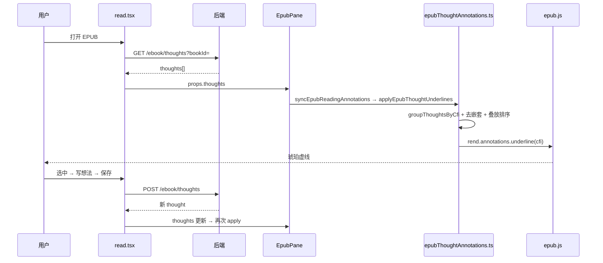

# EPUB 想法划线（虚线下划线）：完整实现说明（逐步拆解版）

## 文档角色

**主文档（想法虚线）**：从「选中文字 → 写想法 → 正文出现琥珀色虚线 → 点击打开列表」的全链路。语言面向**非开发者**；代码块内**每一行**附中文注释。

**姊妹文档**：[epub-user-highlight-impl.md](./epub-user-highlight-impl.md)（用户彩色划线）。

**延伸阅读**：[epub-reading-thoughts.md](./epub-reading-thoughts.md)（早期数据层说明）、[epub-thought-side-panel.md](./epub-thought-side-panel.md)（右侧分栏 UI）、[epub-thought-underlines-sync.md](./epub-thought-underlines-sync.md)（监听拆分与稳定性）、[epub-thought-partial-overlap.md](./epub-thought-partial-overlap.md)（部分相交选区 patch 去重）。

---

## 0. 用一句话理解「想法划线」

你在 EPUB 里**选中一段字**，点**写想法**，在右侧面板输入感想并保存；程序把这段字的 **CFI 地址**和**原文**存进数据库，并在正文下方画一条**细琥珀色虚线下划线**。以后**点击这条线**（不是拖选松手）会打开**想法列表**，再点某条进详情。同一段可以有多条想法，但**只画一条虚线**。

---

## 1. 与用户划线的对比（别混）

| | 想法虚线 | 用户划线 |
|--|----------|----------|
| **外观** | 琥珀色、细、虚线 | 粉/紫/蓝/绿/黄，实色高亮或实线下划线/波浪 |
| **数据表** | `ebook_thought` | `ebook_highlight` |
| **epub.js API** | `annotations.underline` | `annotations.highlight` |
| **主要目的** | 写读后感 | 标记重点 |
| **点击行为** | 打开想法列表 | 打开 PopBar 改样式/删除 |
| **拖选松手** | **不会**弹列表 | 弹出浮动工具条 |

两者可同时存在于同一段文字；程序会决定虚线是否被彩色块盖住、点击谁先响应。

---

## 2. 核心概念（复习）

- **CFI**：EPUB 定位地址，想法与划线共用。
- **同 CFI 多条想法**：数据库可以有多行 `cfi_range` 相同的记录；渲染时 **groupThoughtsByCfi** 合成一组，**只画一条 underline**，`data-thoughtIds` 存全部 id。
- **嵌套选区**：大段包小段时，**只画外层虚线**；内层只保留透明命中区，避免多条虚线叠在一起。
- **部分相交选区**：两次选区有交集但互不包含时，重叠水平段**只画一条虚线**（patch 层 blocker，详见 [epub-thought-partial-overlap.md](./epub-thought-partial-overlap.md)）；数据仍为两条 thought，点击各段列表不变。
- **marks-pane**：epub.js 在 iframe 上方插的 SVG 层，虚线 `<line>` 画在这里。

---

## 3. 完整流水线（从打开书到看见虚线）



---

## 4. 用户操作 → 程序步骤

### 4.1 写第一条想法

| 步 | 说明 |
|----|------|
| 1 | 用户拖选文字 → `selectionPopBar` / 右键「写想法」。 |
| 2 | `read.tsx` 打开右侧分栏 `thoughtPanel` 为 **compose** 模式，带入 `cfiRange` + `quote`。 |
| 3 | 用户输入 ≤500 字，Enter 或点保存 → `createEbookThought({ bookId, cfiRange, quote, content })`。 |
| 4 | 成功后 `setThoughts([...prev, item])`。 |
| 5 | `EpubPane` 的 effect 监听到 `thoughts` 变化 → `applyEpubThoughtUnderlines` 在该 CFI 注册 underline。 |
| 6 | `patchThoughtUnderlineMarks` 把 `<line>` 移到文字底边、设为琥珀虚线。 |

### 4.2 同段写第二条想法

| 步 | 说明 |
|----|------|
| 1 | 同一 `cfiRange` 再 POST 一条 thought（content 不同）。 |
| 2 | `groupThoughtsByCfi` 得到该 CFI 下 **2 条**记录。 |
| 3 | `buildThoughtUnderlineSignature` 变化 → remove 旧 underline → 重绘一条（thoughtIds 数组含 2 个 id）。 |
| 4 | 用户仍看见 **一条**虚线；点击后列表显示 2 条。 |

### 4.3 点击虚线（不是拖选）

| 步 | 说明 |
|----|------|
| 1 | `installEpubThoughtUnderlineListeners` 在拖选开始时把 SVG `pointer-events` 设为 `none`，**松手后恢复**。 |
| 2 | 因此**拖选结束不会误触**打开列表。 |
| 3 | 用户**再点一下**虚线 → `markClicked` / click guard → 读 `thoughtIds` → `onThoughtGroupClick(group)`。 |
| 4 | `read.tsx` 打开右侧 **list** 面板，按时间倒序。 |

### 4.4 嵌套重叠（大段包小段）

| 步 | 说明 |
|----|------|
| 1 | 两段想法 CFI/quote 存在严格包含关系。 |
| 2 | `computeLineVisibleCfis` 只把**外层** CFI 加入「画可见线」集合。 |
| 3 | 内层 CFI 的 underline 仍注册，但 `showLine=0` → 线透明，只保留点击命中。 |
| 4 | 点击内层区域时，仍通过坐标/thoughtIds 打开**内层**对应列表。 |

---

## 5. 数据模型

### 5.1 前端 `EbookThought`

**来源**：`apps/frontend/src/views/ebook/types.ts`（约 L71–L85）

```typescript
/** 一条读书想法 */
export type EbookThought = {
	id: string;              // UUID
	userId: number;          // 用户 id
	cfiRange: string;        // 定位选区
	quote: string;           // 选中原文
	content: string;         // 用户写的想法正文
	username: string;        // 展示名（服务端查询时填充，库表不存）
	avatar: string;          // 头像 URL（同上）
	createdAt: string;       // 创建时间
	updatedAt: string;       // 更新时间
};
```

### 5.2 数据库 `ebook_thought`

与 highlight 类似：`user_id` + `book_id` 索引；删书时级联删除。

---

## 6. 渲染核心：`applyEpubThoughtUnderlines`

**来源**：`apps/frontend/src/views/ebook/utils/epubThoughtAnnotations.ts`（约 L886–L940，摘录）

```typescript
export function applyEpubThoughtUnderlines( // 导出：仅同步 underline 批注，不注册 hooks
	rend: Rendition, // epub.js 渲染器
	thoughts: EbookThought[], // 当前书全部想法
	appliedRef: Map<string, string>, // cfi → 签名，增量更新用
	suppressedLineCfis: Set<string> = new Set(), // 被用户划线盖住、不应显示虚线的 CFI 集合
): void { // 无返回值
	try { // 样式注入
		ensureThoughtUnderlineStyles(); // 向各 document 注入 EPUB_THOUGHT_UNDERLINE_CSS
	} catch { // 失败则不画
		return; // 退出
	}

	const grouped = groupThoughtsByCfi(thoughts); // Map: cfi → 该段所有想法数组
	const nextCfis = new Set(grouped.keys()); // 本次应有的全部 cfi

	for (const cfiRange of [...appliedRef.keys()]) { // 清理：appliedRef 里有但 thoughts 已没有的 cfi
		if (!nextCfis.has(cfiRange)) { // 想法已删或 cfi 变了
			try {
				rend.annotations.remove(cfiRange, 'underline'); // epub.js 移除该 underline
			} catch {
				// ignore // 已销毁等情况忽略
			}
			appliedRef.delete(cfiRange); // 删缓存
		}
	}

	const sortedEntries = sortCfiGroupsForUnderlineStack([...grouped.entries()]); // 按选区长度排序：短的后画、在上层，优先响应点击
	const lineVisibleCfis = computeLineVisibleCfis(sortedEntries, rend); // 未被更大选区严格包含的 cfi 才画可见线

	for (const [cfiRange, group] of sortedEntries) { // 每个 cfi 一组
		const thoughtIds = group.map((t) => t.id); // 该段全部想法 id
		const showLine = // 是否画可见琥珀虚线
			lineVisibleCfis.has(cfiRange) && !suppressedLineCfis.has(cfiRange); // 可见 且 未被用户划线 suppress
		const nextSig = buildThoughtUnderlineSignature(thoughtIds, showLine); // 签名 = 是否显示线 + id 列表
		if (appliedRef.get(cfiRange) === nextSig) continue; // 无变化则跳过

		try { // 重绘该 cfi
			rend.annotations.remove(cfiRange, 'underline'); // 先删旧 mark
			rend.annotations.underline( // 再 add 新 mark
				cfiRange, // CFI
				{
					thoughtIds, // 自定义 data：点击时用
					[THOUGHT_MARK_DATA_SHOW_LINE]: showLine ? '1' : '0', // 是否显示线
				},
				undefined, // 点击 handler（统一走外层 listener，此处不传）
				EPUB_THOUGHT_UNDERLINE_CLASS, // class：moke-epub-thought-ul
				showLine // 第三个参数之后：styles
					? EPUB_THOUGHT_UNDERLINE_STYLES // 可见：琥珀虚线
					: EPUB_THOUGHT_UNDERLINE_HIT_STYLES, // 不可见：透明线，仅命中
			);
			appliedRef.set(cfiRange, nextSig); // 更新签名
		} catch {
			appliedRef.delete(cfiRange); // 失败则下次重试
		}
	}
}
```

---

## 7. 按 CFI 分组

**来源**：`apps/frontend/src/views/ebook/utils/epubThoughtAnnotations.ts`（`groupThoughtsByCfi`，约 L641–L653）

```typescript
function groupThoughtsByCfi( // 把扁平 thoughts 数组按 cfiRange 分组
	thoughts: EbookThought[], // 输入：API 返回的列表
): Map<string, EbookThought[]> { // 输出：Map，key 是 trim 后的 cfi
	const map = new Map<string, EbookThought[]>(); // 空 Map
	for (const thought of thoughts) { // 遍历每条想法
		const cfi = thought.cfiRange.trim(); // 去空格，避免 "cfi" 与 " cfi " 分成两组
		if (!cfi) continue; // 无 cfi 的脏数据跳过
		const list = map.get(cfi) ?? []; // 取已有分组或新建空数组
		list.push(thought); // 把当前 thought 放进该组
		map.set(cfi, list); // 写回 Map
	}
	return map; // 返回分组结果
}
```

---

## 8. 嵌套去重：只画一条可见虚线

**来源**：`apps/frontend/src/views/ebook/utils/epubThoughtAnnotations.ts`（`computeLineVisibleCfis` + `isCfiRangeStrictlyContained`，约 L795–L856，摘录）

```typescript
function isCfiRangeStrictlyContained( // 判断 inner 选区是否被 outer **严格**包住（不能完全重合）
	inner: string, // 内层 CFI 字符串
	outer: string, // 外层 CFI 字符串
	innerGroup: EbookThought[], // 内层想法组（取 quote 做文本回退）
	outerGroup: EbookThought[], // 外层想法组
	rend: Rendition, // 渲染器
): boolean { // true = inner 被 outer 严格包含
	if (inner === outer) return false; // 完全相同不算「严格包含」

	const innerRange = resolveCfiDomRange(rend, inner); // inner → DOM Range
	const outerRange = resolveCfiDomRange(rend, outer); // outer → DOM Range
	if (innerRange && outerRange) { // 两个都能解析
		return isDomRangeStrictlyContained(innerRange, outerRange); // 用 DOM API 比起点终点
	}

	const innerQuote = innerGroup[0]?.quote?.trim() ?? ''; // DOM 不可用时用 quote
	const outerQuote = outerGroup[0]?.quote?.trim() ?? '';
	if (!isQuoteStrictlyNested(innerQuote, outerQuote)) return false; // innerQuote 必须是 outerQuote 真子串
	return extractCfiSpineHint(inner) === extractCfiSpineHint(outer); // 还要同章（spine hint 相同）
}

function computeLineVisibleCfis( // 算出哪些 cfi 需要画 **可见** 虚线
	entries: [string, EbookThought[]][], // 已分组的 [cfi, group] 列表
	rend: Rendition, // 渲染器
): Set<string> { // 可见 cfi 集合
	const visible = new Set<string>(); // 结果集

	for (const [cfi, group] of entries) { // 每个 cfi 检查是否被别的 cfi 包住
		const contained = entries.some( // 是否存在 other 严格包含当前 cfi
			([otherCfi, otherGroup]) =>
				otherCfi !== cfi && // 不能自己包自己
				isCfiRangeStrictlyContained(cfi, otherCfi, group, otherGroup, rend), // 严格包含判定
		);
		if (!contained) visible.add(cfi); // 没被包住 → 画可见线
	}
	return visible; // 返回
}
```

---

## 9. 与用户划线的叠加

当用户在某段加了**彩色背景高亮**且完全盖住想法选区时：

1. `syncEpubReadingAnnotations` 调用 `getThoughtCfisSuppressedByHighlights`。
2. 用 `getClientRects` 比较想法 Range 与用户划线 Range 的屏幕矩形。
3. 若想法每一行矩形都落在划线矩形内 → 该想法 CFI 加入 `suppressed`。
4. `applyEpubThoughtUnderlines(..., suppressed)` → `showLine=false`，虚线隐藏，但 mark 仍在（点击逻辑另述）。

详见 [epub-user-highlight-impl.md](./epub-user-highlight-impl.md) §8。

---

## 10. 监听拆分（为何不会白屏）

**问题（历史）**：每次 `thoughts` 变化都 `register` epub.js hooks → 监听累积 → 偶发崩溃。

**现状（双 effect）**：

| Effect 依赖 | 做什么 |
|-------------|--------|
| `[rendReady]` | `installEpubThoughtUnderlineListeners` **只装一次**（选区防误触、mark 点击） |
| `[thoughts, highlights, rendReady]` | `syncEpubReadingAnnotations` **只改批注** |

**来源**：`apps/frontend/src/views/ebook/components/EpubPane.tsx`（约 L244–L287）

```typescript
useEffect(() => { // 监听：只依赖 rendReady
	const rend = rendRef.current; // Rendition
	if (!rend || !rendReady) return; // 未就绪
	return installEpubThoughtUnderlineListeners(rend, { // 安装想法专用监听
		getThoughts: () => thoughtsRef.current ?? [], // ref 保证读到最新 thoughts
		onThoughtClick: (thought) => onThoughtClickRef.current?.(thought), // 单条点击（少用）
		onThoughtGroupClick: (group) => onThoughtGroupClickRef.current?.(group), // 分组点击 → 开列表
	});
}, [rendReady]); // ⚠️ 不含 thoughts，避免重复 register

useEffect(() => { // 批注：thoughts 或 highlights 变就 sync
	const rend = rendRef.current;
	if (!rend || !rendReady) return;
	syncEpubReadingAnnotations( // 统一入口（内含 applyEpubThoughtUnderlines）
		rend,
		thoughts ?? [],
		highlights ?? [],
		appliedThoughtsRef.current,
		appliedHighlightsRef.current,
	);
}, [thoughts, highlights, rendReady]); // thoughts 变化只走这里
```

---

## 11. 选区防误触（拖选不弹列表）

**来源**：`apps/frontend/src/views/ebook/utils/epubThoughtAnnotations.ts`（`attachThoughtMarkClickGuard` 思路，约 L560–L630，摘录）

```typescript
// 在 iframe 内 mousedown / touchstart：若用户在选字，把想法 mark 的 pointer-events 设为 none
const onSelectionPointerDown = () => { // 按下鼠标/触摸
	if (hasTextSelectionInRend(rend)) return; // 已有选区则不必重复
	setThoughtMarkPointerEvents('none'); // 虚线 SVG 暂时不响应点击，让选区操作优先
};

// pointerup / touchend（在 document 捕获阶段）：选区结束，恢复 pointer-events
const onSelectionPointerUp = () => {
	setThoughtMarkPointerEvents('auto'); // 恢复虚线可点击
};

// rend.hooks.content.register(bindContents)：每个新 iframe 加载时都绑上述事件
// cleanup：deregister + removeEventListener，防止泄漏
```

**用户感知**：拖选文字松手 → **不会**打开想法列表；必须**再点**虚线。

---

## 12. 样式 patch：虚线画在字下方

**来源**：`apps/frontend/src/views/ebook/utils/epubThoughtAnnotations.ts`（`patchThoughtUnderlineMarks` 核心，概念摘录）

epub.js 默认 underline 的 `<line>` 位置/颜色不适合深色主题。patch 步骤：

1. 找到 `g.moke-epub-thought-ul`。
2. 读每个 `<rect>` 的 `x/y/width/height`。
3. 设置 `<line x1 y1 x2 y2>` 为 `y + height + THOUGHT_LINE_OFFSET_PX`（底边下 1px）。
4. 应用 `stroke: #d97706`、`stroke-dasharray: 1 6`。
5. 若 `data-show-line="0"`，线透明。

`schedulePatchThoughtUnderlineMarks` 用双 `requestAnimationFrame` 在 render 后执行；`patchEpubReadingAnnotations` 同时 patch 想法线 + 用户划线。

---

## 13. 右侧分栏 UI（read.tsx 侧）

逻辑分散在 `read.tsx` + `EpubThoughtParts.tsx` + `EpubThoughtPanelShell.tsx`：

| 模式 | 含义 |
|------|------|
| `list` | 某 CFI 下全部想法，顶栏「共 N 条」 |
| `detail` | 单条详情，可编辑/删除 |
| `compose` | 写新想法或编辑草稿 |

**侧栏引用区按钮**（`EpubQuoteActionBar`）：

- **划线** → `openHighlightPopBarAtBookContent(..., { ensureHighlight: true })`（见用户划线文档 §4.3）
- **删除划线** → `removeHighlightsForQuote`（删所有与用户划线重叠的记录）
- 点引用文字本身 → 只开 PopBar，不自动创建划线

---

## 14. 保存想法（read.tsx 摘录）

**来源**：`apps/frontend/src/views/ebook/read.tsx`（保存流程概念代码，与仓库逻辑对齐）

```typescript
// 用户点保存后（伪代码串联真实调用链）
const onSaveThought = async () => { // 保存按钮 / Enter
	const draft = thoughtDraftRef.current; // 当前草稿：cfiRange, quote, content
	if (!draft?.cfiRange || !bookId) return; // 校验
	const item = draft.id // 有 id 是编辑，无 id 是新建
		? await updateEbookThought(draft.id, { content: draft.content }) // PATCH
		: await createEbookThought({ // POST
				bookId, // 书 id
				cfiRange: draft.cfiRange, // 定位
				quote: draft.quote, // 摘录
				content: draft.content.trim(), // 正文
			});
	setThoughts((prev) => [ // 更新 React 状态
		...prev.filter((t) => t.id !== item.id), // 去掉旧版（编辑时）
		item, // 加入新对象
	]);
	closeThoughtPanelOrGoList(); // UI：关 compose / 回列表
	// EpubPane useEffect 自动 applyEpubThoughtUnderlines → 出现虚线
};
```

---

## 15. 建议回归测试

1. 选中 → 写想法 → 保存 → 琥珀虚线出现。
2. 同段第二条想法 → 仍一条线 → 点击列表 2 条。
3. 大段包小段 → 只一条可见虚线 → 点内层仍能开对内列表。
4. 拖选松手 → **不**开列表；点击虚线 → 开列表。
5. 同段加用户划线 → 虚线在被完全盖住处隐藏；删用户划线后虚线恢复。
6. 切章、换书、HMR → 无白屏、线仍在。
7. 删书 → 想法与虚线均消失。

---

## 16. 相关源码路径

| 说明 | 路径 |
|------|------|
| 类型 | `apps/frontend/src/views/ebook/types.ts` |
| 下划线工具 | `apps/frontend/src/views/ebook/utils/epubThoughtAnnotations.ts` |
| 与用户划线协同 | `apps/frontend/src/views/ebook/utils/epubUserHighlights.ts`（`syncEpubReadingAnnotations`） |
| 阅读页 | `apps/frontend/src/views/ebook/read.tsx` |
| Epub 容器 | `apps/frontend/src/views/ebook/components/EpubPane.tsx` |
| 分栏 UI | `apps/frontend/src/views/ebook/components/EpubThoughtParts.tsx` |
| 实体 | `apps/backend/src/services/ebook/ebook-thought.entity.ts` |
| API | `apps/backend/src/services/ebook/ebook.service.ts` |

**若与仓库最新源码不一致，以源码为准。**
