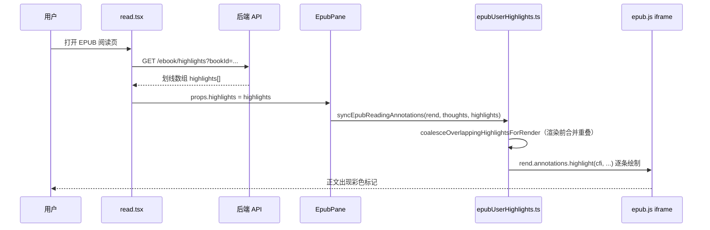

# EPUB 用户划线：完整实现说明（逐步拆解版）

## 文档角色

**主文档（用户划线）**：从「选中文字 → 保存到服务器 → 正文出现彩色高亮/下划线/波浪线」的全链路实现。用**非开发者也能懂**的语言讲清每一步；关键代码块内**每一行**附中文注释。

**姊妹文档**：[epub-thought-underline-impl.md](./epub-thought-underline-impl.md)（想法虚线下划线）。

**延伸阅读**：[epub-selection-popbar-visual.md](./epub-selection-popbar-visual.md)（选区浮动条 UI）、[epub-thought-underline-impl.md](./epub-thought-underline-impl.md)（想法与划线的叠加关系）、[epub-highlight-dom-match.md](./epub-highlight-dom-match.md)（按位置命中，避免 quote 同名误配）、[epub-popbar-perf-ux.md](./epub-popbar-perf-ux.md)（PopBar 性能与防闪烁）。

---

## 0. 用一句话理解「用户划线」

你在 EPUB 正文里**拖选一段字**，点浮动条上的**划线**，选颜色和样式（背景色 / 直线下划线 / 波浪线），程序会把这段字的**位置坐标（CFI）**和**原文摘录**存进数据库；下次打开书，阅读器在同样位置**画一层 SVG 彩色标记**。再次点这条线，可以改样式或删除。

**与「想法」的区别**：想法是**琥珀色虚线** + 右侧写感想；用户划线是**实色标记**，主要用来**标记重点**，两者可以叠在同一段文字上，程序会协调谁在上、谁在下、虚线要不要藏起来。

---

## 1. 先搞懂 5 个词（不懂也能继续读，但看了更顺）

| 词 | 通俗解释 |
|----|----------|
| **CFI** | EPUB 里的「GPS 地址」。一串像 `epubcfi(/6/4!/4/2/1:0)` 的文本，精确指向「第几章、第几个段落、第几个字」。划线、想法都靠它定位。 |
| **epub.js** | 浏览器里把 EPUB 渲染成 HTML 的库。正文在 **iframe** 里，划线画在 iframe 上方的 **SVG 批注层（marks-pane）**。 |
| **Rendition** | epub.js 的「当前这一页渲染器」对象。翻页、跳转、画批注都通过它。 |
| **批注（annotation）** | epub.js 提供的 API：`highlight`（用户划线）、`underline`（想法虚线）。底层都是在 SVG 里加 `<g>` 组。 |
| **PopBar** | 选中文字后，选区上方浮动的半透明工具条（复制 / 划线 / 写想法 / …）。 |

---

## 2. 系统里有哪些文件在干活？

```
用户眼睛看到的
  └─ read.tsx（阅读页总控：加载划线、保存、删、打开 PopBar）
       ├─ EpubPane.tsx（嵌 epub.js，把 thoughts + highlights 同步到正文）
       ├─ EpubSelectionPopBar.tsx + EpubHighlightStyleBar.tsx（浮动条 + 颜色/样式）
       └─ EpubQuoteActionBar.tsx（侧栏「划线 / 删除划线」按钮）

正文上的彩色线
  └─ epubUserHighlights.ts（核心：画线、合并重叠、点击命中、与想法协调）

服务器
  └─ ebook_highlight 表 + /ebook/highlights API
```

---

## 3. 从打开书到看见划线（完整流水线）



**逐步说明：**

1. **进入阅读页** `read.tsx` 根据 URL 里的 `bookId` 请求划线列表。
2. **React 状态** `highlights` 更新后，传给 `EpubPane`。
3. **EpubPane** 在 `rendReady`（epub.js 渲染就绪）后调用 `syncEpubReadingAnnotations`。
4. **sync 函数** 先画用户划线，再画想法虚线（想法文档另述），最后 patch SVG 样式。
5. **用户选中文字** → 浮动条出现 → 点「划线」→ `upsertHighlightForQuote` 写库 → 再次 sync → 立刻看见新线。

---

## 4. 用户每个操作 → 程序具体做什么

### 4.1 第一次划线（选中 → 保存）

| 步骤 | 发生了什么 |
|------|------------|
| ① 拖选文字 | epub.js 在 iframe 里产生 DOM `Selection`；`epubSelectionToolbarAttach` 算出 `cfiRange` 和 `selectedText`。 |
| ② 浮动条弹出 | `read.tsx` 的 `selectionPopBar` 状态为 `open: true`，展示 `EpubHighlightStyleBar`（粉/紫/蓝/绿/黄 + 高亮/下划线/波浪）。 |
| ③ 点「划线」或改颜色 | 调用 `upsertSelectionHighlight(style, color)` → `upsertHighlightForQuote`。 |
| ④ 合并检测 | 若新选区与已有划线**相交或首尾相接**（如「…杨广**死**」+「**死**于…」），`resolveMergedOverlappingHighlight` 算出**并集 CFI** 和要删的旧 id。 |
| ⑤ 写库 | 无重叠：`createEbookHighlight` 或 `updateEbookHighlight`；有重叠：先 `delete` 旧记录，再 `create` **一条**合并后的记录（样式取**最新一次**）。 |
| ⑥ 刷新 UI | `setHighlights(next)` + `epubNavRef.syncReadingAnnotations(next)` 重画 SVG。 |

### 4.2 点击已有划线

| 步骤 | 发生了什么 |
|------|------------|
| ① 点击正文 | `installEpubReadingMarkClickListeners` 在 iframe 监听 click；根据坐标命中 SVG 或 DOM。 |
| ② 识别为用户划线 | 查 `highlightMetaByCfi` 或 DOM `data-epubcfi`。 |
| ③ 打开 PopBar | `onUserHighlightPopBar` → 设置当前 style/color，PopBar 锚定在选区上方。 |
| ④ 改样式 | `onHighlightStyleChange` / `onHighlightColorChange` 调 `updateEbookHighlight`，再 sync。 |
| ⑤ 删划线 | PopBar 或侧栏「删除划线」→ `removeHighlightsForQuote` 删所有**重叠/覆盖**该段的记录。 |

### 4.3 侧栏想法列表里点「划线」

| 步骤 | 发生了什么 |
|------|------------|
| ① 点「划线」按钮 | `openHighlightPopBarAtBookContent(cfi, quote, { ensureHighlight: true })`。 |
| ② 若当前页没有该 CFI | `rend.display(cfiRange)` 跳转到对应章节，等两帧 rAF 让 DOM 就绪。 |
| ③ 自动创建 | `upsertHighlightForQuote` 用当前默认 style/color 创建划线（若尚无）。 |
| ④ 弹出 PopBar | 方便立刻改颜色/样式。 |

**点引用文字（不点划线按钮）**：只打开 PopBar，`ensureHighlight: false`，**不会**自动创建划线。

---

## 5. 数据长什么样？

### 5.1 前端类型

**来源**：`apps/frontend/src/views/ebook/types.ts`（约 L87–L107）

```typescript
/** EPUB 用户划线样式：背景高亮 / 直线下划线 / 波浪下划线 三选一 */
export type EpubHighlightStyle = 'highlight' | 'underline' | 'wavy';

/** 五种预设颜色 id，对应 EPUB_HIGHLIGHT_COLOR_OPTIONS 里的 fill/stroke */
export type EpubHighlightColorId =
	| 'pink'   // 粉色
	| 'purple' // 紫色
	| 'blue'   // 蓝色
	| 'green'  // 绿色
	| 'yellow'; // 黄色

/** 一条用户划线在内存/接口中的完整形状 */
export type EbookUserHighlight = {
	id: string;              // 数据库 UUID，删改都靠它
	userId: number;          // 所属用户
	cfiRange: string;        // EPUB CFI 选区字符串，定位用
	quote: string;           // 用户选中时的原文摘录（人类可读、合并/重叠判定备用）
	style: EpubHighlightStyle; // 样式枚举
	color: EpubHighlightColorId; // 颜色枚举
	createdAt: string;       // 创建时间 ISO 字符串
	updatedAt: string;       // 最后修改时间（合并时取最新样式用）
};
```

### 5.2 数据库表

**来源**：`apps/backend/src/services/ebook/ebook-highlight.entity.ts`

| 列 | 含义 |
|----|------|
| `id` | UUID 主键 |
| `user_id` + `book_id` | 联合索引，按用户+书查列表 |
| `cfi_range` | 定位 |
| `quote` | 摘录 |
| `style` / `color` | 样式与颜色 |
| `created_at` / `updated_at` | 时间戳 |

删书时 `ebook.service.ts` 会 **同时删除** 该书下所有 `ebook_thought` 与 `ebook_highlight`。

---

## 6. 渲染：彩色线是怎么画出来的？

### 6.1 总入口 `applyEpubUserHighlights`

**来源**：`apps/frontend/src/views/ebook/utils/epubUserHighlights.ts`（约 L823–L880，摘录）

```typescript
export function applyEpubUserHighlights( // 导出：把 highlights 数组应用到 epub.js 渲染层
	rend: Rendition, // 当前书的 Rendition 实例
	highlights: EbookUserHighlight[], // 从服务器来的全部划线（可能含重叠，下面会先合并）
	appliedRef: Map<string, string>, // 缓存：cfi → 签名，避免重复 highlight 同一 CFI
): void { // 无返回值
	try { // try：样式注入失败时不让整个阅读页崩溃
		ensureUserHighlightStyles(); // 向 document / iframe 注入 CSS，修正 SVG rect/line 默认样式
	} catch { // catch：任何异常
		return; // 直接退出，不画线
	}

	const coalesced = coalesceOverlappingHighlightsForRender(rend, highlights); // 渲染前：把相交/相接的多条合成一条（样式取 updatedAt 最新）
	const visibleCfis = computeVisibleHighlightCfis(coalesced, rend); // 算哪些 CFI 在当前可见 iframe 里（跨章未加载的不画）
	const sortedHighlights = sortHighlightsForStack(coalesced); // 按选区长度排序：短的在上层，方便点击短选区

	for (const item of highlights) { // 遍历「原始」列表里每一条（含即将被合并掉的旧 CFI）
		const cfi = item.cfiRange.trim(); // 去掉首尾空格
		if (cfi) removeUserHighlightAnnotation(rend, cfi, appliedRef); // 先清掉旧 annotation，防止合并后两层 SVG 叠色
	}

	highlightMetaByCfi = new Map( // 模块级 Map：供 patch 与点击时查 style/color
		sortedHighlights // 只保留当前可见的
			.filter((item) => visibleCfis.has(item.cfiRange)) // 过滤不可见章节的 CFI
			.map((item) => [item.cfiRange, item]), // 键值对 [cfi, 完整 highlight 对象]
	);

	purgeStaleUserHighlightAnnotations( // 删除 appliedRef 里已不存在于 keep 集合的 CFI
		rend, // 渲染器
		highlights, // 原始列表（用于找要删的 cfi）
		new Set( // keepCfis：合并后应保留的 CFI 集合
			sortedHighlights
				.filter((item) => visibleCfis.has(item.cfiRange)) // 仍只要可见的
				.map((item) => item.cfiRange), // 提取 cfi 字符串
		),
		appliedRef, // 传入缓存 Map，同步删除项
	);

	for (const item of sortedHighlights) { // 遍历合并+排序后的最终列表
		if (!visibleCfis.has(item.cfiRange)) continue; // 不可见则跳过

		const nextSig = buildHighlightApplySignature(item); // 签名 = style + color + cfi，用于增量更新
		if (appliedRef.get(item.cfiRange) === nextSig) continue; // 签名没变说明已画过，跳过

		removeUserHighlightAnnotation(rend, item.cfiRange, appliedRef); // 保险：同 CFI 先 remove 再 add

		try { // 调用 epub.js 画 highlight 批注
			rend.annotations.highlight( // epub.js API：在 marks-pane 加 SVG 高亮组
				item.cfiRange, // 第一个参数：CFI 选区
				buildHighlightData(item), // 第二个：data 属性（style/color 存 dataset）
				buildUserHighlightClickHandler(item), // 第三个：mark 点击回调（实际点击走统一 listener）
				buildHighlightClassName(item), // 第四个：CSS class，固定 moke-epub-user-hl
				buildHighlightStyles(item), // 第五个：内联样式初值（后续 patch 会改 rect/line/path）
			);
			appliedRef.set(item.cfiRange, nextSig); // 记录已应用签名
		} catch { // CFI 无法解析时 epub.js 可能抛错
			appliedRef.delete(item.cfiRange); // 清缓存，下次 thoughts/highlights 变化会重试
		}
	}
}
```

### 6.2 三种样式如何 patch 到 SVG

**来源**：`apps/frontend/src/views/ebook/utils/epubUserHighlights.ts`（`patchUserHighlightMarks` 核心分支，约 L148–L230，摘录）

```typescript
function patchUserHighlightMarks( // 遍历 marks-pane 里所有用户划线 SVG 组，按 style 改 rect/line/path
	root: ParentNode = document, // 默认主 document；也会对每个 iframe document 调用
	metaByCfi: Map<string, EbookUserHighlight> = highlightMetaByCfi, // CFI → 元数据
): void { // 无返回值
	const groups = root.querySelectorAll(USER_HIGHLIGHT_SELECTOR); // 选中 class 含 moke-epub-user-hl 的 <g>

	groups.forEach((g) => { // 每个 <g> 对应一段划线
		const { style, color: colorId } = resolveHighlightMetaFromGroup(g, metaByCfi); // 从 Map 或 data 属性读 style/color
		const palette = COLOR_BY_ID[colorId] ?? COLOR_BY_ID.pink; // 查颜色表，默认粉
		(g as SVGElement).style.pointerEvents = 'none'; // 用户划线 SVG 不抢点击（点击走正文坐标换算）

		const rects = g.querySelectorAll('rect'); // epub.js 生成的背景矩形（每行文字一块 rect）
		const lines = g.querySelectorAll('line'); // 直线下划线用 line 元素

		if (style === 'highlight') { // 模式一：半透明背景色块
			g.querySelectorAll(`path.${WAVY_PATH_CLASS}`).forEach((node) => { // 若之前是波浪线，删掉 path
				node.remove(); // 从 DOM 移除波浪 path
			});
			rects.forEach((rect) => { // 每个 rect 填色
				rect.setAttribute('fill', palette.fill); // 例如 rgba(255,107,129,0.28)
				rect.setAttribute('fill-opacity', '1'); // 不透明度 1（透明度已在 fill 字符串里）
				rect.setAttribute('stroke', 'transparent'); // 不要边框
				rect.setAttribute('stroke-width', '0'); // 边框宽度 0
			});
			lines.forEach((line) => { // 隐藏直线（highlight 模式不用 line）
				line.setAttribute('stroke', 'transparent'); // 透明描边
				line.setAttribute('stroke-opacity', '0'); // 完全不可见
			});
			return; // 处理完本组，下一个 <g>
		}

		if (style === 'underline') { // 模式二：直线下划线
			g.querySelectorAll(`path.${WAVY_PATH_CLASS}`).forEach((node) => { // 清掉波浪 path
				node.remove(); // 删除
			});
		}

		rects.forEach((rect) => { // underline / wavy 共用：rect 几乎透明，只保留点击命中区
			rect.setAttribute('stroke', 'transparent'); // 无边框
			rect.setAttribute('stroke-width', '0'); // 边框 0
			rect.setAttribute('fill', 'currentColor'); // 极小透明填充
			rect.setAttribute('fill-opacity', '0.001'); // 肉眼看不见，但 SVG 命中区域还在
		});

		const wavyPaths = g.querySelectorAll(`path.${WAVY_PATH_CLASS}`); // 已有波浪 path 列表

		rects.forEach((rect, index) => { // 每个 rect 对应一行文字的线
			const x = Number.parseFloat(rect.getAttribute('x') ?? '0'); // rect 左上角 x
			const y = Number.parseFloat(rect.getAttribute('y') ?? '0'); // rect 左上角 y
			const width = Number.parseFloat(rect.getAttribute('width') ?? '0'); // rect 宽度 = 该行选区宽
			const height = Number.parseFloat(rect.getAttribute('height') ?? '0'); // rect 高度 = 行高
			const lineY = y + height + UNDERLINE_OFFSET_PX; // 线画在文字底边下方 2px

			if (style === 'wavy') { // 模式三：波浪下划线
				let line = lines[index] as SVGLineElement | undefined; // 对应 index 的 line
				if (line) { // 若 epub.js 生成了 line
					line.setAttribute('stroke', 'transparent'); // 隐藏直线
					line.setAttribute('stroke-opacity', '0'); // 完全透明
				}

				let path = wavyPaths[index] as SVGPathElement | undefined; // 找已有波浪 path
				if (!path) { // 没有则创建
					path = document.createElementNS( // SVG 元素必须用 createElementNS
						'http://www.w3.org/2000/svg', // SVG 命名空间
						'path', // 标签名 path
					);
					path.classList.add(WAVY_PATH_CLASS); // class 便于 CSS 与下次查找
					g.appendChild(path); // 挂到 <g> 下
				}
				path.setAttribute('d', buildWavyUnderlinePath(x, lineY, width)); // d=路径：沿 baseline 正弦波
				path.setAttribute('stroke', palette.stroke); // 波浪线颜色（实色，非 fill）
				path.setAttribute('stroke-opacity', '0.95'); // 略透明
				path.setAttribute('stroke-width', '1.5'); // 线宽
				path.setAttribute('fill', 'none'); // 路径不填充
				return; // 本 rect 处理完
			}

			let line = lines[index] as SVGLineElement | undefined; // underline 模式：用 line
			// ... 后续设置 line x1/y1/x2/y2 与 stroke 颜色（略）
		});
	});
}
```

---

## 7. 重叠合并：为什么「死」字不会叠两条线？

### 7.1 问题场景

- 第一次划：`隋炀帝杨广死`（紫色）
- 第二次划：`死于一个阳光明媚的春天`（粉色）
- 共享字符「死」：DOM 上可能是**端点相接**而非严格相交。

旧逻辑用 `>` / `<` 判定相交，**相接不算重叠** → 存两条 → 渲染两层 SVG → 「死」字颜色加深。

### 7.2 写入时合并 `resolveMergedOverlappingHighlight`

**算法（白话）：**

1. 把**新选区** CFI 解析成 DOM `Range`（`seedRange`）。
2. 循环：在已有划线里找与当前 `ranges[]` **任一段**满足下列之一的：
   - DOM **相交或端点相接**（`isDomRangeTouchingOrOverlapping`）
   - DOM **严格包含**关系
   - 同章且 **quote 首尾衔接**（如 A 以「死」结尾、B 以「死」开头）
3. 找到的 id 加入 `mergedIds`，其 Range 加入 `ranges`。
4. 对所有 Range 做**并集** → 新 CFI + 新 quote。
5. 返回 `removeHighlightIds`；`read.tsx` **删掉这些旧记录**，**create 一条**新记录（style/color 用用户刚选的）。

**来源**：`apps/frontend/src/views/ebook/utils/epubUserHighlights.ts`（`resolveMergedOverlappingHighlight` 主循环，约 L1061–L1120，摘录）

```typescript
export function resolveMergedOverlappingHighlight( // 导出：计算新划线与旧划线合并后的目标
	rend: Rendition, // 渲染器，用来 CFI ↔ Range
	cfiRange: string, // 用户本次选区的 CFI
	quote: string, // 用户本次选区的原文
	highlights: EbookUserHighlight[], // 该书已有全部划线
): MergedOverlappingHighlightTarget { // 返回：新 cfi、新 quote、要删的旧 id 列表
	const trimmedCfi = cfiRange.trim(); // 规范化 CFI
	const trimmedQuote = quote.trim(); // 规范化摘录
	const seedRange = resolveCfiDomRange(rend, trimmedCfi); // 新选区 → DOM Range

	if (!seedRange) { // 解析失败（章节未加载等）
		return { // 无法合并，原样返回
			cfiRange: trimmedCfi, // CFI 不变
			quote: trimmedQuote, // quote 不变
			removeHighlightIds: [], // 不删任何旧记录
		};
	}

	const mergedIds = new Set<string>(); // 待删除的旧划线 id
	const ranges: Range[] = [seedRange.cloneRange()]; // 并集计算用的 Range 列表，先放新选区
	let changed = true; // 传递闭包：新并入的 Range 可能再与其它旧线相接

	while (changed) { // 直到一轮扫描没有新并入
		changed = false; // 本轮先假设无变化
		for (const item of highlights) { // 扫描每条已有划线
			if (!item.id || mergedIds.has(item.id)) continue; // 无 id 或已标记删除则跳过

			const quoteMerge = doHighlightQuotesTouchOrOverlap( // 文本层面：同章 + 重叠/首尾衔接
				{ cfiRange: trimmedCfi, quote: trimmedQuote }, // 新选区
				item, // 旧划线
			);
			const itemRange = resolveCfiDomRange(rend, item.cfiRange.trim()); // 旧划线 → Range

			if (itemRange) { // DOM 可解析
				const sameDoc = // 必须在同一 iframe document
					itemRange.startContainer.ownerDocument ===
					seedRange.startContainer.ownerDocument;
				const domMerge = // DOM 层面：相交/相接/包含
					sameDoc &&
					ranges.some((range) => doDomRangesOverlapForMerge(range, itemRange));
				if (!domMerge && !quoteMerge) continue; // 两种都不满足 → 不合并

				mergedIds.add(item.id); // 标记删除旧记录
				ranges.push(itemRange); // 纳入并集
				changed = true; // 可能有链式合并，继续 while
				continue; // 下一条 item
			}

			if (!quoteMerge) continue; // 无 Range 时只能靠 quote 判定
			mergedIds.add(item.id); // 仅 quote 衔接也并入删除列表
			changed = true; // 继续循环
		}
	}

	if (mergedIds.size === 0) { // 没有任何旧线需要合并
		return { cfiRange: trimmedCfi, quote: trimmedQuote, removeHighlightIds: [] };
	}

	const union = mergeDomRangeUnion(ranges); // 所有 Range 的最小外包 Range
	if (!union) { // 并集失败
		return { cfiRange: trimmedCfi, quote: trimmedQuote, removeHighlightIds: [...mergedIds] };
	}

	return { // 成功：新 CFI 从并集 Range 反算
		cfiRange: cfiFromDomRange(rend, union) ?? trimmedCfi, // CFI 优先用并集，失败用原 CFI
		quote: union.toString().trim() || trimmedQuote, // quote 用并集 DOM 文本
		removeHighlightIds: [...mergedIds], // 要删的旧 id 数组
	};
}
```

### 7.3 保存入口 `upsertHighlightForQuote`

**来源**：`apps/frontend/src/views/ebook/read.tsx`（约 L257–L345，摘录）

```typescript
const upsertHighlightForQuote = useCallback( // 阅读页：创建或更新一条划线的统一入口
	async ( // 异步：要调 API
		cfiRange: string, // 选区 CFI
		quote: string, // 选区文字
		style: EpubHighlightStyle, // 样式
		color: EpubHighlightColorId, // 颜色
	): Promise<EbookUserHighlight | null> => { // 成功返回新对象，失败 null
		if (!cfiRange || !bookId) return null; // 缺 CFI 或书 id 则不做

		const rend = epubNavRef.current?.getRendition() ?? undefined; // 取 epub.js 渲染器
		let targetCfi = cfiRange; // 最终要写入的 CFI（可能被合并扩大）
		let targetQuote = quote; // 最终 quote
		const removeIds = new Set<string>(); // 合并时要删的旧 id

		if (rend) { // 有渲染器才算 DOM 合并
			const merged = resolveMergedOverlappingHighlight( // 算合并结果
				rend,
				cfiRange,
				quote,
				highlightsRef.current, // 用 ref 拿最新列表，避免闭包陈旧
			);
			targetCfi = merged.cfiRange; // 覆盖为并集 CFI
			targetQuote = merged.quote; // 覆盖为并集 quote
			for (const id of merged.removeHighlightIds) { // 收集要删的 id
				removeIds.add(id);
			}
		}

		const superseded = findHighlightsStrictlyContainedIn( // 额外：新并集完全包住的小划线也删掉
			{ cfiRange: targetCfi, quote: targetQuote },
			highlightsRef.current.filter((h) => !h.id || !removeIds.has(h.id)),
		);
		for (const item of superseded) { // 加入删除集合
			if (item.id) removeIds.add(item.id);
		}

		try { // API 调用
			if (removeIds.size === 0) { // 普通路径：无合并
				const existing = // 找是否已有同位置划线
					findUserHighlightByCfi(highlightsRef.current, targetCfi) ??
					findUserHighlightCoveringCfi(
						highlightsRef.current,
						targetCfi,
						targetQuote,
						rend,
					);

				const item = existing?.id // 有则 PATCH，无则 POST
					? await updateEbookHighlight(existing.id, { quote: targetQuote, style, color })
					: await createEbookHighlight({
							bookId,
							cfiRange: targetCfi,
							quote: targetQuote,
							style,
							color,
						});

				const next = [ // 更新本地 state
					...highlightsRef.current.filter((h) => h.id !== item.id),
					item,
				];
				highlightsRef.current = next; // 同步 ref
				setHighlights(next); // 触发 React 重渲染
				epubNavRef.current?.syncReadingAnnotations(next); // 立刻重画 SVG
				return item; // 返回新对象
			}

			await Promise.all( // 合并路径：先批量 DELETE 旧线
				[...removeIds].map((id) => deleteEbookHighlight(id)),
			);
			const item = await createEbookHighlight({ // 再 POST 一条合并后的新线（API 不支持改 cfiRange，必须新建）
				bookId,
				cfiRange: targetCfi,
				quote: targetQuote,
				style,
				color,
			});
			const next = [ // 本地列表：去掉旧 id，加新 id
				...highlightsRef.current.filter((h) => !removeIds.has(h.id)),
				item,
			];
			highlightsRef.current = next;
			setHighlights(next);
			epubNavRef.current?.syncReadingAnnotations(next);
			return item;
		} catch (e) { // 网络或权限错误
			Toast({ type: 'error', title: t('ebook.read.highlight.saveFailed'), message: getRequestErrorMessage(e) });
			return null;
		}
	},
	[bookId, t], // 依赖书 id 与 i18n
);
```

---

## 8. 与想法下划线的协作（简要）

完整细节见 [epub-thought-underline-impl.md](./epub-thought-underline-impl.md) §9。

**来源**：`apps/frontend/src/views/ebook/utils/epubUserHighlights.ts`（`syncEpubReadingAnnotations`，约 L1593–L1630，摘录）

```typescript
export function syncEpubReadingAnnotations( // 阅读页统一同步：先用户划线，后想法虚线
	rend: Rendition, // 渲染器
	thoughts: EbookThought[], // 想法列表
	highlights: EbookUserHighlight[], // 划线列表
	appliedThoughtsRef: Map<string, string>, // 想法批注缓存
	appliedHighlightsRef: Map<string, string>, // 划线批注缓存
): void { // 无返回值
	setUserHighlightBlockerSourcesForThoughtPatch([]); // 清空「用户划线阻挡区」，避免 patch 想法时用旧数据
	applyEpubUserHighlights(rend, highlights, appliedHighlightsRef); // 第一步：画用户划线
	const coalesced = coalesceOverlappingHighlightsForRender(rend, highlights); // 与 apply 内相同：合并视图
	const visibleCfis = computeVisibleHighlightCfis(coalesced, rend); // 可见 CFI
	const visibleHighlights = coalesced.filter((item) => visibleCfis.has(item.cfiRange)); // 可见划线对象
	const highlightCfiSignature = buildVisibleHighlightCfiSignature(coalesced, visibleCfis); // 签名：可见 CFI 集合是否变化
	if (highlightCfiSignature !== previousVisibleHighlightCfiSignature) { // 若用户划线集合变了
		invalidateAllThoughtMarksForRestack(thoughts, appliedThoughtsRef); // 强制想法 mark 重绘（层级要重排）
		previousVisibleHighlightCfiSignature = highlightCfiSignature; // 更新签名
	}
	const suppressed = getThoughtCfisSuppressedByHighlights( // 哪些想法 CFI 被用户划线完全盖住 → 不画虚线（避免双线）
		thoughts,
		visibleHighlights,
		rend,
	);
	applyEpubThoughtUnderlines(rend, thoughts, appliedThoughtsRef, suppressed); // 第二步：画想法虚线
	setUserHighlightBlockerSourcesForThoughtPatch( // 把用户划线矩形告诉想法 patch，防止虚线画在彩色块错误层级
		collectUserHighlightBlockerSources(rend),
	);
	patchEpubReadingAnnotations(rend); // 第三步：统一 patch SVG 样式
}
```

---

## 9. EpubPane 何时触发 sync？

**来源**：`apps/frontend/src/views/ebook/components/EpubPane.tsx`（约 L244–L307，摘录）

```typescript
useEffect(() => { // effect 1：rendReady 后只装一次「想法下划线」专用监听（点击、选区防误触）
	const rend = rendRef.current; // 当前 Rendition
	if (!rend || !rendReady) return; // 未就绪则退出
	return installEpubThoughtUnderlineListeners(rend, { // 返回 cleanup 函数
		getThoughts: () => thoughtsRef.current ?? [], // 闭包读最新 thoughts
		onThoughtClick: (thought) => onThoughtClickRef.current?.(thought),
		onThoughtGroupClick: (group) => onThoughtGroupClickRef.current?.(group),
	});
}, [rendReady]); // 仅依赖 rendReady，避免 thoughts 变化重复 register hooks

useEffect(() => { // effect 2：rendReady 后装「用户划线 + 想法」统一点击路由
	const rend = rendRef.current;
	if (!rend || !rendReady) return;
	return installEpubReadingMarkClickListeners(rend, {
		getThoughts: () => thoughtsRef.current ?? [],
		getHighlights: () => highlightsRef.current ?? [],
		onThoughtGroupClick: (group) => onThoughtGroupClickRef.current?.(group),
		onUserHighlightPopBar: (payload, highlight) =>
			onUserHighlightPopBarRef.current?.(payload, highlight),
	});
}, [rendReady]);

useEffect(() => { // effect 3：装用户划线 SVG patch 监听（rendered/relocated 时重 patch 颜色）
	const rend = rendRef.current;
	if (!rend || !rendReady) return;
	return installEpubUserHighlightPatchListeners(rend);
}, [rendReady]);

useEffect(() => { // effect 4：thoughts 或 highlights 变化 → 全量 sync 批注
	const rend = rendRef.current;
	if (!rend || !rendReady) return;
	syncEpubReadingAnnotations(
		rend,
		thoughts ?? [],
		highlights ?? [],
		appliedThoughtsRef.current,
		appliedHighlightsRef.current,
	);
}, [thoughts, highlights, rendReady]); // 两列表任一变化都重画

useEffect(() => { // effect 5：翻页/重渲染后再 patch 一次（epub.js 可能重建 SVG）
	const rend = rendRef.current;
	if (!rend || !rendReady) return;
	const resync = () => { patchEpubReadingAnnotations(rend); }; // 只 patch 不重新 register
	rend.on('rendered', resync); // 单页渲染完成
	rend.on('relocated', resync); // 位置变化（翻页）
	return () => { rend.off('rendered', resync); rend.off('relocated', resync); }; // 卸载时 off
}, [rendReady]);
```

---

## 10. 建议回归测试

1. 选中 → 划线 → 三种样式 + 五色均可见。
2. 相邻两次划线（共享一字）→ **一条**线，第二次颜色。
3. 点击已有线 → PopBar 改色/改样式即时生效。
4. 删划线 → 侧栏按钮从「删除划线」变「划线」。
5. 同段有想法 + 用户划线 → 虚线在未被完全盖住处可见；侧栏「删除划线」能删重叠用户线。
6. 切章、换书、刷新 → 划线恢复；无双层叠色。
7. 未登录 / 删书 → 划线清除。

---

## 11. 相关源码路径

| 说明 | 路径 |
|------|------|
| 类型定义 | `apps/frontend/src/views/ebook/types.ts` |
| 划线渲染与合并 | `apps/frontend/src/views/ebook/utils/epubUserHighlights.ts` |
| 阅读页集成 | `apps/frontend/src/views/ebook/read.tsx` |
| epub.js 容器 | `apps/frontend/src/views/ebook/components/EpubPane.tsx` |
| 浮动条 | `apps/frontend/src/views/ebook/components/EpubSelectionPopBar.tsx` |
| 样式条 | `apps/frontend/src/views/ebook/components/EpubHighlightStyleBar.tsx` |
| 侧栏动作条 | `apps/frontend/src/views/ebook/components/EpubQuoteActionBar.tsx` |
| 数据库实体 | `apps/backend/src/services/ebook/ebook-highlight.entity.ts` |
| API 实现 | `apps/backend/src/services/ebook/ebook.service.ts` |

**若与仓库最新源码不一致，以源码为准。**
