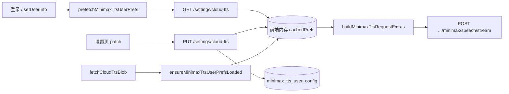

# 云端朗读偏好入库（账号同步）

> **文档角色（主文档）**：设置页「云端朗读」参数从浏览器 `localStorage` 迁至数据库，按登录账号持久化与跨设备同步。  
> **延伸阅读**：[`cloud-tts-settings.md`](./cloud-tts-settings.md)（设置页 UI 与请求合并）、[`minimax-cloud-tts.md`](./minimax-cloud-tts.md)（MiniMax 合成与 LRU）、[`english-tts-local-voice.md`](./english-tts-local-voice.md)（本机 Web Speech 仍按设备存储）。

若与仓库最新源码不一致，**以源码为准**。

---

## 1. 背景与目标

### 1.1 问题

| 维度 | 改前 | 改后 |
|------|------|------|
| 存储位置 | `localStorage`（后曾加 `:userId` 分键） | 表 `minimax_tts_user_config`，**每用户一行** |
| 跨设备 | 换浏览器/清缓存即丢失 | 登录后 **GET** 拉取，各端一致 |
| 换号 | 依赖前端 key + reload，易与 `userInfo` 时序竞态 | **JWT `userId`** 为真源，换号清内存缓存 |
| 本机音色 | — | **仍** `localStorage`（与 OS 可用 `speechSynthesis` 绑定，不入库） |

### 1.2 核心决策

1. **对齐 LLM 设置模式**：独立路由 `GET/PUT/DELETE /api/settings/cloud-tts`，与 `settings/llm` 同级；DTO 白名单与 `MinimaxTtsDto` 字段一致（不含 `text`）。
2. **前端内存缓存 + 预拉取**：`ensureMinimaxTtsUserPrefsLoaded()` 在登录、设置页、云端播放前调用；`resetUserState` 时 `clearMinimaxTtsUserPrefsCache()`。
3. **一次性迁移**：若仍存在旧键 `english_learning_minimax_tts_prefs`（含 `:userId` 分键），首次拉取时 **PUT 上传并删除本地**。
4. **后端合成 LRU**：`MinimaxTtsService.buildCacheKey` 首段仍带 `userId`，与账号隔离一致（音频缓存非设置存储）。

---

## 2. 改动范围

| 路径 | 职责 |
|------|------|
| `apps/backend/src/services/speech-transcription/minimax-tts-user-config.entity.ts` | 用户偏好实体 |
| `apps/backend/src/services/speech-transcription/minimax-tts-prefs.service.ts` | 读/写/清空 |
| `apps/backend/src/services/speech-transcription/minimax-tts-prefs.controller.ts` | `settings/cloud-tts` HTTP |
| `apps/backend/src/services/speech-transcription/dto/upsert-minimax-tts-prefs.dto.ts` | PUT 校验 |
| `apps/backend/src/migrations/1781300000000-minimax-tts-user-config.ts` | 建表迁移 |
| `apps/frontend/src/service/cloudTtsSettings.ts` | API 客户端 |
| `apps/frontend/src/utils/minimaxTtsPrefs.ts` | 内存缓存、迁移、合并请求体 |
| `apps/frontend/src/views/setting/cloudTts/index.tsx` | 加载 Spinner、PUT 保存 |
| `apps/frontend/src/utils/englishTts.ts` | 播放前 `ensureMinimaxTtsUserPrefsLoaded` |
| `apps/frontend/src/store/user.ts` | 登录后 `prefetchMinimaxTtsUserPrefs` |
| `apps/frontend/src/store/resetUserState.ts` | 换号清 TTS 偏好缓存 |

**未入库**：`apps/frontend/src/views/setting/cloudTts/LocalTtsVoiceSetting.tsx` 所管本机英语音色。

---

## 3. 实现思路

### 3.1 数据流



### 3.2 API 契约

| 方法 | 路径 | 说明 |
|------|------|------|
| GET | `/api/settings/cloud-tts` | 无行则返回默认（`enabled: false` 等） |
| PUT | 同上 | 全量 upsert 表单字段 |
| DELETE | 同上 | 删行并返回默认（「恢复默认」） |

响应字段（camelCase）：`enabled`, `model`, `voiceId`, `speed`, `vol`, `pitch`, `emotion`, `format`, `languageBoost`, `sampleRate`, `bitrate`, `channel`。

### 3.3 部署

执行迁移（或开发环境 `DB_SYNC=true` 自动建表）：

```bash
pnpm --filter backend migration:run
```

---

## 4. 关键代码与注释

### 4.1 后端：按 userId 读写偏好

**来源**：`apps/backend/src/services/speech-transcription/minimax-tts-prefs.service.ts`（约 L75–L112）

```typescript
async getPublicView(userId?: number): Promise<MinimaxTtsPrefsView> {
	const uid = this.assertUserId(userId);
	// 无记录 = 未自定义过，返回与前端 DEFAULT 一致的默认值
	const row = await this.repo.findOne({ where: { userId: uid } });
	if (!row) return { ...DEFAULT_MINIMAX_TTS_PREFS };
	return this.rowToView(row);
}

async upsert(dto: UpsertMinimaxTtsPrefsDto, userId?: number) {
	const uid = this.assertUserId(userId);
	let row = await this.repo.findOne({ where: { userId: uid } });
	if (!row) {
		row = this.repo.create({ userId: uid }); // 每用户最多一行
	}
	// 全量覆盖各字段后 save
	row.enabled = Boolean(dto.enabled);
	row.model = dto.model;
	// ... voiceId / speed / vol / pitch / emotion / format / languageBoost / sampleRate / bitrate / channel
	await this.repo.save(row);
	return this.rowToView(row);
}
```

### 4.2 前端：拉取、迁移、内存缓存

**来源**：`apps/frontend/src/utils/minimaxTtsPrefs.ts`（约 L140–L214）

```typescript
// 若浏览器里还有旧版 localStorage，先 PUT 到服务端再删本地键（一次性）
async function migrateLegacyLocalPrefsIfAny(userId: number) {
	const legacy = readLegacyLocalPrefs(userId);
	if (!legacy) return null;
	const res = await updateCloudTtsSettings(legacy);
	removeLegacyLocalPrefs(userId);
	return normalizeMinimaxTtsUserPrefs(res.data);
}

export async function ensureMinimaxTtsUserPrefsLoaded(userId?: number) {
	const id = userId ?? getLoggedInUserId();
	if (id <= 0) return { ...DEFAULT_MINIMAX_TTS_USER_PREFS };
	// 同 userId 已加载且未在飞行中 → 直接读内存
	if (cachedUserId === id && !loadPromise) return { ...cachedPrefs };
	// 合并并发请求为单次 loadPromise
	loadPromise = (async () => {
		const migrated = await migrateLegacyLocalPrefsIfAny(id);
		if (migrated) return setCache(id, migrated);
		const res = await getCloudTtsSettings();
		return setCache(id, normalizeMinimaxTtsUserPrefs(res.data));
	})();
	return loadPromise;
}

export async function saveMinimaxTtsUserPrefs(prefs, userId?) {
	const body = normalizeMinimaxTtsUserPrefs(prefs);
	const res = await updateCloudTtsSettings(body);
	removeLegacyLocalPrefs(id);
	return setCache(id, normalizeMinimaxTtsUserPrefs(res.data));
}
```

### 4.3 播放前确保已加载

**来源**：`apps/frontend/src/utils/englishTts.ts`（约 L467–L470）

```typescript
async function fetchCloudTtsBlob(plain: string): Promise<Blob> {
	// 云端朗读前先拉取/命中内存中的账号偏好，再拼 POST body
	await ensureMinimaxTtsUserPrefsLoaded();
	const cacheKey = plain + buildMinimaxTtsCacheKeySuffix();
	// ...
}
```

### 4.4 换号清缓存

**来源**：`apps/frontend/src/store/resetUserState.ts`（约 L14–L26）

```typescript
export function resetUserState(): void {
	// ...
	clearMinimaxTtsUserPrefsCache(); // 避免短暂读到上一账号的 cachedPrefs
}
```

---

## 5. 兼容性与影响

| 项 | 说明 |
|----|------|
| 破坏性 | 无 API 路径变更；仅存储介质从 localStorage → DB |
| 旧客户端 | 仍只写 localStorage 的数据会在新客户端首次登录时被迁移 |
| `enabled: false` | 与改前一致：请求体仅 `{ text }`，走服务端 env 默认 |
| 未登录 | 无法读写设置 API；播放云端 TTS 仍要 JWT |

---

## 6. 回归建议

1. 账号 A 在 **设置 → 云端朗读** 改音色并开启开关 → 换设备登录 A → 参数一致。  
2. 账号 A 配置后换账号 B → B 为默认，不应看到 A 的参数。  
3. 浏览器仍存旧 `english_learning_minimax_tts_prefs` → 首次 GET 后自动上传并清本地。  
4. **恢复默认** → DELETE 后 GET 为默认，`enabled: false`。  
5. 本机音色（系统设置）换号后仍各自独立（localStorage）。

---

## 7. 登录时序与 401 误登出（2026-06-08 修复）

偏好入库后在 `setUserInfo` 内预拉取；若登录表单**先** `setUserInfo` **后**写 token，legacy 迁移 **PUT** 会在无 Authorization 时 401，触发全局 `notifyUnauthorized` 清空刚建立的会话。

**修复摘要**（详见 [`../app/login-cloud-tts-prefetch-401.md`](../app/login-cloud-tts-prefetch-401.md)）：

- 登录页：先 `setStorage('token')` + `http.setAuthToken`，再 `setUserInfo`
- 仅会员在 `setUserInfo` 后 prefetch
- 预拉取/迁移请求 `{ silent: true }`，且 silent 401 不触发全局登出

---

## 8. 相关源码路径

| 说明 | 路径 |
|------|------|
| 实体 | `apps/backend/src/services/speech-transcription/minimax-tts-user-config.entity.ts` |
| 服务 / 控制器 | `minimax-tts-prefs.service.ts`、`minimax-tts-prefs.controller.ts` |
| 前端 API | `apps/frontend/src/service/cloudTtsSettings.ts` |
| 缓存与合并 | `apps/frontend/src/utils/minimaxTtsPrefs.ts` |
| 设置页 | `apps/frontend/src/views/setting/cloudTts/index.tsx` |
