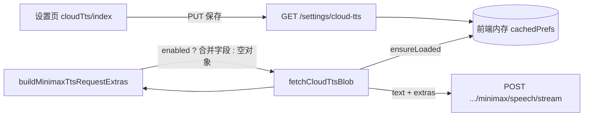

# 设置页「云端语音设置」与用户偏好

> **文档角色（主文档）**：**设置 → 语音设置** 页内「云端语音设置」区块；会员可见，参数存服务端。本机区块见 [`voice-settings-page.md`](./voice-settings-page.md)、[`english-tts-local-voice.md`](./english-tts-local-voice.md)。  
> **朗读介质 Switch**：[`tts-playback-source.md`](./tts-playback-source.md)  
> **存储与账号同步**：[`cloud-tts-prefs-db.md`](./cloud-tts-prefs-db.md)  
> 后端 MiniMax 流式合成、硅基回退与 LRU 见 [`minimax-cloud-tts.md`](./minimax-cloud-tts.md)。  
> 播放世代、单词本机优先见 [`english-tts-playback.md`](./english-tts-playback.md)。

若与仓库最新源码不一致，**以源码为准**。

---

## 1. 背景与目标

### 1.1 问题

| 维度 | 改前 | 改后 |
|------|------|------|
| 朗读参数 | 仅服务端 `.env` 默认（model / voice / 语速等） | 会员在 **设置 → 语音设置** 下方「云端语音设置」保存偏好，**开启开关后**随每次云端朗读请求发送 |
| 存储 | 曾用 `localStorage` | **账号级数据库**（见 [`cloud-tts-prefs-db.md`](./cloud-tts-prefs-db.md)） |
| 设置入口 | 与大模型配置混在同一页或不可配 | **语音设置** `/setting/cloud-tts`（本机在上、云端在下，见 [`voice-settings-page.md`](./voice-settings-page.md)） |
| 音色列表 | 单一默认 `English_radiant_girl` | 下拉 **45 个英文系统音色**（与官方 ID 对齐） |
| 前端缓存 | key 仅纯文本 | 自定义参数开启时，key 追加 **userId + 参数 JSON 后缀** |
| 界面文案 | 曾暴露服务商名称 | 产品向文案统一为 **「云端朗读」**，字段说明不含品牌 |

### 1.2 核心决策

1. **偏好存服务端**（表 `minimax_tts_user_config`，API `GET/PUT/DELETE /settings/cloud-tts`），前端仅内存缓存；旧 `localStorage` 一次性迁移（详见 [`cloud-tts-prefs-db.md`](./cloud-tts-prefs-db.md)）。
2. **`enabled: false` 时不发额外字段**：请求体仍为 `{ text }`，行为与仅配服务端 env 时相同；回退硅基路径也不带 MiniMax 参数。
3. **白名单常量**放在 `apps/frontend/src/constants/minimaxTts.ts`，与后端 `MinimaxTtsDto` / `UpsertMinimaxTtsPrefsDto` 校验列表对齐。
4. **设置页外层在 `ScrollArea` 内**：帮助 Popover、Combobox 下拉须 `stopPropagation` + 手动推进 `scrollTop`，避免滚轮被外层抢走（与 Combobox 组件同策略）。

---

## 2. 改动范围

| 路径 | 职责 |
|------|------|
| `apps/frontend/src/views/setting/cloudTts/index.tsx` | 语音设置页：本机 + 会员云端 UI |
| `apps/frontend/src/views/setting/cloudTts/LocalTtsVoiceSetting.tsx` | 本机语音设置区块 |
| `apps/frontend/src/views/setting/cloudTts/ParamsHelpPopover.tsx` | 字段说明 Popover（ScrollArea 滚动） |
| `apps/frontend/src/utils/minimaxTtsPrefs.ts` | 服务端同步、内存缓存、合并请求体、缓存 key 后缀 |
| `apps/frontend/src/constants/minimaxTts.ts` | 模型/音色/情感/格式/语言增强白名单 |
| `apps/frontend/src/utils/englishTts.ts` | `fetchCloudTtsBlob` 合并 extras、缓存 key |
| `apps/frontend/src/views/setting/menu.tsx` | 侧栏菜单项「云端朗读」 |
| `apps/frontend/src/router/routes.ts` | 路由 `/setting/cloud-tts` |
| `apps/frontend/src/i18n/locales/zh-CN.ts`、`en-US.ts` | 设置页与字段说明文案 |
| `apps/frontend/src/components/ui/combobox.tsx` | 选项列表 ScrollArea（LLM 页等仍使用） |
| `apps/backend/.../minimax-tts.service.ts` 等 | 接收 DTO 覆盖（见姊妹专题，本轮未改协议） |

---

## 3. 实现思路

### 3.1 数据流

存储与同步详见 [`cloud-tts-prefs-db.md`](./cloud-tts-prefs-db.md)。概要：



### 3.2 默认值要点

| 字段 | 默认 | 说明 |
|------|------|------|
| `enabled` | `false` | 关闭时不覆盖服务端 |
| `vol` | `5` | MiniMax 文档：5 为常用默认，1 为标准音量 |
| `languageBoost` | `auto` | Select：自动 / English / Chinese |
| `emotion` | `''` | UI 用 `__none__` 映射空串，请求时不传 |
| 情感白名单 | 8 项 | 不含 `whisper`；旧值加载时清空 |

### 3.3 设置页 UI

- **布局**：标题区（开关 + 说明）与 **朗读参数** 区分离；参数区内标题、说明文字、各表单项共用同一 `flex flex-col gap-4`，说明与下方字段间距与字段间距一致。
- **表单项**：模型 / 音色 / 情感 / 格式 / 语言增强用 `Select`；数值项用带 ± 步进按钮的数字输入（隐藏原生 spinner）。
- **标签**：中文 `w-[4em]` 两端对齐；英文 `w-[5rem]` + `text-end` + `nowrap`。
- **帮助**：`ParamsHelpPopover` 内 `ScrollArea max-h-80`，滚轮不冒泡至设置页外层。

---

## 4. 关键代码与注释

### 4.1 用户偏好：加载、保存与请求体

**来源**：`apps/frontend/src/utils/minimaxTtsPrefs.ts`（约 L31–L147）

```typescript
// 默认偏好：enabled 关闭；音量 5；语言增强 auto
export const DEFAULT_MINIMAX_TTS_USER_PREFS: MinimaxTtsUserPrefs = {
	enabled: false,
	model: DEFAULT_MINIMAX_TTS_MODEL,
	voiceId: DEFAULT_MINIMAX_TTS_VOICE_ID,
	speed: 1,
	vol: 5,
	pitch: 0,
	emotion: '',
	format: 'mp3',
	languageBoost: DEFAULT_MINIMAX_TTS_LANGUAGE_BOOST,
	sampleRate: 32_000,
	bitrate: 128_000,
	channel: 1,
};

// 从 localStorage 读取并白名单校验；非法 emotion（含旧 whisper）→ 空串
export function loadMinimaxTtsUserPrefs(): MinimaxTtsUserPrefs { /* ... */ }

// 每次 prefs 变更写入（设置页 useEffect）
export function saveMinimaxTtsUserPrefs(prefs: MinimaxTtsUserPrefs): void { /* ... */ }

/** 供 fetchCloudTtsBlob 合并进 POST body（不含 text） */
export function buildMinimaxTtsRequestExtras(): Record<string, unknown> {
	const prefs = loadMinimaxTtsUserPrefs();
	// 未开启自定义：返回 {}，服务端仍用 env 默认
	if (!prefs.enabled) return {};
	const body: Record<string, unknown> = {
		model: prefs.model,
		voiceId: prefs.voiceId,
		speed: prefs.speed,
		vol: prefs.vol,
		pitch: prefs.pitch,
		format: prefs.format,
		sampleRate: prefs.sampleRate,
		bitrate: prefs.bitrate,
		channel: prefs.channel,
	};
	// 空 emotion / 默认 languageBoost 仍可按需传入（languageBoost 默认 auto 会发送）
	if (prefs.emotion) body.emotion = prefs.emotion;
	if (prefs.languageBoost) body.languageBoost = prefs.languageBoost;
	return body;
}

/** 前端 MP3 缓存 key 后缀：参数变更后与旧缓存隔离 */
export function buildMinimaxTtsCacheKeySuffix(): string {
	const prefs = loadMinimaxTtsUserPrefs();
	if (!prefs.enabled) return '';
	return JSON.stringify(buildMinimaxTtsRequestExtras());
}
```

### 4.2 云端拉取：合并偏好与缓存

**来源**：`apps/frontend/src/utils/englishTts.ts`（约 L340–L467）

```typescript
function getCloudTtsFromCache(plain: string): Blob | null {
	// 缓存键 = 规范化文本 + 用户参数 JSON 后缀（未开启后缀为空）
	const cacheKey = plain + buildMinimaxTtsCacheKeySuffix();
	const hit = cloudTtsAudioCache.get(cacheKey);
	// ... LRU  touch ...
	return new Blob([hit], { type: 'audio/mpeg' });
}

async function fetchCloudTtsBlob(plain: string): Promise<Blob> {
	const cacheKey = plain + buildMinimaxTtsCacheKeySuffix();
	const cached = getCloudTtsFromCache(plain);
	if (cached) return cached;

	// ... JWT、headers ...

	// 第一跳：MiniMax 流式；body = text + 用户 extras（enabled 时）
	let res = await platformFetch(BASE_URL + SPEECH_MINIMAX_TTS_STREAM, {
		method: 'POST',
		headers,
		body: JSON.stringify({ text: plain, ...buildMinimaxTtsRequestExtras() }),
	});

	// 503/401/502 回退硅基：仅 { text }，不受用户 MiniMax 参数影响
	if (res.status === 503 || res.status === 401 || res.status === 502) {
		res = await platformFetch(BASE_URL + SPEECH_TTS, {
			method: 'POST',
			headers,
			body: JSON.stringify({ text: plain }),
		});
	}

	const buf = await readResponseBodyAsArrayBuffer(res);
	touchCloudTtsCache(cacheKey, buf);
	return new Blob([buf], { type: 'audio/mpeg' });
}
```

### 4.3 设置页：即时保存与试听

**来源**：`apps/frontend/src/views/setting/cloudTts/index.tsx`（约 L189–L262、L295–L310）

```typescript
const CloudTtsSetting = () => {
	const [prefs, setPrefs] = useState<MinimaxTtsUserPrefs>(() =>
		loadMinimaxTtsUserPrefs(),
	);

	// 任意字段变更 → normalize 后写 localStorage
	useEffect(() => {
		saveMinimaxTtsUserPrefs(prefs);
	}, [prefs]);

	const patch = useCallback((partial: Partial<MinimaxTtsUserPrefs>) => {
		setPrefs((prev) => ({ ...prev, ...partial }));
	}, []);

	// 试听：强制走云端（preferLocal: false），使用当前已保存参数
	const onPreview = async () => {
		await playEnglishPreferred(t('setting.cloudTts.previewText'), {
			preferLocal: false,
		});
	};

	return (
		// ...
		// 参数区：统一 gap-4，说明文字与表单项间距一致
		<div className="my-3.5 flex flex-col gap-4 px-8.5 text-sm">
			<div className="flex items-center gap-1">
				<div className="text-md font-bold">{t('setting.cloudTts.paramsTitle')}</div>
				<ParamsHelpPopover />
			</div>
			<p className="text-xs text-textcolor/55">{t('setting.cloudTts.paramsDesc')}</p>
			<PrefSelectField /* model */ />
			{/* voice、speed、vol、pitch、emotion、format、languageBoost */}
			<p className="text-xs text-textcolor/55">{t('setting.cloudTts.advancedHint')}</p>
			{/* sampleRate、bitrate、channel */}
		</div>
	);
};
```

### 4.4 帮助 Popover：ScrollArea 与滚轮隔离

**来源**：`apps/frontend/src/views/setting/cloudTts/ParamsHelpPopover.tsx`（约 L50–L108）

```typescript
// 设置页外层 ScrollArea 会抢滚轮；在 viewport 上 stopPropagation 并手动 scrollTop
const handleWheel = useCallback((event: React.WheelEvent<HTMLDivElement>) => {
	event.stopPropagation();
	event.currentTarget.scrollTop += event.deltaY;
}, []);

<PopoverContent className="w-[min(100vw-2rem,29rem)] overflow-hidden p-0">
	<ScrollArea
		className="max-h-80 w-full"
		viewportClassName="max-h-80 [&>div]:min-h-0!"
		onWheel={handleWheel}
		onWheelCapture={handleWheelCapture}
	>
		<div className="p-3">{/* 字段说明 dl */}</div>
	</ScrollArea>
</PopoverContent>
```

### 4.5 常量白名单（前后端对齐）

**来源**：`apps/frontend/src/constants/minimaxTts.ts`（约 L23–L44、L48–L95）

```typescript
// 情感 8 项（与官网一致，UI 中文名见 i18n setting.cloudTts.emotion.*）
export const MINIMAX_TTS_EMOTIONS = [
	'happy', 'sad', 'angry', 'fearful',
	'disgusted', 'surprised', 'calm', 'fluent',
] as const;

export const MINIMAX_TTS_LANGUAGE_BOOST_VALUES = ['auto', 'English', 'Chinese'] as const;

// 45 个英文系统音色：{ id, name }，Select 展示「name · id」
export const MINIMAX_TTS_ENGLISH_VOICES = [ /* ... */ ] as const;
```

---

## 5. 行为变化与兼容性

| 项 | 说明 |
|----|------|
| 破坏性 | **无**；默认 `enabled: false`，与不配设置页时行为一致 |
| 未登录 | 云端朗读仍需要 JWT；设置页在设置路由下，与既有守卫一致 |
| 回退硅基 | 仅 MiniMax 请求带用户参数；硅基 `/speech` 始终 `{ text }` |
| 后端 cache | 键含 model+voice+参数+text；与用户 extras 一致时命中 |
| 旧 localStorage | `normalizePrefs` 纠正非法 model/format/emotion；`whisper` 清空 |

---

## 6. 测试与回归建议

| # | 场景 | 期望 |
|---|------|------|
| 1 | 默认进入设置页 | 开关关；表单为默认值；经典句朗读仍用服务端 env |
| 2 | 开启开关并改音色 → 试听 | 听到新音色；Network body 含 `voiceId` |
| 3 | 同句连点两次 | 第二次无 HTTP（前端 cache）；改参数后再播应 miss |
| 4 | 恢复默认 | 表单回默认；开关状态不变 |
| 5 | 帮助 Popover 滚轮 | 仅 Popover 内滚动，外层设置页不滚 |
| 6 | 英文界面 | 标签不换行；情感显示中文/英文翻译名 |
| 7 | MiniMax 503 | 仍回退硅基；与是否开启用户参数无关 |

---

## 7. 相关文档与代码索引

| 说明 | 路径 |
|------|------|
| MiniMax 后端与 HTTP | [`minimax-cloud-tts.md`](./minimax-cloud-tts.md) |
| 播放世代 | [`english-tts-playback.md`](./english-tts-playback.md) |
| 设置页 | `apps/frontend/src/views/setting/cloudTts/index.tsx` |
| 用户偏好 | `apps/frontend/src/utils/minimaxTtsPrefs.ts` |
| 朗读入口 | `apps/frontend/src/utils/englishTts.ts` |
