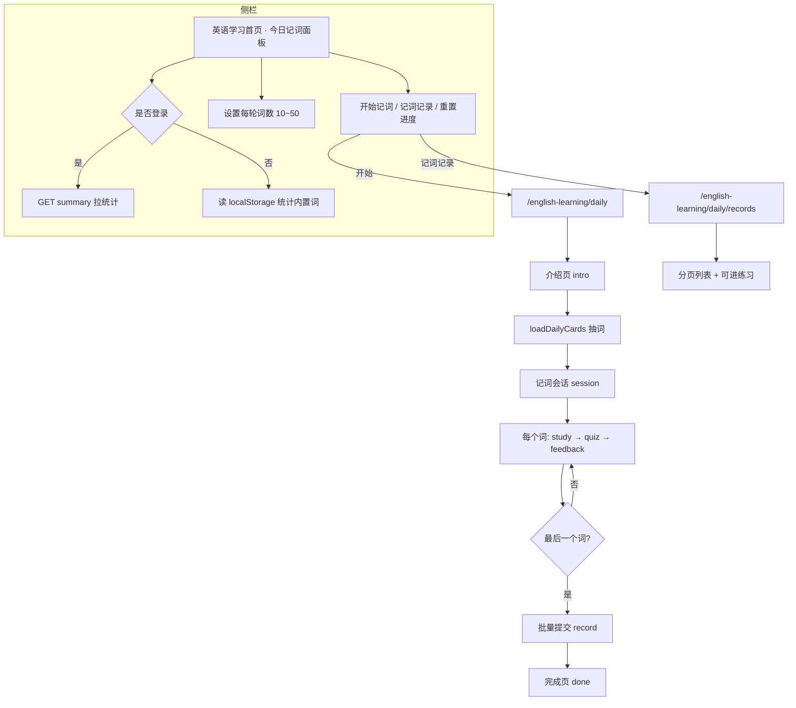
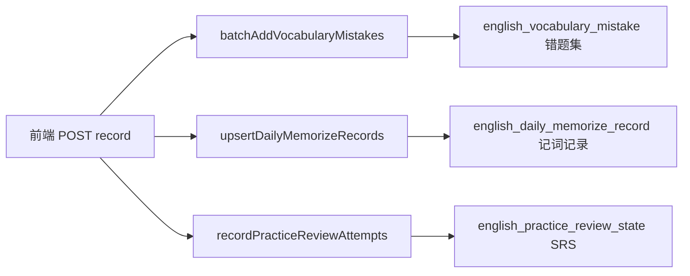
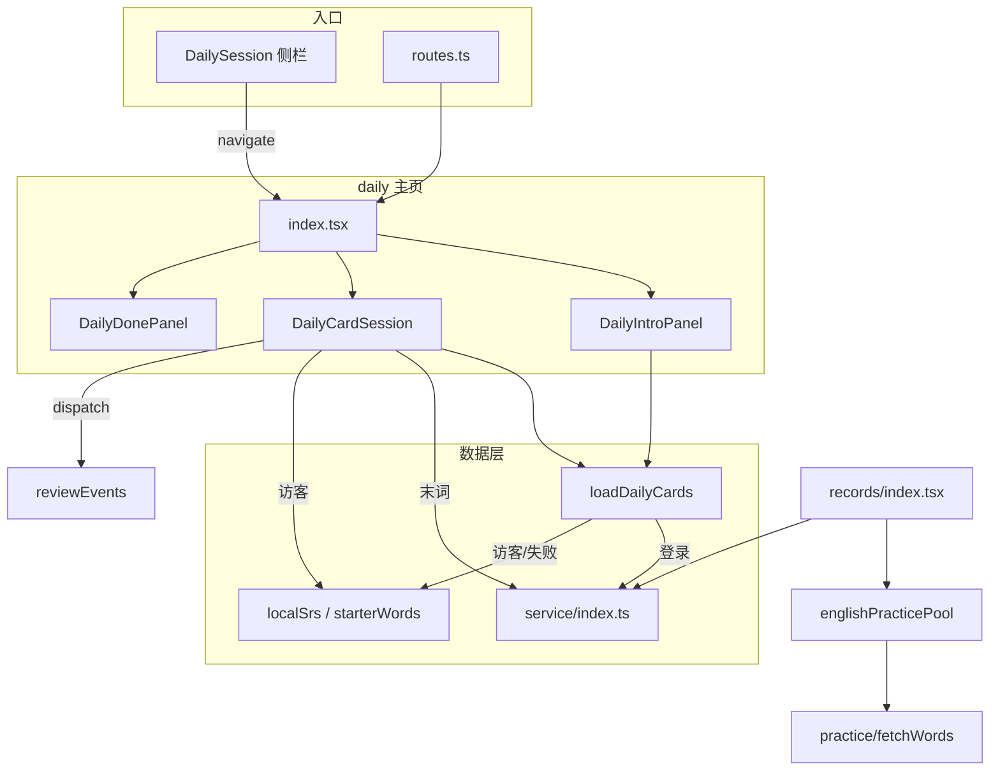
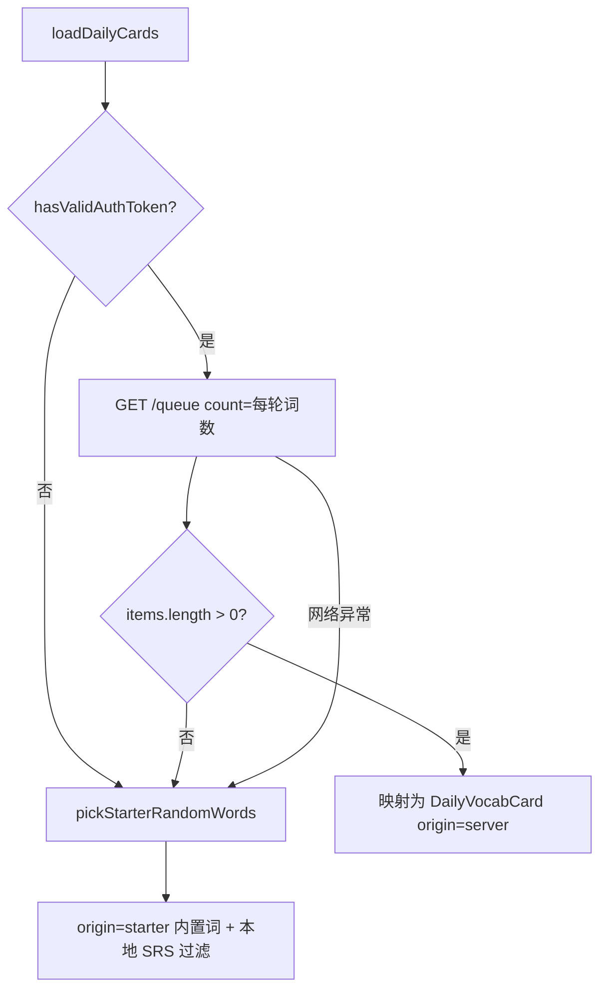
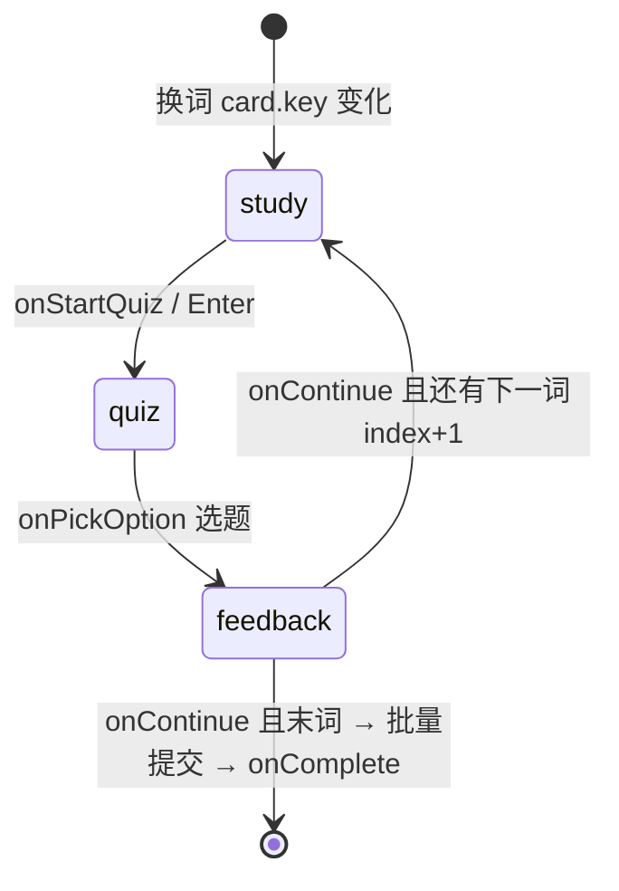
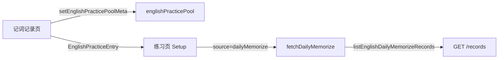

# 今日记词（Daily Memorize）前后端实现说明

> **文档角色**：面向产品、测试与维护者；用「白话 + 流程图 + 带注释代码」说明 **今日记词** 从侧栏入口到记词记录页的完整链路。  
> **延伸阅读**：[practice-review-srs.md](./practice-review-srs.md)（今日复习 SRS）、[english-learning-backend-implementation.md](./english-learning-backend-implementation.md)

---

## 1. 这个功能是做什么的？

**今日记词** 帮助用户从 **自己导入的词汇库** 里 **随机抽新词**，按「认读 → 四选一测验 → 正/错反馈」练一轮；练完后系统会：

1. 把词写入 **记词记录**（可在「记词记录」页查看历史）；
2. 把词加入 **错题集**（供「今日复习」听写/拼写）；
3. 把词纳入 **间隔复习计划（SRS）**，之后不会再被「词汇库随机」重复抽到。

**和「今日复习」的分工：**

| 能力 | 今日记词 | 今日复习 |
|------|----------|----------|
| 词从哪来 | 词汇库里 **还没进复习计划** 的新词 | 错题集 / 到期 SRS 词 |
| 交互形态 | 认读 + 四选一 | 听写 / 拼写 |
| 路由 | `/english-learning/daily` | `/english-learning/review` 等 |

**未登录访客**：不能写云端记录，会用浏览器内置的一小套示例词 + `localStorage` 做本地进度（逻辑与云端类似，但数据只在当前浏览器）。

---

## 2. 用户能感知到的完整流程



### 2.1 单个词在页面上的三小步

对每个单词，用户会经历 **三个界面阶段**（代码里叫 `step`）：

| 阶段 | 英文名 | 用户看到什么 | 典型操作 |
|------|--------|--------------|----------|
| 认读 | `study` | 单词、音标、词性、释义、例句；自动朗读 | 点「开始测验」或按 Enter |
| 测验 | `quiz` | 顶部只显示英文词；下方 4 个中文选项 | 点选一个释义 |
| 反馈 | `feedback` | 告诉答对/答错，并展示完整词条 | 点「下一词」或「完成」 |

整轮结束后 **才一次性提交** 所有答题结果（不是每个词立刻请求后端），减少网络请求、也保证一轮是一个完整「场次」。

---

## 3. 后端：五个接口在干什么？

所有接口前缀：`/english-learning/practice/daily/*`，且 **必须登录**（`JwtGuard`）。

| 方法 | 路径 | 一句话说明 |
|------|------|------------|
| `GET` | `/summary` | 侧栏数字：还能随机抽多少词、已记多少词 |
| `GET` | `/queue` | 为本轮练习 **随机抽词**（不写数据库） |
| `POST` | `/record` | 一轮练完 **结算**：错题集 + 记词记录 + SRS |
| `GET` | `/records` | 记词历史列表（分页） |
| `POST` | `/reset` | 清空记词进度，词重新回到随机池 |

控制器入口（校验登录后转给 Service）：

**来源**：`apps/backend/src/services/english-learning/english-learning.controller.ts`（约 L695–L783）

```typescript
// 侧栏统计：libraryCount = 还能抽的新词数；memorizedCount = 记词记录行数
@Get('practice/daily/summary')
async getDailyMemorizeSummary(@Req() req: AuthedRequest) {
	const userId = req.user?.userId;
	if (userId == null) throw new UnauthorizedException('未授权');
	const data = await this.englishLearningService.getDailyMemorizeSummary(userId);
	return { success: true, data };
}

// 拉本轮词卡：count 默认 5，最大 50；excludeKeys 可排除已用过的词
@Get('practice/daily/queue')
async getDailyMemorizeQueue(@Req() req, @Query() query: PracticeDailyQueueQueryDto) {
	const userId = req.user?.userId;
	if (userId == null) throw new UnauthorizedException('未授权');
	const excludeKeys = (query.excludeKeys ?? '')
		.split(',')
		.map((k) => k.trim())
		.filter(Boolean);
	const data = await this.englishLearningService.getDailyMemorizeQueue(userId, {
		count: query.count ?? 5,
		excludeKeys,
	});
	return { success: true, data };
}

// 一轮结束提交：attempts = 每词对错；vocabItems = 词条快照（写错题集/记词记录用）
@Post('practice/daily/record')
async recordDailyMemorizeAttempts(@Req() req, @Body() dto: PracticeDailyRecordDto) {
	const userId = req.user?.userId;
	if (userId == null) throw new UnauthorizedException('未授权');
	const data = await this.englishLearningService.recordDailyMemorizeAttempts(userId, dto);
	return { success: true, data };
}
```

---

## 4. 后端：词从词汇库里怎么「随机抽」？

### 4.1 什么样的词 **可以** 被抽到？

后端用 SQL 查询构造「候选池」，必须同时满足：

1. 属于 **当前用户** 的词汇库条目（**所有词包合并**，不按某一个 libraryId 过滤）；
2. **有中文释义**（`translationZh` 非空）；
3. **还没有进入间隔复习计划**（在 `english_practice_review_state` 里没有对应 `itemKey`）；
4. 不在本次请求的 `excludeKeys` 里（前端可传已练过的 key，避免重复）。

**来源**：`apps/backend/src/services/english-learning/english-learning.service.ts`（`createLibraryMemorizeEligibleQueryBuilder`，约 L4660–L4684）

```typescript
/**
 * 构造「可随机词汇」查询。
 * 理解要点：
 * - LEFT JOIN 复习状态表 rs，并要求 rs.id IS NULL → 只保留「从未练进 SRS 计划」的词
 * - wordKey = LOWER(TRIM(word)) → 大小写不同视为同一个词，避免 duplicate
 */
private createLibraryMemorizeEligibleQueryBuilder(userId, alias = 'item', options?) {
	const wordKey = this.libraryMemorizeWordKeySql(alias); // SQL: LOWER(TRIM(item.word))
	const qb = this.vocabLibraryItemRepo.createQueryBuilder(alias);

	qb.where(`${alias}.userId = :userId`, { userId });
	qb.andWhere(`TRIM(${alias}.translationZh) <> ''`); // 没中文释义的不进记词

	// 左连接复习状态：若已有 SRS 记录，则 rs.id 非空，会被 andWhere 排除
	qb.leftJoin(
		EnglishPracticeReviewState,
		'rs',
		`rs.userId = ${alias}.userId AND rs.contentKind = :vocabKind AND rs.itemKey = ${wordKey}`,
		{ vocabKind: 'vocab' },
	);
	qb.andWhere('rs.id IS NULL'); // 核心：尚未进入复习计划的词

	// 可选：排除前端传来的 key 列表
	if (excludeKeys.length > 0) {
		qb.andWhere(`${wordKey} NOT IN (:...excludeKeys)`, { excludeKeys });
	}
	return qb;
}
```

### 4.2 随机 + 去重

同一单词可能在多个词包里各有一条，抽取时会 **按 wordKey 去重**，再 `ORDER BY RAND()` 取 N 条：

**来源**：`apps/backend/src/services/english-learning/english-learning.service.ts`（`pickLibraryMemorizeItems`，约 L4791–L4805）

```typescript
// 第一步：在候选池里按 wordKey 分组，每组只保留 MIN(id) 代表行
dedupeQb.select('MIN(item.id)', 'pickId').groupBy(wordKey);

// 第二步：用子查询 JOIN 回完整行，MySQL RAND() 随机，take(limit) 取本轮数量
const rows = await this.vocabLibraryItemRepo
	.createQueryBuilder('item')
	.innerJoin(`(${dedupeQb.getQuery()})`, 'dedup', 'dedup.pickId = item.id')
	.setParameters(dedupeQb.getParameters())
	.orderBy('RAND()') // 数据库层随机；候选不足时返回少于 count 条
	.take(limit)
	.getMany();
```

**重要**：`GET /queue` **只读**，不会在此时写错题集或 SRS；只有用户练完点「完成」走 `POST /record` 才落库。

---

## 5. 后端：练完一轮后写入了哪三张表？

`POST /record` 时，Service 按顺序做 **三件事**（像流水线）：



**来源**：`apps/backend/src/services/english-learning/english-learning.service.ts`（`recordDailyMemorizeAttempts`，约 L4462–L4487）

```typescript
async recordDailyMemorizeAttempts(userId, dto) {
	let mistakeAdded = 0;
	let mistakeSkipped = 0;

	if (dto.vocabItems?.length) {
		// ① 错题集：本轮练过的词都入库（供「今日复习」听写/拼写）
		const res = await this.batchAddVocabularyMistakes(userId, dto.vocabItems);
		mistakeAdded = res.added;
		mistakeSkipped = res.skipped;

		// ② 记词记录：按 userId + wordKey 唯一，更新「最近一次练过」的快照
		await this.upsertDailyMemorizeRecords(userId, dto.vocabItems, dto.attempts);
	}

	// ③ SRS：根据 attempts 里每词 correct true/false 更新下次复习日期
	const { updated } = await this.recordPracticeReviewAttempts(userId, dto.attempts);

	return { updated, mistakeAdded, mistakeSkipped };
}
```

### 5.1 记词记录表结构

表名：`english_daily_memorize_record`  
含义：**每个用户、每个词形（wordKey）只保留一行**，反复练同一词会 **更新** 这一行（不是追加多行历史）。

**来源**：`apps/backend/src/services/english-learning/entity/english-daily-memorize-record.entity.ts`

| 字段 | 含义（白话） |
|------|----------------|
| `user_id` | 哪个用户 |
| `word_key` | 规范化词键：`trim` + 全小写，如 `hello` |
| `word` / `ipa` / `pos` … | 最近一次练习时的词条快照 |
| `last_correct` | 最近一次四选一是否答对 |
| `practiced_at` | 最近一次练习时间（列表按此倒序） |

### 5.2 upsert 记词记录（有则改、无则建）

**来源**：`apps/backend/src/services/english-learning/english-learning.service.ts`（约 L4489–L4542）

```typescript
private async upsertDailyMemorizeRecords(userId, vocabItems, attempts) {
	// 先把 attempts 转成 Map：wordKey → 是否答对
	const correctByKey = new Map<string, boolean>();
	for (const attempt of attempts) {
		if (attempt.contentKind !== 'vocab') continue;
		const key = attempt.itemKey?.trim();
		if (!key) continue;
		correctByKey.set(key, attempt.correct);
	}

	const now = new Date();
	for (const item of vocabItems) {
		const wordKey = normalizeVocabularyFavoriteWordKey(item.word); // 与前端 key 规则一致
		const lastCorrect = correctByKey.get(wordKey) ?? false;

		// 查是否已有记录：有 → 更新快照；无 → 新建
		let row = await this.dailyMemorizeRecordRepo.findOne({ where: { userId, wordKey } });
		if (!row) {
			row = this.dailyMemorizeRecordRepo.create({ userId, wordKey, /* 各字段 */ lastCorrect, practicedAt: now });
		} else {
			row.word = item.word.trim();
			// ... 更新 ipa、释义等 ...
			row.lastCorrect = lastCorrect;
			row.practicedAt = now;
		}
		await this.dailyMemorizeRecordRepo.save(row);
	}
}
```

### 5.3 SRS 算法（答对/答错如何影响「下次何时复习」）

记词与「今日复习」共用 **SM-2 轻量版** 算法：

**来源**：`apps/backend/src/services/english-learning/english-practice-review.srs.ts`（`applyReviewSrs`，约 L58–L107）

```typescript
export function applyReviewSrs(input: { repetitions, intervalDays, easeFactor, correct }) {
	const now = new Date();

	if (!input.correct) {
		// 答错：计数清零；熟练度降 0.2（最低 1.3）；明天再复习
		return {
			repetitions: 0,
			intervalDays: 0,
			easeFactor: Math.max(1.3, input.easeFactor - 0.2),
			nextReviewAt: addCalendarDays(now, 1),
			lastResult: 'wrong',
		};
	}

	// 答对：连续答对次数 +1
	const repetitions = input.repetitions + 1;
	let intervalDays = input.intervalDays;

	if (repetitions === 1) intervalDays = 1;       // 第 1 次对：1 天后再复习
	else if (repetitions === 2) intervalDays = 3;  // 第 2 次对：3 天后再复习
	else intervalDays = Math.max(1, Math.round(intervalDays * input.easeFactor)); // 之后按间隔×熟练度

	const easeFactor = Math.min(2.5, input.easeFactor + 0.1); // 答对则熟练度略升，上限 2.5

	return {
		repetitions,
		intervalDays,
		easeFactor,
		nextReviewAt: addCalendarDays(now, intervalDays),
		lastResult: 'correct',
	};
}
```

**对「今日记词」的影响**：一旦某词写入 SRS，它就 **不会再出现在词汇库随机池**（见 §4.1 的 `rs.id IS NULL` 条件）。用户若还想练，应走「今日复习」或「听写/拼写练习」。

### 5.4 重置进度

`POST /reset` 会删除该用户全部记词记录，并 **连带删除** 这些词在错题集、SRS 里的记录，使它们 **重新可被随机抽到**。

**来源**：`apps/backend/src/services/english-learning/english-learning.service.ts`（约 L4724–L4761）

---

## 6. 前端：页面与文件分工

### 6.0 文件结构树（每个文件做什么）

前端「今日记词」代码集中在 `apps/frontend/src/views/englishLearning/daily/`，侧栏入口与练习联动在相邻目录。树形结构如下（`→` 后为职责说明）：

```
apps/frontend/src/views/englishLearning/
├── daily/                                    # 今日记词主模块
│   ├── index.tsx                             → 记词主页：intro / session / done 三阶段编排
│   ├── types.ts                              → 词卡、步骤、选项等 TypeScript 类型
│   ├── constants/index.ts                    → 底部按钮区、四选一选项的 Tailwind 样式常量
│   │
│   ├── components/                           # 页面 UI 组件
│   │   ├── DailyPageLayout.tsx               → 外层壳：复用练习页 PracticePageShell（标题 + 返回）
│   │   ├── DailyIntroPanel.tsx               → 介绍页：说明文案、访客提示、「开始记词」按钮
│   │   ├── DailyCardSession.tsx              → 会话引擎：study → quiz → feedback 状态机 + 末词提交
│   │   ├── DailyDonePanel.tsx                → 完成页：回首页 / 跳转记词记录
│   │   ├── DailyWordHero.tsx                 → 认读阶段：居中展示单词、音标、词性、释义、例句
│   │   ├── DailyQuizWordBar.tsx              → 测验阶段：顶部只显示英文词 + 朗读按钮
│   │   ├── DailyCorrectFeedback.tsx          → 答对反馈：绿色面板 + 词条详情
│   │   ├── DailyWrongFeedback.tsx            → 答错反馈：红色面板 + 词条详情
│   │   ├── DailyPlayIconButton.tsx           → 反馈条上的朗读/停止小图标按钮
│   │   └── DailyWordsPerRoundPopover.tsx     → 侧栏用：Popover 设置每轮词数（10~50）
│   │
│   ├── hooks/                                # 可复用逻辑 Hook
│   │   ├── useDailyWordCount.ts              → 读/写每轮词数，监听 CustomEvent 跨组件同步
│   │   ├── useDailyPlayback.ts               → TTS 朗读：playWord / playing / playLabel
│   │   ├── useDailySessionKeyboard.ts        → 会话快捷键：Space 朗读、Enter 开始测验、↓ 下一词
│   │   └── useDailyMemorizeRecordsList.ts    → 记词记录页：首屏拉取 + 滚动分页加载
│   │
│   ├── utils/                                # 纯函数 / 无 UI 逻辑
│   │   ├── loadDailyCards.ts                 → 抽词入口：登录走 API，否则/失败走内置词表
│   │   ├── dailyWordCount.ts                 → localStorage 存每轮词数 + 广播变更事件
│   │   ├── localSrs.ts                       → 访客本地 SRS：抽词过滤、练完写入、重置、统计
│   │   ├── starterWords.ts                   → 未登录演示用的内置词表（约数十条）
│   │   ├── buildQuizOptions.ts               → 四选一：从本轮其它词取干扰项 + 洗牌
│   │   └── buildDailyFeedbackDetailRows.tsx    → 反馈面板：组装释义/单词/IPA/分词/例句行
│   │
│   └── records/
│       └── index.tsx                         → 记词记录列表页：卡片网格 + 收藏 + 进练习入口
│
├── sidebar/
│   ├── components/DailySession.tsx           → 首页侧栏：统计、开始、记词记录、重置、每轮词数
│   └── reviewEvents.ts                       → 自定义事件：练完/重置后通知侧栏刷新统计
│
└── practice/                                 # 与记词联动的练习模块（非 daily 目录但强相关）
    ├── types.ts                              → PracticeSource 含 'dailyMemorize'
    ├── Setup.tsx / index.tsx                 → 练习入口识别 dailyMemorize 来源与图标
    └── utils/
        ├── fetchWords.ts                     → fetchDailyMemorize：从记词记录 API 分页拉词练听写/拼写
        └── resolveTitle.ts                   → 练习页标题解析 dailyMemorize 文案

apps/frontend/src/
├── router/routes.ts                          → 注册 /english-learning/daily 与 daily/records
├── service/index.ts                          → 五个 daily API 封装（约 L1099–L1190）
└── store/englishPracticePool.ts              → 记词记录 total 写入练习池元数据
```

**模块关系（谁调用谁）：**



---

### 6.1 路由

| 路径 | 页面文件 | 作用 |
|------|----------|------|
| `/english-learning/daily` | `daily/index.tsx` | 介绍 → 会话 → 完成 |
| `/english-learning/daily/records` | `daily/records/index.tsx` | 记词历史 + 进练习 |

**来源**：`apps/frontend/src/router/routes.ts`（约 L188–L201）

侧栏入口：`sidebar/components/DailySession.tsx`（英语学习首页左/右侧栏，由 `EnglishLearningSidebar` 挂载）。

---

### 6.2 主页面三阶段（intro / session / done）

**来源**：`apps/frontend/src/views/englishLearning/daily/index.tsx`

```typescript
type PagePhase = 'intro' | 'session' | 'done';

export default function EnglishLearningDailyPage() {
	const [phase, setPhase] = useState<PagePhase>('intro'); // 当前处于哪一屏
	const [cards, setCards] = useState<DailyVocabCard[]>([]); // 本轮要练的词列表

	const onStart = useCallback(async () => {
		setStarting(true);
		try {
			const loaded = await loadDailyCards(); // 见 §6.3：登录走 API，否则内置词
			if (loaded.length === 0) {
				setPhase('done'); // 没有可练的词，直接进完成页
				return;
			}
			setCards(loaded);
			setPhase('session'); // 进入记词会话
		} finally {
			setStarting(false);
		}
	}, []);

	// 根据 phase 渲染：DailyIntroPanel | DailyCardSession | DailyDonePanel
}
```

**三阶段切换规则：**

| 触发 | 从 | 到 | 说明 |
|------|----|----|------|
| 进入页面 | — | `intro` | 默认展示介绍 |
| 点「开始记词」且抽到词 | `intro` | `session` | `cards` 非空 |
| 点「开始记词」但无词可练 | `intro` | `done` | 词汇库/SRS 已耗尽或访客内置词练完 |
| 会话 `onComplete` | `session` | `done` | 末词提交后 |
| 点「回首页」 | 任意 | 导航离开 | `navigate('/english-learning')` |

**布局**：`DailyPageLayout` 只是对 `PracticePageShell` 的薄封装，保证记词页与听写/拼写练习页外框一致（标题栏 + 返回 + 内容区内边距）。

---

### 6.3 UI 组件分工（按用户看到的界面）

| 组件 | 出现在哪一 `step` | 职责 |
|------|-------------------|------|
| `DailyIntroPanel` | `phase=intro` | 展示功能说明、当前每轮词数、访客提示；按钮触发 `loadDailyCards` |
| `DailyWordHero` | `step=study` | 认读：单词 + 音标 + 词性 + 分词 + 释义 + 例句（居中排版） |
| `DictationPlayButton` | `study` / `quiz` | 复用练习模块的大/条形色朗读按钮 |
| `DailyQuizWordBar` | `step=quiz` | 测验：只显示英文与音标，隐藏中文释义 |
| 四选一 `Button` 列表 | `step=quiz` | 样式来自 `QUIZ_OPTION_CLASS`，点击即判题 |
| `DailyCorrectFeedback` | `feedback` 且答对 | 绿色状态条 + `buildDailyFeedbackDetailRows` 详情 |
| `DailyWrongFeedback` | `feedback` 且答错 | 红色状态条 + 同上详情 |
| `DailyPlayIconButton` | `feedback` | 反馈条右侧小图标朗读 |
| 底部主按钮 | `study` / `feedback` | study→「开始测验」；feedback→「下一词」或「完成」 |
| `DailyDonePanel` | `phase=done` | 完成祝贺 + 回首页 / 记词记录 |
| `DailyWordsPerRoundPopover` | 侧栏 | 分段选择 10/20/30/40/50，写入 localStorage |

**反馈详情行**由 `buildDailyFeedbackDetailRows` 统一生成，字段顺序：正确答案（中文释义）→ 单词 → IPA → 分词 → 例句；若行数过多则切 `compact` 模式（`line-clamp` 截断）。

**来源**：`apps/frontend/src/views/englishLearning/daily/utils/buildDailyFeedbackDetailRows.tsx`（约 L9–L96）

```tsx
// 反馈面板共用的「词条详情行」组装器
export function buildDailyFeedbackDetailRows(card, t, compact) {
	const rows = [];
	// ① 正确答案：中文释义（测验里用户刚选过或错过的那个）
	rows.push(<FieldCells label={t('...correctAnswer')}>{translationText}</FieldCells>);
	// ② 英文单词 + 词性
	rows.push(<FieldCells label={t('...hintLabelWord')}>{card.word} {pos}</FieldCells>);
	// ③ 可选：IPA、分词、例句 — 有数据才 push
	return rows;
}
```

---

### 6.4 四个 Hook：触发条件与数据流

#### 6.4.1 `useDailyWordCount` — 每轮词数（侧栏 ↔ 记词页同步）

| 项目 | 说明 |
|------|------|
| 存储 | `localStorage['english_daily_words_per_round_v1']`，默认 10 |
| 可选值 | 10 / 20 / 30 / 40 / 50 |
| 写入 | `setDailyWordCount` 写 storage 并 `dispatchEvent(ENGLISH_DAILY_WORD_COUNT_CHANGE)` |
| 订阅 | Hook 内 `addEventListener`，任意处改词数后 Intro / Popover 同步更新 |

**来源**：`apps/frontend/src/views/englishLearning/daily/hooks/useDailyWordCount.ts` + `utils/dailyWordCount.ts`

```typescript
// useDailyWordCount：组件 mount 时读 storage，并监听全局变更事件
useEffect(() => {
	const onChange = (event: Event) => {
		const detail = (event as CustomEvent<DailyWordCount>).detail;
		setCount(detail ?? getDailyWordCount()); // 事件带 detail 则用 detail，否则重新读 storage
	};
	window.addEventListener(ENGLISH_DAILY_WORD_COUNT_CHANGE, onChange);
	return () => window.removeEventListener(ENGLISH_DAILY_WORD_COUNT_CHANGE, onChange);
}, []);
```

#### 6.4.2 `useDailyPlayback` — TTS 朗读

| 项目 | 说明 |
|------|------|
| 输入 | 当前词的 `word`、i18n 函数 `t` |
| 输出 | `{ playing, playWord, playLabel }` |
| 换词 | `DailyCardSession` 在 `card.key` 变化时 `playWord({ force: true })` 自动朗读 |
| 不支持 TTS | Toast 警告，不抛错 |
| 卸载 | `stopAllEnglishPlayback()` 清理 |

**来源**：`apps/frontend/src/views/englishLearning/daily/hooks/useDailyPlayback.ts`（约 L24–L48）

#### 6.4.3 `useDailySessionKeyboard` — 键盘快捷键

| 按键 | 生效阶段 | 行为 |
|------|----------|------|
| Space（练习页通用规则） | study / quiz / feedback | 朗读；quiz 阶段带 `force: true` 强制重播 |
| Enter | study | 等同点「开始测验」 |
| ↓ ArrowDown | feedback 且非 submitting | 等同点「下一词 / 完成」 |

**忽略条件**：焦点在 input/textarea/select/contenteditable 内时不响应；`e.repeat` 长按重复键忽略。

**来源**：`apps/frontend/src/views/englishLearning/daily/hooks/useDailySessionKeyboard.ts`（约 L23–L67）

#### 6.4.4 `useDailyMemorizeRecordsList` — 记词记录分页

| 项目 | 说明 |
|------|------|
| API | `listEnglishDailyMemorizeRecords({ limit, offset })` |
| 页大小 | `VOCAB_HISTORY_PAGE_SIZE`（与其它词汇历史列表共用常量） |
| 首屏 | `active=true` 时 `fetchFirstPage`，用 `loadGenRef` 防竞态（快速切页丢弃旧响应） |
| 加载更多 | `ScrollArea.onScroll` 距底 `< SCROLL_LOAD_THRESHOLD_PX` 时 `fetchMore` |
| 返回 | `{ entries, totalCount, loading, loadingMore, onViewportScroll }` |

**来源**：`apps/frontend/src/views/englishLearning/daily/hooks/useDailyMemorizeRecordsList.ts`（约 L30–L137）

---

### 6.5 抽词与访客分支：`loadDailyCards` / `localSrs` / `dailyWordCount`

#### 决策流程



**来源**：`apps/frontend/src/views/englishLearning/daily/utils/loadDailyCards.ts`

```typescript
export async function loadDailyCards(excludeKeys: string[] = []): Promise<DailyVocabCard[]> {
	const wordCount = getDailyWordCount(); // 读 localStorage，与侧栏 Popover 一致

	if (hasValidAuthToken()) {
		try {
			const res = await getEnglishDailyMemorizeQueue({
				count: wordCount,
				source: 'library',
				excludeKeys,
				silent: true,
			});
			const items = res.data?.items ?? [];
			if (items.length > 0) {
				return items.map((item) => ({
					key: item.key,
					word: item.word,
					// ... ipa、释义等 ...
					origin: 'server' as const, // 标记：练完要走云端 record 接口
				}));
			}
		} catch {
			// 网络失败时 fallthrough 到内置词
		}
	}

	// 未登录或 API 失败或候选为空：从 starterWords 内置表随机抽
	return pickStarterRandomWords(wordCount, excludeKeys);
}
```

#### 访客 `localSrs.ts` 与登录后端的对应关系

| 能力 | 登录用户 | 访客 |
|------|----------|------|
| 随机池 | 后端 SQL 排除已有 SRS 的词 | `DAILY_STARTER_WORDS` 排除已有 localStorage SRS 条目 |
| 练完写入 | `POST /record` → 错题集 + 记词记录 + SRS | `recordStarterMemorizeResult` → `english_daily_local_srs_v1` |
| 侧栏「还能抽多少」 | `GET /summary` → `libraryCount` | `countStarterLibraryEligible()` |
| 侧栏「已记多少」 | `memorizedCount` | `countStarterMemorized()` |
| 重置 | `POST /reset` | `resetStarterLibraryMemorizeProgress()` 清 local SRS |

本地 SRS 算法与后端 `applyReviewSrs` 对齐（答错明天；答对 1→3→递增间隔）。

**来源**：`apps/frontend/src/views/englishLearning/daily/utils/localSrs.ts`（约 L34–L73）

---

### 6.6 记词会话状态机：`DailyCardSession`

#### 状态变量

| 状态 | 类型 | 含义 |
|------|------|------|
| `index` | `number` | 当前词在 `cards` 中的下标（0 起） |
| `step` | `'study' \| 'quiz' \| 'feedback'` | 单词三小步 |
| `quizOptions` | `DailyQuizOption[]` | 进入 quiz 时由 `buildQuizOptions` 生成 |
| `lastCorrect` | `boolean` | 本题是否答对（决定 feedback 用哪个组件） |
| `pendingRecords` | `{ key, correct, origin }[]` | 整轮暂存，**末词才提交** |
| `submitting` | `boolean` | 最后一词点「完成」时防重复点击 |

#### 单词状态流转



**换词副作用**（`useEffect` 依赖 `card?.key`）：重置 `step='study'`、清空 `quizOptions`、**自动朗读**。

**末词提交流程**（`onContinue` 当 `index >= cards.length - 1`）：

1. `origin==='starter'` → 逐条 `recordStarterMemorizeResult` 写 localStorage；
2. 筛出 `origin==='server'` → 组装 `attempts` + `vocabItems` 快照；
3. `recordEnglishDailyMemorizeAttempts({ source:'library', attempts, vocabItems })`；
4. `dispatchEnglishReviewSummaryRefresh()` 通知侧栏刷新；
5. `onComplete()` → 父组件 `phase='done'`。

**来源**：`apps/frontend/src/views/englishLearning/daily/components/DailyCardSession.tsx`（约 L41–L131）

```typescript
// 末词：先写访客本地 SRS，再批量 POST 云端，最后通知侧栏
const onContinue = useCallback(async () => {
	if (index >= cards.length - 1) {
		setSubmitting(true);
		try {
			for (const r of pendingRecords) {
				if (r.origin === 'starter') {
					recordStarterMemorizeResult(r.key, r.correct); // 访客：localStorage SRS
				}
			}
			const serverAttempts = pendingRecords
				.filter((r) => r.origin === 'server')
				.map((r) => ({ contentKind: 'vocab', itemKey: r.key, correct: r.correct }));
			if (serverAttempts.length > 0) {
				await recordEnglishDailyMemorizeAttempts({
					source: 'library',
					attempts: serverAttempts,
					vocabItems: cards.filter(/* server 且本轮练过 */).map(/* 词条快照 */),
				});
				dispatchEnglishReviewSummaryRefresh(); // 侧栏 libraryCount / memorizedCount 刷新
			}
		} finally {
			setSubmitting(false);
		}
		onComplete();
		return;
	}
	setIndex((i) => i + 1); // 还有下一词：index+1 触发 useEffect 回到 study
}, [/* ... */]);
```

---

### 6.7 四选一干扰项怎么生成？

从 **本轮其它词** 的中文释义里随机挑 3 个当干扰项；不够则用「学习、城市、电脑…」等兜底，最后与正确答案一起 **Fisher-Yates 洗牌**，避免正确答案总在第一个。

**来源**：`apps/frontend/src/views/englishLearning/daily/utils/buildQuizOptions.ts`（约 L36–L74）

```typescript
export function buildQuizOptions(card: DailyVocabCard, pool: DailyVocabCard[]) {
	// ① 从本轮其它词取中文释义，去重、去掉与正确答案相同的项
	const distractors = pool
		.filter((w) => w.key !== card.key && w.translationZh.trim())
		.map((w) => w.translationZh.trim());
	const unique = [...new Set(distractors)].filter((t) => t !== card.translationZh.trim());

	// ② 打乱后取 3 个；不足则从 fallback 兜底词补齐
	const picked = shuffle(unique).slice(0, 3);
	const fallback = ['学习', '城市', '电脑', '天气', '音乐', '旅行', '家庭'];
	for (const label of shuffle(fallback)) {
		if (picked.length >= 3) break;
		if (label === card.translationZh.trim() || picked.includes(label)) continue;
		picked.push(label);
	}

	// ③ 1 个正确 + 3 个干扰，再整体 shuffle 输出
	const options = [
		{ id: 'correct', label: card.translationZh.trim(), correct: true },
		...picked.map((label, i) => ({ id: `d${i}`, label, correct: false })),
	];
	return shuffle(options);
}
```

---

### 6.8 侧栏：`DailySession` 与跨页刷新事件

#### 侧栏展示逻辑

| UI 元素 | 数据来源 | 说明 |
|---------|----------|------|
| 描述行 | `libraryCount` / `wordsPerRound` | `sessionCount = min(每轮词数, 可抽池大小)` |
| 「开始记词」 | `navigate('/english-learning/daily')` | 登录且 `libraryPickCount<=0` 时禁用 |
| 「记词记录」 | `navigate('/english-learning/daily/records')` | 始终可点（页内再判空） |
| 「重置进度」 | Confirm 弹窗 | 仅 `memorizedCount > 0` 时可点 |
| 每轮词数 | `DailyWordsPerRoundPopover` | 改完即时生效，下次 `loadDailyCards` 用新 count |

#### `ENGLISH_REVIEW_SUMMARY_REFRESH` 事件

记词与「今日复习」共用同一套 **侧栏刷新机制**（事件名沿用复习模块命名）。

**来源**：`apps/frontend/src/views/englishLearning/sidebar/reviewEvents.ts`

```typescript
export const ENGLISH_REVIEW_SUMMARY_REFRESH = 'english-learning-review-summary-refresh';

export function dispatchEnglishReviewSummaryRefresh(): void {
	window.dispatchEvent(new CustomEvent(ENGLISH_REVIEW_SUMMARY_REFRESH));
}
```

**谁 dispatch、谁 listen：**

| 动作 | dispatch 位置 | listen 位置 |
|------|---------------|-------------|
| 记词一轮练完 | `DailyCardSession.onContinue` 末词 POST 成功后 | `DailySession` mount 时 `addEventListener` → `loadSummary()` |
| 重置记词进度 | `DailySession.onConfirmReset` 成功后 | 同上 |
| （复习模块练完等） | 其它练习页 | 同一事件，侧栏复习面板也会刷新 |

**来源**：`apps/frontend/src/views/englishLearning/sidebar/components/DailySession.tsx`（约 L42–L68、L74–L102）

```typescript
const loadSummary = useCallback(async () => {
	if (hasValidAuthToken()) {
		const res = await getEnglishDailyMemorizeSummary({ silent: true });
		setLibraryCount(res.data?.libraryCount ?? 0);   // 还能随机抽的新词数
		setMemorizedCount(res.data?.memorizedCount ?? 0); // 记词记录行数
	} else {
		setLibraryCount(countStarterLibraryEligible());
		setMemorizedCount(countStarterMemorized());
	}
}, []);

useEffect(() => {
	void loadSummary();
	const onRefresh = () => void loadSummary();
	window.addEventListener(ENGLISH_REVIEW_SUMMARY_REFRESH, onRefresh);
	return () => window.removeEventListener(ENGLISH_REVIEW_SUMMARY_REFRESH, onRefresh);
}, [loadSummary]);
```

---

### 6.9 记词记录页与「进练习」联动

记词记录页 **必须登录** 才有数据（直接调云端 `GET /records`）；页面职责分三块：**列表**、**练习池元数据**、**词条操作**。

#### 6.9.1 列表与分页

- Hook `useDailyMemorizeRecordsList(true)` 负责首屏 + 滚动加载（见 §6.4.4）；
- 每条用 `VocabularyWordCard` 展示，支持 TTS 朗读、收藏/取消收藏；
- 顶栏显示 `totalCount / 已加载 entries.length`。

#### 6.9.2 写入练习池元数据

当 `totalCount > 0` 时，把总数写入 MobX store，供练习 Setup 显示「共 N 词」：

**来源**：`apps/frontend/src/views/englishLearning/daily/records/index.tsx`（约 L48–L59）

```typescript
useEffect(() => {
	if (totalCount <= 0) return;
	setEnglishPracticePoolMeta(englishPracticePoolKeys.dailyMemorize(), {
		total: totalCount,
		title: t('englishLearning.practice.sourceDailyMemorize'),
	});
}, [totalCount, t]);
```

#### 6.9.3 「进练习」入口

顶栏 `EnglishPracticeEntry` 传入：

```typescript
practice={{
	source: 'dailyMemorize',
	sourceTitle: t('englishLearning.practice.sourceDailyMemorize'),
	poolTotal: totalCount > 0 ? totalCount : undefined,
}}
```

用户进入 `/english-learning/practice?source=dailyMemorize` 后，`fetchWords.ts` 的 `fetchDailyMemorize` 会 **分页调用同一个** `listEnglishDailyMemorizeRecords`，把记词记录当作听写/拼写词源（与记词页四选一不同，这里是巩固已记词）。

**来源**：`apps/frontend/src/views/englishLearning/practice/utils/fetchWords.ts`（约 L442–L477）

```typescript
async function fetchDailyMemorize(ctx, count, order, cursor, excludeKeys, poolTotal?) {
	const total = resolvePoolTotal(ctx, poolTotal);
	if (total == null) return { items: [], cursor: emptyCursor() };

	const fetchPage = async (offset: number, limit: number) => {
		const res = await listEnglishDailyMemorizeRecords({ limit, offset, silent: true });
		return { items: (res.data?.items ?? []).map(vocabDailyMemorizeToItem) };
	};
	// 有 cursor 则续拉，否则首屏 — 与错题集/词包分页模式相同
	return cursor
		? fetchContinueFromPaginated(fetchPage, total, count, order, cursor, excludeKeys)
		: fetchInitialFromPaginated(fetchPage, total, count, order);
}
```



---

## 7. 前后端如何对齐「同一个词」？

| 概念 | 前端 | 后端 |
|------|------|------|
| 词键 `wordKey` | `normalizeEnglishVocabWordKey(word)` | `normalizeVocabularyFavoriteWordKey(word)` |
| 规则 | 去首尾空格 + 全小写 | 同上 |
| SQL 去重 | — | `LOWER(TRIM(word))` |

若前后端 key 不一致，会出现「练了但记录对不上」的问题，因此两边必须保持同一套规范化函数。

---

## 8. 前端 API 封装（给页面调用）

**来源**：`apps/frontend/src/service/index.ts`（约 L1099–L1190）

```typescript
// 侧栏统计
export const getEnglishDailyMemorizeSummary = async (options?) =>
	http.get(`${ENGLISH_LEARNING_PRACTICE_DAILY}/summary`, { silent: options?.silent });

// 抽词队列；excludeKeys 多个用逗号拼进 query
export const getEnglishDailyMemorizeQueue = async (options?) =>
	http.get(`${ENGLISH_LEARNING_PRACTICE_DAILY}/queue`, {
		querys: { count: options?.count ?? 5, excludeKeys: excludeKeys.join(',') },
	});

// 一轮结算
export const recordEnglishDailyMemorizeAttempts = async (payload) =>
	http.post(`${ENGLISH_LEARNING_PRACTICE_DAILY}/record`, payload);

// 记词历史分页
export const listEnglishDailyMemorizeRecords = async ({ limit, offset }) =>
	http.get(`${ENGLISH_LEARNING_PRACTICE_DAILY}/records`, { querys: { limit, offset } });

// 重置进度
export const resetEnglishDailyMemorizeLibrary = async () =>
	http.post(`${ENGLISH_LEARNING_PRACTICE_DAILY}/reset`);
```

---

## 9. 常见问题（白话）

| 现象 | 可能原因 | 查哪里 |
|------|----------|--------|
| 侧栏显示「暂无可抽词」 | 词汇库词都已进 SRS，或都没有中文释义 | 后端 `countLibraryMemorizeCandidates`；或访客内置词都练过 |
| 练完列表没更新 | 未登录（只写 localStorage）；或 record 请求失败 | 网络面板 `POST .../record`；`DailyCardSession.onContinue` |
| 同一词又被随机抽到 | SRS 未写入；或 reset 后重新进池 | `recordPracticeReviewAttempts`；复习状态表 |
| 记词记录页为空 | 未登录（记录页走云端 API） | 需登录后练完才有 `GET /records` 数据 |

---

## 10. 源码索引（按层）

### 后端

| 说明 | 路径 |
|------|------|
| HTTP 入口 | `apps/backend/src/services/english-learning/english-learning.controller.ts` |
| 业务逻辑 | `apps/backend/src/services/english-learning/english-learning.service.ts` |
| SRS 算法 | `apps/backend/src/services/english-learning/english-practice-review.srs.ts` |
| 记词记录实体 | `apps/backend/src/services/english-learning/entity/english-daily-memorize-record.entity.ts` |
| 请求体验证 | `apps/backend/src/services/english-learning/dto/practice-review.dto.ts` |
| 建表迁移 | `apps/backend/src/migrations/1780400000000-english-daily-memorize-record.ts` |
| 产品 SPEC | `apps/backend/specs/english-daily-memorize-library-random.md` |

### 前端

完整目录说明见 **§6.0**。下表为快速跳转：

| 说明 | 路径 |
|------|------|
| 记词主页（三阶段） | `apps/frontend/src/views/englishLearning/daily/index.tsx` |
| 类型定义 | `apps/frontend/src/views/englishLearning/daily/types.ts` |
| 样式常量 | `apps/frontend/src/views/englishLearning/daily/constants/index.ts` |
| 页面布局壳 | `apps/frontend/src/views/englishLearning/daily/components/DailyPageLayout.tsx` |
| 介绍 / 完成面板 | `.../DailyIntroPanel.tsx`、`.../DailyDonePanel.tsx` |
| 会话引擎 | `.../DailyCardSession.tsx` |
| 认读 / 测验 / 反馈 UI | `.../DailyWordHero.tsx`、`.../DailyQuizWordBar.tsx`、`.../DailyCorrectFeedback.tsx`、`.../DailyWrongFeedback.tsx` |
| 朗读小按钮 | `.../DailyPlayIconButton.tsx` |
| 侧栏每轮词数 Popover | `.../DailyWordsPerRoundPopover.tsx` |
| Hooks（词数/朗读/键盘/记录列表） | `apps/frontend/src/views/englishLearning/daily/hooks/*.ts` |
| 抽词 / 访客 SRS / 四选一 | `apps/frontend/src/views/englishLearning/daily/utils/*.ts(x)` |
| 内置演示词表 | `.../utils/starterWords.ts` |
| 记词记录页 | `apps/frontend/src/views/englishLearning/daily/records/index.tsx` |
| 侧栏入口 | `apps/frontend/src/views/englishLearning/sidebar/components/DailySession.tsx` |
| 侧栏刷新事件 | `apps/frontend/src/views/englishLearning/sidebar/reviewEvents.ts` |
| 路由注册 | `apps/frontend/src/router/routes.ts` |
| 练习拉记词记录词源 | `apps/frontend/src/views/englishLearning/practice/utils/fetchWords.ts` |
| 练习池元数据 Store | `apps/frontend/src/store/englishPracticePool.ts` |
| API 封装 | `apps/frontend/src/service/index.ts` |

若与仓库最新源码不一致，以源码为准。
