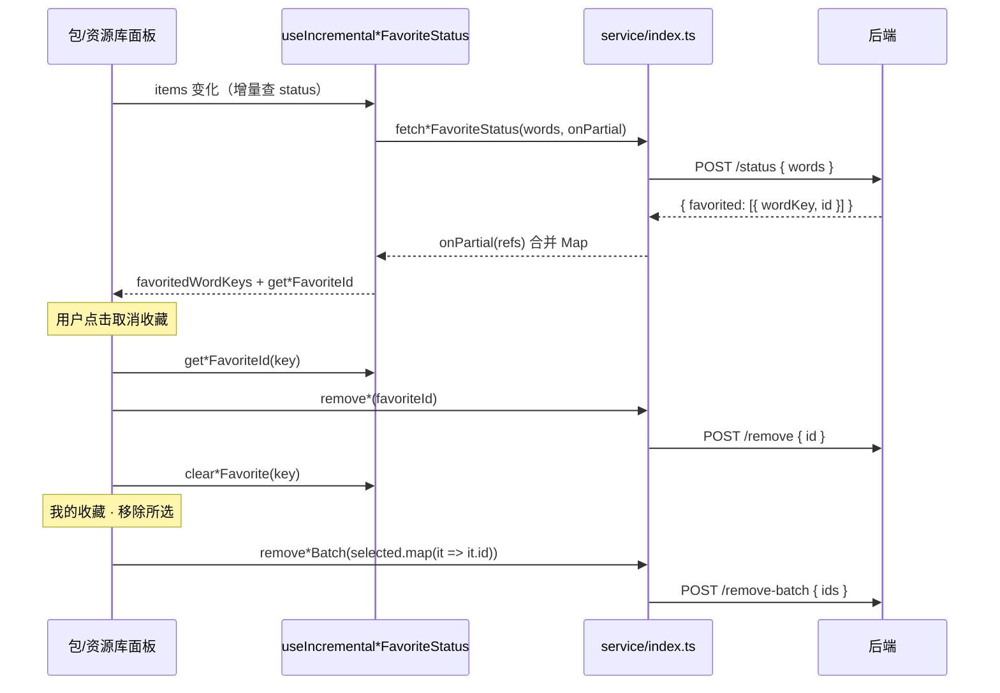

# 英语学习收藏：按记录 id 取消与批量移除

> **延伸阅读**  
> - 星标增量查询、`onPartial` 渐进点亮：[`favorite-star-incremental-ui.md`](./favorite-star-incremental-ui.md)  
> - `/status` 500 上限与分批：[`vocab-favorite-status-query.md`](./vocab-favorite-status-query.md)  
> - 包列表星标与收藏流：[`english-learning-pack-favorites.md`](./english-learning-pack-favorites.md)

## 1. 背景与目标

### 1.1 用户视角

在**资源库 / 单词包 / 经典句包**点星标取消收藏，或在**我的收藏**页勾选数百条后「移除所选」，系统应删除**当前这条收藏记录**，而不是仅凭词面 `word` 或英文原句 `english` 去匹配。

### 1.2 改前问题

| 问题 | 表现 |
|------|------|
| 删除键不精确 | `remove` 传 `word` / `english`，服务端再规范化或算 `content_key` 后删行；与列表行上的**收藏 id** 脱节 |
| 批量移除风暴 | 收藏页全选后对每条 `Promise.all(remove…)`，易触发 **429 Too Many Requests** |
| 取消后无法按 id 删 | `/status` 只返回 `favoritedWordKeys` / `favoritedContentKeys`，前端星标亮灭有 Set，但**没有**收藏记录 id，取消时只能再传文本 |

### 1.3 本轮目标

| 层级 | 目标 |
|------|------|
| API | 单删 `{ id }`；批量 `remove-batch` 传 `{ ids }`（单次 SQL，`In(ids)`） |
| `/status` | 返回 `{ favorited: [{ wordKey/contentKey, id }] }`，供星标与取消收藏共用 |
| 前端 | Hook 维护 `Map<规范化键, 收藏 id>`；面板取消时用 id；收藏页批量传 `entry.id` |
| 兼容 | `fetch*FavoriteStatus` 仍附带 `favoritedWordKeys` / `favoritedContentKeys` 派生字段，避免旧调用方断裂 |

**说明**：新增收藏仍传完整词条 body；去重规则未变（`wordKey` / `contentKey`）。若与仓库最新源码不一致，**以源码为准**。

---

## 2. 改动范围

| 说明 | 路径 |
|------|------|
| 单词 DTO（remove / remove-batch / status 入参不变） | `apps/backend/src/services/english-learning/dto/vocabulary-favorite.dto.ts` |
| 经典句 DTO | `apps/backend/src/services/english-learning/dto/classic-quote-favorite.dto.ts` |
| 路由与响应字段 | `apps/backend/src/services/english-learning/english-learning.controller.ts` |
| 删除与 status 查询实现 | `apps/backend/src/services/english-learning/english-learning.service.ts` |
| HTTP 封装、status 解析、`EnglishVocabFavoriteRef` 类型 | `apps/frontend/src/service/index.ts` |
| 单词增量 Hook | `apps/frontend/src/hooks/useIncrementalVocabFavoriteStatus.ts` |
| 经典句增量 Hook | `apps/frontend/src/hooks/useIncrementalClassicQuoteFavoriteStatus.ts` |
| 收藏列表批量移除 | `apps/frontend/src/views/englishLearning/favorites/useVocabularyFavoritesList.ts`、`useClassicQuoteFavoritesList.ts` |
| 资源库 / 包列表面板 | `VocabularyLibraryWordsPanel.tsx`、`ClassicQuotesLibraryWordsPanel.tsx`、`VocabularyPackList.tsx`、`ClassicQuotesPackList.tsx` |

**未纳入本文**：`TtsVoiceSetting.tsx` 下拉样式微调与收藏 id 无关。

---

## 3. 实现思路

### 3.1 为何用 id 而不是词面/原句

- 收藏表主键为 **UUID**；列表分页项、星标状态、批量勾选都以**行 id** 为稳定标识。
- 词面规范化（trim + 小写）与 `content_key`（SHA256）用于**去重与查状态**，适合「是否已收藏」，不适合作为删除主键（尤其未来若允许同形异义多条时）。
- 批量删除用 `DELETE … WHERE user_id = ? AND id IN (…)` **一条请求**，避免 N 次 `remove` 打满限流。

### 3.2 数据流（改后）



### 3.3 关键决策

1. **status 仍用 words/englishes 入参**：查询侧继续按规范化键批量匹配；响应升级为 `favorited` 数组，一次带回 id。
2. **Hook 从 `Set` 升级为 `Map<key, id>`**：`favoritedWordKeys` / `favoritedContentKeys` 由 `Map.keys()` 派生，星标 UI 无需改判断逻辑。
3. **新增收藏后写入 id**：`add*` 返回 `{ created, id }`（已存在也返回 `existed.id`）；前端 `set*FavoriteId(key, id)`，避免取消时 Map 无 id。
4. **批量上限 3000**：DTO `@ArrayMaxSize(3000)`，与收藏页全选规模对齐。

---

## 4. 关键代码与注释

### 4.1 后端 DTO：按 UUID 删除

**来源**：`apps/backend/src/services/english-learning/dto/vocabulary-favorite.dto.ts`（约 L37–L49）

```typescript
/** 取消收藏：按收藏记录 id */
export class VocabularyFavoriteRemoveDto {
	@IsUUID('4')
	id!: string;
}

/** 批量取消收藏（单次请求） */
export class VocabularyFavoriteRemoveBatchDto {
	@IsArray()
	@ArrayMaxSize(3000)
	@IsUUID('4', { each: true })
	ids!: string[];
}
```

经典句 `ClassicQuoteFavoriteRemoveDto` / `ClassicQuoteFavoriteRemoveBatchDto` 结构相同，字段名仍为 `id` / `ids`。

### 4.2 后端 Service：按 id 删除与 status 返回 ref

**来源**：`apps/backend/src/services/english-learning/english-learning.service.ts`（约 L3652–L3696、`removeClassicQuote*` / `listClassicQuoteFavoriteRefsForEnglishes` 对称）

```typescript
async removeVocabularyFavorite(
	userId: number,
	id: string,
): Promise<{ removed: boolean }> {
	// 说明：直接按主键 + userId 删行，不再从 word 反推 wordKey
	const r = await this.vocabFavoriteRepo.delete({ userId, id });
	return { removed: (r.affected ?? 0) > 0 };
}

/** 批量取消：id 去重后一条 DELETE … IN (…) */
async removeVocabularyFavoritesBatch(
	userId: number,
	ids: string[],
): Promise<{ removedCount: number }> {
	const unique = [...new Set(ids.map((id) => id.trim()).filter(Boolean))];
	if (unique.length === 0) {
		return { removedCount: 0 };
	}
	const r = await this.vocabFavoriteRepo.delete({
		userId,
		id: In(unique),
	});
	return { removedCount: r.affected ?? 0 };
}

/** status：入参仍是词面列表，返回已收藏项的 wordKey + 行 id */
async listVocabularyFavoriteRefsForWords(
	userId: number,
	words: string[],
): Promise<Array<{ wordKey: string; id: string }>> {
	const keys = [
		...new Set(
			words
				.map((w) => this.normalizeVocabularyFavoriteWordKey(w))
				.filter((k) => k.length > 0),
		),
	];
	if (keys.length === 0) {
		return [];
	}
	const rows = await this.vocabFavoriteRepo.find({
		where: { userId, wordKey: In(keys) },
		select: ['id', 'wordKey'],
	});
	return rows.map((r) => ({ wordKey: r.wordKey, id: r.id }));
}
```

### 4.3 后端 Controller：响应字段更名

**来源**：`apps/backend/src/services/english-learning/english-learning.controller.ts`（`vocabularyFavoritesStatus` / `removeVocabularyFavorite` 附近）

```typescript
// remove：dto.word → dto.id
const data = await this.englishLearningService.removeVocabularyFavorite(
	userId,
	dto.id,
);

// status：favoritedWordKeys → favorited（含 id）
const favorited =
	await this.englishLearningService.listVocabularyFavoriteRefsForWords(
		userId,
		dto.words,
	);
return { success: true, data: { favorited } };
```

### 4.4 前端 Service：remove、status 与渐进回调

**来源**：`apps/frontend/src/service/index.ts`（约 L766–L930）

```typescript
export const removeEnglishVocabularyFavorite = async (id: string) => {
	return await http.post<{ removed: boolean }>(
		`${ENGLISH_LEARNING_VOCABULARY_FAVORITES}/remove`,
		{ id },
	);
};

export const removeEnglishVocabularyFavoritesBatch = async (ids: string[]) => {
	return await http.post<{ removedCount: number }>(
		`${ENGLISH_LEARNING_VOCABULARY_FAVORITES}/remove-batch`,
		{ ids },
	);
};

export type EnglishVocabFavoriteRef = { wordKey: string; id: string };

type FavoriteStatusBatchOptions<T extends { id: string }> = {
	/** 每完成一小批 HTTP 即回调，便于 UI 渐进更新星标 */
	onPartial?: (refs: T[]) => void;
};

async function fetchVocabFavoriteStatusHttpBatch(
	batch: string[],
): Promise<EnglishVocabFavoriteRef[]> {
	const res = await http.post<{ favorited?: EnglishVocabFavoriteRef[] }>(
		`${ENGLISH_LEARNING_VOCABULARY_FAVORITES}/status`,
		{ words: batch },
		{ silent: true },
	);
	return Array.isArray(res.data?.favorited) ? res.data.favorited : [];
}

export const fetchEnglishVocabularyFavoriteStatus = async (
	words: string[],
	options?: FetchEnglishFavoriteStatusOptions,
) => {
	const favorited = await fetchVocabFavoriteStatusInHttpBatches(words, options);
	return {
		code: 200,
		success: true,
		message: '',
		data: {
			favorited,
			// 兼容：仍提供仅 key 的数组
			favoritedWordKeys: favorited.map((r) => r.wordKey),
		},
	};
};
```

**破坏性说明**：直接解析 `data.favoritedWordKeys` 的新代码应改用 `data.favorited`；本仓库内 Hook 已切换。外部客户端若仍读旧字段，需同步升级。

### 4.5 增量 Hook：`Map` 存 id，`onPartial` 合并

**来源**：`apps/frontend/src/hooks/useIncrementalVocabFavoriteStatus.ts`（约 L18–L121）

```typescript
const [favoriteIdByWordKey, setFavoriteIdByWordKey] = useState<
	Map<string, string>
>(() => new Map());

// 星标是否点亮：仍暴露 Set，由 Map 的 key 派生
const favoritedWordKeys = useMemo(
	() => new Set(favoriteIdByWordKey.keys()),
	[favoriteIdByWordKey],
);

const mergeFavoritedRefs = (refs: EnglishVocabFavoriteRef[]) => {
	setFavoriteIdByWordKey((prev) => {
		const next = new Map(prev);
		for (const r of refs) next.set(r.wordKey, r.id);
		return next;
	});
};

await fetchEnglishVocabularyFavoriteStatus(wordsToQuery, {
	onPartial: mergeFavoritedRefs, // 原 onPartialKeys(string[]) 已改为 refs
});

return {
	favoritedWordKeys,
	getVocabularyFavoriteId: (wordKey: string) => favoriteIdByWordKey.get(wordKey),
	setVocabularyFavoriteId: (wordKey: string, id: string) => { /* … */ },
	clearVocabularyFavorite: (wordKey: string) => { /* … */ },
};
```

`useIncrementalClassicQuoteFavoriteStatus` 对称：`contentKey` ↔ `favoriteIdByContentKey`。

### 4.6 包列表：取消收藏走 id

**来源**：`apps/frontend/src/views/englishLearning/pack/VocabularyPackList.tsx`（`toggleVocabularyFavorite` 约 L70–L95）

```typescript
if (currentlyFavorited) {
	const favoriteId = getVocabularyFavoriteId(wk);
	if (!favoriteId) return; // 无 id 则不误发 remove
	await removeEnglishVocabularyFavorite(favoriteId);
	clearVocabularyFavorite(wk);
} else {
	const res = await addEnglishVocabularyFavorite(item);
	const favoriteId = res.data?.id;
	if (favoriteId) setVocabularyFavoriteId(wk, favoriteId);
}
```

资源库 `VocabularyLibraryWordsPanel`、经典句两个面板逻辑相同。

### 4.7 我的收藏：批量移除单次请求

**来源**：`apps/frontend/src/views/englishLearning/favorites/useVocabularyFavoritesList.ts`（约 L142–L151）

```typescript
const onBatchRemove = useCallback(
	async (selected: EnglishVocabularyFavoriteListEntry[]) => {
		if (selected.length === 0) return;
		// 改前：Promise.all(selected.map(it => remove…(it.word))) → 易 429
		await removeEnglishVocabularyFavoritesBatch(
			selected.map((it) => it.id),
		);
		const gen = ++loadGenRef.current;
		await fetchFirstPage(gen);
	},
	[fetchFirstPage],
);
```

---

## 5. API 契约摘要

| 方法 | 路径 | 请求体（要点） | 响应 `data` |
|------|------|----------------|-------------|
| POST | `…/vocabulary-favorites/remove` | `{ id: UUID }` | `{ removed: boolean }` |
| POST | `…/vocabulary-favorites/remove-batch` | `{ ids: UUID[] }` | `{ removedCount: number }` |
| POST | `…/vocabulary-favorites/status` | `{ words: string[] }` | `{ favorited: { wordKey, id }[] }` |
| POST | `…/classic-quotes-favorites/remove` | `{ id: UUID }` | 同上 |
| POST | `…/classic-quotes-favorites/remove-batch` | `{ ids: UUID[] }` | 同上 |
| POST | `…/classic-quotes-favorites/status` | `{ englishes: string[] }` | `{ favorited: { contentKey, id }[] }` |

---

## 6. 兼容性与影响

| 项 | 说明 |
|----|------|
| 破坏性 | 旧客户端对 `remove` 传 `word`/`english`、读 `favoritedWordKeys` 将失效，需与本次前端一并发布 |
| 前端兼容层 | `fetch*FavoriteStatus` 仍返回 `favoritedWordKeys` / `favoritedContentKeys` 派生数组 |
| 新增收藏 | 不变；`add` 仍返回 `id`，取消收藏依赖该 id 或 `/status` 的 ref |
| 限流 | 收藏页全选改为 1 次 `remove-batch`，显著降低 429 风险 |

---

## 7. 建议回归

1. 资源库 / 单词包：收藏 → 取消 → 星标空心；Network 中 `remove` body 为 `id` 而非 `word`。
2. 经典句包：同上，`contentKey` 与 `id` 映射正确。
3. 我的收藏：勾选 100+ 条「移除所选」仅 1 次 `remove-batch`，无 429。
4. 滚动追加词条：`/status` 渐进返回后，新加载已收藏项可取消（Map 中已有 id）。
5. 重复点击收藏（已存在）：`add` 返回 `created: false` 仍带 `id`，取消收藏应成功。

---

## 8. 相关源码路径

| 说明 | 路径 |
|------|------|
| 单词收藏 DTO | `apps/backend/src/services/english-learning/dto/vocabulary-favorite.dto.ts` |
| 经典句收藏 DTO | `apps/backend/src/services/english-learning/dto/classic-quote-favorite.dto.ts` |
| 控制器 | `apps/backend/src/services/english-learning/english-learning.controller.ts` |
| 服务实现 | `apps/backend/src/services/english-learning/english-learning.service.ts` |
| 前端 API | `apps/frontend/src/service/index.ts` |
| 单词 Hook | `apps/frontend/src/hooks/useIncrementalVocabFavoriteStatus.ts` |
| 经典句 Hook | `apps/frontend/src/hooks/useIncrementalClassicQuoteFavoriteStatus.ts` |
| 收藏列表 Hook | `apps/frontend/src/views/englishLearning/favorites/useVocabularyFavoritesList.ts`、`useClassicQuoteFavoritesList.ts` |
