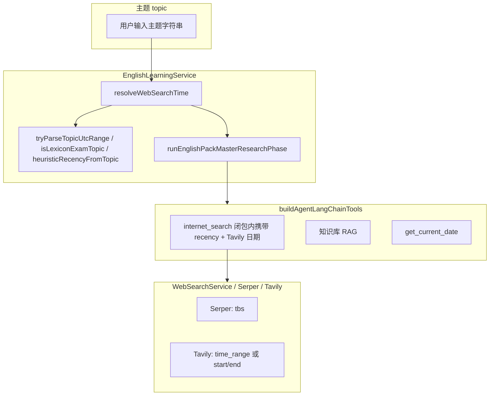

# 英语学习相关改动实现总览

本文基于当前仓库中**英语学习包生成、联网检索、主 Agent 提示与前端学习栏**等相关改动的落地结果整理，便于交接与回归。若与最新源码不一致，以源码为准。

> **专题补充**：主模型「按需联网」的提示词策略另有专文：`docs/english/english-learning-master-research-web-autonomous.md`。

---

## 1. 背景与目标

| 问题域 | 目标 |
|--------|------|
| **单词包 / 经典句主检索** | 登录用户拉取时由主 Agent 汇总要点；减少「为走流程必调联网」的惯性，改为**模型自主**判断是否需要 `internet_search`（配合 system / Human / 工具 description）。 |
| **联网时间参数** | 主题可含时效词或显式日期：统一抽象为 `WebSearchRecencyPreset`，Serper 映射 `tbs`，Tavily 使用 `time_range` 或合法 `start_date`/`end_date`；避免 Tavily **同日**起止导致 **400**。 |
| **工程结构** | 将超长常量从 `english-learning.service.ts` 拆出到 `constant.ts`、`prompt.ts`，主服务文件聚焦流程与算法。 |
| **前端学习栏** | 扩展「快捷意图」chip，支持再次点击**取消选中**；文案走 i18n。 |

---

## 2. 改动范围（文件清单）

| 路径 | 职责摘要 |
|------|-----------|
| `apps/backend/src/services/web-search/web-search.types.ts` | 定义 `WebSearchRecencyPreset` 及 Serper/Tavily 语义说明。 |
| `apps/backend/src/services/web-search/serper-search.service.ts` | `serperTbsFromRecency` + 请求体按需带 `tbs`。 |
| `apps/backend/src/services/web-search/tavily-search.service.ts` | `applyTavilyTimeFiltersToBody`、同日退化为 `time_range: 'day'`。 |
| `apps/backend/src/services/web-search/web-search.service.ts` | 统一入口透传 `recency` / Tavily 日期；`internet_search` 工具 **description** 增加调用约束。 |
| `apps/backend/src/services/agent/agent-tools.ts` | `buildAgentLangChainTools` 支持 `webSearchRecency`、`webSearchTavilyStartDate/EndDate`；工具顺序为 **联网 → RAG → 日期**；`get_current_date` 收紧描述。 |
| `apps/backend/src/services/english-learning/constant.ts` | 包生成数值常量 + `ENGLISH_PACK_WEB_SEARCH_RECENCY_HEURISTIC_RULES` 等。 |
| `apps/backend/src/services/english-learning/prompt.ts` | `AGENT_SYSTEM_PROMPT`、子模型静态 `VOCABULARY_*` / `CLASSIC_*` / `ENGLISH_PACK_LEARNER_CONTEXT_HINT`。 |
| `apps/backend/src/services/english-learning/english-learning.service.ts` | `resolveWebSearchTime`、`tryParseTopicUtcRange`、`heuristicRecencyFromTopic`、主检索 `userHumanText`、引用 `prompt`/`constant`。 |
| `apps/frontend/src/views/englishLearning/LearningToolbar.tsx` | `chipDefs`、选中态、`setIntentPrefix` 切换取消。 |
| `apps/frontend/src/i18n/locales/zh-CN.ts`、`en-US.ts` | chip 与 intent 前缀文案。 |
| `apps/frontend/src/views/englishLearning/VocabularySection.tsx`、`ClassicQuotesSection.tsx` | 与生成流程相关的少量同步（若有）。 |

> **专题补充（单词包词性 pos）**：`docs/english/english-vocabulary-pos.md` — 拉取词条增加英文词性缩写、全链路解析/收藏/UI/DOCX。

---

## 3. 架构与数据流



**说明**：`resolveWebSearchTime` 在**主 Agent 调用工具之前**即确定「若发生联网」时的时间参数；**是否**调用联网仍由模型结合提示词自主决定。

---

## 4. 实现过程（按模块）

### 4.1 类型与契约（`WebSearchRecencyPreset`）

1. 在 `web-search.types.ts` 增加联合类型，统一 Serper `qdr` 与 Tavily `time_range` 的语义。  
2. 约定：`none` 表示不传时间收窄；`default` 保留与历史 Serper 行为兼容；显式日历区间在 Tavily 侧由 `start_date`/`end_date` 表达且**起止不得同日**（同日改走 `time_range: 'day'`）。

### 4.2 Serper 实现

1. 抽出 `serperTbsFromRecency`：`default` → `qdr:d`，`none` → 不传 `tbs`，其余映射 `qdr:w/m/y`。  
2. `formatSearchContextForPrompt` 组装 `body`，仅当 `tbs != null` 时写入字段。

### 4.3 Tavily 实现

1. `tavilyTimeRangeFromRecency`：`day` 映射为 Tavily 的 `time_range: 'day'`（避免误用同日 `start_date`/`end_date` 触发 400）。  
2. `applyTavilyTimeFiltersToBody`：**优先**合法且不同的 ISO 起止；否则回退 `time_range`。

### 4.4 WebSearchService 与 LangChain 工具

1. `formatSearchContextForPrompt` 将 `tavilyStartDate`/`tavilyEndDate` 传入 Tavily 层。  
2. `createLangChainWebSearchTools` 闭包捕获 `recency` 与日期，使每次 `internet_search` 调用沿用同一策略；并在 `description` 中写明**禁止例行联网**（与主 Agent 提示对齐）。

### 4.5 `buildAgentLangChainTools`

1. 扩展 `BuildAgentLangChainToolsDeps`，传入 `webSearchRecency` 与可选 Tavily 起止。  
2. 将 `createAgentDateTool()` 置于列表**末尾**，并收紧日期工具描述，降低「起手先查日期」概率。  
3. `BuildAgentLangChainToolsDeps.includeCurrentDateTool` 已在类型与注释中预留，但 `buildAgentLangChainTools` 内**尚未**按该字段分支；英语学习主检索处对 `includeCurrentDateTool: infer…(topic)` 的传参仍**整段注释**，故当前行为与聊天侧一致：**始终**注册 `get_current_date`。

### 4.6 EnglishLearningService

1. **主题 → 联网时间**：`resolveWebSearchTime` → 典籍/考试类 `none` → 否则 `tryParseTopicUtcRange` → 否则 `heuristicRecencyFromTopic`（规则表在 `constant.ts`）。  
2. **主检索**：`buildAgentLangChainTools({ ..., webSearchRecency, webSearchTavilyStartDate, webSearchTavilyEndDate })`；`systemPrompt: AGENT_SYSTEM_PROMPT`；Human 文案强调按需工具。  
3. **子模型**：`vocabularySystemStatic` / `classicQuotesSystemStatic` 由 `prompt.ts` 常量与 `topic`、学习语境拼接。

### 4.7 前端 LearningToolbar

1. `chipDefs` 增加多类意图 key，对应 `englishLearning.chip.*` 与 `englishLearning.intent.*`。  
2. 点击时若已选中同一 `prefix` 则 `setIntentPrefix('')` 实现取消；`aria-pressed` 提升可访问性。

---

## 5. 关键代码与讲解注释

### 5.1 统一时间预设类型

**来源**：`apps/backend/src/services/web-search/web-search.types.ts`（约 L31–L43）

```typescript
/**
 * Serper `tbs`（时间范围）与 Tavily `time_range` 的统一预设。
 * - `default`：未显式指定时的兼容行为（Serper 仍带 `qdr:d`，与历史实现一致）。
 * - `none`：不按时间收窄（Serper 不传 `tbs`；Tavily 不传 `time_range`），适合典籍、考试词表等。
 * - 其余：Serper 映射到 Google `qdr:*`；Tavily 统一用 `time_range`（含 `day`）。显式日历区间用 `start_date`/`end_date` 时二者须不同，否则服务端 400。
 */
export type WebSearchRecencyPreset =
	| 'default'
	| 'none'
	| 'day'
	| 'week'
	| 'month'
	| 'year';
```

### 5.2 Serper：按 recency 决定是否带 `tbs`

**来源**：`apps/backend/src/services/web-search/serper-search.service.ts`（`serperTbsFromRecency` 与请求体组装附近）

```typescript
/** Serper Google `tbs` 时间过滤参数；`null` 表示请求体中不传该字段 */
function serperTbsFromRecency(
	recency?: WebSearchRecencyPreset,
): string | null | undefined {
	// 说明：与历史一致，未传或 default 时仍用「近一日」收窄
	if (recency == null || recency === 'default') {
		return 'qdr:d';
	}
	// 说明：英语学习主题推断为典籍/GRE 等时传 none，避免误伤经典页
	if (recency === 'none') {
		return null;
	}
	const map: Record<
		Exclude<WebSearchRecencyPreset, 'default' | 'none'>,
		string
	> = {
		day: 'qdr:d',
		week: 'qdr:w',
		month: 'qdr:m',
		year: 'qdr:y',
	};
	return map[recency];
}

// ... formatSearchContextForPrompt 内：
			const tbs = serperTbsFromRecency(options?.recency);
			const body: Record<string, unknown> = {
				q,
				hl: 'zh-cn',
				num: options?.num ?? 10,
			};
			if (tbs != null) {
				body.tbs = tbs; // 说明：none 时 serperTbsFromRecency 返回 null，此处不写入 tbs
			}
```

### 5.3 Tavily：写入请求体的时间逻辑

**来源**：`apps/backend/src/services/web-search/tavily-search.service.ts`（约 L50–L78，`applyTavilyTimeFiltersToBody`）

```typescript
function applyTavilyTimeFiltersToBody(
	body: Record<string, unknown>,
	opts: {
		recency?: WebSearchRecencyPreset;
		startDate?: string;
		endDate?: string;
	},
): void {
	const start = opts.startDate?.trim();
	const end = opts.endDate?.trim();
	if (
		start &&
		end &&
		isTavilyIsoDateString(start) &&
		isTavilyIsoDateString(end)
	) {
		// 说明：Tavily 返回 400「start_date and end_date cannot be the same」
		if (start === end) {
			body.time_range = 'day'; // 说明：单日需求统一用 day，勿传相同起止
			return;
		}
		body.start_date = start;
		body.end_date = end;
		return;
	}
	const timeRange = tavilyTimeRangeFromRecency(opts.recency);
	if (timeRange != null) {
		body.time_range = timeRange;
	}
}
```

### 5.4 WebSearchService：`internet_search` 与统一入口

**来源**：`apps/backend/src/services/web-search/web-search.service.ts`（约 L48–L107）

```typescript
async formatSearchContextForPrompt(
	query: string,
	options?: {
		provider?: WebSearchProvider;
		num?: number;
		recency?: WebSearchRecencyPreset;
		/** Tavily：区间起点 YYYY-MM-DD（须与 tavilyEndDate 不同；相同则内部改用 time_range: day） */
		tavilyStartDate?: string;
		tavilyEndDate?: string;
	},
): Promise<WebSearchContextResult> {
	const provider = this.resolveProvider(options?.provider);
	if (provider === 'tavily') {
		return this.tavilySearchService.formatSearchContextForPrompt(query, {
			maxResults: options?.num ?? 10,
			recency: options?.recency,
			startDate: options?.tavilyStartDate,
			endDate: options?.tavilyEndDate,
		});
	}
	return this.serperSearchService.formatSearchContextForPrompt(query, {
		num: options?.num,
		recency: options?.recency,
	});
}

// createLangChainWebSearchTools 内 DynamicTool（节选）：
description:
	'联网搜索公开网页。输入简洁的检索关键词或问题，返回可引用的网页标题、链接与摘要。' +
	'【调用约束】仅在确有公开网页信息缺口时调用（事实核验、时效、冷门专名/作品、出处线索等）；禁止为「先搜再说」或走流程而例行调用；若常识与知识库已足够则不要调用。',
func: async (input: string) => {
	const r = await this.formatSearchContextForPrompt(
		typeof input === 'string' ? input : String(input ?? ''),
		{ provider, recency, tavilyStartDate, tavilyEndDate },
	);
	opts?.onSearchComplete?.(r);
	return r.promptText ?? '（无检索结果）';
},
```

### 5.5 Agent 工具组装与英语学习注入

**来源**：`apps/backend/src/services/agent/agent-tools.ts`（约 L24–L66）

```typescript
export function buildAgentLangChainTools(
	deps: BuildAgentLangChainToolsDeps,
	opts?: BuildAgentLangChainToolsOpts,
): DynamicTool[] {
	const tools: DynamicTool[] = [
		// 说明：联网工具闭包内已绑定 recency / Tavily 区间，与主题推断一致
		...deps.webSearchService.createLangChainWebSearchTools({
			onSearchComplete: opts?.onInternetSearchComplete,
			recency: deps.webSearchRecency,
			tavilyStartDate: deps.webSearchTavilyStartDate,
			tavilyEndDate: deps.webSearchTavilyEndDate,
		}),
		deps.knowledgeQaService.createAgentKnowledgeRagTool(deps.userId),
		// 说明：日期工具置后；deps.includeCurrentDateTool 暂未接入分支，当前等价于始终注册
		createAgentDateTool(),
	];
	return tools;
}
```

### 5.6 主题 → 联网时间策略（节选）

**来源**：`apps/backend/src/services/english-learning/english-learning.service.ts`（约 L501–L535，`isLexiconExamTopic` / `resolveWebSearchTime`）

```typescript
/** 典籍 / 考试 / 辞典向：不做联网时间收窄 */
private isLexiconExamTopic(topic: string): boolean {
	return /莎士比亚|莎翁|Sonnets?|十四行|傲慢与偏见|圣经|荷马|古希腊|罗马|唐诗|宋词|文言|古文|名言|格言|谚语|俚语|GRE|托福|雅思|IELTS|TOEFL|四六级|CET-|专四|专八|考研英语|PETS|托业|BEC|教材|课文|词根|词缀|WordNet|牛津|朗文|柯林斯|韦氏/i.test(
		topic.trim(),
	);
}

/**
 * 主检索联网时间策略：显式日期优先，否则关键词启发。
 * Tavily 合法起止走 `start_date`/`end_date`（见 `applyTavilyTimeFiltersToBody`）。
 */
private resolveWebSearchTime(topic: string): {
	recency: WebSearchRecencyPreset;
	tavilyStartDate?: string;
	tavilyEndDate?: string;
} {
	const t = topic.trim();
	if (!t) {
		return { recency: 'none' };
	}
	if (this.isLexiconExamTopic(t)) {
		return { recency: 'none' }; // 说明：避免 GRE/莎翁等主题被时间条误伤
	}

	const explicit = this.tryParseTopicUtcRange(t);
	if (explicit) {
		return {
			// 说明：Serper 无精确 ISO 区间，用跨度映射到 qdr；Tavily 用精确起止
			recency: this.recencyFromUtcSpan(explicit.start, explicit.end),
			tavilyStartDate: explicit.start,
			tavilyEndDate: explicit.end,
		};
	}

	return { recency: this.heuristicRecencyFromTopic(t) };
}
```

### 5.7 主检索 Human 与工具绑定（节选）

**来源**：`apps/backend/src/services/english-learning/english-learning.service.ts`（约 L721–L759，`runEnglishPackMasterResearchPhase` 内）

```typescript
// 根据主题推断联网检索时间策略（显式公历 → Tavily 区间；Serper 用粗粒度 tbs）
const webSearchTime = this.resolveWebSearchTime(topic);
const tools = buildAgentLangChainTools({
	webSearchService: this.webSearchService,
	knowledgeQaService: this.knowledgeQaService,
	userId,
	webSearchRecency: webSearchTime.recency,
	webSearchTavilyStartDate: webSearchTime.tavilyStartDate,
	webSearchTavilyEndDate: webSearchTime.tavilyEndDate,
	// includeCurrentDateTool:
	// 	this.inferEnglishPackUserNeedsCurrentDateTool(topic),
});

const agent = createAgent({
	model: mainLlm,
	tools,
	systemPrompt: AGENT_SYSTEM_PROMPT,
	middleware: [
		toolCallLimitMiddleware({
			runLimit: 12,
			threadLimit: 12,
			exitBehavior: 'continue',
		}),
	],
});

// 说明：与 system 中「按需工具 / 允许零工具路径」一致，弱化「必须先检索」
const userHumanText = `任务类型：${kindLabel}
主题/需求：${topic.trim()}
学习语境：${ENGLISH_PACK_LEARNER_CONTEXT_HINT}

请先判断是否真的需要调用工具（互联网搜索 / 知识库检索 / 当前日期）。若主题以课内词汇、搭配扩展、词根词缀等为主、且无必须核验的公开事实或出处缺口，可直接整理要点，**不必**为完成任务而例行联网。确有必要时再按需调用工具并消化结果，然后输出一段简明要点（中文为主，可夹关键英文术语），供下游子模型扩展词条或句子方向使用；不要输出 JSON，不要输出 markdown 代码块。`;
```

### 5.8 启发式 recency 规则表（摘录）

**来源**：`apps/backend/src/services/english-learning/constant.ts`（约 L32–L71；末尾为「新闻风味」补充分支，见 `heuristicRecencyFromTopic`）

```typescript
/** 主 Agent 主题 → 联网 recency 启发规则（顺序敏感：先匹配先返回） */
export const ENGLISH_PACK_WEB_SEARCH_RECENCY_HEURISTIC_RULES: ReadonlyArray<{
	preset: WebSearchRecencyPreset;
	re: RegExp;
}> = [
	{
		preset: 'day',
		re: /今日|今天|本日|昨夜|昨晚|今早|刚才|刚刚|实时|突发|小时前|分钟前|即时|快讯|头条|\btoday\b|\btonight\b|\blast night\b|\bthis morning\b|\bbreaking news\b|\bbreaking\b/i,
	},
	{
		preset: 'week',
		re: /本周|这周|近一周|过去一周|\bpast week\b|\bthis week\b/i,
	},
	{
		preset: 'month',
		re: /本月|这个月|近一月|近一个月|\bthis month\b/i,
	},
	{
		preset: 'year',
		re: /今年|本年|年初至今|year to date|\bthis year\b|20[12][0-9]\s*年|20[12][0-9][年.\-/]/i,
	},
	{
		preset: 'year',
		re: /近几年|近些年|近若干年|最近一年|过去一年|近一年|过去数年|\brecent years\b|\bin the past year\b|\bover the past year\b/i,
	},
	{
		preset: 'month',
		re: /近期|近段时间|近段时期|近来一段|最近几个月|过去几个月|近几个月|近两三个月|近半年|近三十天|近30天|\bover the past (few|several) months\b|\bin recent months\b/i,
	},
	{
		preset: 'week',
		re: /最近|近来|近况|近些天|近些日子|近几日|近几天|这些天|这几天|前些天|前两天|这两天|上一阵|一阵子|前不久|\brecently\b|\brecent\b|\blately\b|\bin recent days\b|\bover the past few\b|\bthe last few (days|weeks)\b/i,
	},
];

// 说明：若上表均未命中，但主题带「最新/新闻」等风味，则 `heuristicRecencyFromTopic` 中再判为 week
export const ENGLISH_PACK_WEB_SEARCH_RECENCY_NEWS_FLAVOR_RE =
	/最新|热点|新闻|资讯|动态|舆情|股价|汇率|财报|融资|发布会|上新|单曲打榜|票房|赛程|赛果|转会/i;
```

### 5.9 主 Agent System 中工具策略（摘录）

**来源**：`apps/backend/src/services/english-learning/prompt.ts`（`AGENT_SYSTEM_PROMPT` 模板字符串内，约 L14–L29）

```text
# Tool Selection Strategy (ReAct)

**总原则**：工具按需使用；**不要为了「完成任务」或「先搜再说」而例行调用任何工具**。可先基于主题做常识判断，再决定是否需要 Action。

- **互联网搜索**：**仅当**存在明确的公开网页信息缺口时再调用——例如：需核验的时效事实、冷门专名/作品、争议性说法、名言/金句的可靠出处线索等；且**常识与知识库不足以**支撑高质量要点时。以下情况**倾向不调**联网：课内词汇表、词根词缀、通用搭配、无争议的基础语法/学习场景、纯主题发散的词汇扩展等。
- **知识库检索**：与用户自有文档、笔记、已入库知识相关时**优先**考虑；若与主题无关可不调。
- **当前日期**：**仅当**推理或要点必须锚定「今天」的公历日期时才调用。

**允许零工具路径**：若判断无需任何工具即可输出高质量、可核对的扩展要点，可直接进入 Final Output（仍须遵守「待查证」「常识推测」等诚实标注）。

# Workflow

1. **Thought**：分析「英语学习主题」与语境，判断**是否真的需要**工具；能不调则不调，尤其避免无必要的联网。
2. **Action**：仅在确有必要时执行工具调用（可为零次）。
3. **Observation & Digestion**：**【关键步骤】**若调用了工具，返回内容可能很长，你必须在内部消化，分层摘录关键词、搭配方向与可核对出处，**过滤掉冗余背景与细节**。
4. **Final Output**：基于（若有）工具消化结果与常识判断，组织成简短条目输出。
```

### 5.10 前端快捷意图与取消选中

**来源**：`apps/frontend/src/views/englishLearning/LearningToolbar.tsx`（`chipDefs` 约 L12–L63；渲染约 L113–L134）

```typescript
const chipDefs = [
	{
		key: 'vocabulary',
		labelKey: 'englishLearning.chip.vocabulary' as const,
		prefixKey: 'englishLearning.intent.vocabulary' as const,
	},
	// 说明：morphology / collocations / confusables / pronunciation / speaking / translate / reading / literature 等项结构相同，见源码
	{
		key: 'grammar',
		labelKey: 'englishLearning.chip.grammar' as const,
		prefixKey: 'englishLearning.intent.grammar' as const,
	},
] as const;

// 渲染片段：
{chipDefs.map((c) => {
	const prefix = t(c.prefixKey);
	const selected = englishAgentStore.pendingIntentPrefix === prefix;
	return (
		<Button
			key={c.key}
			aria-pressed={selected}
			onClick={() =>
				englishAgentStore.setIntentPrefix(selected ? '' : prefix)
			}
		>
			{t(c.labelKey)}
		</Button>
	);
})}
```

---

## 6. 兼容性与影响

- **聊天 Agent**：同样使用 `buildAgentLangChainTools` 与 `internet_search`；未传 `webSearchRecency` 时行为与历史 Serper `qdr:d` 兼容；工具 **description** 全局变严，若聊天侧「不敢搜」需再评估是否拆分工具工厂。  
- **软约束**：主检索是否联网依赖模型；若需硬保证不联网，需不注册工具或 middleware（见专文）。

---

## 7. 回归建议

1. 单词包 / 经典句 SSE：弱时效主题观察是否仍误触 `internet_search`；强时效主题是否仍能搜。  
2. Tavily：主题含「单日」与「区间」各测一条，确认无 400。  
3. 典籍类主题：确认 `recency: 'none'` 时 Tavily 不传 `time_range`。  
4. 前端：快捷意图选中 / 取消、`pendingIntentPrefix` 与发送正文拼接。

---

## 8. 相关源码路径速查

| 说明 | 路径 |
|------|------|
| 主检索 + 主题时间推断 | `apps/backend/src/services/english-learning/english-learning.service.ts` |
| 主 Agent / 子模型静态 Prompt | `apps/backend/src/services/english-learning/prompt.ts` |
| 启发规则常量 | `apps/backend/src/services/english-learning/constant.ts` |
| Agent 工具组装 | `apps/backend/src/services/agent/agent-tools.ts` |
| 联网统一入口与工具 | `apps/backend/src/services/web-search/web-search.service.ts` |
| Tavily 时间写入 | `apps/backend/src/services/web-search/tavily-search.service.ts` |
| Serper `tbs` | `apps/backend/src/services/web-search/serper-search.service.ts` |
| 类型预设 | `apps/backend/src/services/web-search/web-search.types.ts` |
| 学习栏 chip | `apps/frontend/src/views/englishLearning/LearningToolbar.tsx` |
| 中英文案 | `apps/frontend/src/i18n/locales/zh-CN.ts`、`en-US.ts` |

若与仓库最新源码不一致，以源码为准。
