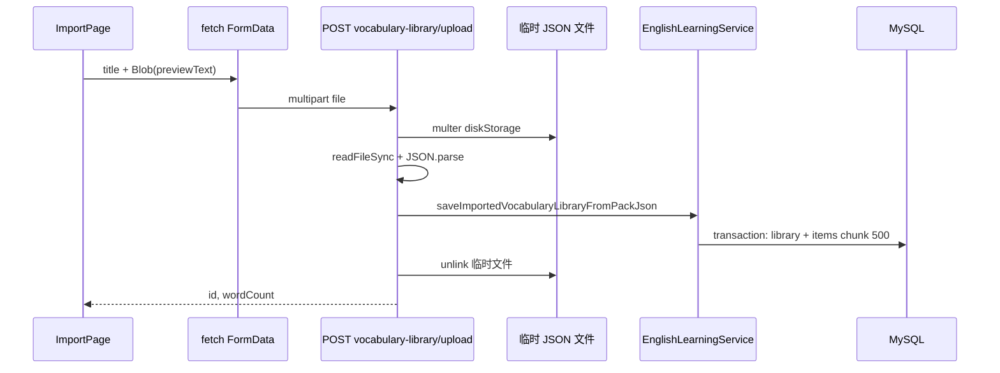

# 英语学习：单词库持久化、JSON 导入与左栏入口整合

> **经典语句库**：与本文对称的语句包导入、资源库浏览实现见 [classic-quotes-library-import.md](./classic-quotes-library-import.md)。  
> **音节划分 `segmentation` + 导入页编辑后实时校验**：见 [vocab-segmentation-import.md](./vocab-segmentation-import.md)。


## 1. 背景与目标

**用户视角**：在英语学习左栏除「按主题拉取单词 / 经典语句」外，需要能把本地 **JSON 单词包** 导入并**长期保存为单词库**；大包体不能因 HTTP body 限制失败；库内单词要支持**分页查询**，不能整包塞进 JSON 列；导入入口应集中在「单词库 / 语句库」区域，不与「单词资料 / 经典语句」拉取区重复。

**技术目标（本轮）**：

1. 独立导入页 `/english-learning/import?kind=vocab|classic`：拖拽/选文件、Monaco 预览、校验、标题、保存。
2. 后端 **主表 + 词条子表** 存储单词库，事务批量写入，提供库列表与库内词条分页 API。
3. 大包保存走 **multipart 上传 JSON 文件**，服务端解析后落库并删除临时文件。
4. 左栏 **`EnglishSource`** 承载「导入单词包 / 导入语句包」与「词库 / 语料库」入口；**移除** `VocabularySection` / `ClassicQuotesSection` 标题旁的导入链接。

若与仓库最新源码不一致，**以源码为准**。

---

## 2. 改动范围

| 层级 | 路径 | 说明 |
|------|------|------|
| 实体 | `apps/backend/src/services/english-learning/english-vocabulary-library.entity.ts` | 单词库（包）元数据 |
| 实体 | `apps/backend/src/services/english-learning/english-vocabulary-library-item.entity.ts` | 库内词条，一行一词 |
| DTO | `apps/backend/src/services/english-learning/dto/save-vocabulary-library.dto.ts` | JSON body 保存校验（小包） |
| 服务 | `apps/backend/src/services/english-learning/english-learning.service.ts` | 解析、事务落库、分页查询 |
| 控制器 | `apps/backend/src/services/english-learning/english-learning.controller.ts` | REST + multipart 上传 |
| 模块 | `apps/backend/src/services/english-learning/english-learning.module.ts` | 注册 TypeORM 实体 |
| 迁移 | `apps/backend/src/migrations/1778901200000-vocabulary-library-items.ts` | 建子表、删主表 `items` JSON 列 |
| 导入页 | `apps/frontend/src/views/englishLearning/EnglishLearningImportPage.tsx` | 预览、保存、重新上传 |
| 库入口 | `apps/frontend/src/views/englishLearning/EnglishSource.tsx` | 左栏单词库/语句库 UI |
| 首页 | `apps/frontend/src/views/englishLearning/index.tsx` | 挂载 `EnglishSource` |
| 拉取区 | `VocabularySection.tsx`、`ClassicQuotesSection.tsx` | 去掉标题旁导入按钮 |
| API | `apps/frontend/src/service/api.ts`、`service/index.ts` | 常量与请求封装 |
| HTTP | `apps/frontend/src/utils/fetch.ts` | 原生 `FormData` 直传 |
| 文案 | `apps/frontend/src/i18n/locales/zh-CN.ts`、`en-US.ts` | 库/导入相关键 |

**会话早期已落地、本 diff 可能未全部包含**：嵌套路由 `EnglishLearningLayout`、`Header` 面包屑、`DragDropFileUpload` 组件等，见 `docs/english/english-learning-json-import.md` 或仓库历史提交。

---

## 3. 实现思路与架构

### 3.1 为何不用 JSON 列存整包词条？

| 方案 | 优点 | 缺点 |
|------|------|------|
| `library.items` JSON 数组 | 实现快 | 无法 SQL 分页；单包过大时行膨胀；难索引 `word` |
| **主表 + `library_item` 子表** | `LIMIT/OFFSET` 按库查词；`sort_order` 保序；`ON DELETE CASCADE` | 写入需事务 + 批量 insert |

与流式生成用的 `english_vocabulary`（按 stream/round 批次）**分表**：导入库是用户命名的**快照**，生命周期与 SSE 拉取历史不同。

### 3.2 为何大包走 multipart 而非 JSON body？

Express 默认 `application/json` body 约 **100KB** 级限制。用户上传 ~500KB JSON 时出现 `PayloadTooLargeError`。  
**multipart + multer 磁盘临时文件**（单文件上限 25MB）绕开 JSON 解析器体积限制；读盘后 `JSON.parse`，落库后在 `finally` 中 **`unlink` 临时文件**。

### 3.3 端到端数据流（单词库保存）



### 3.4 入口职责划分

| 区域 | 职责 |
|------|------|
| `VocabularySection` / `ClassicQuotesSection` | 仅「按主题拉取」+ 列表/收藏/历史 |
| `EnglishSource`（×2） | 跳转导入页；后续可接「词库/语料库」列表页 |
| `EnglishLearningImportPage` | 解析预览、校验、保存到单词库 |

---

## 4. 实现过程（分步）

### 步骤 1：数据库建模与迁移

1. 新建 `english_vocabulary_library`：仅存 `user_id`、`title`、`word_count`、`created_at`。
2. 新建 `english_vocabulary_library_item`：`library_id` 外键 **CASCADE**，`sort_order` 保留导入顺序，字段与收藏表类似（`word`、`ipa`、`pos`、`translation_zh`、`example`）。
3. 迁移 `1778901200000-vocabulary-library-items.ts`：创建子表；若主表仍有 `items` JSON 列则 **DROP**（旧数据需自行迁移或重新导入）。

### 步骤 2：服务层解析与事务写入

1. **`parseVocabularyPackRootToLibraryItems`**：与前端 `parseVocabularyImport` 规则一致（数组或 `{ items: [] }`，`word`+`ipa` 必填）。
2. **`persistVocabularyLibrary`**：`dataSource.transaction` 内先 `save` 主表，再 `map` 为子表行，`sortOrder = index`，每 **500** 条 `save` 一块。
3. **`saveImportedVocabularyLibraryFromPackJson`**：供上传接口在 `JSON.parse` 后调用。
4. **`listVocabularyLibraries` / `listVocabularyLibraryItems`**：鉴权 `userId + libraryId`，词条按 `sortOrder ASC` 分页。

### 步骤 3：HTTP API

| 方法 | 路径 | 说明 |
|------|------|------|
| POST | `/english-learning/vocabulary-library` | 小体积：JSON body `{ title, items[] }` |
| POST | `/english-learning/vocabulary-library/upload` | 推荐：`multipart` 字段 `file` + `title` |
| GET | `/english-learning/vocabulary-libraries` | 当前用户的库列表 |
| GET | `/english-learning/vocabulary-libraries/:id/items` | 库内词条分页 |

上传接口在 **`finally`** 中删除 multer 写入的临时路径，成功或解析失败均执行。

### 步骤 4：前端导入页

1. 本地 `FileReader` / 拖拽 → `processJsonFile` → `previewText` + `parsedVocab`。
2. 保存：**不再** POST 巨型 JSON body；改为 `uploadEnglishVocabularyLibraryJson`，用当前编辑器文本 `previewText` 生成 `Blob` 作为 `file`。
3. **重新上传**：常驻隐藏 `input[type=file]`，清空预览后 `click()` 打开选文件（预览态下 `DragDropFileUpload` 未挂载）。

### 步骤 5：左栏 `EnglishSource` 与入口收敛

1. `index.tsx` 在拉取区块下方增加两个 `EnglishSource`（单词库 / 语句库文案）。
2. 按钮：「导入单词/语句」→ `/english-learning/import?kind=...`；「词库/语料库」文案走 i18n（后续可改路由到列表页）。
3. 从 `VocabularySection`、`ClassicQuotesSection` **删除** 标题行内的 link 导入按钮及 `useNavigate` 逻辑。

### 步骤 6：`fetch` 支持 FormData

当 `config.data instanceof FormData` 时，直接作为 body，并删除默认 `Content-Type: application/json`，由运行时自动带 `multipart` boundary。

---

## 5. 关键代码与详细注释

### 5.1 单词库主表与子表实体

**来源**：`apps/backend/src/services/english-learning/english-vocabulary-library.entity.ts`（约 L1–L35）

```typescript
/**
 * 说明：本表只描述「一包」的元信息，不存词条数组。
 * wordCount 为冗余计数，列表页可直接展示，无需 COUNT 子表（写入时同步维护）。
 */
@Entity('english_vocabulary_library')
@Index('idx_evl_user_created', ['userId', 'createdAt']) // 说明：按用户 + 时间倒序拉库列表
export class EnglishVocabularyLibrary {
	@PrimaryGeneratedColumn('uuid')
	id!: string;

	@Column({ name: 'user_id', type: 'int' })
	userId!: number; // 说明：与 JwtGuard 注入的 userId 一致，所有查询带此条件

	@Column({ type: 'varchar', length: 200 })
	title!: string; // 说明：用户在导入页输入的标题，写入前 trim + 截断

	@Column({ name: 'word_count', type: 'int' })
	wordCount!: number; // 说明：等于成功写入子表的行数

	@CreateDateColumn({ name: 'created_at', type: 'timestamp' })
	createdAt!: Date;

	// 说明：ORM 关联，删除主表行时子表由 FK CASCADE 级联删除
	@OneToMany(() => EnglishVocabularyLibraryItem, (item) => item.library)
	items!: EnglishVocabularyLibraryItem[];
}
```

**来源**：`apps/backend/src/services/english-learning/english-vocabulary-library-item.entity.ts`（约 L14–L51）

```typescript
@Entity('english_vocabulary_library_item')
@Index('idx_evli_library_sort', ['libraryId', 'sortOrder']) // 说明：分页 ORDER BY sort_order 走索引
@Index('idx_evli_user_library', ['userId', 'libraryId'])   // 说明：鉴权 + 按库过滤
export class EnglishVocabularyLibraryItem {
	@PrimaryGeneratedColumn('uuid')
	id!: string;

	@Column({ name: 'library_id', type: 'varchar', length: 36 })
	libraryId!: string;

	@ManyToOne(() => EnglishVocabularyLibrary, (lib) => lib.items, {
		onDelete: 'CASCADE', // 说明：删库即删全部词条，避免孤儿行
	})
	@JoinColumn({ name: 'library_id' })
	library!: EnglishVocabularyLibrary;

	@Column({ name: 'user_id', type: 'int' })
	userId!: number; // 说明：冗余 userId，列表词条时不必 JOIN 主表即可校验

	@Column({ name: 'sort_order', type: 'int' })
	sortOrder!: number; // 说明：导入时按数组下标 0..n-1 写入，保证顺序可复现

	@Column({ type: 'varchar', length: 500 })
	word!: string;

	@Column({ type: 'varchar', length: 2000, default: '' })
	ipa!: string;

	@Column({ type: 'varchar', length: 64, default: '' })
	pos!: string;

	@Column({ name: 'translation_zh', type: 'text' })
	translationZh!: string;

	@Column({ type: 'text' })
	example!: string;
}
```

### 5.2 事务落库与分块插入

**来源**：`apps/backend/src/services/english-learning/english-learning.service.ts`（`persistVocabularyLibrary` 约 L1167–L1214）

```typescript
/**
 * 说明：任意一步失败则整包回滚，不会出现「有主表无子表」的半成品。
 */
private async persistVocabularyLibrary(
	userId: number,
	title: string,
	itemsJson: EnglishVocabularyPackItemJson[],
): Promise<{ id: string; wordCount: number }> {
	const t = title.trim().slice(0, 200);
	if (!t) {
		throw new BadRequestException('标题不能为空');
	}
	const wordCount = itemsJson.length;

	return this.dataSource.transaction(async (manager) => {
		// 说明：事务内使用同一 manager 的 Repository，保证同一连接
		const libRepo = manager.getRepository(EnglishVocabularyLibrary);
		const itemRepo = manager.getRepository(EnglishVocabularyLibraryItem);

		const lib = await libRepo.save(
			libRepo.create({
				userId,
				title: t,
				wordCount, // 说明：与即将插入的子表行数一致
			}),
		);

		const itemRows = itemsJson.map((item, index) =>
			itemRepo.create({
				libraryId: lib.id,
				userId,
				sortOrder: index, // 说明：与 JSON 数组顺序一致
				word: item.word,
				ipa: item.ipa,
				pos: item.pos ?? '',
				translationZh: item.translationZh,
				example: item.example,
			}),
		);

		const chunkSize = 500;
		// 说明：避免单次 INSERT 参数过多；500 为经验值，可按驱动调优
		for (let i = 0; i < itemRows.length; i += chunkSize) {
			await itemRepo.save(itemRows.slice(i, i + chunkSize));
		}

		return { id: lib.id, wordCount: lib.wordCount };
	});
}
```

### 5.3 Multipart 上传、解析、删临时文件

**来源**：`apps/backend/src/services/english-learning/english-learning.controller.ts`（`saveVocabularyLibraryUpload` 约 L319–L365）

```typescript
/**
 * 说明：FileInterceptor('file') 要求前端 FormData 字段名必须为 file。
 * multer 使用 diskStorage 写到 OS 临时目录，避免整文件进内存。
 */
@Post('vocabulary-library/upload')
@UseInterceptors(
	FileInterceptor('file', vocabularyLibraryJsonUploadMulterOptions()),
)
async saveVocabularyLibraryUpload(
	@Req() req: AuthedRequest,
	@UploadedFile() file: Express.Multer.File,
	@Body('title') titleRaw?: string,
) {
	const userId = req.user?.userId;
	if (userId == null) {
		throw new UnauthorizedException('未授权');
	}
	const diskPath = file?.path; // 说明：multer 落盘后的绝对路径
	try {
		if (!diskPath) {
			throw new BadRequestException('请上传 JSON 文件');
		}
		const title = typeof titleRaw === 'string' ? titleRaw.trim() : '';
		if (!title) {
			throw new BadRequestException('标题不能为空');
		}
		const text = readFileSync(diskPath, 'utf8');
		let root: unknown;
		try {
			root = text ? JSON.parse(text) : null;
		} catch {
			throw new BadRequestException('无法解析为合法 JSON');
		}
		const data =
			await this.englishLearningService.saveImportedVocabularyLibraryFromPackJson(
				userId,
				title,
				root, // 说明：解析规则与 JSON body 接口共用，避免双份逻辑
			);
		return { success: true, data };
	} finally {
		if (diskPath) {
			try {
				await unlink(diskPath); // 说明：无论成功失败都删临时文件，满足「保存后删除上传文件」
			} catch {
				// 说明：删除失败不阻塞成功响应，避免掩盖已落库结果
			}
		}
	}
}
```

### 5.4 前端：FormData 上传与保存

**来源**：`apps/frontend/src/service/index.ts`（`uploadEnglishVocabularyLibraryJson` 约 L556–L577）

```typescript
/**
 * 说明：用 Blob 包装编辑器中的 JSON 字符串，不必保留用户磁盘上的原 File 对象。
 * 与 previewText 一致，避免「本地解析通过但提交内容与预览不一致」。
 */
export const uploadEnglishVocabularyLibraryJson = async (params: {
	title: string;
	jsonUtf8: string;
	filename?: string;
}) => {
	const fd = new FormData();
	fd.append('title', params.title); // 说明：普通字段，对应 @Body('title')
	fd.append(
		'file',
		new Blob([params.jsonUtf8], { type: 'application/json' }),
		params.filename ?? 'vocabulary-import.json', // 说明：第三参为文件名，multer 可用来校验扩展名
	);
	return await http.post<{ id: string; wordCount: number }>(
		ENGLISH_LEARNING_VOCABULARY_LIBRARY_UPLOAD,
		fd,
		{ timeout: 120_000 }, // 说明：大包解析+落库可能超过默认 50s
	);
};
```

**来源**：`apps/frontend/src/views/englishLearning/EnglishLearningImportPage.tsx`（`onSaveToVocab` 约 L250–L292）

```typescript
// 保存到单词库
const onSaveToVocab = useCallback(async () => {
	// 说明：三重门禁——JSON 语法、结构校验、前端已解析出词条
	if (jsonErrorKind !== null || structFailReason !== null) {
		Toast({ type: 'error', title: t('englishLearning.import.parseError') });
		return;
	}
	if (!parsedVocab?.length) {
		Toast({ type: 'error', title: t('englishLearning.import.needParsed') });
		return;
	}
	if (!importTitle.trim()) {
		Toast({ type: 'error', title: t('englishLearning.import.titleRequired') });
		return;
	}
	try {
		setVocabSaveLoading(true);
		const res = await uploadEnglishVocabularyLibraryJson({
			title: importTitle.trim(),
			jsonUtf8: previewText, // 说明：提交编辑器内文本（含用户手改），非仅初次文件内容
		});
		if (res.success && res.data) {
			Toast({
				type: 'success',
				title: t('englishLearning.import.saveVocabSuccess', {
					count: String(res.data.wordCount),
				}),
			});
		}
	} catch {
		// 说明：4xx/5xx 由 http 层统一 Toast，此处不重复弹窗
	} finally {
		setVocabSaveLoading(false);
	}
}, [importTitle, jsonErrorKind, previewText, structFailReason, t]);
```

**来源**：`apps/frontend/src/utils/fetch.ts`（`request` 内 FormData 分支，约 L401–L415）

```typescript
// 说明：若仍走 application/json + JSON.stringify(FormData)，会导致请求体错误且体积受限
if (finalConfig.data instanceof FormData) {
	body = finalConfig.data;
	delete finalConfig.headers?.['Content-Type']; // 说明：必须删除，让浏览器/Tauri 自动带 boundary
} else if (
	contentType.includes('multipart/form-data') &&
	finalConfig.data
) {
	// 说明：兼容「声明 multipart 但 data 为普通对象」的旧构建路径
	// ...
}
```

### 5.5 左栏 `EnglishSource` 与首页挂载

**来源**：`apps/frontend/src/views/englishLearning/EnglishSource.tsx`（约 L44–L86）

```tsx
// 说明：两个按钮目前都跳转导入页；第二个按钮文案为「词库/语料库」，后续可改为列表路由
<div className="flex items-center gap-2">
	<Button
		onClick={() => {
			navigate(
				type === 'vocab'
					? '/english-learning/import?kind=vocab'
					: '/english-learning/import?kind=classic',
			);
		}}
	>
		{type === 'vocab'
			? t('englishLearning.vocab.import')
			: t('englishLearning.classic.import')}
	</Button>
	<Button onClick={/* 同上 navigate */}>
		{type === 'vocab'
			? t('englishLearning.library.vocab.bank')
			: t('englishLearning.library.classic.bank')}
	</Button>
</div>
```

**来源**：`apps/frontend/src/views/englishLearning/index.tsx`（约 L130–L143）

```tsx
{/* 说明：位于拉取区块之下，与 VocabularySection / ClassicQuotesSection 解耦 */}
<EnglishSource
	title={t('englishLearning.library.vocab.title')}
	description={t('englishLearning.library.vocab.descShort')}
	type="vocab"
/>
<EnglishSource
	title={t('englishLearning.library.classic.title')}
	description={t('englishLearning.library.classic.descShort')}
	type="classic"
/>
```

### 5.6 移除拉取区标题旁导入入口

**来源**：`apps/frontend/src/views/englishLearning/VocabularySection.tsx`（标题区约 L518–L524，摘录）

```tsx
{/* 说明：已删除「导入单词」Link 按钮与 onImportVocabulary / useNavigate */}
<div className="text-textcolor/50 mt-1 text-xs leading-snug">
	{t('englishLearning.vocab.descShort')}
</div>
```

`ClassicQuotesSection.tsx` 同样移除「导入语句」链接，避免与 `EnglishSource` 重复。

---

## 6. 兼容性与影响

| 项 | 说明 |
|----|------|
| 数据库 | 需执行 `pnpm m:run`（或等价迁移）；从 JSON 列迁到子表**不自动搬数据** |
| API | 新增接口均需 JWT；`vocabulary-library` JSON POST 仍保留，适合小体积调试 |
| 经典语句库 | `onSaveToClassic` 仍为占位，**未**建对称后端表 |
| `EnglishSource` 第二按钮 | 当前与第一按钮相同跳转导入页，**词库列表 UI 待做** |

---

## 7. 建议回归测试

1. 导入页：小/大 JSON（\>100KB）保存单词库，确认无 `PayloadTooLargeError`。
2. 保存后查库：`english_vocabulary_library` 一行 + `english_vocabulary_library_item` 多行，`sort_order` 连续。
3. `GET vocabulary-libraries` 与 `GET .../items?limit&offset` 分页正确。
4. 左栏仅 `EnglishSource` 有导入入口；单词资料/经典语句标题旁无导入链接。
5. 重新上传、编辑器清空回拖拽区、非法 JSON / 结构错误提示。

---

## 8. 后续可做

- 经典语句库表结构与 `saveImportedClassicLibrary` 对称实现。
- `EnglishSource`「词库/语料库」按钮 → 库列表页，内嵌分页词条表格。
- 库详情支持搜索 `word`、导出 DOCX、载入左侧学习列表。
- 第二按钮与第一按钮路由拆分（导入 vs 浏览）。

---

## 9. 相关源码路径速查

| 说明 | 路径 |
|------|------|
| 导入页 | `apps/frontend/src/views/englishLearning/EnglishLearningImportPage.tsx` |
| 库入口 UI | `apps/frontend/src/views/englishLearning/EnglishSource.tsx` |
| 后端服务 | `apps/backend/src/services/english-learning/english-learning.service.ts` |
| 后端 API | `apps/backend/src/services/english-learning/english-learning.controller.ts` |
| 迁移 | `apps/backend/src/migrations/1778901200000-vocabulary-library-items.ts` |
| 前端 API | `apps/frontend/src/service/index.ts` |
| 早期导入/路由文档 | `docs/english/english-learning-json-import.md` |
