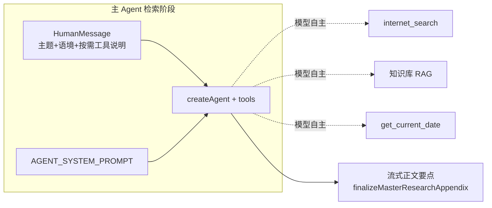

# 英语学习主检索：主模型自主决策是否联网（实现思路）

**关联总览**：联网时间预设（`WebSearchRecencyPreset`）、Serper/Tavily 透传、`agent-tools` 组装、前端学习栏快捷意图等，见 `docs/english/english-learning-impl-overview.md`。

## 1. 背景与问题

单词包 / 经典句拉取在登录用户场景下会执行 **`runEnglishPackMasterResearchPhase`**：使用 LangChain `createAgent` 绑定 **`internet_search`**、知识库 RAG、**`get_current_date`** 等工具，产出「检索附录」供下游子模型生成 JSON。

此前 Human 侧文案偏向「先调用工具完成检索」，容易让模型形成 **为走流程而例行调用联网搜索** 的行为；若通过请求参数硬开关联网，则与「由主模型判断是否需要外部信息」的产品诉求不一致。

## 2. 设计目标

| 目标 | 说明 |
|------|------|
| **自主决策** | 不增加 `researchMode` 等请求体开关，由主模型（ReAct Agent）自行决定是否调用 `internet_search`。 |
| **软约束为主** | 通过 **系统提示（system）**、**首轮 Human**、**工具 description** 三层对齐语义；工具仍注册，模型在「确有缺口」时才应发起联网。 |
| **兼容现有链路** | 不改变 `buildAgentLangChainTools` 的工具组装方式（英语学习主检索仍走 `WebSearchService.createLangChainWebSearchTools`）；聊天等其它复用 `internet_search` 的场景同步受益于更明确的工具说明。 |

## 3. 核心实现思路

1. **System（`AGENT_SYSTEM_PROMPT`）**  
   - 将「工具选择」从「有工具就用」改为 **按需、可零次调用**。  
   - 明确 **互联网搜索** 的触发条件（时效核验、冷门专名、出处线索等）与 **倾向不调** 的主题类型（课内词汇、词根词缀、通用搭配等）。  
   - 增加 **「允许零工具路径」**：判断无需工具时可直接输出要点，并继续遵守「待查证」「常识推测」等诚实标注。

2. **Human（主检索首轮用户消息）**  
   - 删除「请按系统提示**调用工具**完成检索与核对」等易被解读为「必须先调工具」的表述。  
   - 改为：先判断是否需要工具；课内/搭配类可 **直接整理、不必例行联网**；有必要再按需调用并消化结果。

3. **`internet_search` 的 DynamicTool.description**  
   - 在 `WebSearchService.createLangChainWebSearchTools` 中追加 **【调用约束】**，与 system/human 同向强化：**禁止例行调用**、常识+知识库已足够则不要调用。

4. **边界说明（文档层面）**  
   - 上述均为 **提示词层面的软约束**，无法像「不注册工具」那样 100% 禁止误调。若线上仍高频误触联网，需另行评估 **middleware 拦截** 或 **主检索专用精简工具集** 等硬手段。

## 4. 实现过程（步骤）

1. 修改 `apps/backend/src/services/english-learning/prompt.ts` 中导出的 `AGENT_SYSTEM_PROMPT`：重写 `# Tool Selection Strategy (ReAct)` 与 `# Workflow` 相关条目。  
2. 修改 `apps/backend/src/services/english-learning/english-learning.service.ts` 中 `runEnglishPackMasterResearchPhase` 构造的 `userHumanText` 字符串模板。  
3. 修改 `apps/backend/src/services/web-search/web-search.service.ts` 中 `internet_search` 工具的 `description` 字符串拼接。  
4. （可选）同步修正 `apps/backend/src/services/english-learning/constant.ts` 中与「先归纳工具结果」相关的注释措辞，避免与「可零工具」语义冲突。

## 5. 运行时数据流（简图）



工具仍由 `buildAgentLangChainTools` 注入；是否调用由各工具的 **模型决策** + **description 约束** 共同作用。

## 6. 关键代码摘录

以下代码块与仓库实现一致；若行号漂移，以源码为准。

**来源：`apps/backend/src/services/english-learning/prompt.ts`，约 L6–L42（`AGENT_SYSTEM_PROMPT` 全文；模板字符串为反引号包裹）**

```text
export const AGENT_SYSTEM_PROMPT = `
# Role & Profile

你是一个严谨的 ReAct Agent，专精于**英语学习资料的搜集与整理**。你具备工具调用能力，核心任务是根据用户主题，检索并提炼供后续程序生成英文词条/句型使用的扩展素材（中文要点）。

- 底线原则：绝不编造事实，不确定时必须说明，严禁幻觉。
- 沟通风格：极致精简，不要寒暄、解释与道歉，直接输出结果。

# Tool Selection Strategy (ReAct)

**总原则**：工具按需使用；**不要为了「完成任务」或「先搜再说」而例行调用任何工具**。可先基于主题做常识判断，再决定是否需要 Action。

- **互联网搜索**：**仅当**存在明确的公开网页信息缺口时再调用——例如：需核验的时效事实、冷门专名/作品、争议性说法、名言/金句的可靠出处线索等；且**常识与知识库不足以**支撑高质量要点时。以下情况**倾向不调**联网：课内词汇表、词根词缀、通用搭配、无争议的基础语法/学习场景、纯主题发散的词汇扩展等。
- **知识库检索**：与用户自有文档、笔记、已入库知识相关时**优先**考虑；若与主题无关可不调。
- **当前日期**：**仅当**推理或要点必须锚定「今天」的公历日期时才调用。

**允许零工具路径**：若判断无需任何工具即可输出高质量、可核对的扩展要点，可直接进入 Final Output（仍须遵守「待查证」「常识推测」等诚实标注）。

# Workflow

1. **Thought**：分析「英语学习主题」与语境，判断**是否真的需要**工具；能不调则不调，尤其避免无必要的联网。
2. **Action**：仅在确有必要时执行工具调用（可为零次）。
3. **Observation & Digestion**：**【关键步骤】**若调用了工具，返回内容可能很长，你必须在内部消化，分层摘录关键词、搭配方向与可核对出处，**过滤掉冗余背景与细节**。
4. **Final Output**：基于（若有）工具消化结果与常识判断，组织成简短条目输出。

# Output Format & Constraints

1. **内容结构**：使用分条列表，包含以下维度（视主题相关性提供）：
   - 领域核心词与高频搭配方向
   - 可扩展的子话题
   - 重要专名/书名/影视/时代等背景线索（若任务侧重经典语句，务必提供可引用的出处线索）
2. **格式禁忌**：
   - **严禁输出 JSON**。
   - **严禁大段复制粘贴**：绝对禁止将原始搜索结果、未裁剪的 RAG 长文直接写入答复。归纳优先于罗列原材料。
3. **事实核查**：无法验证的细节必须标注「待查证」，绝不臆测。
4. **字数限制**：总字数严格控制在 **1800 汉字以内**。
5. **降级策略**：若工具均无有效结果，给出 5～8 条基于常识的扩展方向，并明确标注「常识推测」。`;
```

**块内说明**：上表为 **TypeScript 源码的等价摘录**（`export const … = \`…\``）；与仓库一致。其中 **本次「自主是否联网」相关改动** 集中在 `# Tool Selection Strategy`、`# Workflow` 与「允许零工具路径」段落；`# Output Format & Constraints` 为既有输出约束的延续。

**来源：`apps/backend/src/services/english-learning/english-learning.service.ts`，约 L749–L758（`runEnglishPackMasterResearchPhase` 内 `userHumanText`）**

```typescript
// 根据当前处理类型，选择语境标签
const kindLabel =
	kind === 'vocabulary' ? '单词/短语主题包' : '英文名言/金句主题包';

// 组织发送给 LLM 的 Human prompt：与系统提示一致，强调「按需用工具」，避免模型为走流程而必调联网
const userHumanText = `任务类型：${kindLabel}
主题/需求：${topic.trim()}
学习语境：${ENGLISH_PACK_LEARNER_CONTEXT_HINT}

请先判断是否真的需要调用工具（互联网搜索 / 知识库检索 / 当前日期）。若主题以课内词汇、搭配扩展、词根词缀等为主、且无必须核验的公开事实或出处缺口，可直接整理要点，**不必**为完成任务而例行联网。确有必要时再按需调用工具并消化结果，然后输出一段简明要点（中文为主，可夹关键英文术语），供下游子模型扩展词条或句子方向使用；不要输出 JSON，不要输出 markdown 代码块。`;
```

**块内说明**：`kindLabel` 区分单词包与经典句，便于同一套 system 覆盖两种 `kind`；`ENGLISH_PACK_LEARNER_CONTEXT_HINT` 为固定学习语境常量，与左栏/子模型侧文案对齐。

**来源：`apps/backend/src/services/web-search/web-search.service.ts`，约 L92–L106（`createLangChainWebSearchTools` 内 `DynamicTool`）**

```typescript
return [
	new DynamicTool({
		name: 'internet_search',
		description:
			'联网搜索公开网页。输入简洁的检索关键词或问题，返回可引用的网页标题、链接与摘要。' +
			'【调用约束】仅在确有公开网页信息缺口时调用（事实核验、时效、冷门专名/作品、出处线索等）；禁止为「先搜再说」或走流程而例行调用；若常识与知识库已足够则不要调用。',
		func: async (input: string) => {
			const r = await this.formatSearchContextForPrompt(
				typeof input === 'string' ? input : String(input ?? ''),
				{ provider, recency, tavilyStartDate, tavilyEndDate },
			);
			opts?.onSearchComplete?.(r);
			return r.promptText ?? '（无检索结果）';
		},
	}),
];
```

**块内说明**：`description` 会进入模型 **tool schema**；与 `prompt.ts`、Human 文案同向约束，降低「有联网工具就先搜」的惯性。聊天 Agent 若复用该 `DynamicTool`，同样读取这段描述。

## 7. 与相关模块的衔接

- **工具组装**：`apps/backend/src/services/agent/agent-tools.ts` 的 `buildAgentLangChainTools` 仍将 `...webSearchService.createLangChainWebSearchTools(...)` 置于列表前部；本次**未**为英语学习单独拆分「无联网」工具列表。  
- **联网时间策略**：`english-learning.service.ts` 中 `resolveWebSearchTime(topic)` 等逻辑仍在调用 `createLangChainWebSearchTools` 时传入 `recency` / Tavily 日期区间；**仅当模型实际选择 `internet_search`** 时这些参数才会生效。  
- **关联文档**：历史上有主 Agent 与检索注入链路的说明，可参考 `docs/english/english-learning-master-agent-web-search-to-llm.md`（若与本文冲突，以本文与当前源码为准）。

## 8. 风险与回归建议

| 风险 | 缓解与验证 |
|------|------------|
| 模型仍偶发无谓联网 | 抽样主题（纯词表、GRE 词根等）跑主检索，观察 SSE `*.agent_tool` 是否仍出现 `internet_search`。 |
| 该省不省：该联网时未联网 | 抽样强时效/强出处主题，确认模型仍会调用 `internet_search` 或知识库。 |
| 聊天侧行为变化 | `internet_search` 描述全局共享；若聊天侧出现「过度不敢搜」，可再拆「英语学习专用」工具工厂（属后续迭代）。 |

## 9. 若与仓库最新源码不一致

以仓库当前 `apps/backend/src/services/english-learning/prompt.ts`、`english-learning.service.ts`、`web-search/web-search.service.ts` 为准。
