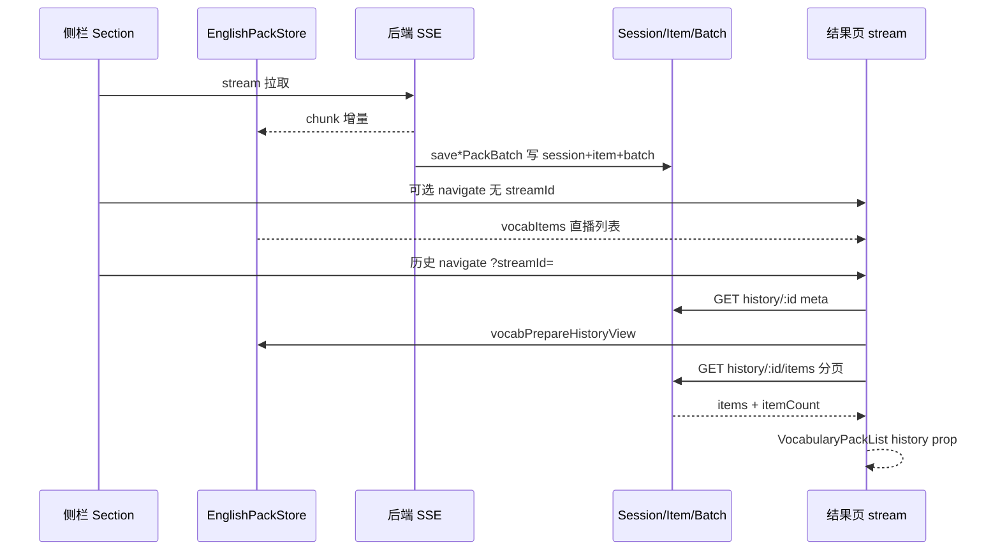

# 英语学习拉取包：会话 + 明细分行存储与历史分页

## 1. 背景与目标

### 1.1 要解决的问题

原先单词包 / 经典句包的 **batch 表**（`english_vocabulary`、`english_classic_quotes`）用 **`items` JSON 列** 存整轮词条：

- 历史详情需 **整包反序列化**，无法按 `streamId` 稳定分页；
- 大批量（数千条）时 JSON 体积大、查询与迁移成本高；
- 前端历史打开时曾 **一次性灌入 MobX**，内存与首屏压力大。

### 1.2 目标

采用与 **`english_vocabulary_library_item`** 相同的模型：

| 层级 | 作用 |
|------|------|
| **Session（会话）** | 一行一流（`streamId` PK），存 `topic`、`targetCount`、`itemCount`、时间戳 |
| **Item（明细）** | 一行一条词/句，`sortOrder` 会话内递增，支持 `ORDER BY sort_order` 分页 |
| **Batch（轮次审计）** | 保留每轮 LLM/库内 chunk 记录，**去掉 `items` JSON**，仅 `item_count` |

前端：

- 历史结果页通过 **`?streamId=` + 分页 API** 加载；
- 直播仍走 **`EnglishPackStore` SSE**；
- **空会话不弹 404 错误**，只展示空态；Loading 与空态互斥。

### 1.3 非目标

- 不改变 SSE 事件协议与侧栏发起拉取的入口（见 [english-learning-pack-stream-route.md](./english-learning-pack-stream-route.md)）；
- 不在本文展开主从 Agent / 联网检索实现（见 `docs/english/english-learning-backend-implementation.md`）。

**若与仓库最新源码不一致，以源码为准。**

---

## 2. 改动范围

### 2.1 后端（新增 / 修改）

| 路径 | 说明 |
|------|------|
| `apps/backend/src/services/english-learning/english-vocabulary-pack-session.entity.ts` | 单词会话表实体 |
| `apps/backend/src/services/english-learning/english-vocabulary-pack-item.entity.ts` | 单词明细表实体 |
| `apps/backend/src/services/english-learning/english-classic-quotes-pack-session.entity.ts` | 经典句会话表实体 |
| `apps/backend/src/services/english-learning/english-classic-quotes-pack-item.entity.ts` | 经典句明细表实体 |
| `apps/backend/src/services/english-learning/english-vocabulary.entity.ts` | Batch 去掉 `items`，加 `itemCount` |
| `apps/backend/src/services/english-learning/english-classic-quote.entity.ts` | 同上 |
| `apps/backend/src/migrations/1779200000000-english-pack-item-rows.ts` | 建表、旧 JSON 摊平、删列 |
| `apps/backend/src/services/english-learning/english-learning.module.ts` | 注册新实体 |
| `apps/backend/src/services/english-learning/english-learning.service.ts` | 双写、历史读、分页 API |
| `apps/backend/src/services/english-learning/english-learning.controller.ts` | `.../items` 路由 |
| `apps/backend/src/services/english-learning/constant.ts` | `PACK_HISTORY_ITEMS_PAGE_MAX` |

### 2.2 前端（新增 / 修改）

| 路径 | 说明 |
|------|------|
| `apps/frontend/src/views/englishLearning/pack/usePackStreamHistoryList.ts` | 通用历史分页 Hook |
| `apps/frontend/src/views/englishLearning/pack/useVocabularyPackHistoryList.ts` | 单词 API 适配 |
| `apps/frontend/src/views/englishLearning/pack/useClassicQuotesPackHistoryList.ts` | 经典句 API 适配 |
| `apps/frontend/src/views/englishLearning/pack/EnglishLearningPackStreamPage.tsx` | 历史 meta + 分页 + Loading/空态 |
| `apps/frontend/src/views/englishLearning/pack/VocabularyPackList.tsx` | 直播 Store / 历史 props |
| `apps/frontend/src/views/englishLearning/pack/ClassicQuotesPackList.tsx` | 同上 |
| `apps/frontend/src/service/index.ts` | 详情/明细分页 API、`silent` |
| `apps/frontend/src/store/englishPack.ts` | `vocabPrepareHistoryView` 等 |
| `apps/frontend/src/constant/index.ts` | `PACK_ITEMS_PAGE_SIZE` |
| `apps/frontend/src/views/englishLearning/vocab/VocabularySection.tsx` | 打开历史带 `streamId` |
| `apps/frontend/src/views/englishLearning/classic/ClassicQuotesSection.tsx` | 同上 |

---

## 3. 实现思路（按功能点）

### 3.1 数据模型：Session + Item + 瘦身 Batch

**步骤：**

1. 新增 `english_vocabulary_pack_session` / `english_classic_quotes_pack_session`，主键 `stream_id`，索引 `(user_id, updated_at)` 供历史列表倒序。
2. 新增 `english_vocabulary_pack_item` / `english_classic_quotes_pack_item`，字段与库内 item / DTO 对齐，索引 `(user_id, stream_id, sort_order)`。
3. Batch 表删除 `items` JSON，增加 `item_count` 表示**该轮**写入条数（审计），明细在 item 表。

**来源**：`apps/backend/src/services/english-learning/english-vocabulary-pack-session.entity.ts`（约 L10–L36）

```typescript
/**
 * 单次单词包拉取会话元数据（一行一流），供历史列表与详情头信息。
 */
@Entity('english_vocabulary_pack_session')
@Index('idx_evps_user_updated', ['userId', 'updatedAt'])
export class EnglishVocabularyPackSession {
	@PrimaryColumn({ name: 'stream_id', type: 'varchar', length: 36 })
	streamId!: string; // 与 SSE streamId 一致，全链路主键

	@Column({ name: 'user_id', type: 'int' })
	userId!: number;

	@Column({ type: 'varchar', length: 500 })
	topic!: string;

	@Column({ name: 'target_count', type: 'int' })
	targetCount!: number;

	@Column({ name: 'item_count', type: 'int', default: 0 })
	itemCount!: number; // 会话内累计词条数，列表/标题展示用

	@CreateDateColumn({ name: 'created_at', type: 'timestamp' })
	createdAt!: Date;

	@UpdateDateColumn({ name: 'updated_at', type: 'timestamp' })
	updatedAt!: Date; // 每次落库 batch 时更新，历史列表按此排序
}
```

**来源**：`apps/backend/src/services/english-learning/english-vocabulary-pack-item.entity.ts`（约 L8–L47）

```typescript
/**
 * 单词包拉取明细：一行一词，按 streamId + sortOrder 分页读取。
 */
@Entity('english_vocabulary_pack_item')
@Index('idx_evpi_user_stream_sort', ['userId', 'streamId', 'sortOrder'])
export class EnglishVocabularyPackItem {
	@PrimaryGeneratedColumn('uuid')
	id!: string;

	@Column({ name: 'stream_id', type: 'varchar', length: 36 })
	streamId!: string;

	@Column({ name: 'sort_order', type: 'int' })
	sortOrder!: number; // 会话内从 0 递增，分页 ORDER BY 依据

	@Column({ name: 'batch_id', type: 'varchar', length: 36, nullable: true })
	batchId!: string | null; // 关联本轮 batch 行，便于审计

	@Column({ type: 'varchar', length: 500 })
	word!: string;
	// ipa / pos / translationZh / example ...
}
```

**来源**：`apps/backend/src/services/english-learning/english-vocabulary.entity.ts`（约 L19–L52）

```typescript
/**
 * 单词包流式生成：每一轮落一行 batch（仅审计），词条在 pack_item 表。
 */
@Entity('english_vocabulary')
export class EnglishVocabularyPackBatch {
	@Column({ name: 'stream_id', type: 'varchar', length: 36 })
	streamId!: string;

	@Column({ type: 'int' })
	round!: number;

	/** 本轮写入明细表的条数（审计用，明细见 english_vocabulary_pack_item） */
	@Column({ name: 'item_count', type: 'int', default: 0 })
	itemCount!: number;
	// 已移除 items JSON 列
}
```

---

### 3.2 数据库迁移

**步骤：**

1. `up`：若不存在则 `CREATE TABLE` 四张 session/item 表。
2. 若 batch 表仍有 `items` 列：执行 `migrateVocabBatches` / `migrateClassicBatches`，将 JSON 数组摊平为 item 行并 upsert session。
3. `DROP COLUMN items`；若无 `item_count` 则 `ADD item_count`。
4. `down`：按迁移类反向（生产需单独评估）。

**来源**：`apps/backend/src/migrations/1779200000000-english-pack-item-rows.ts`（约 L11–L119，`up` 主流程）

```typescript
public async up(queryRunner: QueryRunner): Promise<void> {
	// 1) 建 session / item 表（单词 + 经典句对称）
	await queryRunner.query(`CREATE TABLE IF NOT EXISTS english_vocabulary_pack_session (...)`);
	await queryRunner.query(`CREATE TABLE IF NOT EXISTS english_vocabulary_pack_item (...)`);
	// ...

	// 2) 若旧表仍有 items JSON，摊平后删列
	const vocabHasItems = await this.columnExists(queryRunner, 'english_vocabulary', 'items');
	if (vocabHasItems) {
		await this.migrateVocabBatches(queryRunner); // 读 batch.items → insert item + session
		await queryRunner.query(`ALTER TABLE english_vocabulary DROP COLUMN items`);
	}
	// 3) 确保 batch 有 item_count
	if (!(await this.columnExists(queryRunner, 'english_vocabulary', 'item_count'))) {
		await queryRunner.query(
			`ALTER TABLE english_vocabulary ADD item_count int NOT NULL DEFAULT 0`,
		);
	}
	// classic_quotes 对称处理 ...
}
```

**部署注意：** 生产环境应执行该 migration；`DB_SYNC=true` 可能自动建表，但**旧 JSON 摊平**仍建议跑迁移。

---

### 3.3 SSE 落库：事务内 Session + Item + Batch

**步骤（每轮 `saveVocabularyPackBatch` / `saveClassicQuotesPackBatch`）：**

1. 开启事务，按 `streamId + userId` 查找或创建 **Session**。
2. `MAX(sort_order)` 得到下一序号，保证会话内全局递增（跨 round）。
3. 插入 **Batch** 行（`itemCount = 本轮条数`）。
4. 批量 `save` **Item** 行，无效词（无 word/ipa）跳过。
5. `session.itemCount += 实际写入条数`，保存 Session。

**来源**：`apps/backend/src/services/english-learning/english-learning.service.ts`（`saveVocabularyPackBatch`，约 L1860–L1941）

```typescript
async saveVocabularyPackBatch(params: {
	userId: number;
	streamId: string;
	round: number;
	topic: string;
	targetCount: number;
	items: VocabularyItemDto[];
}): Promise<void> {
	if (!params.items.length) return;
	const topic = params.topic.trim().slice(0, 500);

	await this.dataSource.transaction(async (manager) => {
		const sessionRepo = manager.getRepository(EnglishVocabularyPackSession);
		const itemRepo = manager.getRepository(EnglishVocabularyPackItem);
		const batchRepo = manager.getRepository(EnglishVocabularyPackBatch);

		// ① Session：首包创建，后续更新 topic/targetCount
		let session = await sessionRepo.findOne({
			where: { streamId: params.streamId, userId: params.userId },
		});
		if (!session) {
			session = sessionRepo.create({
				streamId: params.streamId,
				userId: params.userId,
				topic,
				targetCount: params.targetCount,
				itemCount: 0,
			});
		} else {
			session.topic = topic;
			session.targetCount = params.targetCount;
		}

		// ② 计算 sortOrder 起点（接续已有明细）
		const maxRaw = await itemRepo
			.createQueryBuilder('i')
			.select('MAX(i.sortOrder)', 'maxSort')
			.where('i.streamId = :streamId', { streamId: params.streamId })
			.andWhere('i.userId = :userId', { userId: params.userId })
			.getRawOne<{ maxSort: string | number | null }>();
		let sortOrder = maxRaw?.maxSort != null ? Number(maxRaw.maxSort) + 1 : 0;

		// ③ Batch 审计行（无 JSON）
		const savedBatch = await batchRepo.save(
			batchRepo.create({
				userId: params.userId,
				streamId: params.streamId,
				round: params.round,
				topic,
				targetCount: params.targetCount,
				itemCount: params.items.length,
			}),
		);

		// ④ 明细行
		const itemRows: EnglishVocabularyPackItem[] = [];
		for (const it of params.items) {
			const word = it.word.trim().slice(0, 500);
			const ipa = it.ipa.trim().slice(0, 2000);
			if (!word || !ipa) continue;
			itemRows.push(
				itemRepo.create({
					userId: params.userId,
					streamId: params.streamId,
					round: params.round,
					sortOrder,
					batchId: savedBatch.id,
					word,
					ipa,
					// pos / translationZh / example ...
				}),
			);
			sortOrder += 1;
		}
		if (itemRows.length) {
			await itemRepo.save(itemRows);
			session.itemCount += itemRows.length;
		}
		await sessionRepo.save(session);
	});
}
```

经典句 `saveClassicQuotesPackBatch` 结构对称，写入 `english_classic_quotes_pack_*` 表。

---

### 3.4 历史读路径：列表 / 元数据 / 明细分页

**步骤：**

| API | 行为 |
|-----|------|
| `listVocabularyHistory` | 查 `vocabPackSessionRepo`，按 `updatedAt DESC` 分页；`wordCount` 取 `session.itemCount` |
| `getVocabularyHistoryDetail` | 仅返回 meta + `itemCount`，**不含 items 数组** |
| `listVocabularyPackItems` | `WHERE stream_id` + `ORDER BY sort_order ASC` + `take/skip` |

经典句接口对称（`classicPackSessionRepo` / `classicPackItemRepo`）。

**来源**：`apps/backend/src/services/english-learning/english-learning.service.ts`（`listVocabularyHistory`，约 L3378–L3413）

```typescript
async listVocabularyHistory(userId: number, options?: { limit?: number; offset?: number }) {
	const sessions = await this.vocabPackSessionRepo.find({
		where: { userId },
		order: { updatedAt: 'DESC' }, // 最近活动会话在前
		take: limit,
		skip: offset,
	});
	// 批量查 webSearch 轮数，组装 VocabularyHistoryListItem（wordCount = session.itemCount）
	return sessions.map((s) => ({
		streamId: s.streamId,
		topic: s.topic,
		wordCount: s.itemCount,
		// ...
	}));
}
```

**来源**：`apps/backend/src/services/english-learning/english-learning.service.ts`（`listVocabularyPackItems`，约 L3456–L3487）

```typescript
async listVocabularyPackItems(userId: number, streamId: string, options?) {
	const session = await this.vocabPackSessionRepo.findOne({ where: { userId, streamId } });
	if (!session) {
		// 无会话：空列表（不抛 404，见 §3.5）
		return { streamId, itemCount: 0, items: [] };
	}
	const limit = Math.min(PACK_HISTORY_ITEMS_PAGE_MAX, Math.max(1, options?.limit ?? 100));
	const rows = await this.vocabPackItemRepo.find({
		where: { userId, streamId },
		order: { sortOrder: 'ASC' }, // 与 SSE 落库顺序一致
		take: limit,
		skip: Math.max(0, options?.offset ?? 0),
	});
	return {
		streamId,
		itemCount: session.itemCount,
		items: rows.map((r) => this.mapVocabPackItemRow(r)),
	};
}
```

**来源**：`apps/backend/src/services/english-learning/english-learning.controller.ts`（约 L302–L338）

```typescript
/** 分页明细须注册在 :streamId 之前或路径更具体，避免被详情路由抢匹配 */
@Get('vocabulary-history/:streamId/items')
async listVocabularyPackItems(@Param('streamId') streamId: string, @Query('limit') ..., @Query('offset') ...) {
	const data = await this.englishLearningService.listVocabularyPackItems(userId, streamId, { limit, offset });
	return { success: true, data };
}

@Get('vocabulary-history/:streamId')
async getVocabularyHistoryDetail(@Param('streamId') streamId: string) {
	const detail = await this.englishLearningService.getVocabularyHistoryDetail(userId, streamId);
	return { success: true, data: detail };
}
```

---

### 3.5 空数据：返回空结构，不抛 404

**步骤：**

1. `get*HistoryDetail`：无 session 时返回 `itemCount: 0`、空 `topic`、空 `webSearchRounds`。
2. `list*PackItems`：无 session 时返回 `{ itemCount: 0, items: [] }`。
3. 前端历史 API 加 `silent: true`，避免 HTTP 层误弹「未找到该经典语句记录」类 Toast。

**来源**：`apps/backend/src/services/english-learning/english-learning.service.ts`（`getVocabularyHistoryDetail` 无 session 分支，约 L3430–L3441）

```typescript
const session = await this.vocabPackSessionRepo.findOne({ where: { userId, streamId } });
if (!session) {
	// 产品语义：视为「空会话」，由前端展示空态，而非错误
	return {
		streamId,
		topic: '',
		targetCount: 0,
		itemCount: 0,
		createdAt: new Date(0).toISOString(),
		webSearchRounds: [],
	};
}
```

**来源**：`apps/frontend/src/service/index.ts`（`getEnglishVocabularyHistoryDetail`，约 L535–L565）

```typescript
export const getEnglishVocabularyHistoryDetail = async (streamId: string) => {
	return await http.get<{ /* meta，无 items */ }>(ENGLISH_LEARNING_VOCABULARY_HISTORY, {
		params: [streamId],
		silent: true, // 不弹全局错误 Toast；空/失败由页面空态承接
	});
};

export const listEnglishVocabularyPackItems = async (streamId, options?) => {
	return await http.get<{ streamId; itemCount; items }>(ENGLISH_LEARNING_VOCABULARY_HISTORY, {
		params: [streamId, 'items'],
		querys: { limit: options?.limit ?? 100, offset: options?.offset ?? 0 },
		silent: true,
	});
};
```

---

### 3.6 前端：历史分页 Hook（对齐 favorites）

**步骤：**

1. `usePackStreamHistoryList`：通用分页状态机（`offsetRef`、`hasMoreRef`、`fetchFirstPage`、`fetchMore`、`onViewportScroll`）。
2. `useVocabularyPackHistoryList` / `useClassicQuotesPackHistoryList`：注入 `listEnglish*PackItems` 与 `PACK_ITEMS_PAGE_SIZE`（100）。
3. **仅在结果页调用 Hook**（`EnglishLearningPackStreamPage`），通过 `history` prop 传给列表，避免重复请求。

**来源**：`apps/frontend/src/views/englishLearning/pack/usePackStreamHistoryList.ts`（约 L45–L118）

```typescript
const fetchFirstPage = useCallback(async (sid: string) => {
	setLoading(true);
	offsetRef.current = 0;
	hasMoreRef.current = true;
	setItems([]);
	try {
		const { items: list, itemCount: total } = await fetchPage(sid, pageSize, 0);
		setItems(list);
		setItemCount(total);
		offsetRef.current = list.length;
		hasMoreRef.current = list.length >= pageSize; // 满页则认为可能还有下一页
	} catch {
		setItems([]);
		hasMoreRef.current = false;
	} finally {
		setLoading(false);
	}
}, [fetchPage, pageSize]);

const onViewportScroll = useCallback<UIEventHandler<HTMLDivElement>>((e) => {
	const el = e.currentTarget;
	const rest = el.scrollHeight - el.scrollTop - el.clientHeight;
	if (rest < SCROLL_LOAD_THRESHOLD_PX) {
		void fetchMore(); // 距底部阈值内触发加载更多
	}
}, [fetchMore]);
```

**来源**：`apps/frontend/src/views/englishLearning/pack/useVocabularyPackHistoryList.ts`（全文）

```typescript
export function useVocabularyPackHistoryList(streamId: string | null | undefined) {
	const fetchPage = useCallback(async (sid, limit, offset) => {
		const res = await listEnglishVocabularyPackItems(sid, { limit, offset });
		const list = Array.isArray(res.data?.items) ? res.data.items : [];
		return { items: list, itemCount: res.data?.itemCount ?? list.length };
	}, []);

	return usePackStreamHistoryList({
		streamId,
		pageSize: PACK_ITEMS_PAGE_SIZE, // 与 constant 一致，默认 100
		fetchPage,
	});
}
```

---

### 3.7 结果页：直播 vs 历史、Loading、空态互斥

**步骤：**

1. URL：`/english-learning/stream?kind=vocab|classic`，历史追加 `&streamId=...`。
2. `useEffect`：有 `streamId` 时拉 **meta**（`get*HistoryDetail`），写入 `EnglishPackStore.vocabPrepareHistoryView`（只恢复 topic + 联网 organic，**清空 Store 词条**）。
3. 并行：`useVocabularyPackHistoryList(streamId)` 拉明细分页。
4. `showPageLoading = historyMetaPending || historyListLoading` 时，在 **ScrollArea 外** 用 `flex-1 items-center justify-center` 全高 Loading（避免 Radix 内 `min-h-full` 失效）。
5. `showEmpty` 须 `!showPageLoading && !activeHistory.loading && itemCount === 0`，与 Loading **不同时出现**。
6. 列表组件：`history` 有值时用 `history.items`，否则用 `EnglishPackStore.vocabItems`（直播）。

**来源**：`apps/frontend/src/views/englishLearning/pack/EnglishLearningPackStreamPage.tsx`（约 L131–L198）

```typescript
const activeHistory = kind === 'vocab' ? vocabHistory : classicHistory;
const historyListLoading =
	isHistoryView && activeHistory.loading && activeHistory.items.length === 0;
const showPageLoading = isHistoryView && (historyMetaPending || historyListLoading);

const showEmpty =
	!showPageLoading &&
	!loading &&
	!activeHistory.loading &&
	itemCount === 0 &&
	(!isHistoryView || historyItemCount === 0);

return (
	// ...
	{showPageLoading ? (
		// Loading 放在 ScrollArea 外，占满 header 以下区域并垂直居中
		<div className="text-textcolor/60 flex min-h-0 flex-1 items-center justify-center">
			<Loading text={historyLoadingText} />
		</div>
	) : (
		<ScrollArea onScroll={onHistoryViewportScroll}>
			<VocabularyPackList history={isHistoryView ? vocabHistory : null} />
			{showEmpty ? <div>{emptyHint}</div> : null}
		</ScrollArea>
	)}
);
```

**来源**：`apps/frontend/src/store/englishPack.ts`（`vocabPrepareHistoryView`，约 L259–L268）

```typescript
/** 打开历史会话：仅恢复联网检索与主题，词条由结果页分页 API 加载 */
vocabPrepareHistoryView(topic: string, organic: SearchOrganicItem[]) {
	runInAction(() => {
		this.vocabItems = []; // 不再把全量历史灌入 Store
		this.vocabTopic = topic;
		this.vocabMasterSearchOrganic = organic;
		this.vocabLoading = false;
		this.vocabAgentToolLine = null;
		this.vocabProgress = null;
	});
}
```

---

### 3.8 侧栏打开历史：跳转结果页 + streamId

**步骤：**

1. 用户在历史 Drawer 点选一条 → `get*HistoryDetail(streamId)`。
2. `vocabPrepareHistoryView` + `navigate('/english-learning/stream?kind=vocab&streamId=...')`。
3. `itemCount > 0` 才 Toast「已载入」；**为 0 也跳转**，由结果页 `showEmpty` 展示空文案，不弹错误。

**来源**：`apps/frontend/src/views/englishLearning/vocab/VocabularySection.tsx`（`openHistoryDetail`，约 L142–L168）

```typescript
const openHistoryDetail = useCallback(async (streamId: string) => {
	setLoadingHistoryDetailId(streamId);
	try {
		const res = await getEnglishVocabularyHistoryDetail(streamId);
		const d = res.data;
		if (!d) return;
		EnglishPackStore.vocabPrepareHistoryView(
			d.topic,
			mergeEnglishPackWebSearchOrganics(d.webSearchRounds),
		);
		setHistoryDrawerOpen(false);
		navigate(
			`/english-learning/stream?kind=vocab&streamId=${encodeURIComponent(streamId)}`,
		);
		if ((d.itemCount ?? 0) > 0) {
			Toast({ type: 'success', title: t('englishLearning.vocab.historyLoaded') });
		}
		// itemCount === 0：不 Toast 错误，结果页 showEmpty 展示
	} finally {
		setLoadingHistoryDetailId(null);
	}
}, [t, navigate]);
```

---

## 4. 端到端数据流



---

## 5. 兼容性与影响

| 项 | 说明 |
|----|------|
| **破坏性** | 依赖 `batch.items` 的旧客户端「一次拉全量详情」需改为 meta + items 分页 |
| **迁移** | 须执行 `1779200000000-english-pack-item-rows`；未迁移环境可能只有 session 无 item |
| **历史列表** | 仅展示已有 **session 行** 的会话；仅旧 batch、未迁移 session 的 stream 可能 meta 为空 |
| **上限** | 单页明细 `limit` 后端封顶 `PACK_HISTORY_ITEMS_PAGE_MAX`（200） |
| **直播** | 行为不变，仍写 batch 并双写 item；结果页无 `streamId` 时读 Store |

---

## 6. 建议回归

1. 新拉取单词包 → 历史列表出现会话 → 点进结果页分页滚动加载。
2. `itemCount = 0` 的会话：无红色 Toast，结果页空态文案。
3. 直播拉取中切换路由 → 再开结果页，Store 条数持续增长。
4. 经典句对称测一遍。
5. 生产 migration 后抽查：`english_vocabulary_pack_item` 行数与 session.`item_count` 一致。

---

## 7. 相关源码与文档

| 说明 | 路径 |
|------|------|
| 结果页独立路由（直播 Store） | [english-learning-pack-stream-route.md](./english-learning-pack-stream-route.md) |
| 后端模块总览 | [../english/english-learning-backend-implementation.md](../english/english-learning-backend-implementation.md) |
| Session 实体（单词） | `apps/backend/src/services/english-learning/english-vocabulary-pack-session.entity.ts` |
| Item 实体（单词） | `apps/backend/src/services/english-learning/english-vocabulary-pack-item.entity.ts` |
| 迁移 | `apps/backend/src/migrations/1779200000000-english-pack-item-rows.ts` |
| 落库与读 API | `apps/backend/src/services/english-learning/english-learning.service.ts` |
| 通用历史 Hook | `apps/frontend/src/views/englishLearning/pack/usePackStreamHistoryList.ts` |
| 结果页 | `apps/frontend/src/views/englishLearning/pack/EnglishLearningPackStreamPage.tsx` |
