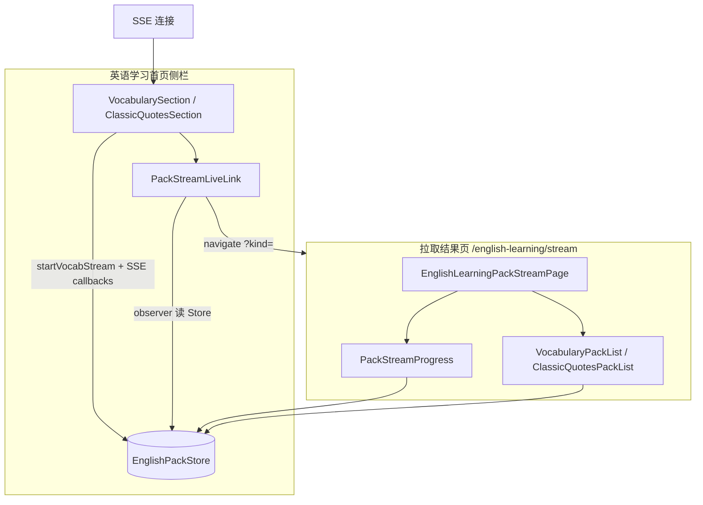
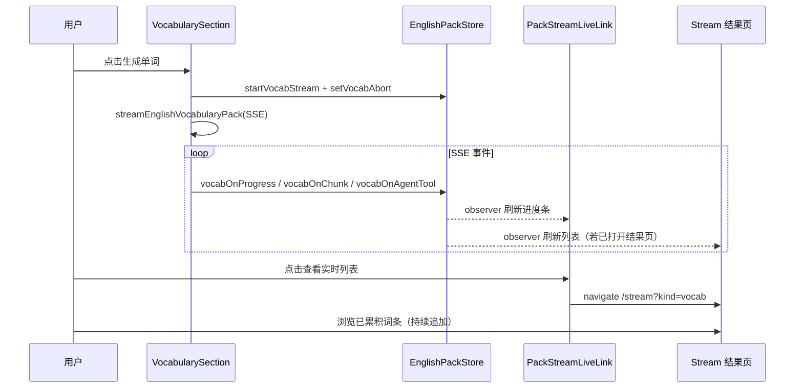

# 英语学习：拉取结果独立路由与跨页实时同步

> **文档角色**：记录 2026-05 初版「独立 `/stream` 路由 + Store 同步」方案。  
> **当前目录与组件名**以 [english-module-folder-layout.md](./english-module-folder-layout.md) 为准：下文 §2、§4 中的 `vocab/`、`VocabularyPackList`、`PackStreamKindTabs` 等路径**已迁移或删除**，阅读实现时请对照主文档，勿按本文路径找文件。

## 1. 背景与目标

### 1.1 要解决的问题

用户在左侧栏「单词资料 / 经典语句」发起 SSE 流式拉取时，原先在窄侧栏内直接渲染大列表（卡片网格 + 朗读 + 收藏 + 联网检索入口），存在：

- **侧栏空间不足**：大批量词条（数千条）滚动与交互体验差；
- **职责混杂**：表单（主题、数量、生成/停止）与结果展示挤在同一区块；
- **跨路由需求**：用户希望在拉取过程中切换到资源库、收藏等子路由，仍能看到进度与已拉取内容，并在独立全屏页查看列表。

### 1.2 目标（用户视角）

1. 拉取结果列表迁到 **`/english-learning/stream`** 独立路由页展示；
2. **无论是否打开结果页**，流式数据都持续写入全局 Store，结果页与侧栏入口**实时同步**；
3. 侧栏保留「发起拉取 + 进度摘要 + 快捷入口」，进度与联网搜索入口**合并为一块**（`PackStreamLiveLink`），不重复占两行；
4. UI 对齐项目既有子页模式（收藏页 `EnglishLearningFavoritesPage`：`p-5 pt-0`、`ScrollArea`、顶栏 Tab）。

### 1.3 非目标（本轮未改）

- **SSE 协议与后端生成逻辑**不变（参见 [english-learning-pack-sse.md](./english-learning-pack-sse.md)、[english-learning-topic-match-db-sse.md](./english-learning-topic-match-db-sse.md)）；
- **拉取仍由侧栏 Section 发起**：`streamEnglishVocabularyPack` / `streamEnglishClassicQuotes` 未迁移到结果页。

### 1.4 延伸阅读

- 历史会话分页、Loading/空态：[english-learning-pack-session-items.md](./english-learning-pack-session-items.md)。
- **目录重组**（`pack/vocabulary|classic`、`sections/`、顶栏截断、移除结果页 kind Tab）：[english-module-folder-layout.md](./english-module-folder-layout.md)。

---

## 2. 改动范围

| 类型 | 路径 |
|------|------|
| 新增 | `apps/frontend/src/views/englishLearning/pack/EnglishLearningPackStreamPage.tsx` |
| 新增 | `apps/frontend/src/views/englishLearning/pack/VocabularyPackList.tsx` |
| 新增 | `apps/frontend/src/views/englishLearning/pack/ClassicQuotesPackList.tsx` |
| 新增 | `apps/frontend/src/views/englishLearning/pack/PackStreamLiveLink.tsx` |
| 新增 | `apps/frontend/src/views/englishLearning/pack/PackStreamProgress.tsx` |
| 新增 | `apps/frontend/src/views/englishLearning/pack/PackStreamKindTabs.tsx` |
| 修改 | `apps/frontend/src/router/routes.ts` |
| 修改 | `apps/frontend/src/views/englishLearning/vocab/VocabularySection.tsx` |
| 修改 | `apps/frontend/src/views/englishLearning/classic/ClassicQuotesSection.tsx` |
| 修改 | `apps/frontend/src/views/englishLearning/Layout.tsx`（注释） |
| 修改 | `apps/frontend/src/i18n/locales/zh-CN.ts`、`en-US.ts` |

**依赖既有模块（未改文件，但为本方案核心）：**

- `apps/frontend/src/store/englishPack.ts` — 跨路由 MobX 状态；
- `apps/frontend/src/utils/englishLearningPackSse.ts` — SSE 解析；
- `apps/frontend/src/views/englishLearning/components/WebSearchResultsBar.tsx` — 结果页列表内联网抽屉（复用 `SearchOrganics`）。

---

## 3. 总体架构与数据流



**关键决策：**

| 决策 | 理由 |
|------|------|
| Store 为唯一数据源（SSOT） | 组件卸载（换路由）不中断 SSE；`observer` 任意页面订阅即可刷新 |
| SSE 留在 Section，列表迁出 | 避免结果页未挂载时无人注册回调；侧栏始终是「任务发起方」 |
| `genId` 防竞态 | 快速连续点击生成时，旧流回调写入被 `vocabStreamGenId` 丢弃 |
| 进度 UI 只在 `PackStreamLiveLink` 展示一份 | 用户明确要求侧栏不单独再挂进度条，与「查看实时列表」同卡片 |

---

## 4. 实现步骤（按功能点）

### 功能点 A：注册子路由 `stream`

**步骤：**

1. 在 `routes.ts` 的 `/english-learning` 子路由数组中增加 `path: 'stream'`；
2. `Component` 指向 `EnglishLearningPackStreamPage`；
3. `meta.titleKey` 使用 `route.englishLearning.stream.title`，供布局标题栏 i18n。

**来源**：`apps/frontend/src/router/routes.ts`（约 L158–L164）

```typescript
{
  path: 'stream',
  Component: EnglishLearningPackStreamPage,
  meta: {
    titleKey: 'route.englishLearning.stream.title', // 浏览器/应用顶栏：拉取结果
  },
},
```

**URL 约定：**

- 单词：`/english-learning/stream?kind=vocab`（`kind` 缺省视为 `vocab`）
- 语句：`/english-learning/stream?kind=classic`

---

### 功能点 B：跨路由实时状态（`EnglishPackStore`）

**步骤（使用方式，Store 本身已存在）：**

1. Section 调用 `startVocabStream` / `startClassicStream` 时递增 `*StreamGenId`、清空 `*Items`、设置 `*Loading` 与 `*Progress`；
2. SSE 各事件回调只调用 `vocabOnProgress` / `vocabOnChunk` / `vocabOnDone` 等，并传入本次 `myGen`；
3. Store 方法内判断 `gen !== this.*StreamGenId` 则忽略，避免过期流污染 UI；
4. 结果页与子组件用 `observer` 包裹，直接读 `vocabItems` / `classicItems` 等 observable。

**来源**：`apps/frontend/src/store/englishPack.ts`（约 L1–L48，摘录）

```typescript
/**
 * 英语学习包流式拉取 UI 状态（跨路由持久）。
 * 说明：页面离开侧栏后 SSE 仍由 Section 持有的 abort 维持；
 *       结果页仅「订阅」本 Store，不负责发起请求。
 */
class EnglishPack {
  vocabStreamGenId = 0;       // 每次新生成 +1，回调携带 gen 比对
  vocabLoading = false;
  vocabProgress: EnglishPackUiProgress | null = null;
  vocabItems: EnglishVocabularyItem[] = [];
  vocabMasterSearchOrganic: SearchOrganicItem[] = []; // 主 Agent 联网 organic
  vocabAbort: ((fromUser?: boolean) => void) | null = null;

  // classic* 字段对称……
}
```

**`vocabOnChunk` 与进度对齐（摘录）：**

**来源**：`apps/frontend/src/store/englishPack.ts`（约 L171–L182）

```typescript
vocabOnChunk(gen: number, delta: EnglishVocabularyItem[]) {
  if (gen !== this.vocabStreamGenId || !delta.length) return;
  runInAction(() => {
    this.vocabItems = [...this.vocabItems, ...delta];
    // 用实际列表长度抬高 progress.collected，与分块 SSE 一致
    if (this.vocabProgress) {
      const collected = this.vocabItems.length;
      if (collected > this.vocabProgress.collected) {
        this.vocabProgress = { ...this.vocabProgress, collected };
      }
    }
  });
}
```

---

### 功能点 C：侧栏瘦身 — Section 只保留表单 + SSE

**步骤：**

1. 从 `VocabularySection` / `ClassicQuotesSection` **删除**原内嵌列表网格（卡片、朗读、收藏、折叠头）；
2. **保留**主题/数量表单、生成/停止、历史抽屉、`onGenerate` 内完整 SSE `callbacks`；
3. 在 `space-y-3` 内按钮行下方插入 `<PackStreamLiveLink kind="vocab" />`（classic 对称）；
4. 历史载入成功后 `navigate('/english-learning/stream?kind=...')`，在结果页查看全量列表。

**来源**：`apps/frontend/src/views/englishLearning/vocab/VocabularySection.tsx`（`openHistoryDetail`，约 L142–L170）

```typescript
EnglishPackStore.vocabLoadHistoryDetail(
  d.items,
  mergeEnglishPackWebSearchOrganics(d.webSearchRounds), // 历史联网结果合并进 organic
);
setHistoryDrawerOpen(false);
navigate('/english-learning/stream?kind=vocab'); // 载入后直达结果页
```

**SSE 注册仍位于 Section（摘录）：**

**来源**：`apps/frontend/src/views/englishLearning/vocab/VocabularySection.tsx`（`onGenerate` callbacks，约 L202–L241）

```typescript
const myGen = EnglishPackStore.startVocabStream(effectiveTarget);

const abort = await streamEnglishVocabularyPack({
  body,
  callbacks: {
    onProgress: (p) => EnglishPackStore.vocabOnProgress(myGen, p),
    onAgentTool: (ev) => {
      if (ev.phase === 'organic' && ev.organic?.length) {
        // 联网结果写入 Store，供 PackStreamLiveLink / 结果页抽屉使用
        EnglishPackStore.vocabOnAgentTool(myGen, null, ev.organic);
        return;
      }
      EnglishPackStore.vocabOnAgentTool(myGen, formatEnglishLearningAgentToolLine(t, ev), []);
    },
    onChunk: ({ items: delta }) => EnglishPackStore.vocabOnChunk(myGen, delta),
    onDone: ({ items: list, requested, itemsOmitted, itemCount }) => {
      // complete 可能 itemsOmitted：用 Store 已累积列表 slice 作为 finalList
      const finalList =
        itemsOmitted && list.length === 0 && EnglishPackStore.vocabItems.length > 0
          ? EnglishPackStore.vocabItems.slice(0, Number.isFinite(itemCount) ? itemCount : requested)
          : list;
      EnglishPackStore.vocabOnDone(myGen, finalList);
    },
    // onError / onUserAbort / onIncomplete …
  },
});
EnglishPackStore.setVocabAbort(abort);
```

---

### 功能点 D：`PackStreamLiveLink` — 侧栏统一入口（进度 + 双按钮 + 联网抽屉）

**步骤：**

1. `observer` 订阅 Store：`loading`、`items`、`progress`、`agentToolLine`、`masterSearchOrganic`；
2. 显示条件：`loading || items.length > 0`，否则 `return null`；
3. **拉取中**：渲染工具行文案、进度文字、进度条（从 Section 迁入，避免重复组件）；
4. **拉取结束且有条目**：仅显示 `liveSummaryCount` 摘要；
5. 底部并排两钮：
   - **查看实时列表** → `navigate(/english-learning/stream?kind=)`；
   - **检索网页**（仅 `webSearchCount > 0`）→ 打开 `SearchOrganics` 抽屉；
6. 配色按 `kind` 区分：单词 teal、语句 violet。

**来源**：`apps/frontend/src/views/englishLearning/pack/PackStreamLiveLink.tsx`（约 L46–L147，摘录合并）

```typescript
function PackStreamLiveLinkInner({ kind, className }: PackStreamLiveLinkProps) {
  const [webSearchDrawerOpen, setWebSearchDrawerOpen] = useState(false);
  // …从 EnglishPackStore 按 kind 读取 loading / items / progress / agentToolLine / masterSearchOrganic

  const show = loading || items.length > 0;
  if (!show) return null;

  return (
    <div className={cn('rounded-md border px-3 py-2.5 space-y-2', accentBorder, className)}>
      {loading && progress ? (
        <div className="space-y-2">
          {/* 主 Agent 工具状态一行（如「正在联网检索…」） */}
          {agentToolLine ? <div className={accentToolLine}>{agentToolLine}</div> : null}
          {/* 已生成 collected / target · 第 round 批 */}
          <div className="text-textcolor/70 text-xs leading-snug">
            {t(progressKey, {
              collected: progress.collected,
              target: progress.target,
              round: progress.round,
            })}
          </div>
          {/* 进度条宽度 = collected/target */}
          <div className="bg-theme/10 h-1.5 …">
            <div className={accentBar} style={{ width: `${percent}%` }} />
          </div>
        </div>
      ) : count > 0 ? (
        <p>{t('englishLearning.stream.liveSummaryCount', { count })}</p>
      ) : null}

      <div className="flex gap-3">
        <Button onClick={() => navigate(`/english-learning/stream?kind=${kind}`)}>
          {t('englishLearning.stream.openLivePage')}
        </Button>
        {webSearchCount > 0 ? (
          <Button onClick={() => setWebSearchDrawerOpen(true)}>
            {t('englishLearning.webSearch.viewWebPages')} {webSearchCount}
          </Button>
        ) : null}
      </div>

      {webSearchCount > 0 ? (
        <SearchOrganics
          open={webSearchDrawerOpen}
          onOpenChange={setWebSearchDrawerOpen}
          organics={masterSearchOrganic}
          title={t('englishLearning.webSearch.viewPagesTitle', { n: webSearchCount })}
          t={t}
        />
      ) : null}
    </div>
  );
}
export const PackStreamLiveLink = observer(PackStreamLiveLinkInner);
```


---

### 功能点 E：结果页 `EnglishLearningPackStreamPage`

**步骤：**

1. 用 `useSearchParams` 解析 `kind`，`parseKind` 默认 `vocab`；
2. 顶栏：`PackStreamKindTabs` 切换时 `setSearchParams({ kind }, { replace: true })`；
3. 内容区：`ScrollArea` + `PackStreamProgress` + 按 kind 渲染 `VocabularyPackList` 或 `ClassicQuotesPackList`；
4. 非 loading 且 `itemCount === 0` 时展示空状态文案（引导回首页生成或从历史载入）。

**来源**：`apps/frontend/src/views/englishLearning/pack/EnglishLearningPackStreamPage.tsx`（约 L19–L99）

```typescript
function EnglishLearningPackStreamPageInner() {
  const kind = useMemo(() => parseKind(searchParams.get('kind')), [searchParams]);

  const onSelectKind = useCallback((next: PackStreamKind) => {
    setSearchParams((prev) => {
      const params = new URLSearchParams(prev);
      params.set('kind', next);
      return params;
    }, { replace: true });
  }, [setSearchParams]);

  return (
    <div className="flex min-h-0 h-full …">
      <header>
        <h1>{title}（{itemCount}）</h1>
        <PackStreamKindTabs kind={kind} onSelectKind={onSelectKind} />
      </header>
      <ScrollArea>
        <PackStreamProgress kind={kind} />
        {kind === 'vocab' ? <VocabularyPackList /> : <ClassicQuotesPackList />}
        {!loading && itemCount === 0 ? <EmptyHint /> : null}
      </ScrollArea>
    </div>
  );
}
export default observer(EnglishLearningPackStreamPageInner);
```

---

### 功能点 F：`PackStreamProgress` — 结果页内停止拉取

**步骤：**

1. 仅在 `loading && progress` 时渲染；
2. 展示与侧栏相同的进度信息，并增加 **停止** 按钮；
3. 停止调用 `EnglishPackStore.vocabCancelByUser()` / `classicCancelByUser()`（内部执行 `abort` 并清理 UI 状态）。

**来源**：`apps/frontend/src/views/englishLearning/pack/PackStreamProgress.tsx`（约 L48–L97）

```typescript
const onStop = () => {
  if (kind === 'vocab') EnglishPackStore.vocabCancelByUser();
  else EnglishPackStore.classicCancelByUser();
};

return (
  <div className="border … bg-theme-secondary/40">
    {agentToolLine ? <div>{agentToolLine}</div> : null}
    <div className="flex justify-between">
      {/* 进度文案 + 进度条 */}
      <Button onClick={onStop}>
        <Spinner /> {t(stopKey)}
      </Button>
    </div>
  </div>
);
```

---

### 功能点 G：列表组件 `VocabularyPackList` / `ClassicQuotesPackList`

**步骤：**

1. 从 Section **原样迁移**卡片 UI（单词：IPA、词性、释义、例句、TTS、收藏；语句：英文、译文、出处、赏析）；
2. `observer` 读 `EnglishPackStore.*Items` 与 `*MasterSearchOrganic`；
3. `items.length === 0` 时返回 `null`（空态由结果页统一处理）；
4. 列表标题区保留 `MasterWebSearchResultsBar`（结果页内也可打开联网抽屉，与侧栏 `PackStreamLiveLink` 数据源相同）；
5. 响应式网格：`sm:grid-cols-2 lg:grid-cols-3 xl:grid-cols-4`（单词），语句略少列。

**来源**：`apps/frontend/src/views/englishLearning/pack/VocabularyPackList.tsx`（约 L24–L110）

```typescript
function VocabularyPackListInner() {
  const items = EnglishPackStore.vocabItems;           // observable：chunk 追加即重渲染
  const masterSearchOrganic = EnglishPackStore.vocabMasterSearchOrganic;
  const topic = EnglishPackStore.vocabTopic.trim();

  if (items.length === 0) return null;

  return (
    <div className="space-y-4">
      <div className="flex flex-wrap …">
        <span>{t('englishLearning.vocab.listHeading')}（{items.length}）</span>
        {masterSearchOrganic.length > 0 ? (
          <MasterWebSearchResultsBar items={masterSearchOrganic} t={t} />
        ) : null}
      </div>
      {topic ? <p>{t('englishLearning.stream.topicLabel')}: {topic}</p> : null}
      <div className="grid …">
        {items.map((item, i) => (
          /* 单词卡片：朗读 playEnglishPreferred、收藏 API、displayIpaWrapped */
        ))}
      </div>
    </div>
  );
}
export const VocabularyPackList = observer(VocabularyPackListInner);
```

`ClassicQuotesPackList` 对称实现，收藏态通过 `fetchEnglishClassicQuoteFavoriteStatus` 批量查询。

---

### 功能点 H：`PackStreamKindTabs`

**步骤：** 复用收藏页 Tab 视觉（`border-theme/10 bg-theme/5` 容器 + 选中项 `shadow-sm`），`role="tablist"` / `aria-selected` 无障碍。

**来源**：`apps/frontend/src/views/englishLearning/pack/PackStreamKindTabs.tsx`（全文约 54 行）

---

### 功能点 I：国际化

**步骤：** 在 `zh-CN.ts` / `en-US.ts` 增加 `route.englishLearning.stream.*`、`englishLearning.stream.*`；侧栏联网按钮使用 `englishLearning.webSearch.viewWebPages`（短文案）+ 数量角标。

**来源**：`apps/frontend/src/i18n/locales/zh-CN.ts`（约 L650–L665）

```typescript
'route.englishLearning.stream.title': '拉取结果',
'englishLearning.stream.openLivePage': '查看实时列表',
'englishLearning.stream.liveSummaryCount': '已拉取 {count} 条，可在独立页实时查看',
'englishLearning.stream.vocab.empty': '暂无单词。请在英语学习页填写主题并点击「生成单词」…',
'englishLearning.webSearch.viewWebPages': '检索网页',
```

---

## 5. 端到端时序（拉取 + 切页）



---

## 6. 兼容性与影响

| 项 | 说明 |
|----|------|
| **破坏性** | 无 API 变更；仅前端路由与布局调整 |
| **深链接** | 可直接打开 `/english-learning/stream?kind=classic`；无进行中任务时显示空态 |
| **双通道联网抽屉** | 侧栏 `PackStreamLiveLink` 与结果页 `MasterWebSearchResultsBar` 共用同一 `masterSearchOrganic`，互不覆盖 |
| **停止拉取** | 侧栏生成钮在 loading 时仍为「停止」；结果页 `PackStreamProgress` 也可停止 |
| **与 SSE 大批量方案** | `itemsOmitted` 时 `onDone` 仍以 Store 列表为准，结果页 `VocabularyPackList` 依赖 Store，行为一致 |

---

## 7. 建议回归测试

1. 侧栏生成 100+ 词：进度在 `PackStreamLiveLink` 卡片内更新，**不出现第二块进度条**。
2. 拉取中打开 `/english-learning/stream`：列表随 chunk 增长；切回首页再进入，数据仍在。
3. 拉取中切到「资源库」再回结果页：条数连续、无回退。
4. 主 Agent 返回 organic：侧栏出现「检索网页 n」，抽屉可打开；结果页列表头 `MasterWebSearchResultsBar` 亦可打开。
5. 历史记录「载入」：自动跳转结果页，联网结果随 `mergeEnglishPackWebSearchOrganics` 可见。
6. 结果页点击停止：SSE 断开，侧栏 loading 结束，`PackStreamLiveLink` 在有条目时仍显示摘要。

---

## 8. 相关源码与文档

| 说明 | 路径 |
|------|------|
| 拉取结果页 | `apps/frontend/src/views/englishLearning/pack/EnglishLearningPackStreamPage.tsx` |
| 侧栏入口 | `apps/frontend/src/views/englishLearning/pack/PackStreamLiveLink.tsx` |
| 全局状态 | `apps/frontend/src/store/englishPack.ts` |
| SSE 客户端 | `apps/frontend/src/utils/englishLearningPackSse.ts` |
| 侧栏发起拉取 | `apps/frontend/src/views/englishLearning/vocab/VocabularySection.tsx` |
| SSE / 大批量传输 | [english-learning-pack-sse.md](./english-learning-pack-sse.md) |
| 库内直出 / 向量主题 | [english-learning-topic-match-db-sse.md](./english-learning-topic-match-db-sse.md) |

**若与仓库最新源码不一致，以源码为准。**
