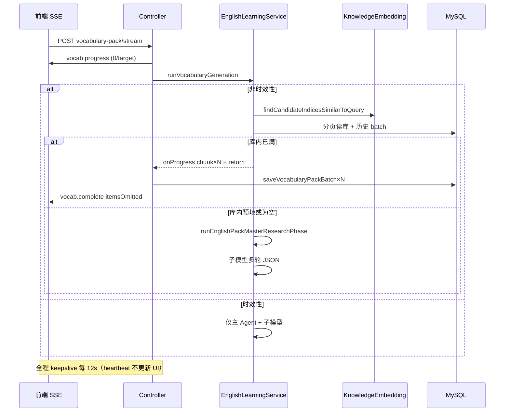

# 英语学习包：主题向量匹配、库内直出与 SSE 大批量传输

## 1. 背景与目标

用户在「单词包 / 经典句」流式拉取时，希望：

1. **同主题识别更准确**：不再仅靠历史 topic / 库标题的字符串 `includes`，改用与知识库相同的 **embedding（向量嵌入）** 模型做语义匹配。
2. **库内资料可直出或预填**：登录用户若已有足够同主题导入库或历史批次数据，可跳过或部分跳过大模型，降低成本与延迟。
3. **大批量（如 3000～6000 条）稳定传输**：避免单次 SSE 帧过大、长时间无数据导致「流式连接异常结束」、进度条被心跳重置等问题。
4. **历史列表与进度一致**：库内直出/预填的词条也要写入当前 `streamId` 的 batch 表，与 LLM 轮次一致。
5. **时效性主题走 Agent**：如「今日热点」「近期舆情」等，**不查库**，直接主 Agent 联网检索 + 子模型生成。

本文档仅描述**本轮改动**的实现思路与关键代码；若与仓库最新源码不一致，**以源码为准**。

---

## 2. 改动范围

| 层级 | 路径 |
|------|------|
| 常量 | `apps/backend/src/services/english-learning/constant.ts` |
| 核心服务 | `apps/backend/src/services/english-learning/english-learning.service.ts` |
| SSE 控制器 | `apps/backend/src/services/english-learning/english-learning.controller.ts` |
| 模块依赖 | `apps/backend/src/services/english-learning/english-learning.module.ts` |
| 向量服务 | `apps/backend/src/services/knowledge-embedding/knowledge-embedding.service.ts` |
| SSE 客户端 | `apps/frontend/src/utils/englishLearningPackSse.ts` |
| 流状态 Store | `apps/frontend/src/store/englishPack.ts` |
| 页面 | `apps/frontend/src/views/englishLearning/vocab/VocabularySection.tsx`、`classic/ClassicQuotesSection.tsx` |
| 文案 | `apps/frontend/src/i18n/locales/zh-CN.ts`、`en-US.ts` |

关联既有文档：[english-learning-pack-sse.md](./english-learning-pack-sse.md)、[english-learning-library-import.md](./english-learning-library-import.md)。

---

## 3. 实现思路（按改动点）

### 3.1 主题匹配：从子串改为 embedding + 完全相等

- **问题**：`topic.includes(库标题)` 易漏匹配（「商务英语」vs「职场商务词汇」）或误匹配（短词被长标题包含）。
- **方案**：
  - 收集用户近期 **历史 batch.topic** 与 **导入库 title**，`collectUniquePackTopicLabels` 按小写去重，避免重复 embedding。
  - **完全相等**（trim 后忽略大小写）直接命中，不调 API。
  - 其余候选一次性调用 `KnowledgeEmbeddingService.findCandidateIndicesSimilarToQuery`，余弦相似度 ≥ `PACK_TOPIC_VECTOR_SIMILARITY_MIN`（默认 0.72）视为同主题。
  - 构建 `PackTopicMatchIndex`，单次生成内复用，供「库内加载」与「去重键加载」共用。
- **权衡**：向量失败时仅保留「完全相等」命中，不阻断生成。

### 3.2 库内加载：分页 + 三种结果路径

- **分页**：单库原先 `take: min(limit, 2000)` 在 limit=6000 时只能读前 2000 行；改为 `loadVocabItemsFromLibraryPaginated` / `loadClassicItemsFromLibraryPaginated`，每页 `PACK_TOPIC_LIBRARY_ITEMS_PAGE_SIZE`（1000），直到凑满 `limit` 或库读完。
- **路径 A — 库内已满**：`dbItems.length >= count` → `emitPackNewItemsInChunks` 分帧推送 → `return`，Controller 标记 `fromDatabase`，跳过后续 LLM。
- **路径 B — 库内预填**：`0 < dbItems < count` → 预填进 `accumulated` / `seen`，再走主 Agent + 子模型补足。
- **路径 C — 无库内**：直接进入主 Agent 与子模型循环（与改造前一致）。

### 3.3 时效性主题：跳过全部库内逻辑

- 复用已有 `resolveWebSearchTime` / `ENGLISH_PACK_WEB_SEARCH_RECENCY_HEURISTIC_RULES`（今日、近期、新闻、显式日期等）。
- `isPackTopicTimeSensitive(topic)` 为真时：**不**构建 topic 索引、**不** `loadTopicRelated*FromDb`、**不** `loadExistingPackKeysForGeneration`、**不**给主 Agent 传 `existingPackHint`；仅日志后走 `runEnglishPackMasterResearchPhase` + 子模型。

### 3.4 SSE：分块、心跳、精简 complete

- **分块**：`emitPackNewItemsInChunks` 每批最多 `PACK_SSE_DATABASE_EMIT_CHUNK_SIZE`（400）条，驱动多帧 `vocab.chunk` / `classic.chunk`。
- **心跳**：`startEnglishPackSseKeepalive` 每 12s 发 `*.progress` 且 `heartbeat: true`，防止代理/客户端空闲断连；前端**必须忽略**该帧对进度的更新（见 3.6）。
- **complete**：当库内直出或 `items.length >= 200` 时，`buildEnglishPackCompleteSsePayload` 不再重复塞入整包 `items`，改传 `itemCount` + `itemsOmitted: true`，由前端用已累积的 chunk 列表收尾。

### 3.5 历史 batch 落库：库内与 LLM 统一写入

- 原先 `if (!p.fromDatabase) saveVocabularyPackBatch` 导致库内直出未写入 `english_vocabulary` 表，历史列表 `wordCount` 与进度不一致。
- 现：**只要有 `newItems` 就 `saveVocabularyPackBatch` / `saveClassicQuotesPackBatch`**，`fromDatabase` 仅作 SSE 标记与前端 Toast。

### 3.6 前端：进度不回退、complete 无 items 时用 Store

- `englishLearningPackSse`：`heartbeat === true` 时不调用 `onProgress`。
- `englishPack`：`vocabOnProgress` / `classicOnProgress` 保证 `collected` 只增不减；`vocabOnChunk` 用列表长度抬高进度。
- `VocabularySection`：`itemsOmitted` 且 `complete.items` 为空时，用 `EnglishPackStore.vocabItems` 作为 `finalList`。

---

## 4. 关键代码与注释

### 4.1 常量（阈值集中配置）

**来源**：`apps/backend/src/services/english-learning/constant.ts`（约 L38–L56）

```typescript
/** 主题向量比对余弦下限（KNOWLEDGE_EMBEDDING_MODEL，默认 bge-large-zh） */
export const PACK_TOPIC_VECTOR_SIMILARITY_MIN = 0.72;

/** 单次 embedding 比对的候选标签上限（含 query 外的库标题/历史 topic） */
export const PACK_TOPIC_VECTOR_MATCH_MAX_LABELS = 64;

/** 单库分页读取行数（支持 6000+ 条库内直出） */
export const PACK_TOPIC_LIBRARY_ITEMS_PAGE_SIZE = 1000;

/** 库内/SSE 每帧 chunk 条数上限，避免单帧 JSON 过大 */
export const PACK_SSE_DATABASE_EMIT_CHUNK_SIZE = 400;

/** complete 省略 items 数组的阈值（chunk 已送达） */
export const PACK_SSE_COMPLETE_OMIT_ITEMS_THRESHOLD = 200;

/** SSE 保活心跳间隔（毫秒） */
export const PACK_SSE_KEEPALIVE_INTERVAL_MS = 12_000;
```

---

### 4.2 向量相似度 API（集中在 KnowledgeEmbedding 模块）

**来源**：`apps/backend/src/services/knowledge-embedding/knowledge-embedding.service.ts`（约 L238–L277）

```typescript
/**
 * 批量 embed：[query, ...candidates]，在模块内做余弦相似度，返回达阈值的 candidates 下标。
 * 英语学习服务不手写 cosine，统一走本方法。
 */
async findCandidateIndicesSimilarToQuery(input: {
  query: string;
  candidates: string[];
  minCosineSimilarity?: number;
}): Promise<number[]> {
  const query = (input.query ?? '').trim();
  const minSim = /* 默认 0.72 */;
  // ... 过滤空候选 ...

  const vectors = await this.embedDocuments([
    query,
    ...indexed.map((x) => x.text),
  ]);
  const queryVec = vectors[0];
  // ... 对每个候选向量计算 cosineSimilarity(queryVec, vec) >= minSim ...
  return matched; // 原 candidates 数组中的下标
}
```

---

### 4.3 主题匹配索引

**来源**：`apps/backend/src/services/english-learning/english-learning.service.ts`（`buildPackTopicMatchIndex`，约 L676–L727）

```typescript
private async buildPackTopicMatchIndex(
  topic: string,
  labels: Iterable<string>,
): Promise<PackTopicMatchIndex> {
  const topicTrim = topic.trim();
  const topicKey = topicTrim.toLowerCase();
  const relatedKeys = new Set<string>();

  for (const raw of labels) {
    const text = raw.trim();
    const key = text.toLowerCase();
    // 去重 + 完全相等：零 API 成本命中
    if (topicKey && key === topicKey) {
      relatedKeys.add(key);
      continue;
    }
    needVector.push({ key, text });
  }

  // 向量精排：仅对未相等命中的候选调 embedding
  const matched = await this.knowledgeEmbedding.findCandidateIndicesSimilarToQuery({
    query: topicTrim,
    candidates: capped.map((x) => x.text),
    minCosineSimilarity: PACK_TOPIC_VECTOR_SIMILARITY_MIN,
  });

  return {
    isRelated: (sourceLabel: string) =>
      relatedKeys.has(sourceLabel.trim().toLowerCase()),
  };
}
```

**来源**：同文件（`collectUniquePackTopicLabels`，约 L793–L809）

```typescript
/** 合并 batches.topic 与 libraries.title，按小写 key 去重，保留首次出现的原文 */
private collectUniquePackTopicLabels(
  ...groups: Iterable<string | null | undefined>[]
): string[] {
  const seen = new Set<string>();
  const out: string[] = [];
  for (const group of groups) {
    for (const raw of group) {
      const text = typeof raw === 'string' ? raw.trim() : '';
      if (!text) continue;
      const key = text.toLowerCase();
      if (seen.has(key)) continue;
      seen.add(key);
      out.push(text);
    }
  }
  return out;
}
```

---

### 4.4 库内分页拉取

**来源**：`apps/backend/src/services/english-learning/english-learning.service.ts`（`loadVocabItemsFromLibraryPaginated`，约 L1082–L1118）

```typescript
private async loadVocabItemsFromLibraryPaginated(
  userId: number,
  libraryId: string,
  items: VocabularyItemDto[],
  seen: Set<string>,
  limit: number,
): Promise<void> {
  let skip = 0;
  while (items.length < limit) {
    const rows = await this.vocabLibraryItemRepo.find({
      where: { userId, libraryId },
      order: { sortOrder: 'ASC' },
      take: PACK_TOPIC_LIBRARY_ITEMS_PAGE_SIZE,
      skip,
    });
    if (rows.length === 0) break;

    for (const row of rows) {
      this.tryPushVocabItemDeduped(items, seen, { /* word, ipa, ... */ }, limit);
      if (items.length >= limit) return;
    }
    skip += rows.length;
    if (rows.length < PACK_TOPIC_LIBRARY_ITEMS_PAGE_SIZE) break; // 最后一页
  }
}
```

---

### 4.5 库内直出 / 预填 / 时效性分流

**来源**：`apps/backend/src/services/english-learning/english-learning.service.ts`（`runVocabularyGeneration` 开头，约 L2421–L2505）

```typescript
const timeSensitive =
  context?.userId != null && this.isPackTopicTimeSensitive(topic);

if (context?.userId != null && !timeSensitive) {
  // 1) 构建 topicMatch（向量 + 相等）
  topicMatch = await this.createPackTopicMatchIndexForUser(...);

  // 2) 库内加载
  const dbItems = await this.loadTopicRelatedVocabularyItemsFromDb(...);
  if (dbItems.length >= count) {
    await this.emitPackNewItemsInChunks({ onProgress, items: result, fromDatabase: true });
    return result; // 全程库内，Controller 侧 servedFromDatabase
  }
  if (dbItems.length > 0) {
    accumulated = dbItems;
    await this.emitPackNewItemsInChunks({ /* 预填 round=0 */ });
  }

  // 3) 同主题去重键并入 seen（供子模型 exclude）
  const dbKeys = await this.loadExistingPackKeysForGeneration({ topicMatch, ... });
  for (const k of dbKeys) seen.add(k);
} else if (timeSensitive) {
  this.logger.log('主题为时效性，跳过全部库内查询，直走主 Agent');
}

const existingPackHint =
  context?.userId != null && !timeSensitive
    ? this.buildExistingPackHintForMaster('vocabulary', seen)
    : '';

// 随后：runEnglishPackMasterResearchPhase + 子模型 while 循环
```

**来源**：同文件（`isPackTopicTimeSensitive`，约 L500–L506）

```typescript
/** 与主 Agent 联网 recency 一致：recency !== 'none' 即视为时效性 */
private isPackTopicTimeSensitive(topic: string): boolean {
  return this.resolveWebSearchTime(topic).recency !== 'none';
}
```

---

### 4.6 SSE 分块推送

**来源**：`apps/backend/src/services/english-learning/english-learning.service.ts`（`emitPackNewItemsInChunks`，约 L732–L777）

```typescript
private async emitPackNewItemsInChunks<T>(params: { /* onProgress, items, target, fromDatabase */ }) {
  const chunkSize = params.chunkSize ?? PACK_SSE_DATABASE_EMIT_CHUNK_SIZE;
  if (items.length <= chunkSize) {
    await onProgress({ collected: items.length, newItems: items, ... });
    return;
  }
  let collected = 0;
  let round = params.startRound ?? 1;
  for (let i = 0; i < items.length; i += chunkSize) {
    const slice = items.slice(i, i + chunkSize);
    collected += slice.length;
    await onProgress({ collected, target, round, newItems: slice, fromDatabase });
    round += 1; // 每 chunk 递增 round，便于前端区分批次
  }
}
```

---

### 4.7 Controller：心跳、落库、精简 complete

**来源**：`apps/backend/src/services/english-learning/english-learning.controller.ts`（约 L60–L101）

```typescript
function startEnglishPackSseKeepalive(emit, params) {
  const timer = setInterval(() => {
    emit({
      type: `${params.eventPrefix}.progress`,
      streamId: params.streamId,
      collected: 0,
      target: params.target,
      round: 0,
      heartbeat: true, // 仅保活，前端不得用其更新进度条
    });
  }, PACK_SSE_KEEPALIVE_INTERVAL_MS);
  return () => clearInterval(timer);
}

function buildEnglishPackCompleteSsePayload(params) {
  const omitItems =
    params.servedFromDatabase ||
    params.items.length >= PACK_SSE_COMPLETE_OMIT_ITEMS_THRESHOLD;
  return {
    type: `${params.eventPrefix}.complete`,
    items: omitItems ? [] : params.items,
    itemCount: params.items.length,
    ...(omitItems ? { itemsOmitted: true } : {}),
    ...(params.servedFromDatabase ? { fromDatabase: true } : {}),
  };
}
```

**来源**：同文件（`vocabularyPackStream` 进度回调，约 L760–L779）

```typescript
if (p.newItems?.length) {
  // 库内与 LLM 均落库，保证历史 wordCount 与进度一致
  await this.englishLearningService.saveVocabularyPackBatch({
    userId,
    streamId,
    round: p.round,
    topic: dto.topic,
    targetCount: target,
    items: p.newItems,
  });
  emit({
    type: 'vocab.chunk',
    items: p.newItems,
    ...(p.fromDatabase ? { fromDatabase: true } : {}),
  });
}
```

---

### 4.8 前端 SSE：忽略心跳、complete 兜底

**来源**：`apps/frontend/src/utils/englishLearningPackSse.ts`（`processLine` 内 `progress`，约 L257–L265）

```typescript
if (type === `${tp}progress`) {
  // 心跳帧只维持连接，若更新 UI 会把「5220/6000」打回「0/6000」
  if (parsed.heartbeat === true) {
    return false;
  }
  onProgress?.({ collected, target, round, streamId });
}
```

**来源**：`apps/frontend/src/store/englishPack.ts`（`vocabOnProgress` / `vocabOnChunk`，约 L131–L182）

```typescript
vocabOnProgress(gen, p) {
  const prev = this.vocabProgress;
  // 防御：任何异常帧也不让 collected 回退
  if (prev && p.collected < prev.collected) {
    this.vocabProgress = { ...p, collected: prev.collected, round: Math.max(prev.round, p.round) };
    return;
  }
  this.vocabProgress = p;
}

vocabOnChunk(gen, delta) {
  this.vocabItems = [...this.vocabItems, ...delta];
  // chunk 到达时以列表长度同步进度（与分块推送对齐）
  if (this.vocabProgress && this.vocabItems.length > this.vocabProgress.collected) {
    this.vocabProgress = { ...this.vocabProgress, collected: this.vocabItems.length };
  }
}
```

**来源**：`apps/frontend/src/views/englishLearning/vocab/VocabularySection.tsx`（`onDone`，约 L255–L270）

```typescript
onDone: ({ items: list, requested, fromDatabase, itemsOmitted, itemCount }) => {
  const finalList =
    itemsOmitted && list.length === 0 && EnglishPackStore.vocabItems.length > 0
      ? EnglishPackStore.vocabItems.slice(0, itemCount ?? requested)
      : list;
  EnglishPackStore.vocabOnDone(myGen, finalList);
  // fromDatabase 时 Toast：已从资源库加载
};
```

---

## 5. 端到端数据流（简图）



---

## 6. 兼容性与影响

| 场景 | 行为 |
|------|------|
| 稳定主题 + 库内充足 | 可全程 `fromDatabase`，不调子模型；历史列表条数与进度一致 |
| 稳定主题 + 库内不足 | 预填 + Agent 补足；进度在预填后连续增长 |
| 时效性主题 | 不查库；必须走 Agent；无「并入 DB 去重键」日志 |
| 向量 API 不可用 | 仅「完全相等」主题命中库；其余当非同主题 |
| 大批量库内 | 分页读取 + 分块 SSE + complete 省略 items |

**破坏性**：无 API 契约破坏；SSE 新增可选字段 `heartbeat`、`itemsOmitted`、`itemCount`，旧前端忽略未知字段仍可工作（但大批量可能仍断流）。

---

## 7. 建议回归

1. 主题「商务英语六级词汇」+ 库内 ≥ 目标条数 → 直出、历史条数一致、无 LLM 日志。
2. 主题「今日热点英语词汇」→ 仅「跳过全部库内查询」日志，无去重键日志；有 Agent 工具事件。
3. 目标 3000/6000，库内 6000+ → 无「流式连接异常结束」；进度不回跳 0。
4. 库内 2000 + 模型补 4000 → 预填后进度保持，最终 6000；历史详情可还原全量。

---

## 8. 相关源码路径

| 说明 | 路径 |
|------|------|
| 主题匹配与库内加载 | `apps/backend/src/services/english-learning/english-learning.service.ts` |
| SSE 与落库 | `apps/backend/src/services/english-learning/english-learning.controller.ts` |
| 向量比对 | `apps/backend/src/services/knowledge-embedding/knowledge-embedding.service.ts` |
| 阈值常量 | `apps/backend/src/services/english-learning/constant.ts` |
| 前端 SSE | `apps/frontend/src/utils/englishLearningPackSse.ts` |
| 前端状态 | `apps/frontend/src/store/englishPack.ts` |
