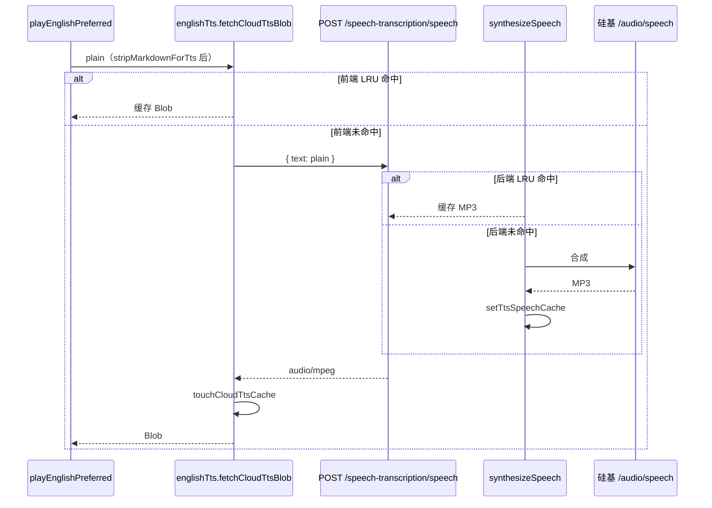

# 云端 TTS 同句读音一致：前后端 MP3 缓存

> 播放世代、`preferLocal` 单词本机优先见 [`english-tts-playback.md`](./english-tts-playback.md)。  
> 硅基 TTS 接入与默认音色见 `apps/backend/src/services/speech-transcription/siliconflow-transcription.service.ts`。

## 1. 背景与目标

### 1.1 用户视角

在英语学习等场景使用**在线云端 TTS**（硅基 CosyVoice2）朗读同一句英文时，每次点击喇叭听到的**重音、语调、个别音素**可能不同，无法形成稳定的「标准读音」。

### 1.2 根因

| 项 | 说明 |
|----|------|
| 模型 | 默认 `FunAudioLLM/CosyVoice2-0.5B`，神经 TTS（神经语音合成）带采样随机性 |
| API | `POST /v1/audio/speech` 提供 `model` / `voice` / `speed` / `gain`，**无 seed（随机种子）** 参数 |
| 既有配置 | 后端已固定 `voice`（如 `claire`）、`speed: 1`、`gain: 0`，仍无法保证两次合成比特级一致 |

### 1.3 本轮目标

对**同一段规范化文本**缓存首次合成得到的 MP3，重复播放走缓存，使用户感知为「同一句读音不变」。

| 层级 | 策略 |
|------|------|
| 后端 | `synthesizeSpeech` 命中内存 LRU（最近使用，Least Recently Used）则直接返回 Buffer |
| 前端 | `fetchCloudTtsBlob` 命中内存 LRU 则跳过 HTTP，用缓存 `ArrayBuffer` 构造 Blob |

**未采用**：要求硅基增加 seed（API 暂不支持）；换模型需单独评估成本与授权。

若与仓库最新源码不一致，**以源码为准**。

---

## 2. 改动范围

| 说明 | 路径 |
|------|------|
| 前端云端朗读与缓存 | `apps/frontend/src/utils/englishTts.ts` |
| 硅基 TTS 合成与缓存 | `apps/backend/src/services/speech-transcription/siliconflow-transcription.service.ts` |
| HTTP 出口（未改契约） | `apps/backend/src/services/speech-transcription/speech-transcription.controller.ts` → `POST speech` |

**工作区其它 diff（与 TTS 无关）**：`KnowledgeEditorToolbar.tsx` 曾出现导入按钮占位（`onClick` 注释），不纳入本方案验收。

---

## 3. 实现思路

### 3.1 双层缓存数据流



1. **第一次**播放某句：前后端均未命中 → 调用硅基 → 两端各自写入 LRU。
2. **第二次及以后**（同会话、未 eviction）：前端直接 Blob；若前端被逐出但后端仍命中，则少打硅基、前端再缓存一份。
3. **缓存键必须含合成参数**（后端）：修改 `SILICONFLOW_TTS_MODEL` / `SILICONFLOW_TTS_VOICE` 或 speed/gain 后 key 变化，避免旧音色 MP3 被误用。

### 3.2 LRU 实现要点

两端均用 `Map`：**get 时 delete 再 set** 把条目移到末尾；**超上限**时删 `keys().next()`（最久未用）。  
前端上限 **64** 条，后端 **256** 条（按进程内存权衡，非持久化）。

### 3.3 与「播放世代」的关系

`playbackGeneration` 只作废**过期的异步播放**，不清空 TTS 音频缓存。快速连点不同句时，各句缓存独立；连点同句则复用同一段 MP3，读音一致。

### 3.4 边界与权衡

| 场景 | 行为 |
|------|------|
| 首次播放 | 仍随机采样一次，该次读音被「锁定」进缓存 |
| 刷新页面 | 前端缓存清空；后端进程内缓存仍在（多用户共享进程时各用户 plain 文本不同 key） |
| 后端重启 | 服务端缓存清空，需重新合成 |
| 文本差异 | 多一个空格 / 标点即不同 key；与 `stripMarkdownForTts` 规范化结果对齐 |
| 本机 `preferLocal` | 不走云端缓存，走 Web Speech 固定 `pickEnglishVoice()` |

---

## 4. 关键代码与注释

### 4.1 后端：缓存键与 LRU

**来源**：`apps/backend/src/services/speech-transcription/siliconflow-transcription.service.ts`（约 L10–L75）

```typescript
/** 同文朗读缓存上限（CosyVoice2 无 seed，缓存保证重复播放读音一致） */
const TTS_SPEECH_CACHE_MAX = 256;

@Injectable()
export class SiliconflowTranscriptionService {
  /** 文本 + 模型/音色/语速/增益 → MP3 */
  private readonly ttsSpeechCache = new Map<string, Buffer>();

  private buildTtsSpeechCacheKey(plain: string): string {
    return [
      this.resolveTtsModel(),
      this.resolveTtsVoice(),
      '1', // 说明：与请求体 speed 一致，变更 speed 须同步改 key
      '0', // 说明：与请求体 gain 一致
      plain,
    ].join('\u0001');
  }

  private getTtsSpeechFromCache(key: string): Buffer | null {
    const hit = this.ttsSpeechCache.get(key);
    if (!hit) return null;
    // 说明：LRU 触摸 — 移到 Map 末尾
    this.ttsSpeechCache.delete(key);
    this.ttsSpeechCache.set(key, hit);
    return hit;
  }

  private setTtsSpeechCache(key: string, buffer: Buffer): void {
    // 说明：写入并淘汰最久未用条目
    // ...
  }
}
```

### 4.2 后端：合成前查缓存、成功后写入

**来源**：`apps/backend/src/services/speech-transcription/siliconflow-transcription.service.ts`（`synthesizeSpeech` 约 L118–L175）

```typescript
async synthesizeSpeech(text: string): Promise<Buffer> {
  const plain = text.trim().slice(0, TTS_INPUT_MAX_CHARS);
  if (!plain) {
    throw new HttpException('朗读文本为空', HttpStatus.BAD_REQUEST);
  }

  const cacheKey = this.buildTtsSpeechCacheKey(plain);
  const cached = this.getTtsSpeechFromCache(cacheKey);
  if (cached) {
    return Buffer.from(cached); // 说明：拷贝一份，避免调用方篡改缓存 Buffer
  }

  // ... fetch 硅基 /audio/speech，body: model, input, voice, speed, gain ...

  const buffer = Buffer.from(await res.arrayBuffer());
  this.setTtsSpeechCache(cacheKey, buffer);
  return buffer;
}
```

### 4.3 前端：LRU 与 `fetchCloudTtsBlob`

**来源**：`apps/frontend/src/utils/englishTts.ts`（约 L86–L108、L166–L193）

```typescript
const CLOUD_TTS_CACHE_MAX = 64;
/** 规范化 plain 文本 → MP3 ArrayBuffer */
const cloudTtsAudioCache = new Map<string, ArrayBuffer>();

function getCloudTtsFromCache(plain: string): Blob | null {
  const hit = cloudTtsAudioCache.get(plain);
  if (!hit) return null;
  cloudTtsAudioCache.delete(plain);
  cloudTtsAudioCache.set(plain, hit);
  return new Blob([hit], { type: 'audio/mpeg' });
}

async function fetchCloudTtsBlob(plain: string): Promise<Blob> {
  const cached = getCloudTtsFromCache(plain);
  if (cached) {
    return cached; // 说明：同句重复播放，不再请求 /speech-transcription/speech
  }

  // ... POST SPEECH_TTS，body: { text: plain } ...

  const blob = await res.blob();
  const buf = await blob.arrayBuffer();
  touchCloudTtsCache(plain, buf);
  return new Blob([buf], { type: 'audio/mpeg' });
}
```

**来源**：`apps/frontend/src/utils/englishTts.ts`（`playEnglishPreferred` 云端分支，约 L319–L330）

```typescript
// 说明：plain 已在函数入口 stripMarkdownForTts，与缓存 key 一致
const blob = await fetchCloudTtsBlob(plain);
await playCloudMp3Blob(blob, generation);
```

---

## 5. 兼容性与影响

| 项 | 说明 |
|----|------|
| API | `POST /speech-transcription/speech` 请求/响应不变 |
| 内存 | 后端最多约 256 段 MP3；前端 64 段；长句占用更大 |
| 多实例部署 | 各 Node 进程独立 Map，**不跨实例共享**；同句在不同实例上首次仍可能不同读音 |
| 运维改音色 | 修改 `SILICONFLOW_TTS_VOICE` 后 cache key 变，自动重新合成 |

---

## 6. 建议回归测试

1. 经典句 / 长句：同一英文句连续点喇叭 3 次，第 2、3 次应与第 1 次听感一致。
2. DevTools Network：第 2 次起可不出现 `speech-transcription/speech`（前端命中）；清前端缓存后仅第 1 次打硅基（后端命中时响应仍快）。
3. 修改 `.env` 中 `SILICONFLOW_TTS_VOICE` 后重启后端，同句应重新合成（新音色）。
4. 单词 `preferLocal: true`：仍走本机，不受云端缓存影响。

---

## 7. 后续可做（非本轮）

- 持久化缓存（Redis / 对象存储）以跨重启、跨实例统一读音。
- 环境变量暴露 `TTS_SPEECH_CACHE_MAX` 便于运维调参。
- 产品层「预生成」热门例句音频，进一步降低首播随机性。

---

## 8. 相关文档与源码

| 说明 | 路径 |
|------|------|
| 播放世代 / preferLocal | [`english-tts-playback.md`](./english-tts-playback.md) |
| 前端朗读工具 | `apps/frontend/src/utils/englishTts.ts` |
| 硅基合成服务 | `apps/backend/src/services/speech-transcription/siliconflow-transcription.service.ts` |
| 控制器 | `apps/backend/src/services/speech-transcription/speech-transcription.controller.ts` |
