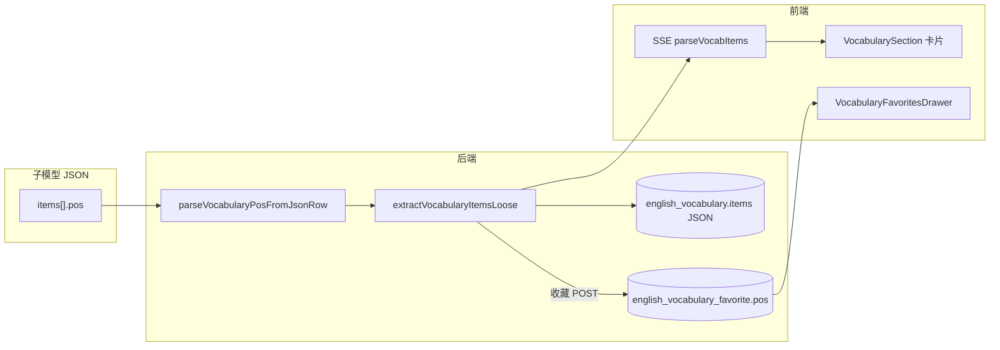

# 英语学习：单词包词性（pos）字段实现说明

## 1. 背景与目标

用户在「英语学习 → 单词包」拉取词条时，除 **word / ipa / translationZh / example** 外，需要每条附带 **词性（Part of Speech）**，并以 **英文缩写** 展示（如 `n` 名词、`v` 动词、`adj` 形容词、`phr.` 短语等），便于学习与收藏、导出时区分同一词形的不同用法。

**本轮目标**：

1. 子模型 JSON 输出增加 `pos` 字段，并在 Prompt 中约束格式与常用缩写表。
2. 后端解析、落库（批次 JSON + 收藏表）、历史详情、收藏列表与 DOCX 导出全链路携带 `pos`。
3. 前端 SSE 解析、主列表卡片、收藏抽屉展示 `pos`；收藏请求体带上 `pos`。
4. **兼容旧数据**：历史批次 JSON 无 `pos` 时按空串处理；收藏表需执行迁移增加 `pos` 列（见 §5）。

若与仓库最新源码不一致，**以源码为准**。

---

## 2. 改动范围

| 层级 | 路径 | 说明 |
|------|------|------|
| Prompt | `apps/backend/src/services/english-learning/prompt.ts` | 单词包子模型 JSON 模板与 `pos` 字段说明 |
| 类型 / DTO | `apps/backend/src/services/english-learning/english-learning.service.ts` | `VocabularyItemDto.pos` |
| 解析 | 同上 `parseVocabularyPosFromJsonRow`、`extractVocabularyItemsLoose` | 从 LLM JSON 提取并截断 |
| 批次 JSON | `apps/backend/src/services/english-learning/english-vocabulary.entity.ts` | `EnglishVocabularyPackItemJson.pos?` |
| 收藏实体 | `apps/backend/src/services/english-learning/english-vocabulary-favorite.entity.ts` | `pos` 列 `varchar(32)` |
| 收藏 DTO | `apps/backend/src/services/english-learning/dto/vocabulary-favorite.dto.ts` | 可选 `pos` |
| 服务 | `english-learning.service.ts` | 历史详情、收藏增删查、DOCX 导出 |
| DOCX | `apps/backend/src/services/english-learning/english-favorites-docx.builder.ts` | 导出增加「词性」行 |
| 前端类型 | `apps/frontend/src/service/index.ts` | `EnglishVocabularyItem`、`EnglishVocabularyFavoriteListEntry` |
| SSE | `apps/frontend/src/utils/englishLearningPackSse.ts` | `parseVocabItems` 解析 `pos` |
| UI | `apps/frontend/src/views/englishLearning/VocabularySection.tsx` | 列表卡片词旁展示 |
| UI | `apps/frontend/src/views/englishLearning/VocabularyFavoritesDrawer.tsx` | 收藏抽屉词旁展示 |
| i18n | `apps/frontend/src/i18n/locales/zh-CN.ts`、`en-US.ts` | `englishLearning.vocab.pos` |

**关联文档**（收藏与列表，不含本轮 pos 细节时可对照）：

- `docs/english/english-learning-pack-favorites.md`
- `docs/english/english-learning-pack-sse.md`
- `docs/english/english-learning-impl-overview.md`

---

## 3. 实现思路

### 3.1 端到端数据流



1. **生成**：`VOCABULARY_PACK_SUBMODEL_SYSTEM_STATIC` 要求每条 `items` 含 `pos`（英文缩写，1～12 字符语义，库字段上限 32）。
2. **解析**：`extractVocabularyItemsLoose` 在 `word`、`ipa` 校验通过后调用 `parseVocabularyPosFromJsonRow`，兼容 `pos` / `posAbbr` / `partOfSpeech` 等别名键。
3. **持久化**：流式每轮 `saveVocabularyPackBatch` 将完整 `VocabularyItemDto[]` 写入 `english_vocabulary.items` JSON；`pos` 为可选字段，旧批次无键时不影响读取。
4. **收藏**：`addVocabularyFavorite` 将 `pos` 写入 `english_vocabulary_favorite.pos`（`varchar(32)`）；列表与 DOCX 导出一并返回。
5. **展示**：前端在 word 右侧以小号标签展示 `pos`（有值才显示）；`title` 使用 i18n 说明缩写含义。

### 3.2 为何 `slice(0, 32)`？

- 收藏表列定义为 **`varchar(32)`**，与 Prompt 中「缩写 1～12 字符」的语义一致，32 为数据库与 API 的**硬上限兜底**。
- 防止模型偶发返回长句（如 `"noun (名词)"`）导致写库失败或接口不一致。
- 正常缩写（`n`、`v`、`adj`、`phr.v.`）不会被截断。

### 3.3 为何多轮线程快照仍只存 `words`？

`buildPackAgentThreadAssistantSnapshot('vocabulary')` 仅向后续轮次传递 `{ words: [...] }`，**不包含 pos**。去重维度仍是 **word 词形**；词性不参与去重，避免 token 膨胀。若未来需要「同形异词性」两条，需单独改去重键设计（本轮未做）。

### 3.4 兼容性

| 场景 | 行为 |
|------|------|
| 旧批次 JSON 无 `pos` | 历史详情映射为 `''`；前端不展示词性标签 |
| 新拉取 | 模型按 Prompt 输出 `pos`；前后端全链路有值 |
| 收藏旧行无 `pos` 列 | 需执行 DB 迁移；读库 `r.pos ?? ''` |

---

## 4. 关键代码与注释

### 4.1 子模型 Prompt：JSON 模板与词性说明

**来源**：`apps/backend/src/services/english-learning/prompt.ts`（`VOCABULARY_PACK_SUBMODEL_SYSTEM_STATIC` 内 Output Format 段，约 L97–L107）

```typescript
// 说明：单词包子模型必须输出单个 JSON 对象，items 中每条多一个 pos 字段
// 格式规范（摘录）：
// {"items":[{"word":"","ipa":"","pos":"","translationZh":"","example":""}]}

// 字段要求（摘录）：
// - pos：词性英文缩写，小写优先，与当前义项主词性一致
//   常用 n / v / adj / adv / prep / conj / pron / det / num / int / abbr / phr. 等
// - 仍须满足原有 word、ipa、translationZh、example 约束与 JSON 转义规则
```

### 4.2 批次 JSON 类型（可选 pos）

**来源**：`apps/backend/src/services/english-learning/english-vocabulary.entity.ts`（约 L9–L15）

```typescript
/** 与 VocabularyItemDto 一致，存 JSON 列 */
export type EnglishVocabularyPackItemJson = {
	word: string;
	ipa: string;
	/** 词性英文缩写，如 n / v / adj（旧数据可能缺省） */
	pos?: string; // 说明：可选，兼容升级前已落库的批次
	translationZh: string;
	example: string;
};
```

### 4.3 从 LLM 行对象解析 pos（多键名 + 长度上限）

**来源**：`apps/backend/src/services/english-learning/english-learning.service.ts`（`parseVocabularyPosFromJsonRow`，约 L496–L507）

```typescript
/** 从 LLM JSON 行对象解析词性缩写（兼容多种键名） */
private parseVocabularyPosFromJsonRow(r: Record<string, unknown>): string {
	// 说明：模型或历史数据可能用不同键名，按优先级取第一个非空字符串
	const raw =
		(typeof r.pos === 'string' && r.pos) ||
		(typeof r.posAbbr === 'string' && r.posAbbr) ||
		(typeof r.pos_abbr === 'string' && r.pos_abbr) ||
		(typeof r.partOfSpeech === 'string' && r.partOfSpeech) ||
		(typeof r.part_of_speech === 'string' && r.part_of_speech) ||
		(typeof r.speech === 'string' && r.speech) ||
		'';
	// 说明：trim 去空白；slice(0,32) 与收藏表 varchar(32) 及全链路校验一致
	return raw.trim().slice(0, 32);
}
```

### 4.4 词条提取：合并进 VocabularyItemDto

**来源**：`apps/backend/src/services/english-learning/english-learning.service.ts`（`extractVocabularyItemsLoose` 循环内，约 L946–L955）

```typescript
const example = typeof r.example === 'string' ? r.example.trim() : '';
if (!word || !ipa) continue; // 说明：仍要求 word+ipa；pos 缺失不阻断条目（为空串）

const pos = this.parseVocabularyPosFromJsonRow(r);
out.push({
	word,
	ipa,
	pos, // 说明：新增字段，进入 SSE、落库、收藏整条透传
	translationZh: translationZh || '—',
	example: example || '—',
});
```

### 4.5 DTO 定义

**来源**：`apps/backend/src/services/english-learning/english-learning.service.ts`（约 L108–L115）

```typescript
export type VocabularyItemDto = {
	word: string;
	ipa: string;
	/** 词性英文缩写，如 n、v、adj（旧数据或解析失败时可为空串） */
	pos: string;
	translationZh: string;
	example: string;
};
```

### 4.6 历史详情：从批次 JSON 还原 pos

**来源**：`apps/backend/src/services/english-learning/english-learning.service.ts`（`getVocabularyHistoryDetail` 内层循环，约 L1863–L1872）

```typescript
items.push({
	word: it.word,
	ipa: it.ipa,
	pos:
		typeof it.pos === 'string'
			? it.pos.trim().slice(0, 32) // 说明：与解析/收藏路径一致的上限
			: '', // 说明：旧批次无 pos 字段时返回空串
	translationZh: it.translationZh || '—',
	example: it.example || '—',
});
```

### 4.7 收藏实体与写入

**来源**：`apps/backend/src/services/english-learning/english-vocabulary-favorite.entity.ts`（约 L32–L34）

```typescript
/** 词性英文缩写（如 n、v、adj），与单词包条目一致 */
@Column({ type: 'varchar', length: 32, default: '' })
pos!: string;
```

**来源**：`apps/backend/src/services/english-learning/dto/vocabulary-favorite.dto.ts`（约 L18–L24）

```typescript
/** 词性英文缩写（可选，与生成条目 pos 一致） */
@IsOptional()
@IsString()
@MaxLength(32)
pos?: string;
```

**来源**：`apps/backend/src/services/english-learning/english-learning.service.ts`（`addVocabularyFavorite` 创建行，约 L2023–L2031）

```typescript
const row = this.vocabFavoriteRepo.create({
	userId,
	wordKey,
	word: item.word.trim(),
	ipa: typeof item.ipa === 'string' ? item.ipa : '',
	pos: typeof item.pos === 'string' ? item.pos.trim().slice(0, 32) : '',
	translationZh: item.translationZh ?? '',
	example: item.example ?? '',
});
```

### 4.8 DOCX 导出

**来源**：`apps/backend/src/services/english-learning/english-favorites-docx.builder.ts`（`buildVocabularyFavoritesDocxBuffer` 单条循环内，约 L54–L64）

```typescript
// 说明：有 pos 时在音标与释义之间插入一行「词性：xxx」
if (r.pos?.trim()) {
	children.push(
		new Paragraph({
			children: [
				new TextRun({ text: '词性：', bold: true }),
				new TextRun({ text: clip(r.pos, 64) }),
			],
		}),
	);
}
```

### 4.9 前端 SSE 解析

**来源**：`apps/frontend/src/utils/englishLearningPackSse.ts`（`parseVocabItems`，约 L47–L54）

```typescript
out.push({
	word: o.word,
	ipa: o.ipa,
	// 说明：与后端一致，非字符串或缺失时置空串，避免 undefined 传入 UI
	pos: typeof o.pos === 'string' ? o.pos.trim().slice(0, 32) : '',
	translationZh: typeof o.translationZh === 'string' ? o.translationZh : '—',
	example: typeof o.example === 'string' ? o.example : '—',
});
```

### 4.10 前端类型与收藏列表

**来源**：`apps/frontend/src/service/index.ts`（约 L463–L470、L571–L578）

```typescript
export type EnglishVocabularyItem = {
	word: string;
	ipa: string;
	/** 词性英文缩写，如 n、v、adj（旧接口可能缺省，按空串处理） */
	pos: string;
	translationZh: string;
	example: string;
};

export type EnglishVocabularyFavoriteListEntry = {
	id: string;
	word: string;
	ipa: string;
	pos: string; // 说明：收藏列表接口新增字段
	translationZh: string;
	example: string;
	createdAt: string;
};
```

### 4.11 主列表 UI：词旁展示词性标签

**来源**：`apps/frontend/src/views/englishLearning/VocabularySection.tsx`（卡片标题区，约 L725–L736）

```tsx
<div className="flex min-w-0 flex-wrap items-baseline gap-x-2 gap-y-0.5">
	<div className="truncate text-lg font-semibold text-textcolor @min-[26rem]:text-base">
		{item.word}
	</div>
	{/* 说明：仅当 pos 非空时渲染；title 用 i18n 解释缩写含义 */}
	{item.pos?.trim() ? (
		<span
			className="text-textcolor/55 shrink-0 text-xs font-medium tracking-wide"
			title={t('englishLearning.vocab.pos')}
		>
			{item.pos}
		</span>
	) : null}
</motion.div>
```

### 4.12 收藏抽屉 UI

**来源**：`apps/frontend/src/views/englishLearning/VocabularyFavoritesDrawer.tsx`（列表行标题，约 L390–L404）

```tsx
<Label /* ... */>
	<span className="truncate text-base font-semibold text-textcolor">
		{row.word}
	</span>
	{row.pos?.trim() ? (
		<span
			className="text-textcolor/50 shrink-0 text-xs font-medium tracking-wide"
			title={t('englishLearning.vocab.pos')}
		>
			{row.pos}
		</span>
	) : null}
</Label>
```

### 4.13 国际化

**来源**：`apps/frontend/src/i18n/locales/zh-CN.ts`、`en-US.ts`（`englishLearning.vocab.pos`）

```typescript
// zh-CN
'englishLearning.vocab.pos': '词性（英文缩写，如 n、v、adj）',

// en-US
'englishLearning.vocab.pos': 'Part of speech (e.g. n, v, adj)',
```

---

## 5. 数据库与部署

### 5.1 收藏表新增列

实体已声明 `english_vocabulary_favorite.pos`（`varchar(32) DEFAULT ''`）。**生产库需执行迁移**，例如：

```sql
ALTER TABLE `english_vocabulary_favorite`
ADD COLUMN `pos` varchar(32) NOT NULL DEFAULT '' AFTER `ipa`;
```

或在服务器 `server` 根目录使用项目内生产迁移脚本（见 `docs/ops/server-deployment.md` 与 `package.json` 中 `m:c:prod` / `m:run:prod`），迁移文件需自行按实体生成并放入 **`server/migrations/`**（与 `dist` 分离，避免覆盖）。

### 5.2 批次表

`english_vocabulary.items` 为 **JSON 列**，无需 ALTER；新字段随新拉取写入即可。

---

## 6. 兼容性与影响

| 项 | 说明 |
|----|------|
| API 破坏性 | 响应多 `pos` 字段，旧客户端可忽略 |
| 收藏 POST | body 可增加可选 `pos`；未传则存空串 |
| 历史会话 | 无 `pos` 的批次详情返回 `pos: ''` |
| 经典句包 | **无改动**（仅单词包） |

---

## 7. 建议回归测试

1. 登录后拉取单词包：每条应有合理缩写（`n`/`v`/`adj` 等），卡片词右侧可见。
2. 收藏 / 取消收藏：刷新后星标与 `pos` 仍正确；收藏抽屉与主列表一致。
3. 打开历史会话详情：新会话有 `pos`；旧会话无标签但不报错。
4. 导出收藏 DOCX：含「词性」行（有值时）。
5. 生产执行迁移后 `addVocabularyFavorite` 不报列不存在。

---

## 8. 相关源码路径速查

| 说明 | 路径 |
|------|------|
| Prompt | `apps/backend/src/services/english-learning/prompt.ts` |
| 解析与服务 | `apps/backend/src/services/english-learning/english-learning.service.ts` |
| 批次 JSON 类型 | `apps/backend/src/services/english-learning/english-vocabulary.entity.ts` |
| 收藏实体 | `apps/backend/src/services/english-learning/english-vocabulary-favorite.entity.ts` |
| 收藏 DTO | `apps/backend/src/services/english-learning/dto/vocabulary-favorite.dto.ts` |
| DOCX | `apps/backend/src/services/english-learning/english-favorites-docx.builder.ts` |
| 前端 API 类型 | `apps/frontend/src/service/index.ts` |
| SSE | `apps/frontend/src/utils/englishLearningPackSse.ts` |
| 单词列表 UI | `apps/frontend/src/views/englishLearning/VocabularySection.tsx` |
| 收藏抽屉 UI | `apps/frontend/src/views/englishLearning/VocabularyFavoritesDrawer.tsx` |
