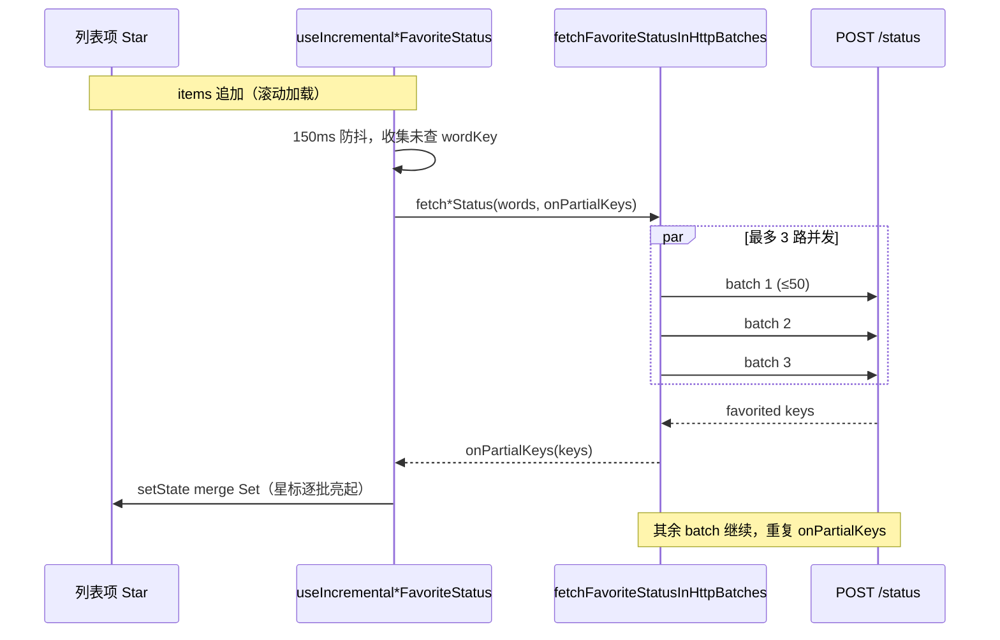

# 收藏星标「慢半拍」：增量查询与渐进点亮

> **按 id 取消收藏、Hook 内 `Map<key,id>`、`onPartial(refs)`**：见 [`english-learning-favorites-by-id.md`](./english-learning-favorites-by-id.md)。  
> 本文聚焦 **星标高亮滞后**（列表已渲染，已收藏词条的星仍空心，需等数秒才批量亮起）。  
> 网络重试、资源库分页等见 [`english-learning-list-network-retry.md`](./english-learning-list-network-retry.md)（含线上偶发 `error sending request` 说明）；  
> 重试失败后 Toast 脱敏与 i18n 见 [`http-network-error-toast.md`](./http-network-error-toast.md)；单词 500 上限与增量 Hook 初版见 [`vocab-favorite-status-query.md`](./vocab-favorite-status-query.md)。

## 1. 背景与目标

### 1.1 用户视角

在 **资源库词条列表**、**单词包 / 经典句包** 中，每条右侧有收藏星标（Star）。用户期望：

- 进入页面或 **滚动加载更多** 后，**已收藏** 的条目应尽快显示实心星；
- 点击星标收藏 / 取消时，星标 **立即** 切换，不必等下一次 `/status` 轮询。

### 1.2 「慢半拍」的两类表现

| 类型 | 表现 | 典型场景 |
|------|------|----------|
| **A. 批量查询滞后** | 新加载的一屏 50 条里，已收藏词要等很久才一起亮星 | 资源库滚到底、包列表条目多 |
| **B. 重复全量查询** | 每加载一页就对**全部已加载词**再查一遍 `/status`，越滚越慢 | 改前内联 `useEffect` 全量 `fetch*FavoriteStatus` |

「慢半拍」主要指 **类型 A**：Service 把待查词拆成多批 HTTP（每批 50），改前 **串行** 且 Hook **等全部批结束** 才 `setFavorited*Keys`，用户看到的是「整屏星标晚一步」。

### 1.3 目标

| 层级 | 目标 |
|------|------|
| Service | 每完成一小批 HTTP 即通过 `onPartial(refs)` 上报已收藏 **key + id**，不必等所有批结束 |
| Service | 同一 500 逻辑 chunk 内 **有限并发**（默认 3）拉批，缩短总等待 |
| Hook | 只查 **未查过的** 词/句；滚动 **追加** 时保留已有 Set，不整表清空 |
| Hook | **150ms 防抖**，避免连续 `setItems` 触发多次 `/status` |
| 面板 | 用户点击收藏时更新 **Map/派生 Set**（含 `id`），取消时用 `get*FavoriteId`；与 `/status` 解耦 |

若与仓库最新源码不一致，**以源码为准**。

---

## 2. 改动范围

| 说明 | 路径 |
|------|------|
| 并发上限常量 | `apps/frontend/src/constant/index.ts` → `FAVORITE_STATUS_HTTP_BATCH_CONCURRENCY` |
| 有限并发工具 | `apps/frontend/src/utils/retryAsync.ts` → `runTasksWithConcurrency` |
| 分批 + `onPartialKeys` | `apps/frontend/src/service/index.ts` |
| 单词增量 Hook | `apps/frontend/src/hooks/useIncrementalVocabFavoriteStatus.ts` |
| 经典句增量 Hook | `apps/frontend/src/hooks/useIncrementalClassicQuoteFavoriteStatus.ts` |
| 接入页面 | `VocabularyLibraryWordsPanel`、`ClassicQuotesLibraryWordsPanel`、`VocabularyPackList`、`ClassicQuotesPackList` |

**关联提交（便于追溯）**：

- `dacd109` — 增量 Hook、HTTP 50 小批、防抖、失败回滚 `queriedKeysRef`
- `6fa173f` — `onPartialKeys` 渐进合并、`runTasksWithConcurrency(3)`

---

## 3. 实现思路与过程

### 3.1 数据流（改后）



### 3.2 分阶段落地（实现过程）

**阶段 1 — 少查、别重复查（`dacd109` 及 Hook 初版）**

1. 抽出 `useIncrementalVocabFavoriteStatus`：用 `itemsWordSig` 判断列表是 **末尾追加** 还是 **整体替换**；追加时 **不清空** `favoritedWordKeys`。
2. `queriedKeysRef` 记录已发起查询的规范化 key，只对 **新增 key** 调用 `/status`。
3. `STATUS_QUERY_DEBOUNCE_MS = 150`：快速连续 `items` 更新合并为一次查询。
4. 请求失败时从 `queriedKeysRef` **删除** 本批 key，下次可重试（避免永久「认为已查」导致星标永远不亮）。

**阶段 2 — 小批 HTTP（仍可能慢半拍）**

1. `FAVORITE_STATUS_HTTP_BATCH_SIZE = 50`，满足后端 500 上限的同时减小单次 body。
2. 改前在同一 chunk 内 **for 循环 await 每一批**，全部完成后 Hook 才 **一次** `setFavoritedWordKeys` → 用户感知为「等最慢那一批」。

**阶段 3 — 渐进点亮 + 有限并发（`6fa173f`，针对慢半拍）**

1. Service 增加 `onPartialKeys`：每个 HTTP 小批返回后立即回调。
2. Hook 传入 `mergeFavoritedKeys`，在回调里 `setFavoritedWordKeys(prev => merge)`，**星标随批到达逐条亮起**。
3. 引入 `runTasksWithConcurrency(tasks, 3)`：同一 500 chunk 内最多 3 个 POST 并行，缩短墙钟时间；chunk 之间仍 `setTimeout(50)` 控流。

**阶段 4 — 点击收藏不等待 `/status`（面板层，与 A 类问题互补）**

`toggleVocabularyFavorite` / `toggleClassicQuoteFavorite` 在 API 成功后立即 `setFavorited*Keys` add/delete，不依赖批量查询结果。

### 3.3 关键权衡

| 方案 | 优点 | 未采用原因 |
|------|------|------------|
| 单次 POST 全量 words | 实现简单 | 超 500 报错；body 大易超时 |
| 串行 50 一批，最后统一 setState | 实现简单 | **慢半拍**：50 条也要等 N 批串行结束 |
| 无限并发所有批 | 最快 | 易打满后端 / Tauri 连接 |
| **并发 3 + onPartialKeys** | 速度与体验平衡 | **采用** |

---

## 4. 关键代码与注释

### 4.1 常量：HTTP 批大小与并发上限

**来源**：`apps/frontend/src/constant/index.ts`（约 L61–L66）

```typescript
/** 与后端 DTO ArrayMaxSize(500) 一致 — 逻辑 chunk 上限 */
export const VOCAB_FAVORITE_STATUS_BATCH_SIZE = 500;
/** 单次 POST 的 words/englishes 条数，减小 payload */
export const FAVORITE_STATUS_HTTP_BATCH_SIZE = 50;
/**
 * 同一 500 chunk 内并行 /status 的批次数上限。
 * 说明：过大易请求风暴；为 1 则回到串行「慢半拍」；3 为速度与稳定折中。
 */
export const FAVORITE_STATUS_HTTP_BATCH_CONCURRENCY = 3;
```

### 4.2 有限并发执行器

**来源**：`apps/frontend/src/utils/retryAsync.ts`（约 L57–L79）

```typescript
/**
 * 以有限并发执行任务工厂，返回结果顺序与 tasks 下标一致。
 * 用于：同一 chunk 内多批 /status 并行，缩短「全部批完成」的墙钟时间。
 */
export async function runTasksWithConcurrency<T>(
	tasks: Array<() => Promise<T>>,
	concurrency: number,
): Promise<T[]> {
	if (tasks.length === 0) return [];
	const results: T[] = new Array(tasks.length);
	let nextIndex = 0;
	const workerCount = Math.max(1, Math.min(concurrency, tasks.length));

	async function worker() {
		while (true) {
			const index = nextIndex++;
			if (index >= tasks.length) break;
			results[index] = await tasks[index](); // 按任务下标写回，顺序稳定
		}
	}

	await Promise.all(Array.from({ length: workerCount }, () => worker()));
	return results;
}
```

### 4.3 Service：`onPartialKeys` + 并发批处理

**来源**：`apps/frontend/src/service/index.ts`（`FavoriteStatusBatchOptions` / `fetchFavoriteStatusInHttpBatches` 约 L773–L846）

```typescript
type FavoriteStatusBatchOptions = {
	/** 每完成一小批 HTTP 即回调 — Hook 在此 merge Set，星标渐进亮起 */
	onPartialKeys?: (keys: string[]) => void;
};

/** 单批 POST + retryAsync，与并发调度解耦 */
async function fetchFavoriteStatusHttpBatch(
	url: string,
	batch: string[],
	bodyKey: 'words' | 'englishes',
): Promise<string[]> {
	return retryAsync(
		async () => {
			const res = await http.post(/* ... */, { silent: true });
			// 解析 favoritedWordKeys 或 favoritedContentKeys
			return /* string[] */;
		},
		{ retries: 2, delayMs: 350 },
	);
}

async function fetchFavoriteStatusInHttpBatches(
	url: string,
	words: string[],
	bodyKey: 'words' | 'englishes',
	options?: FavoriteStatusBatchOptions,
): Promise<string[]> {
	const merged: string[] = [];
	for (let chunkStart = 0; chunkStart < words.length; chunkStart += 500) {
		const chunk = words.slice(chunkStart, chunkStart + 500);
		const batches: string[][] = [];
		for (let i = 0; i < chunk.length; i += 50) {
			batches.push(chunk.slice(i, i + 50));
		}

		// 关键：最多 3 批并行；每批完成即 onPartialKeys，不等待同 chunk 其余批
		const chunkKeyLists = await runTasksWithConcurrency(
			batches.map(
				(batch) => () =>
					fetchFavoriteStatusHttpBatch(url, batch, bodyKey).then((keys) => {
						if (keys.length > 0) {
							options?.onPartialKeys?.(keys); // ← 渐进更新 UI
						}
						return keys;
					}),
			),
			FAVORITE_STATUS_HTTP_BATCH_CONCURRENCY,
		);
		for (const keys of chunkKeyLists) {
			merged.push(...keys); // 仍合并完整结果供返回值
		}
		if (chunkStart + 500 < words.length) {
			await new Promise((r) => setTimeout(r, 50)); // chunk 间喘息
		}
	}
	return merged;
}

export const fetchEnglishVocabularyFavoriteStatus = async (
	words: string[],
	options?: FetchEnglishFavoriteStatusOptions,
) => {
	const favoritedWordKeys = await fetchFavoriteStatusInHttpBatches(
		`${ENGLISH_LEARNING_VOCABULARY_FAVORITES}/status`,
		words,
		'words',
		options,
	);
	return { code: 200, success: true, message: '', data: { favoritedWordKeys } };
};
```

### 4.4 Hook：增量 + 防抖 + `mergeFavoritedKeys`

**来源**：`apps/frontend/src/hooks/useIncrementalVocabFavoriteStatus.ts`（约 L28–L88；经典句 Hook 结构相同）

```typescript
const STATUS_QUERY_DEBOUNCE_MS = 150;

useEffect(() => {
	// ... 列表为空则重置；itemsWordSig 非前缀追加则清空 Set 与 queriedKeysRef

	let cancelled = false;
	const timer = window.setTimeout(() => {
		const wordsToQuery: string[] = [];
		for (const item of items) {
			const wk = normalizeEnglishVocabWordKey(item.word);
			if (!wk || queriedKeysRef.current.has(wk)) continue;
			queriedKeysRef.current.add(wk); // 乐观标记，避免同批重复请求
			wordsToQuery.push(item.word);
		}
		if (wordsToQuery.length === 0) return;

		/** 每批 HTTP 返回时调用 — 解决「等全部批结束才亮星」的慢半拍 */
		const mergeFavoritedKeys = (keys: string[]) => {
			if (cancelled || keys.length === 0) return;
			setFavoritedWordKeys((prev) => {
				const next = new Set(prev);
				for (const k of keys) next.add(k);
				return next;
			});
		};

		void (async () => {
			try {
				await fetchEnglishVocabularyFavoriteStatus(wordsToQuery, {
					onPartialKeys: mergeFavoritedKeys,
				});
				if (cancelled) return;
			} catch {
				if (!cancelled) {
					// 失败回滚 queried，便于下次滚动重试
					for (const word of wordsToQuery) {
						const wk = normalizeEnglishVocabWordKey(word);
						if (wk) queriedKeysRef.current.delete(wk);
					}
				}
			}
		})();
	}, STATUS_QUERY_DEBOUNCE_MS);

	return () => {
		cancelled = true;
		clearTimeout(timer);
	};
}, [itemsWordSig, items]);
```

**`itemsWordSig` 追加判定（摘录）**：

```typescript
const appended =
	prevSig.length > 0 &&
	(itemsWordSig === prevSig ||
		itemsWordSig.startsWith(`${prevSig}${WORD_SIG_SEP}`));
if (!appended) {
	setFavoritedWordKeys(new Set());
	queriedKeysRef.current = new Set();
}
```

说明：滚动加载更多时 `itemsWordSig` 为旧 sig + 分隔符 + 新词，**保留** 已点亮星标，只查新增词。

### 4.5 UI：星标读取与乐观切换

**来源**：`apps/frontend/src/views/englishLearning/library/VocabularyLibraryWordsPanel.tsx`（约 L71–L76、L101–L128、L184–L186）

```typescript
// 批量状态来自 Hook
const { favoritedWordKeys, setFavoritedWordKeys } =
	useIncrementalVocabFavoriteStatus(items);

// 渲染：Set 命中即实心星（随 onPartialKeys 分批更新而逐条变化）
const wordKey = normalizeEnglishVocabWordKey(item.word);
const isFavorited = favoritedWordKeys.has(wordKey);

// 用户点击：不等待下一次 /status，API 成功后立即改 Set
const toggleVocabularyFavorite = async (item, currentlyFavorited) => {
	const wk = normalizeEnglishVocabWordKey(item.word);
	if (currentlyFavorited) {
		await removeEnglishVocabularyFavorite(item.word);
		setFavoritedWordKeys((prev) => {
			const next = new Set(prev);
			next.delete(wk);
			return next;
		});
	} else {
		await addEnglishVocabularyFavorite(item);
		setFavoritedWordKeys((prev) => {
			const next = new Set(prev);
			next.add(wk);
			return next;
		});
	}
};
```

经典句包、资源库经典句面板使用 `useIncrementalClassicQuoteFavoriteStatus` + `classicQuoteFavoriteContentKey`，模式一致。

---

## 5. 行为变化小结

| 场景 | 改前 | 改后 |
|------|------|------|
| 滚动加载 50 条，其中 10 条已收藏 | 等 1～N 批 **全部** 完成才统一亮星 | **每批返回** 即 merge，先亮先看到的条目 |
| 已加载 200 条再加载第 5 页 | 可能对 250 条全量 `/status` | 只对 **新增 50** 个 key 查询 |
| 用户点击收藏 | 依赖后续 `/status` 才亮（若未乐观） | **立即** add/delete `Set` |
| 快速连续 setItems | 多次 `/status` | **150ms 防抖** 合并 |

---

## 6. 性能影响

> 与 [`english-learning-list-network-retry.md` §6 性能与风险评估](./english-learning-list-network-retry.md#6-性能与风险评估) 互补：该文档覆盖列表 GET、全链路重试；本节只谈 **星标渐进点亮 + 有限并发** 带来的开销。

### 6.1 结论摘要

| 维度 | 评估 |
| ---- | ---- |
| 日常滚动（每次约 50 条新词） | **几乎无额外开销**：通常仅 **1 次** `/status` POST，与阶段 2 串行方案相同 |
| 一次需查多批（100～200+ 条） | **墙钟时间缩短**（并发 3），**瞬时 QPS 略升**；星标 **逐批 `setState`**，渲染次数可能多于「最后统一 setState」 |
| 主线程 | 请求与重试均为 `async`，**不阻塞渲染** |
| 重试 | **仅在失败时**触发；成功路径每批仍为 1 次 POST（外层 `retryAsync`，见网络文档 §4） |

**取舍**：用略高的短时并发与少量额外渲染，换「慢半拍」体验改善；个人学习场景下通常可接受。

### 6.2 按场景对比

| 场景 | 改前（串行 + 最后统一 setState） | 改后（并发 3 + `onPartialKeys`） |
| ---- | -------------------------------- | -------------------------------- |
| 新增 ≤50 条待查 | 1 POST，1 次 `setState` | 1 POST，0～1 次 `setState`（有收藏才 merge） |
| 新增 200 条待查 | 4 POST **串行** + 3×50ms 批间等待 + **1 次** `setState` | 约 2 轮并发（3+1），**最多 4 次** `setState`（每批有收藏时） |
| 总等待时间（粗算） | \(4R + 150\) ms 量级（R=RTT，另加 150ms 防抖） | \(\approx \lceil 4/3 \rceil \times R + 150\) ms，且 **首批返回即可亮星** |
| 服务端 `/status` | 连接串行、峰值低 | 同 chunk 内最多 **3 路并行**，峰值略高、结束更快 |

说明：`R` 为单次 POST 往返；防抖 `STATUS_QUERY_DEBOUNCE_MS = 150` 在两种方案中相同，是单页加载时星标延迟的主要来源之一。

### 6.3 React 与网络

**React**

- `onPartialKeys` → `mergeFavoritedKeys` 每次向 `Set` 做不可变 merge，复杂度 O(本批收藏数)。
- 列表项用 `favoritedWordKeys.has(wordKey)` 判断星标，O(1)；多批回调可能导致 **同一列表多轮重渲染**，一般条数下不明显。
- 回调到达顺序可与列表顺序不一致，**不影响正确性**（见 §7 竞态说明）。

**网络**

- 去掉 **同 chunk 内** 批与批之间的 50ms 间隔（改前串行防风暴）；**500 逻辑 chunk 之间** 仍保留 50ms。
- `http.post` 在 HttpClient 层 **默认不重试**；每批失败时由 `retryAsync` 最多再试 2 次（与阶段 2 一致，并非每次请求都重试）。

### 6.4 与「慢半拍」优化的关系

| 手段 | 主要改善 | 性能侧影响 |
| ---- | -------- | ---------- |
| 增量 + `queriedKeysRef` | 不重复查已加载 key | **减少** `/status` 总次数（类型 B） |
| 150ms 防抖 | 合并连续 `setItems` | **减少** 无效查询 |
| `onPartialKeys` | 不必等全部批结束才亮星 | 可能 **增加** `setState` 次数 |
| 并发 3 | 缩短多批总等待 | **提高** 短时并行 POST 数 |

因此：**解决慢半拍不会拖慢「每次只加载一页」的常见路径**；主要在「一次查很多批」时用略多资源换更快、更渐进的 UI。

### 6.5 风险与调优

| 风险 | 说明 | 建议 |
| ---- | ---- | ---- |
| 弱网下并发略增失败面 | 3 路同时 POST，仍受每批 `retryAsync` 保护 | 可降 `FAVORITE_STATUS_HTTP_BATCH_CONCURRENCY` 为 `2` |
| 极长列表极快滚动 | 短时 `/status` 增多 + 多次 merge | 监控 Network；必要时略增防抖（会改变触发频率，需产品确认） |
| 与列表 GET 重试叠加 | 资源库列表另有 Tauri GET 重试，与星标 **独立** | 见网络文档 §4.6，勿与 `/status` 混淆 |

常量位置：`apps/frontend/src/constant/index.ts` → `FAVORITE_STATUS_HTTP_BATCH_CONCURRENCY`（默认 `3`）。

---

## 7. 兼容性与风险

- **API**：仍为 `POST .../status`，无契约变更；请求 **次数** 可能因并发略增，单批 body 仍为 ≤50。
- **竞态**：`cancelled` 与 effect cleanup 防止卸载后 `setState`；`mergeFavoritedKeys` 内检查 `cancelled`。
- **顺序**：`onPartialKeys` 到达顺序可能与列表顺序不一致，但 `Set` 合并与顺序无关，星标正确性不受影响。
- **未收藏条目**：`/status` 只返回已收藏 key，未收藏的不在 Set 中，星标保持空心（符合预期）。

---

## 8. 建议回归测试

1. 资源库：选含大量已收藏词的库，滚到底加载多页，观察星标是否 **逐批** 亮起而非整屏同时跳变。
2. 单词包 / 经典句包：直播或历史模式下列表较长时，重复上一步。
3. 快速滚动：连续触发加载更多，星标无大面积闪烁、无重复请求风暴（Network 面板 `/status` 仅含新 key）。
4. 点击收藏 / 取消：星标即时切换，刷新列表后状态仍正确。
5. 切换库或 Tab：旧库星标不应闪现在新库列表上（sig 非追加时应清空 Set）。

---

## 9. 相关源码与文档

| 说明 | 路径 |
|------|------|
| 单词增量 Hook | `apps/frontend/src/hooks/useIncrementalVocabFavoriteStatus.ts` |
| 经典句增量 Hook | `apps/frontend/src/hooks/useIncrementalClassicQuoteFavoriteStatus.ts` |
| 分批与回调 | `apps/frontend/src/service/index.ts` |
| 并发工具 | `apps/frontend/src/utils/retryAsync.ts` |
| 网络与列表分页 | [`english-learning-list-network-retry.md`](./english-learning-list-network-retry.md) |
| 500 上限与 Hook 初版 | [`vocab-favorite-status-query.md`](./vocab-favorite-status-query.md) |
