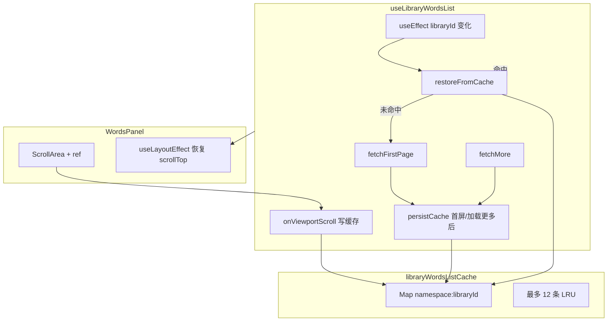

# 资源库词条列表：会话内缓存与滚动位置恢复

> 解决用户在 **单词库 / 经典语句库** 右侧词条列表中切换库、离开页面再返回时，已加载分页与 **滚动位置丢失** 的问题。  
> 对应提交：`504a5f93`（feat: 资料库增加缓存效果）。  
> 列表网络重试、世代号丢弃过期响应见 [`english-learning-list-network-retry.md`](./english-learning-list-network-retry.md)；资源库删除与 UX 见 [`english-learning-library-ux-and-delete.md`](./english-learning-library-ux-and-delete.md)。

若与仓库最新源码不一致，**以源码为准**。

---

## 1. 背景与目标

### 1.1 用户视角

在英语学习 **资源库** 页：

1. 选中某个库，滚动加载多页词条；
2. 切换到左侧另一个库，或暂时切到别的 Tab / 路由；
3. 再选回刚才的库。

**改前**：右侧列表回到首屏，只显示第一页，滚动条在顶部，需要重新滚到底并等待加载更多。

**改后**：在同一会话（不刷新整页）内，**立即恢复** 上次已加载的 `items`、分页游标（`offset` / `hasMore`）和 **滚动条位置**。

### 1.2 设计约束

| 约束 | 说明 |
| ---- | ---- |
| 会话内 | 使用模块级 `Map` 内存缓存，**刷新浏览器即清空** |
| 命名空间 | 单词库 `vocab`、经典句库 `classic` 分开，避免 id 碰撞 |
| 容量 | 最多保留 **12** 个库条目，超出按 LRU 淘汰 |
| 失效 | 删除库时调用 `invalidateLibraryWordsListCache`，避免展示已删库数据 |
| 不替代网络层 | 仍保留 `loadGenRef`、重试、`silent` 等既有逻辑；缓存命中时 **不发起首屏 GET** |

---

## 2. 改动范围

| 说明 | 路径 |
| ---- | ---- |
| 缓存模块（新建） | `apps/frontend/src/views/englishLearning/library/libraryWordsListCache.ts` |
| 分页 Hook 扩展 | `apps/frontend/src/views/englishLearning/library/useLibraryWordsList.ts` |
| 单词库右侧面板 | `apps/frontend/src/views/englishLearning/library/VocabularyLibraryWordsPanel.tsx` |
| 经典句库右侧面板 | `apps/frontend/src/views/englishLearning/library/ClassicQuotesLibraryWordsPanel.tsx` |
| 资源库页（删除失效） | `apps/frontend/src/views/englishLearning/library/EnglishLearningLibraryPage.tsx` |

---

## 3. 实现思路与过程

### 3.1 总体数据流



### 3.2 分步落地过程

**步骤 1 — 抽出纯函数缓存模块**

- 定义 `LibraryWordsListCacheEntry`：`items`、`resolvedLibrary`、`offset`、`hasMore`、`scrollTop`。
- 用 `namespace:libraryId` 作为 key；`get` 时 touch LRU，`set` 后若超过 12 条则淘汰最久未访问项。
- 导出 `invalidateLibraryWordsListCache` 供删除库时使用。

**步骤 2 — 扩展 `useLibraryWordsList`**

- 新增可选参数 `cacheNamespace`；未传则 **不启用缓存**（行为与改前一致）。
- `libraryId` 变化时：先 `restoreFromCache`；成功则跳过 `fetchFirstPage`。
- 首屏 / 加载更多成功后 `persistCache`；滚动时 `onViewportScroll` 同步更新 `scrollTop` 与当前 `items`。
- `restoreFromCache` 时 `loadGenRef++`，避免进行中的旧请求写回状态。
- 返回 `initialScrollTop` 供面板在 layout 阶段恢复滚动。

**步骤 3 — 面板恢复滚动**

- `ScrollArea` 挂 `ref` 到内部 viewport（与 `@ui` ScrollArea 转发 ref 约定一致）。
- `useLayoutEffect` 在 DOM 提交后、绘制前设置 `el.scrollTop = initialScrollTop`，减少「先闪到顶部再跳下去」的视觉跳动。

**步骤 4 — 删除库时失效缓存**

- `EnglishLearningLibraryPage.onLibraryDeleted` 中根据当前 `kind`（`vocab` | `classic`）调用 `invalidateLibraryWordsListCache(kind, deletedId)`。

### 3.3 关键权衡

| 方案 | 优点 | 未采用原因 |
| ---- | ---- | ---------- |
| `sessionStorage` 持久化 | 刷新后仍保留 | 体积与序列化成本；本轮仅需会话内体验 |
| 每次切库都重新请求 | 数据最新 | 慢、浪费流量，体验差 |
| 仅缓存 `items` 不缓存 `scrollTop` | 实现简单 | 列表恢复了但滚动仍在顶部 |
| **内存 Map + LRU + scrollTop** | 快、实现集中 | **采用**；需注意删除库失效 |

---

## 4. 关键代码与注释

### 4.1 缓存条目与 LRU 存储

**来源**：`apps/frontend/src/views/englishLearning/library/libraryWordsListCache.ts`（约 L5–L77）

```typescript
/** 单个库在会话内的列表快照 */
export type LibraryWordsListCacheEntry<TItem, TLibrary> = {
	items: TItem[]; // 已加载的全部词条行
	resolvedLibrary: TLibrary | null; // 库元信息（标题等），与 items 一并恢复
	offset: number; // 下次 fetchMore 使用的 offset（= 当前 items.length）
	hasMore: boolean; // 是否还可能加载更多
	scrollTop: number; // ScrollArea viewport 的 scrollTop
};

const MAX_CACHE_ENTRIES = 12; // 同时缓存的库数量上限，防止内存无限增长

/** 模块级单例：刷新页面即清空 */
const store = new Map<string, CacheSlot<unknown, unknown>>();

function cacheKey(namespace: string, libraryId: string): string {
	// vocab / classic 与 libraryId 组合，避免两类库 id 相同导致串数据
	return `${namespace}:${libraryId}`;
}

/** 读取时更新 lastAccess 并移到 Map 末尾，实现 LRU「最近使用」 */
function touchLru(key: string, slot: CacheSlot<unknown, unknown>) {
	store.delete(key);
	slot.lastAccess = Date.now();
	store.set(key, slot);
}

function evictIfNeeded() {
	while (store.size > MAX_CACHE_ENTRIES) {
		let oldestKey: string | null = null;
		let oldest = Infinity;
		for (const [key, slot] of store) {
			if (slot.lastAccess < oldest) {
				oldest = slot.lastAccess;
				oldestKey = key;
			}
		}
		if (!oldestKey) break;
		store.delete(oldestKey); // 淘汰最久未访问的库
	}
}

export function invalidateLibraryWordsListCache(
	namespace: string,
	libraryId: string,
) {
	store.delete(cacheKey(namespace, libraryId));
}
```

### 4.2 Hook：写入缓存与从缓存恢复

**来源**：`apps/frontend/src/views/englishLearning/library/useLibraryWordsList.ts`（约 L61–L219）

```typescript
const scrollTopRef = useRef(0); // 与 state 分离，避免每次滚动都触发重渲染

/** 首屏 / 加载更多成功后，把当前分页状态写入缓存 */
const persistCache = useCallback(
	(id: string, snapshot: { items: TItem[]; resolvedLibrary: TLibrary | null }) => {
		if (!cacheNamespace) return; // 未配置命名空间则不缓存
		setLibraryWordsListCache(cacheNamespace, id, {
			items: snapshot.items,
			resolvedLibrary: snapshot.resolvedLibrary,
			offset: offsetRef.current,
			hasMore: hasMoreRef.current,
			scrollTop: scrollTopRef.current,
		});
	},
	[cacheNamespace],
);

const restoreFromCache = useCallback((id: string) => {
	if (!cacheNamespace) return false;
	const cached = getLibraryWordsListCache<TItem, TLibrary>(cacheNamespace, id);
	if (!cached) return false;

	loadGenRef.current += 1; // 作废切换前可能仍在飞的请求
	offsetRef.current = cached.offset;
	hasMoreRef.current = cached.hasMore;
	scrollTopRef.current = cached.scrollTop;
	setItems(cached.items);
	setResolvedLibrary(cached.resolvedLibrary);
	setInitialScrollTop(cached.scrollTop); // 交给面板 useLayoutEffect 写 DOM
	setLoading(false);
	setLoadingMore(false);
	fetchingMoreRef.current = false;
	return true;
}, [cacheNamespace]);

useEffect(() => {
	libraryIdRef.current = libraryId;
	if (!libraryId) {
		loadGenRef.current += 1;
		setItems([]);
		setResolvedLibrary(null);
		setInitialScrollTop(0);
		return;
	}
	// 优先走缓存：命中则不再 fetchFirstPage
	if (restoreFromCache(libraryId)) {
		return;
	}
	const gen = ++loadGenRef.current;
	void fetchFirstPage(libraryId, gen);
}, [libraryId, fetchFirstPage, restoreFromCache]);
```

### 4.3 Hook：滚动时更新 scrollTop

**来源**：`apps/frontend/src/views/englishLearning/library/useLibraryWordsList.ts`（约 L221–L244）

```typescript
const onViewportScroll = useCallback<UIEventHandler<HTMLDivElement>>(
	(e) => {
		const el = e.currentTarget;
		scrollTopRef.current = el.scrollTop;

		// 滚动过程中持续写缓存，切库再回来时能回到当前阅读位置
		if (libraryIdRef.current && cacheNamespace) {
			setLibraryWordsListCache(cacheNamespace, libraryIdRef.current, {
				items,
				resolvedLibrary,
				offset: offsetRef.current,
				hasMore: hasMoreRef.current,
				scrollTop: el.scrollTop,
			});
		}

		const rest = el.scrollHeight - el.scrollTop - el.clientHeight;
		if (rest < SCROLL_LOAD_THRESHOLD_PX) {
			void fetchMore(); // 原有触底加载逻辑不变
		}
	},
	[cacheNamespace, fetchMore, items, resolvedLibrary],
);
```

说明：`onViewportScroll` 依赖 `items` / `resolvedLibrary`，滚动时会用当前列表快照更新缓存；条目很多时写缓存频率与滚动事件一致，但仅内存赋值，开销可接受。

### 4.4 首屏与加载更多成功后写入缓存

**来源**：`apps/frontend/src/views/englishLearning/library/useLibraryWordsList.ts`（`fetchFirstPage` 约 L90–L128；`fetchMore` 约 L133–L178）

```typescript
// 首屏：无缓存命中时才执行；成功后写入缓存供下次 restoreFromCache
const fetchFirstPage = useCallback(async (id: string, gen: number) => {
	setInitialScrollTop(0); // 新拉首屏，滚动从顶开始
	scrollTopRef.current = 0;
	// ...
	const list = Array.isArray(data.items) ? data.items : [];
	setItems(list);
	offsetRef.current = list.length;
	hasMoreRef.current = list.length >= pageSize;
	persistCache(id, { items: list, resolvedLibrary: resolved });
}, [/* ... */]);

// 加载更多：在 setItems 回调内合并 chunk 并 persist，保证 items 与 offset 一致
setItems((prev) => {
	const next = [...prev, ...chunk];
	offsetRef.current = next.length;
	hasMoreRef.current = chunk.length >= pageSize;
	persistCache(id, { items: next, resolvedLibrary });
	return next;
});
// 若 chunk 为空：仅更新 hasMore，仍 persist 当前 prev，避免切回后误判可继续加载
```

### 4.5 面板：`useLayoutEffect` 恢复滚动

**来源**：`apps/frontend/src/views/englishLearning/library/VocabularyLibraryWordsPanel.tsx`（约 L61–L83、L181 附近）

```typescript
const scrollViewportRef = useRef<HTMLDivElement>(null);

const {
	items,
	resolvedLibrary,
	loading,
	loadingMore,
	initialScrollTop, // 从 Hook 读出缓存的 scrollTop
	onViewportScroll,
} = useLibraryWordsList({
	libraryId,
	cacheNamespace: 'vocab', // 经典句面板为 'classic'
	fetchPage: fetchVocabPage,
});

/**
 * 在浏览器绘制前设置 scrollTop，避免用户看到「先顶后跳」。
 * 仅当 initialScrollTop > 0 时执行（首进库为 0 不需要）。
 */
useLayoutEffect(() => {
	const el = scrollViewportRef.current;
	if (!el || initialScrollTop <= 0) return;
	el.scrollTop = initialScrollTop;
}, [libraryId, initialScrollTop]);

// JSX 中：
// <ScrollArea ref={scrollViewportRef} onScroll={onViewportScroll} ... />
```

经典句库 `ClassicQuotesLibraryWordsPanel.tsx` 结构相同，仅 `cacheNamespace: 'classic'`。

### 4.6 删除库时使缓存失效

**来源**：`apps/frontend/src/views/englishLearning/library/EnglishLearningLibraryPage.tsx`（`onLibraryDeleted` 约 L65–L85）

```typescript
const onLibraryDeleted = useCallback(
	(deletedId: string) => {
		// kind 与面板 cacheNamespace（'vocab' | 'classic'）一致
		invalidateLibraryWordsListCache(kind, deletedId);
		setSelectedLibrary(null);
		setSearchParams(
			(prev) => {
				const next = new URLSearchParams(prev);
				next.delete('library'); // 避免 URL 仍指向已删库
				return next;
			},
			{ replace: true },
		);
	},
	[kind, setSearchParams],
);
```

---

## 5. 行为变化小结

| 场景 | 改前 | 改后 |
| ---- | ---- | ---- |
| A 库滚到第 3 页后切到 B 库，再切回 A | 仅首屏，滚动在顶部 | 恢复 A 的 items、hasMore 与滚动位置 |
| 首次进入某库 | 请求首屏 GET | 无缓存则仍请求首屏 GET |
| 刷新浏览器 | — | 缓存清空，行为同改前首进 |
| 删除某库 | — | 对应缓存项删除，不会误恢复 |
| 未传 `cacheNamespace` 的调用方 | — | 与改前完全一致（不读写缓存） |

**与收藏星标**：切回缓存列表时 `items` 立即恢复，增量收藏 Hook 仍按 `itemsWordSig` 工作；已查过的 key 在 `queriedKeysRef` 中（组件未卸载时保留），一般 **不会** 对整表重复 `/status`。

---

## 6. 兼容性与风险

| 项 | 说明 |
| -- | ---- |
| API | 无契约变更；缓存命中时 **减少** 重复 GET |
| 内存 | 单库缓存含已加载 `items` 数组，12 库上限控制峰值 |
| 数据新鲜度 | 会话内不自动失效；若库内容在别处被改，切回可能看到旧列表，直到用户下拉刷新或重进且无缓存 |
| 滚动写缓存 | 快速滚动时频繁 `setLibraryWordsListCache`，仅更新内存 Map |
| `loadGen` | 恢复缓存时递增，与网络重试文档中的「丢弃过期响应」一致 |

---

## 7. 建议回归测试

1. 单词库：选库 A → 滚到底加载 2～3 页 → 选库 B → 再选 A → 条目与滚动位置应恢复。
2. 经典语句库：重复上一步（`cacheNamespace: 'classic'`）。
3. 删除正在查看的库：确认右侧清空，再次导入/创建同名库不会误用旧缓存（id 不同则自然隔离；同 id 删除后已 invalidate）。
4. 刷新页面：缓存丢失，首屏重新请求。
5. 缓存命中时 Network：切回已访问库不应再出现首屏 `offset=0` 的 GET（除非缓存被 LRU 淘汰）。

---

## 8. 相关源码与文档

| 说明 | 路径 |
| ---- | ---- |
| 缓存模块 | `apps/frontend/src/views/englishLearning/library/libraryWordsListCache.ts` |
| 分页 Hook | `apps/frontend/src/views/englishLearning/library/useLibraryWordsList.ts` |
| 列表网络重试 | [`english-learning-list-network-retry.md`](./english-learning-list-network-retry.md) |
| 收藏星标增量 | [`favorite-star-incremental-ui.md`](./favorite-star-incremental-ui.md) |
| 资源库删除 UX | [`english-learning-library-ux-and-delete.md`](./english-learning-library-ux-and-delete.md) |
